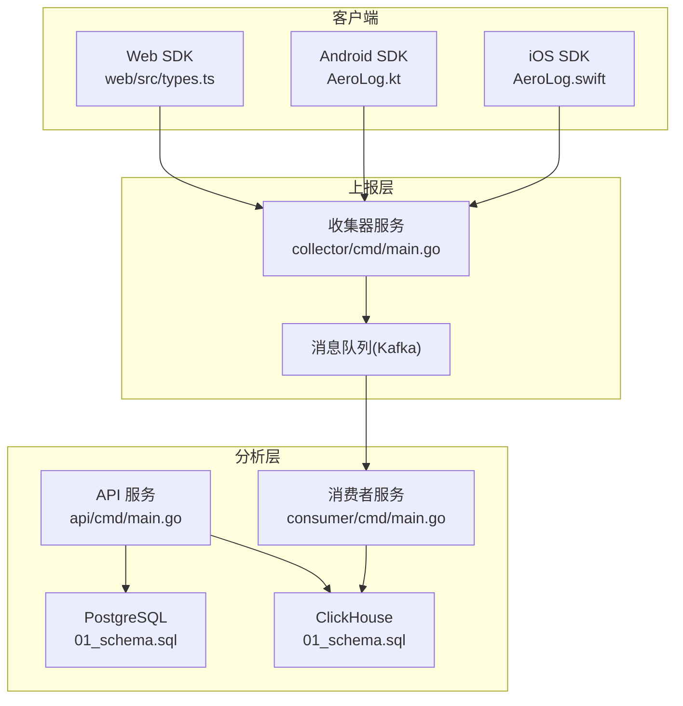
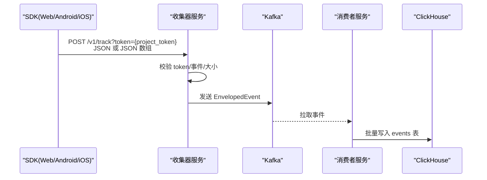
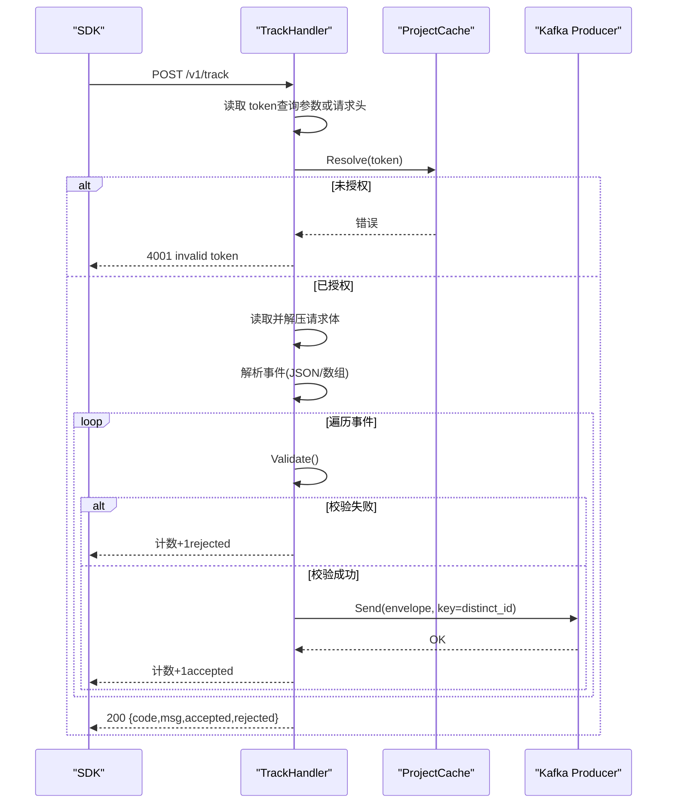
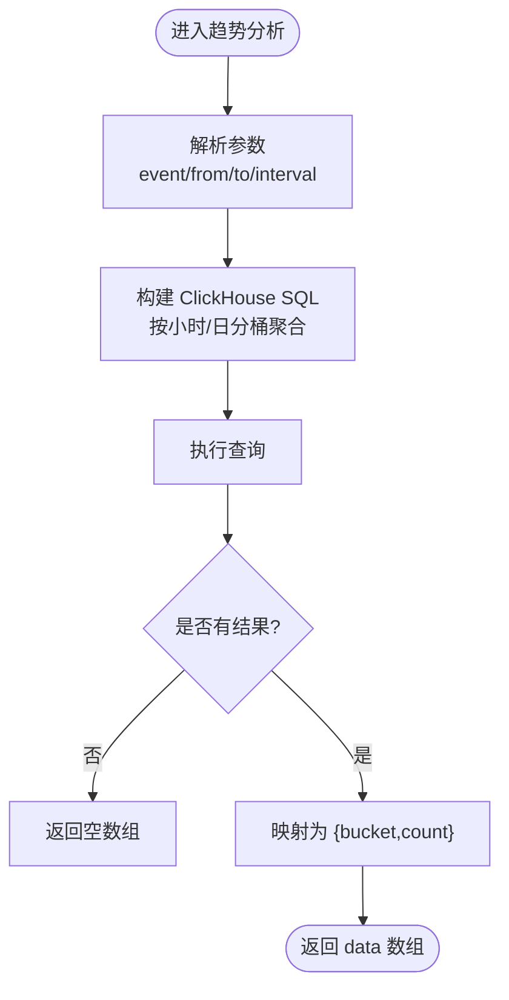
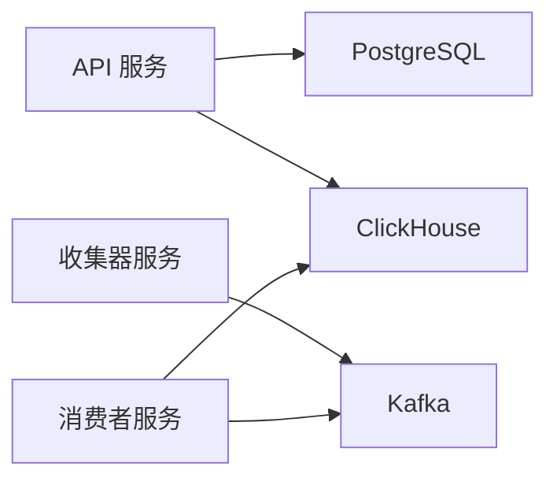

# API参考

<cite>
**本文引用的文件**
- [server/api/cmd/main.go](file://server/api/cmd/main.go)
- [server/api/internal/handler/analytics.go](file://server/api/internal/handler/analytics.go)
- [server/api/internal/handler/project.go](file://server/api/internal/handler/project.go)
- [server/api/internal/handler/governance.go](file://server/api/internal/handler/governance.go)
- [server/api/internal/config/config.go](file://server/api/internal/config/config.go)
- [server/collector/internal/handler/track.go](file://server/collector/internal/handler/track.go)
- [server/collector/internal/config/config.go](file://server/collector/internal/config/config.go)
- [server/consumer/internal/metadata/syncer.go](file://server/consumer/internal/metadata/syncer.go)
- [server/consumer/internal/config/config.go](file://server/consumer/internal/config/config.go)
- [server/pkg/model/event.go](file://server/pkg/model/event.go)
- [deploy/init/postgres/01_schema.sql](file://deploy/init/postgres/01_schema.sql)
- [deploy/init/clickhouse/01_schema.sql](file://deploy/init/clickhouse/01_schema.sql)
- [web/src/lib/api.ts](file://web/src/lib/api.ts)
- [sdk/web/src/types.ts](file://sdk/web/src/types.ts)
- [sdk/android/aerolog/src/main/java/dev/aerolog/sdk/AeroLog.kt](file://sdk/android/aerolog/src/main/java/dev/aerolog/sdk/AeroLog.kt)
- [sdk/ios/Sources/AeroLog/AeroLog.swift](file://sdk/ios/Sources/AeroLog/AeroLog.swift)
- [web/src/app/console/debugger/page.tsx](file://web/src/app/console/debugger/page.tsx)
</cite>

## 更新摘要
**所做更改**
- 新增事件模式管理API端点：PUT /projects/:id/events/:event/schema
- 更新调试事件查询API：支持全局模式查询
- 新增治理API端点：调试事件查询与模式问题诊断
- 更新数据库模式：事件定义表新增schema_required_props和schema_locked字段

## 目录
1. [简介](#简介)
2. [项目结构](#项目结构)
3. [核心组件](#核心组件)
4. [架构总览](#架构总览)
5. [详细组件分析](#详细组件分析)
6. [依赖分析](#依赖分析)
7. [性能考虑](#性能考虑)
8. [故障排查指南](#故障排查指南)
9. [结论](#结论)
10. [附录](#附录)

## 简介
本文件为 AeroLog 的完整 API 参考文档，涵盖以下内容：
- 事件上报接口：用于 SDK 将事件数据上报至收集器。
- 分析查询接口：提供事件趋势、热门事件、漏斗分析、留存分析等。
- 项目管理接口：提供项目创建、查询与事件定义列表。
- 事件模式管理接口：支持事件Schema定义与锁定。
- 治理查询接口：提供调试事件查询与模式问题诊断。
- 认证与权限：基于项目 Token 的访问控制与鉴权流程。
- 分页与过滤：查询参数的分页、过滤与排序规则。
- API 版本与兼容性：当前采用 /v1 路由，向后兼容策略建议。
- 测试与模拟：前端 API 客户端与 SDK 使用示例。

## 项目结构
AeroLog 后端由三个子服务组成：
- API 服务：提供 /v1 项目与分析查询接口，连接 PostgreSQL 与 ClickHouse。
- 收集器服务：接收 SDK 上报，进行基本校验与投递到消息队列。
- 消费者服务：从消息队列拉取事件，写入 ClickHouse。

**图表来源**
- [server/api/cmd/main.go:13-25](file://server/api/cmd/main.go#L13-L25)
- [server/collector/cmd/main.go:22-54](file://server/collector/cmd/main.go#L22-L54)
- [server/consumer/cmd/main.go:18-54](file://server/consumer/cmd/main.go#L18-L54)
- [deploy/init/postgres/01_schema.sql:18-28](file://deploy/init/postgres/01_schema.sql#L18-L28)
- [deploy/init/clickhouse/01_schema.sql:6-42](file://deploy/init/clickhouse/01_schema.sql#L6-L42)

**章节来源**
- [server/api/cmd/main.go:13-25](file://server/api/cmd/main.go#L13-L25)
- [server/collector/cmd/main.go:22-54](file://server/collector/cmd/main.go#L22-L54)
- [server/consumer/cmd/main.go:18-54](file://server/consumer/cmd/main.go#L18-L54)
- [deploy/init/postgres/01_schema.sql:18-28](file://deploy/init/postgres/01_schema.sql#L18-L28)
- [deploy/init/clickhouse/01_schema.sql:6-42](file://deploy/init/clickhouse/01_schema.sql#L6-L42)

## 核心组件
- API 服务（Gin）：注册 /v1 路由，连接 PostgreSQL 与 ClickHouse，暴露项目与分析接口。
- 收集器服务（Gin）：处理 /v1/track，基于项目 Token 解析项目 ID，校验事件并投递到 Kafka。
- 消费者服务（Kafka 消费者）：批量拉取事件，写入 ClickHouse。
- 数据模型：统一事件结构，支持多类型事件与属性。
- 前端 API 客户端：封装 /v1 项目与分析接口调用。
- SDK：Web/Android/iOS 三端上报事件，遵循统一事件结构。

**章节来源**
- [server/api/internal/handler/project.go:25-34](file://server/api/internal/handler/project.go#L25-L34)
- [server/api/internal/handler/analytics.go:27-32](file://server/api/internal/handler/analytics.go#L27-L32)
- [server/collector/internal/handler/track.go:47-51](file://server/collector/internal/handler/track.go#L47-L51)
- [server/pkg/model/event.go:27-60](file://server/pkg/model/event.go#L27-L60)
- [web/src/lib/api.ts:33-75](file://web/src/lib/api.ts#L33-L75)
- [sdk/web/src/types.ts:16-25](file://sdk/web/src/types.ts#L16-L25)

## 架构总览
AeroLog 采用"上报-存储-查询"三层架构：
- 上报层：SDK 将事件发送到收集器，收集器进行基础校验并投递到消息队列。
- 存储层：消费者从消息队列读取事件，批量写入 ClickHouse；元数据保存在 PostgreSQL。
- 查询层：API 服务通过 PostgreSQL 获取项目与事件定义，通过 ClickHouse 执行分析查询。

**图表来源**
- [server/collector/internal/handler/track.go:60-133](file://server/collector/internal/handler/track.go#L60-L133)
- [server/pkg/model/event.go:62-74](file://server/pkg/model/event.go#L62-L74)
- [server/consumer/cmd/main.go:34-51](file://server/consumer/cmd/main.go#L34-L51)
- [deploy/init/clickhouse/01_schema.sql:6-42](file://deploy/init/clickhouse/01_schema.sql#L6-L42)

## 详细组件分析

### 事件上报接口
- 路径：POST /v1/track
- 功能：接收 SDK 上报的事件，进行基础校验后投递到消息队列。
- 认证方式：支持查询参数 token 或请求头 X-AeroLog-Token。
- 请求参数
  - 查询参数
    - token: 项目令牌（可选，优先级低于请求头）
  - 请求头
    - Content-Type: application/json
    - X-AeroLog-Token: 项目令牌（推荐）
    - X-AeroLog-SDK: SDK 类型与版本（Android/iOS/Web/Server）
  - 请求体
    - 单个事件对象或事件对象数组
    - 事件字段遵循统一模型（见"数据模型"）
- 成功响应
  - 结构：包含 accepted/rejected 计数与状态信息
  - 示例路径：[响应示例:53-58](file://server/collector/internal/handler/track.go#L53-L58)
- 错误码
  - 4001：无效 token
  - 4004：请求体非法（空体、JSON 解析失败、gzip 解压失败）
  - 5001：队列不可用（Kafka 发送失败）

**图表来源**
- [server/collector/internal/handler/track.go:60-133](file://server/collector/internal/handler/track.go#L60-L133)
- [server/pkg/model/event.go:40-60](file://server/pkg/model/event.go#L40-L60)

**章节来源**
- [server/collector/internal/handler/track.go:47-51](file://server/collector/internal/handler/track.go#L47-L51)
- [server/collector/internal/handler/track.go:60-133](file://server/collector/internal/handler/track.go#L60-L133)
- [server/pkg/model/event.go:27-60](file://server/pkg/model/event.go#L27-L60)

### 分析查询接口
- 路由前缀：/v1/projects/{id}/analytics
- 认证：需要项目存在且已授权（由收集器侧 token 校验保障）
- 查询参数通用约定
  - from/to：毫秒时间戳，默认最近 7 天
  - limit：结果上限（如适用）
  - interval：hour/day（趋势分析）
- 接口清单
  - GET /trend
    - 参数：event（必填）、from/to、interval（hour/day）
    - 响应：按时间桶聚合的事件次数
    - 示例路径：[趋势查询:34-74](file://server/api/internal/handler/analytics.go#L34-L74)
  - GET /top_events
    - 参数：from/to、limit
    - 响应：事件名、事件次数、独立用户数
    - 示例路径：[热门事件:76-112](file://server/api/internal/handler/analytics.go#L76-L112)
  - POST /funnel
    - 请求体：events（2..8 个事件序列）、from/to、window_seconds
    - 响应：每一步的用户数与转化率
    - 示例路径：[漏斗分析:119-199](file://server/api/internal/handler/analytics.go#L119-L199)
  - GET /retention
    - 参数：initial_event、return_event、from/to、days（默认 7，上限 30）
    - 响应：按 cohort 统计的留存矩阵
    - 示例路径：[留存分析:201-283](file://server/api/internal/handler/analytics.go#L201-L283)

**图表来源**
- [server/api/internal/handler/analytics.go:34-74](file://server/api/internal/handler/analytics.go#L34-L74)

**章节来源**
- [server/api/internal/handler/analytics.go:27-32](file://server/api/internal/handler/analytics.go#L27-L32)
- [server/api/internal/handler/analytics.go:34-283](file://server/api/internal/handler/analytics.go#L34-L283)

### 项目管理接口
- 路由前缀：/v1/projects
- 认证：内部使用，不直接对外公开（由前端 Web 控制台调用 API 服务）
- 接口清单
  - GET /projects
    - 响应：项目列表（最多 200 条）
    - 示例路径：[项目列表:35-51](file://server/api/internal/handler/project.go#L35-L51)
  - POST /projects
    - 请求体：{ name, description? }
    - 响应：{ id, name, token }
    - 示例路径：[创建项目:71-96](file://server/api/internal/handler/project.go#L71-L96)
  - GET /projects/{id}
    - 响应：单个项目详情
    - 示例路径：[获取项目:53-64](file://server/api/internal/handler/project.go#L53-L64)
  - GET /projects/{id}/events
    - 响应：事件定义列表（最多 500 条）
    - 示例路径：[事件定义列表:107-134](file://server/api/internal/handler/project.go#L107-L134)

**章节来源**
- [server/api/internal/handler/project.go:29-134](file://server/api/internal/handler/project.go#L29-L134)

### 事件模式管理接口
- 路由前缀：/v1/projects/{id}/events
- 认证：需要项目存在且已授权
- 接口清单
  - PUT /projects/{id}/events/{event}/schema
    - 功能：更新指定事件的Schema定义，锁定后禁止修改
    - 请求体参数：schema_required_props（必需属性数组）、status（状态）、display_name（显示名）、description（描述）
    - 响应：事件定义详情，包含 schema_required_props、schema_locked、status 等字段
    - 示例路径：[更新Schema:146-204](file://server/api/internal/handler/project.go#L146-L204)
  - GET /projects/{id}/events
    - 功能：获取事件定义列表
    - 响应：事件定义数组，包含 id、name、display_name、description、schema_required_props、schema_locked、status 等
    - 示例路径：[事件列表:109-144](file://server/api/internal/handler/project.go#L109-L144)

**更新** 新增事件模式管理API端点，支持事件Schema的定义与锁定

**章节来源**
- [server/api/internal/handler/project.go:104-204](file://server/api/internal/handler/project.go#L104-L204)
- [deploy/init/postgres/01_schema.sql:38-53](file://deploy/init/postgres/01_schema.sql#L38-L53)

### 治理查询接口
- 路由前缀：/v1/projects/{id}
- 认证：需要项目存在且已授权
- 接口清单
  - GET /debug/events
    - 功能：查询调试事件，支持全局模式查询
    - 查询参数：limit（默认100，最大500）、event（事件名）、result（结果类型）、distinct_id（去重ID）、include_global（是否包含全局模式）
    - 响应：调试事件数组，包含 id、project_id、event、event_type、distinct_id、user_id、anonymous_id、result、reason、payload、received_at、created_at
    - 示例路径：[调试事件查询:160-228](file://server/api/internal/handler/governance.go#L160-L228)
  - GET /debug/schema_issues
    - 功能：查询Schema问题
    - 查询参数：limit（默认100，最大500）、event（事件名）、property（属性名）
    - 响应：Schema问题数组，包含 id、event、property、expected_type、actual_type、severity、message、payload、observed_at、created_at
    - 示例路径：[Schema问题查询:230-285](file://server/api/internal/handler/governance.go#L230-L285)
  - GET /properties
    - 功能：获取属性定义列表
    - 查询参数：scope（作用域：event/user，默认为空表示全部）
    - 响应：属性定义数组，包含 id、name、display_name、data_type、scope、description、schema_required、schema_locked、enum_values、status、first_seen、last_seen
    - 示例路径：[属性列表:31-85](file://server/api/internal/handler/governance.go#L31-L85)
  - PUT /properties/{property}/schema
    - 功能：更新属性Schema定义
    - 请求体参数：scope（作用域：event/user）、data_type（数据类型）、schema_required（是否必需）、enum_values（枚举值数组）、display_name、description
    - 响应：属性定义详情
    - 示例路径：[更新属性Schema:87-158](file://server/api/internal/handler/governance.go#L87-L158)

**更新** 新增调试事件查询API，支持include_global参数实现全局模式查询

**章节来源**
- [server/api/internal/handler/governance.go:21-285](file://server/api/internal/handler/governance.go#L21-L285)

### 数据模型
- 事件类型
  - track：普通事件
  - profile_set/profile_set_once/profile_increment/profile_unset/profile_delete：用户属性操作
- 统一事件结构
  - type、event、distinct_id、anonymous_id、user_id、time、lib、properties
- 校验规则
  - type 必填；track 类型需 event 非空；distinct_id、time 必填且长度限制
- 包装事件（投递到消息队列）
  - EnvelopedEvent：包含 project_id、ip、ua、received_at、event

**章节来源**
- [server/pkg/model/event.go:9-60](file://server/pkg/model/event.go#L9-L60)
- [server/pkg/model/event.go:62-83](file://server/pkg/model/event.go#L62-L83)

### 前端 API 客户端与 SDK 使用
- 前端 API 客户端
  - 基础地址：NEXT_PUBLIC_API_BASE，默认 http://localhost:8082
  - 方法：列出项目、创建项目、获取项目、趋势、热门事件、漏斗、留存
  - 示例路径：[API 客户端:33-75](file://web/src/lib/api.ts#L33-L75)
- Web SDK 事件结构
  - 与服务端统一，包含 type、event、distinct_id、time、lib、properties
  - 示例路径：[Web 类型定义:16-25](file://sdk/web/src/types.ts#L16-L25)
- Android/iOS SDK
  - 自动采集生命周期与页面事件，支持批量上报与本地持久化
  - 示例路径：[Android SDK:175-190](file://sdk/android/aerolog/src/main/java/dev/aerolog/sdk/AeroLog.kt#L175-L190)，[iOS SDK:158-181](file://sdk/ios/Sources/AeroLog/AeroLog.swift#L158-L181)

**章节来源**
- [web/src/lib/api.ts:3-19](file://web/src/lib/api.ts#L3-L19)
- [web/src/lib/api.ts:33-75](file://web/src/lib/api.ts#L33-L75)
- [sdk/web/src/types.ts:16-25](file://sdk/web/src/types.ts#L16-L25)
- [sdk/android/aerolog/src/main/java/dev/aerolog/sdk/AeroLog.kt:175-190](file://sdk/android/aerolog/src/main/java/dev/aerolog/sdk/AeroLog.kt#L175-L190)
- [sdk/ios/Sources/AeroLog/AeroLog.swift:158-181](file://sdk/ios/Sources/AeroLog/AeroLog.swift#L158-L181)

## 依赖分析
- API 服务依赖
  - PostgreSQL：存储项目与事件定义元数据
  - ClickHouse：存储事件明细与执行分析查询
- 收集器服务依赖
  - Kafka：作为事件传输通道
  - 项目缓存：基于项目 token 快速解析项目 ID
- 消费者服务依赖
  - Kafka：消费事件
  - ClickHouse：批量写入 events 表

**图表来源**
- [server/api/cmd/main.go:18-25](file://server/api/cmd/main.go#L18-L25)
- [server/collector/cmd/main.go:22-54](file://server/collector/cmd/main.go#L22-L54)
- [server/consumer/cmd/main.go:18-54](file://server/consumer/cmd/main.go#L18-L54)

**章节来源**
- [server/api/cmd/main.go:18-25](file://server/api/cmd/main.go#L18-L25)
- [server/collector/cmd/main.go:22-54](file://server/collector/cmd/main.go#L22-L54)
- [server/consumer/cmd/main.go:18-54](file://server/consumer/cmd/main.go#L18-L54)

## 性能考虑
- 查询性能
  - ClickHouse 表按 project_id + 月分区，使用时间范围过滤与分桶聚合提升查询效率
  - 漏斗与留存分析使用窗口函数与 CTE，注意 from/to 与 days 参数合理设置
- 写入性能
  - 消费者使用 Buffer 引擎与批量写入策略，降低写入延迟
- 网络与并发
  - 收集器对请求体大小限制，避免过大负载
  - API 服务与消费者均提供指标端点，便于监控

## 故障排查指南
- 上报失败
  - 检查 token 是否正确传递（查询参数或请求头）
  - 查看响应中的 code/msg 与 accepted/rejected 计数
  - 若队列不可用（5001），检查 Kafka 连接与主题配置
- 查询异常
  - 确认 from/to 参数范围合理，避免过长区间导致超时
  - 漏斗分析确保 events 数量在 2..8 之间
- 数据未入库
  - 检查消费者运行状态与 Kafka 消费进度
  - 核对 ClickHouse 表结构与分区策略

**章节来源**
- [server/collector/internal/handler/track.go:60-133](file://server/collector/internal/handler/track.go#L60-L133)
- [server/api/internal/handler/analytics.go:119-199](file://server/api/internal/handler/analytics.go#L119-L199)
- [server/consumer/cmd/main.go:34-51](file://server/consumer/cmd/main.go#L34-L51)

## 结论
AeroLog 提供了清晰的事件上报与分析查询能力，结合 PostgreSQL 与 ClickHouse 的组合，满足高吞吐与高性能分析需求。通过项目 Token 实现基础访问控制，配合前端 API 客户端与多端 SDK，可快速完成埋点与数据分析闭环。

## 附录

### 认证与权限控制
- 认证机制
  - 上报接口：使用项目 token（查询参数 token 或请求头 X-AeroLog-Token）
  - API 查询接口：由收集器侧 token 校验保障，API 层不重复校验
- 权限控制
  - 项目成员角色（数据库中定义）用于管理后台权限控制（非本 API 文档范围）
- 最佳实践
  - 严格保密项目 token，避免泄露
  - 在生产环境配置 CORS 与 TLS

**章节来源**
- [server/collector/internal/handler/track.go:67-76](file://server/collector/internal/handler/track.go#L67-L76)
- [server/api/internal/config/config.go:35-36](file://server/api/internal/config/config.go#L35-L36)
- [deploy/init/postgres/01_schema.sql:30-36](file://deploy/init/postgres/01_schema.sql#L30-L36)

### 分页、过滤与排序
- 分页
  - 项目列表：LIMIT 200
  - 事件定义列表：LIMIT 500
  - 调试事件查询：LIMIT 500
  - 属性定义列表：LIMIT 1000
- 过滤
  - 时间范围：from/to（毫秒时间戳）
  - 事件名：趋势分析的 event 字段
  - 事件序列：漏斗分析的 events 数组
  - 调试事件：支持按 event、result、distinct_id 过滤
- 排序
  - 热门事件：按事件次数降序
  - 趋势分析：按时间桶升序
  - 调试事件：按 created_at 降序
  - 属性定义：按 scope、last_seen 降序

**章节来源**
- [server/api/internal/handler/project.go:36-51](file://server/api/internal/handler/project.go#L36-L51)
- [server/api/internal/handler/project.go:109-134](file://server/api/internal/handler/project.go#L109-L134)
- [server/api/internal/handler/analytics.go:78-112](file://server/api/internal/handler/analytics.go#L78-L112)
- [server/api/internal/handler/analytics.go:40-74](file://server/api/internal/handler/analytics.go#L40-L74)
- [server/api/internal/handler/governance.go:160-228](file://server/api/internal/handler/governance.go#L160-L228)

### API 版本管理与兼容性
- 当前版本：/v1
- 兼容性策略建议
  - 新增字段以向后兼容
  - 不破坏现有字段语义与命名
  - 通过新路由或参数扩展功能，避免删除旧字段

**章节来源**
- [server/api/cmd/main.go:18-25](file://server/api/cmd/main.go#L18-L25)

### API 测试与模拟数据
- 前端 API 客户端
  - 通过 NEXT_PUBLIC_API_BASE 指向 API 服务，封装常用查询方法
  - 示例路径：[API 客户端:33-75](file://web/src/lib/api.ts#L33-L75)
- SDK 模拟
  - Web/Android/iOS SDK 均支持本地持久化与定时 flush，便于离线测试
  - 示例路径：[Android SDK:108-124](file://sdk/android/aerolog/src/main/java/dev/aerolog/sdk/AeroLog.kt#L108-L124)，[iOS SDK:77-82](file://sdk/ios/Sources/AeroLog/AeroLog.swift#L77-L82)
- 调试工具
  - Web 控制台提供调试器页面，支持事件过滤与属性配置
  - 示例路径：[调试器页面:32-68](file://web/src/app/console/debugger/page.tsx#L32-L68)

**章节来源**
- [web/src/lib/api.ts:3-19](file://web/src/lib/api.ts#L3-L19)
- [web/src/lib/api.ts:33-75](file://web/src/lib/api.ts#L33-L75)
- [sdk/android/aerolog/src/main/java/dev/aerolog/sdk/AeroLog.kt:108-124](file://sdk/android/aerolog/src/main/java/dev/aerolog/sdk/AeroLog.kt#L108-L124)
- [sdk/ios/Sources/AeroLog/AeroLog.swift:77-82](file://sdk/ios/Sources/AeroLog/AeroLog.swift#L77-L82)
- [web/src/app/console/debugger/page.tsx:32-68](file://web/src/app/console/debugger/page.tsx#L32-L68)

### 数据库模式更新
- 事件定义表（event_definitions）
  - 新增 schema_required_props：JSONB字段，存储必需属性列表
  - 新增 schema_locked：布尔字段，锁定后禁止修改Schema
- 属性定义表（property_definitions）
  - 新增 schema_required：布尔字段，标记属性是否必需
  - 新增 schema_locked：布尔字段，锁定后禁止修改Schema
  - 新增 enum_values：JSONB字段，存储枚举值列表
- 调试事件表（debug_events）
  - 新增 project_id 可为空，支持全局模式查询
  - 新增索引优化查询性能

**章节来源**
- [deploy/init/postgres/01_schema.sql:38-76](file://deploy/init/postgres/01_schema.sql#L38-L76)
- [deploy/init/postgres/01_schema.sql:114-156](file://deploy/init/postgres/01_schema.sql#L114-L156)
- [server/api/internal/handler/governance.go:462-511](file://server/api/internal/handler/governance.go#L462-L511)
- [server/collector/internal/handler/track.go:219-242](file://server/collector/internal/handler/track.go#L219-L242)