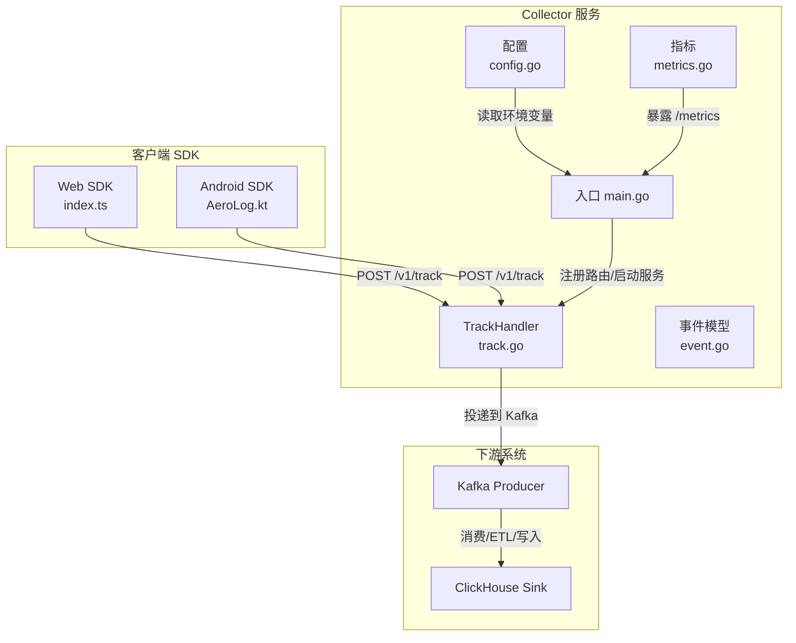
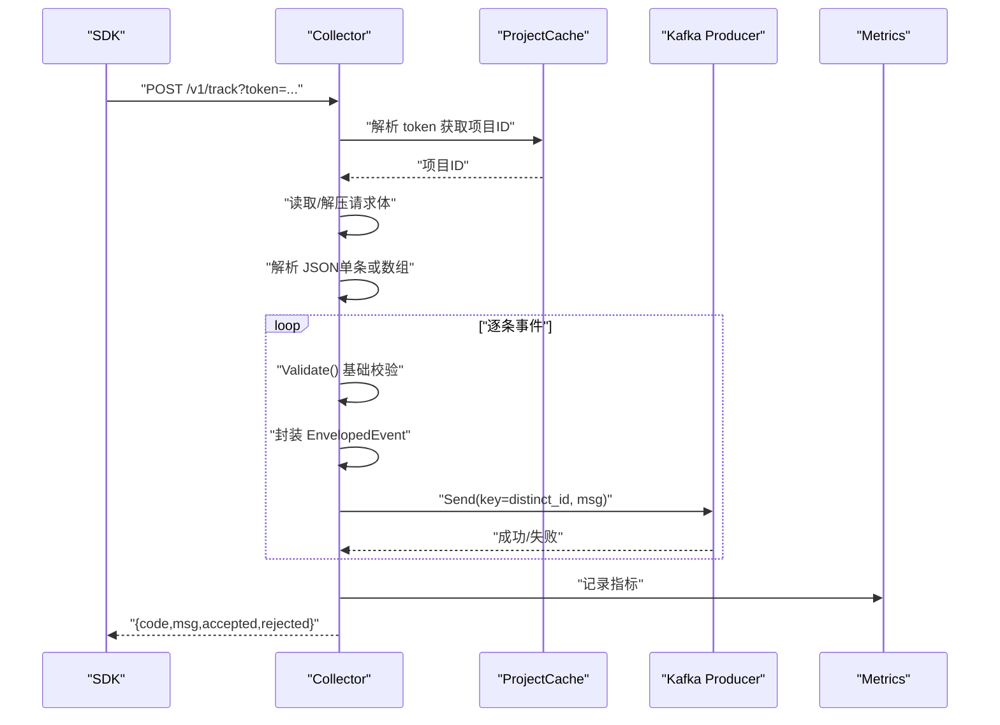
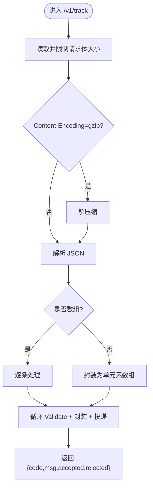
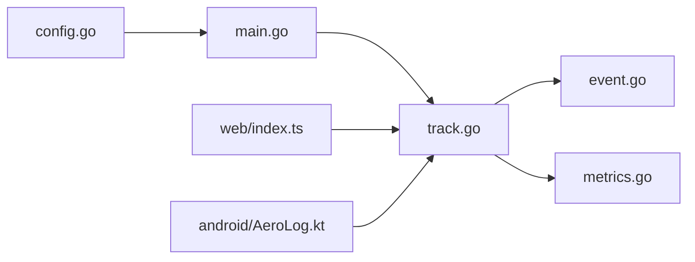

# 事件上报接口

<cite>
**本文引用的文件**
- [server/collector/cmd/main.go](file://server/collector/cmd/main.go)
- [server/collector/internal/handler/track.go](file://server/collector/internal/handler/track.go)
- [server/pkg/model/event.go](file://server/pkg/model/event.go)
- [server/collector/internal/config/config.go](file://server/collector/internal/config/config.go)
- [server/pkg/metrics/metrics.go](file://server/pkg/metrics/metrics.go)
- [sdk/web/src/index.ts](file://sdk/web/src/index.ts)
- [sdk/web/src/types.ts](file://sdk/web/src/types.ts)
- [sdk/web/src/storage.ts](file://sdk/web/src/storage.ts)
- [sdk/web/src/utils.ts](file://sdk/web/src/utils.ts)
- [sdk/android/aerolog/src/main/java/dev/aerolog/sdk/AeroLog.kt](file://sdk/android/aerolog/src/main/java/dev/aerolog/sdk/AeroLog.kt)
- [docs/protocol.md](file://docs/protocol.md)
- [docs/event.schema.json](file://docs/event.schema.json)
</cite>

## 目录
1. [简介](#简介)
2. [项目结构](#项目结构)
3. [核心组件](#核心组件)
4. [架构总览](#架构总览)
5. [详细组件分析](#详细组件分析)
6. [依赖关系分析](#依赖关系分析)
7. [性能考量](#性能考量)
8. [故障排查指南](#故障排查指南)
9. [结论](#结论)
10. [附录](#附录)

## 简介
本文档面向 AeroLog 事件上报接口，聚焦 /v1/track 端点的完整规范，覆盖请求方法、URL 路径、请求头要求、请求体格式、字段定义与验证规则、响应格式与错误码、批量上报实现与性能优化建议，以及 SDK 与 API 的交互协议与最佳实践。目标是帮助开发者快速、正确地集成与优化事件上报能力。

## 项目结构
AeroLog 采用多模块分层设计：
- Collector：接收 SDK 上报，进行鉴权、解析、校验、投递到 Kafka。
- Consumer：从 Kafka 消费事件，清洗、ETL 并写入 ClickHouse。
- API：提供查询与管理接口（与 /v1/track 无直接耦合）。
- SDK：Web/Android/iOS 三端 SDK，负责事件采集、本地持久化与上报。
- 文档：协议与 Schema 定义，指导 SDK 与服务端一致性。

图表来源
- [server/collector/cmd/main.go:22-74](file://server/collector/cmd/main.go#L22-L74)
- [server/collector/internal/handler/track.go:47-51](file://server/collector/internal/handler/track.go#L47-L51)
- [server/pkg/model/event.go:27-37](file://server/pkg/model/event.go#L27-L37)
- [server/collector/internal/config/config.go:19-30](file://server/collector/internal/config/config.go#L19-L30)
- [server/pkg/metrics/metrics.go:51-70](file://server/pkg/metrics/metrics.go#L51-L70)

章节来源
- [server/collector/cmd/main.go:22-74](file://server/collector/cmd/main.go#L22-L74)
- [server/collector/internal/handler/track.go:47-51](file://server/collector/internal/handler/track.go#L47-L51)
- [server/pkg/model/event.go:27-37](file://server/pkg/model/event.go#L27-L37)
- [server/collector/internal/config/config.go:19-30](file://server/collector/internal/config/config.go#L19-L30)
- [server/pkg/metrics/metrics.go:51-70](file://server/pkg/metrics/metrics.go#L51-L70)

## 核心组件
- TrackHandler：处理 /v1/track，完成鉴权、请求体读取与解析、事件校验、封装上下文、投递 Kafka、返回统计结果。
- Event 模型：统一的事件结构，包含类型、事件名、用户标识、时间戳、SDK 信息与自定义属性。
- 配置：从环境变量读取监听地址、Kafka 地址与主题、PostgreSQL DSN、Redis 地址、最大请求体大小等。
- 指标：暴露请求耗时、事件接收总量、Kafka 发送错误计数等指标，便于可观测性。

章节来源
- [server/collector/internal/handler/track.go:39-51](file://server/collector/internal/handler/track.go#L39-L51)
- [server/pkg/model/event.go:27-60](file://server/pkg/model/event.go#L27-L60)
- [server/collector/internal/config/config.go:8-30](file://server/collector/internal/config/config.go#L8-L30)
- [server/pkg/metrics/metrics.go:22-42](file://server/pkg/metrics/metrics.go#L22-L42)

## 架构总览
/v1/track 的端到端流程如下：
- SDK 构造事件，批量发送到 /v1/track。
- Collector 校验 token，解析请求体（支持 gzip），对每条事件执行基础校验。
- 将事件封装为 EnvelopedEvent（包含项目 ID、IP、UA、接收时间），序列化后投递到 Kafka。
- 成功则返回 accepted/rejected 统计；失败返回相应错误码。

图表来源
- [server/collector/internal/handler/track.go:60-133](file://server/collector/internal/handler/track.go#L60-L133)
- [server/pkg/model/event.go:39-60](file://server/pkg/model/event.go#L39-L60)
- [server/pkg/metrics/metrics.go:22-36](file://server/pkg/metrics/metrics.go#L22-L36)

## 详细组件分析

### /v1/track 端点规范
- 方法与路径
  - HTTP 方法：POST
  - 路径：/v1/track
  - 查询参数：token（项目令牌）
- 请求头
  - Content-Type：application/json
  - Content-Encoding：gzip（可选，建议开启）
  - X-AeroLog-SDK：web/1.0.0 或 android/0.1.0（由 SDK 设置）
  - 其他：可选签名头与时间戳头（见协议文档）
- 请求体
  - 支持单条事件对象或数组（批量）
  - 字段定义与约束详见“事件数据字段定义”与“Schema”
- 响应
  - 成功：code=0，msg="ok"，返回 accepted/rejected 计数
  - 失败：返回 code/msg，可能包含 rejected 列表（在部分通过场景）

章节来源
- [server/collector/internal/handler/track.go:47-51](file://server/collector/internal/handler/track.go#L47-L51)
- [server/collector/internal/handler/track.go:67-76](file://server/collector/internal/handler/track.go#L67-L76)
- [server/collector/internal/handler/track.go:78-90](file://server/collector/internal/handler/track.go#L78-L90)
- [server/collector/internal/handler/track.go:132-133](file://server/collector/internal/handler/track.go#L132-L133)
- [docs/protocol.md:7-15](file://docs/protocol.md#L7-L15)

### 事件数据字段定义与验证规则
- 字段清单（来自 SDK 类型与 Schema）
  - type：事件类型，枚举值包括 track、profile_set、profile_set_once、profile_increment、profile_unset、profile_delete
  - event：事件名，track 类型必填，长度限制 1~128
  - distinct_id：用户主标识，必填且长度 ≤ 255
  - anonymous_id：匿名 ID，长度 ≤ 255
  - user_id：登录用户 ID，长度 ≤ 255
  - time：事件时间戳（毫秒），必填且 > 0
  - lib：SDK 信息，name 必填，枚举 web/android/ios/server，version 可选
  - properties：自定义属性对象，内部可包含预置属性（以 $ 开头）
- 基础校验（服务端）
  - type 非空
  - type=track 时 event 非空
  - distinct_id 非空且长度合法
  - time > 0
  - 更严格的 Schema 校验在 Consumer 端执行（见协议文档）

章节来源
- [sdk/web/src/types.ts:16-25](file://sdk/web/src/types.ts#L16-L25)
- [docs/event.schema.json:9-56](file://docs/event.schema.json#L9-L56)
- [server/pkg/model/event.go:39-60](file://server/pkg/model/event.go#L39-L60)

### 请求体解析与批量上报
- 解析逻辑
  - 支持单条对象与数组两种形式
  - 自动处理 Content-Encoding:gzip
  - 最大请求体大小受 MaxBodyBytes 限制
- 批量策略
  - SDK 默认批量大小 50，间隔 5 秒触发
  - 服务端逐条 Validate，分别计入 accepted/rejected
  - 使用 distinct_id 作为 Kafka key，确保同一用户事件落在同一分区

图表来源
- [server/collector/internal/handler/track.go:150-162](file://server/collector/internal/handler/track.go#L150-L162)
- [server/collector/internal/handler/track.go:164-182](file://server/collector/internal/handler/track.go#L164-L182)
- [server/collector/internal/handler/track.go:98-131](file://server/collector/internal/handler/track.go#L98-L131)

章节来源
- [server/collector/internal/handler/track.go:150-182](file://server/collector/internal/handler/track.go#L150-L182)
- [server/collector/internal/handler/track.go:98-131](file://server/collector/internal/handler/track.go#L98-L131)

### 响应格式与错误码
- 成功响应
  - code=0，msg="ok"，返回 accepted/rejected 计数
- 错误响应
  - 4001：token 无效
  - 4004：请求体过大或解析失败
  - 5001：队列不可用（Kafka 发送失败）
  - 其他：参考协议文档中的错误码说明

章节来源
- [server/collector/internal/handler/track.go:72-76](file://server/collector/internal/handler/track.go#L72-L76)
- [server/collector/internal/handler/track.go:80-83](file://server/collector/internal/handler/track.go#L80-L83)
- [server/collector/internal/handler/track.go:125-128](file://server/collector/internal/handler/track.go#L125-L128)
- [docs/protocol.md:80-99](file://docs/protocol.md#L80-L99)

### SDK 与 API 交互协议与最佳实践
- Web SDK
  - 默认批量 50 条，5 秒触发；支持自动页面浏览与点击埋点
  - 失败策略：4xx（非 429）丢弃，5xx/网络错误/限流写入 IndexedDB，指数退避重试
  - 本地持久化上限 10000 条，超限丢弃最旧
- Android SDK
  - 默认批量 50 条，5 秒触发；支持应用生命周期与页面浏览自动埋点
  - 失败策略：4xx（非 429）丢弃，否则持久化并重试
- 协议与 Schema
  - 严格遵循 event.schema.json 字段与约束
  - 预置属性（$ 开头）由 SDK 自动采集并注入

章节来源
- [sdk/web/src/index.ts:28-50](file://sdk/web/src/index.ts#L28-L50)
- [sdk/web/src/index.ts:116-124](file://sdk/web/src/index.ts#L116-L124)
- [sdk/web/src/index.ts:126-145](file://sdk/web/src/index.ts#L126-L145)
- [sdk/web/src/index.ts:147-170](file://sdk/web/src/index.ts#L147-L170)
- [sdk/web/src/storage.ts:46-60](file://sdk/web/src/storage.ts#L46-L60)
- [sdk/web/src/storage.ts:127-139](file://sdk/web/src/storage.ts#L127-L139)
- [sdk/android/aerolog/src/main/java/dev/aerolog/sdk/AeroLog.kt:108-124](file://sdk/android/aerolog/src/main/java/dev/aerolog/sdk/AeroLog.kt#L108-L124)
- [sdk/android/aerolog/src/main/java/dev/aerolog/sdk/AeroLog.kt:175-190](file://sdk/android/aerolog/src/main/java/dev/aerolog/sdk/AeroLog.kt#L175-L190)
- [docs/protocol.md:100-107](file://docs/protocol.md#L100-L107)
- [docs/event.schema.json:9-56](file://docs/event.schema.json#L9-L56)

## 依赖关系分析
- Collector 依赖
  - 配置：从环境变量读取 Kafka/PostgreSQL/Redis/监听地址与最大请求体大小
  - 指标：注册并暴露 Prometheus 指标
  - 项目缓存：解析 token 获取项目 ID
  - Kafka 生产者：投递事件消息
- SDK 依赖
  - Web：IndexedDB 存储、fetch/sendBeacon、定时器
  - Android：OkHttp、Room、协程、SharedPreferences

图表来源
- [server/collector/internal/config/config.go:19-30](file://server/collector/internal/config/config.go#L19-L30)
- [server/collector/cmd/main.go:22-74](file://server/collector/cmd/main.go#L22-L74)
- [server/collector/internal/handler/track.go:47-51](file://server/collector/internal/handler/track.go#L47-L51)
- [server/pkg/model/event.go:27-37](file://server/pkg/model/event.go#L27-L37)
- [server/pkg/metrics/metrics.go:51-70](file://server/pkg/metrics/metrics.go#L51-L70)
- [sdk/web/src/index.ts:147-170](file://sdk/web/src/index.ts#L147-L170)
- [sdk/android/aerolog/src/main/java/dev/aerolog/sdk/AeroLog.kt:175-190](file://sdk/android/aerolog/src/main/java/dev/aerolog/sdk/AeroLog.kt#L175-L190)

章节来源
- [server/collector/internal/config/config.go:19-30](file://server/collector/internal/config/config.go#L19-L30)
- [server/collector/cmd/main.go:22-74](file://server/collector/cmd/main.go#L22-L74)
- [server/collector/internal/handler/track.go:47-51](file://server/collector/internal/handler/track.go#L47-L51)
- [server/pkg/model/event.go:27-37](file://server/pkg/model/event.go#L27-L37)
- [server/pkg/metrics/metrics.go:51-70](file://server/pkg/metrics/metrics.go#L51-L70)
- [sdk/web/src/index.ts:147-170](file://sdk/web/src/index.ts#L147-L170)
- [sdk/android/aerolog/src/main/java/dev/aerolog/sdk/AeroLog.kt:175-190](file://sdk/android/aerolog/src/main/java/dev/aerolog/sdk/AeroLog.kt#L175-L190)

## 性能考量
- 请求体压缩
  - 建议开启 Content-Encoding:gzip，降低带宽与 CPU 开销
- 批量大小与频率
  - SDK 默认批量 50 条/5 秒，可根据网络状况调整
- Kafka 分区键
  - 使用 distinct_id 作为 key，保障同一用户事件分区一致性
- 指标监控
  - 关注 /v1/track 请求耗时、事件接收总量、Kafka 发送错误计数
- 限流与退避
  - 服务端可能返回限流错误，SDK 应指数退避重试

章节来源
- [docs/protocol.md:100-107](file://docs/protocol.md#L100-L107)
- [server/collector/internal/handler/track.go:119-128](file://server/collector/internal/handler/track.go#L119-L128)
- [server/pkg/metrics/metrics.go:22-36](file://server/pkg/metrics/metrics.go#L22-L36)

## 故障排查指南
- 常见错误与定位
  - 4001：token 无效，检查 token 是否正确传递
  - 4004：请求体过大或解析失败，检查请求体大小与 JSON 格式
  - 5001：队列不可用，检查 Kafka 连接与主题权限
- 指标观测
  - aerolog_collector_request_duration_seconds：观察 p95/p99 延迟
  - aerolog_collector_events_received_total：区分 accepted 与 rejected
  - aerolog_collector_kafka_send_errors_total：Kafka 发送失败计数
- SDK 离线兜底
  - Web/Android SDK 在 4xx（非 429）、5xx、网络错误、限流时持久化到本地存储，恢复后重试

章节来源
- [server/collector/internal/handler/track.go:72-76](file://server/collector/internal/handler/track.go#L72-L76)
- [server/collector/internal/handler/track.go:80-83](file://server/collector/internal/handler/track.go#L80-L83)
- [server/collector/internal/handler/track.go:125-128](file://server/collector/internal/handler/track.go#L125-L128)
- [server/pkg/metrics/metrics.go:22-36](file://server/pkg/metrics/metrics.go#L22-L36)
- [sdk/web/src/storage.ts:46-60](file://sdk/web/src/storage.ts#L46-L60)
- [sdk/android/aerolog/src/main/java/dev/aerolog/sdk/AeroLog.kt:175-190](file://sdk/android/aerolog/src/main/java/dev/aerolog/sdk/AeroLog.kt#L175-L190)

## 结论
/v1/track 端点提供了简洁、健壮的事件上报能力：统一的事件模型、灵活的批量与压缩支持、完善的错误与可观测性机制，配合 SDK 的离线兜底与指数退避策略，能够满足高并发与复杂网络环境下的稳定上报需求。建议在生产中启用 gzip、合理设置批量参数，并结合指标进行持续监控与优化。

## 附录

### API 定义概览
- 端点：POST /v1/track?token={projectToken}
- 请求头：
  - Content-Type: application/json
  - Content-Encoding: gzip（可选）
  - X-AeroLog-SDK: web/1.0.0 或 android/0.1.0
- 请求体：单条事件对象或数组
- 成功响应：{code,msg,accepted[,rejected]}
- 失败响应：{code,msg}

章节来源
- [docs/protocol.md:7-15](file://docs/protocol.md#L7-L15)
- [server/collector/internal/handler/track.go:47-51](file://server/collector/internal/handler/track.go#L47-L51)
- [server/collector/internal/handler/track.go:132-133](file://server/collector/internal/handler/track.go#L132-L133)

### 事件 Schema（节选）
- 必填字段：type, event, time, distinct_id
- 长度与范围约束：见 event.schema.json
- 预置属性：以 $ 开头的系统属性由 SDK 注入

章节来源
- [docs/event.schema.json:7-56](file://docs/event.schema.json#L7-L56)

### SDK 配置要点
- Web：batchSize、flushInterval、storageLimit、autoTrackPageView/autoTrackClick、debug
- Android：batchSize、flushIntervalMs、storageLimit、autoTrackAppLifecycle/autoTrackActivity、libVersion

章节来源
- [sdk/web/src/types.ts:27-46](file://sdk/web/src/types.ts#L27-L46)
- [sdk/android/aerolog/src/main/java/dev/aerolog/sdk/AeroLog.kt:59-80](file://sdk/android/aerolog/src/main/java/dev/aerolog/sdk/AeroLog.kt#L59-L80)