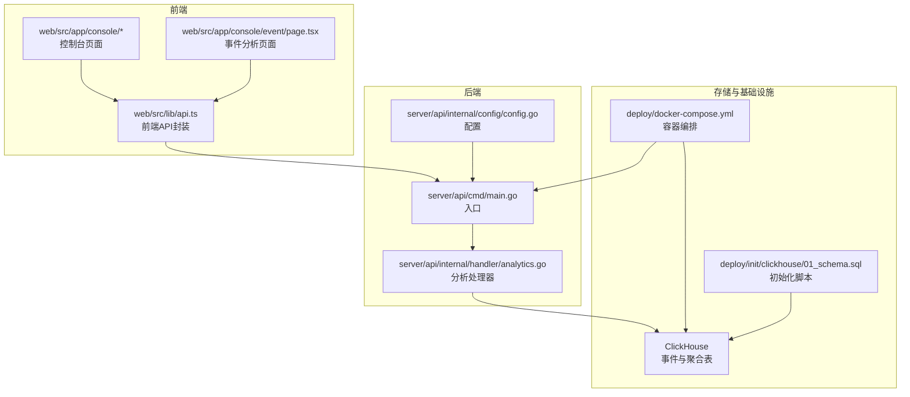
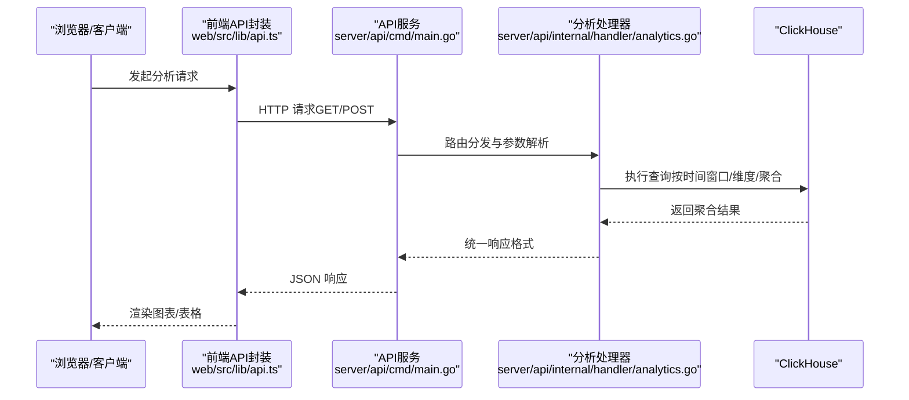
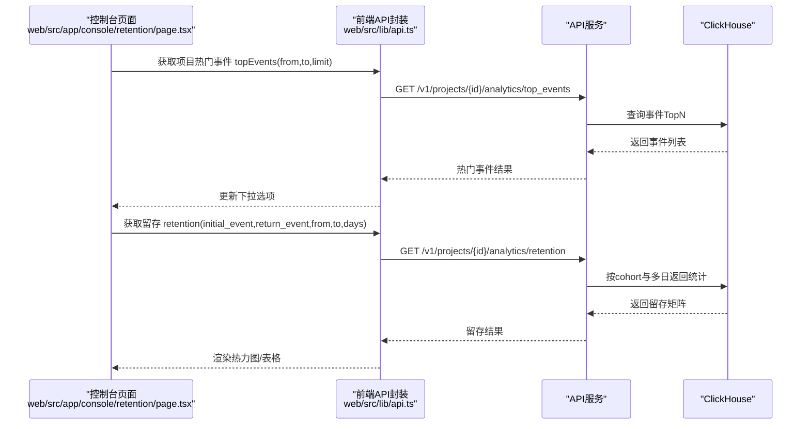
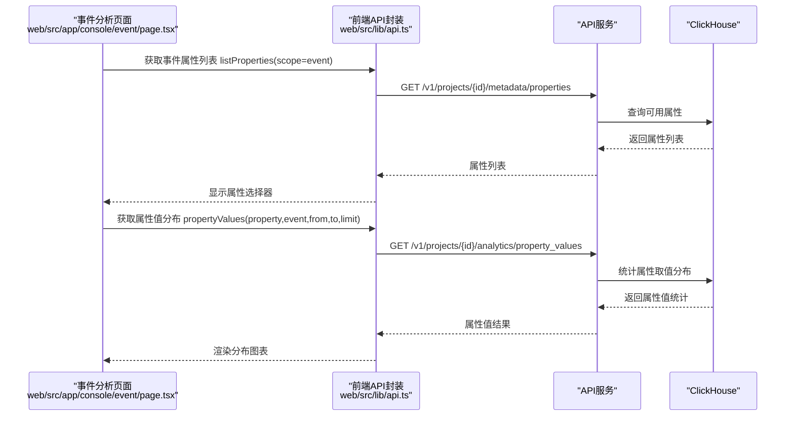
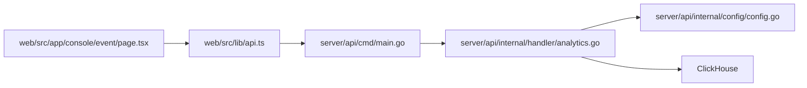

# 数据分析接口

<cite>
**本文引用的文件**
- [server/api/internal/handler/analytics.go](file://server/api/internal/handler/analytics.go)
- [web/src/lib/api.ts](file://web/src/lib/api.ts)
- [web/src/app/console/retention/page.tsx](file://web/src/app/console/retention/page.tsx)
- [web/src/app/console/event/page.tsx](file://web/src/app/console/event/page.tsx)
- [server/api/cmd/main.go](file://server/api/cmd/main.go)
- [server/api/internal/config/config.go](file://server/api/internal/config/config.go)
- [server/pkg/model/event.go](file://server/pkg/model/event.go)
- [deploy/docker-compose.yml](file://deploy/docker-compose.yml)
- [deploy/init/clickhouse/01_schema.sql](file://deploy/init/clickhouse/01_schema.sql)
</cite>

## 更新摘要
**所做更改**
- 新增属性值分析端点 /v1/projects/{id}/analytics/property_values
- 新增查询表格端点 /v1/projects/{id}/analytics/query_table  
- 新增用户事件详情端点 /v1/projects/{id}/users/{distinct_id}/events
- 扩展前端 API 类型定义，新增查询维度、过滤器和表格行接口
- 更新分析场景与调用模式，增加属性分析与用户行为追踪功能

## 目录
1. [简介](#简介)
2. [项目结构](#项目结构)
3. [核心组件](#核心组件)
4. [架构总览](#架构总览)
5. [详细组件分析](#详细组件分析)
6. [依赖关系分析](#依赖关系分析)
7. [性能与数据特性](#性能与数据特性)
8. [故障排查指南](#故障排查指南)
9. [结论](#结论)
10. [附录](#附录)

## 简介
本文件为 AeroLog 数据分析接口的权威文档，覆盖事件趋势、漏斗分析、留存分析、属性值分析、查询表格和用户事件详情等核心查询能力。文档面向开发者与数据分析师，提供端点定义、参数说明、响应结构、调用示例与最佳实践，并结合系统架构与数据流解释延迟、精度与性能考量。

## 项目结构
AeroLog 后端由 Go 编写的 API 服务提供数据分析接口；前端通过 TypeScript SDK 调用这些接口；ClickHouse 作为 OLAP 存储引擎承载事件与聚合数据；Prometheus/Grafana 提供可观测性与可视化。

**图表来源**
- [server/api/cmd/main.go:1-50](file://server/api/cmd/main.go#L1-L50)
- [server/api/internal/config/config.go:1-80](file://server/api/internal/config/config.go#L1-L80)
- [server/api/internal/handler/analytics.go:1-120](file://server/api/internal/handler/analytics.go#L1-L120)
- [web/src/lib/api.ts:1-120](file://web/src/lib/api.ts#L1-L120)
- [web/src/app/console/event/page.tsx:1-100](file://web/src/app/console/event/page.tsx#L1-L100)
- [deploy/docker-compose.yml:1-120](file://deploy/docker-compose.yml#L1-L120)
- [deploy/init/clickhouse/01_schema.sql:1-200](file://deploy/init/clickhouse/01_schema.sql#L1-L200)

**章节来源**
- [server/api/cmd/main.go:1-50](file://server/api/cmd/main.go#L1-L50)
- [server/api/internal/config/config.go:1-80](file://server/api/internal/config/config.go#L1-L80)
- [server/api/internal/handler/analytics.go:1-120](file://server/api/internal/handler/analytics.go#L1-L120)
- [web/src/lib/api.ts:1-120](file://web/src/lib/api.ts#L1-L120)
- [web/src/app/console/event/page.tsx:1-100](file://web/src/app/console/event/page.tsx#L1-L100)
- [deploy/docker-compose.yml:1-120](file://deploy/docker-compose.yml#L1-L120)
- [deploy/init/clickhouse/01_schema.sql:1-200](file://deploy/init/clickhouse/01_schema.sql#L1-L200)

## 核心组件
- 分析处理器：实现事件趋势、漏斗、留存、属性值分析、查询表格、用户事件详情等分析接口，负责参数解析、SQL 构造与 ClickHouse 查询。
- 前端 API 封装：统一管理分析接口的请求路径、参数序列化与响应类型，新增查询维度、过滤器和表格行接口定义。
- 配置与路由：定义 API 版本、路由前缀与运行参数。
- 存储层：ClickHouse 表结构与初始化脚本，支撑高吞吐写入与多维聚合查询。

**章节来源**
- [server/api/internal/handler/analytics.go:1-120](file://server/api/internal/handler/analytics.go#L1-L120)
- [web/src/lib/api.ts:1-120](file://web/src/lib/api.ts#L1-L120)
- [server/api/internal/config/config.go:1-80](file://server/api/internal/config/config.go#L1-L80)
- [deploy/init/clickhouse/01_schema.sql:1-200](file://deploy/init/clickhouse/01_schema.sql#L1-L200)

## 架构总览
下图展示从前端到后端再到存储的数据流向与关键交互点。

**图表来源**
- [web/src/lib/api.ts:1-120](file://web/src/lib/api.ts#L1-L120)
- [server/api/cmd/main.go:1-50](file://server/api/cmd/main.go#L1-L50)
- [server/api/internal/handler/analytics.go:1-120](file://server/api/internal/handler/analytics.go#L1-L120)

## 详细组件分析

### 通用请求与响应约定
- 版本与路由：接口位于 /v1/projects/{id}/analytics/... 或 /v1/projects/{id}/users/{distinct_id}/...，具体端点见下文。
- 时间参数：均支持毫秒级 Unix 时间戳（from/to），未提供时按默认策略回填。
- 错误处理：参数缺失或非法时返回 400 并携带错误信息；内部错误返回 5xx。

**章节来源**
- [server/api/internal/handler/analytics.go:1-60](file://server/api/internal/handler/analytics.go#L1-L60)

### 获取热门事件 /get_top_events
- 方法与路径：GET /v1/projects/{id}/analytics/top_events
- 功能：统计指定时间窗口内事件发生的 Top-N 列表，用于快速识别热点事件。
- 请求参数
  - from: 可选，毫秒级 Unix 时间戳，开始时间
  - to: 可选，毫秒级 Unix 时间戳，结束时间
  - limit: 可选，整数，返回条目数量上限，默认值参考实现
- 响应字段
  - items: 数组，每项包含事件名与计数
- 典型用途
  - 快速定位异常峰值或热门功能
  - 作为漏斗/留存分析的输入筛选
- 示例调用模式
  - 单项目热门事件：GET /v1/projects/{id}/analytics/top_events?from=...&to=...&limit=100
- 注意事项
  - 时间窗口越大，聚合成本越高；建议限制 limit 与时间跨度

**章节来源**
- [server/api/internal/handler/analytics.go:1-120](file://server/api/internal/handler/analytics.go#L1-L120)

### 获取趋势 /get_trend
- 方法与路径：GET /v1/projects/{id}/analytics/trend
- 功能：按时间窗口聚合事件数量，输出折线趋势。
- 请求参数
  - from: 可选，毫秒级 Unix 时间戳，开始时间
  - to: 可选，毫秒级 Unix 时间戳，结束时间
  - granularity: 可选，粒度（如 minute/hour/day），决定时间轴刻度
  - event: 可选，事件名过滤
  - filters: 可选，维度过滤器（JSON 字符串），支持多维筛选
- 响应字段
  - series: 数组，每项包含时间点与对应计数
- 典型用途
  - 观察事件随时间变化的波动
  - 结合告警阈值进行异常检测
- 示例调用模式
  - 指定事件与粒度：GET /v1/projects/{id}/analytics/trend?from=...&to=...&granularity=hour&event=login
- 注意事项
  - 粒度过细会增加数据点数量，影响渲染性能

**章节来源**
- [server/api/internal/handler/analytics.go:1-120](file://server/api/internal/handler/analytics.go#L1-L120)

### 获取属性值分析 /get_property_values
- 方法与路径：GET /v1/projects/{id}/analytics/property_values
- 功能：分析指定事件属性的所有取值分布，统计每个取值的事件次数与独立用户数。
- 请求参数
  - property: 必填，属性名称（如 "city"、"os"、"browser"）
  - event: 可选，事件名过滤，仅统计该事件中的属性值
  - from: 可选，毫秒级 Unix 时间戳，开始时间
  - to: 可选，毫秒级 Unix 时间戳，结束时间
  - limit: 可选，整数，返回前 N 个最常见取值，默认 20，最大 100
- 响应字段
  - data: 数组，每项包含属性原始值、事件计数与独立用户数
- 典型用途
  - 用户画像分析：识别主要用户群体特征
  - 地域分布分析：统计不同地区的用户占比
  - 设备特征分析：了解用户使用的操作系统、浏览器等
- 示例调用模式
  - 属性值分布：GET /v1/projects/{id}/analytics/property_values?property=city&event=user_register&from=...&to=...&limit=50
- 注意事项
  - limit 过大会增加查询复杂度，建议根据业务需求合理设置
  - 仅返回非空属性值，空值会被自动过滤

**新增** 新增属性值分析端点，用于深入理解用户属性分布特征

**章节来源**
- [server/api/internal/handler/analytics.go:124-162](file://server/api/internal/handler/analytics.go#L124-L162)
- [web/src/lib/api.ts:217-229](file://web/src/lib/api.ts#L217-L229)

### 获取漏斗 /get_funnel
- 方法与路径：POST /v1/projects/{id}/analytics/funnel
- 功能：基于事件序列计算转化漏斗，输出每步的用户数与转化率。
- 请求体参数
  - events: 必填，事件字符串数组，表示漏斗步骤顺序
  - from: 可选，毫秒级 Unix 时间戳，开始时间
  - to: 可选，毫秒级 Unix 时间戳，结束时间
  - window_seconds: 可选，时间窗（秒），限制步骤间最大间隔
- 响应字段
  - steps: 数组，每项包含事件名、该步用户数、从上一步到当前步的转化率
- 典型用途
  - 新用户注册流程、购买路径、激活链路分析
- 示例调用模式
  - POST /v1/projects/{id}/analytics/funnel，Body: {"events":["register","login","purchase"],"from":...,"to":...,"window_seconds":86400}
- 注意事项
  - 步骤过多或时间窗过大可能显著增加计算量

**章节来源**
- [web/src/lib/api.ts:52-59](file://web/src/lib/api.ts#L52-L59)
- [server/api/internal/handler/analytics.go:1-120](file://server/api/internal/handler/analytics.go#L1-L120)

### 获取查询表格 /get_query_table
- 方法与路径：POST /v1/projects/{id}/analytics/query_table
- 功能：执行复杂的多维查询，返回可排序的表格数据，支持维度交叉分析。
- 请求体参数
  - dimensions: 必填，维度数组，每个维度包含 type（"event"|"property"）和 key
  - filters: 可选，过滤器数组，支持事件名、属性值、存在性等过滤条件
  - from: 可选，毫秒级 Unix 时间戳，开始时间
  - to: 可选，毫秒级 Unix 时间戳，结束时间
  - limit: 可选，整数，返回记录数上限
- 响应字段
  - data: 数组，每项包含维度值组合、事件计数与独立用户数
- 典型用途
  - 多维交叉分析：如地区-设备-事件的联合统计
  - 属性关联分析：探索不同属性间的关联关系
  - A/B测试对比：比较实验组与对照组的差异
- 示例调用模式
  - POST /v1/projects/{id}/analytics/query_table，Body: {"dimensions":[{"type":"property","key":"city"},{"type":"event","key":"login"}],"filters":[{"property":"os","op":"eq","value":"iOS"}],"from":...,"to":...,"limit":1000}
- 注意事项
  - 维度组合爆炸可能导致查询性能下降，建议合理限制维度数量
  - 复杂过滤器会增加查询复杂度，应优先使用高频过滤条件

**新增** 新增查询表格端点，提供灵活的多维分析能力

**章节来源**
- [server/api/internal/handler/analytics.go:582-650](file://server/api/internal/handler/analytics.go#L582-L650)
- [web/src/lib/api.ts:246-260](file://web/src/lib/api.ts#L246-L260)

### 获取用户事件详情 /get_user_events
- 方法与路径：GET /v1/projects/{id}/users/{distinct_id}/events
- 功能：获取指定用户的完整事件历史，支持分页和过滤。
- 请求参数
  - distinct_id: 路径参数，用户唯一标识符
  - from: 可选，毫秒级 Unix 时间戳，开始时间
  - to: 可选，毫秒级 Unix 时间戳，结束时间
  - event: 可选，事件名过滤
  - limit: 可选，整数，单页返回事件数，默认 100
- 响应字段
  - data: 数组，每项包含事件详情（时间、事件名、属性等）
- 典型用途
  - 用户行为追踪：查看特定用户的所有操作记录
  - 客户服务：协助解决用户问题时查看其完整使用轨迹
  - 用户画像：基于事件历史构建详细的用户画像
- 示例调用模式
  - 用户事件历史：GET /v1/projects/{id}/users/{distinct_id}/events?from=...&to=...&event=login&limit=50
- 注意事项
  - 用户隐私保护：仅在授权范围内访问用户数据
  - 大量事件数据可能影响查询性能，建议设置合理的 limit 和时间范围

**新增** 新增用户事件详情端点，提供用户级别的行为追踪能力

**章节来源**
- [server/api/internal/handler/analytics.go:515-580](file://server/api/internal/handler/analytics.go#L515-L580)
- [web/src/lib/api.ts:178-191](file://web/src/lib/api.ts#L178-L191)

### 获取留存 /get_retention
- 方法与路径：GET /v1/projects/{id}/analytics/retention
- 功能：以"首次事件发生日期"为 cohort，统计后续若干天的返回比例。
- 查询参数
  - initial_event: 必填，初始事件名
  - return_event: 必填，返回事件名
  - from: 可选，毫秒级 Unix 时间戳，开始时间
  - to: 可选，毫秒级 Unix 时间戳，结束时间
  - days: 可选，整数，最大观察天数，默认 7，最大 30
- 响应字段
  - items: 数组，每项包含 cohort（日期）、首日用户数 size、以及后续每天的返回人数数组 values
- 典型用途
  - 用户激活后的持续参与评估
  - A/B 实验前后对比
- 示例调用模式
  - GET /v1/projects/{id}/analytics/retention?initial_event=install&return_event=open&from=...&to=...&days=7
- 注意事项
  - days 过大将导致大量子查询，建议按业务需求合理设置

**章节来源**
- [web/src/lib/api.ts:60-74](file://web/src/lib/api.ts#L60-L74)
- [server/api/internal/handler/analytics.go:201-233](file://server/api/internal/handler/analytics.go#L201-L233)

### 控制台页面联动示例（留存）
前端控制台页面展示了如何组合热门事件查询与留存查询，便于用户选择初始事件与返回事件。

**图表来源**
- [web/src/app/console/retention/page.tsx:17-44](file://web/src/app/console/retention/page.tsx#L17-L44)
- [web/src/lib/api.ts:35-74](file://web/src/lib/api.ts#L35-L74)
- [server/api/internal/handler/analytics.go:201-233](file://server/api/internal/handler/analytics.go#L201-L233)

### 控制台页面联动示例（属性分析）
事件分析页面展示了如何使用属性值分析功能，帮助用户理解事件属性的分布情况。

**图表来源**
- [web/src/app/console/event/page.tsx:40-83](file://web/src/app/console/event/page.tsx#L40-L83)
- [web/src/lib/api.ts:217-229](file://web/src/lib/api.ts#L217-L229)
- [server/api/internal/handler/analytics.go:124-162](file://server/api/internal/handler/analytics.go#L124-L162)

## 依赖关系分析
- 前端依赖
  - web/src/lib/api.ts：集中定义分析接口的路径与参数类型，新增查询维度、过滤器和表格行接口定义
  - web/src/app/console/event/page.tsx：事件分析页面，展示属性值分析的实际应用场景
- 后端依赖
  - server/api/internal/handler/analytics.go：实现各分析端点，新增属性值分析、查询表格、用户事件详情接口，依赖配置与数据库连接
  - server/api/internal/config/config.go：提供运行时配置（如数据库连接、日志级别等）
  - server/api/cmd/main.go：应用入口，加载路由与中间件
- 存储依赖
  - deploy/init/clickhouse/01_schema.sql：定义事件与聚合表结构，支撑趋势、漏 funnel、留存、属性分析等查询

**图表来源**
- [web/src/lib/api.ts:1-120](file://web/src/lib/api.ts#L1-L120)
- [server/api/cmd/main.go:1-50](file://server/api/cmd/main.go#L1-L50)
- [server/api/internal/handler/analytics.go:1-120](file://server/api/internal/handler/analytics.go#L1-L120)
- [server/api/internal/config/config.go:1-80](file://server/api/internal/config/config.go#L1-L80)
- [web/src/app/console/event/page.tsx:1-100](file://web/src/app/console/event/page.tsx#L1-L100)

**章节来源**
- [web/src/lib/api.ts:1-120](file://web/src/lib/api.ts#L1-L120)
- [server/api/cmd/main.go:1-50](file://server/api/cmd/main.go#L1-L50)
- [server/api/internal/handler/analytics.go:1-120](file://server/api/internal/handler/analytics.go#L1-L120)
- [server/api/internal/config/config.go:1-80](file://server/api/internal/config/config.go#L1-L80)
- [web/src/app/console/event/page.tsx:1-100](file://web/src/app/console/event/page.tsx#L1-L100)

## 性能与数据特性
- 数据延迟
  - 写入链路：采集器 -> MQ -> 消费者 -> ClickHouse，整体端到端延迟取决于消息队列积压与消费者处理速度
  - 查询延迟：趋势/漏斗/留存/属性分析查询在 ClickHouse 上执行，受索引、分区与过滤条件影响
- 数据精度
  - 时间字段统一使用毫秒级 Unix 时间戳，避免时区与精度问题
  - 留存按"日期"分桶（cohort），确保同一批用户在同一维度下对比
  - 属性值分析使用 JSONExtractRaw 函数提取原始属性值，保持数据完整性
- 性能优化建议
  - 合理设置时间窗口与粒度，避免过大的全量扫描
  - 使用 filters 对维度进行预过滤，减少聚合基数
  - 漏斗分析中限制 steps 数量与 window_seconds，降低跨事件匹配成本
  - 留存 days 建议不超过 30，避免过多子查询
  - 属性值分析中合理设置 limit，避免返回过多稀疏值
  - 查询表格中限制维度数量和过滤器复杂度
- 可观测性
  - Prometheus + Grafana 已在部署中配置，可用于监控 API 响应时间、ClickHouse 查询耗时与队列长度

**章节来源**
- [deploy/docker-compose.yml:1-120](file://deploy/docker-compose.yml#L1-L120)

## 故障排查指南
- 参数校验失败
  - 现象：返回 400，提示缺少必要参数
  - 排查：确认必填参数是否传递（如属性值分析的 property 参数）
- 时间范围异常
  - 现象：查询无结果或结果为空
  - 排查：检查 from/to 是否正确、是否跨越分区边界；适当缩小时间窗口
- 性能问题
  - 现象：响应缓慢
  - 排查：减少 limit/granularity/steps/days；添加 filters；确认 ClickHouse 分区键与索引是否有效
  - 特别注意：属性值分析的 limit 不宜过大；查询表格的维度组合要合理
- 前端调用异常
  - 现象：网络错误或类型不匹配
  - 排查：核对 web/src/lib/api.ts 中的路径与参数拼装逻辑；确认后端版本与路由一致
- 属性分析异常
  - 现象：属性值分析结果为空或不准确
  - 排查：确认属性名称正确、事件过滤条件合理；检查属性值是否为空字符串

**章节来源**
- [server/api/internal/handler/analytics.go:201-233](file://server/api/internal/handler/analytics.go#L201-L233)
- [web/src/lib/api.ts:52-74](file://web/src/lib/api.ts#L52-L74)

## 结论
AeroLog 的数据分析接口现已扩展为包含趋势、漏斗、留存、属性值分析、查询表格和用户事件详情六大核心场景的完整分析体系，配合前端控制台可实现从事件筛选到结果可视化的完整闭环。新增的属性值分析和查询表格功能大幅增强了多维分析能力，用户事件详情端点则提供了强大的用户行为追踪能力。通过合理设置时间窗口、粒度与过滤条件，可在保证查询性能的同时获得高精度的分析结果。建议在生产环境中结合 Prometheus/Grafana 进行持续监控，并根据业务场景调整参数上限与缓存策略。

## 附录
- 常见分析场景与调用模式
  - 新用户激活路径：先用 /get_top_events 识别关键事件，再用 /get_funnel 计算注册->登录->付费的转化
  - 活跃度评估：用 /get_trend 观察日/周趋势，叠加 filters 进行渠道/地区对比
  - 留存评估：用 /get_retention 比较不同推广活动的次日/7日留存
  - 用户画像构建：用 /get_property_values 分析用户属性分布，如地域、设备、兴趣等
  - 多维交叉分析：用 /get_query_table 进行复杂的维度交叉统计
  - 用户行为追踪：用 /get_user_events 查看特定用户的完整操作历史
- 响应字段速查
  - 热门事件：items[].event, items[].count
  - 趋势：series[].time, series[].value
  - 属性值分析：data[].raw, data[].c, data[].u
  - 查询表格：data[].dimensions, data[].count, data[].users
  - 用户事件详情：data[].time, data[].event, data[].properties
  - 漏斗：steps[].event, steps[].users, steps[].conversion
  - 留存：items[].cohort, items[].size, items[].values
- 前端类型定义速查
  - QueryDimension：{ type: "event" | "property", key: string }
  - QueryFilter：{ event?: string, property?: string, op?: "eq" | "neq" | "exists", value?: unknown }
  - QueryTableRow：{ dimensions: [], count: number, users: number }