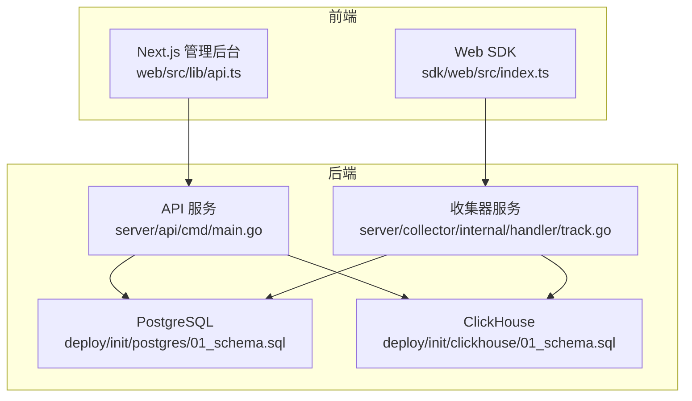
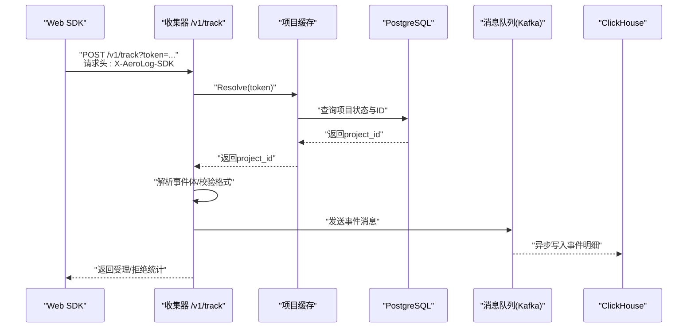
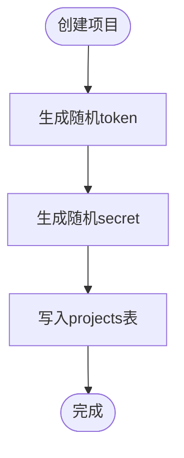
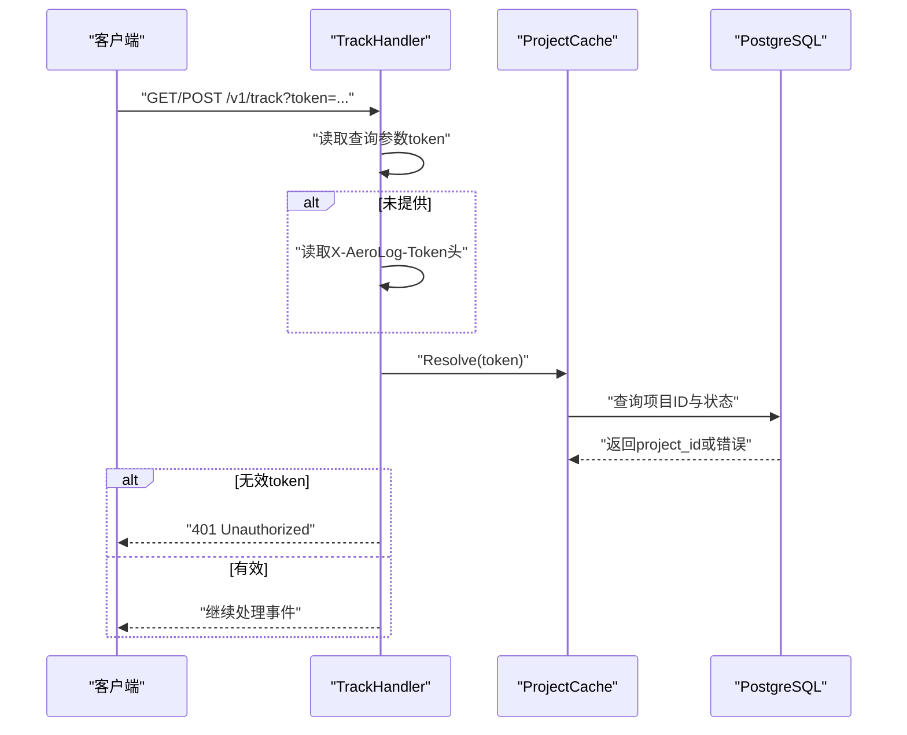
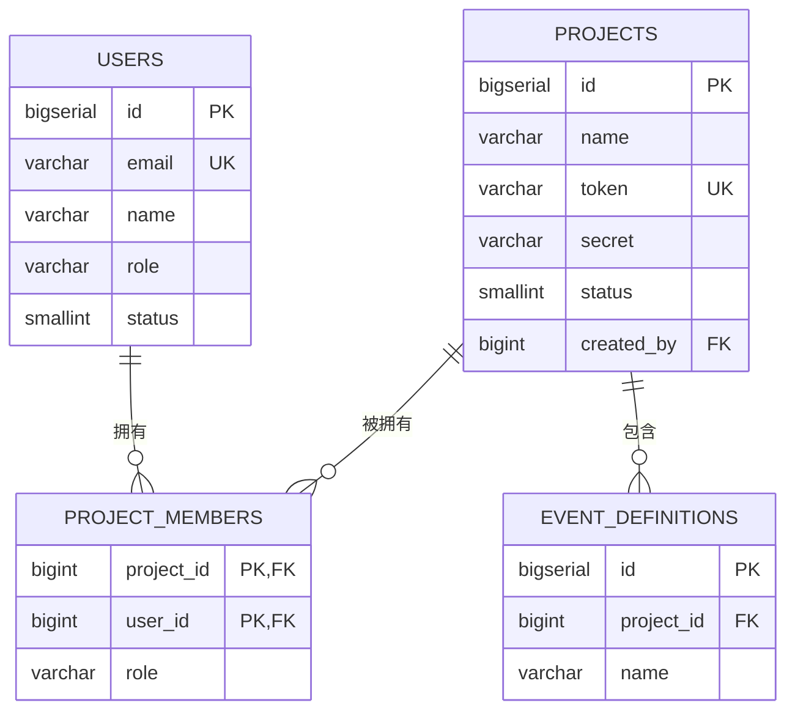
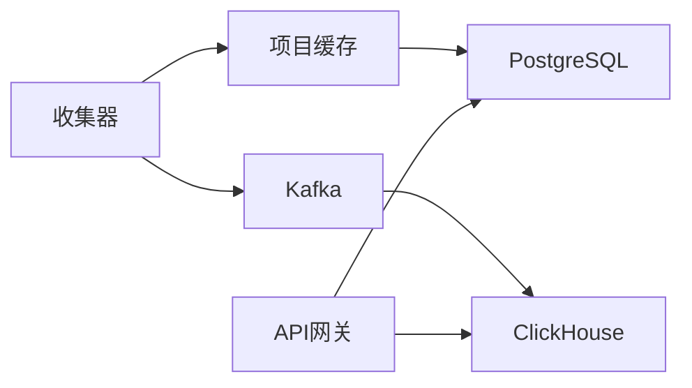

# 认证与授权

<cite>
**本文引用的文件**
- [server/api/cmd/main.go](file://server/api/cmd/main.go)
- [server/api/internal/config/config.go](file://server/api/internal/config/config.go)
- [server/api/internal/handler/project.go](file://server/api/internal/handler/project.go)
- [server/api/internal/handler/analytics.go](file://server/api/internal/handler/analytics.go)
- [server/collector/internal/handler/track.go](file://server/collector/internal/handler/track.go)
- [server/collector/internal/projectcache/cache.go](file://server/collector/internal/projectcache/cache.go)
- [deploy/init/postgres/01_schema.sql](file://deploy/init/postgres/01_schema.sql)
- [deploy/init/clickhouse/01_schema.sql](file://deploy/init/clickhouse/01_schema.sql)
- [web/src/lib/api.ts](file://web/src/lib/api.ts)
- [sdk/web/src/index.ts](file://sdk/web/src/index.ts)
- [sdk/web/src/utils.ts](file://sdk/web/src/utils.ts)
- [web/README.md](file://web/README.md)
</cite>

## 目录
1. [简介](#简介)
2. [项目结构](#项目结构)
3. [核心组件](#核心组件)
4. [架构总览](#架构总览)
5. [详细组件分析](#详细组件分析)
6. [依赖分析](#依赖分析)
7. [性能考量](#性能考量)
8. [故障排查指南](#故障排查指南)
9. [结论](#结论)
10. [附录](#附录)

## 简介
本文件面向AeroLog的认证与授权体系，聚焦以下目标：
- API密钥的生成、管理与使用：密钥类型、权限范围、有效期策略
- HTTP头部认证的实现方式与安全注意事项
- 项目级权限控制机制：用户角色、访问权限与资源隔离
- 认证失败的错误处理与重试策略
- 安全最佳实践与常见威胁防护
- API版本控制与向后兼容性策略

## 项目结构
AeroLog的认证与授权相关能力主要分布在如下模块：
- API网关层（server/api）：负责路由、CORS、指标采集与项目/分析接口
- 收集器层（server/collector）：负责事件上报接口与密钥校验
- SDK/Web客户端：负责事件上报、离线持久化与重试
- 数据层（PostgreSQL/ClickHouse）：存储用户、项目、埋点元数据与事件明细



**图表来源**
- [server/api/cmd/main.go:35-78](file://server/api/cmd/main.go#L35-L78)
- [server/collector/internal/handler/track.go:47-51](file://server/collector/internal/handler/track.go#L47-L51)
- [deploy/init/postgres/01_schema.sql:18-28](file://deploy/init/postgres/01_schema.sql#L18-L28)
- [deploy/init/clickhouse/01_schema.sql:6-42](file://deploy/init/clickhouse/01_schema.sql#L6-L42)

**章节来源**
- [server/api/cmd/main.go:35-78](file://server/api/cmd/main.go#L35-L78)
- [web/src/lib/api.ts:3-19](file://web/src/lib/api.ts#L3-L19)
- [sdk/web/src/index.ts:147-182](file://sdk/web/src/index.ts#L147-L182)

## 核心组件
- 项目与密钥管理
  - 项目表包含token与secret字段，分别用于SDK上报认证与服务端签名验证
  - 创建项目时生成随机token与secret，并持久化至PostgreSQL
- 事件上报与认证
  - 收集器在/v1/track接受事件，支持通过查询参数或自定义头进行认证
  - 使用内存缓存将token映射到project_id，避免频繁查询数据库
- 分析接口与资源隔离
  - 分析接口通过project_id过滤ClickHouse数据，实现天然的资源隔离
- 前端与SDK
  - 管理后台通过统一API客户端访问后端
  - Web SDK通过URL参数携带token发起上报，具备离线持久化与指数退避重试

**章节来源**
- [server/api/internal/handler/project.go:71-96](file://server/api/internal/handler/project.go#L71-L96)
- [server/collector/internal/handler/track.go:60-133](file://server/collector/internal/handler/track.go#L60-L133)
- [server/collector/internal/projectcache/cache.go:34-56](file://server/collector/internal/projectcache/cache.go#L34-L56)
- [deploy/init/postgres/01_schema.sql:18-28](file://deploy/init/postgres/01_schema.sql#L18-L28)
- [deploy/init/clickhouse/01_schema.sql:6-42](file://deploy/init/clickhouse/01_schema.sql#L6-L42)
- [web/src/lib/api.ts:37-106](file://web/src/lib/api.ts#L37-L106)
- [sdk/web/src/index.ts:147-182](file://sdk/web/src/index.ts#L147-L182)

## 架构总览
AeroLog采用“密钥驱动的项目级访问控制”模式：
- SDK上报使用项目token作为认证凭据
- API网关与收集器均基于项目维度进行资源隔离
- 管理后台通过统一REST接口访问元数据与分析结果



**图表来源**
- [server/collector/internal/handler/track.go:60-133](file://server/collector/internal/handler/track.go#L60-L133)
- [server/collector/internal/projectcache/cache.go:34-56](file://server/collector/internal/projectcache/cache.go#L34-L56)
- [deploy/init/postgres/01_schema.sql:18-28](file://deploy/init/postgres/01_schema.sql#L18-L28)

## 详细组件分析

### API密钥生成与管理
- 密钥类型
  - token：用于SDK上报认证，查询参数或自定义头传递
  - secret：用于服务端签名验证（当前代码未展示签名逻辑，但schema中保留）
- 密钥生成
  - 创建项目时生成随机token与secret，确保唯一性与不可预测性
- 密钥管理
  - 项目状态status=1时有效；禁用后应立即失效
  - 建议支持轮换与撤销机制（当前仓库未实现，可在schema扩展）



**图表来源**
- [server/api/internal/handler/project.go:71-96](file://server/api/internal/handler/project.go#L71-L96)
- [deploy/init/postgres/01_schema.sql:18-28](file://deploy/init/postgres/01_schema.sql#L18-L28)

**章节来源**
- [server/api/internal/handler/project.go:71-96](file://server/api/internal/handler/project.go#L71-L96)
- [deploy/init/postgres/01_schema.sql:18-28](file://deploy/init/postgres/01_schema.sql#L18-L28)

### HTTP头部认证与实现细节
- 认证位置
  - 查询参数：/v1/track?token=...
  - 自定义头：X-AeroLog-Token
- 认证流程
  - 收集器优先从查询参数读取token，不存在时回退到自定义头
  - 通过项目缓存解析token到project_id，若失败返回401
- 安全注意事项
  - 建议强制使用HTTPS，防止token泄露
  - 对敏感头（如Authorization）与自定义头进行严格白名单校验
  - 控制日志输出，避免token明文记录



**图表来源**
- [server/collector/internal/handler/track.go:60-76](file://server/collector/internal/handler/track.go#L60-L76)
- [server/collector/internal/projectcache/cache.go:34-56](file://server/collector/internal/projectcache/cache.go#L34-L56)

**章节来源**
- [server/collector/internal/handler/track.go:60-76](file://server/collector/internal/handler/track.go#L60-L76)
- [server/collector/internal/projectcache/cache.go:34-56](file://server/collector/internal/projectcache/cache.go#L34-L56)

### 项目级权限控制与资源隔离
- 用户角色与成员关系
  - users表包含role字段（默认member/admin）
  - project_members表定义用户对项目的角色（owner/editor/viewer）
- 资源隔离
  - 事件明细表events按project_id分区，查询时以project_id过滤，天然实现资源隔离
  - 分析接口同样以project_id为维度，避免越权访问
- 当前缺失
  - API层未实现基于用户角色的鉴权（如/admin/*需登录态与角色校验）
  - 建议在API层增加中间件，结合项目成员表进行权限校验



**图表来源**
- [deploy/init/postgres/01_schema.sql:7-16](file://deploy/init/postgres/01_schema.sql#L7-L16)
- [deploy/init/postgres/01_schema.sql:18-36](file://deploy/init/postgres/01_schema.sql#L18-L36)
- [deploy/init/postgres/01_schema.sql:39-51](file://deploy/init/postgres/01_schema.sql#L39-L51)

**章节来源**
- [deploy/init/postgres/01_schema.sql:7-16](file://deploy/init/postgres/01_schema.sql#L7-L16)
- [deploy/init/postgres/01_schema.sql:18-36](file://deploy/init/postgres/01_schema.sql#L18-L36)
- [deploy/init/postgres/01_schema.sql:39-51](file://deploy/init/postgres/01_schema.sql#L39-L51)
- [deploy/init/clickhouse/01_schema.sql:6-42](file://deploy/init/clickhouse/01_schema.sql#L6-L42)

### 分析接口与资源隔离
- 接口路径
  - /v1/projects/:id/analytics/trend
  - /v1/projects/:id/analytics/top_events
  - /v1/projects/:id/analytics/funnel
  - /v1/projects/:id/analytics/retention
- 资源隔离
  - 所有查询均以project_id过滤，确保跨项目数据隔离
- 性能建议
  - ClickHouse分区键已按project_id+月份设计，查询时尽量带上时间范围

**章节来源**
- [server/api/internal/handler/analytics.go:27-32](file://server/api/internal/handler/analytics.go#L27-L32)
- [deploy/init/clickhouse/01_schema.sql:6-42](file://deploy/init/clickhouse/01_schema.sql#L6-L42)

### SDK上报与重试策略
- 上报方式
  - SDK通过URL参数携带token，请求头包含X-AeroLog-SDK标识
- 错误处理
  - 4xx（除429外）视为服务器拒绝，SDK丢弃并不再重试
  - 其他错误触发指数退避重试，失败事件持久化至IndexedDB
- 重试策略
  - 固定退避序列：1s、3s、10s、30s、60s、300s（最多）
  - 恢复后从持久化队列恢复上传

```mermaid
flowchart TD
S(["开始上报"]) --> Send["发送请求"]
Send --> Resp{"响应状态"}
Resp --> |2xx| OK["成功"]
Resp --> |4xx(不含429)| Drop["丢弃并记录"]
Resp --> |其他| Retry["指数退避重试"]
Retry --> Store["持久化到IndexedDB"]
Store --> Backoff["等待退避时间"]
Backoff --> Upload["恢复后重传"]
Drop --> End(["结束"])
OK --> End
Upload --> End
```

**图表来源**
- [sdk/web/src/index.ts:147-182](file://sdk/web/src/index.ts#L147-L182)
- [sdk/web/src/utils.ts:75-79](file://sdk/web/src/utils.ts#L75-L79)
- [sdk/web/src/storage.ts:1-44](file://sdk/web/src/storage.ts#L1-L44)

**章节来源**
- [sdk/web/src/index.ts:147-182](file://sdk/web/src/index.ts#L147-L182)
- [sdk/web/src/utils.ts:75-79](file://sdk/web/src/utils.ts#L75-L79)
- [sdk/web/src/storage.ts:1-44](file://sdk/web/src/storage.ts#L1-L44)

### API版本控制与向后兼容
- 版本策略
  - 所有公开接口均位于/v1路径，便于未来引入/v2
- 向后兼容
  - 新增字段采用可选策略；变更行为需在v2中明确
  - 保持现有查询参数与响应结构稳定

**章节来源**
- [server/api/cmd/main.go:55](file://server/api/cmd/main.go#L55)
- [web/src/lib/api.ts:6](file://web/src/lib/api.ts#L6)

## 依赖分析
- 组件耦合
  - 收集器依赖项目缓存与消息队列，缓存依赖PostgreSQL
  - API层依赖PostgreSQL与ClickHouse
- 外部依赖
  - Gin框架、PGX连接池、ClickHouse驱动、Kafka生产者
- 潜在风险
  - 缓存未实现分布式共享，多实例部署需考虑一致性
  - API层缺少用户态鉴权，存在越权风险



**图表来源**
- [server/collector/internal/handler/track.go:40-45](file://server/collector/internal/handler/track.go#L40-L45)
- [server/collector/internal/projectcache/cache.go:20-24](file://server/collector/internal/projectcache/cache.go#L20-L24)
- [server/api/internal/handler/analytics.go:14-16](file://server/api/internal/handler/analytics.go#L14-L16)

**章节来源**
- [server/collector/internal/handler/track.go:40-45](file://server/collector/internal/handler/track.go#L40-L45)
- [server/collector/internal/projectcache/cache.go:20-24](file://server/collector/internal/projectcache/cache.go#L20-L24)
- [server/api/internal/handler/analytics.go:14-16](file://server/api/internal/handler/analytics.go#L14-L16)

## 性能考量
- 缓存命中率
  - 项目缓存按token维度LRU-lite缓存，减少数据库压力
- 查询优化
  - ClickHouse按project_id+月份分区，建议始终带上时间范围
- 并发与超时
  - 生产者发送带超时控制，避免阻塞请求处理

**章节来源**
- [server/collector/internal/projectcache/cache.go:26-32](file://server/collector/internal/projectcache/cache.go#L26-L32)
- [server/collector/internal/handler/track.go:120-128](file://server/collector/internal/handler/track.go#L120-L128)
- [deploy/init/clickhouse/01_schema.sql:38-42](file://deploy/init/clickhouse/01_schema.sql#L38-L42)

## 故障排查指南
- 常见错误码
  - 4001：无效token（认证失败）
  - 4004：请求体错误（格式/大小）
  - 5001：队列不可用（Kafka发送失败）
- 定位步骤
  - 检查token是否存在于项目表且状态为启用
  - 核对请求头与查询参数是否正确传递
  - 查看收集器日志中的状态标签与指标
- 重试与降级
  - SDK对非429的4xx错误直接丢弃
  - 对网络异常与服务不可用执行指数退避重试

**章节来源**
- [server/collector/internal/handler/track.go:71-76](file://server/collector/internal/handler/track.go#L71-L76)
- [server/collector/internal/handler/track.go:80-90](file://server/collector/internal/handler/track.go#L80-L90)
- [server/collector/internal/handler/track.go:124-128](file://server/collector/internal/handler/track.go#L124-L128)
- [sdk/web/src/index.ts:160-166](file://sdk/web/src/index.ts#L160-L166)

## 结论
AeroLog当前采用“项目token驱动”的轻量认证模型，配合项目级资源隔离实现了基本的安全边界。建议下一步完善：
- 在API层引入用户态鉴权与角色校验
- 强制TLS、限制敏感头、最小化日志输出
- 扩展密钥轮换与撤销机制
- 在多实例场景下引入分布式缓存

## 附录
- 环境变量与配置
  - JWTSecret：当前用于API服务配置，但未在认证流程中使用
  - CORS允许来源：可通过环境变量配置
- 前端与SDK
  - 管理后台通过NEXT_PUBLIC_API_BASE指向API服务
  - Web SDK默认将token作为查询参数传递

**章节来源**
- [server/api/internal/config/config.go:24-37](file://server/api/internal/config/config.go#L24-L37)
- [web/README.md:29-42](file://web/README.md#L29-L42)
- [sdk/web/src/index.ts:147-158](file://sdk/web/src/index.ts#L147-L158)