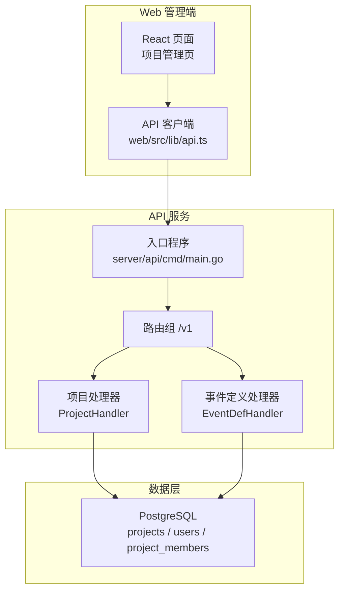
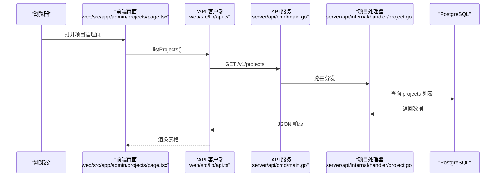
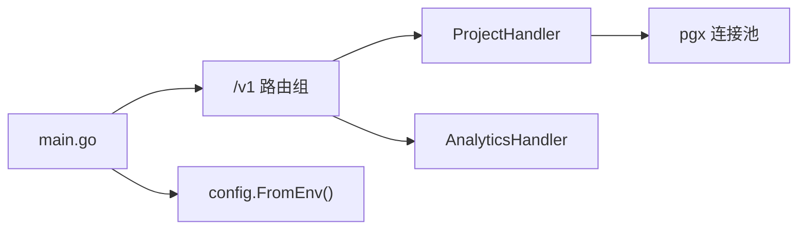

# 项目管理接口

<cite>
**本文引用的文件**
- [server/api/internal/handler/project.go](file://server/api/internal/handler/project.go)
- [server/api/cmd/main.go](file://server/api/cmd/main.go)
- [server/api/internal/config/config.go](file://server/api/internal/config/config.go)
- [web/src/lib/api.ts](file://web/src/lib/api.ts)
- [deploy/init/postgres/01_schema.sql](file://deploy/init/postgres/01_schema.sql)
- [web/src/app/admin/projects/page.tsx](file://web/src/app/admin/projects/page.tsx)
</cite>

## 目录
1. [简介](#简介)
2. [项目结构](#项目结构)
3. [核心组件](#核心组件)
4. [架构总览](#架构总览)
5. [详细组件分析](#详细组件分析)
6. [依赖分析](#依赖分析)
7. [性能考虑](#性能考虑)
8. [故障排查指南](#故障排查指南)
9. [结论](#结论)
10. [附录](#附录)

## 简介
本文件面向 AeroLog 项目的“项目管理接口”，聚焦于项目 CRUD（创建、查询列表、获取单个、更新、删除）能力的 API 规范说明。当前仓库中已实现的项目管理接口包括：
- 创建项目
- 获取项目列表
- 获取单个项目详情

同时，本文还梳理了项目配置参数、权限模型（基于数据库表结构）、以及与前端 SDK 和 Web 管理界面的集成方式，并给出迁移、备份与恢复的实践建议。

## 项目结构
- 后端 API 服务位于 server/api，采用 Gin 框架，路由前缀为 /v1。
- 项目管理相关处理器在 server/api/internal/handler/project.go 中实现。
- 数据库模式定义在 deploy/init/postgres/01_schema.sql，包含项目表、用户表及项目成员表。
- 前端 Web 管理界面通过 web/src/lib/api.ts 调用 /v1 接口，项目管理页面位于 web/src/app/admin/projects/page.tsx。

图表来源
- [server/api/cmd/main.go:55-58](file://server/api/cmd/main.go#L55-L58)
- [server/api/internal/handler/project.go:29-33](file://server/api/internal/handler/project.go#L29-L33)
- [deploy/init/postgres/01_schema.sql:18-36](file://deploy/init/postgres/01_schema.sql#L18-L36)

章节来源
- [server/api/cmd/main.go:35-78](file://server/api/cmd/main.go#L35-L78)
- [server/api/internal/handler/project.go:29-33](file://server/api/internal/handler/project.go#L29-L33)
- [deploy/init/postgres/01_schema.sql:18-36](file://deploy/init/postgres/01_schema.sql#L18-L36)

## 核心组件
- 项目处理器（ProjectHandler）
  - 负责 /v1/projects 的 GET（列表）、POST（创建）、以及 /v1/projects/:id 的 GET（详情）。
  - 使用 PostgreSQL 连接池进行数据访问。
- 配置模块（Config）
  - 从环境变量读取监听地址、Postgres DSN、ClickHouse 连接信息、JWT 密钥、CORS 白名单等。
- 前端 API 客户端（api.ts）
  - 统一构造 /v1 前缀的请求，封装 listProjects、createProject、getProject 等方法。
- 权限与成员模型（Schema）
  - users、projects、project_members 表定义了用户角色与项目成员角色（owner/editor/viewer）。

章节来源
- [server/api/internal/handler/project.go:14-27](file://server/api/internal/handler/project.go#L14-L27)
- [server/api/internal/config/config.go:8-15](file://server/api/internal/config/config.go#L8-L15)
- [web/src/lib/api.ts:33-37](file://web/src/lib/api.ts#L33-L37)
- [deploy/init/postgres/01_schema.sql:7-36](file://deploy/init/postgres/01_schema.sql#L7-L36)

## 架构总览
下图展示了项目管理接口在系统中的位置与调用链路：

图表来源
- [web/src/app/admin/projects/page.tsx:13-16](file://web/src/app/admin/projects/page.tsx#L13-L16)
- [web/src/lib/api.ts:34](file://web/src/lib/api.ts#L34)
- [server/api/cmd/main.go:55-58](file://server/api/cmd/main.go#L55-L58)
- [server/api/internal/handler/project.go:35-51](file://server/api/internal/handler/project.go#L35-L51)

## 详细组件分析

### 项目实体与字段说明
- 字段清单
  - id: 自增主键
  - name: 项目名称（必填）
  - token: 项目令牌（SDK 上报凭证）
  - secret: 项目密钥（用于服务端签名验证）
  - description: 描述
  - status: 状态（默认 1 表示启用）
  - created_by: 创建者用户 ID
  - created_at/updated_at: 时间戳

- 字段约束与含义
  - name 非空且长度受限（依据表结构定义）
  - token 唯一，作为 SDK 上报凭证
  - secret 仅服务端使用，用于签名验证
  - status 默认 1，0 表示禁用
  - created_by 引用 users 表
  - created_at/updated_at 默认当前时间

章节来源
- [server/api/internal/handler/project.go:14-22](file://server/api/internal/handler/project.go#L14-L22)
- [deploy/init/postgres/01_schema.sql:18-28](file://deploy/init/postgres/01_schema.sql#L18-L28)

### 接口规范

#### 1) 创建项目
- 方法与路径
  - POST /v1/projects
- 请求体
  - name: string（必填）
  - description: string（可选）
- 成功响应
  - data.id: number
  - data.name: string
  - data.token: string（用于 SDK 上报）
- 错误响应
  - 400: 参数校验失败（如缺少 name）
  - 500: 服务器内部错误（如数据库写入失败）

章节来源
- [server/api/internal/handler/project.go:66-96](file://server/api/internal/handler/project.go#L66-L96)
- [web/src/lib/api.ts:35-36](file://web/src/lib/api.ts#L35-L36)

#### 2) 获取项目列表
- 方法与路径
  - GET /v1/projects
- 查询参数
  - 无
- 成功响应
  - data: 数组，元素为项目对象（包含 id、name、token、description、status、created_at）
- 错误响应
  - 500: 服务器内部错误（如数据库查询失败）

章节来源
- [server/api/internal/handler/project.go:35-51](file://server/api/internal/handler/project.go#L35-L51)
- [web/src/lib/api.ts:34](file://web/src/lib/api.ts#L34)

#### 3) 获取单个项目详情
- 方法与路径
  - GET /v1/projects/:id
- 路径参数
  - id: number|string（项目 ID）
- 成功响应
  - data: 项目对象（包含 id、name、token、description、status、created_at）
- 错误响应
  - 404: 未找到项目
  - 500: 服务器内部错误

章节来源
- [server/api/internal/handler/project.go:53-64](file://server/api/internal/handler/project.go#L53-L64)
- [web/src/lib/api.ts:37](file://web/src/lib/api.ts#L37)

#### 4) 更新项目（当前未实现）
- 当前代码未提供 PUT/PATCH /v1/projects/:id 的实现。
- 若需支持更新，建议新增处理器方法，并在路由中注册。

章节来源
- [server/api/internal/handler/project.go:29-33](file://server/api/internal/handler/project.go#L29-L33)

#### 5) 删除项目（当前未实现）
- 当前代码未提供 DELETE /v1/projects/:id 的实现。
- 若需支持删除，建议新增处理器方法，并在路由中注册。

章节来源
- [server/api/internal/handler/project.go:29-33](file://server/api/internal/handler/project.go#L29-L33)

### 权限控制与用户角色管理
- 用户角色
  - users 表的 role 字段：admin | member
  - 默认管理员账户已在初始化脚本中插入
- 项目成员角色
  - project_members 表的 role 字段：owner | editor | viewer
  - 通过外键关联 projects 与 users
- 当前项目管理接口未显式鉴权逻辑
  - 未见 JWT 认证中间件或权限校验代码
  - 建议在路由注册处增加鉴权中间件，并结合 project_members 表进行资源级权限控制

章节来源
- [deploy/init/postgres/01_schema.sql:7-16](file://deploy/init/postgres/01_schema.sql#L7-L16)
- [deploy/init/postgres/01_schema.sql:30-36](file://deploy/init/postgres/01_schema.sql#L30-L36)

### 与前端集成
- 前端通过 web/src/lib/api.ts 统一访问 /v1 接口
- 项目管理页面 web/src/app/admin/projects/page.tsx 调用 listProjects 与 createProject
- 表格展示包含 token 字段，便于复制使用

章节来源
- [web/src/lib/api.ts:33-37](file://web/src/lib/api.ts#L33-L37)
- [web/src/app/admin/projects/page.tsx:13-27](file://web/src/app/admin/projects/page.tsx#L13-L27)

## 依赖分析
- 组件耦合
  - ProjectHandler 依赖 PostgreSQL 连接池
  - 主程序 main.go 注册 /v1 路由组并挂载处理器
  - 配置模块 config.go 从环境变量注入运行参数
- 外部依赖
  - Gin 框架、pgx 连接池、ClickHouse 连接（用于其他处理器）
- 潜在问题
  - 缺少鉴权中间件，存在安全风险
  - 未实现更新/删除接口，限制了管理能力

图表来源
- [server/api/cmd/main.go:55-58](file://server/api/cmd/main.go#L55-L58)
- [server/api/internal/config/config.go:24-37](file://server/api/internal/config/config.go#L24-L37)

章节来源
- [server/api/cmd/main.go:35-78](file://server/api/cmd/main.go#L35-L78)
- [server/api/internal/config/config.go:8-15](file://server/api/internal/config/config.go#L8-L15)

## 性能考虑
- 列表查询限制返回条数（当前为 200），避免大数据量导致延迟
- 建议
  - 为 projects 表添加索引（如 created_at、status）
  - 对高频查询增加缓存层（如 Redis）
  - 在高并发场景下优化连接池参数与超时设置

## 故障排查指南
- 常见错误与定位
  - 400 参数错误：检查请求体字段是否符合要求（如 name 必填）
  - 404 未找到：确认项目 ID 是否正确
  - 500 服务器错误：查看后端日志，检查数据库连接与 SQL 执行
- 建议
  - 在 main.go 中开启更详细的日志级别
  - 对关键路径增加超时与重试策略

章节来源
- [server/api/internal/handler/project.go:38-40](file://server/api/internal/handler/project.go#L38-L40)
- [server/api/internal/handler/project.go:60](file://server/api/internal/handler/project.go#L60)

## 结论
- 当前项目管理接口实现了创建、列表与详情查询，满足基本管理需求。
- 尚未实现更新与删除接口，且缺少鉴权与权限控制，建议尽快补齐以满足生产环境的安全与合规要求。
- 建议引入 JWT 鉴权与基于项目成员的角色权限控制，并完善接口文档与自动化测试。

## 附录

### API 请求/响应示例（路径与字段）
- 创建项目
  - 请求: POST /v1/projects
  - 请求体: { "name": "...", "description": "..." }
  - 成功响应: { "data": { "id": 123, "name": "...", "token": "..." } }
- 获取项目列表
  - 请求: GET /v1/projects
  - 成功响应: { "data": [ { "id": 123, "name": "...", "token": "...", "description": "...", "status": 1, "created_at": "..." }, ... ] }
- 获取单个项目
  - 请求: GET /v1/projects/:id
  - 成功响应: { "data": { "id": 123, "name": "...", "token": "...", "description": "...", "status": 1, "created_at": "..." } }
  - 未找到: { "err": "not found" }
  - 参数错误: { "err": "..." }
  - 服务器错误: { "err": "..." }

章节来源
- [server/api/internal/handler/project.go:66-96](file://server/api/internal/handler/project.go#L66-L96)
- [server/api/internal/handler/project.go:35-64](file://server/api/internal/handler/project.go#L35-L64)

### 权限与角色对照
- 用户角色: admin | member
- 项目成员角色: owner | editor | viewer
- 关联表: users、projects、project_members

章节来源
- [deploy/init/postgres/01_schema.sql:7-16](file://deploy/init/postgres/01_schema.sql#L7-L16)
- [deploy/init/postgres/01_schema.sql:18-28](file://deploy/init/postgres/01_schema.sql#L18-L28)
- [deploy/init/postgres/01_schema.sql:30-36](file://deploy/init/postgres/01_schema.sql#L30-L36)

### 迁移、备份与恢复指南
- 备份
  - PostgreSQL: 使用逻辑备份工具导出 schema 与数据，确保包含 projects、users、project_members 等表
  - ClickHouse: 备份对应数据库与表的数据目录或使用导出工具
- 迁移
  - 升级 schema：先执行 deploy/init/postgres/01_schema.sql 中的变更，再重启服务
  - 数据迁移：通过工具或脚本将历史数据导入新表结构
- 恢复
  - 先恢复 PostgreSQL，再恢复 ClickHouse
  - 校验项目 token 与 secret 的一致性，确保 SDK 与服务端配置匹配
- 安全
  - 严格保护 secret，避免泄露
  - 定期轮换 token 与 secret，并更新各端配置

章节来源
- [deploy/init/postgres/01_schema.sql:18-28](file://deploy/init/postgres/01_schema.sql#L18-L28)