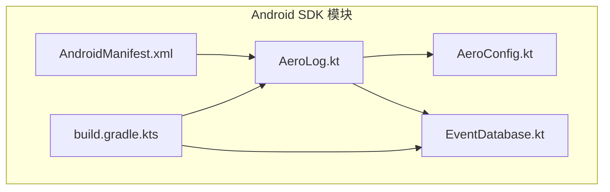
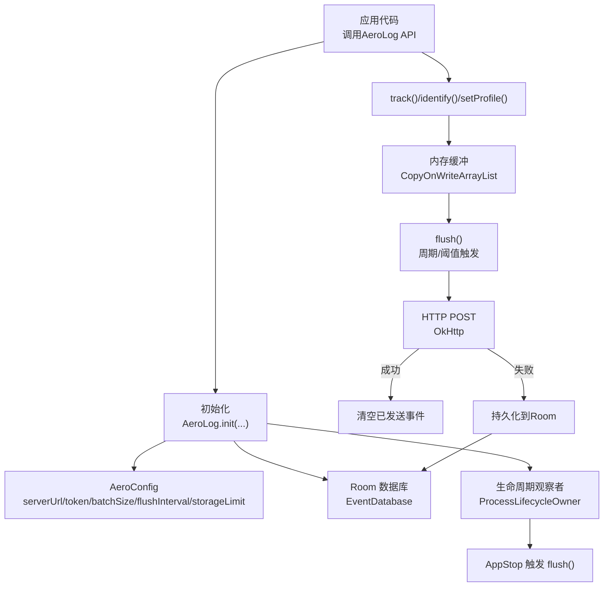
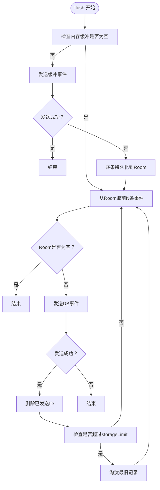
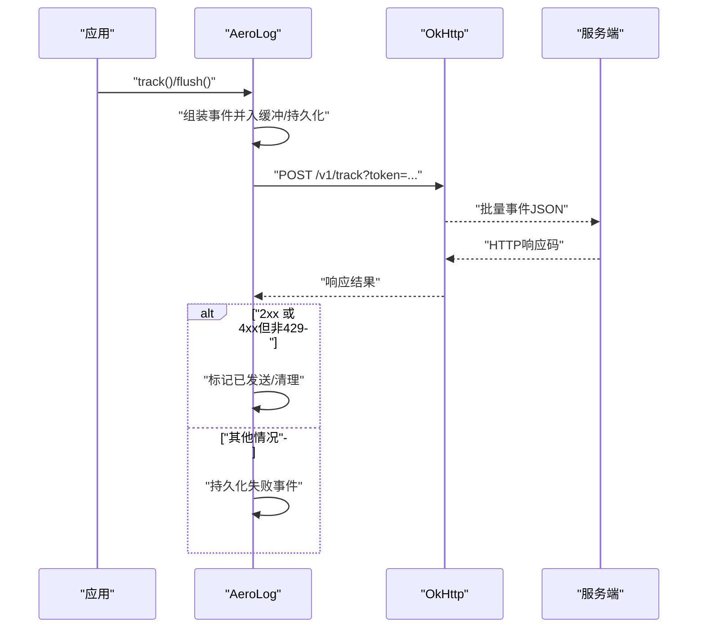
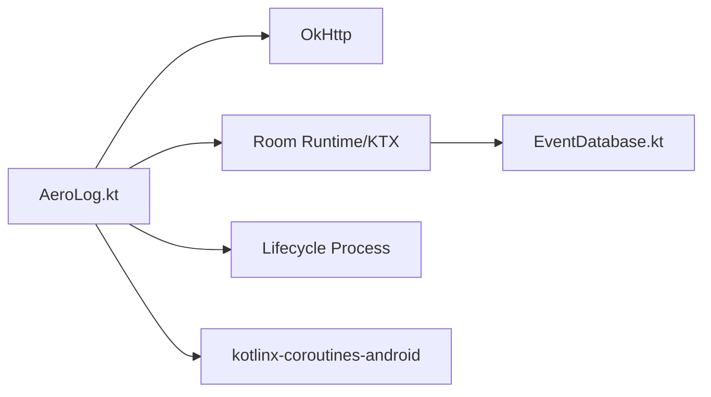

# Android SDK集成

<cite>
**本文引用的文件**
- [README.md](file://sdk/android/README.md)
- [AeroLog.kt](file://sdk/android/aerolog/src/main/java/dev/aerolog/sdk/AeroLog.kt)
- [AeroConfig.kt](file://sdk/android/aerolog/src/main/java/dev/aerolog/sdk/AeroConfig.kt)
- [EventDatabase.kt](file://sdk/android/aerolog/src/main/java/dev/aerolog/sdk/storage/EventDatabase.kt)
- [AndroidManifest.xml](file://sdk/android/aerolog/src/main/AndroidManifest.xml)
- [build.gradle.kts](file://sdk/android/aerolog/build.gradle.kts)
</cite>

## 目录
1. [简介](#简介)
2. [项目结构](#项目结构)
3. [核心组件](#核心组件)
4. [架构总览](#架构总览)
5. [详细组件分析](#详细组件分析)
6. [依赖关系分析](#依赖关系分析)
7. [性能考虑](#性能考虑)
8. [故障排查指南](#故障排查指南)
9. [结论](#结论)
10. [附录](#附录)

## 简介
本指南面向需要在Android应用中集成AeroLog SDK的开发者，覆盖从Gradle依赖引入、JitPack配置与版本选择、AeroLog初始化与AeroConfig参数说明，到事件追踪、用户标识、属性设置与手动上报的完整API使用流程。同时提供Android平台特有的网络权限、后台执行限制与电池优化处理建议，并深入解析离线缓存机制（SharedPreferences与Room数据库）在前台/后台状态下的行为，最后给出混淆与性能优化建议。

## 项目结构
Android SDK位于sdk/android/aerolog模块，采用标准Android Library结构，核心入口为AeroLog对象，配置项由AeroConfig承载，离线缓存通过Room数据库实现，清单文件声明必要的网络权限。

**图表来源**
- [AeroLog.kt:1-216](file://sdk/android/aerolog/src/main/java/dev/aerolog/sdk/AeroLog.kt#L1-L216)
- [AeroConfig.kt:1-16](file://sdk/android/aerolog/src/main/java/dev/aerolog/sdk/AeroConfig.kt#L1-L16)
- [EventDatabase.kt:1-41](file://sdk/android/aerolog/src/main/java/dev/aerolog/sdk/storage/EventDatabase.kt#L1-L41)
- [AndroidManifest.xml:1-5](file://sdk/android/aerolog/src/main/AndroidManifest.xml#L1-L5)
- [build.gradle.kts:1-34](file://sdk/android/aerolog/build.gradle.kts#L1-L34)

**章节来源**
- [README.md:1-44](file://sdk/android/README.md#L1-L44)
- [build.gradle.kts:1-34](file://sdk/android/aerolog/build.gradle.kts#L1-L34)

## 核心组件
- AeroLog：SDK入口对象，负责初始化、事件入缓冲、自动/手动上报、生命周期与Activity回调接入、会话管理、匿名ID与用户ID持久化等。
- AeroConfig：SDK配置对象，包含服务端地址、令牌、批量大小、刷新间隔、存储上限、是否自动追踪应用生命周期与Activity、调试开关等。
- EventDatabase：基于Room的离线存储，用于失败/离线场景下持久化事件，支持批量拉取、删除、计数与淘汰最旧记录。

**章节来源**
- [AeroLog.kt:37-216](file://sdk/android/aerolog/src/main/java/dev/aerolog/sdk/AeroLog.kt#L37-L216)
- [AeroConfig.kt:6-15](file://sdk/android/aerolog/src/main/java/dev/aerolog/sdk/AeroConfig.kt#L6-L15)
- [EventDatabase.kt:12-41](file://sdk/android/aerolog/src/main/java/dev/aerolog/sdk/storage/EventDatabase.kt#L12-L41)

## 架构总览
Android SDK整体架构围绕"内存缓冲 + Room持久化"的双层离线策略，结合周期性flush与生命周期事件触发上报，确保在网络不稳定或应用退后台时仍能可靠落地数据。

**图表来源**
- [AeroLog.kt:59-80](file://sdk/android/aerolog/src/main/java/dev/aerolog/sdk/AeroLog.kt#L59-L80)
- [AeroLog.kt:108-124](file://sdk/android/aerolog/src/main/java/dev/aerolog/sdk/AeroLog.kt#L108-L124)
- [AeroLog.kt:175-190](file://sdk/android/aerolog/src/main/java/dev/aerolog/sdk/AeroLog.kt#L175-L190)
- [EventDatabase.kt:19-41](file://sdk/android/aerolog/src/main/java/dev/aerolog/sdk/storage/EventDatabase.kt#L19-L41)

## 详细组件分析

### Gradle依赖与引入方式
- 本地模块依赖：在settings.gradle.kts中包含sdk:android:aerolog模块，在app模块的build.gradle.kts中以implementation(project(...))方式引入。
- 版本与仓库：当前模块版本在构建配置中定义，若需通过JitPack发布，请参考JitPack官方流程在项目根目录添加JitPack仓库与依赖坐标；版本号可依据仓库release或commit SHA进行选择。

**章节来源**
- [README.md:7-15](file://sdk/android/README.md#L7-L15)
- [build.gradle.kts:14](file://sdk/android/aerolog/build.gradle.kts#L14)

### AeroLog初始化与AeroConfig参数
- 初始化入口：AeroLog.init(Application, AeroConfig)，内部完成Room数据库构建、匿名ID与用户ID的SharedPreferences持久化、生命周期与Activity回调注册（取决于配置）以及周期性flush协程启动。
- 关键配置项：
  - serverUrl：服务端收集接口基础URL。
  - token：上报鉴权令牌。
  - batchSize：内存缓冲达到该阈值时触发一次flush。
  - flushIntervalMs：周期性flush的时间间隔。
  - storageLimit：Room中最大持久化事件条数，超限按最早记录淘汰。
  - autoTrackAppLifecycle：是否自动追踪应用生命周期事件（启动/停止）。
  - autoTrackActivity：是否自动追踪Activity可见变化（页面曝光）。
  - debug：调试开关（影响日志输出级别）。

**章节来源**
- [AeroLog.kt:59-80](file://sdk/android/aerolog/src/main/java/dev/aerolog/sdk/AeroLog.kt#L59-L80)
- [AeroConfig.kt:6-15](file://sdk/android/aerolog/src/main/java/dev/aerolog/sdk/AeroConfig.kt#L6-L15)

### API使用示例（事件追踪、用户标识、属性设置、手动上报）
- 事件追踪：track("事件名", 属性映射)。
- 用户标识：identify("用户ID")；logout()清除用户标识。
- 设置用户属性：setProfile(属性映射)。
- 设置全局属性：registerSuperProperties(属性映射)。
- 手动上报：flush()（挂起函数），立即尝试发送内存缓冲与持久化队列中的事件。

**章节来源**
- [AeroLog.kt:82-105](file://sdk/android/aerolog/src/main/java/dev/aerolog/sdk/AeroLog.kt#L82-L105)
- [AeroLog.kt:108-124](file://sdk/android/aerolog/src/main/java/dev/aerolog/sdk/AeroLog.kt#L108-L124)

### 生命周期与Activity自动追踪
- 应用生命周期：当ProcessLifecycle进入前台时自动track"AppStart"，进入后台时track"AppEnd"并触发flush。
- Activity可见：onActivityResumed时自动track"AppViewScreen"并携带屏幕名称。

**章节来源**
- [AeroLog.kt:192-214](file://sdk/android/aerolog/src/main/java/dev/aerolog/sdk/AeroLog.kt#L192-L214)

### 离线缓存机制（SharedPreferences与Room）
- SharedPreferences：
  - 匿名ID：首次运行生成并持久化；后续启动复用。
  - 用户ID：identify后持久化；logout移除。
- Room持久化：
  - 存储实体：StoredEvent（id、payload、created_at）。
  - DAO操作：插入、按ID升序取N条、删除指定ID列表、统计数量、淘汰最旧N条。
  - flush流程：先发送内存缓冲，失败则将批次事件逐条持久化；再循环从Room取批量事件发送并删除已成功项；超出storageLimit时先淘汰最旧记录。

**图表来源**
- [AeroLog.kt:108-124](file://sdk/android/aerolog/src/main/java/dev/aerolog/sdk/AeroLog.kt#L108-L124)
- [AeroLog.kt:167-173](file://sdk/android/aerolog/src/main/java/dev/aerolog/sdk/AeroLog.kt#L167-L173)
- [EventDatabase.kt:19-41](file://sdk/android/aerolog/src/main/java/dev/aerolog/sdk/storage/EventDatabase.kt#L19-L41)

### Android特有配置与注意事项
- 网络权限：INTERNET与ACCESS_NETWORK_STATE已在清单中声明，确保应用具备网络访问能力。
- 后台执行限制：Android对后台任务有限制，建议通过周期性flush与生命周期事件（AppStop）触发主动上报，避免依赖长驻后台任务。
- 电池优化：将应用加入白名单可减少系统节流对上报的影响；必要时可在应用内引导用户关闭电池优化。

**章节来源**
- [AndroidManifest.xml:1-5](file://sdk/android/aerolog/src/main/AndroidManifest.xml#L1-L5)
- [AeroLog.kt:195-198](file://sdk/android/aerolog/src/main/java/dev/aerolog/sdk/AeroLog.kt#L195-L198)

### 上报流程与错误处理
- 请求构造：POST至"/v1/track?token=..."，携带自定义头"X-AeroLog-SDK: android/版本号"，请求体为JSON数组。
- 成功判断：HTTP 2xx视为成功；4xx且非429视为服务端拒绝，不重试。
- 失败回退：发送失败的事件会被持久化到Room，等待后续flush重试。

**图表来源**
- [AeroLog.kt:175-190](file://sdk/android/aerolog/src/main/java/dev/aerolog/sdk/AeroLog.kt#L175-L190)

## 依赖关系分析
Android SDK主要外部依赖包括Room（离线缓存）、OkHttp（HTTP客户端）、kotlinx-coroutines-android（异步调度）、AndroidX Lifecycle（进程生命周期观察）。

**图表来源**
- [AeroLog.kt:11-26](file://sdk/android/aerolog/src/main/java/dev/aerolog/sdk/AeroLog.kt#L11-L26)
- [build.gradle.kts:25-33](file://sdk/android/aerolog/build.gradle.kts#L25-L33)

**章节来源**
- [build.gradle.kts:25-33](file://sdk/android/aerolog/build.gradle.kts#L25-L33)

## 性能考虑
- 批量与频率：合理设置batchSize与flushIntervalMs，平衡实时性与网络开销。
- 缓冲与持久化：利用内存缓冲降低频繁IO；失败事件落盘，避免丢失。
- 生命周期联动：利用AppStop主动flush，减少后台任务依赖。
- 线程模型：使用IO调度器与SupervisorJob隔离异常，避免协程泄漏。
- 存储上限：根据设备存储与业务量设定storageLimit，防止无限增长。

## 故障排查指南
- 未初始化：在调用API前必须先init，否则会抛出未初始化错误。
- 网络问题：确认INTERNET与ACCESS_NETWORK_STATE权限已生效；检查serverUrl与token正确性。
- 上报失败：关注HTTP响应码；429为速率限制，需退避重试；4xx非429表示不可重试。
- 事件丢失：检查storageLimit与flush触发条件；确保AppStop能触发flush。
- 用户标识：identify后应检查SharedPreferences中用户ID是否更新；logout会移除用户ID。

**章节来源**
- [AeroLog.kt:129](file://sdk/android/aerolog/src/main/java/dev/aerolog/sdk/AeroLog.kt#L129)
- [AeroLog.kt:184-189](file://sdk/android/aerolog/src/main/java/dev/aerolog/sdk/AeroLog.kt#L184-L189)

## 结论
AeroLog Android SDK通过"内存缓冲 + Room持久化"的双层离线策略，结合生命周期与Activity自动追踪，能够在复杂网络环境下稳定地采集与上报事件。合理配置AeroConfig参数、遵循Android平台限制并做好混淆与性能优化，可获得更可靠的埋点体验。

## 附录

### Gradle依赖与版本选择
- 本地模块依赖：在settings.gradle.kts中包含模块并在app模块中implementation(project(...))。
- JitPack：如需通过JitPack发布，请在项目根目录添加JitPack仓库与依赖坐标；版本号可依据仓库release或commit SHA选择。

**章节来源**
- [README.md:7-15](file://sdk/android/README.md#L7-L15)

### Android权限与清单
- 必要权限：INTERNET与ACCESS_NETWORK_STATE。
- 建议：在应用内提示用户允许后台运行与电池优化豁免，提升上报稳定性。

**章节来源**
- [AndroidManifest.xml:1-5](file://sdk/android/aerolog/src/main/AndroidManifest.xml#L1-L5)

### 离线缓存与容量控制
- SharedPreferences：匿名ID与用户ID持久化。
- Room：事件持久化，支持取N条、删除、计数与淘汰最旧记录；flush时优先发送持久化事件。

**章节来源**
- [AeroLog.kt:38-68](file://sdk/android/aerolog/src/main/java/dev/aerolog/sdk/AeroLog.kt#L38-L68)
- [AeroLog.kt:167-173](file://sdk/android/aerolog/src/main/java/dev/aerolog/sdk/AeroLog.kt#L167-L173)
- [EventDatabase.kt:19-41](file://sdk/android/aerolog/src/main/java/dev/aerolog/sdk/storage/EventDatabase.kt#L19-L41)

### 混淆与打包建议
- 由于SDK为库模块，建议在消费方应用的混淆规则中保持AeroLog相关类与成员不被混淆，确保反射与序列化正常工作。
- 若使用R8/ProGuard，请保留SDK公开API签名与内部实体类字段名，避免运行时异常。