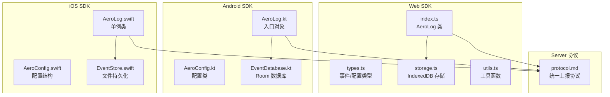
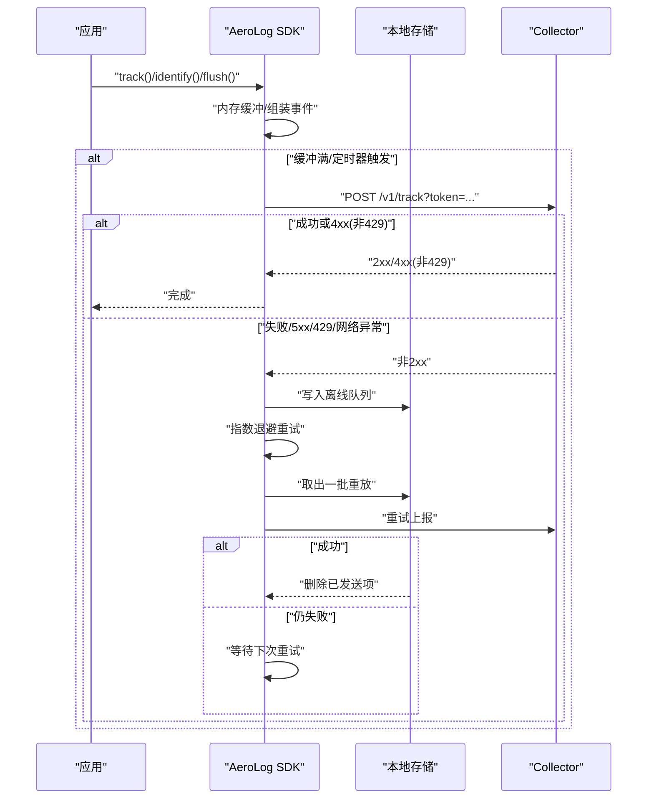
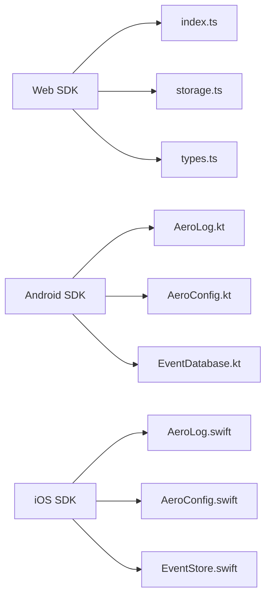

# SDK集成指南

<cite>
**本文引用的文件**
- [sdk/web/src/index.ts](file://sdk/web/src/index.ts)
- [sdk/web/src/types.ts](file://sdk/web/src/types.ts)
- [sdk/web/src/storage.ts](file://sdk/web/src/storage.ts)
- [sdk/web/src/utils.ts](file://sdk/web/src/utils.ts)
- [sdk/web/package.json](file://sdk/web/package.json)
- [sdk/web/README.md](file://sdk/web/README.md)
- [sdk/android/aerolog/src/main/java/dev/aerolog/sdk/AeroLog.kt](file://sdk/android/aerolog/src/main/java/dev/aerolog/sdk/AeroLog.kt)
- [sdk/android/aerolog/src/main/java/dev/aerolog/sdk/AeroConfig.kt](file://sdk/android/aerolog/src/main/java/dev/aerolog/sdk/AeroConfig.kt)
- [sdk/android/aerolog/src/main/java/dev/aerolog/sdk/storage/EventDatabase.kt](file://sdk/android/aerolog/src/main/java/dev/aerolog/sdk/storage/EventDatabase.kt)
- [sdk/android/aerolog/build.gradle.kts](file://sdk/android/aerolog/build.gradle.kts)
- [sdk/android/README.md](file://sdk/android/README.md)
- [sdk/ios/Sources/AeroLog/AeroLog.swift](file://sdk/ios/Sources/AeroLog/AeroLog.swift)
- [sdk/ios/Sources/AeroLog/AeroConfig.swift](file://sdk/ios/Sources/AeroLog/AeroConfig.swift)
- [sdk/ios/Sources/AeroLog/EventStore.swift](file://sdk/ios/Sources/AeroLog/EventStore.swift)
- [sdk/ios/Package.swift](file://sdk/ios/Package.swift)
- [sdk/ios/README.md](file://sdk/ios/README.md)
- [docs/protocol.md](file://docs/protocol.md)
</cite>

## 目录
1. [简介](#简介)
2. [项目结构](#项目结构)
3. [核心组件](#核心组件)
4. [架构总览](#架构总览)
5. [详细组件分析](#详细组件分析)
6. [依赖关系分析](#依赖关系分析)
7. [性能考量](#性能考量)
8. [故障排查指南](#故障排查指南)
9. [结论](#结论)
10. [附录](#附录)

## 简介
本指南面向需要在Web、Android与iOS三端集成AeroLog多端SDK的开发者，提供从安装配置到API使用的完整流程，以及跨端统一协议、离线缓存、批量上报与错误重试等机制的深入说明。文中所有技术细节均基于仓库源码与协议文档整理，确保一致性与可操作性。

## 项目结构
AeroLog采用“多端SDK + 统一协议”的架构：三端SDK分别实现各自的事件采集、离线存储与上报逻辑，并通过统一的Collector接口完成数据上报；Server侧负责接收、校验与处理。

图表来源
- [sdk/web/src/index.ts:16-297](file://sdk/web/src/index.ts#L16-L297)
- [sdk/web/src/types.ts:1-47](file://sdk/web/src/types.ts#L1-L47)
- [sdk/web/src/storage.ts:16-141](file://sdk/web/src/storage.ts#L16-L141)
- [sdk/web/src/utils.ts:1-80](file://sdk/web/src/utils.ts#L1-L80)
- [sdk/android/aerolog/src/main/java/dev/aerolog/sdk/AeroLog.kt:37-216](file://sdk/android/aerolog/src/main/java/dev/aerolog/sdk/AeroLog.kt#L37-L216)
- [sdk/android/aerolog/src/main/java/dev/aerolog/sdk/AeroConfig.kt:6-15](file://sdk/android/aerolog/src/main/java/dev/aerolog/sdk/AeroConfig.kt#L6-L15)
- [sdk/android/aerolog/src/main/java/dev/aerolog/sdk/storage/EventDatabase.kt:12-41](file://sdk/android/aerolog/src/main/java/dev/aerolog/sdk/storage/EventDatabase.kt#L12-L41)
- [sdk/ios/Sources/AeroLog/AeroLog.swift:7-207](file://sdk/ios/Sources/AeroLog/AeroLog.swift#L7-L207)
- [sdk/ios/Sources/AeroLog/AeroConfig.swift:3-30](file://sdk/ios/Sources/AeroLog/AeroConfig.swift#L3-L30)
- [sdk/ios/Sources/AeroLog/EventStore.swift:5-75](file://sdk/ios/Sources/AeroLog/EventStore.swift#L5-L75)
- [docs/protocol.md:1-118](file://docs/protocol.md#L1-L118)

章节来源
- [sdk/web/src/index.ts:16-297](file://sdk/web/src/index.ts#L16-L297)
- [sdk/android/aerolog/src/main/java/dev/aerolog/sdk/AeroLog.kt:37-216](file://sdk/android/aerolog/src/main/java/dev/aerolog/sdk/AeroLog.kt#L37-L216)
- [sdk/ios/Sources/AeroLog/AeroLog.swift:7-207](file://sdk/ios/Sources/AeroLog/AeroLog.swift#L7-L207)
- [docs/protocol.md:1-118](file://docs/protocol.md#L1-L118)

## 核心组件
- Web SDK：提供AeroLog类，支持内存批量、IndexedDB离线落盘、指数退避重试、自动属性采集与生命周期事件追踪。
- Android SDK：提供AeroLog单例对象，使用Room进行离线存储，协程调度周期flush，自动采集系统信息与应用生命周期事件。
- iOS SDK：提供AeroLog单例类，使用文件+行JSON持久化，定时器驱动flush，自动采集设备信息与应用生命周期事件。
- 统一协议：三端均遵循相同的上报端点、请求体格式与预置属性/事件规范，确保跨端一致性。

章节来源
- [sdk/web/src/index.ts:16-297](file://sdk/web/src/index.ts#L16-L297)
- [sdk/web/src/types.ts:16-46](file://sdk/web/src/types.ts#L16-L46)
- [sdk/android/aerolog/src/main/java/dev/aerolog/sdk/AeroLog.kt:37-216](file://sdk/android/aerolog/src/main/java/dev/aerolog/sdk/AeroLog.kt#L37-L216)
- [sdk/ios/Sources/AeroLog/AeroLog.swift:7-207](file://sdk/ios/Sources/AeroLog/AeroLog.swift#L7-L207)
- [docs/protocol.md:5-48](file://docs/protocol.md#L5-L48)

## 架构总览
三端SDK均采用“内存批量 → 失败落盘 → 退避重传”的三层上报策略，并在各自平台的生命周期中触发flush与自动事件采集。

图表来源
- [sdk/web/src/index.ts:116-182](file://sdk/web/src/index.ts#L116-L182)
- [sdk/web/src/storage.ts:46-94](file://sdk/web/src/storage.ts#L46-L94)
- [sdk/android/aerolog/src/main/java/dev/aerolog/sdk/AeroLog.kt:108-124](file://sdk/android/aerolog/src/main/java/dev/aerolog/sdk/AeroLog.kt#L108-L124)
- [sdk/android/aerolog/src/main/java/dev/aerolog/sdk/storage/EventDatabase.kt:20-35](file://sdk/android/aerolog/src/main/java/dev/aerolog/sdk/storage/EventDatabase.kt#L20-L35)
- [sdk/ios/Sources/AeroLog/AeroLog.swift:140-156](file://sdk/ios/Sources/AeroLog/AeroLog.swift#L140-L156)
- [sdk/ios/Sources/AeroLog/EventStore.swift:27-64](file://sdk/ios/Sources/AeroLog/EventStore.swift#L27-L64)
- [docs/protocol.md:80-107](file://docs/protocol.md#L80-L107)

## 详细组件分析

### Web SDK 集成指南
- 安装与初始化
  - 使用包管理器安装Web SDK包。
  - 初始化时传入serverUrl与token，并可选择是否自动追踪页面浏览与点击。
  - 支持设置批次大小、刷新间隔、本地存储上限与调试开关。
- 基础使用
  - 记录事件：track(event, properties)
  - 用户标识：identify(userId)、logout()
  - 设置用户属性：setProfile(props)
  - 立即上报：flush()（适用于SPA路由切换前等待）
- 离线与重试
  - 缓冲满或定时器触发时上报；失败则写入IndexedDB（不可用时降级内存数组）。
  - 指数退避重试序列，网络恢复时立即重传。
- 自动属性
  - 自动采集操作系统、浏览器、屏幕尺寸、网络类型、UA等信息，并生成$session_id与$insert_id。

章节来源
- [sdk/web/README.md:5-35](file://sdk/web/README.md#L5-L35)
- [sdk/web/package.json:1-29](file://sdk/web/package.json#L1-L29)
- [sdk/web/src/index.ts:28-50](file://sdk/web/src/index.ts#L28-L50)
- [sdk/web/src/index.ts:54-88](file://sdk/web/src/index.ts#L54-L88)
- [sdk/web/src/index.ts:116-182](file://sdk/web/src/index.ts#L116-L182)
- [sdk/web/src/storage.ts:46-94](file://sdk/web/src/storage.ts#L46-L94)
- [sdk/web/src/utils.ts:38-79](file://sdk/web/src/utils.ts#L38-L79)
- [sdk/web/src/types.ts:16-46](file://sdk/web/src/types.ts#L16-L46)

### Android SDK 集成指南
- Gradle 依赖
  - 将模块作为library引入工程，依赖Room、OkHttp、kotlinx-coroutines与AndroidX Lifecycle。
- 初始化与配置
  - 在Application.onCreate中调用AeroLog.init，传入AeroConfig（包含serverUrl、token、批次大小、刷新间隔、存储上限、是否自动追踪生命周期与Activity等）。
- 基础使用
  - 记录事件：AeroLog.track(event, properties)
  - 用户标识：AeroLog.identify(userId)、AeroLog.logout()
  - 设置用户属性：AeroLog.setProfile(props)
  - 注册公共属性：AeroLog.registerSuperProperties(props)
  - 立即上报：suspend fun flush()
- 离线与重试
  - 内存缓冲满或定时器触发上报；失败则写入Room数据库（SQLite）。
  - App进入后台时主动flush，减少丢失风险。

章节来源
- [sdk/android/README.md:5-36](file://sdk/android/README.md#L5-L36)
- [sdk/android/aerolog/build.gradle.kts:25-33](file://sdk/android/aerolog/build.gradle.kts#L25-L33)
- [sdk/android/aerolog/src/main/java/dev/aerolog/sdk/AeroConfig.kt:6-15](file://sdk/android/aerolog/src/main/java/dev/aerolog/sdk/AeroConfig.kt#L6-L15)
- [sdk/android/aerolog/src/main/java/dev/aerolog/sdk/AeroLog.kt:59-80](file://sdk/android/aerolog/src/main/java/dev/aerolog/sdk/AeroLog.kt#L59-L80)
- [sdk/android/aerolog/src/main/java/dev/aerolog/sdk/AeroLog.kt:82-105](file://sdk/android/aerolog/src/main/java/dev/aerolog/sdk/AeroLog.kt#L82-L105)
- [sdk/android/aerolog/src/main/java/dev/aerolog/sdk/AeroLog.kt:108-124](file://sdk/android/aerolog/src/main/java/dev/aerolog/sdk/AeroLog.kt#L108-L124)
- [sdk/android/aerolog/src/main/java/dev/aerolog/sdk/AeroLog.kt:167-173](file://sdk/android/aerolog/src/main/java/dev/aerolog/sdk/AeroLog.kt#L167-L173)
- [sdk/android/aerolog/src/main/java/dev/aerolog/sdk/storage/EventDatabase.kt:12-41](file://sdk/android/aerolog/src/main/java/dev/aerolog/sdk/storage/EventDatabase.kt#L12-L41)

### iOS SDK 集成指南
- Swift Package Manager 配置
  - 在Package.swift中添加对本地iOS SDK的引用，或通过Xcode界面添加本地包。
- 初始化与配置
  - 在应用启动时调用AeroLog.shared.setup，传入AeroConfig（包含serverUrl、token、批次大小、刷新间隔、存储上限、是否自动追踪生命周期等）。
- 基础使用
  - 记录事件：AeroLog.shared.track(event, properties)
  - 用户标识：AeroLog.shared.identify(userId)、AeroLog.shared.logout()
  - 设置用户属性：AeroLog.shared.setProfile(props)
  - 注册公共属性：AeroLog.shared.registerSuperProperties(props)
  - 立即上报：AeroLog.shared.flush(completion:)
- 离线与重试
  - 内存缓冲满或定时器触发上报；失败则写入Application Support目录下的events.ndjson文件。
  - App进入后台时主动flush，减少丢失风险。

章节来源
- [sdk/ios/README.md:5-34](file://sdk/ios/README.md#L5-L34)
- [sdk/ios/Package.swift:4-14](file://sdk/ios/Package.swift#L4-L14)
- [sdk/ios/Sources/AeroLog/AeroConfig.swift:12-30](file://sdk/ios/Sources/AeroLog/AeroConfig.swift#L12-L30)
- [sdk/ios/Sources/AeroLog/AeroLog.swift:33-48](file://sdk/ios/Sources/AeroLog/AeroLog.swift#L33-L48)
- [sdk/ios/Sources/AeroLog/AeroLog.swift:50-75](file://sdk/ios/Sources/AeroLog/AeroLog.swift#L50-L75)
- [sdk/ios/Sources/AeroLog/AeroLog.swift:77-82](file://sdk/ios/Sources/AeroLog/AeroLog.swift#L77-L82)
- [sdk/ios/Sources/AeroLog/AeroLog.swift:140-156](file://sdk/ios/Sources/AeroLog/AeroLog.swift#L140-L156)
- [sdk/ios/Sources/AeroLog/EventStore.swift:16-64](file://sdk/ios/Sources/AeroLog/EventStore.swift#L16-L64)

### 统一协议设计
- 端点与头部
  - POST /v1/track?token={projectToken}
  - Content-Type: application/json
  - X-AeroLog-SDK: web/0.1.0 或 android/0.1.0 或 ios/0.1.0
- 请求体
  - 支持单条或批量数组；事件包含type、event、distinct_id、anonymous_id、user_id、time、lib与properties。
- 预置属性与事件
  - 三端均自动采集$lib、$lib_version、$os、$os_version、$screen_*、$network_type等；并提供$AppStart、$AppEnd、$pageview、$SignUp等预置事件。
- 响应与错误码
  - 成功返回accepted计数；服务端错误或限流时SDK应缓存并重试。

章节来源
- [docs/protocol.md:5-48](file://docs/protocol.md#L5-L48)
- [docs/protocol.md:50-79](file://docs/protocol.md#L50-L79)
- [docs/protocol.md:80-107](file://docs/protocol.md#L80-L107)
- [sdk/web/src/types.ts:16-25](file://sdk/web/src/types.ts#L16-L25)
- [sdk/web/src/types.ts:27-46](file://sdk/web/src/types.ts#L27-L46)
- [sdk/android/aerolog/src/main/java/dev/aerolog/sdk/AeroLog.kt:175-190](file://sdk/android/aerolog/src/main/java/dev/aerolog/sdk/AeroLog.kt#L175-L190)
- [sdk/ios/Sources/AeroLog/AeroLog.swift:158-181](file://sdk/ios/Sources/AeroLog/AeroLog.swift#L158-L181)
- [sdk/web/src/index.ts:147-170](file://sdk/web/src/index.ts#L147-L170)

### 离线缓存机制
- Web
  - IndexedDB持久化，不支持时降级内存数组；支持容量控制与逐出策略。
- Android
  - Room数据库（SQLite）持久化，支持容量裁剪与删除。
- iOS
  - 文件+行JSON持久化（events.ndjson），支持容量裁剪与逐出策略。

章节来源
- [sdk/web/src/storage.ts:46-125](file://sdk/web/src/storage.ts#L46-L125)
- [sdk/android/aerolog/src/main/java/dev/aerolog/sdk/storage/EventDatabase.kt:20-35](file://sdk/android/aerolog/src/main/java/dev/aerolog/sdk/storage/EventDatabase.kt#L20-L35)
- [sdk/ios/Sources/AeroLog/EventStore.swift:27-73](file://sdk/ios/Sources/AeroLog/EventStore.swift#L27-L73)

### 批量上报与重试策略
- 批量策略
  - 默认批次大小50条，刷新间隔5秒；缓冲满时提前触发。
- 错误重试
  - 指数退避序列（1s、3s、10s、30s、60s、300s），网络恢复时立即重传。
- 丢弃规则
  - 4xx（非429）视为服务端拒绝，丢弃不重试；429限流与5xx/网络异常需持久化重试。

章节来源
- [sdk/web/src/index.ts:116-182](file://sdk/web/src/index.ts#L116-L182)
- [sdk/web/src/utils.ts:75-79](file://sdk/web/src/utils.ts#L75-L79)
- [sdk/android/aerolog/src/main/java/dev/aerolog/sdk/AeroLog.kt:175-190](file://sdk/android/aerolog/src/main/java/dev/aerolog/sdk/AeroLog.kt#L175-L190)
- [sdk/ios/Sources/AeroLog/AeroLog.swift:158-181](file://sdk/ios/Sources/AeroLog/AeroLog.swift#L158-L181)
- [docs/protocol.md:100-107](file://docs/protocol.md#L100-L107)

### 生命周期与自动事件
- Web
  - 页面可见性变化与页面卸载时尝试sendBeacon；在线状态变化时重试；可选自动追踪页面浏览与点击。
- Android
  - 应用前后台切换自动追踪$AppStart/$AppEnd；Activity onResume时追踪$AppViewScreen。
- iOS
  - 应用激活/进入后台自动追踪$AppStart/$AppEnd；定时器周期flush。

章节来源
- [sdk/web/src/index.ts:184-240](file://sdk/web/src/index.ts#L184-L240)
- [sdk/android/aerolog/src/main/java/dev/aerolog/sdk/AeroLog.kt:192-214](file://sdk/android/aerolog/src/main/java/dev/aerolog/sdk/AeroLog.kt#L192-L214)
- [sdk/ios/Sources/AeroLog/AeroLog.swift:188-201](file://sdk/ios/Sources/AeroLog/AeroLog.swift#L188-L201)
- [sdk/ios/Sources/AeroLog/AeroLog.swift:132-138](file://sdk/ios/Sources/AeroLog/AeroLog.swift#L132-L138)

## 依赖关系分析
- Web
  - 依赖：fetch、IndexedDB、localStorage、navigator、window/document等。
  - 外部依赖：无（纯前端能力）。
- Android
  - 依赖：OkHttp、Room、kotlinx-coroutines、AndroidX Lifecycle。
- iOS
  - 依赖：Foundation、UIKit（可选）、URLSession、UserDefaults、Timer。

图表来源
- [sdk/web/src/index.ts:16-297](file://sdk/web/src/index.ts#L16-L297)
- [sdk/web/src/storage.ts:16-141](file://sdk/web/src/storage.ts#L16-L141)
- [sdk/web/src/types.ts:1-47](file://sdk/web/src/types.ts#L1-L47)
- [sdk/android/aerolog/src/main/java/dev/aerolog/sdk/AeroLog.kt:37-216](file://sdk/android/aerolog/src/main/java/dev/aerolog/sdk/AeroLog.kt#L37-L216)
- [sdk/android/aerolog/src/main/java/dev/aerolog/sdk/AeroConfig.kt:6-15](file://sdk/android/aerolog/src/main/java/dev/aerolog/sdk/AeroConfig.kt#L6-L15)
- [sdk/android/aerolog/src/main/java/dev/aerolog/sdk/storage/EventDatabase.kt:12-41](file://sdk/android/aerolog/src/main/java/dev/aerolog/sdk/storage/EventDatabase.kt#L12-L41)
- [sdk/ios/Sources/AeroLog/AeroLog.swift:7-207](file://sdk/ios/Sources/AeroLog/AeroLog.swift#L7-L207)
- [sdk/ios/Sources/AeroLog/AeroConfig.swift:3-30](file://sdk/ios/Sources/AeroLog/AeroConfig.swift#L3-L30)
- [sdk/ios/Sources/AeroLog/EventStore.swift:5-75](file://sdk/ios/Sources/AeroLog/EventStore.swift#L5-L75)

章节来源
- [sdk/web/package.json:23-28](file://sdk/web/package.json#L23-L28)
- [sdk/android/aerolog/build.gradle.kts:25-33](file://sdk/android/aerolog/build.gradle.kts#L25-L33)
- [sdk/ios/Package.swift:4-14](file://sdk/ios/Package.swift#L4-L14)

## 性能考量
- 批量与频率
  - 合理设置batchSize与flushInterval，在延迟与吞吐之间取得平衡。
- 存储上限
  - 三端均限制本地存储数量，超限丢弃最旧事件，避免无限增长。
- 退避策略
  - 指数退避降低服务端压力，网络恢复时尽快补齐。
- 平台差异
  - Web端利用sendBeacon降低页面卸载时的数据丢失风险。
  - Android/iOS在后台或生命周期切换时主动flush，提升可靠性。

## 故障排查指南
- 无法连接服务端
  - 检查serverUrl与token配置；确认网络状态与防火墙策略。
- 事件未到达
  - 查看debug日志（若启用）；确认是否命中4xx（非429）丢弃规则。
- 离线数据堆积
  - 检查本地存储容量与退避重试是否正常；关注网络恢复后的重试行为。
- 平台特定问题
  - Web：IndexedDB不可用时降级内存数组；检查localStorage权限。
  - Android：Room数据库初始化失败或迁移异常；检查最小SDK版本与依赖版本。
  - iOS：文件写入失败或容量超限；检查应用支持目录权限与磁盘空间。

章节来源
- [sdk/web/src/index.ts:147-170](file://sdk/web/src/index.ts#L147-L170)
- [sdk/web/src/storage.ts:26-44](file://sdk/web/src/storage.ts#L26-L44)
- [sdk/android/aerolog/src/main/java/dev/aerolog/sdk/AeroLog.kt:175-190](file://sdk/android/aerolog/src/main/java/dev/aerolog/sdk/AeroLog.kt#L175-L190)
- [sdk/ios/Sources/AeroLog/AeroLog.swift:158-181](file://sdk/ios/Sources/AeroLog/AeroLog.swift#L158-L181)

## 结论
AeroLog多端SDK通过统一协议与一致的离线缓存、批量上报与重试机制，为Web、Android与iOS提供了稳定可靠的埋点采集方案。开发者可根据自身平台特性与业务需求，灵活调整配置参数并在生命周期关键节点触发flush，以获得更佳的稳定性与可观测性。

## 附录
- 最佳实践建议
  - 在应用启动时尽早初始化SDK并设置必要的公共属性。
  - SPA场景下在路由切换前调用flush，确保事件及时上报。
  - 合理设置batchSize与flushInterval，兼顾实时性与资源消耗。
  - 在Android/iOS后台或生命周期切换时主动flush，减少数据丢失。
  - 开启debug模式进行开发调试，生产环境关闭以减少日志开销。
  - 定期监控服务端响应与退避重试情况，优化上报策略。