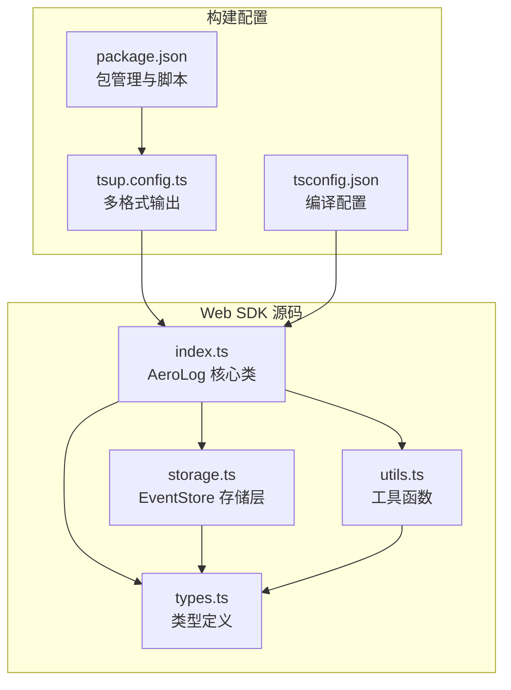
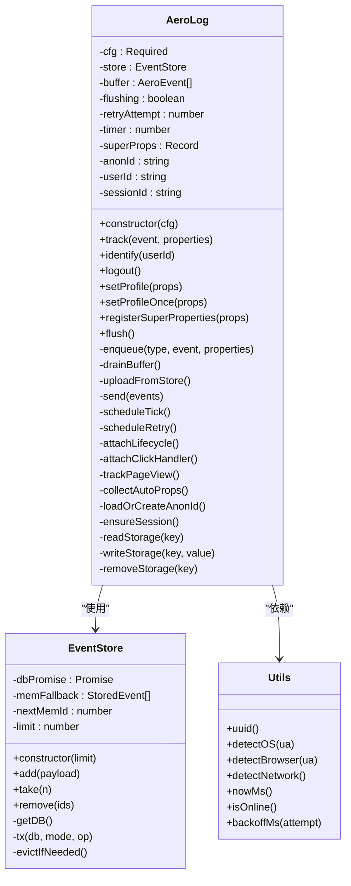
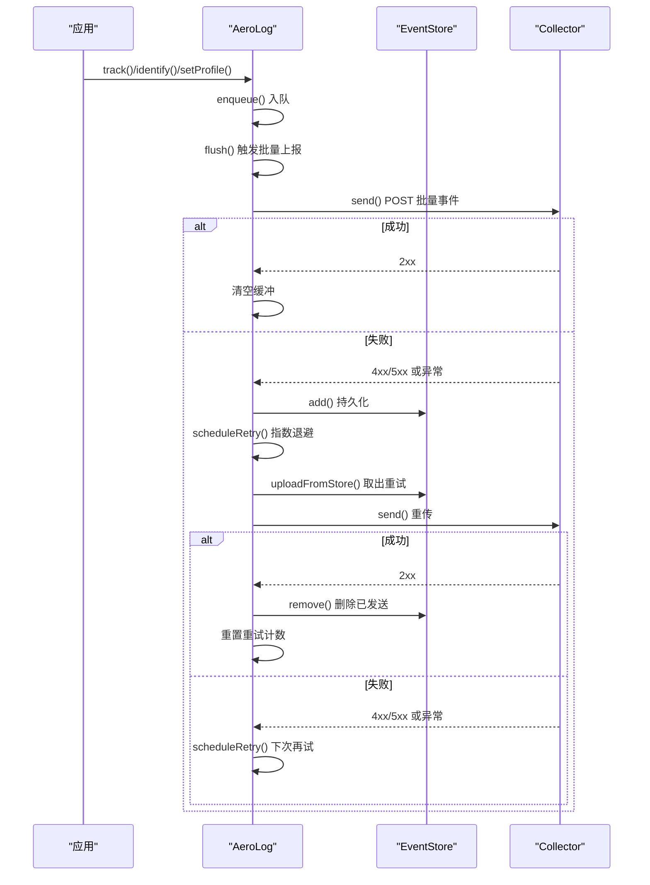
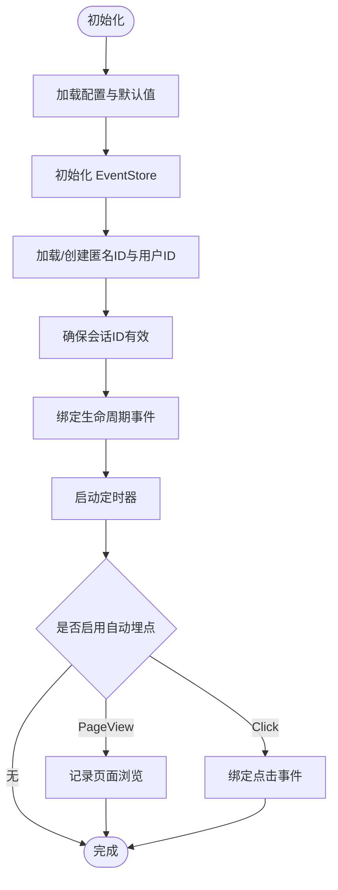
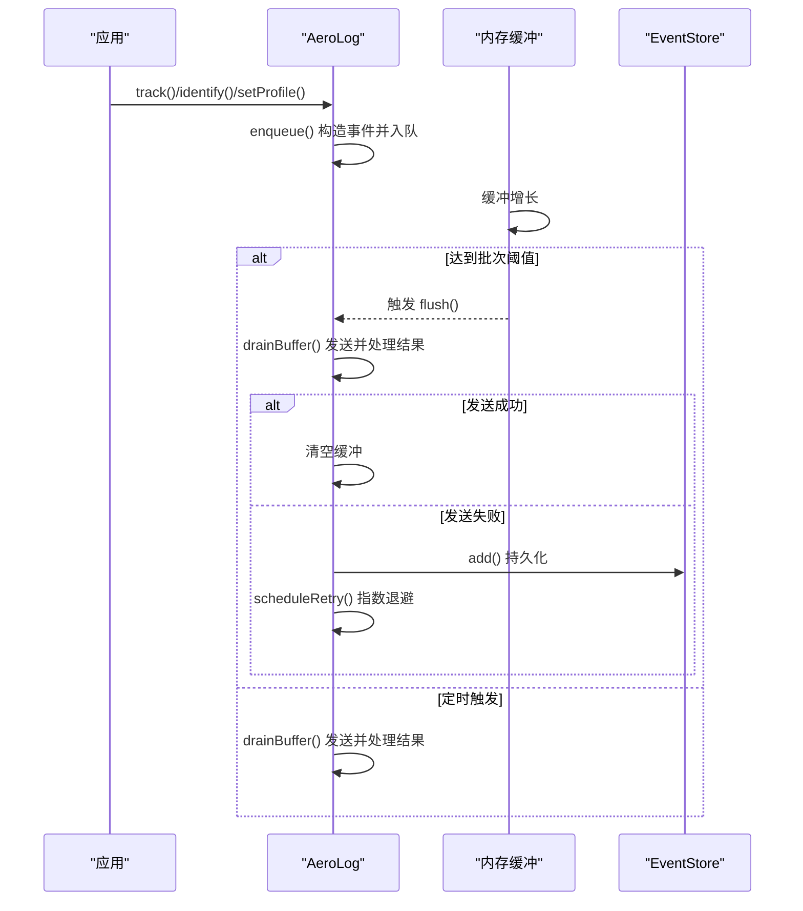
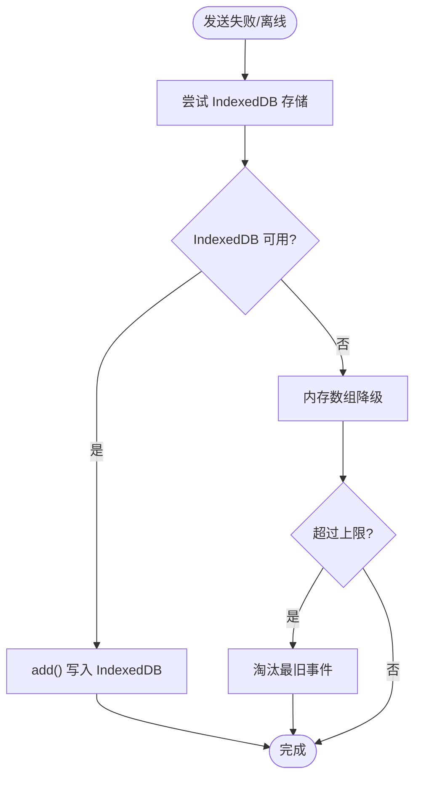
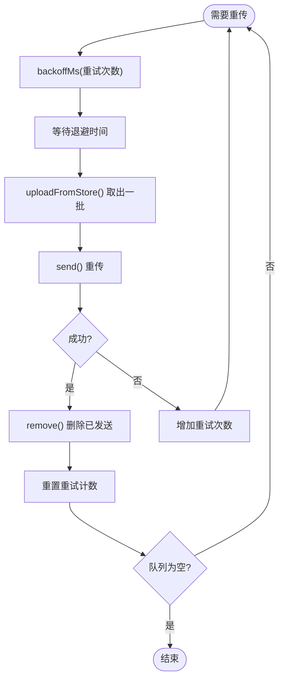
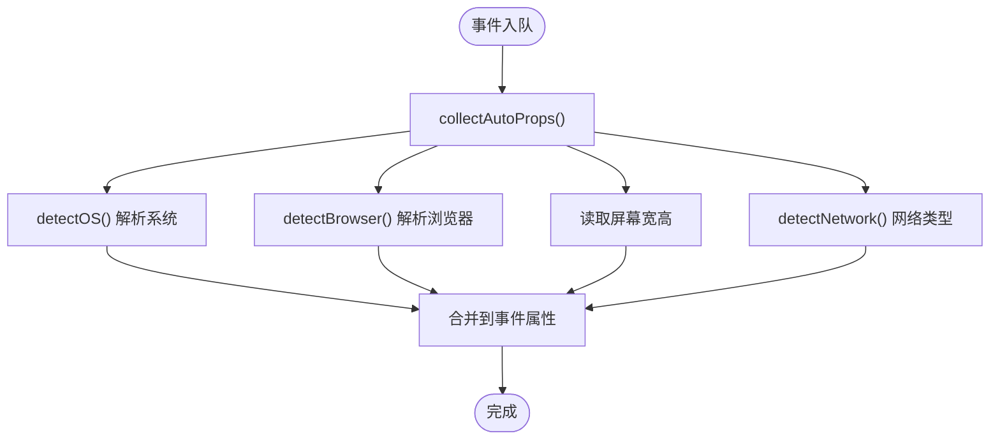
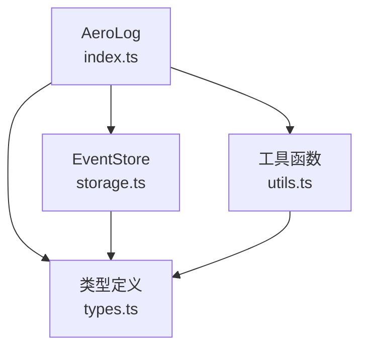

# Web SDK集成

<cite>
**本文档引用的文件**
- [index.ts](file://sdk/web/src/index.ts)
- [storage.ts](file://sdk/web/src/storage.ts)
- [types.ts](file://sdk/web/src/types.ts)
- [utils.ts](file://sdk/web/src/utils.ts)
- [package.json](file://sdk/web/package.json)
- [README.md](file://sdk/web/README.md)
- [tsconfig.json](file://sdk/web/tsconfig.json)
- [tsup.config.ts](file://sdk/web/tsup.config.ts)
- [event.schema.json](file://docs/event.schema.json)
- [architecture.md](file://docs/architecture.md)
</cite>

## 目录
1. [简介](#简介)
2. [项目结构](#项目结构)
3. [核心组件](#核心组件)
4. [架构概览](#架构概览)
5. [详细组件分析](#详细组件分析)
6. [依赖关系分析](#依赖关系分析)
7. [性能考虑](#性能考虑)
8. [故障排查指南](#故障排查指南)
9. [结论](#结论)
10. [附录](#附录)

## 简介
AeroLog Web SDK 是浏览器端埋点采集解决方案，提供以下核心能力：
- 浏览器端事件采集与自动属性收集
- 内存批量上报与定时触发
- IndexedDB 离线缓存与卸载兜底
- 指数退避重传机制
- 统一的事件协议与多端一致性

该 SDK 支持多种安装方式（npm/pnpm/yarn），提供灵活的初始化配置，并通过简单 API 实现事件追踪、用户标识与属性设置。

## 项目结构
Web SDK 采用模块化设计，核心文件组织如下：
- 核心类：AeroLog（事件采集与上报）
- 存储层：EventStore（IndexedDB/内存持久化）
- 类型定义：AeroEvent、AeroLogConfig、EventType 等
- 工具函数：UUID 生成、操作系统/浏览器检测、网络类型检测、指数退避计算
- 构建配置：tsup 多格式输出（ESM/CJS/IIFE）

**图表来源**
- [index.ts:1-307](file://sdk/web/src/index.ts#L1-L307)
- [storage.ts:1-141](file://sdk/web/src/storage.ts#L1-L141)
- [types.ts:1-47](file://sdk/web/src/types.ts#L1-L47)
- [utils.ts:1-80](file://sdk/web/src/utils.ts#L1-L80)
- [tsup.config.ts:1-13](file://sdk/web/tsup.config.ts#L1-L13)
- [tsconfig.json:1-17](file://sdk/web/tsconfig.json#L1-L17)
- [package.json:1-29](file://sdk/web/package.json#L1-L29)

**章节来源**
- [index.ts:1-307](file://sdk/web/src/index.ts#L1-L307)
- [storage.ts:1-141](file://sdk/web/src/storage.ts#L1-L141)
- [types.ts:1-47](file://sdk/web/src/types.ts#L1-L47)
- [utils.ts:1-80](file://sdk/web/src/utils.ts#L1-L80)
- [tsup.config.ts:1-13](file://sdk/web/tsup.config.ts#L1-L13)
- [tsconfig.json:1-17](file://sdk/web/tsconfig.json#L1-L17)
- [package.json:1-29](file://sdk/web/package.json#L1-L29)

## 核心组件
Web SDK 的核心组件围绕 AeroLog 类展开，负责事件采集、批量上报、离线持久化与重试机制。其主要职责包括：
- 初始化配置与环境准备
- 事件入队与批量触发
- 网络请求与错误处理
- IndexedDB/内存持久化
- 指数退避重传
- 生命周期与卸载兜底
- 自动属性收集与会话管理

**图表来源**
- [index.ts:16-297](file://sdk/web/src/index.ts#L16-L297)
- [storage.ts:16-140](file://sdk/web/src/storage.ts#L16-L140)
- [utils.ts:3-79](file://sdk/web/src/utils.ts#L3-L79)

**章节来源**
- [index.ts:16-297](file://sdk/web/src/index.ts#L16-L297)
- [storage.ts:16-140](file://sdk/web/src/storage.ts#L16-L140)
- [utils.ts:3-79](file://sdk/web/src/utils.ts#L3-L79)

## 架构概览
Web SDK 的整体工作流程遵循“内存批量 → 失败落盘 → 退避重传”的三阶段上报策略。当网络正常时，事件在内存中按批次上报；若失败或离线，则写入 IndexedDB（不可用时降级到内存数组），并在网络恢复后按指数退避策略重传。页面卸载时优先使用 sendBeacon 进行兜底上报。

**图表来源**
- [index.ts:116-170](file://sdk/web/src/index.ts#L116-L170)
- [index.ts:126-145](file://sdk/web/src/index.ts#L126-L145)
- [storage.ts:46-94](file://sdk/web/src/storage.ts#L46-L94)

**章节来源**
- [index.ts:116-170](file://sdk/web/src/index.ts#L116-L170)
- [index.ts:126-145](file://sdk/web/src/index.ts#L126-L145)
- [storage.ts:46-94](file://sdk/web/src/storage.ts#L46-L94)

## 详细组件分析

### 初始化与生命周期
- 初始化配置：支持 serverUrl、token、batchSize、flushInterval、autoTrackPageView、autoTrackClick、storageLimit、debug、libVersion 等参数。
- 生命周期绑定：监听 visibilitychange、pagehide、online 等事件，实现卸载兜底与网络恢复重传。
- 自动属性：收集操作系统、浏览器、屏幕尺寸、网络类型等信息。
- 会话管理：维护 session_id，超时自动刷新。

**图表来源**
- [index.ts:28-50](file://sdk/web/src/index.ts#L28-L50)
- [index.ts:172-205](file://sdk/web/src/index.ts#L172-L205)
- [index.ts:225-240](file://sdk/web/src/index.ts#L225-L240)
- [index.ts:270-285](file://sdk/web/src/index.ts#L270-L285)

**章节来源**
- [index.ts:28-50](file://sdk/web/src/index.ts#L28-L50)
- [index.ts:172-205](file://sdk/web/src/index.ts#L172-L205)
- [index.ts:225-240](file://sdk/web/src/index.ts#L225-L240)
- [index.ts:270-285](file://sdk/web/src/index.ts#L270-L285)

### 事件入队与批量上报
- 入队逻辑：根据用户登录状态选择 distinct_id，合并自动属性与超级属性，生成唯一 insert_id。
- 批量触发：达到 batchSize 或定时器触发时调用 flush。
- 立即上报：flush 返回 Promise，便于 SPA 路由切换前等待。

**图表来源**
- [index.ts:92-114](file://sdk/web/src/index.ts#L92-L114)
- [index.ts:116-124](file://sdk/web/src/index.ts#L116-L124)
- [index.ts:84-88](file://sdk/web/src/index.ts#L84-L88)

**章节来源**
- [index.ts:92-114](file://sdk/web/src/index.ts#L92-L114)
- [index.ts:116-124](file://sdk/web/src/index.ts#L116-L124)
- [index.ts:84-88](file://sdk/web/src/index.ts#L84-L88)

### IndexedDB 离线缓存与卸载兜底
- IndexedDB 存储：事件持久化，支持上限控制与过期淘汰。
- 内存降级：当 IndexedDB 不可用时，使用内存数组作为后备存储。
- 卸载兜底：页面隐藏/卸载时优先使用 sendBeacon 上报，失败则回退到 IndexedDB。

**图表来源**
- [storage.ts:46-60](file://sdk/web/src/storage.ts#L46-L60)
- [storage.ts:96-125](file://sdk/web/src/storage.ts#L96-L125)
- [index.ts:187-199](file://sdk/web/src/index.ts#L187-L199)

**章节来源**
- [storage.ts:46-60](file://sdk/web/src/storage.ts#L46-L60)
- [storage.ts:96-125](file://sdk/web/src/storage.ts#L96-L125)
- [index.ts:187-199](file://sdk/web/src/index.ts#L187-L199)

### 指数退避重传机制
- 退避序列：1s → 3s → 10s → 30s → 1min → 5min，避免对服务端造成压力。
- 触发条件：网络恢复 online 事件或定时器到期。
- 成功清除：收到 2xx 响应后重置重试计数并继续重传队列。

**图表来源**
- [index.ts:179-182](file://sdk/web/src/index.ts#L179-L182)
- [index.ts:126-145](file://sdk/web/src/index.ts#L126-L145)
- [utils.ts:75-79](file://sdk/web/src/utils.ts#L75-L79)

**章节来源**
- [index.ts:179-182](file://sdk/web/src/index.ts#L179-L182)
- [index.ts:126-145](file://sdk/web/src/index.ts#L126-L145)
- [utils.ts:75-79](file://sdk/web/src/utils.ts#L75-L79)

### 自动属性收集
SDK 自动收集以下属性，用于后续分析与归因：
- 设备与浏览器：操作系统、版本、浏览器、版本、UA
- 屏幕信息：宽度、高度
- 网络类型：effectiveType/type
- 会话与去重：$session_id、$insert_id

**图表来源**
- [index.ts:242-259](file://sdk/web/src/index.ts#L242-L259)
- [utils.ts:38-67](file://sdk/web/src/utils.ts#L38-L67)

**章节来源**
- [index.ts:242-259](file://sdk/web/src/index.ts#L242-L259)
- [utils.ts:38-67](file://sdk/web/src/utils.ts#L38-L67)

## 依赖关系分析
Web SDK 的依赖关系清晰，核心类 AeroLog 依赖 EventStore 和工具函数，类型定义贯穿于各模块之间。

**图表来源**
- [index.ts:4-6](file://sdk/web/src/index.ts#L4-L6)
- [storage.ts:4](file://sdk/web/src/storage.ts#L4)
- [types.ts:3-46](file://sdk/web/src/types.ts#L3-L46)
- [utils.ts:3-79](file://sdk/web/src/utils.ts#L3-L79)

**章节来源**
- [index.ts:4-6](file://sdk/web/src/index.ts#L4-L6)
- [storage.ts:4](file://sdk/web/src/storage.ts#L4)
- [types.ts:3-46](file://sdk/web/src/types.ts#L3-L46)
- [utils.ts:3-79](file://sdk/web/src/utils.ts#L3-L79)

## 性能考虑
- 批量大小与频率：合理设置 batchSize 与 flushInterval，在延迟与吞吐间平衡。
- 存储上限：storageLimit 控制本地缓存数量，避免内存占用过高。
- 退避策略：指数退避减少重试频率，降低服务端压力。
- 离线兜底：IndexedDB 提供持久化，内存降级保证基本可用性。
- 卸载兜底：sendBeacon 优先，提高页面卸载时的数据到达率。

## 故障排查指南
- 调试模式：开启 debug 输出网络错误与服务端拒绝原因。
- 4xx 错误：非 429 的 4xx 将被丢弃（服务端拒绝），需检查 token 与事件格式。
- 离线场景：确认 IndexedDB 是否可用，必要时检查浏览器隐私设置。
- 重试机制：观察指数退避是否生效，网络恢复后是否自动重传。
- 卸载兜底：验证 visibilitychange/pagehide 事件是否触发 sendBeacon。

**章节来源**
- [index.ts:150-170](file://sdk/web/src/index.ts#L150-L170)
- [index.ts:187-199](file://sdk/web/src/index.ts#L187-L199)

## 结论
AeroLog Web SDK 通过简洁的 API 与完善的离线兜底机制，实现了高可靠性的浏览器端事件采集。其三阶段上报策略、指数退避与 IndexedDB 持久化，确保在网络不稳定或离线环境下仍能保障数据不丢失。配合自动属性收集与生命周期事件绑定，开发者可以快速集成并获得丰富的用户行为洞察。

## 附录

### 安装与构建
- 安装：支持 npm、pnpm、yarn，推荐使用 pnpm。
- 快速开始：导入 init 并传入 serverUrl、token 等配置。
- 构建：支持 ESM、CJS、IIFE 三种格式输出，目标 ES2019。

**章节来源**
- [README.md:5-56](file://sdk/web/README.md#L5-L56)
- [package.json:17-22](file://sdk/web/package.json#L17-L22)
- [tsup.config.ts:3-12](file://sdk/web/tsup.config.ts#L3-L12)
- [tsconfig.json:2-14](file://sdk/web/tsconfig.json#L2-L14)

### API 使用示例
- 初始化：init({ serverUrl, token, autoTrackPageView, autoTrackClick, debug })
- 事件追踪：track("button_click", { btn: "checkout" })
- 用户标识：identify("user_1024")
- 用户属性：setProfile({ vip_level: 3 })
- 立即上报：await flush()

**章节来源**
- [README.md:11-35](file://sdk/web/README.md#L11-L35)
- [index.ts:54-88](file://sdk/web/src/index.ts#L54-L88)

### 事件协议与 Schema
- 事件结构：包含 type、event、distinct_id、time、lib、properties 等字段。
- 预置属性：以 $ 开头的系统属性，如 $os、$browser、$session_id、$insert_id 等。
- 协议一致性：与 Android/iOS/Server 端保持统一事件协议。

**章节来源**
- [event.schema.json:9-56](file://docs/event.schema.json#L9-L56)
- [types.ts:16-25](file://sdk/web/src/types.ts#L16-L25)

### 架构背景
- 数据流：SDK → Collector → Kafka → Consumer → ClickHouse/Postgres → Web 控制台。
- 可用性与不丢：通过本地 WAL、副本与幂等去重保障数据可靠性。
- 多端一致性：三端 SDK 共享协议与命名约定。

**章节来源**
- [architecture.md:3-35](file://docs/architecture.md#L3-L35)
- [architecture.md:43-53](file://docs/architecture.md#L43-L53)