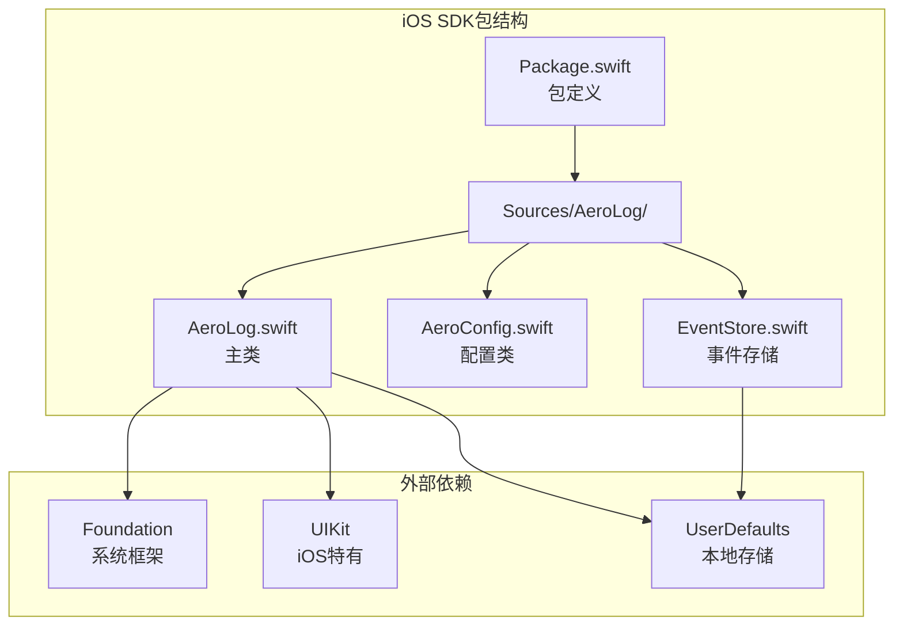
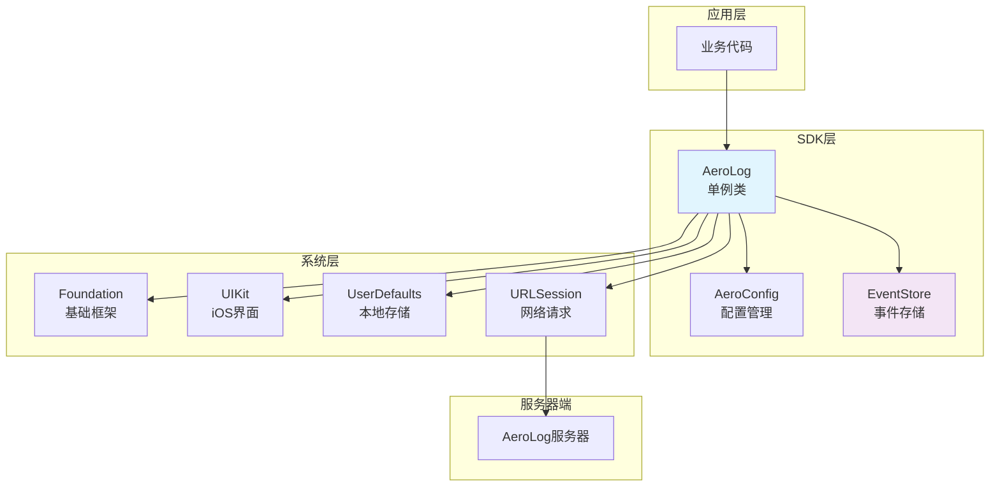
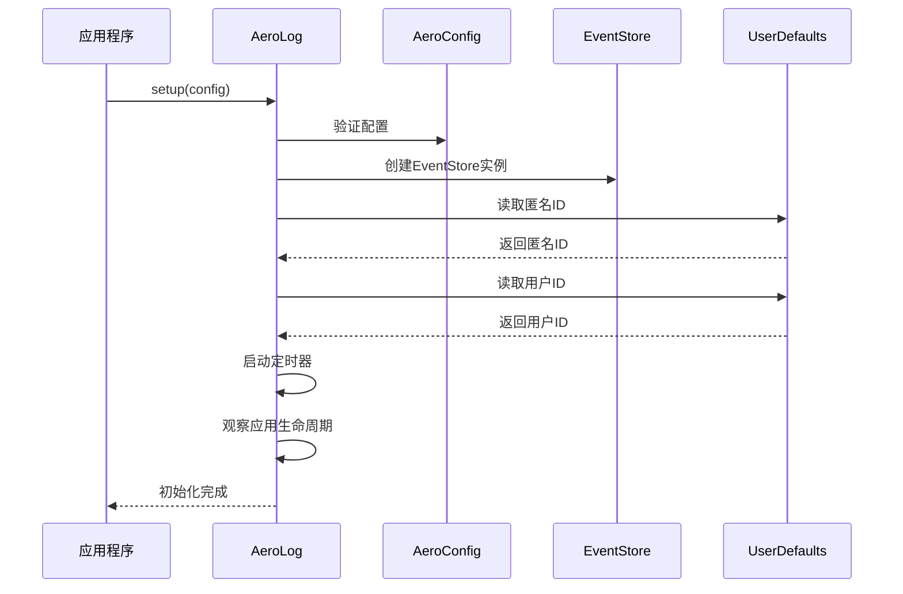
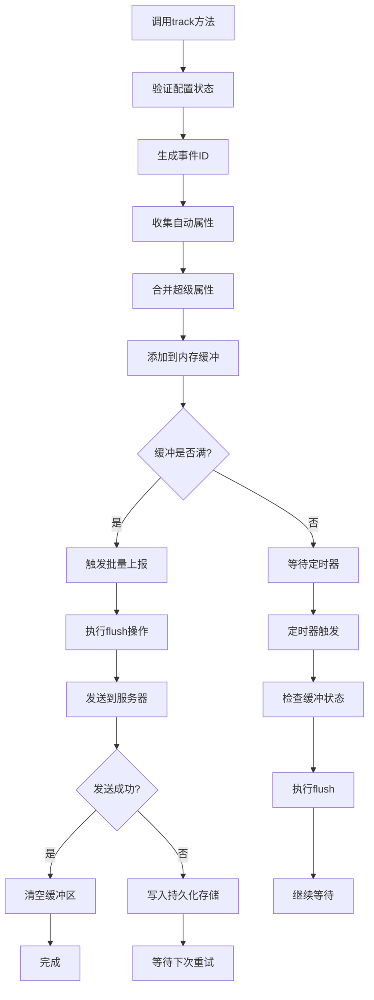
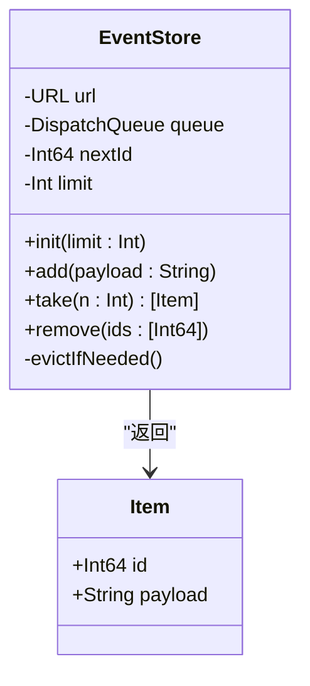
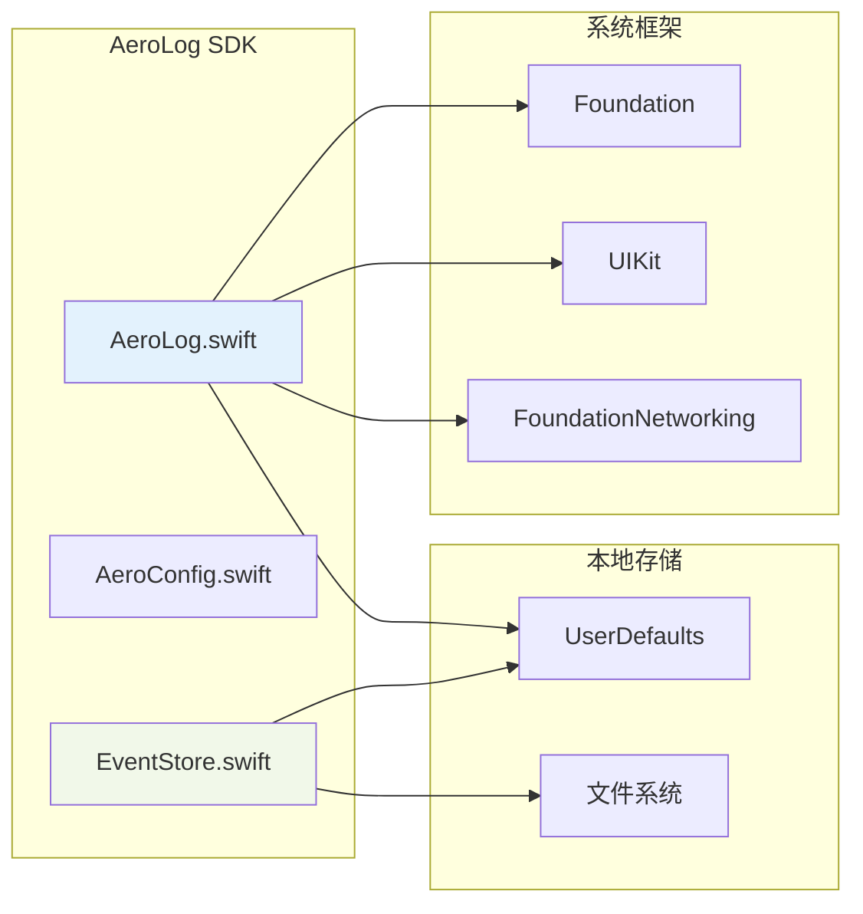
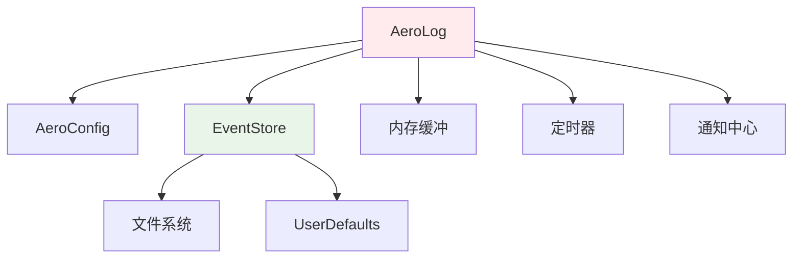
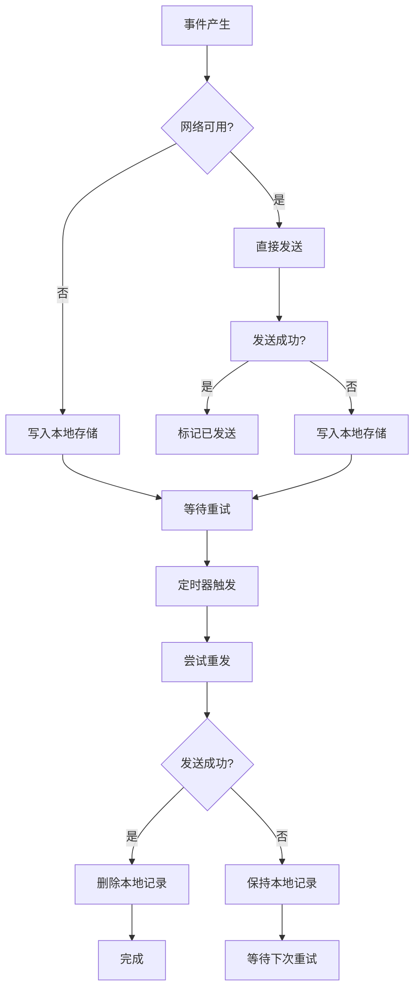

# iOS SDK集成

<cite>
**本文档引用的文件**
- [Package.swift](file://sdk/ios/Package.swift)
- [AeroLog.swift](file://sdk/ios/Sources/AeroLog/AeroLog.swift)
- [AeroConfig.swift](file://sdk/ios/Sources/AeroLog/AeroConfig.swift)
- [EventStore.swift](file://sdk/ios/Sources/AeroLog/EventStore.swift)
- [README.md](file://sdk/ios/README.md)
</cite>

## 目录
1. [简介](#简介)
2. [项目结构](#项目结构)
3. [核心组件](#核心组件)
4. [架构概览](#架构概览)
5. [详细组件分析](#详细组件分析)
6. [依赖关系分析](#依赖关系分析)
7. [性能考虑](#性能考虑)
8. [故障排除指南](#故障排除指南)
9. [结论](#结论)
10. [附录](#附录)

## 简介

AeroLog iOS SDK是一个基于Swift Package Manager的轻量级事件追踪SDK，专为iOS和macOS平台设计。该SDK提供了简单易用的API来追踪用户行为、管理用户身份和实现离线数据持久化。

主要特性包括：
- 线程安全的单例模式设计
- 内存缓冲和持久化存储双重保障
- 自动化的应用生命周期追踪
- 支持批量上报和定时刷新
- 轻量级的SQLite替代方案

## 项目结构

iOS SDK采用简洁的模块化设计，包含以下核心文件：



**图表来源**
- [Package.swift:1-15](file://sdk/ios/Package.swift#L1-L15)
- [AeroLog.swift:1-207](file://sdk/ios/Sources/AeroLog/AeroLog.swift#L1-L207)

**章节来源**
- [Package.swift:1-15](file://sdk/ios/Package.swift#L1-L15)
- [README.md:1-42](file://sdk/ios/README.md#L1-L42)

## 核心组件

### AeroLog 主类
AeroLog是SDK的核心类，采用单例模式设计，提供所有公共API接口。

### AeroConfig 配置类
AeroConfig定义了SDK的所有可配置参数，支持灵活的定制化需求。

### EventStore 存储类
EventStore实现了轻量级的事件存储机制，使用文件系统替代SQLite数据库。

**章节来源**
- [AeroLog.swift:6-207](file://sdk/ios/Sources/AeroLog/AeroLog.swift#L6-L207)
- [AeroConfig.swift:3-30](file://sdk/ios/Sources/AeroLog/AeroConfig.swift#L3-L30)
- [EventStore.swift:3-75](file://sdk/ios/Sources/AeroLog/EventStore.swift#L3-L75)

## 架构概览

AeroLog SDK采用了分层架构设计，确保了高内聚低耦合的代码组织：



**图表来源**
- [AeroLog.swift:1-207](file://sdk/ios/Sources/AeroLog/AeroLog.swift#L1-L207)
- [EventStore.swift:1-75](file://sdk/ios/Sources/AeroLog/EventStore.swift#L1-L75)

## 详细组件分析

### AeroLog 类详细分析

AeroLog类是SDK的核心实现，具有以下关键特性：

#### 初始化流程


**图表来源**
- [AeroLog.swift:33-48](file://sdk/ios/Sources/AeroLog/AeroLog.swift#L33-L48)

#### 事件追踪机制


**图表来源**
- [AeroLog.swift:50-115](file://sdk/ios/Sources/AeroLog/AeroLog.swift#L50-L115)
- [AeroLog.swift:140-156](file://sdk/ios/Sources/AeroLog/AeroLog.swift#L140-L156)

#### 关键方法实现

##### 初始化方法 (`setup`)
- 设置SDK配置参数
- 初始化事件存储
- 生成和恢复匿名ID
- 启动定时器和生命周期观察

##### 事件追踪方法 (`track`)
- 支持自定义事件属性
- 自动添加时间戳和设备信息
- 实现批量触发机制

##### 用户标识方法 (`identify`)
- 设置用户唯一标识符
- 自动追踪注册事件
- 更新本地存储

##### 手动上报方法 (`flush`)
- 异步执行数据上报
- 支持完成回调
- 处理网络异常情况

**章节来源**
- [AeroLog.swift:33-82](file://sdk/ios/Sources/AeroLog/AeroLog.swift#L33-L82)
- [AeroLog.swift:86-130](file://sdk/ios/Sources/AeroLog/AeroLog.swift#L86-L130)

### AeroConfig 配置参数详解

AeroConfig提供了全面的SDK配置选项：

| 参数名 | 类型 | 默认值 | 描述 |
|--------|------|--------|------|
| serverUrl | String | 必填 | 服务器地址 |
| token | String | 必填 | API访问令牌 |
| batchSize | Int | 50 | 批量大小阈值 |
| flushInterval | TimeInterval | 5秒 | 定时刷新间隔 |
| storageLimit | Int | 10,000 | 本地存储限制 |
| autoTrackAppLifecycle | Bool | true | 自动追踪应用生命周期 |
| debug | Bool | false | 调试模式开关 |

**章节来源**
- [AeroConfig.swift:12-28](file://sdk/ios/Sources/AeroLog/AeroConfig.swift#L12-L28)

### EventStore 存储机制

EventStore实现了轻量级的事件持久化存储：



**图表来源**
- [EventStore.swift:5-75](file://sdk/ios/Sources/AeroLog/EventStore.swift#L5-L75)

#### 存储格式
- 使用Application Support目录下的`events.ndjson`文件
- 每行存储一个JSON对象
- 格式：`id<TAB>JSON字符串<NEWLINE>`
- 自动清理超出限制的最旧记录

**章节来源**
- [EventStore.swift:16-75](file://sdk/ios/Sources/AeroLog/EventStore.swift#L16-L75)

## 依赖关系分析

### 外部依赖关系



**图表来源**
- [AeroLog.swift:1-5](file://sdk/ios/Sources/AeroLog/AeroLog.swift#L1-L5)
- [EventStore.swift:1](file://sdk/ios/Sources/AeroLog/EventStore.swift#L1)

### 内部依赖关系



**图表来源**
- [AeroLog.swift:14-27](file://sdk/ios/Sources/AeroLog/AeroLog.swift#L14-L27)
- [EventStore.swift:11-25](file://sdk/ios/Sources/AeroLog/EventStore.swift#L11-L25)

**章节来源**
- [AeroLog.swift:1-207](file://sdk/ios/Sources/AeroLog/AeroLog.swift#L1-L207)
- [EventStore.swift:1-75](file://sdk/ios/Sources/AeroLog/EventStore.swift#L1-L75)

## 性能考虑

### 内存管理最佳实践

1. **批量处理策略**
   - 默认批量大小为50条，可根据网络状况调整
   - 定时器每5秒触发一次，平衡实时性和性能
   - 超过批量阈值时立即触发上报

2. **异步处理**
   - 所有网络请求都在后台队列执行
   - 使用信号量控制请求超时
   - 避免阻塞主线程

3. **资源释放**
   - 定时器在适当时候会失效
   - URLSession实例按需创建
   - 文件句柄正确关闭

### 存储优化

1. **容量控制**
   - 默认存储上限10,000条记录
   - 自动清理最旧记录，保证性能
   - 支持自定义存储限制

2. **I/O优化**
   - 使用串行队列保证线程安全
   - 追加写入方式减少磁盘碎片
   - 原子性写入避免数据损坏

### 网络性能

1. **请求超时**
   - 默认请求超时15秒
   - 整体等待时间20秒
   - 支持HTTP 2xx和部分4xx状态码

2. **错误处理**
   - 网络异常自动重试
   - 持久化存储作为后备方案
   - 服务器不可用时的数据保护

## 故障排除指南

### 常见问题及解决方案

#### SDK未初始化
**症状**: 调用API时出现断言失败
**原因**: 未调用`setup`方法
**解决**: 确保在应用启动时调用`AeroLog.shared.setup(config)`

#### 数据未上报
**症状**: 事件在应用中可见但服务器无数据
**原因**: 网络连接问题或配置错误
**解决**: 
1. 检查`serverUrl`和`token`配置
2. 验证网络连接状态
3. 查看调试日志输出

#### 存储空间不足
**症状**: 事件丢失或应用崩溃
**原因**: 本地存储达到上限
**解决**: 
1. 增加`storageLimit`配置
2. 定期清理历史数据
3. 监控存储使用情况

#### 内存泄漏
**症状**: 应用内存持续增长
**原因**: 定时器或通知观察者未正确释放
**解决**: 
1. 确保应用退出时正确清理
2. 检查第三方库的内存管理
3. 使用 Instruments 工具检测

**章节来源**
- [AeroLog.swift:87-89](file://sdk/ios/Sources/AeroLog/AeroLog.swift#L87-L89)
- [AeroLog.swift:158-181](file://sdk/ios/Sources/AeroLog/AeroLog.swift#L158-L181)

## 结论

AeroLog iOS SDK提供了一个轻量级、高性能的事件追踪解决方案。其设计特点包括：

1. **简洁易用**: 单例模式和直观的API设计
2. **可靠稳定**: 内存缓冲和持久化存储双重保障
3. **性能优化**: 批量处理和异步执行机制
4. **平台适配**: iOS和macOS双平台支持

通过合理的配置和使用，开发者可以快速集成事件追踪功能，同时获得良好的性能表现和用户体验。

## 附录

### Swift Package Manager集成步骤

1. **添加包依赖**
   ```swift
   // 在Package.swift中添加
   .package(path: "../../sdk/ios")
   ```

2. **在Xcode中添加**
   - 打开Xcode项目
   - 选择File → Add Packages
   - 输入包路径或URL
   - 选择目标并添加

3. **导入和使用**
   ```swift
   import AeroLog
   
   // 初始化SDK
   AeroLog.shared.setup(AeroConfig(
       serverUrl: "https://your-server.com",
       token: "YOUR_TOKEN"
   ))
   ```

### API使用示例

#### 基本事件追踪
```swift
// 基础事件
AeroLog.shared.track("button_click")

// 带属性的事件
AeroLog.shared.track("purchase", properties: [
    "amount": 99.99,
    "currency": "USD"
])
```

#### 用户管理
```swift
// 设置用户ID
AeroLog.shared.identify("user_123")

// 设置用户属性
AeroLog.shared.setProfile([
    "name": "John Doe",
    "email": "john@example.com"
])

// 注销用户
AeroLog.shared.logout()
```

#### 高级功能
```swift
// 设置全局属性
AeroLog.shared.registerSuperProperties([
    "source": "mobile_app"
])

// 手动触发上报
AeroLog.shared.flush()

// 获取匿名ID
let anonymousId = AeroLog.shared.getAnonymousId()
```

### iOS平台特定配置

#### Info.plist配置
虽然SDK不需要特殊的Info.plist权限，但在某些情况下可能需要：

```xml
<!-- 网络权限（如果需要） -->
<key>NSAppTransportSecurity</key>
<dict>
    <key>NSAllowsArbitraryLoads</key>
    <true/>
</dict>
```

#### 后台任务处理
SDK自动处理应用生命周期事件：
- 应用激活时追踪 `$AppStart`
- 应用进入后台时追踪 `$AppEnd` 并触发上报

#### App Store审核注意事项
1. **隐私政策**: 确保符合隐私政策要求
2. **数据最小化**: 只收集必要的用户数据
3. **用户同意**: 获得用户的知情同意
4. **数据安全**: 保护用户数据的安全传输

### 离线缓存机制

SDK实现了完整的离线缓存机制：



**图表来源**
- [AeroLog.swift:140-156](file://sdk/ios/Sources/AeroLog/AeroLog.swift#L140-L156)
- [EventStore.swift:27-64](file://sdk/ios/Sources/AeroLog/EventStore.swift#L27-L64)

### 性能监控指标

建议监控的关键指标：
- 事件发送成功率
- 平均响应时间
- 本地存储使用率
- 内存使用情况
- 网络错误率

通过这些指标可以及时发现和解决潜在问题，确保SDK的稳定运行。