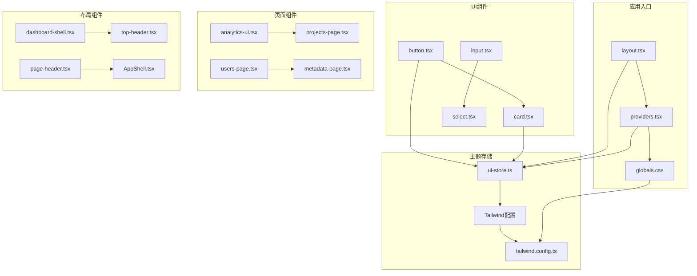
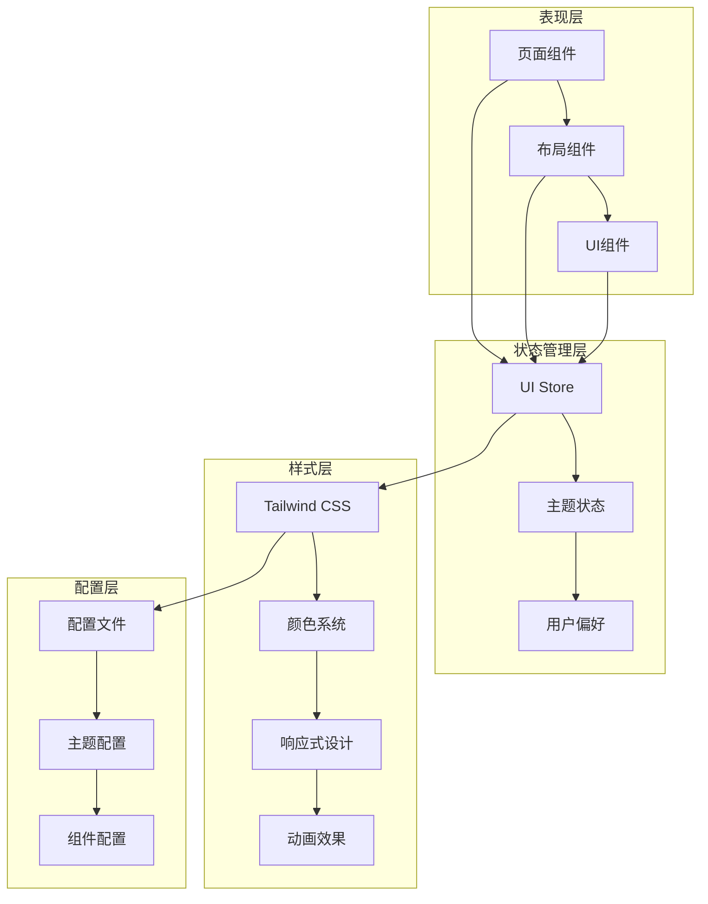
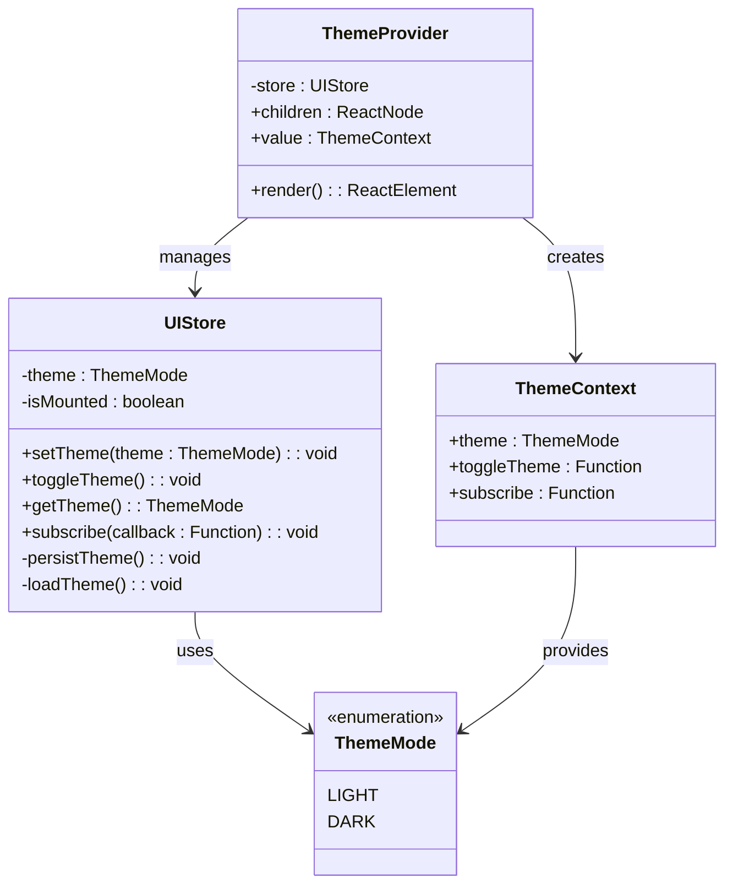
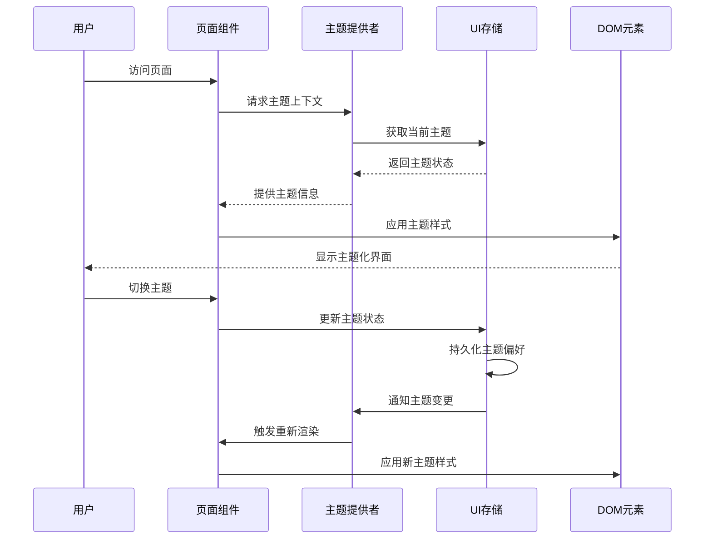
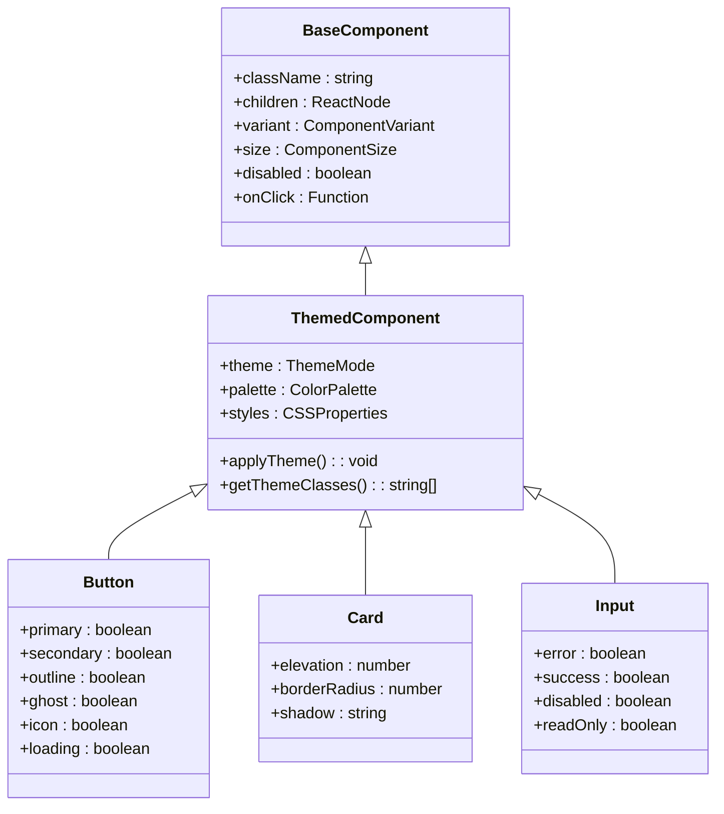
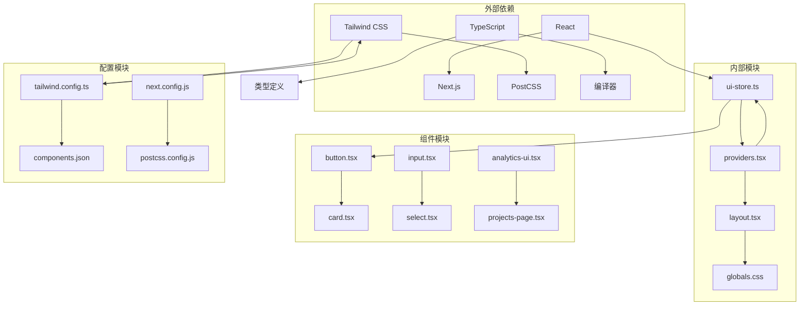

# UI主题系统

<cite>
**本文档引用的文件**
- [layout.tsx](file://web/src/app/layout.tsx)
- [providers.tsx](file://web/src/app/providers.tsx)
- [globals.css](file://web/src/app/globals.css)
- [tailwind.config.ts](file://web/src/tailwind.config.ts)
- [ui-store.ts](file://web/src/stores/ui-store.ts)
- [button.tsx](file://web/src/components/ui/button.tsx)
- [card.tsx](file://web/src/components/ui/card.tsx)
- [input.tsx](file://web/src/components/ui/input.tsx)
- [select.tsx](file://web/src/components/ui/select.tsx)
- [analytics-ui.tsx](file://web/src/features/analytics/analytics-ui.tsx)
- [projects-page.tsx](file://web/src/features/projects/projects-page.tsx)
- [users-page.tsx](file://web/src/features/users/users-page.tsx)
- [metadata-page.tsx](file://web/src/features/metadata/metadata-page.tsx)
- [dashboard-shell.tsx](file://web/src/components/layout/dashboard-shell.tsx)
- [top-header.tsx](file://web/src/components/layout/top-header.tsx)
- [page-header.tsx](file://web/src/components/layout/page-header.tsx)
</cite>

## 目录
1. [简介](#简介)
2. [项目结构](#项目结构)
3. [核心组件](#核心组件)
4. [架构概览](#架构概览)
5. [详细组件分析](#详细组件分析)
6. [依赖关系分析](#依赖关系分析)
7. [性能考虑](#性能考虑)
8. [故障排除指南](#故障排除指南)
9. [结论](#结论)

## 简介

AeroLog的UI主题系统是一个基于Tailwind CSS和Next.js的应用程序，提供了现代化的用户界面设计和灵活的主题切换功能。该系统采用组件化架构，通过状态管理实现主题的动态切换，并支持深色和浅色模式。

## 项目结构

AeroLog的Web前端采用Next.js框架构建，UI主题系统主要分布在以下关键目录中：

**图表来源**
- [layout.tsx](file://web/src/app/layout.tsx)
- [providers.tsx](file://web/src/app/providers.tsx)
- [ui-store.ts](file://web/src/stores/ui-store.ts)
- [tailwind.config.ts](file://web/src/tailwind.config.ts)

**章节来源**
- [layout.tsx](file://web/src/app/layout.tsx)
- [providers.tsx](file://web/src/app/providers.tsx)
- [globals.css](file://web/src/app/globals.css)

## 核心组件

### 主题状态管理

UI主题系统的核心是`ui-store.ts`，它负责管理整个应用程序的主题状态：

- **主题状态**：维护当前选择的主题模式（深色/浅色）
- **主题切换**：提供切换主题的方法和事件监听
- **持久化存储**：将用户偏好保存到本地存储中
- **全局状态**：通过React Context提供全局访问

### Tailwind CSS集成

系统使用Tailwind CSS作为基础样式框架，通过自定义配置实现主题支持：

- **颜色系统**：定义了完整的颜色调色板，包括主色调、辅助色和语义化颜色
- **响应式设计**：支持移动端和桌面端的自适应布局
- **动画效果**：集成了平滑的过渡动画和交互反馈

### 组件库

UI组件库包含多个可复用的组件，每个组件都支持主题适配：

- **基础组件**：按钮、输入框、卡片等通用UI元素
- **复合组件**：表格、对话框、标签页等复杂UI结构
- **布局组件**：页面外壳、头部导航、侧边栏等页面结构

**章节来源**
- [ui-store.ts](file://web/src/stores/ui-store.ts)
- [tailwind.config.ts](file://web/src/tailwind.config.ts)
- [button.tsx](file://web/src/components/ui/button.tsx)

## 架构概览

UI主题系统的整体架构采用分层设计，确保了良好的可维护性和扩展性：

**图表来源**
- [ui-store.ts](file://web/src/stores/ui-store.ts)
- [layout.tsx](file://web/src/app/layout.tsx)
- [tailwind.config.ts](file://web/src/tailwind.config.ts)

## 详细组件分析

### 主题状态管理器

UI状态管理器是整个主题系统的核心，负责协调所有主题相关的操作：

**图表来源**
- [ui-store.ts](file://web/src/stores/ui-store.ts)
- [providers.tsx](file://web/src/app/providers.tsx)

### 页面组件主题集成

各个页面组件通过主题提供者访问全局主题状态：

**图表来源**
- [layout.tsx](file://web/src/app/layout.tsx)
- [providers.tsx](file://web/src/app/providers.tsx)
- [ui-store.ts](file://web/src/stores/ui-store.ts)

**章节来源**
- [ui-store.ts](file://web/src/stores/ui-store.ts)
- [providers.tsx](file://web/src/app/providers.tsx)

### UI组件主题适配

各个UI组件都实现了主题适配功能，确保在不同主题下的一致性：

**图表来源**
- [button.tsx](file://web/src/components/ui/button.tsx)
- [card.tsx](file://web/src/components/ui/card.tsx)
- [input.tsx](file://web/src/components/ui/input.tsx)

**章节来源**
- [button.tsx](file://web/src/components/ui/button.tsx)
- [card.tsx](file://web/src/components/ui/card.tsx)
- [input.tsx](file://web/src/components/ui/input.tsx)

## 依赖关系分析

UI主题系统的依赖关系体现了清晰的分层架构：

**图表来源**
- [ui-store.ts](file://web/src/stores/ui-store.ts)
- [providers.tsx](file://web/src/app/providers.tsx)
- [tailwind.config.ts](file://web/src/tailwind.config.ts)

**章节来源**
- [package.json](file://web/package.json)
- [next.config.js](file://web/next.config.js)
- [tailwind.config.ts](file://web/src/tailwind.config.ts)

## 性能考虑

UI主题系统在设计时充分考虑了性能优化：

- **懒加载策略**：主题切换时只更新必要的DOM节点
- **CSS变量缓存**：利用CSS自定义属性减少重绘开销
- **组件优化**：使用React.memo和useMemo避免不必要的重渲染
- **样式提取**：通过PostCSS优化CSS输出，减少文件大小
- **代码分割**：按需加载主题相关的组件和样式

## 故障排除指南

### 常见问题及解决方案

**主题切换无效**
- 检查UI存储的状态更新逻辑
- 验证主题提供者的上下文传递
- 确认CSS类名的正确应用

**样式不生效**
- 验证Tailwind配置文件的正确性
- 检查CSS优先级和覆盖规则
- 确认组件的className属性设置

**性能问题**
- 分析组件重渲染频率
- 优化主题状态的订阅机制
- 检查CSS文件的打包和压缩

**章节来源**
- [ui-store.ts](file://web/src/stores/ui-store.ts)
- [globals.css](file://web/src/app/globals.css)
- [tailwind.config.ts](file://web/src/tailwind.config.ts)

## 结论

AeroLog的UI主题系统展现了现代前端开发的最佳实践，通过合理的架构设计和组件化实现，提供了灵活且高性能的主题切换功能。系统不仅支持基本的主题切换需求，还为未来的功能扩展奠定了坚实的基础。

该系统的主要优势包括：
- 清晰的分层架构便于维护
- 组件化的UI设计提高复用性
- 基于Tailwind CSS的样式系统保证一致性
- 完善的状态管理确保用户体验
- 良好的性能优化提升应用效率