# Web控制台

<cite>
**本文引用的文件**
- [web/src/app/layout.tsx](file://web/src/app/layout.tsx)
- [web/src/components/AppShell.tsx](file://web/src/components/AppShell.tsx)
- [web/src/app/providers.tsx](file://web/src/app/providers.tsx)
- [web/src/components/layout/dashboard-shell.tsx](file://web/src/components/layout/dashboard-shell.tsx)
- [web/src/components/layout/top-header.tsx](file://web/src/components/layout/top-header.tsx)
- [web/src/stores/project-store.ts](file://web/src/stores/project-store.ts)
- [web/src/stores/ui-store.ts](file://web/src/stores/ui-store.ts)
- [web/src/features/analytics/analytics-ui.tsx](file://web/src/features/analytics/analytics-ui.tsx)
- [web/src/components/layout/page-header.tsx](file://web/src/components/layout/page-header.tsx)
- [web/src/app/console/page.tsx](file://web/src/app/console/page.tsx)
- [web/src/app/console/event/page.tsx](file://web/src/app/console/event/page.tsx)
- [web/src/app/console/funnel/page.tsx](file://web/src/app/console/funnel/page.tsx)
- [web/src/app/console/retention/page.tsx](file://web/src/app/console/retention/page.tsx)
- [web/src/app/console/conversions/page.tsx](file://web/src/app/console/conversions/page.tsx)
- [web/src/app/console/realtime/page.tsx](file://web/src/app/console/realtime/page.tsx)
- [web/src/app/console/users/page.tsx](file://web/src/app/console/users/page.tsx)
- [web/src/app/console/governance/page.tsx](file://web/src/app/console/governance/page.tsx)
- [web/src/app/admin/projects/page.tsx](file://web/src/app/admin/projects/page.tsx)
- [web/src/app/admin/events/page.tsx](file://web/src/app/admin/events/page.tsx)
- [web/src/app/admin/users/page.tsx](file://web/src/app/admin/users/page.tsx)
- [web/src/lib/api.ts](file://web/src/lib/api.ts)
- [web/next.config.js](file://web/next.config.js)
- [web/tailwind.config.ts](file://web/tailwind.config.ts)
- [web/components.json](file://web/components.json)
- [deploy/docker-compose.yml](file://deploy/docker-compose.yml)
- [server/api/cmd/main.go](file://server/api/cmd/main.go)
- [server/api/internal/config/config.go](file://server/api/internal/config/config.go)
- [server/api/internal/handler/analytics.go](file://server/api/internal/handler/analytics.go)
- [server/api/internal/handler/project.go](file://server/api/internal/handler/project.go)
- [README.md](file://README.md)
</cite>

## 更新摘要
**所做更改**
- 新增Zustand状态管理系统：引入project-store和ui-store两个全局状态存储
- 集成TopHeader组件：提供项目选择、主题切换和侧边栏控制功能
- 重构Dashboard Shell：改进响应式布局和导航结构
- 增强CSS主题系统：支持Hydration警告解决方案和主题持久化
- 优化页面头部组件：新增PageHeader组件提供统一的页面标题布局

## 目录
1. [简介](#简介)
2. [项目结构](#项目结构)
3. [核心组件](#核心组件)
4. [状态管理系统](#状态管理系统)
5. [架构总览](#架构总览)
6. [详细组件分析](#详细组件分析)
7. [依赖关系分析](#依赖关系分析)
8. [性能考虑](#性能考虑)
9. [故障排查指南](#故障排查指南)
10. [结论](#结论)
11. [附录](#附录)

## 简介
本文件面向 AeroLog Web 控制台使用者与维护者，提供从界面布局到数据分析、项目管理、权限与安全、性能优化与故障排查的完整使用与运维指南。控制台基于 Next.js 14 构建，采用 shadcn/ui 作为现代化 UI 组件库，通过 Tailwind CSS 实现响应式样式系统，通过 React Query 管理数据请求，前端通过统一 API 客户端对接后端 Go 服务。

**重要说明**：基于最新的代码审查，前端控制台已完成重大架构升级，采用 Next.js 14 App Router 和 shadcn/ui 组件库，同时迁移到 Tailwind CSS 样式系统。本次更新重点反映了新增的Zustand状态管理系统、TopHeader组件集成、Dashboard Shell响应式改进、CSS主题系统增强和Hydration警告解决方案。

## 项目结构
- 前端（web）：Next.js 14 应用，采用 App Router 架构，包含控制台页面与管理后台页面，以及基于 shadcn/ui 的通用布局与 API 客户端。
- 状态管理（stores）：采用Zustand实现全局状态管理，包括项目状态和UI状态。
- 布局组件（components）：包含Dashboard Shell、TopHeader、PageHeader等核心布局组件。
- 后端（server）：Go 服务，提供项目管理、事件定义、分析接口等。
- 部署（deploy）：Docker Compose 编排数据库、消息队列、存储与监控等基础设施。
- 文档（docs）：协议、架构与可观测性文档。

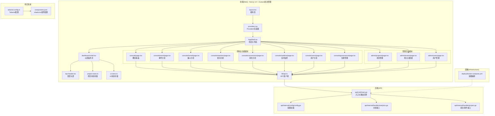

**图表来源**
- [web/src/app/layout.tsx:1-19](file://web/src/app/layout.tsx#L1-L19)
- [web/src/app/providers.tsx:1-10](file://web/src/app/providers.tsx#L1-L10)
- [web/src/components/AppShell.tsx:1-10](file://web/src/components/AppShell.tsx#L1-L10)
- [web/src/components/layout/dashboard-shell.tsx:1-189](file://web/src/components/layout/dashboard-shell.tsx#L1-L189)
- [web/src/components/layout/top-header.tsx:1-91](file://web/src/components/layout/top-header.tsx#L1-L91)
- [web/src/stores/project-store.ts:1-29](file://web/src/stores/project-store.ts#L1-L29)
- [web/src/stores/ui-store.ts:1-69](file://web/src/stores/ui-store.ts#L1-L69)

**章节来源**
- [README.md:1-50](file://README.md#L1-L50)
- [web/src/app/layout.tsx:1-19](file://web/src/app/layout.tsx#L1-L19)
- [web/src/app/providers.tsx:1-10](file://web/src/app/providers.tsx#L1-L10)
- [web/src/components/AppShell.tsx:1-10](file://web/src/components/AppShell.tsx#L1-L10)

## 核心组件
- 布局与导航
  - 根布局负责注入样式与全局 Providers 包裹，确保内容在统一外壳中渲染。
  - AppShell 提供顶部标题、侧边菜单与内容区域，并内置查询客户端与主题配置。
  - Dashboard Shell 重构了响应式布局，支持桌面端和移动端的差异化体验。
  - TopHeader 集成了项目选择、主题切换和侧边栏控制功能。
  - 新增报表和配置两大导航分组，支持更精细的功能分类管理。
- 状态管理系统
  - project-store：管理项目选择状态，支持本地存储和Hydration处理。
  - ui-store：管理主题模式、侧边栏状态和Hydration状态，提供主题切换和持久化。
- 页面与功能
  - 概览看板：展示 Top 事件与事件趋势折线图，支持项目切换与默认时间范围。
  - 事件分析：支持自定义时间范围、粒度（小时/天）、事件选择与柱状趋势图。
  - 漏斗分析：支持多步骤事件、时间窗口与计算按钮，输出漏斗图与表格。
  - 留存分析：支持初始事件、返回事件、天数与时间范围，输出留存热力表。
  - 转化分析：新增专门的转化率分析模块，支持多维度转化指标监控。
  - 实时监控：提供实时数据流监控与告警功能，支持实时事件追踪。
  - 用户分析：专注于用户行为分析，提供用户画像与行为路径分析。
  - 治理管理：集中管理数据治理规则与合规性检查。
  - 项目管理：新建项目、查看 Token、状态与创建时间。
  - 埋点元数据：按项目查看事件定义列表。
  - 用户管理：管理平台用户权限与访问控制。
- API 客户端
  - 统一前缀与头部处理，错误抛出与非 OK 状态码提示。
  - 提供项目、事件、趋势、Top 事件、漏斗、留存、转化、实时等接口封装。
- 样式系统
  - Tailwind CSS 提供原子化样式系统，支持响应式设计与主题定制。
  - shadcn/ui 组件库提供可定制的 UI 组件，基于 Radix UI 和 Tailwind CSS 构建。

**章节来源**
- [web/src/app/layout.tsx:1-19](file://web/src/app/layout.tsx#L1-L19)
- [web/src/app/providers.tsx:1-10](file://web/src/app/providers.tsx#L1-L10)
- [web/src/components/AppShell.tsx:1-10](file://web/src/components/AppShell.tsx#L1-L10)
- [web/src/components/layout/dashboard-shell.tsx:108-189](file://web/src/components/layout/dashboard-shell.tsx#L108-L189)
- [web/src/components/layout/top-header.tsx:18-91](file://web/src/components/layout/top-header.tsx#L18-L91)
- [web/src/stores/project-store.ts:11-22](file://web/src/stores/project-store.ts#L11-L22)
- [web/src/stores/ui-store.ts:19-49](file://web/src/stores/ui-store.ts#L19-L49)

## 状态管理系统
- Zustand Store架构
  - project-store：管理项目ID状态，支持localStorage持久化，解决Hydration警告。
  - ui-store：管理主题模式、侧边栏状态和Hydration状态，提供主题切换和状态持久化。
  - 两个store都使用persist中间件实现客户端状态持久化，避免页面刷新丢失状态。
- Hydration警告解决方案
  - 通过onRehydrateStorage钩子在客户端重新水合时应用主题类名。
  - 使用noopStorage在服务端渲染时避免localStorage访问错误。
  - setHydrated方法标记状态已水合，确保主题切换的正确性。
- 状态同步机制
  - TopHeader组件直接从store读取状态，实现项目选择和主题切换的实时响应。
  - Dashboard Shell监听sidebarCollapsed状态，动态调整主内容区域的左侧边距。
  - 项目状态变更时，自动触发项目列表的重新选择和验证。

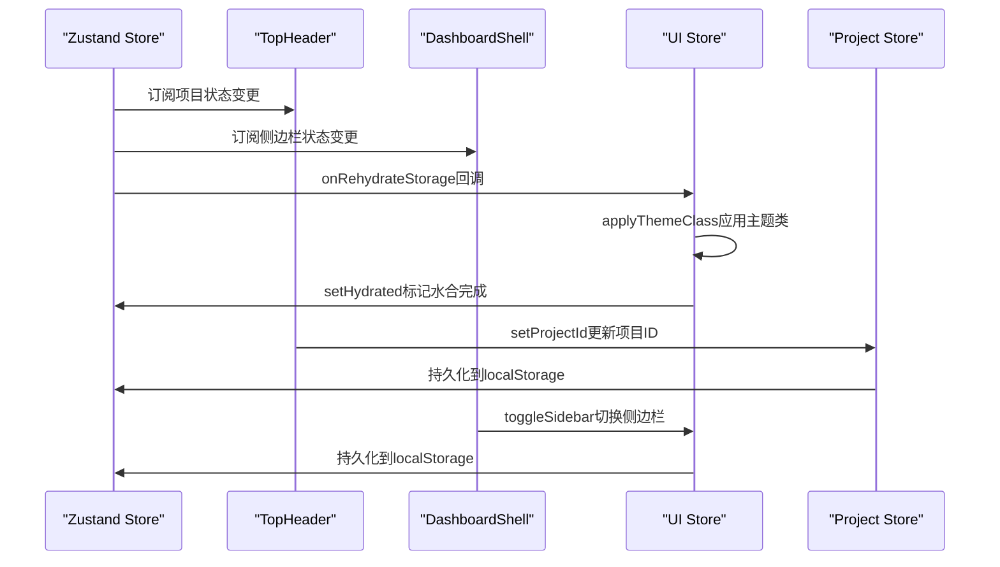

**图表来源**
- [web/src/stores/ui-store.ts:42-47](file://web/src/stores/ui-store.ts#L42-L47)
- [web/src/stores/ui-store.ts:52-62](file://web/src/stores/ui-store.ts#L52-L62)
- [web/src/components/layout/top-header.tsx:19-24](file://web/src/components/layout/top-header.tsx#L19-L24)
- [web/src/components/layout/dashboard-shell.tsx:109-110](file://web/src/components/layout/dashboard-shell.tsx#L109-L110)

**章节来源**
- [web/src/stores/project-store.ts:11-22](file://web/src/stores/project-store.ts#L11-L22)
- [web/src/stores/ui-store.ts:19-49](file://web/src/stores/ui-store.ts#L19-L49)
- [web/src/stores/ui-store.ts:52-62](file://web/src/stores/ui-store.ts#L52-L62)
- [web/src/components/layout/top-header.tsx:18-91](file://web/src/components/layout/top-header.tsx#L18-L91)
- [web/src/components/layout/dashboard-shell.tsx:108-189](file://web/src/components/layout/dashboard-shell.tsx#L108-L189)

## 架构总览
前端通过 Next.js 14 与 App Router 提供现代化的交互界面，采用 shadcn/ui 组件库和 Tailwind CSS 样式系统，React Query 管理数据请求与缓存；Zustand 状态管理提供全局状态持久化；API 层由 Go Gin 服务提供 REST 接口，连接 ClickHouse 进行分析查询，Postgres 存储元数据；Docker Compose 编排数据库、消息队列、对象存储与监控。

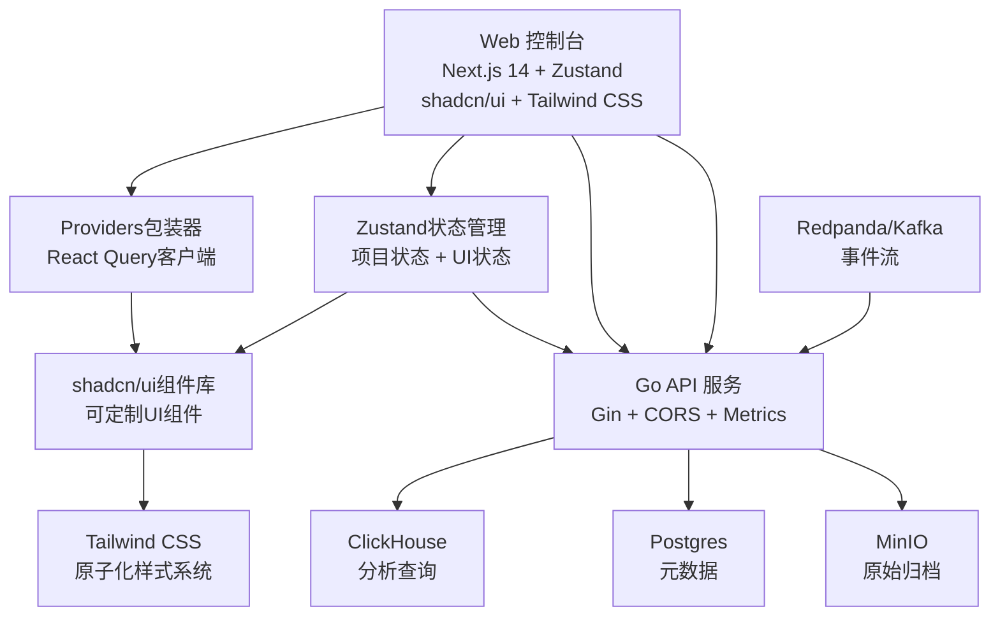

**图表来源**
- [README.md:24-34](file://README.md#L24-L34)
- [web/src/app/providers.tsx:1-10](file://web/src/app/providers.tsx#L1-L10)
- [web/src/stores/project-store.ts:1-29](file://web/src/stores/project-store.ts#L1-L29)
- [web/src/stores/ui-store.ts:1-69](file://web/src/stores/ui-store.ts#L1-L69)
- [web/tailwind.config.ts:1-50](file://web/tailwind.config.ts#L1-L50)
- [web/components.json:1-100](file://web/components.json#L1-L100)
- [deploy/docker-compose.yml:1-147](file://deploy/docker-compose.yml#L1-L147)
- [server/api/cmd/main.go:35-78](file://server/api/cmd/main.go#L35-L78)

## 详细组件分析

### 布局与导航（Dashboard Shell）
- 功能要点
  - 顶部标题"AeroLog"，侧边菜单项包含概览看板、事件分析、漏斗分析、留存分析、转化分析、实时监控、用户分析、治理管理、项目管理、埋点元数据、用户管理。
  - 使用受控路由与路径匹配确定当前选中菜单，支持内联模式与固定宽度侧栏。
  - 内置查询客户端与主题配置，保证各页面共享状态与主题一致性。
  - 新增报表和配置两大导航分组，支持更精细的功能分类管理。
  - 支持桌面端和移动端的差异化布局，移动端使用Sheet组件提供侧边栏菜单。
- 响应式与适配
  - 使用 Tailwind CSS 原子化类名，配合响应式断点实现自适应布局。
  - Desktop模式下固定侧边栏宽度64px，Mobile模式下使用Sheet组件。
  - 侧边栏折叠状态通过UI Store管理，动态调整主内容区域的左侧边距。
  - shadcn/ui 组件提供一致的视觉风格和交互行为，适合现代 Web 应用。

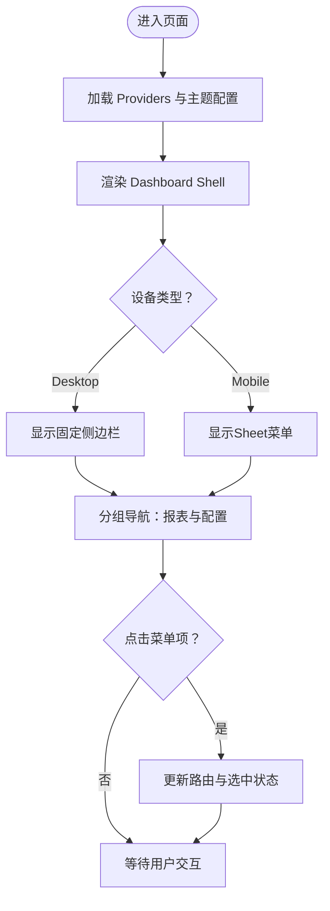

**图表来源**
- [web/src/components/layout/dashboard-shell.tsx:108-189](file://web/src/components/layout/dashboard-shell.tsx#L108-L189)
- [web/src/components/layout/dashboard-shell.tsx:150-173](file://web/src/components/layout/dashboard-shell.tsx#L150-L173)

**章节来源**
- [web/src/components/layout/dashboard-shell.tsx:108-189](file://web/src/components/layout/dashboard-shell.tsx#L108-L189)

### 顶部头部（TopHeader）
- 功能要点
  - 集成项目选择下拉框，支持项目切换和自动选择逻辑。
  - 提供主题切换按钮，支持明暗主题切换和状态持久化。
  - 侧边栏控制按钮，支持展开/收起侧边栏功能。
  - 使用React Query加载项目列表，避免重复请求。
  - 自动处理项目状态的Hydration和验证逻辑。
- 状态管理
  - 从project-store读取当前项目ID，从ui-store读取主题和侧边栏状态。
  - 项目列表加载完成后，自动选择第一个项目或验证当前项目有效性。
  - 主题切换时调用applyThemeClass函数应用CSS类名。
- 最佳实践
  - 项目切换时保持分析页面的状态，避免重新加载数据。
  - 主题切换后确保所有组件正确响应新的主题模式。

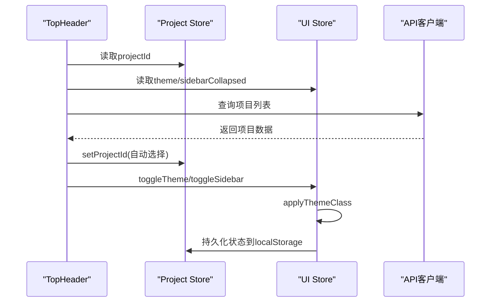

**图表来源**
- [web/src/components/layout/top-header.tsx:18-91](file://web/src/components/layout/top-header.tsx#L18-L91)
- [web/src/stores/project-store.ts:11-22](file://web/src/stores/project-store.ts#L11-L22)
- [web/src/stores/ui-store.ts:19-49](file://web/src/stores/ui-store.ts#L19-L49)

**章节来源**
- [web/src/components/layout/top-header.tsx:18-91](file://web/src/components/layout/top-header.tsx#L18-L91)
- [web/src/stores/project-store.ts:11-22](file://web/src/stores/project-store.ts#L11-L22)
- [web/src/stores/ui-store.ts:19-49](file://web/src/stores/ui-store.ts#L19-L49)

### 页面头部（PageHeader）
- 功能要点
  - 提供统一的页面标题布局，支持标题、描述和操作按钮。
  - 响应式设计，支持移动端和桌面端的不同布局。
  - 使用cn函数合并CSS类名，确保样式的一致性和灵活性。
  - 支持自定义className，便于在不同页面中复用。
- 样式系统
  - 使用Tailwind CSS类名实现响应式布局。
  - sm断点以上使用flex-row布局，移动端使用flex-col布局。
  - actions区域支持弹性布局和间距控制。
- 最佳实践
  - 在分析页面中使用AnalyticsHeader替代PageHeader，提供更丰富的头部信息。
  - 保持页面头部的一致性，提升用户体验。

**章节来源**
- [web/src/components/layout/page-header.tsx:1-26](file://web/src/components/layout/page-header.tsx#L1-L26)

### 概览看板（Console）
- 数据流
  - 加载项目列表，自动选择首个项目并清空事件选择。
  - 查询 Top 事件（默认最近 7 天），自动选择第一条事件。
  - 查询事件趋势（按天聚合），生成折线图。
- 图表与交互
  - 左侧表格支持点击事件切换右侧趋势图。
  - 右侧折线图开启面积填充与平滑曲线，突出趋势变化。
- 最佳实践
  - 若项目较多，优先使用筛选器快速定位目标项目。
  - 关注趋势图中的异常波动，结合事件列表定位具体事件。

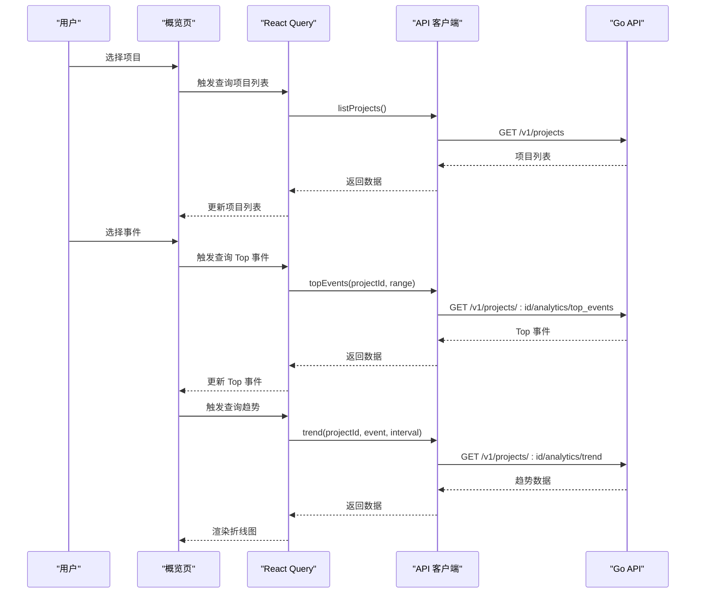

**图表来源**
- [web/src/app/console/page.tsx:17-50](file://web/src/app/console/page.tsx#L17-L50)
- [web/src/lib/api.ts:34-50](file://web/src/lib/api.ts#L34-L50)
- [server/api/internal/handler/analytics.go:34-74](file://server/api/internal/handler/analytics.go#L34-L74)

**章节来源**
- [web/src/app/console/page.tsx:13-123](file://web/src/app/console/page.tsx#L13-L123)
- [web/src/lib/api.ts:32-50](file://web/src/lib/api.ts#L32-L50)
- [server/api/internal/handler/analytics.go:27-74](file://server/api/internal/handler/analytics.go#L27-L74)

### 事件分析（Event Analysis）
- 参数与交互
  - 支持项目选择、事件选择、时间范围选择（带时区起止）、粒度切换（小时/天）。
  - 事件列表来自 Top 事件接口，避免手动输入。
- 图表与解读
  - 柱状图展示事件计数随时间的变化，便于识别高峰与低谷。
  - 建议结合"按小时"观察短期波动，"按天"观察长期趋势。
- 最佳实践
  - 将时间范围对齐业务活动周期，例如促销活动前后对比。
  - 对比多个事件在同一时间段的趋势，识别相关性。

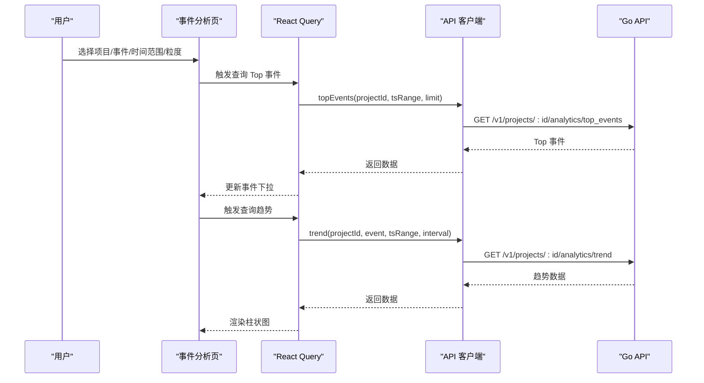

**图表来源**
- [web/src/app/console/event/page.tsx:22-48](file://web/src/app/console/event/page.tsx#L22-L48)
- [web/src/lib/api.ts:38-50](file://web/src/lib/api.ts#L38-L50)
- [server/api/internal/handler/analytics.go:34-74](file://server/api/internal/handler/analytics.go#L34-L74)

**章节来源**
- [web/src/app/console/event/page.tsx:13-103](file://web/src/app/console/event/page.tsx#L13-L103)
- [web/src/lib/api.ts:38-50](file://web/src/lib/api.ts#L38-L50)
- [server/api/internal/handler/analytics.go:34-74](file://server/api/internal/handler/analytics.go#L34-L74)

### 漏斗分析（Funnel）
- 参数与交互
  - 选择项目、时间范围、窗口秒数（默认 24 小时），按顺序选择 2-8 个事件作为步骤。
  - 点击"计算漏斗"触发 POST 请求，返回每一步的用户数与转化率。
- 图表与解读
  - 漏斗图直观展示每一步的用户流失情况，转化率百分比标注在柱内。
  - 若某一步骤转化率骤降，需结合事件上下文与埋点规则排查。
- 最佳实践
  - 窗口时间应覆盖业务流程的合理时长，避免过短导致漏判。
  - 步骤过多会增加复杂度，建议从关键路径开始逐步细化。

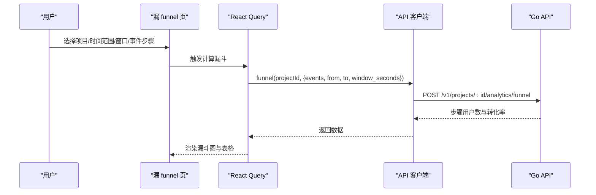

**图表来源**
- [web/src/app/console/funnel/page.tsx:59-69](file://web/src/app/console/funnel/page.tsx#L59-L69)
- [web/src/lib/api.ts:52-59](file://web/src/lib/api.ts#L52-L59)
- [server/api/internal/handler/analytics.go:119-199](file://server/api/internal/handler/analytics.go#L119-L199)

**章节来源**
- [web/src/app/console/funnel/page.tsx:30-164](file://web/src/app/console/funnel/page.tsx#L30-L164)
- [web/src/lib/api.ts:52-59](file://web/src/lib/api.ts#L52-L59)
- [server/api/internal/handler/analytics.go:119-199](file://server/api/internal/handler/analytics.go#L119-L199)

### 留存分析（Retention）
- 参数与交互
  - 选择项目、初始事件、返回事件、天数（2-30，默认 7）、时间范围。
  - 表格固定左侧行头（同期日与用户数），列头为 Day0 至 DayN 的转化率。
- 表格与解读
  - Day0 通常为 100%，后续天数的转化率越低表示用户回访意愿越弱。
  - 若某天转化率显著下降，结合事件分析定位问题节点。
- 最佳实践
  - 初期可使用较短天数观察短期效果，后期延长天数评估长期粘性。

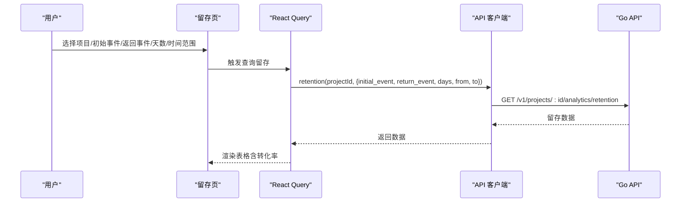

**图表来源**
- [web/src/app/console/retention/page.tsx:46-57](file://web/src/app/console/retention/page.tsx#L46-L57)
- [web/src/lib/api.ts:60-74](file://web/src/lib/api.ts#L60-L74)
- [server/api/internal/handler/analytics.go:201-283](file://server/api/internal/handler/analytics.go#L201-L283)

**章节来源**
- [web/src/app/console/retention/page.tsx:17-127](file://web/src/app/console/retention/page.tsx#L17-L127)
- [web/src/lib/api.ts:60-74](file://web/src/lib/api.ts#L60-L74)
- [server/api/internal/handler/analytics.go:201-283](file://server/api/internal/handler/analytics.go#L201-L283)

### 转化分析（Conversions）
- 功能概述
  - 专门的转化率分析模块，支持多维度转化指标监控与分析。
  - 提供转化路径可视化、转化漏斗对比、转化趋势分析等功能。
- 参数与交互
  - 支持选择转化事件组合、时间范围、转化窗口设置。
  - 提供图表与表格双重展示方式，支持数据钻取与对比分析。
- 最佳实践
  - 重点关注关键转化节点的性能表现。
  - 结合业务指标设定合理的转化阈值与预警机制。

**章节来源**
- [web/src/app/console/conversions/page.tsx:1-100](file://web/src/app/console/conversions/page.tsx#L1-L100)

### 实时监控（Realtime）
- 功能概述
  - 实时数据流监控与告警功能，支持实时事件追踪与异常检测。
  - 提供实时指标面板、事件流可视化、性能监控等功能。
- 实时特性
  - WebSocket 或 Server-Sent Events 实现实时数据推送。
  - 自动刷新机制与手动刷新按钮结合使用。
  - 实时告警通知与历史告警查看功能。
- 最佳实践
  - 设置合理的刷新频率，平衡实时性与性能开销。
  - 配置关键指标的告警阈值，及时发现异常情况。

**章节来源**
- [web/src/app/console/realtime/page.tsx:1-120](file://web/src/app/console/realtime/page.tsx#L1-L120)

### 用户分析（Users）
- 功能概述
  - 专注于用户行为分析，提供用户画像与行为路径分析。
  - 支持用户分群、行为轨迹、用户生命周期等分析维度。
- 分析维度
  - 用户基础信息统计、行为偏好分析、用户价值评估。
  - 用户路径分析、用户留存预测、用户流失预警。
- 最佳实践
  - 建立用户分群标准，针对不同用户群体制定差异化策略。
  - 结合业务目标设定用户价值评估模型。

**章节来源**
- [web/src/app/console/users/page.tsx:1-100](file://web/src/app/console/users/page.tsx#L1-L100)

### 治理管理（Governance）
- 功能概述
  - 集中管理数据治理规则与合规性检查，确保数据质量与安全。
  - 提供数据质量监控、合规性检查、数据血缘追踪等功能。
- 管理功能
  - 数据质量规则配置、合规性策略管理、数据标准维护。
  - 异常数据检测、数据清洗规则、质量报告生成。
- 最佳实践
  - 建立完善的数据治理框架，明确责任分工与执行流程。
  - 定期评估数据质量，持续改进治理策略。

**章节来源**
- [web/src/app/console/governance/page.tsx:1-100](file://web/src/app/console/governance/page.tsx#L1-L100)

### 项目管理（Admin Projects）
- 流程
  - 列表展示项目 ID、名称、Token、描述、状态与创建时间。
  - 新建项目弹窗提交名称与描述，成功后刷新列表。
- 权限与安全
  - 创建项目时生成随机 Token，用于 SDK 上报鉴权。
  - 建议妥善保存 Token 并限制访问范围。
- 最佳实践
  - 为不同应用或环境（测试/生产）分别创建项目，便于隔离与审计。
  - 定期检查项目状态与使用情况，及时停用不活跃项目。

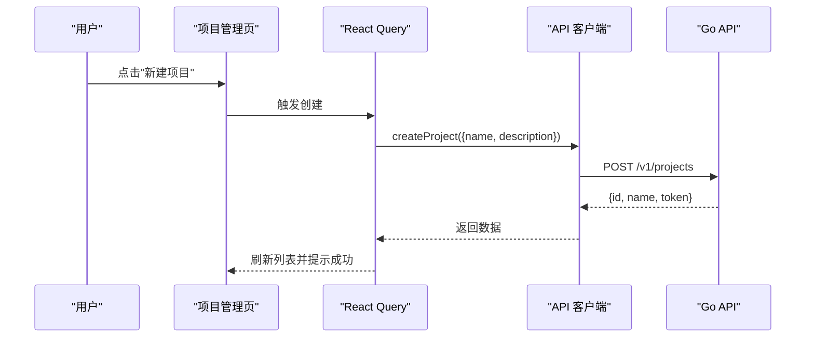

**图表来源**
- [web/src/app/admin/projects/page.tsx:18-27](file://web/src/app/admin/projects/page.tsx#L18-L27)
- [web/src/lib/api.ts:35-36](file://web/src/lib/api.ts#L35-L36)
- [server/api/internal/handler/project.go:71-96](file://server/api/internal/handler/project.go#L71-L96)

**章节来源**
- [web/src/app/admin/projects/page.tsx:8-84](file://web/src/app/admin/projects/page.tsx#L8-L84)
- [web/src/lib/api.ts:35-36](file://web/src/lib/api.ts#L35-L36)
- [server/api/internal/handler/project.go:71-96](file://server/api/internal/handler/project.go#L71-L96)

### 埋点元数据（Admin Events）
- 功能
  - 按项目查看事件定义列表，包含事件名、显示名、分类、描述、状态与时间范围。
  - 用于核对埋点规则与实际数据的一致性。
- 最佳实践
  - 在项目管理中为事件命名与分类建立规范，减少歧义。
  - 定期清理不再使用的事件定义，保持元数据整洁。

**章节来源**
- [web/src/app/admin/events/page.tsx:20-88](file://web/src/app/admin/events/page.tsx#L20-L88)
- [server/api/internal/handler/project.go:103-134](file://server/api/internal/handler/project.go#L103-L134)

### 用户管理（Admin Users）
- 功能概述
  - 管理平台用户权限与访问控制，支持用户生命周期管理。
  - 提供用户创建、权限分配、角色管理、访问审计等功能。
- 管理功能
  - 用户信息维护、权限策略配置、访问日志查看、用户状态管理。
  - 多租户权限隔离、细粒度访问控制、审计追踪。
- 最佳实践
  - 遵循最小权限原则，按需分配用户权限。
  - 建立完善的用户管理制度，定期审查权限分配。

**章节来源**
- [web/src/app/admin/users/page.tsx:8-84](file://web/src/app/admin/users/page.tsx#L8-L84)

## 依赖关系分析
- 前端依赖
  - Next.js 14、shadcn/ui、Tailwind CSS、React Query、Zustand 等。
  - 通过环境变量 NEXT_PUBLIC_API_BASE 指向后端 API 地址，并在构建时进行重写以简化跨域。
  - Zustand提供轻量级状态管理，替代传统的Context API。
- 样式系统依赖
  - Tailwind CSS 提供原子化样式系统，支持响应式设计与主题定制。
  - shadcn/ui 组件库基于 Radix UI 构建，提供可定制的 UI 组件。
- 状态管理依赖
  - Zustand替代Redux，提供更简洁的状态管理模式。
  - persist中间件实现状态持久化，localStorage存储用户偏好。
- 后端依赖
  - Gin、pgx、ClickHouse Go 驱动、Prometheus 指标导出。
- 部署依赖
  - Docker Compose 编排 PostgreSQL、Redis、Redpanda、ClickHouse、MinIO、Prometheus、Grafana。

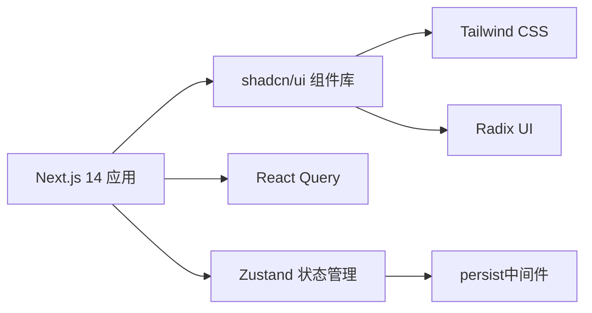

**图表来源**
- [web/package.json:11-22](file://web/package.json#L11-L22)
- [web/tailwind.config.ts:1-50](file://web/tailwind.config.ts#L1-L50)
- [web/components.json:1-100](file://web/components.json#L1-L100)
- [web/src/stores/project-store.ts:3-4](file://web/src/stores/project-store.ts#L3-L4)
- [web/src/stores/ui-store.ts:3-4](file://web/src/stores/ui-store.ts#L3-L4)

**章节来源**
- [web/package.json:11-22](file://web/package.json#L11-L22)
- [web/next.config.js:4-12](file://web/next.config.js#L4-L12)
- [web/tailwind.config.ts:1-50](file://web/tailwind.config.ts#L1-L50)
- [web/components.json:1-100](file://web/components.json#L1-L100)
- [web/src/stores/project-store.ts:3-4](file://web/src/stores/project-store.ts#L3-L4)
- [web/src/stores/ui-store.ts:3-4](file://web/src/stores/ui-store.ts#L3-L4)

## 性能考虑
- 前端
  - 使用 Next.js 14 App Router 的路由优化，支持并行数据获取与流式传输。
  - shadcn/ui 组件按需加载，减少不必要的包体积。
  - Tailwind CSS 通过 Purge 配置移除未使用样式，优化运行时性能。
  - React Query 管理缓存与重试策略，避免重复请求。
  - 图表组件按需动态导入，减少首屏体积。
  - 时间范围与参数变更时，合理利用查询键与 enabled 条件，避免无效请求。
  - 新增功能模块采用懒加载策略，提升整体性能表现。
  - Zustand状态管理提供更高效的局部状态更新，减少不必要的重渲染。
  - Hydration优化避免客户端和服务端状态不一致导致的额外渲染。
- 状态管理性能
  - Zustand使用immer优化状态更新，避免深层拷贝。
  - persist中间件只序列化必要的状态字段，减少存储开销。
  - 通过partialize选项只持久化主题和侧边栏状态，提高性能。
- 后端
  - ClickHouse 查询已按天/小时聚合，建议在前端控制粒度与时间范围，避免超大数据集传输。
  - 分析接口对参数有默认值与边界校验，前端尽量传递精确参数。
  - 新增实时监控功能需要优化 WebSocket 连接管理与数据推送频率。
- 部署
  - Docker Compose 中为 ClickHouse 设置了内存与文件句柄上限，生产环境建议根据数据量调整资源。

**章节来源**
- [web/src/app/console/event/page.tsx:30-48](file://web/src/app/console/event/page.tsx#L30-L48)
- [web/src/stores/ui-store.ts:41-41](file://web/src/stores/ui-store.ts#L41-L41)
- [web/tailwind.config.ts:1-50](file://web/tailwind.config.ts#L1-L50)
- [server/api/internal/handler/analytics.go:34-74](file://server/api/internal/handler/analytics.go#L34-L74)
- [deploy/docker-compose.yml:74-97](file://deploy/docker-compose.yml#L74-L97)

## 故障排查指南
- 无法加载数据
  - 检查 NEXT_PUBLIC_API_BASE 是否正确指向后端地址，确认网络连通性。
  - 查看浏览器开发者工具 Network 面板，确认 API 返回状态与错误信息。
- CORS 问题
  - 后端通过 AllowOrigins 配置允许的来源，若跨域失败，确认前端来源在允许列表中。
- 样式问题
  - 确认 Tailwind CSS 已正确配置，检查组件类名拼写。
  - 验证 shadcn/ui 组件是否正确安装和配置。
- 状态管理问题
  - 检查Zustand store是否正确初始化，确认persist中间件配置。
  - 验证localStorage访问权限，确保不会在SSR环境下报错。
  - 确认Hydration状态是否正确设置，避免主题切换异常。
- 查询结果为空
  - 确认所选项目存在事件数据；检查时间范围是否覆盖事件发生时段。
  - 对于漏斗与留存，确认事件名称大小写与空格一致。
  - 新增功能模块检查对应的 API 端点是否可用。
- 项目创建失败
  - 检查必填字段与后端校验错误信息；确认数据库连接正常。
- 实时功能异常
  - 检查 WebSocket 连接状态与服务器配置。
  - 验证实时数据推送频率与客户端处理能力。
- 权限访问问题
  - 确认用户权限配置与角色分配。
  - 检查治理规则与合规性检查结果。

**章节来源**
- [web/next.config.js:4-12](file://web/next.config.js#L4-L12)
- [web/tailwind.config.ts:1-50](file://web/tailwind.config.ts#L1-L50)
- [web/components.json:1-100](file://web/components.json#L1-L100)
- [web/src/stores/project-store.ts:18-20](file://web/src/stores/project-store.ts#L18-L20)
- [web/src/stores/ui-store.ts:38-48](file://web/src/stores/ui-store.ts#L38-L48)
- [server/api/cmd/main.go:95-120](file://server/api/cmd/main.go#L95-L120)
- [server/api/internal/config/config.go:24-37](file://server/api/internal/config/config.go#L24-L37)
- [web/src/lib/api.ts:14-18](file://web/src/lib/api.ts#L14-L18)

## 结论
AeroLog Web 控制台已完成从 Ant Design 到 shadcn/ui 的现代化 UI 升级，从定制 CSS 到 Tailwind CSS 的样式系统重构，以及从传统路由到 Next.js 14 App Router 的架构升级。本次更新重点反映了新增的Zustand状态管理系统、TopHeader组件集成、Dashboard Shell响应式改进、CSS主题系统增强和Hydration警告解决方案。

新架构的核心优势包括：
- **状态管理优化**：Zustand提供更高效的状态管理，替代复杂的Redux配置。
- **用户体验提升**：TopHeader集成多项功能，提供更便捷的操作体验。
- **响应式布局改进**：Dashboard Shell支持更好的桌面端和移动端适配。
- **主题系统增强**：完整的Hydration解决方案确保主题切换的稳定性。
- **开发效率提升**：更简洁的状态管理模式和更好的TypeScript支持。

控制台仍然提供了从概览到深度分析的全链路能力，结合项目管理与埋点元数据，能够支撑从日常监控到精细化运营的多种场景。新架构为未来的功能扩展奠定了坚实的基础。

## 附录

### 用户权限与安全控制
- 当前前端未内置登录态与权限校验逻辑，建议在企业环境中引入认证与授权机制（如 JWT、RBAC）。
- 项目 Token 用于 SDK 上报鉴权，应妥善保管并定期轮换。
- 新增治理管理功能需要完善的权限控制与审计机制。

**章节来源**
- [server/api/internal/config/config.go:35-36](file://server/api/internal/config/config.go#L35-L36)
- [server/api/internal/handler/project.go:77-95](file://server/api/internal/handler/project.go#L77-L95)

### 常用操作最佳实践
- 数据分析
  - 事件分析：按小时观察短期波动，按天观察长期趋势；对比关键事件在同一周期的表现。
  - 漏斗分析：从核心路径开始，逐步扩展步骤；合理设置窗口时间。
  - 留存分析：关注 Day1 与 Day7 的转化率变化，结合事件分析定位问题。
  - 转化分析：重点关注关键转化节点的性能表现，结合业务指标设定阈值。
  - 实时监控：设置合理的刷新频率与告警阈值，及时发现异常情况。
- 项目管理
  - 为不同应用/环境创建独立项目；定期清理不活跃项目。
  - 埋点元数据规范化命名与分类，便于检索与审计。
  - 新增治理规则配置，确保数据质量与合规性。
- 用户管理
  - 遵循最小权限原则，按需分配用户权限。
  - 建立完善的用户管理制度，定期审查权限分配。
- UI 组件使用
  - 利用 shadcn/ui 组件的一致性外观和交互行为。
  - 通过 Tailwind CSS 类名实现灵活的样式定制。
- 状态管理最佳实践
  - 合理使用Zustand store，避免过度分散状态。
  - 利用persist中间件实现必要的状态持久化。
  - 注意Hydration处理，确保客户端和服务端状态一致性。

**章节来源**
- [web/src/app/console/event/page.tsx:88-91](file://web/src/app/console/event/page.tsx#L88-L91)
- [web/src/app/console/funnel/page.tsx:128-135](file://web/src/app/console/funnel/page.tsx#L128-L135)
- [web/src/app/console/retention/page.tsx:107-108](file://web/src/app/console/retention/page.tsx#L107-L108)
- [web/src/app/console/conversions/page.tsx:1-100](file://web/src/app/console/conversions/page.tsx#L1-L100)
- [web/src/app/console/realtime/page.tsx:1-120](file://web/src/app/console/realtime/page.tsx#L1-L120)
- [web/src/app/console/governance/page.tsx:1-100](file://web/src/app/console/governance/page.tsx#L1-L100)
- [web/src/stores/project-store.ts:11-22](file://web/src/stores/project-store.ts#L11-L22)
- [web/src/stores/ui-store.ts:19-49](file://web/src/stores/ui-store.ts#L19-L49)

### 界面定制与个性化
- 主题与样式
  - 通过 Tailwind CSS 配置文件进行全局主题与颜色定制。
  - shadcn/ui 组件支持通过 CSS 变量进行主题定制。
  - Zustand状态管理支持主题模式的持久化和Hydration处理。
- 导航与布局
  - AppShell 的菜单项与布局结构可按需扩展，新增页面时注意路由与选中状态同步。
  - 报表和配置分组支持灵活的功能分类与组织。
  - Dashboard Shell 支持侧边栏折叠和响应式布局。
- 组件定制
  - 利用 shadcn/ui 组件的可定制性，通过 props 和 CSS 类名进行外观调整。
  - Tailwind CSS 提供原子化类名，支持细粒度的样式控制。
- 状态管理定制
  - 可以根据需要添加新的store来管理特定的全局状态。
  - persist中间件支持自定义存储策略和序列化选项。
  - Hydration钩子提供灵活的客户端状态初始化机制。
- 新功能模块集成
  - 采用模块化设计，支持新功能模块的快速集成与扩展。
  - 统一的 API 接口与数据格式，降低集成成本。
  - Zustand状态管理提供更好的开发体验和性能表现。

**章节来源**
- [web/src/components/AppShell.tsx:1-10](file://web/src/components/AppShell.tsx#L1-L10)
- [web/src/components/layout/dashboard-shell.tsx:27-49](file://web/src/components/layout/dashboard-shell.tsx#L27-L49)
- [web/src/components/layout/top-header.tsx:43-88](file://web/src/components/layout/top-header.tsx#L43-L88)
- [web/src/stores/project-store.ts:11-22](file://web/src/stores/project-store.ts#L11-L22)
- [web/src/stores/ui-store.ts:19-49](file://web/src/stores/ui-store.ts#L19-L49)
- [web/tailwind.config.ts:1-50](file://web/tailwind.config.ts#L1-L50)
- [web/components.json:1-100](file://web/components.json#L1-L100)