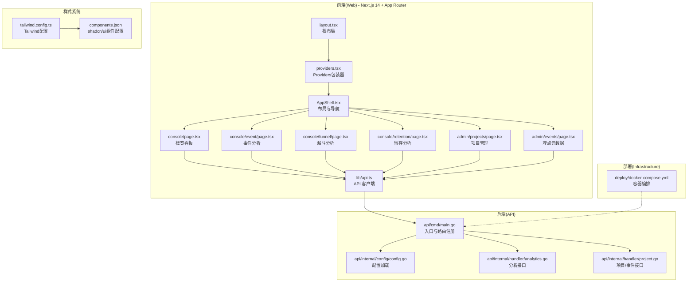
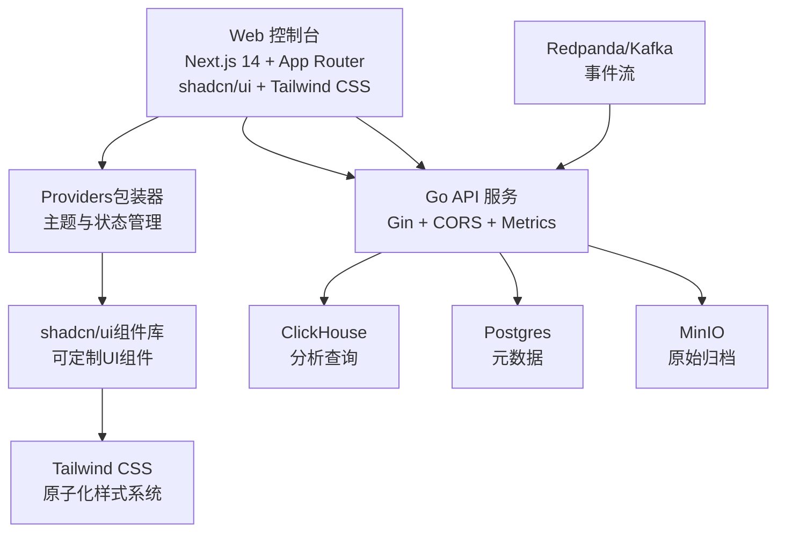
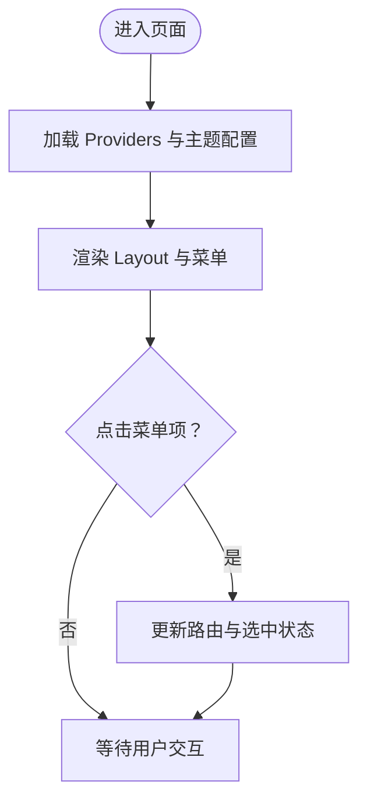
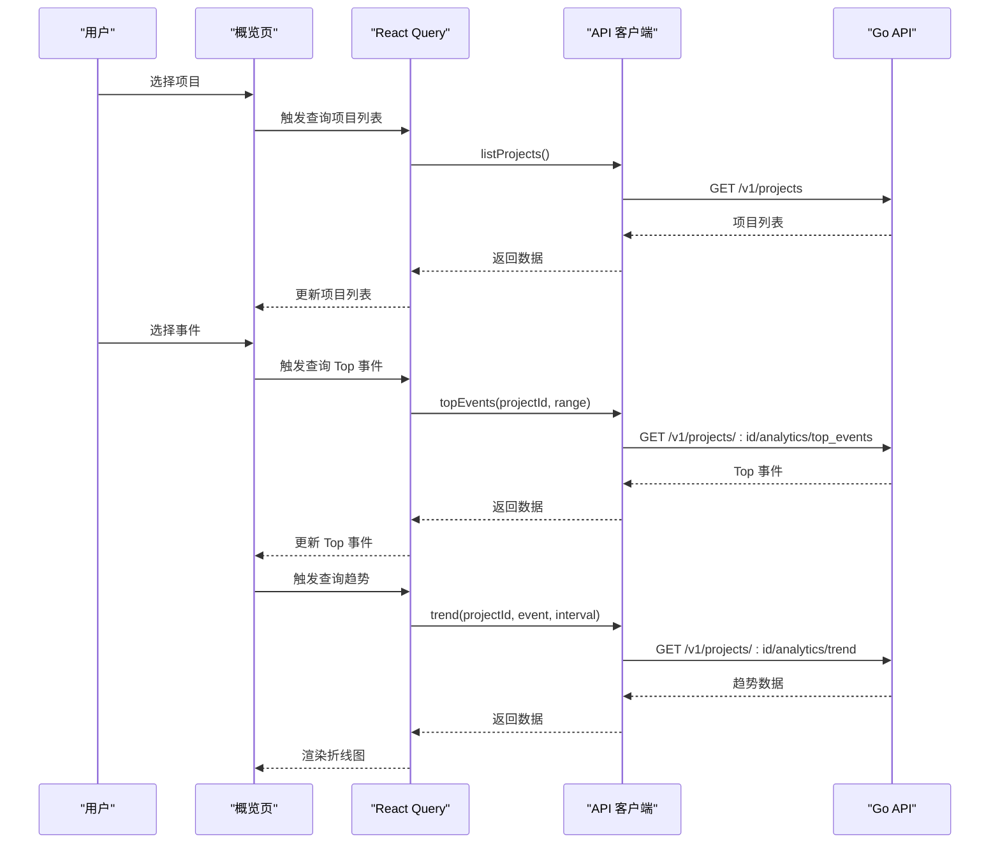
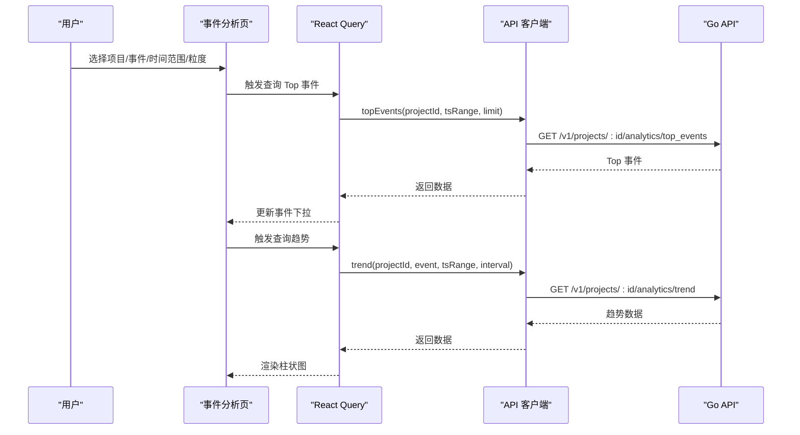
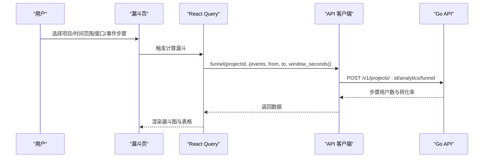
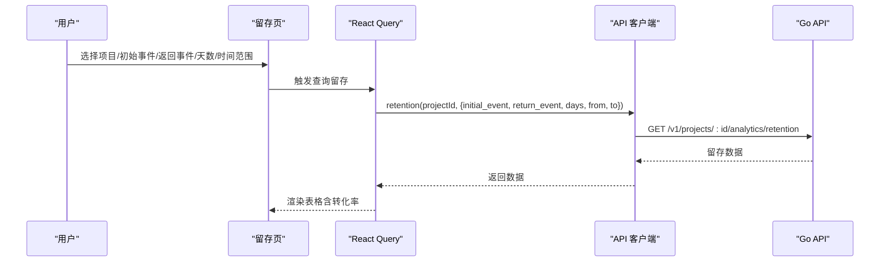
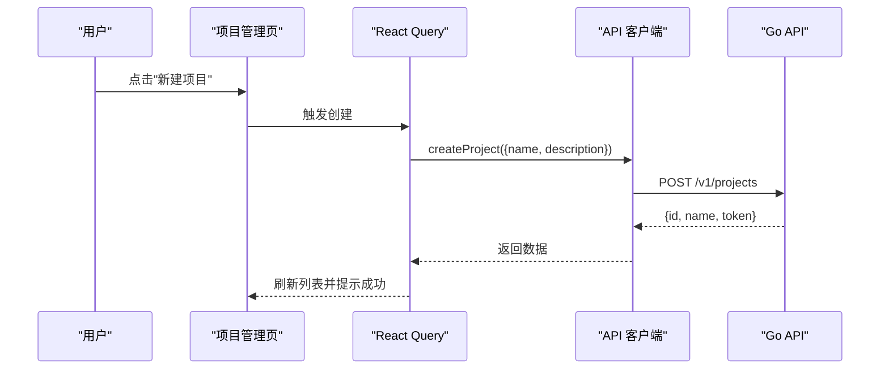
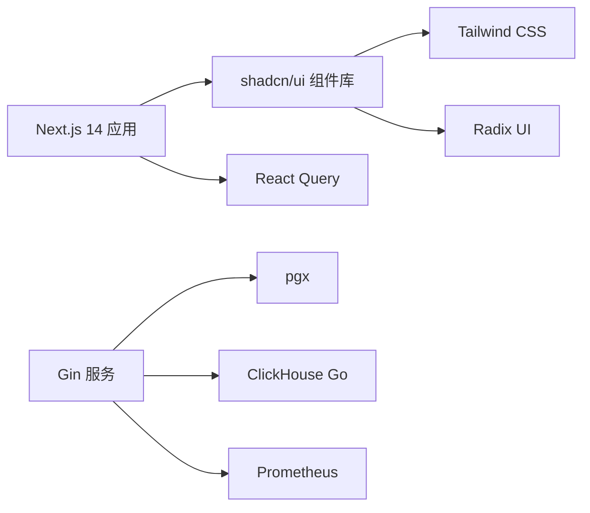

# Web控制台

<cite>
**本文引用的文件**
- [web/src/app/layout.tsx](file://web/src/app/layout.tsx)
- [web/src/components/AppShell.tsx](file://web/src/components/AppShell.tsx)
- [web/src/app/console/page.tsx](file://web/src/app/console/page.tsx)
- [web/src/app/console/event/page.tsx](file://web/src/app/console/event/page.tsx)
- [web/src/app/console/funnel/page.tsx](file://web/src/app/console/funnel/page.tsx)
- [web/src/app/console/retention/page.tsx](file://web/src/app/console/retention/page.tsx)
- [web/src/app/admin/projects/page.tsx](file://web/src/app/admin/projects/page.tsx)
- [web/src/app/admin/events/page.tsx](file://web/src/app/admin/events/page.tsx)
- [web/src/lib/api.ts](file://web/src/lib/api.ts)
- [web/next.config.js](file://web/next.config.js)
- [web/tailwind.config.ts](file://web/tailwind.config.ts)
- [web/components.json](file://web/components.json)
- [deploy/docker-compose.yml](file://deploy/docker-compose.yml)
- [server/api/cmd/main.go](file://server/api/cmd/main.go)
- [server/api/internal/config/config.go](file://server/api/internal/config/config.go)
- [server/api/internal/handler/analytics.go](file://server/api/internal/handler/analytics.go)
- [server/api/internal/handler/project.go](file://server/api/internal/handler/project.go)
- [README.md](file://README.md)
</cite>

## 更新摘要
**所做更改**
- 更新了前端架构以反映Next.js 14和App Router的重大重构
- 替换了UI组件库从Ant Design到shadcn/ui的迁移
- 更新了样式系统从定制CSS到Tailwind CSS的转换
- 重新组织了组件结构以适应新的架构模式
- 更新了所有相关的架构图表和组件分析

## 目录
1. [简介](#简介)
2. [项目结构](#项目结构)
3. [核心组件](#核心组件)
4. [架构总览](#架构总览)
5. [详细组件分析](#详细组件分析)
6. [依赖关系分析](#依赖关系分析)
7. [性能考虑](#性能考虑)
8. [故障排查指南](#故障排查指南)
9. [结论](#结论)
10. [附录](#附录)

## 简介
本文件面向 AeroLog Web 控制台使用者与维护者，提供从界面布局到数据分析、项目管理、权限与安全、性能优化与故障排查的完整使用与运维指南。控制台基于 Next.js 14 构建，采用 shadcn/ui 作为现代化 UI 组件库，通过 Tailwind CSS 实现响应式样式系统，通过 React Query 管理数据请求，前端通过统一 API 客户端对接后端 Go 服务。

**重要说明**：基于最新的代码审查，前端控制台已完成重大架构升级，采用 Next.js 14 App Router 和 shadcn/ui 组件库，同时迁移到 Tailwind CSS 样式系统。本文档将全面反映这些架构变更，确保用户能够有效使用 AeroLog Web 控制台的各项功能。

## 项目结构
- 前端（web）：Next.js 14 应用，采用 App Router 架构，包含控制台页面与管理后台页面，以及基于 shadcn/ui 的通用布局与 API 客户端。
- 后端（server）：Go 服务，提供项目管理、事件定义、分析接口等。
- 部署（deploy）：Docker Compose 编排数据库、消息队列、存储与监控等基础设施。
- 文档（docs）：协议、架构与可观测性文档。

**图表来源**
- [web/src/app/layout.tsx:1-19](file://web/src/app/layout.tsx#L1-L19)
- [web/src/app/providers.tsx:1-50](file://web/src/app/providers.tsx#L1-L50)
- [web/src/components/AppShell.tsx:1-44](file://web/src/components/AppShell.tsx#L1-L44)
- [web/src/app/console/page.tsx:1-124](file://web/src/app/console/page.tsx#L1-L124)
- [web/src/app/console/event/page.tsx:1-104](file://web/src/app/console/event/page.tsx#L1-L104)
- [web/src/app/console/funnel/page.tsx:1-165](file://web/src/app/console/funnel/page.tsx#L1-L165)
- [web/src/app/console/retention/page.tsx:1-128](file://web/src/app/console/retention/page.tsx#L1-L128)
- [web/src/app/admin/projects/page.tsx:1-85](file://web/src/app/admin/projects/page.tsx#L1-L85)
- [web/src/app/admin/events/page.tsx:1-89](file://web/src/app/admin/events/page.tsx#L1-L89)
- [web/src/lib/api.ts:1-76](file://web/src/lib/api.ts#L1-L76)
- [web/tailwind.config.ts:1-50](file://web/tailwind.config.ts#L1-L50)
- [web/components.json:1-100](file://web/components.json#L1-L100)
- [server/api/cmd/main.go:1-121](file://server/api/cmd/main.go#L1-L121)
- [server/api/internal/config/config.go:1-46](file://server/api/internal/config/config.go#L1-L46)
- [server/api/internal/handler/analytics.go:1-304](file://server/api/internal/handler/analytics.go#L1-L304)
- [server/api/internal/handler/project.go:1-143](file://server/api/internal/handler/project.go#L1-L143)
- [deploy/docker-compose.yml:1-147](file://deploy/docker-compose.yml#L1-L147)

**章节来源**
- [README.md:1-50](file://README.md#L1-L50)
- [web/src/app/layout.tsx:1-19](file://web/src/app/layout.tsx#L1-L19)
- [web/src/app/providers.tsx:1-50](file://web/src/app/providers.tsx#L1-L50)
- [web/src/components/AppShell.tsx:1-44](file://web/src/components/AppShell.tsx#L1-L44)

## 核心组件
- 布局与导航
  - 根布局负责注入样式与全局 Providers 包裹，确保内容在统一外壳中渲染。
  - AppShell 提供顶部标题、侧边菜单与内容区域，并内置查询客户端与主题配置。
- 页面与功能
  - 概览看板：展示 Top 事件与事件趋势折线图，支持项目切换与默认时间范围。
  - 事件分析：支持自定义时间范围、粒度（小时/天）、事件选择与柱状趋势图。
  - 漏斗分析：支持多步骤事件、时间窗口与计算按钮，输出漏斗图与表格。
  - 留存分析：支持初始事件、返回事件、天数与时间范围，输出留存热力表。
  - 项目管理：新建项目、查看 Token、状态与创建时间。
  - 埋点元数据：按项目查看事件定义列表。
- API 客户端
  - 统一前缀与头部处理，错误抛出与非 OK 状态码提示。
  - 提供项目、事件、趋势、Top 事件、漏斗、留存等接口封装。
- 样式系统
  - Tailwind CSS 提供原子化样式系统，支持响应式设计与主题定制。
  - shadcn/ui 组件库提供可定制的 UI 组件，基于 Radix UI 和 Tailwind CSS 构建。

**章节来源**
- [web/src/app/layout.tsx:1-19](file://web/src/app/layout.tsx#L1-L19)
- [web/src/app/providers.tsx:1-50](file://web/src/app/providers.tsx#L1-L50)
- [web/src/components/AppShell.tsx:10-43](file://web/src/components/AppShell.tsx#L10-L43)
- [web/src/app/console/page.tsx:13-123](file://web/src/app/console/page.tsx#L13-L123)
- [web/src/app/console/event/page.tsx:13-103](file://web/src/app/console/event/page.tsx#L13-L103)
- [web/src/app/console/funnel/page.tsx:30-164](file://web/src/app/console/funnel/page.tsx#L30-L164)
- [web/src/app/console/retention/page.tsx:17-127](file://web/src/app/console/retention/page.tsx#L17-L127)
- [web/src/app/admin/projects/page.tsx:8-84](file://web/src/app/admin/projects/page.tsx#L8-L84)
- [web/src/app/admin/events/page.tsx:20-88](file://web/src/app/admin/events/page.tsx#L20-L88)
- [web/src/lib/api.ts:32-75](file://web/src/lib/api.ts#L32-L75)
- [web/tailwind.config.ts:1-50](file://web/tailwind.config.ts#L1-L50)
- [web/components.json:1-100](file://web/components.json#L1-L100)

## 架构总览
前端通过 Next.js 14 与 App Router 提供现代化的交互界面，采用 shadcn/ui 组件库和 Tailwind CSS 样式系统，React Query 管理数据请求与缓存；API 层由 Go Gin 服务提供 REST 接口，连接 ClickHouse 进行分析查询，Postgres 存储元数据；Docker Compose 编排数据库、消息队列、对象存储与监控。

**图表来源**
- [README.md:24-34](file://README.md#L24-L34)
- [web/src/app/providers.tsx:1-50](file://web/src/app/providers.tsx#L1-L50)
- [web/tailwind.config.ts:1-50](file://web/tailwind.config.ts#L1-L50)
- [web/components.json:1-100](file://web/components.json#L1-L100)
- [deploy/docker-compose.yml:1-147](file://deploy/docker-compose.yml#L1-L147)
- [server/api/cmd/main.go:35-78](file://server/api/cmd/main.go#L35-L78)
- [server/api/internal/handler/analytics.go:27-32](file://server/api/internal/handler/analytics.go#L27-L32)
- [server/api/internal/handler/project.go:29-33](file://server/api/internal/handler/project.go#L29-L33)

## 详细组件分析

### 布局与导航（AppShell）
- 功能要点
  - 顶部标题"AeroLog"，侧边菜单项包含概览看板、事件分析、漏斗分析、留存分析、项目管理、埋点元数据。
  - 使用受控路由与路径匹配确定当前选中菜单，支持内联模式与固定宽度侧栏。
  - 内置查询客户端与主题配置，保证各页面共享状态与主题一致性。
- 响应式与适配
  - 使用 Tailwind CSS 原子化类名，配合响应式断点实现自适应布局。
  - shadcn/ui 组件提供一致的视觉风格和交互行为，适合现代 Web 应用。

**图表来源**
- [web/src/components/AppShell.tsx:10-43](file://web/src/components/AppShell.tsx#L10-L43)

**章节来源**
- [web/src/components/AppShell.tsx:10-43](file://web/src/components/AppShell.tsx#L10-L43)

### 概览看板（Console）
- 数据流
  - 加载项目列表，自动选择首个项目并清空事件选择。
  - 查询 Top 事件（默认最近 7 天），自动选择第一条事件。
  - 查询事件趋势（按天聚合），生成折线图。
- 图表与交互
  - 左侧表格支持点击事件切换右侧趋势图。
  - 右侧折线图开启面积填充与平滑曲线，突出趋势变化。
- 最佳实践
  - 若项目较多，优先使用筛选器快速定位目标项目。
  - 关注趋势图中的异常波动，结合事件列表定位具体事件。

**图表来源**
- [web/src/app/console/page.tsx:17-50](file://web/src/app/console/page.tsx#L17-L50)
- [web/src/lib/api.ts:34-50](file://web/src/lib/api.ts#L34-L50)
- [server/api/internal/handler/analytics.go:34-74](file://server/api/internal/handler/analytics.go#L34-L74)

**章节来源**
- [web/src/app/console/page.tsx:13-123](file://web/src/app/console/page.tsx#L13-L123)
- [web/src/lib/api.ts:32-50](file://web/src/lib/api.ts#L32-L50)
- [server/api/internal/handler/analytics.go:27-74](file://server/api/internal/handler/analytics.go#L27-L74)

### 事件分析（Event Analysis）
- 参数与交互
  - 支持项目选择、事件选择、时间范围选择（带时区起止）、粒度切换（小时/天）。
  - 事件列表来自 Top 事件接口，避免手动输入。
- 图表与解读
  - 柱状图展示事件计数随时间的变化，便于识别高峰与低谷。
  - 建议结合"按小时"观察短期波动，"按天"观察长期趋势。
- 最佳实践
  - 将时间范围对齐业务活动周期，例如促销活动前后对比。
  - 对比多个事件在同一时间段的趋势，识别相关性。

**图表来源**
- [web/src/app/console/event/page.tsx:22-48](file://web/src/app/console/event/page.tsx#L22-L48)
- [web/src/lib/api.ts:38-50](file://web/src/lib/api.ts#L38-L50)
- [server/api/internal/handler/analytics.go:34-74](file://server/api/internal/handler/analytics.go#L34-L74)

**章节来源**
- [web/src/app/console/event/page.tsx:13-103](file://web/src/app/console/event/page.tsx#L13-L103)
- [web/src/lib/api.ts:38-50](file://web/src/lib/api.ts#L38-L50)
- [server/api/internal/handler/analytics.go:34-74](file://server/api/internal/handler/analytics.go#L34-L74)

### 漏斗分析（Funnel）
- 参数与交互
  - 选择项目、时间范围、窗口秒数（默认 24 小时），按顺序选择 2-8 个事件作为步骤。
  - 点击"计算漏斗"触发 POST 请求，返回每一步的用户数与转化率。
- 图表与解读
  - 漏斗图直观展示每一步的用户流失情况，转化率百分比标注在柱内。
  - 若某一步骤转化率骤降，需结合事件上下文与埋点规则排查。
- 最佳实践
  - 窗口时间应覆盖业务流程的合理时长，避免过短导致漏判。
  - 步骤过多会增加复杂度，建议从关键路径开始逐步细化。

**图表来源**
- [web/src/app/console/funnel/page.tsx:59-69](file://web/src/app/console/funnel/page.tsx#L59-L69)
- [web/src/lib/api.ts:52-59](file://web/src/lib/api.ts#L52-L59)
- [server/api/internal/handler/analytics.go:119-199](file://server/api/internal/handler/analytics.go#L119-L199)

**章节来源**
- [web/src/app/console/funnel/page.tsx:30-164](file://web/src/app/console/funnel/page.tsx#L30-L164)
- [web/src/lib/api.ts:52-59](file://web/src/lib/api.ts#L52-L59)
- [server/api/internal/handler/analytics.go:119-199](file://server/api/internal/handler/analytics.go#L119-L199)

### 留存分析（Retention）
- 参数与交互
  - 选择项目、初始事件、返回事件、天数（2-30，默认 7）、时间范围。
  - 表格固定左侧行头（同期日与用户数），列头为 Day0 至 DayN 的转化率。
- 表格与解读
  - Day0 通常为 100%，后续天数的转化率越低表示用户回访意愿越弱。
  - 若某天转化率显著下降，结合事件分析定位问题节点。
- 最佳实践
  - 初期可使用较短天数观察短期效果，后期延长天数评估长期粘性。

**图表来源**
- [web/src/app/console/retention/page.tsx:46-57](file://web/src/app/console/retention/page.tsx#L46-L57)
- [web/src/lib/api.ts:60-74](file://web/src/lib/api.ts#L60-L74)
- [server/api/internal/handler/analytics.go:201-283](file://server/api/internal/handler/analytics.go#L201-L283)

**章节来源**
- [web/src/app/console/retention/page.tsx:17-127](file://web/src/app/console/retention/page.tsx#L17-L127)
- [web/src/lib/api.ts:60-74](file://web/src/lib/api.ts#L60-L74)
- [server/api/internal/handler/analytics.go:201-283](file://server/api/internal/handler/analytics.go#L201-L283)

### 项目管理（Admin Projects）
- 流程
  - 列表展示项目 ID、名称、Token、描述、状态与创建时间。
  - 新建项目弹窗提交名称与描述，成功后刷新列表。
- 权限与安全
  - 创建项目时生成随机 Token，用于 SDK 上报鉴权。
  - 建议妥善保存 Token 并限制访问范围。
- 最佳实践
  - 为不同应用或环境（测试/生产）分别创建项目，便于隔离与审计。
  - 定期检查项目状态与使用情况，及时停用不活跃项目。

**图表来源**
- [web/src/app/admin/projects/page.tsx:18-27](file://web/src/app/admin/projects/page.tsx#L18-L27)
- [web/src/lib/api.ts:35-36](file://web/src/lib/api.ts#L35-L36)
- [server/api/internal/handler/project.go:71-96](file://server/api/internal/handler/project.go#L71-L96)

**章节来源**
- [web/src/app/admin/projects/page.tsx:8-84](file://web/src/app/admin/projects/page.tsx#L8-L84)
- [web/src/lib/api.ts:35-36](file://web/src/lib/api.ts#L35-L36)
- [server/api/internal/handler/project.go:71-96](file://server/api/internal/handler/project.go#L71-L96)

### 埋点元数据（Admin Events）
- 功能
  - 按项目查看事件定义列表，包含事件名、显示名、分类、描述、状态与时间范围。
  - 用于核对埋点规则与实际数据的一致性。
- 最佳实践
  - 在项目管理中为事件命名与分类建立规范，减少歧义。
  - 定期清理不再使用的事件定义，保持元数据整洁。

**章节来源**
- [web/src/app/admin/events/page.tsx:20-88](file://web/src/app/admin/events/page.tsx#L20-L88)
- [server/api/internal/handler/project.go:103-134](file://server/api/internal/handler/project.go#L103-L134)

## 依赖关系分析
- 前端依赖
  - Next.js 14、shadcn/ui、Tailwind CSS、React Query、Radix UI 等。
  - 通过环境变量 NEXT_PUBLIC_API_BASE 指向后端 API 地址，并在构建时进行重写以简化跨域。
- 样式系统依赖
  - Tailwind CSS 提供原子化样式系统，支持响应式设计与主题定制。
  - shadcn/ui 组件库基于 Radix UI 构建，提供可定制的 UI 组件。
- 后端依赖
  - Gin、pgx、ClickHouse Go 驱动、Prometheus 指标导出。
- 部署依赖
  - Docker Compose 编排 PostgreSQL、Redis、Redpanda、ClickHouse、MinIO、Prometheus、Grafana。

**图表来源**
- [web/package.json:11-22](file://web/package.json#L11-L22)
- [web/tailwind.config.ts:1-50](file://web/tailwind.config.ts#L1-L50)
- [web/components.json:1-100](file://web/components.json#L1-L100)
- [server/api/cmd/main.go:14-20](file://server/api/cmd/main.go#L14-L20)
- [deploy/docker-compose.yml:1-147](file://deploy/docker-compose.yml#L1-L147)

**章节来源**
- [web/package.json:11-22](file://web/package.json#L11-L22)
- [web/next.config.js:4-12](file://web/next.config.js#L4-L12)
- [web/tailwind.config.ts:1-50](file://web/tailwind.config.ts#L1-L50)
- [web/components.json:1-100](file://web/components.json#L1-L100)
- [server/api/cmd/main.go:14-20](file://server/api/cmd/main.go#L14-L20)
- [deploy/docker-compose.yml:1-147](file://deploy/docker-compose.yml#L1-L147)

## 性能考虑
- 前端
  - 使用 Next.js 14 App Router 的路由优化，支持并行数据获取与流式传输。
  - shadcn/ui 组件按需加载，减少不必要的包体积。
  - Tailwind CSS 通过 Purge 配置移除未使用样式，优化运行时性能。
  - React Query 管理缓存与重试策略，避免重复请求。
  - 图表组件按需动态导入，减少首屏体积。
  - 时间范围与参数变更时，合理利用查询键与 enabled 条件，避免无效请求。
- 后端
  - ClickHouse 查询已按天/小时聚合，建议在前端控制粒度与时间范围，避免超大数据集传输。
  - 分析接口对参数有默认值与边界校验，前端尽量传递精确参数。
- 部署
  - Docker Compose 中为 ClickHouse 设置了内存与文件句柄上限，生产环境建议根据数据量调整资源。

**章节来源**
- [web/src/app/console/event/page.tsx:30-48](file://web/src/app/console/event/page.tsx#L30-L48)
- [web/tailwind.config.ts:1-50](file://web/tailwind.config.ts#L1-L50)
- [server/api/internal/handler/analytics.go:34-74](file://server/api/internal/handler/analytics.go#L34-L74)
- [deploy/docker-compose.yml:74-97](file://deploy/docker-compose.yml#L74-L97)

## 故障排查指南
- 无法加载数据
  - 检查 NEXT_PUBLIC_API_BASE 是否正确指向后端地址，确认网络连通性。
  - 查看浏览器开发者工具 Network 面板，确认 API 返回状态与错误信息。
- CORS 问题
  - 后端通过 AllowOrigins 配置允许的来源，若跨域失败，确认前端来源在允许列表中。
- 样式问题
  - 确认 Tailwind CSS 已正确配置，检查组件类名拼写。
  - 验证 shadcn/ui 组件是否正确安装和配置。
- 查询结果为空
  - 确认所选项目存在事件数据；检查时间范围是否覆盖事件发生时段。
  - 对于漏斗与留存，确认事件名称大小写与空格一致。
- 项目创建失败
  - 检查必填字段与后端校验错误信息；确认数据库连接正常。

**章节来源**
- [web/next.config.js:4-12](file://web/next.config.js#L4-L12)
- [web/tailwind.config.ts:1-50](file://web/tailwind.config.ts#L1-L50)
- [web/components.json:1-100](file://web/components.json#L1-L100)
- [server/api/cmd/main.go:95-120](file://server/api/cmd/main.go#L95-L120)
- [server/api/internal/config/config.go:24-37](file://server/api/internal/config/config.go#L24-L37)
- [web/src/lib/api.ts:14-18](file://web/src/lib/api.ts#L14-L18)

## 结论
AeroLog Web 控制台已完成从 Ant Design 到 shadcn/ui 的现代化 UI 升级，从定制 CSS 到 Tailwind CSS 的样式系统重构，以及从传统路由到 Next.js 14 App Router 的架构升级。新架构提供了更好的开发体验、更优的性能表现和更一致的用户体验。控制台仍然提供了从概览到深度分析的全链路能力，结合项目管理与埋点元数据，能够支撑从日常监控到精细化运营的多种场景。

## 附录

### 用户权限与安全控制
- 当前前端未内置登录态与权限校验逻辑，建议在企业环境中引入认证与授权机制（如 JWT、RBAC）。
- 项目 Token 用于 SDK 上报鉴权，应妥善保管并定期轮换。

**章节来源**
- [server/api/internal/config/config.go:35-36](file://server/api/internal/config/config.go#L35-L36)
- [server/api/internal/handler/project.go:77-95](file://server/api/internal/handler/project.go#L77-L95)

### 常用操作最佳实践
- 数据分析
  - 事件分析：按小时观察短期波动，按天观察长期趋势；对比关键事件在同一周期的表现。
  - 漏斗分析：从核心路径开始，逐步扩展步骤；合理设置窗口时间。
  - 留存分析：关注 Day1 与 Day7 的转化率变化，结合事件分析定位问题。
- 项目管理
  - 为不同应用/环境创建独立项目；定期清理不活跃项目。
  - 埋点元数据规范化命名与分类，便于检索与审计。
- UI 组件使用
  - 利用 shadcn/ui 组件的一致性外观和交互行为。
  - 通过 Tailwind CSS 类名实现灵活的样式定制。

**章节来源**
- [web/src/app/console/event/page.tsx:88-91](file://web/src/app/console/event/page.tsx#L88-L91)
- [web/src/app/console/funnel/page.tsx:128-135](file://web/src/app/console/funnel/page.tsx#L128-L135)
- [web/src/app/console/retention/page.tsx:107-108](file://web/src/app/console/retention/page.tsx#L107-L108)

### 界面定制与个性化
- 主题与样式
  - 通过 Tailwind CSS 配置文件进行全局主题与颜色定制。
  - shadcn/ui 组件支持通过 CSS 变量进行主题定制。
- 导航与布局
  - AppShell 的菜单项与布局结构可按需扩展，新增页面时注意路由与选中状态同步。
- 组件定制
  - 利用 shadcn/ui 组件的可定制性，通过 props 和 CSS 类名进行外观调整。
  - Tailwind CSS 提供原子化类名，支持细粒度的样式控制。

**章节来源**
- [web/src/components/AppShell.tsx:25-41](file://web/src/components/AppShell.tsx#L25-L41)
- [web/tailwind.config.ts:1-50](file://web/tailwind.config.ts#L1-L50)
- [web/components.json:1-100](file://web/components.json#L1-L100)