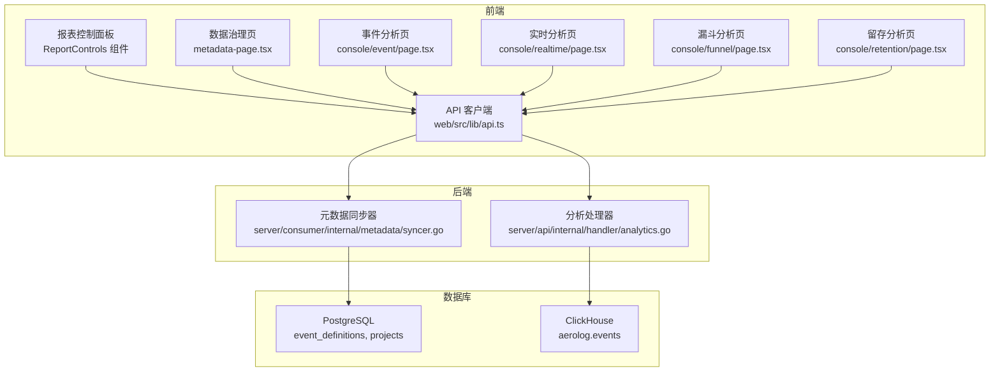
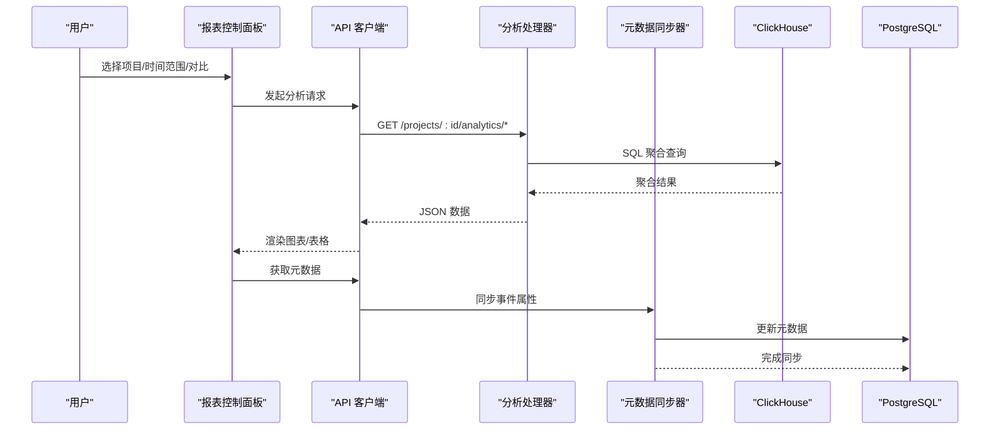
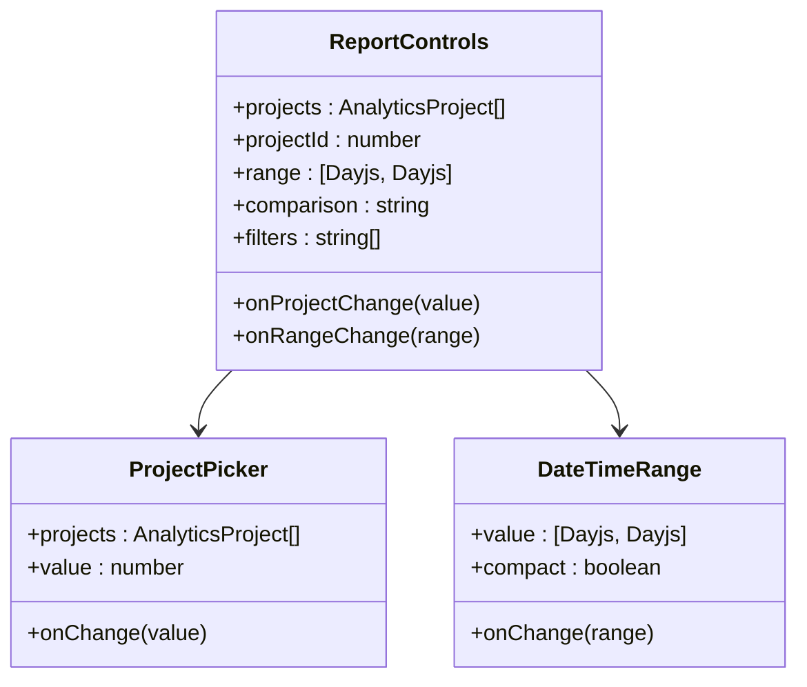
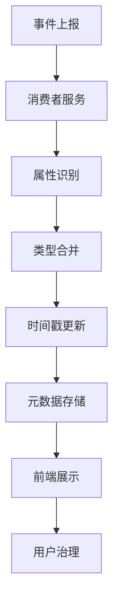
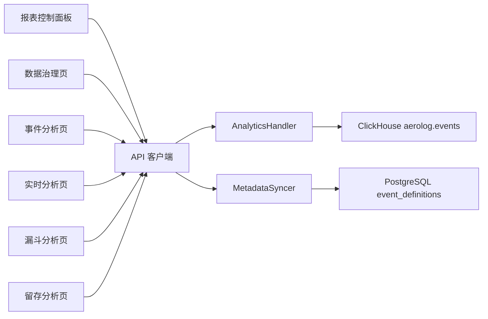

# 事件分析功能

<cite>
**本文引用的文件**
- [web/src/app/console/event/page.tsx](file://web/src/app/console/event/page.tsx)
- [web/src/app/console/realtime/page.tsx](file://web/src/app/console/realtime/page.tsx)
- [web/src/lib/api.ts](file://web/src/lib/api.ts)
- [server/api/internal/handler/analytics.go](file://server/api/internal/handler/analytics.go)
- [web/src/features/analytics/analytics-ui.tsx](file://web/src/features/analytics/analytics-ui.tsx)
- [web/src/features/metadata/metadata-page.tsx](file://web/src/features/metadata/metadata-page.tsx)
- [web/src/features/common/project-select.tsx](file://web/src/features/common/project-select.tsx)
- [web/src/app/console/page.tsx](file://web/src/app/console/page.tsx)
- [web/src/components/layout/dashboard-shell.tsx](file://web/src/components/layout/dashboard-shell.tsx)
- [server/consumer/internal/metadata/syncer.go](file://server/consumer/internal/metadata/syncer.go)
- [sdk/android/aerolog/src/main/java/dev/aerolog/sdk/AeroLog.kt](file://sdk/android/aerolog/src/main/java/dev/aerolog/sdk/AeroLog.kt)
- [deploy/init/postgres/01_schema.sql](file://deploy/init/postgres/01_schema.sql)
- [deploy/init/clickhouse/01_schema.sql](file://deploy/init/clickhouse/01_schema.sql)
- [docs/event.schema.json](file://docs/event.schema.json)
</cite>

## 更新摘要
**所做更改**
- 新增属性值探索能力，用户可通过点击参数键查看当前事件下的值分布
- 更新事件分析页面，新增参数值分布展示功能
- 新增 ReportControls 系统替代传统 ProjectPicker，提供统一的报表控制面板
- 新增事件属性自动发现功能，支持事件属性和用户属性的自动识别与治理
- 新增事件表功能，提供事件字典的表格化展示和管理
- 更新事件分析页面架构，采用新的 ReportControls 组件

## 目录
1. [简介](#简介)
2. [项目结构](#项目结构)
3. [核心组件](#核心组件)
4. [架构总览](#架构总览)
5. [详细组件分析](#详细组件分析)
6. [依赖关系分析](#依赖关系分析)
7. [性能考量](#性能考量)
8. [故障排查指南](#故障排查指南)
9. [结论](#结论)
10. [附录](#附录)

## 简介
本文件面向 AeroLog 事件分析功能的使用者与维护者，系统性介绍事件列表页、事件分析页、漏斗分析页与留存分析页的界面设计与功能特性。基于最新的 ReportControls 系统，事件分析功能现已实现统一的报表控制面板，支持项目选择、时间范围设置、对比分析和筛选器管理。同时，新增的事件属性自动发现功能能够自动识别和治理事件属性，提供完整的数据字典管理能力。**最新更新**：新增属性值探索能力，用户可通过点击参数键查看当前事件下的值分布，支持事件参数的深入分析。文档涵盖事件趋势、Top 事件、漏斗分析、留存分析等核心分析能力的工作原理与最佳实践，以及事件标签管理与批量操作的建议方案。

## 项目结构
前端采用 Next.js 应用，通过统一的 ReportControls 系统提供一致的报表控制体验；后端由 Go 编写，提供事件分析相关的 REST 接口，并基于 ClickHouse 进行高性能聚合查询。数据库层面，PostgreSQL 存储项目与事件元数据，ClickHouse 存储事件明细与上下文字段，支持高吞吐与复杂分析。新增的事件属性自动发现功能通过消费者服务实时同步事件属性信息。

**图表来源**
- [web/src/app/console/event/page.tsx:165-223](file://web/src/app/console/event/page.tsx#L165-L223)
- [web/src/app/console/realtime/page.tsx:165-223](file://web/src/app/console/realtime/page.tsx#L165-L223)
- [web/src/lib/api.ts:165-223](file://web/src/lib/api.ts#L165-L223)
- [server/api/internal/handler/analytics.go:27-32](file://server/api/internal/handler/analytics.go#L27-L32)
- [server/consumer/internal/metadata/syncer.go:110-183](file://server/consumer/internal/metadata/syncer.go#L110-L183)

## 核心组件
- **报表控制面板 (ReportControls)**：统一的报表控制组件，替代传统的 ProjectPicker，提供项目选择、时间范围设置、对比分析和筛选器管理功能。
- **数据治理页**：自动发现事件、事件属性和用户属性，提供完整的数据字典管理能力。
- **事件分析页**：提供事件趋势可视化，支持项目、事件、时间范围、粒度（小时/天）的选择，动态生成柱状图。**新增**：参数值探索功能，点击参数键查看当前事件下的值分布。
- **实时分析页**：提供实时事件监控，支持实时事件排行和参数值探索。
- **漏斗分析页**：输入事件序列与时间窗口，计算各步骤用户数与转化率，支持可视化与表格展示。
- **留存分析页**：以"初始事件"和"返回事件"为核心，统计不同自然日的返回比例，形成留存矩阵。
- **API 客户端**：封装统一的请求方法，负责与后端 API 交互，参数统一使用毫秒时间戳。
- **分析处理器**：提供趋势、Top 事件、漏斗、留存、属性值等接口，底层查询基于 ClickHouse。
- **元数据同步器**：实时同步事件属性信息，支持事件属性自动发现与治理。

**章节来源**
- [web/src/app/console/event/page.tsx:165-223](file://web/src/app/console/event/page.tsx#L165-L223)
- [web/src/app/console/realtime/page.tsx:165-223](file://web/src/app/console/realtime/page.tsx#L165-L223)
- [web/src/lib/api.ts:165-223](file://web/src/lib/api.ts#L165-L223)
- [server/api/internal/handler/analytics.go:27-32](file://server/api/internal/handler/analytics.go#L27-L32)
- [server/consumer/internal/metadata/syncer.go:110-183](file://server/consumer/internal/metadata/syncer.go#L110-L183)

## 架构总览
前端通过统一的 ReportControls 系统发起请求，后端 Gin 路由将请求分发到对应处理器；分析类接口直接查询 ClickHouse 获取聚合结果；元数据同步器实时处理事件属性信息；项目与事件元数据接口查询 PostgreSQL；ClickHouse 表 aerolog.events 存储事件明细与上下文字段，支持高维筛选与时间聚合。

**图表来源**
- [web/src/app/console/event/page.tsx:165-223](file://web/src/app/console/event/page.tsx#L165-L223)
- [web/src/app/console/realtime/page.tsx:21-48](file://web/src/app/console/realtime/page.tsx#L21-L48)
- [server/api/internal/handler/analytics.go:27-32](file://server/api/internal/handler/analytics.go#L27-L32)
- [server/consumer/internal/metadata/syncer.go:110-183](file://server/consumer/internal/metadata/syncer.go#L110-L183)

## 详细组件分析

### 报表控制面板 (ReportControls)
- **功能特性**
  - 项目选择：集成 ProjectPicker 组件，支持项目切换与自动加载
  - 时间范围：DateTimeRange 组件提供精确的时间选择，支持紧凑模式
  - 对比分析：显示当前对比状态，支持无对比或其他对比方式
  - 筛选器管理：动态显示筛选器状态，支持筛选器添加与移除
  - 响应式布局：支持 xl:grid-cols 布局，适配不同屏幕尺寸

- **组件架构**
  - ToolbarPanel：容器组件，提供统一的边框和内边距
  - ProjectPicker：项目选择下拉框，支持键盘导航
  - DateTimeRange：时间范围选择器，支持 datetime-local 输入
  - 筛选器徽章：使用 Badge 组件展示筛选器状态

**图表来源**
- [web/src/features/analytics/analytics-ui.tsx:165-223](file://web/src/features/analytics/analytics-ui.tsx#L165-L223)
- [web/src/features/analytics/analytics-ui.tsx:76-101](file://web/src/features/analytics/analytics-ui.tsx#L76-L101)
- [web/src/features/analytics/analytics-ui.tsx:132-163](file://web/src/features/analytics/analytics-ui.tsx#L132-L163)

**章节来源**
- [web/src/features/analytics/analytics-ui.tsx:165-223](file://web/src/features/analytics/analytics-ui.tsx#L165-L223)
- [web/src/features/analytics/analytics-ui.tsx:76-101](file://web/src/features/analytics/analytics-ui.tsx#L76-L101)
- [web/src/features/analytics/analytics-ui.tsx:132-163](file://web/src/features/analytics/analytics-ui.tsx#L132-L163)

### 数据治理页面
- **功能特性**
  - 事件字典：展示项目中的所有事件，支持状态、时间范围和描述查看
  - 事件属性：自动发现和治理事件属性，支持类型和范围标注
  - 用户属性：管理用户属性，支持属性类型和作用域区分
  - 自动发现：基于上报事件自动识别属性名称、类型和数据范围
  - 项目选择：使用 ProjectSelect 组件进行项目切换

- **数据治理流程**
  - 事件自动发现：消费者服务实时监控事件上报，自动识别新事件
  - 属性同步：同步事件属性的首次出现时间、最后出现时间和数据类型
  - 类型合并：智能合并属性数据类型，支持 mixed 类型表示多种类型
  - 状态管理：支持事件和属性的启用/禁用状态管理

**图表来源**
- [web/src/features/metadata/metadata-page.tsx:20-121](file://web/src/features/metadata/metadata-page.tsx#L20-L121)
- [server/consumer/internal/metadata/syncer.go:110-183](file://server/consumer/internal/metadata/syncer.go#L110-L183)

**章节来源**
- [web/src/features/metadata/metadata-page.tsx:20-121](file://web/src/features/metadata/metadata-page.tsx#L20-L121)
- [server/consumer/internal/metadata/syncer.go:110-183](file://server/consumer/internal/metadata/syncer.go#L110-L183)

### 事件分析页面
- **功能特性**
  - 项目选择：切换项目后清空事件选择
  - 事件选择：从 Top 事件中选择，支持搜索
  - 时间范围：默认近七天，支持起止时间选择
  - 趋势粒度：小时/天两种粒度切换
  - 可视化：基于 ECharts 的柱状图展示事件计数随时间的变化
  - **新增**：参数值探索：点击参数键查看当前事件下的值分布，支持 Top values 展示

- **属性值探索功能**
  - **交互机制**：点击参数项展开，显示该参数的值分布
  - **数据展示**：展示 Top values 的计数、用户数和占比
  - **视觉反馈**：使用进度条显示值的相对占比
  - **空状态**：当当前时间范围或事件下没有该参数时显示提示

- **后端接口与算法**
  - 趋势接口：按小时或天进行时间桶聚合，返回时间桶与计数
  - Top 事件接口：按事件分组统计事件总数与独立用户数
  - **新增**：属性值接口：基于 JSONExtractRaw 提取属性值，统计值分布
  - ClickHouse 查询：使用时间区间过滤与分组聚合，支持毫秒时间戳

- **使用建议**
  - 小时粒度适合观察短期波动，天粒度适合观察长期趋势
  - 配合时间范围选择，可对比活动前后或节假日效应
  - 参数值探索功能适用于事件归因分析和用户行为洞察

**章节来源**
- [web/src/app/console/event/page.tsx:182-256](file://web/src/app/console/event/page.tsx#L182-L256)
- [web/src/lib/api.ts:191-203](file://web/src/lib/api.ts#L191-L203)
- [server/api/internal/handler/analytics.go:118-191](file://server/api/internal/handler/analytics.go#L118-L191)

### 实时分析页面
- **功能特性**
  - 实时事件排行：展示当前时间窗口内的事件排行
  - **新增**：参数值探索：与事件分析页类似，支持实时参数值分布查看
  - 实时明细：展示当前窗口内的事件明细
  - 窗口控制：支持时间窗口的设置和调整

- **参数值探索功能**
  - **实时性**：基于实时窗口查询，反映最新数据
  - **交互一致性**：与事件分析页相同的参数值探索体验
  - **性能优化**：针对实时场景的查询优化

**章节来源**
- [web/src/app/console/realtime/page.tsx:106-239](file://web/src/app/console/realtime/page.tsx#L106-L239)

### 漏斗分析页面
- **功能特性**
  - 事件序列：选择 2-8 个事件作为漏斗步骤，按顺序排列
  - 时间窗口：设置窗口秒数，默认 24 小时，决定后续步骤是否在窗口内触发
  - 计算按钮：执行漏斗分析，返回每一步的用户数与转化率
  - 可视化：漏斗图直观展示转化过程；表格列出每步用户数与转化率

- **后端接口与算法**
  - 漏斗接口：使用 ClickHouse windowFunnel 函数，按 distinct_id 在时间窗口内匹配事件序列，统计达到各级别的用户数
  - 转化率：以首步用户数为基准，计算后续步骤的累计转化率

- **使用建议**
  - 步骤数量建议控制在 4-6 步以内，避免过长导致转化率过低
  - 窗口时间应结合业务流程设定，如注册流程可设为 7 天

**章节来源**
- [server/api/internal/handler/analytics.go:500-582](file://server/api/internal/handler/analytics.go#L500-L582)

### 留存分析页面
- **功能特性**
  - 初始事件与返回事件：分别选择"首次发生"的事件与"返回发生"的事件
  - 时间范围与天数：设置统计周期与留存天数（2-30 天）
  - 结果表格：左侧固定"同期日"与"用户数"，后续列展示 Day0-DayN 的留存百分比

- **后端接口与算法**
  - 留存接口：以初始事件发生日期为 cohort，统计其后若干天内返回事件的用户占比
  - ClickHouse 查询：使用 CTE 分别提取 cohort 用户与返回事件，按 cohort 与偏移天数聚合

- **使用建议**
  - 初期建议使用 7 天周期，观察短期回访情况
  - 若业务存在明显自然日差异，可调整时间范围覆盖完整周期

**章节来源**
- [server/api/internal/handler/analytics.go:584-657](file://server/api/internal/handler/analytics.go#L584-L657)

### 事件详情与属性、用户信息、时间线视图
- **事件详情页面当前未在仓库中提供具体实现文件**。基于现有模型与数据库结构，事件详情可包含以下内容：
  - 事件属性：事件类型、事件名、时间戳、SDK 来源、用户标识（登录用户 ID、匿名 ID、设备/浏览器维度等）
  - 用户信息：distinct_id 对应的用户画像（若已建立用户属性表），可结合用户维度进行交叉分析
  - 时间线视图：按时间顺序展示同一 distinct_id 的事件序列，支持筛选与导出

- **数据模型与约束**
  - 事件模型包含类型、事件名、时间戳、用户标识与属性字段，详见事件 Schema
  - ClickHouse 表 aerolog.events 包含丰富的上下文字段（平台、版本、地理、UA 等），便于多维分析

- **建议实现要点**
  - 详情页应支持按 distinct_id 或 user_id 进行检索与跳转
  - 时间线视图建议支持分页与导出，避免一次性渲染过多数据
  - 属性与用户信息需与用户画像模块联动，确保隐私合规

**章节来源**
- [docs/event.schema.json:1-57](file://docs/event.schema.json#L1-L57)
- [deploy/init/clickhouse/01_schema.sql:6-42](file://deploy/init/clickhouse/01_schema.sql#L6-L42)

### 事件对比、相关性分析与异常检测（高级功能）
- **事件对比**
  - 可通过事件分析页的"事件"下拉框对比多个事件的趋势曲线，或在同一图表中叠加显示
  - 建议增加"同比/环比"选项，辅助识别季节性与周期性变化

- **相关性分析**
  - 基于事件序列与时间窗口，结合漏斗分析的步骤组合，评估事件之间的先后关系与强弱关联
  - 可扩展为"事件共现矩阵"或"滑动窗口相关系数"，但需注意数据量与性能

- **异常检测**
  - 基于趋势图的阈值报警（如环比突增/突降）与统计异常（3σ、箱线图异常点）
  - 可引入机器学习方法（如孤立森林、Prophet 预测偏差）进行更稳健的异常识别

说明：上述为概念性扩展建议，当前仓库未提供专门的异常检测与相关性分析实现。

### 事件标签管理与批量操作
- **标签管理**
  - 事件标签可基于事件元数据表的描述字段或新增标签字段进行维护
  - 建议在事件列表页增加"标签"列与筛选器，便于分组与检索

- **批量操作**
  - 支持批量启用/禁用事件、批量导出事件定义、批量重命名等
  - 批量操作需配合后端接口与权限控制，确保操作安全与审计可追溯

说明：标签与批量操作为功能增强建议，当前仓库未提供相应实现。

## 依赖关系分析

**图表来源**
- [web/src/app/console/event/page.tsx:165-223](file://web/src/app/console/event/page.tsx#L165-L223)
- [web/src/app/console/realtime/page.tsx:165-223](file://web/src/app/console/realtime/page.tsx#L165-L223)
- [web/src/lib/api.ts:165-223](file://web/src/lib/api.ts#L165-L223)
- [server/api/internal/handler/analytics.go:27-32](file://server/api/internal/handler/analytics.go#L27-L32)
- [server/consumer/internal/metadata/syncer.go:110-183](file://server/consumer/internal/metadata/syncer.go#L110-L183)

**章节来源**
- [web/src/app/console/event/page.tsx:165-223](file://web/src/app/console/event/page.tsx#L165-L223)
- [web/src/app/console/realtime/page.tsx:165-223](file://web/src/app/console/realtime/page.tsx#L165-L223)
- [web/src/lib/api.ts:165-223](file://web/src/lib/api.ts#L165-L223)
- [server/api/internal/handler/analytics.go:27-32](file://server/api/internal/handler/analytics.go#L27-L32)
- [server/consumer/internal/metadata/syncer.go:110-183](file://server/consumer/internal/metadata/syncer.go#L110-L183)

## 性能考量
- **查询性能**
  - ClickHouse 表 aerolog.events 已按 project_id 与月份分区，ORDER BY 包含时间与去重键，有利于高效聚合与过滤
  - 建议在高频查询维度上建立物化视图或宽表，减少复杂聚合的实时计算压力

- **前端性能**
  - 使用 React Query 的缓存与懒加载，避免重复请求
  - 图表渲染建议限制数据点数量，或采用分页/分段加载
  - ReportControls 组件提供响应式布局，优化移动端体验
  - **新增**：参数值探索功能使用条件渲染，仅在用户点击时加载数据

- **元数据同步性能**
  - 消费者服务实时同步事件属性，避免大量数据堆积
  - 智能类型合并算法，减少重复计算开销

- **监控与告警**
  - Grafana 面板展示了收集器 QPS、拒绝率、延迟与消费者速率等关键指标，有助于定位性能瓶颈

**章节来源**
- [deploy/init/clickhouse/01_schema.sql:6-42](file://deploy/init/clickhouse/01_schema.sql#L6-L42)
- [server/consumer/internal/metadata/syncer.go:110-183](file://server/consumer/internal/metadata/syncer.go#L110-L183)

## 故障排查指南
- **无法加载事件列表**
  - 检查项目是否存在且有事件元数据；确认后端项目接口与事件定义接口可用
  - 查看前端网络面板与后端日志，确认数据库连接正常

- **趋势/Top 事件为空**
  - 核对时间范围是否合理，确保 from/to 参数正确传递（毫秒级）
  - 检查 ClickHouse 中 aerolog.events 是否存在对应 project_id 的数据

- **参数值探索无数据**
  - **新增**：确认所选事件在当前时间范围内确实包含目标参数
  - 检查属性值接口的查询条件，确保 property 和 event 参数正确
  - 验证 ClickHouse 中 JSONExtractRaw 函数的使用是否正确

- **漏斗/留存计算错误**
  - 确认事件序列长度在 2-8 之间，窗口秒数大于 0
  - 检查初始事件与返回事件是否存在于 Top 事件结果中

- **元数据同步问题**
  - 检查消费者服务是否正常运行
  - 确认事件属性类型合并逻辑是否正确
  - 验证 PostgreSQL 中 event_definitions 表的数据完整性

- **前端请求失败**
  - 确认 NEXT_PUBLIC_API_BASE 环境变量配置正确，API 客户端请求头与路径格式符合后端规范

**章节来源**
- [server/api/internal/handler/analytics.go:500-657](file://server/api/internal/handler/analytics.go#L500-L657)
- [server/consumer/internal/metadata/syncer.go:110-183](file://server/consumer/internal/metadata/syncer.go#L110-L183)

## 结论
AeroLog 的事件分析体系已升级为基于 ReportControls 的统一报表控制面板，提供更加一致和高效的用户体验。新增的事件属性自动发现功能大幅提升了数据治理效率，支持事件字典的自动化维护。**最新更新**：新增属性值探索能力，用户可通过点击参数键查看当前事件下的值分布，为事件归因分析和用户行为洞察提供了强大支持。通过合理的参数配置与数据模型，用户可以高效地洞察事件行为、评估业务流程与用户回访情况。新的架构不仅保持了原有的分析能力，还为未来的功能扩展奠定了坚实基础。

## 附录
- 事件 Schema 与字段说明可参考事件 Schema 文件，明确事件类型、时间戳、用户标识与属性结构
- ClickHouse 与 PostgreSQL 的建表语句提供了事件明细与元数据的存储结构，是理解查询逻辑与优化的关键依据
- ReportControls 组件提供了响应式的报表控制体验，支持多种屏幕尺寸的自适应布局
- **新增**：属性值探索功能基于 ClickHouse JSONExtractRaw 函数实现，支持多种数据类型的值提取与统计

**章节来源**
- [docs/event.schema.json:1-57](file://docs/event.schema.json#L1-L57)
- [deploy/init/clickhouse/01_schema.sql:6-42](file://deploy/init/clickhouse/01_schema.sql#L6-L42)
- [deploy/init/postgres/01_schema.sql:38-64](file://deploy/init/postgres/01_schema.sql#L38-L64)
- [web/src/app/console/event/page.tsx:165-223](file://web/src/app/console/event/page.tsx#L165-L223)
- [server/api/internal/handler/analytics.go:118-191](file://server/api/internal/handler/analytics.go#L118-L191)