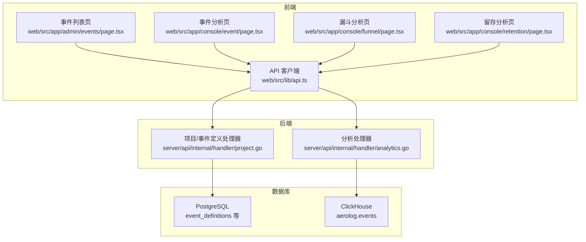
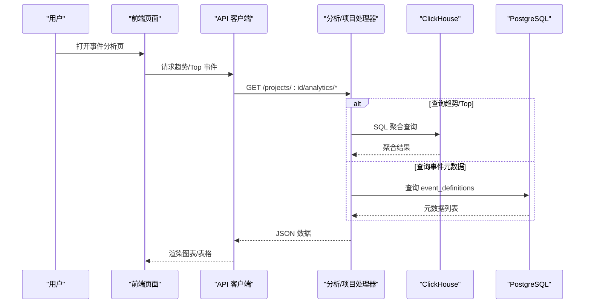
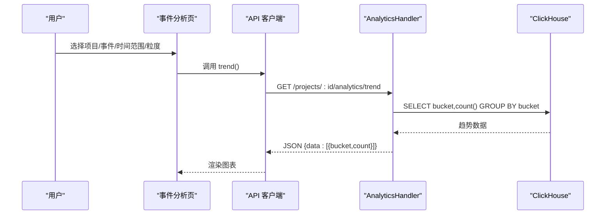
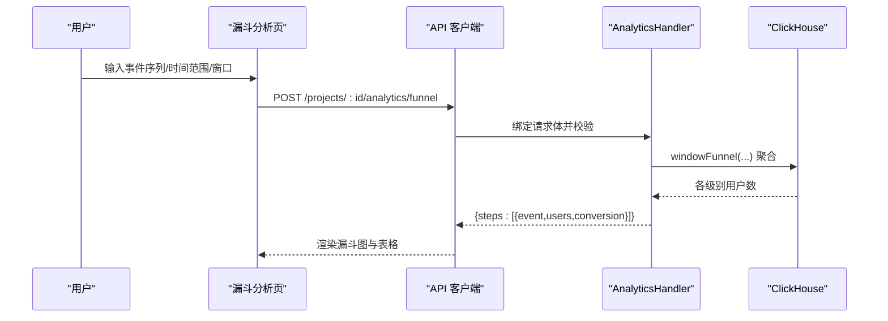
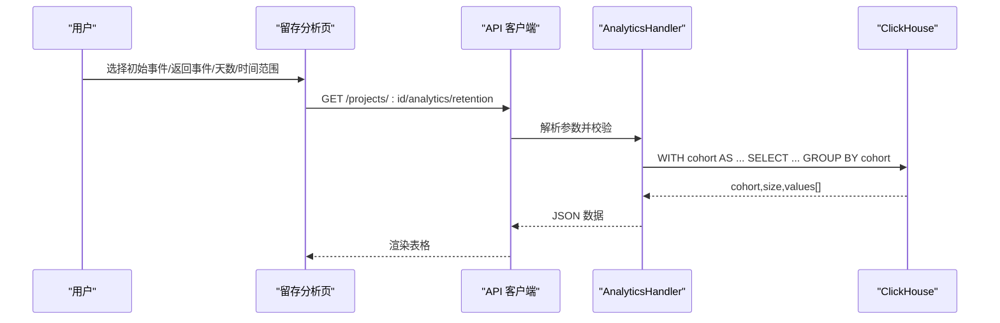
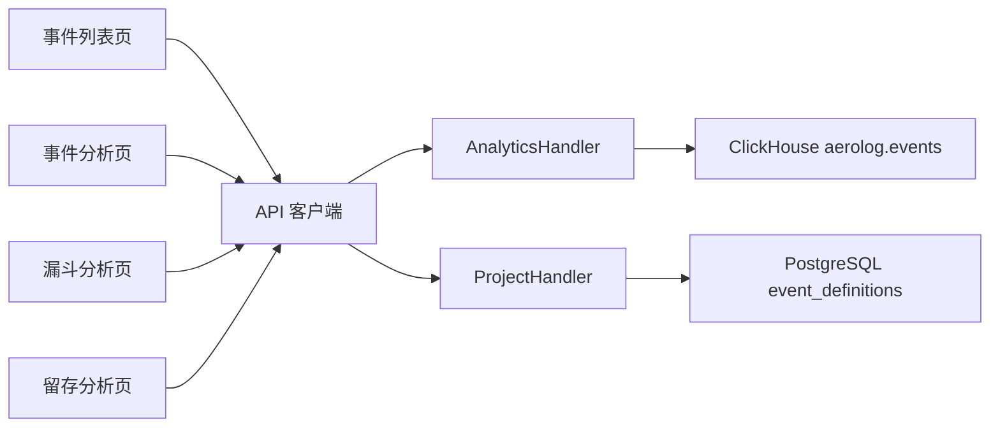

# 事件分析功能

<cite>
**本文引用的文件**
- [web/src/app/admin/events/page.tsx](file://web/src/app/admin/events/page.tsx)
- [web/src/app/console/event/page.tsx](file://web/src/app/console/event/page.tsx)
- [web/src/app/console/funnel/page.tsx](file://web/src/app/console/funnel/page.tsx)
- [web/src/app/console/retention/page.tsx](file://web/src/app/console/retention/page.tsx)
- [web/src/lib/api.ts](file://web/src/lib/api.ts)
- [server/api/internal/handler/analytics.go](file://server/api/internal/handler/analytics.go)
- [server/api/internal/handler/project.go](file://server/api/internal/handler/project.go)
- [server/pkg/model/event.go](file://server/pkg/model/event.go)
- [deploy/init/clickhouse/01_schema.sql](file://deploy/init/clickhouse/01_schema.sql)
- [deploy/init/postgres/01_schema.sql](file://deploy/init/postgres/01_schema.sql)
- [docs/event.schema.json](file://docs/event.schema.json)
- [deploy/grafana/dashboards/aerolog-overview.json](file://deploy/grafana/dashboards/aerolog-overview.json)
</cite>

## 目录
1. [简介](#简介)
2. [项目结构](#项目结构)
3. [核心组件](#核心组件)
4. [架构总览](#架构总览)
5. [详细组件分析](#详细组件分析)
6. [依赖关系分析](#依赖关系分析)
7. [性能考量](#性能考量)
8. [故障排查指南](#故障排查指南)
9. [结论](#结论)
10. [附录](#附录)

## 简介
本文件面向 AeroLog 事件分析功能的使用者与维护者，系统性介绍事件列表页、事件分析页、漏斗分析页与留存分析页的界面设计与功能特性，并结合后端接口与数据库结构，解释事件趋势、Top 事件、漏斗分析、留存分析等能力的工作原理与最佳实践。同时补充事件标签管理与批量操作的建议方案，以及常见应用场景与实用技巧。

## 项目结构
前端采用 Next.js 应用，通过统一 API 客户端调用后端服务；后端由 Go 编写，提供事件分析相关的 REST 接口，并基于 ClickHouse 进行高性能聚合查询。数据库层面，PostgreSQL 存储项目与事件元数据，ClickHouse 存储事件明细与上下文字段，支持高吞吐与复杂分析。

图表来源
- [web/src/app/admin/events/page.tsx:1-89](file://web/src/app/admin/events/page.tsx#L1-L89)
- [web/src/app/console/event/page.tsx:1-104](file://web/src/app/console/event/page.tsx#L1-L104)
- [web/src/app/console/funnel/page.tsx:1-165](file://web/src/app/console/funnel/page.tsx#L1-L165)
- [web/src/app/console/retention/page.tsx:1-128](file://web/src/app/console/retention/page.tsx#L1-L128)
- [web/src/lib/api.ts:1-76](file://web/src/lib/api.ts#L1-L76)
- [server/api/internal/handler/analytics.go:1-304](file://server/api/internal/handler/analytics.go#L1-L304)
- [server/api/internal/handler/project.go:1-143](file://server/api/internal/handler/project.go#L1-L143)
- [deploy/init/clickhouse/01_schema.sql:1-42](file://deploy/init/clickhouse/01_schema.sql#L1-L42)
- [deploy/init/postgres/01_schema.sql:38-64](file://deploy/init/postgres/01_schema.sql#L38-L64)

章节来源
- [web/src/app/admin/events/page.tsx:1-89](file://web/src/app/admin/events/page.tsx#L1-L89)
- [web/src/app/console/event/page.tsx:1-104](file://web/src/app/console/event/page.tsx#L1-L104)
- [web/src/app/console/funnel/page.tsx:1-165](file://web/src/app/console/funnel/page.tsx#L1-L165)
- [web/src/app/console/retention/page.tsx:1-128](file://web/src/app/console/retention/page.tsx#L1-L128)
- [web/src/lib/api.ts:1-76](file://web/src/lib/api.ts#L1-L76)
- [server/api/internal/handler/analytics.go:1-304](file://server/api/internal/handler/analytics.go#L1-L304)
- [server/api/internal/handler/project.go:1-143](file://server/api/internal/handler/project.go#L1-L143)
- [deploy/init/clickhouse/01_schema.sql:1-42](file://deploy/init/clickhouse/01_schema.sql#L1-L42)
- [deploy/init/postgres/01_schema.sql:38-64](file://deploy/init/postgres/01_schema.sql#L38-L64)

## 核心组件
- 事件列表页：展示项目下的事件元数据，支持项目筛选，表格包含事件名、显示名、分类、描述、状态、首次出现、最近出现等字段。
- 事件分析页：提供事件趋势可视化，支持项目、事件、时间范围、粒度（小时/天）的选择，动态生成柱状图。
- 漏斗分析页：输入事件序列与时间窗口，计算各步骤用户数与转化率，支持可视化与表格展示。
- 留存分析页：以“初始事件”和“返回事件”为核心，统计不同自然日的返回比例，形成留存矩阵。
- API 客户端：封装统一的请求方法，负责与后端 API 交互，参数统一使用毫秒时间戳。
- 分析处理器：提供趋势、Top 事件、漏斗、留存等接口，底层查询基于 ClickHouse。
- 项目/事件定义处理器：提供项目列表与事件元数据列表接口，事件元数据存储于 PostgreSQL。

章节来源
- [web/src/app/admin/events/page.tsx:20-89](file://web/src/app/admin/events/page.tsx#L20-L89)
- [web/src/app/console/event/page.tsx:13-104](file://web/src/app/console/event/page.tsx#L13-L104)
- [web/src/app/console/funnel/page.tsx:30-165](file://web/src/app/console/funnel/page.tsx#L30-L165)
- [web/src/app/console/retention/page.tsx:17-128](file://web/src/app/console/retention/page.tsx#L17-L128)
- [web/src/lib/api.ts:33-75](file://web/src/lib/api.ts#L33-L75)
- [server/api/internal/handler/analytics.go:27-304](file://server/api/internal/handler/analytics.go#L27-L304)
- [server/api/internal/handler/project.go:29-134](file://server/api/internal/handler/project.go#L29-L134)

## 架构总览
前端通过 API 客户端发起请求，后端 Gin 路由将请求分发到对应处理器；分析类接口直接查询 ClickHouse 获取聚合结果；项目与事件元数据接口查询 PostgreSQL；ClickHouse 表 aerolog.events 存储事件明细与上下文字段，支持高维筛选与时间聚合。

图表来源
- [web/src/lib/api.ts:33-75](file://web/src/lib/api.ts#L33-L75)
- [server/api/internal/handler/analytics.go:27-112](file://server/api/internal/handler/analytics.go#L27-L112)
- [server/api/internal/handler/project.go:103-134](file://server/api/internal/handler/project.go#L103-L134)
- [deploy/init/clickhouse/01_schema.sql:6-42](file://deploy/init/clickhouse/01_schema.sql#L6-L42)
- [deploy/init/postgres/01_schema.sql:38-64](file://deploy/init/postgres/01_schema.sql#L38-L64)

## 详细组件分析

### 事件列表页面
- 功能特性
  - 项目筛选：从项目列表中选择目标项目，自动加载该项目的事件元数据。
  - 表格展示：事件名、显示名、分类、描述、状态（启用/禁用）、首次出现、最近出现。
  - 加载与空态：无项目时提示“暂无项目，请先在项目管理页面创建”。

- 数据来源与流程
  - 项目列表来自后端项目接口；事件元数据来自事件定义接口，查询 event_definitions 表。
  - 前端通过 React Query 缓存与懒加载优化体验。

- 使用建议
  - 事件状态用于快速识别活跃事件；首次/最近出现可用于评估事件生命周期。
  - 结合项目筛选，可在多项目场景下逐项核对事件定义。

章节来源
- [web/src/app/admin/events/page.tsx:20-89](file://web/src/app/admin/events/page.tsx#L20-L89)
- [server/api/internal/handler/project.go:103-134](file://server/api/internal/handler/project.go#L103-L134)
- [deploy/init/postgres/01_schema.sql:38-64](file://deploy/init/postgres/01_schema.sql#L38-L64)

### 事件分析页面
- 功能特性
  - 项目选择：切换项目后清空事件选择。
  - 事件选择：从 Top 事件中选择，支持搜索。
  - 时间范围：默认近七天，支持起止时间选择。
  - 趋势粒度：小时/天两种粒度切换。
  - 可视化：基于 ECharts 的柱状图展示事件计数随时间的变化。

- 后端接口与算法
  - 趋势接口：按小时或天进行时间桶聚合，返回时间桶与计数。
  - Top 事件接口：按事件分组统计事件总数与独立用户数。
  - ClickHouse 查询：使用时间区间过滤与分组聚合，支持毫秒时间戳。

- 使用建议
  - 小时粒度适合观察短期波动，天粒度适合观察长期趋势。
  - 配合时间范围选择，可对比活动前后或节假日效应。

图表来源
- [web/src/app/console/event/page.tsx:13-104](file://web/src/app/console/event/page.tsx#L13-L104)
- [web/src/lib/api.ts:45-51](file://web/src/lib/api.ts#L45-L51)
- [server/api/internal/handler/analytics.go:34-74](file://server/api/internal/handler/analytics.go#L34-L74)

章节来源
- [web/src/app/console/event/page.tsx:13-104](file://web/src/app/console/event/page.tsx#L13-L104)
- [web/src/lib/api.ts:38-51](file://web/src/lib/api.ts#L38-L51)
- [server/api/internal/handler/analytics.go:27-112](file://server/api/internal/handler/analytics.go#L27-L112)

### 漏斗分析页面
- 功能特性
  - 事件序列：选择 2-8 个事件作为漏斗步骤，按顺序排列。
  - 时间窗口：设置窗口秒数，默认 24 小时，决定后续步骤是否在窗口内触发。
  - 计算按钮：执行漏斗分析，返回每一步的用户数与转化率。
  - 可视化：漏斗图直观展示转化过程；表格列出每步用户数与转化率。

- 后端接口与算法
  - 漏斗接口：使用 ClickHouse windowFunnel 函数，按 distinct_id 在时间窗口内匹配事件序列，统计达到各级别的用户数。
  - 转化率：以首步用户数为基准，计算后续步骤的累计转化率。

- 使用建议
  - 步骤数量建议控制在 4-6 步以内，避免过长导致转化率过低。
  - 窗口时间应结合业务流程设定，如注册流程可设为 7 天。

图表来源
- [web/src/app/console/funnel/page.tsx:30-165](file://web/src/app/console/funnel/page.tsx#L30-L165)
- [web/src/lib/api.ts:52-59](file://web/src/lib/api.ts#L52-L59)
- [server/api/internal/handler/analytics.go:119-199](file://server/api/internal/handler/analytics.go#L119-L199)

章节来源
- [web/src/app/console/funnel/page.tsx:30-165](file://web/src/app/console/funnel/page.tsx#L30-L165)
- [web/src/lib/api.ts:52-59](file://web/src/lib/api.ts#L52-L59)
- [server/api/internal/handler/analytics.go:119-199](file://server/api/internal/handler/analytics.go#L119-L199)

### 留存分析页面
- 功能特性
  - 初始事件与返回事件：分别选择“首次发生”的事件与“返回发生”的事件。
  - 时间范围与天数：设置统计周期与留存天数（2-30 天）。
  - 结果表格：左侧固定“同期日”与“用户数”，后续列展示 Day0-DayN 的留存百分比。

- 后端接口与算法
  - 留存接口：以初始事件发生日期为 cohort，统计其后若干天内返回事件的用户占比。
  - ClickHouse 查询：使用 CTE 分别提取 cohort 用户与返回事件，按 cohort 与偏移天数聚合。

- 使用建议
  - 初期建议使用 7 天周期，观察短期回访情况。
  - 若业务存在明显自然日差异，可调整时间范围覆盖完整周期。

图表来源
- [web/src/app/console/retention/page.tsx:17-128](file://web/src/app/console/retention/page.tsx#L17-L128)
- [web/src/lib/api.ts:60-74](file://web/src/lib/api.ts#L60-L74)
- [server/api/internal/handler/analytics.go:201-283](file://server/api/internal/handler/analytics.go#L201-L283)

章节来源
- [web/src/app/console/retention/page.tsx:17-128](file://web/src/app/console/retention/page.tsx#L17-L128)
- [web/src/lib/api.ts:60-74](file://web/src/lib/api.ts#L60-L74)
- [server/api/internal/handler/analytics.go:201-283](file://server/api/internal/handler/analytics.go#L201-L283)

### 事件详情与属性、用户信息、时间线视图
- 事件详情页面当前未在仓库中提供具体实现文件。基于现有模型与数据库结构，事件详情可包含以下内容：
  - 事件属性：事件类型、事件名、时间戳、SDK 来源、用户标识（登录用户 ID、匿名 ID、设备/浏览器维度等）。
  - 用户信息：distinct_id 对应的用户画像（若已建立用户属性表），可结合用户维度进行交叉分析。
  - 时间线视图：按时间顺序展示同一 distinct_id 的事件序列，支持筛选与导出。

- 数据模型与约束
  - 事件模型包含类型、事件名、时间戳、用户标识与属性字段，详见事件 Schema。
  - ClickHouse 表 aerolog.events 包含丰富的上下文字段（平台、版本、地理、UA 等），便于多维分析。

- 建议实现要点
  - 详情页应支持按 distinct_id 或 user_id 进行检索与跳转。
  - 时间线视图建议支持分页与导出，避免一次性渲染过多数据。
  - 属性与用户信息需与用户画像模块联动，确保隐私合规。

章节来源
- [server/pkg/model/event.go:27-60](file://server/pkg/model/event.go#L27-L60)
- [docs/event.schema.json:1-57](file://docs/event.schema.json#L1-L57)
- [deploy/init/clickhouse/01_schema.sql:6-42](file://deploy/init/clickhouse/01_schema.sql#L6-L42)

### 事件对比、相关性分析与异常检测（高级功能）
- 事件对比
  - 可通过事件分析页的“事件”下拉框对比多个事件的趋势曲线，或在同一图表中叠加显示。
  - 建议增加“同比/环比”选项，辅助识别季节性与周期性变化。

- 相关性分析
  - 基于事件序列与时间窗口，结合漏斗分析的步骤组合，评估事件之间的先后关系与强弱关联。
  - 可扩展为“事件共现矩阵”或“滑动窗口相关系数”，但需注意数据量与性能。

- 异常检测
  - 基于趋势图的阈值报警（如环比突增/突降）与统计异常（3σ、箱线图异常点）。
  - 可引入机器学习方法（如孤立森林、Prophet 预测偏差）进行更稳健的异常识别。

说明：上述为概念性扩展建议，当前仓库未提供专门的异常检测与相关性分析实现。

### 事件标签管理与批量操作
- 标签管理
  - 事件标签可基于事件元数据表的描述字段或新增标签字段进行维护。
  - 建议在事件列表页增加“标签”列与筛选器，便于分组与检索。

- 批量操作
  - 支持批量启用/禁用事件、批量导出事件定义、批量重命名等。
  - 批量操作需配合后端接口与权限控制，确保操作安全与审计可追溯。

说明：标签与批量操作为功能增强建议，当前仓库未提供相应实现。

## 依赖关系分析

图表来源
- [web/src/lib/api.ts:33-75](file://web/src/lib/api.ts#L33-L75)
- [server/api/internal/handler/analytics.go:27-32](file://server/api/internal/handler/analytics.go#L27-L32)
- [server/api/internal/handler/project.go:29-33](file://server/api/internal/handler/project.go#L29-L33)
- [deploy/init/clickhouse/01_schema.sql:6-42](file://deploy/init/clickhouse/01_schema.sql#L6-L42)
- [deploy/init/postgres/01_schema.sql:38-64](file://deploy/init/postgres/01_schema.sql#L38-L64)

章节来源
- [web/src/lib/api.ts:33-75](file://web/src/lib/api.ts#L33-L75)
- [server/api/internal/handler/analytics.go:27-32](file://server/api/internal/handler/analytics.go#L27-L32)
- [server/api/internal/handler/project.go:29-33](file://server/api/internal/handler/project.go#L29-L33)

## 性能考量
- 查询性能
  - ClickHouse 表 aerolog.events 已按 project_id 与月份分区，ORDER BY 包含时间与去重键，有利于高效聚合与过滤。
  - 建议在高频查询维度上建立物化视图或宽表，减少复杂聚合的实时计算压力。

- 前端性能
  - 使用 React Query 的缓存与懒加载，避免重复请求。
  - 图表渲染建议限制数据点数量，或采用分页/分段加载。

- 监控与告警
  - Grafana 面板展示了收集器 QPS、拒绝率、延迟与消费者速率等关键指标，有助于定位性能瓶颈。

章节来源
- [deploy/init/clickhouse/01_schema.sql:6-42](file://deploy/init/clickhouse/01_schema.sql#L6-L42)
- [deploy/grafana/dashboards/aerolog-overview.json:1-131](file://deploy/grafana/dashboards/aerolog-overview.json#L1-L131)

## 故障排查指南
- 无法加载事件列表
  - 检查项目是否存在且有事件元数据；确认后端项目接口与事件定义接口可用。
  - 查看前端网络面板与后端日志，确认数据库连接正常。

- 趋势/Top 事件为空
  - 核对时间范围是否合理，确保 from/to 参数正确传递（毫秒级）。
  - 检查 ClickHouse 中 aerolog.events 是否存在对应 project_id 的数据。

- 漏斗/留存计算错误
  - 确认事件序列长度在 2-8 之间，窗口秒数大于 0。
  - 检查初始事件与返回事件是否存在于 Top 事件结果中。

- 前端请求失败
  - 确认 NEXT_PUBLIC_API_BASE 环境变量配置正确，API 客户端请求头与路径格式符合后端规范。

章节来源
- [web/src/lib/api.ts:33-75](file://web/src/lib/api.ts#L33-L75)
- [server/api/internal/handler/analytics.go:119-199](file://server/api/internal/handler/analytics.go#L119-L199)
- [server/api/internal/handler/analytics.go:201-283](file://server/api/internal/handler/analytics.go#L201-L283)

## 结论
AeroLog 的事件分析体系以清晰的前端页面与强大的 ClickHouse 聚合能力为基础，覆盖了事件列表、趋势分析、漏斗分析与留存分析等核心场景。通过合理的参数配置与数据模型，用户可以高效地洞察事件行为、评估业务流程与用户回访情况。建议在现有基础上逐步完善事件标签管理、批量操作与高级分析能力，以满足更复杂的运营与产品需求。

## 附录
- 事件 Schema 与字段说明可参考事件 Schema 文件，明确事件类型、时间戳、用户标识与属性结构。
- ClickHouse 与 PostgreSQL 的建表语句提供了事件明细与元数据的存储结构，是理解查询逻辑与优化的关键依据。

章节来源
- [docs/event.schema.json:1-57](file://docs/event.schema.json#L1-L57)
- [deploy/init/clickhouse/01_schema.sql:6-42](file://deploy/init/clickhouse/01_schema.sql#L6-L42)
- [deploy/init/postgres/01_schema.sql:38-64](file://deploy/init/postgres/01_schema.sql#L38-L64)