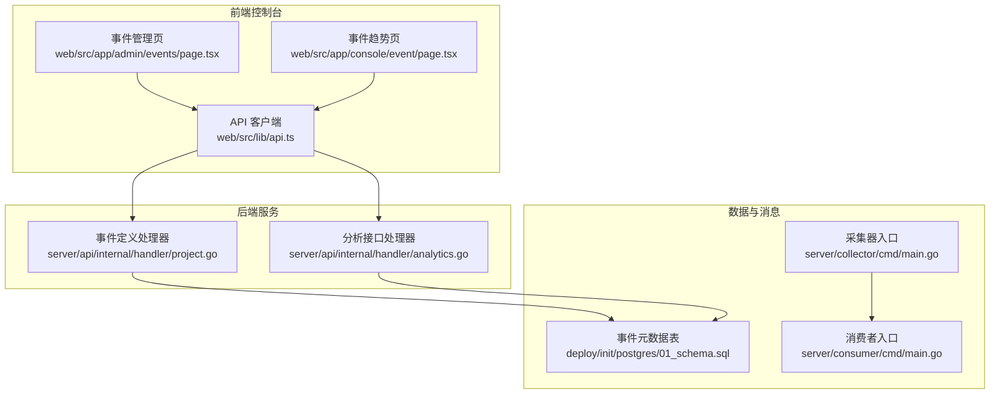
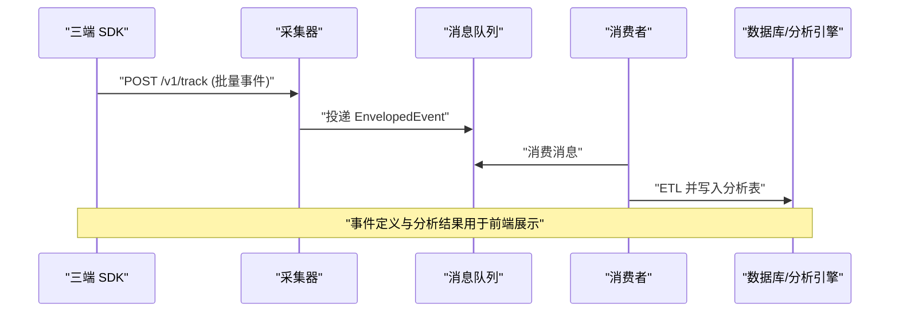
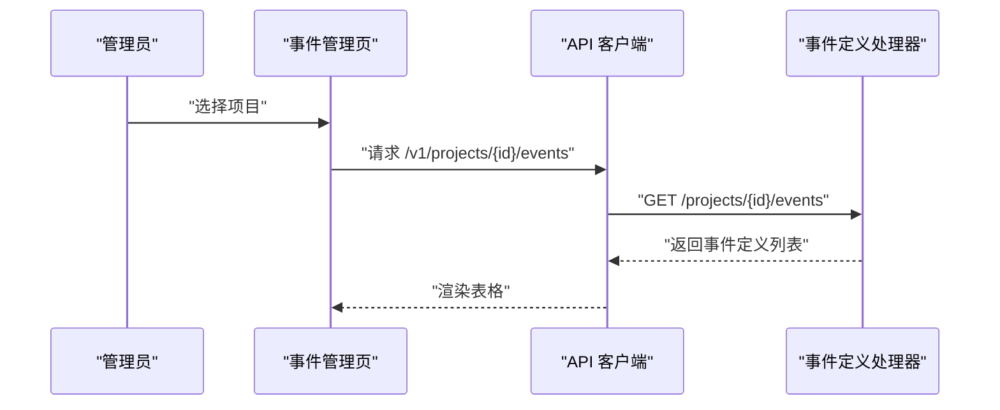
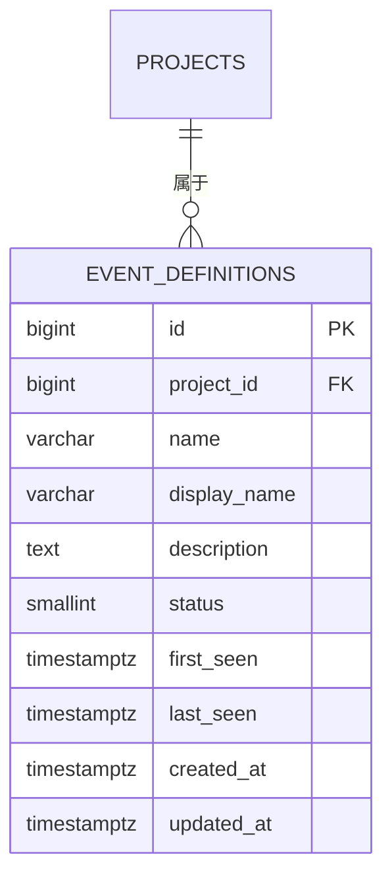
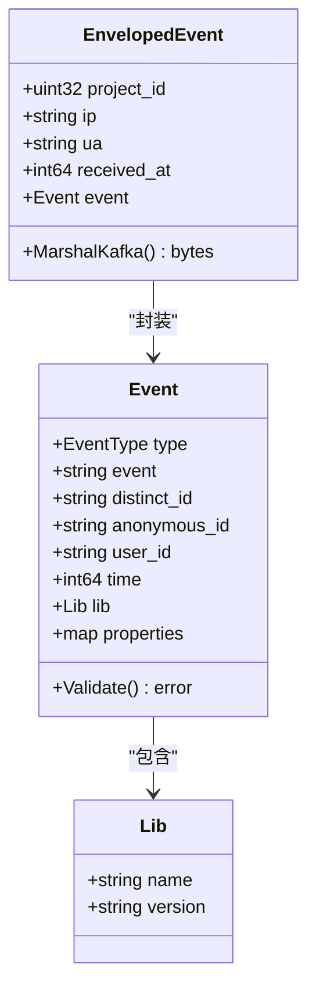
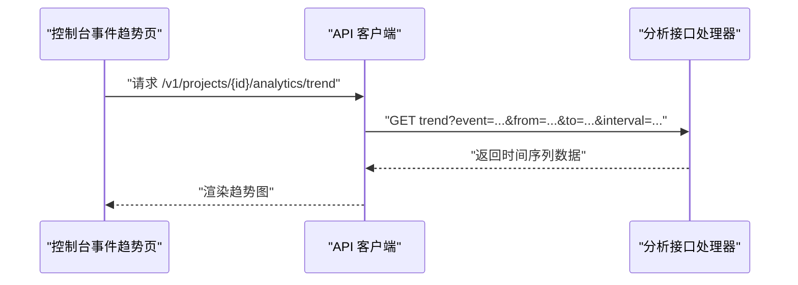
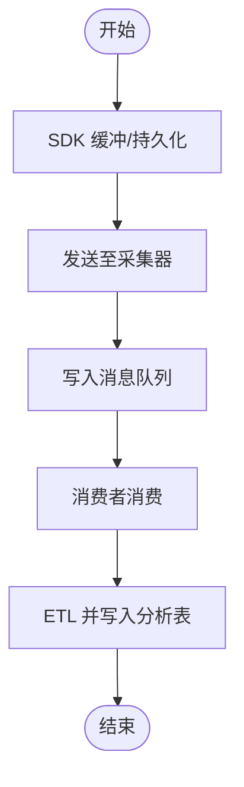
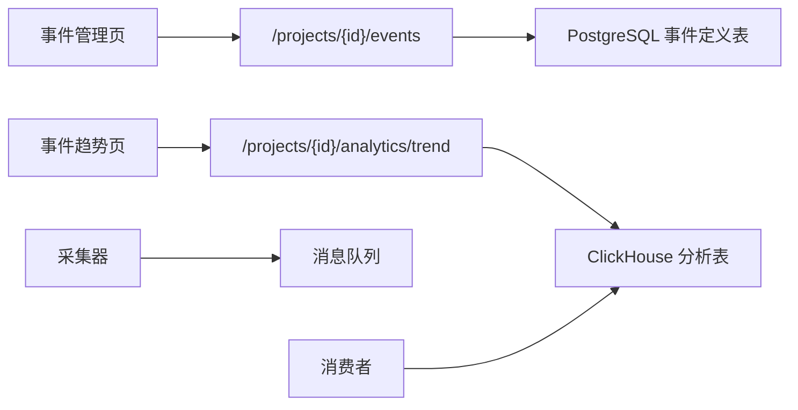

# 事件管理功能

<cite>
**本文引用的文件**
- [web/src/app/admin/events/page.tsx](file://web/src/app/admin/events/page.tsx)
- [server/api/internal/handler/project.go](file://server/api/internal/handler/project.go)
- [deploy/init/postgres/01_schema.sql](file://deploy/init/postgres/01_schema.sql)
- [web/src/lib/api.ts](file://web/src/lib/api.ts)
- [server/pkg/model/event.go](file://server/pkg/model/event.go)
- [docs/event.schema.json](file://docs/event.schema.json)
- [sdk/web/src/types.ts](file://sdk/web/src/types.ts)
- [sdk/android/aerolog/src/main/java/dev/aerolog/sdk/AeroLog.kt](file://sdk/android/aerolog/src/main/java/dev/aerolog/sdk/AeroLog.kt)
- [server/collector/cmd/main.go](file://server/collector/cmd/main.go)
- [server/consumer/cmd/main.go](file://server/consumer/cmd/main.go)
- [server/api/internal/handler/analytics.go](file://server/api/internal/handler/analytics.go)
- [web/src/app/console/event/page.tsx](file://web/src/app/console/event/page.tsx)
</cite>

## 目录
1. [简介](#简介)
2. [项目结构](#项目结构)
3. [核心组件](#核心组件)
4. [架构总览](#架构总览)
5. [详细组件分析](#详细组件分析)
6. [依赖分析](#依赖分析)
7. [性能考虑](#性能考虑)
8. [故障排查指南](#故障排查指南)
9. [结论](#结论)
10. [附录](#附录)

## 简介
本文件面向使用者与运维人员，系统性介绍 AeroLog 的“事件管理”能力，覆盖以下方面：
- 事件管理页面的界面与功能特性：事件分类、命名规范、批量操作支持现状
- 事件定义流程：事件类型设置、属性配置与验证规则
- 事件监控功能：实时统计、异常告警与质量评估
- 事件模板与标准化管理：基于统一 Schema 的标准化实践
- 最佳实践与常见问题解决方案

## 项目结构
事件管理功能涉及前端 Web 控制台、API 服务、采集器、消费者与数据库 Schema。下图展示与事件管理直接相关的模块与交互。

图表来源
- [web/src/app/admin/events/page.tsx:1-89](file://web/src/app/admin/events/page.tsx#L1-L89)
- [web/src/app/console/event/page.tsx:44-59](file://web/src/app/console/event/page.tsx#L44-L59)
- [web/src/lib/api.ts:1-107](file://web/src/lib/api.ts#L1-L107)
- [server/api/internal/handler/project.go:103-134](file://server/api/internal/handler/project.go#L103-L134)
- [server/api/internal/handler/analytics.go:1-304](file://server/api/internal/handler/analytics.go#L1-L304)
- [deploy/init/postgres/01_schema.sql:38-51](file://deploy/init/postgres/01_schema.sql#L38-L51)
- [server/collector/cmd/main.go:1-74](file://server/collector/cmd/main.go#L1-L74)
- [server/consumer/cmd/main.go:1-55](file://server/consumer/cmd/main.go#L1-L55)

章节来源
- [web/src/app/admin/events/page.tsx:1-89](file://web/src/app/admin/events/page.tsx#L1-L89)
- [web/src/lib/api.ts:1-107](file://web/src/lib/api.ts#L1-L107)
- [server/api/internal/handler/project.go:103-134](file://server/api/internal/handler/project.go#L103-L134)
- [server/api/internal/handler/analytics.go:1-304](file://server/api/internal/handler/analytics.go#L1-L304)
- [deploy/init/postgres/01_schema.sql:38-51](file://deploy/init/postgres/01_schema.sql#L38-L51)
- [server/collector/cmd/main.go:1-74](file://server/collector/cmd/main.go#L1-L74)
- [server/consumer/cmd/main.go:1-55](file://server/consumer/cmd/main.go#L1-L55)

## 核心组件
- 事件定义与查询
  - 后端通过事件定义处理器提供事件列表查询接口，返回事件名、显示名、描述、状态及首次/最近出现时间等元数据。
  - 前端事件管理页基于该接口渲染表格，并支持项目筛选。
- 事件 Schema 与类型
  - 统一事件结构由服务端模型与 JSON Schema 定义，包含事件类型、事件名、标识符、时间戳、SDK 信息与自定义属性。
  - 三端 SDK（Web/Android/iOS）上报结构与 Schema 对齐。
- 分析与监控
  - 后端分析接口提供趋势、Top 事件、漏斗与留存等能力，前端控制台事件趋势页调用趋势接口进行可视化。
- 数据流
  - SDK 将事件写入本地存储或内存缓冲，周期性或达到阈值后发送至采集器；采集器写入消息队列，消费者从队列读取并落库/写入分析引擎。

章节来源
- [server/api/internal/handler/project.go:103-134](file://server/api/internal/handler/project.go#L103-L134)
- [web/src/app/admin/events/page.tsx:20-89](file://web/src/app/admin/events/page.tsx#L20-L89)
- [server/pkg/model/event.go:1-84](file://server/pkg/model/event.go#L1-L84)
- [docs/event.schema.json:1-58](file://docs/event.schema.json#L1-L58)
- [sdk/web/src/types.ts:1-47](file://sdk/web/src/types.ts#L1-L47)
- [server/api/internal/handler/analytics.go:34-112](file://server/api/internal/handler/analytics.go#L34-L112)
- [web/src/app/console/event/page.tsx:44-59](file://web/src/app/console/event/page.tsx#L44-L59)

## 架构总览
事件管理贯穿“采集—传输—存储—分析—展示”的全链路，如下图所示：

图表来源
- [server/collector/cmd/main.go:43-48](file://server/collector/cmd/main.go#L43-L48)
- [server/consumer/cmd/main.go:34-34](file://server/consumer/cmd/main.go#L34-L34)
- [server/pkg/model/event.go:62-74](file://server/pkg/model/event.go#L62-L74)

## 详细组件分析

### 事件管理页面（Admin）
- 功能概述
  - 支持项目筛选，加载当前项目下的事件定义列表。
  - 列表包含事件名、显示名、分类、描述、状态、首次出现、最近出现等字段。
- 交互流程
  - 初始化时拉取项目列表，若存在项目则默认选中首个项目。
  - 项目变更后触发事件列表查询，使用 Ant Design Table 渲染。
- 批量操作现状
  - 当前页面未提供批量启用/禁用、批量删除等操作按钮；如需批量操作，可在现有接口基础上扩展。

图表来源
- [web/src/app/admin/events/page.tsx:20-89](file://web/src/app/admin/events/page.tsx#L20-L89)
- [web/src/lib/api.ts:37-43](file://web/src/lib/api.ts#L37-L43)
- [server/api/internal/handler/project.go:103-134](file://server/api/internal/handler/project.go#L103-L134)

章节来源
- [web/src/app/admin/events/page.tsx:1-89](file://web/src/app/admin/events/page.tsx#L1-L89)
- [server/api/internal/handler/project.go:103-134](file://server/api/internal/handler/project.go#L103-L134)
- [web/src/lib/api.ts:37-43](file://web/src/lib/api.ts#L37-L43)

### 事件定义与命名规范
- 事件定义表结构
  - 包含项目关联、事件名、显示名、描述、状态、首次/最近出现时间等字段。
  - 事件名在项目内唯一，确保命名一致性。
- 命名建议
  - 使用语义化、稳定的事件名，避免频繁变更。
  - 与业务含义强相关的事件名更利于分析与检索。
- 状态管理
  - 事件状态用于控制是否参与分析或展示，可通过后端接口扩展启用/禁用能力。

图表来源
- [deploy/init/postgres/01_schema.sql:38-51](file://deploy/init/postgres/01_schema.sql#L38-L51)

章节来源
- [deploy/init/postgres/01_schema.sql:38-51](file://deploy/init/postgres/01_schema.sql#L38-L51)

### 事件 Schema 与类型
- 统一事件结构
  - 事件类型枚举：普通行为事件与用户属性操作类事件。
  - 字段约束：事件名长度限制、标识符长度限制、时间戳要求等。
- 三端对齐
  - Web/Android/iOS SDK 的事件结构与 JSON Schema 保持一致，确保上报数据规范化。
- 属性约定
  - 以特定前缀开头的属性为预置属性，用于平台侧自动采集。

图表来源
- [server/pkg/model/event.go:27-83](file://server/pkg/model/event.go#L27-L83)
- [docs/event.schema.json:1-58](file://docs/event.schema.json#L1-L58)
- [sdk/web/src/types.ts:16-25](file://sdk/web/src/types.ts#L16-L25)

章节来源
- [server/pkg/model/event.go:1-84](file://server/pkg/model/event.go#L1-L84)
- [docs/event.schema.json:1-58](file://docs/event.schema.json#L1-L58)
- [sdk/web/src/types.ts:1-47](file://sdk/web/src/types.ts#L1-L47)

### 事件监控与分析
- 实时统计
  - 趋势接口支持按时间桶聚合事件数量，支持小时/天粒度。
  - Top 事件接口统计事件总量与独立用户数，辅助识别热点事件。
- 漏斗与留存
  - 漏斗接口支持多步转化分析，按窗口函数统计各阶段用户数与转化率。
  - 留存接口以初始事件日期为 cohort，统计后续若干天的返回情况。
- 前端集成
  - 控制台事件趋势页调用趋势接口，将结果渲染为柱状图。

图表来源
- [web/src/app/console/event/page.tsx:44-59](file://web/src/app/console/event/page.tsx#L44-L59)
- [web/src/lib/api.ts:57-69](file://web/src/lib/api.ts#L57-L69)
- [server/api/internal/handler/analytics.go:34-74](file://server/api/internal/handler/analytics.go#L34-L74)

章节来源
- [server/api/internal/handler/analytics.go:1-304](file://server/api/internal/handler/analytics.go#L1-L304)
- [web/src/lib/api.ts:45-105](file://web/src/lib/api.ts#L45-L105)
- [web/src/app/console/event/page.tsx:44-59](file://web/src/app/console/event/page.tsx#L44-L59)

### 事件采集与传输
- 采集器
  - 接收 SDK 批量上报，写入消息队列，同时暴露指标服务。
- 消费者
  - 从消息队列消费事件，执行 ETL 并写入分析引擎，同时暴露指标服务。
- 数据落盘
  - 事件定义与分析数据均依赖数据库/分析引擎，确保查询与统计可用。

图表来源
- [server/collector/cmd/main.go:43-48](file://server/collector/cmd/main.go#L43-L48)
- [server/consumer/cmd/main.go:34-34](file://server/consumer/cmd/main.go#L34-L34)
- [server/pkg/model/event.go:62-74](file://server/pkg/model/event.go#L62-L74)

章节来源
- [server/collector/cmd/main.go:1-74](file://server/collector/cmd/main.go#L1-L74)
- [server/consumer/cmd/main.go:1-55](file://server/consumer/cmd/main.go#L1-L55)
- [server/pkg/model/event.go:1-84](file://server/pkg/model/event.go#L1-L84)

## 依赖分析
- 前端依赖
  - 事件管理页依赖项目列表与事件定义查询接口；控制台事件趋势页依赖趋势接口。
- 后端依赖
  - 事件定义处理器依赖 PostgreSQL；分析接口处理器依赖 ClickHouse。
- 数据库依赖
  - 事件定义表与项目表存在外键关系，保证数据一致性。
- SDK 依赖
  - Android SDK 在应用生命周期与活动回调中自动埋点，具备本地持久化与周期刷新能力。

图表来源
- [web/src/app/admin/events/page.tsx:20-89](file://web/src/app/admin/events/page.tsx#L20-L89)
- [web/src/app/console/event/page.tsx:44-59](file://web/src/app/console/event/page.tsx#L44-L59)
- [web/src/lib/api.ts:37-105](file://web/src/lib/api.ts#L37-L105)
- [server/api/internal/handler/project.go:103-134](file://server/api/internal/handler/project.go#L103-L134)
- [server/api/internal/handler/analytics.go:1-304](file://server/api/internal/handler/analytics.go#L1-L304)
- [deploy/init/postgres/01_schema.sql:38-51](file://deploy/init/postgres/01_schema.sql#L38-L51)
- [server/collector/cmd/main.go:43-48](file://server/collector/cmd/main.go#L43-L48)
- [server/consumer/cmd/main.go:34-34](file://server/consumer/cmd/main.go#L34-L34)

章节来源
- [web/src/lib/api.ts:1-107](file://web/src/lib/api.ts#L1-L107)
- [server/api/internal/handler/project.go:103-134](file://server/api/internal/handler/project.go#L103-L134)
- [server/api/internal/handler/analytics.go:1-304](file://server/api/internal/handler/analytics.go#L1-L304)
- [deploy/init/postgres/01_schema.sql:38-51](file://deploy/init/postgres/01_schema.sql#L38-L51)
- [server/collector/cmd/main.go:1-74](file://server/collector/cmd/main.go#L1-L74)
- [server/consumer/cmd/main.go:1-55](file://server/consumer/cmd/main.go#L1-L55)

## 性能考虑
- 上报与缓冲
  - SDK 支持批量大小与刷新间隔配置，减少网络开销；Android SDK 具备本地持久化与周期刷新，提升稳定性。
- 查询优化
  - 分析接口支持时间范围与聚合粒度参数，建议按需缩小时间窗口与合理设置粒度。
- 存储与索引
  - 事件定义表按项目+事件名建立唯一索引，保障唯一性与查询效率。
- 并发与吞吐
  - 采集器与消费者分别负责高并发写入与消费，建议根据流量调整批次大小与并发度。

## 故障排查指南
- 事件无法出现在事件管理页
  - 检查项目筛选是否正确，确认已创建项目且事件定义已入库。
  - 核对事件名是否符合命名规范（长度与字符），避免因校验失败导致入库异常。
- 趋势/Top 事件为空
  - 确认时间范围参数是否合理，检查事件是否在目标时间范围内产生。
  - 若使用控制台事件趋势页，确认已选择项目与事件。
- Android 自动埋点无效
  - 确认初始化配置已开启自动埋点选项，检查应用生命周期与活动回调注册逻辑。
- 上报失败或延迟
  - 检查 SDK 的服务器地址与 Token 配置，确认网络连通性与服务端可达性。
  - 关注 SDK 的调试日志输出，定位失败原因。

章节来源
- [web/src/app/admin/events/page.tsx:20-89](file://web/src/app/admin/events/page.tsx#L20-L89)
- [web/src/app/console/event/page.tsx:44-59](file://web/src/app/console/event/page.tsx#L44-L59)
- [sdk/android/aerolog/src/main/java/dev/aerolog/sdk/AeroLog.kt:59-80](file://sdk/android/aerolog/src/main/java/dev/aerolog/sdk/AeroLog.kt#L59-L80)
- [server/pkg/model/event.go:39-60](file://server/pkg/model/event.go#L39-L60)

## 结论
AeroLog 的事件管理功能以统一 Schema 为基础，结合前端控制台与后端分析接口，实现了从事件定义、采集、传输、存储到可视化的完整闭环。当前页面支持事件列表查看与项目筛选，建议在后续版本中补充批量操作能力，并强化事件模板与标准化管理，以进一步提升团队协作效率与数据质量。

## 附录

### 事件类型与属性配置要点
- 事件类型
  - 普通行为事件与用户属性操作类事件，前者用于行为追踪，后者用于用户画像维护。
- 属性配置
  - 自定义属性与预置属性并存，建议遵循命名规范，避免与预置属性冲突。
- 验证规则
  - 服务端与 SDK 均进行基础字段校验，确保事件结构合法与长度合规。

章节来源
- [server/pkg/model/event.go:39-60](file://server/pkg/model/event.go#L39-L60)
- [docs/event.schema.json:10-55](file://docs/event.schema.json#L10-L55)
- [sdk/web/src/types.ts:3-25](file://sdk/web/src/types.ts#L3-L25)

### 事件模板与标准化管理建议
- 模板化
  - 建议为常见业务场景（如支付、注册、浏览）提供事件模板，统一事件名、显示名与关键属性。
- 标准化
  - 强制事件命名规范与属性命名规范，避免歧义；定期清理废弃事件，保持事件集合整洁。
- 版本演进
  - 对于需要演进的事件，建议新增事件并保留旧事件一段时间，确保历史数据可追溯。

### 最佳实践
- 命名规范
  - 使用清晰、稳定的事件名，避免频繁变更；与业务语义强相关。
- 属性设计
  - 明确关键属性与可选属性，避免过度冗余；对敏感属性进行脱敏处理。
- 监控与告警
  - 建立事件缺失、异常波动等告警机制，结合趋势与 Top 事件接口进行自动化监控。
- 性能优化
  - 合理设置 SDK 批量大小与刷新间隔，缩短时间窗口，提高查询效率。