# 实时分析功能

<cite>
**本文档引用的文件**
- [web/src/app/console/realtime/page.tsx](file://web/src/app/console/realtime/page.tsx)
- [server/api/internal/handler/analytics.go](file://server/api/internal/handler/analytics.go)
- [server/consumer/internal/chsink/sink.go](file://server/consumer/internal/chsink/sink.go)
- [sdk/web/src/index.ts](file://sdk/web/src/index.ts)
- [server/pkg/model/event.go](file://server/pkg/model/event.go)
- [server/collector/cmd/main.go](file://server/collector/cmd/main.go)
- [server/consumer/cmd/main.go](file://server/consumer/cmd/main.go)
- [web/src/lib/api.ts](file://web/src/lib/api.ts)
- [deploy/docker-compose.yml](file://deploy/docker-compose.yml)
- [server/consumer/internal/worker/worker.go](file://server/consumer/internal/worker/worker.go)
- [server/collector/internal/handler/track.go](file://server/collector/internal/handler/track.go)
- [server/consumer/internal/config/config.go](file://server/consumer/internal/config/config.go)
- [server/api/internal/config/config.go](file://server/api/internal/config/config.go)
- [sdk/web/src/storage.ts](file://sdk/web/src/storage.ts)
- [server/consumer/internal/etl/etl.go](file://server/consumer/internal/etl/etl.go)
- [web/src/features/analytics/analytics-ui.tsx](file://web/src/features/analytics/analytics-ui.tsx)
</cite>

## 更新摘要
**所做更改**
- 新增事件和属性选择功能，提供更精细的实时数据可视化
- 扩展实时分析页面的交互能力，支持事件筛选和参数钻取
- 增强属性值查询接口，支持动态参数分析
- 完善实时数据展示组件，提供事件参数详情面板

## 目录
1. [简介](#简介)
2. [项目结构](#项目结构)
3. [核心组件](#核心组件)
4. [架构概览](#架构概览)
5. [详细组件分析](#详细组件分析)
6. [依赖关系分析](#依赖关系分析)
7. [性能考虑](#性能考虑)
8. [故障排除指南](#故障排除指南)
9. [结论](#结论)

## 简介

AeroLog 是一个实时事件分析系统，提供从事件采集、传输、存储到分析展示的完整解决方案。该系统采用现代微服务架构，支持高并发实时数据处理，能够满足企业级实时分析需求。

系统的核心特性包括：
- 实时事件采集与传输
- 高性能数据存储与查询
- 多维度数据分析功能
- 用户友好的可视化界面
- 完善的错误处理与监控机制
- **新增事件和属性选择能力**，提供更精细的实时数据可视化和参数分析

## 项目结构

AeroLog 采用模块化的项目结构，主要包含以下核心模块：

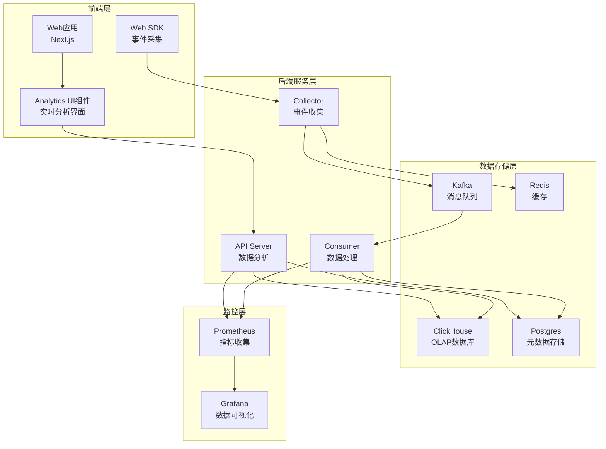

**图表来源**
- [deploy/docker-compose.yml:1-147](file://deploy/docker-compose.yml#L1-L147)
- [server/collector/cmd/main.go:1-26](file://server/collector/cmd/main.go#L1-L26)
- [server/consumer/cmd/main.go:1-26](file://server/consumer/cmd/main.go#L1-L26)

**章节来源**
- [deploy/docker-compose.yml:1-147](file://deploy/docker-compose.yml#L1-L147)
- [web/src/app/console/realtime/page.tsx:1-239](file://web/src/app/console/realtime/page.tsx#L1-L239)

## 核心组件

### 实时分析页面组件

实时分析功能的核心是前端的实时分析页面，该页面提供了直观的实时数据展示界面和事件参数钻取功能：

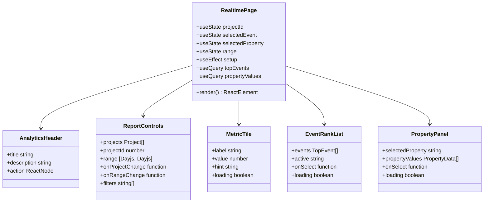

**图表来源**
- [web/src/app/console/realtime/page.tsx:21-239](file://web/src/app/console/realtime/page.tsx#L21-L239)

### 事件采集SDK

Web SDK 实现了完整的事件采集功能，支持多种上报策略：

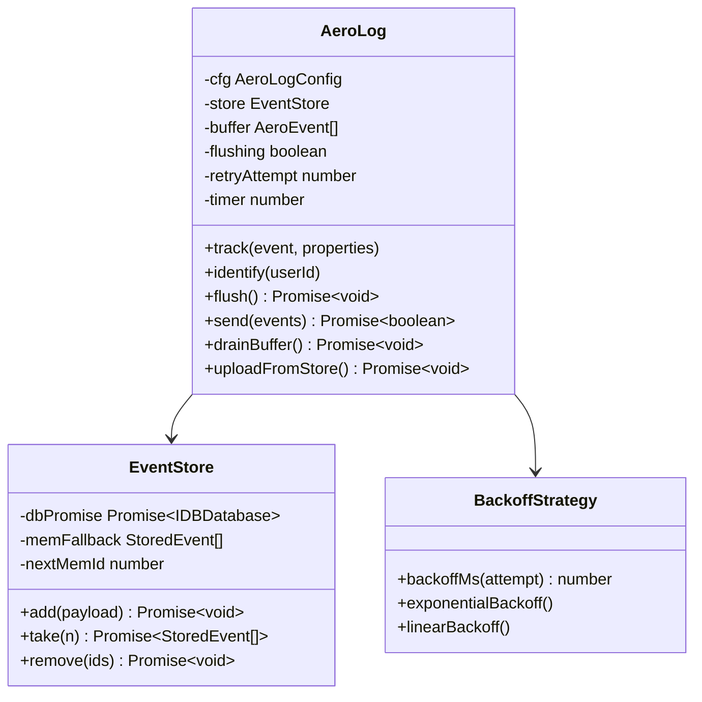

**图表来源**
- [sdk/web/src/index.ts:16-307](file://sdk/web/src/index.ts#L16-L307)
- [sdk/web/src/storage.ts:16-141](file://sdk/web/src/storage.ts#L16-L141)

**章节来源**
- [web/src/app/console/realtime/page.tsx:1-239](file://web/src/app/console/realtime/page.tsx#L1-L239)
- [sdk/web/src/index.ts:1-307](file://sdk/web/src/index.ts#L1-L307)
- [sdk/web/src/storage.ts:1-141](file://sdk/web/src/storage.ts#L1-L141)

## 架构概览

AeroLog 采用事件驱动的实时数据处理架构，整个系统按照数据流向可以分为以下几个阶段：

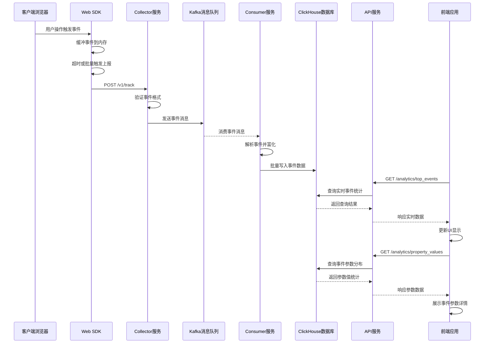

**图表来源**
- [server/collector/internal/handler/track.go:60-133](file://server/collector/internal/handler/track.go#L60-L133)
- [server/consumer/internal/worker/worker.go:94-156](file://server/consumer/internal/worker/worker.go#L94-L156)
- [server/api/internal/handler/analytics.go:76-112](file://server/api/internal/handler/analytics.go#L76-L112)
- [server/api/internal/handler/analytics.go:118-191](file://server/api/internal/handler/analytics.go#L118-L191)

**章节来源**
- [server/collector/internal/handler/track.go:1-211](file://server/collector/internal/handler/track.go#L1-L211)
- [server/consumer/internal/worker/worker.go:1-211](file://server/consumer/internal/worker/worker.go#L1-L211)
- [server/api/internal/handler/analytics.go:1-678](file://server/api/internal/handler/analytics.go#L1-L678)

## 详细组件分析

### 实时数据查询流程

实时分析功能的核心是实时数据查询，该流程确保用户能够获得最新的事件统计数据和事件参数详情：

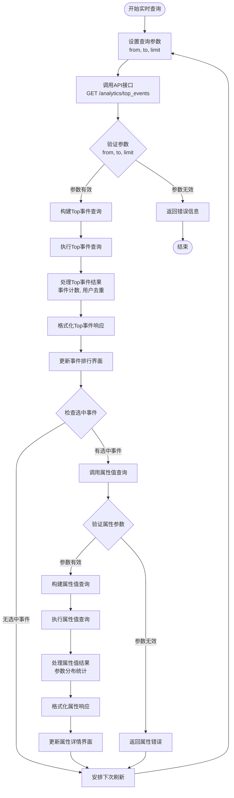

**图表来源**
- [web/src/app/console/realtime/page.tsx:41-76](file://web/src/app/console/realtime/page.tsx#L41-L76)
- [web/src/lib/api.ts:113-124](file://web/src/lib/api.ts#L113-L124)
- [server/api/internal/handler/analytics.go:76-112](file://server/api/internal/handler/analytics.go#L76-L112)
- [server/api/internal/handler/analytics.go:118-191](file://server/api/internal/handler/analytics.go#L118-L191)

### 事件采集与上报机制

Web SDK 实现了多阶段的事件上报机制，确保数据的可靠传输：

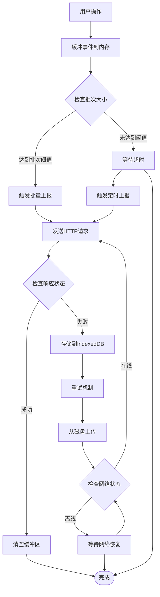

**图表来源**
- [sdk/web/src/index.ts:116-145](file://sdk/web/src/index.ts#L116-L145)
- [sdk/web/src/storage.ts:46-94](file://sdk/web/src/storage.ts#L46-L94)

**章节来源**
- [sdk/web/src/index.ts:1-307](file://sdk/web/src/index.ts#L1-L307)
- [sdk/web/src/storage.ts:1-141](file://sdk/web/src/storage.ts#L1-L141)

### 数据处理与存储流程

Consumer 服务负责从 Kafka 消费事件并进行数据处理和存储：

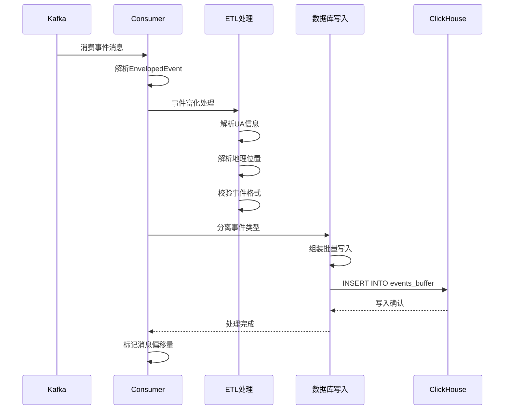

**图表来源**
- [server/consumer/internal/worker/worker.go:158-192](file://server/consumer/internal/worker/worker.go#L158-L192)
- [server/consumer/internal/chsink/sink.go:49-107](file://server/consumer/internal/chsink/sink.go#L49-L107)
- [server/consumer/internal/etl/etl.go:29-89](file://server/consumer/internal/etl/etl.go#L29-L89)

**章节来源**
- [server/consumer/internal/worker/worker.go:1-211](file://server/consumer/internal/worker/worker.go#L1-L211)
- [server/consumer/internal/chsink/sink.go:1-333](file://server/consumer/internal/chsink/sink.go#L1-L333)
- [server/consumer/internal/etl/etl.go:1-90](file://server/consumer/internal/etl/etl.go#L1-L90)

### 事件参数分析功能

**新增** 实时分析功能现在支持事件和属性的深度分析：

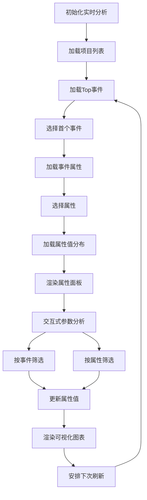

**图表来源**
- [web/src/app/console/realtime/page.tsx:57-76](file://web/src/app/console/realtime/page.tsx#L57-L76)
- [server/api/internal/handler/analytics.go:118-191](file://server/api/internal/handler/analytics.go#L118-L191)

**章节来源**
- [web/src/app/console/realtime/page.tsx:1-239](file://web/src/app/console/realtime/page.tsx#L1-L239)
- [server/api/internal/handler/analytics.go:118-191](file://server/api/internal/handler/analytics.go#L118-L191)

## 依赖关系分析

系统各组件之间的依赖关系如下所示：

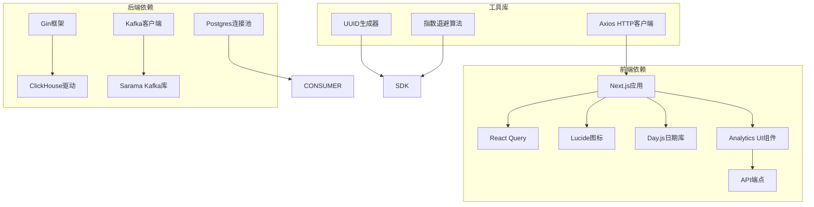

**图表来源**
- [web/package.json](file://web/package.json)
- [server/go.mod](file://server/go.mod)

**章节来源**
- [web/package.json](file://web/package.json)
- [server/go.mod](file://server/go.mod)

## 性能考虑

### 实时性优化

系统在多个层面实现了性能优化以确保实时性：

1. **前端轮询优化**：实时页面每15秒自动刷新，平衡了实时性和性能
2. **批量处理**：Consumer 服务采用批量处理策略，减少数据库写入开销
3. **索引优化**：ClickHouse 使用合适的分区和排序键优化查询性能
4. **缓存策略**：Redis 用于缓存热点数据和会话信息
5. **智能查询优化**：新增的属性查询支持按事件筛选，减少不必要的数据处理

### 存储优化

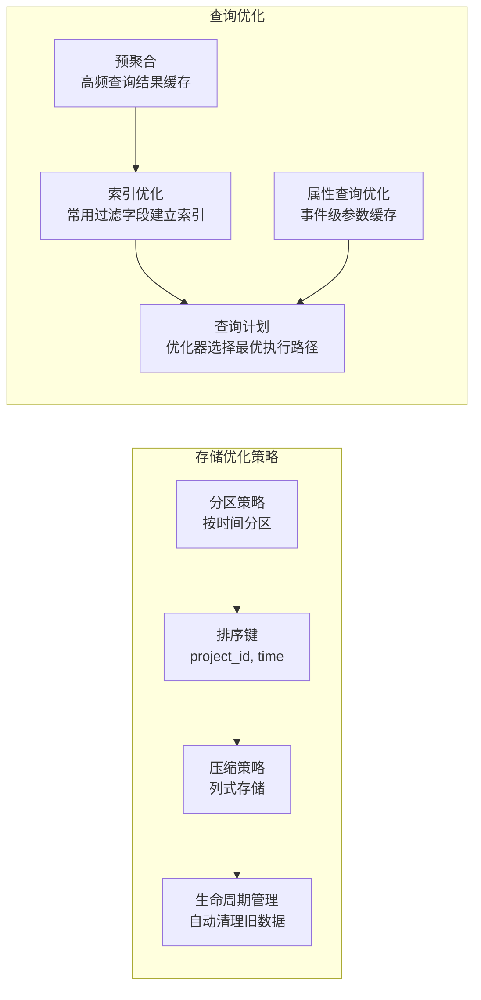

### 监控与告警

系统集成了完整的监控体系：

- **Prometheus 指标收集**：收集各个服务的关键性能指标
- **Grafana 可视化**：提供实时监控面板
- **日志聚合**：统一的日志收集和分析
- **健康检查**：自动化的服务健康状态检测

## 故障排除指南

### 常见问题诊断

1. **实时数据延迟**
   - 检查 Kafka 消费组状态
   - 验证 Consumer 服务运行状态
   - 监控 ClickHouse 写入性能

2. **事件丢失**
   - 检查 SDK 缓存机制
   - 验证 IndexedDB 存储状态
   - 查看 DLQ 错误队列

3. **查询性能问题**
   - 分析 ClickHouse 查询计划
   - 检查索引使用情况
   - 优化查询参数和时间范围

4. **事件参数分析异常**
   - 检查属性查询接口状态
   - 验证事件和属性参数的有效性
   - 监控属性值查询的执行性能

### 调试工具

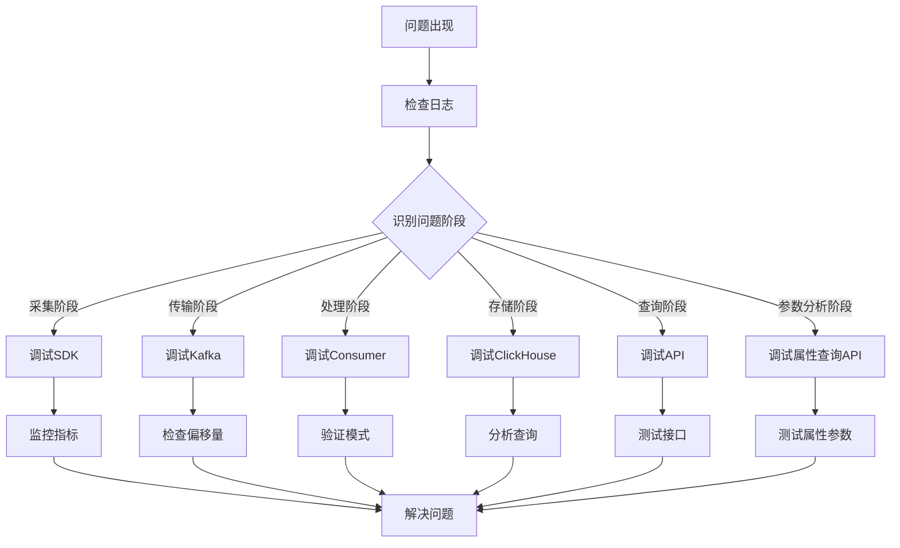

**章节来源**
- [server/consumer/internal/worker/worker.go:194-210](file://server/consumer/internal/worker/worker.go#L194-L210)
- [sdk/web/src/storage.ts:46-94](file://sdk/web/src/storage.ts#L46-L94)

## 结论

AeroLog 的实时分析功能通过精心设计的架构和优化策略，实现了高性能、高可用的实时数据处理能力。**最新更新**增强了系统的分析能力，新增了事件和属性选择功能，提供了更精细的实时数据可视化和参数分析能力。

系统的主要优势包括：

1. **完整的实时链路**：从事件采集到实时展示的全链路优化
2. **可靠的错误处理**：多层重试和降级机制确保数据可靠性
3. **灵活的扩展性**：模块化设计支持水平扩展
4. **完善的监控体系**：全面的指标收集和可视化展示
5. **精细化分析能力**：新增事件和属性选择功能，支持深入的数据洞察

**新增功能亮点**：
- **事件级分析**：用户可以选择特定事件进行深度分析
- **属性钻取**：支持按事件筛选的参数分布查询
- **实时参数面板**：动态展示事件参数的值分布和统计信息
- **智能筛选**：支持按事件和属性的组合筛选条件

未来可以进一步优化的方向包括：
- 引入更复杂的事件富化规则
- 实现更精细的缓存策略
- 增强异常检测和自动恢复能力
- 优化大规模数据场景下的查询性能
- 扩展更多类型的事件参数分析功能

通过持续的优化和改进，AeroLog 将能够更好地满足企业级实时分析的需求，为企业提供更强大的数据洞察能力和决策支持。