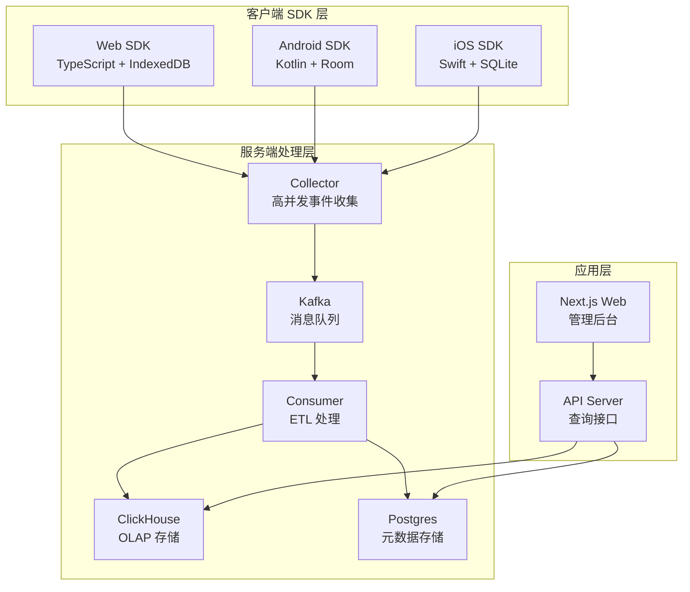
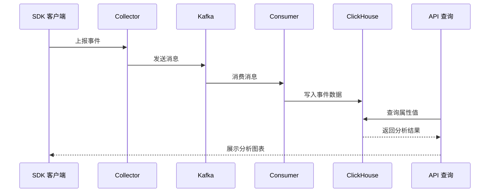
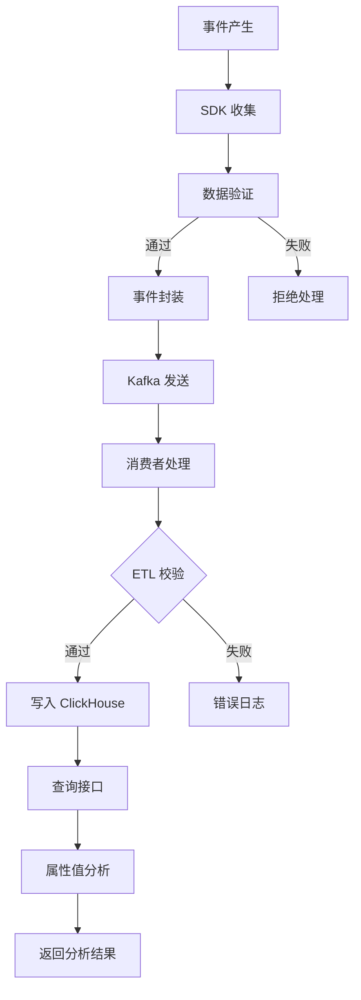
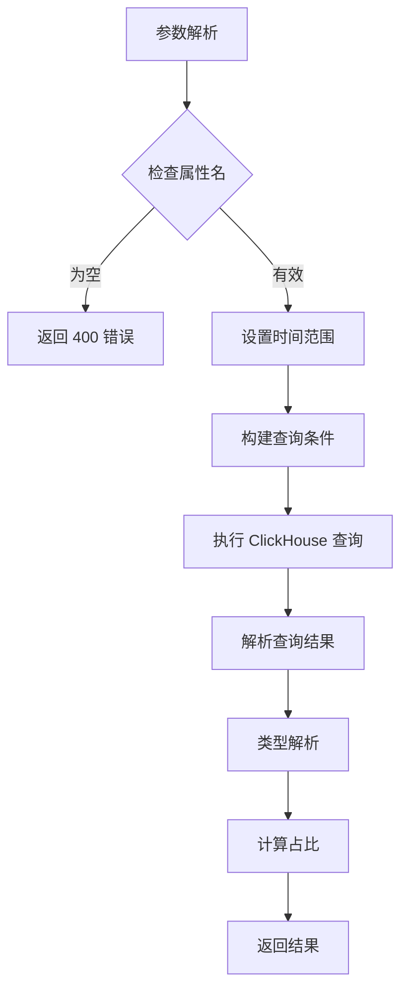
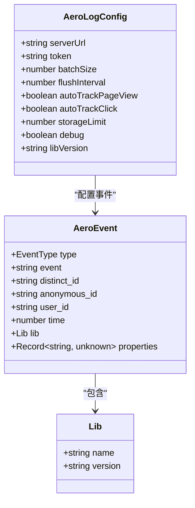
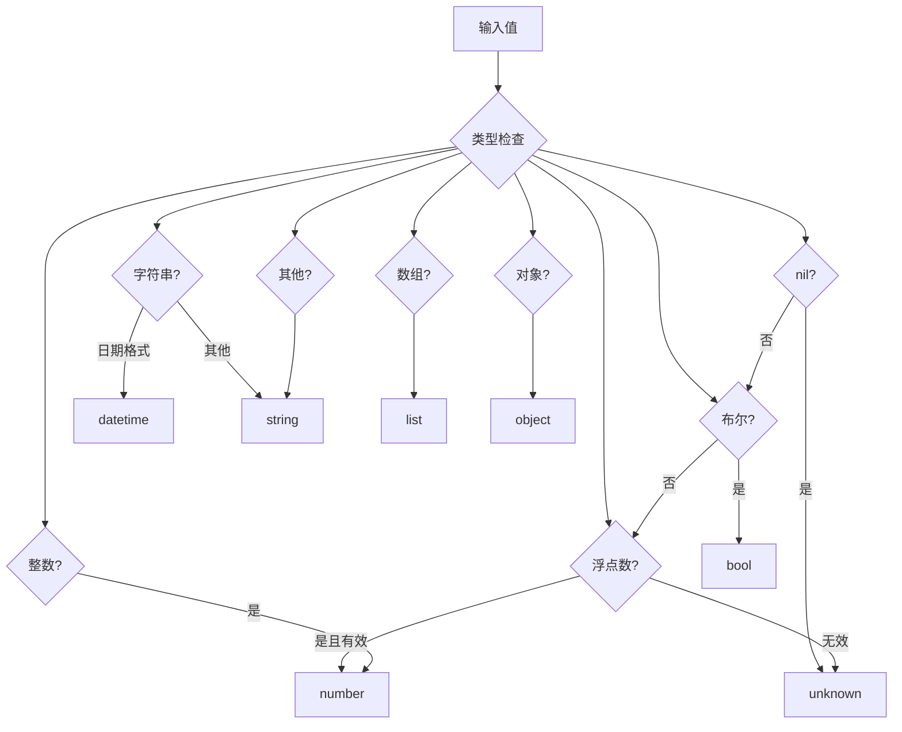
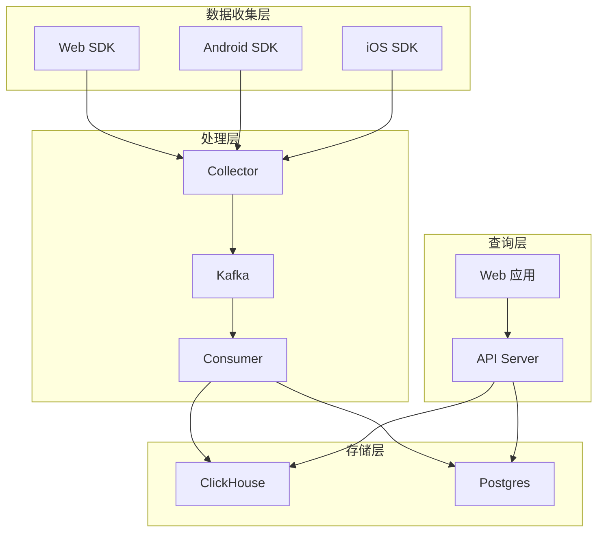
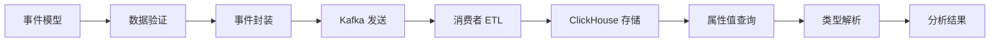
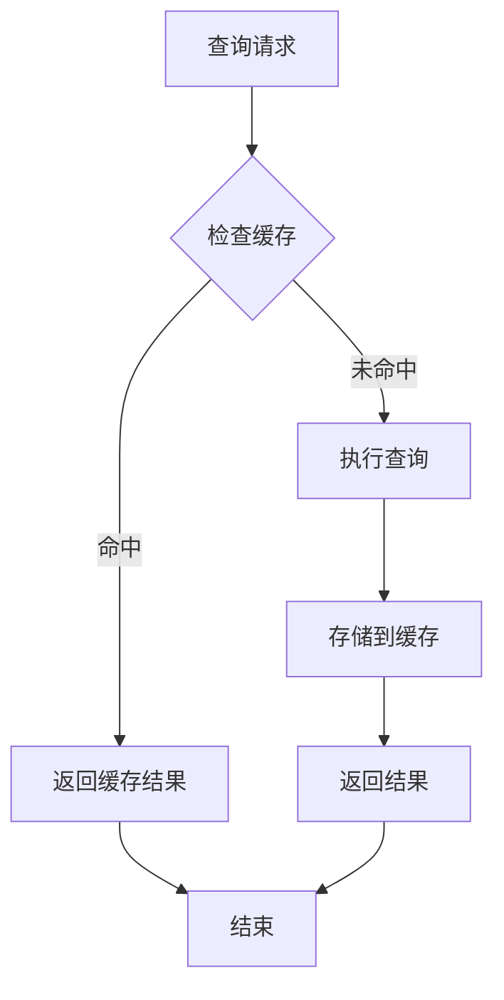

# 属性值分析

<cite>
**本文档引用的文件**
- [README.md](file://README.md)
- [event.schema.json](file://docs/event.schema.json)
- [event.go](file://server/pkg/model/event.go)
- [analytics.go](file://server/api/internal/handler/analytics.go)
- [track.go](file://server/collector/internal/handler/track.go)
- [types.ts](file://sdk/web/src/types.ts)
- [AeroLog.kt](file://sdk/android/aerolog/src/main/java/dev/aerolog/sdk/AeroLog.kt)
- [AeroLog.swift](file://sdk/ios/Sources/AeroLog/AeroLog.swift)
- [01_schema.sql](file://deploy/init/clickhouse/01_schema.sql)
- [syncer.go](file://server/consumer/internal/metadata/syncer.go)
- [prometheus.yml](file://deploy/prometheus/prometheus.yml)
</cite>

## 目录
1. [简介](#简介)
2. [项目结构](#项目结构)
3. [核心组件](#核心组件)
4. [架构概览](#架构概览)
5. [详细组件分析](#详细组件分析)
6. [依赖关系分析](#依赖关系分析)
7. [性能考虑](#性能考虑)
8. [故障排除指南](#故障排除指南)
9. [结论](#结论)

## 简介

AeroLog 是一个自研的多端埋点平台，参考神策（Sensors Analytics）分层架构设计。该项目的核心功能之一是属性值分析，它能够对用户自定义属性进行深入分析，提供属性值分布统计、类型推断和可视化展示。

属性值分析是数据分析系统的重要组成部分，它帮助产品团队理解用户行为特征、优化产品设计和制定营销策略。AeroLog 通过统一的事件模型和强大的查询能力，为属性值分析提供了完整的解决方案。

## 项目结构

AeroLog 采用分层架构设计，主要分为以下层次：



**图表来源**
- [README.md:1-53](file://README.md#L1-L53)
- [01_schema.sql:1-42](file://deploy/init/clickhouse/01_schema.sql#L1-L42)

**章节来源**
- [README.md:1-53](file://README.md#L1-L53)

## 核心组件

### 统一事件模型

AeroLog 定义了统一的事件结构，确保三端 SDK 的数据一致性：

```mermaid
classDiagram
class Event {
+EventType type
+string event
+string distinct_id
+string anonymous_id
+string user_id
+int64 time
+Lib lib
+map~string,interface{}~ properties
+Validate() error
}
class EnvelopedEvent {
+uint32 project_id
+string ip
+string ua
+int64 received_at
+Event event
+MarshalKafka() []byte
+UnmarshalKafka() EnvelopedEvent
}
class Lib {
+string name
+string version
}
Event --> Lib : "包含"
EnvelopedEvent --> Event : "封装"
```

**图表来源**
- [event.go:27-84](file://server/pkg/model/event.go#L27-L84)

### 属性值分析核心流程

属性值分析的核心流程包括数据收集、处理和查询三个阶段：



**图表来源**
- [track.go:60-133](file://server/collector/internal/handler/track.go#L60-L133)
- [analytics.go:124-197](file://server/api/internal/handler/analytics.go#L124-L197)

**章节来源**
- [event.go:27-84](file://server/pkg/model/event.go#L27-L84)
- [track.go:60-133](file://server/collector/internal/handler/track.go#L60-L133)
- [analytics.go:124-197](file://server/api/internal/handler/analytics.go#L124-L197)

## 架构概览

### 数据流架构

AeroLog 的属性值分析遵循完整的数据流架构：



**图表来源**
- [track.go:98-131](file://server/collector/internal/handler/track.go#L98-L131)
- [analytics.go:124-197](file://server/api/internal/handler/analytics.go#L124-L197)

### 属性值存储结构

ClickHouse 中的属性值存储采用了优化的数据结构：

| 字段名 | 类型 | 描述 | 索引用途 |
|--------|------|------|----------|
| project_id | UInt32 | 项目标识 | 主键部分 |
| event | LowCardinality(String) | 事件名称 | 主键部分 |
| distinct_id | String | 用户标识 | 主键部分 |
| time | DateTime64(3, 'UTC') | 时间戳 | 主键部分 |
| properties | String | JSON 属性原始文本 | 查询过滤 |
| lib, os, browser | LowCardinality(String) | 设备信息 | 维度分析 |

**图表来源**
- [01_schema.sql:6-42](file://deploy/init/clickhouse/01_schema.sql#L6-L42)

**章节来源**
- [01_schema.sql:6-42](file://deploy/init/clickhouse/01_schema.sql#L6-L42)

## 详细组件分析

### 属性值查询处理器

属性值分析的核心是 `propertyValues` 方法，它实现了完整的属性值分析功能：



**图表来源**
- [analytics.go:124-197](file://server/api/internal/handler/analytics.go#L124-L197)

#### 查询参数处理

属性值查询支持多种参数组合：

| 参数 | 类型 | 默认值 | 说明 |
|------|------|--------|------|
| property | string | 必填 | 要分析的属性名 |
| event | string | 空 | 限定事件类型 |
| from | int64 | 7天前 | 开始时间戳(ms) |
| to | int64 | 现在 | 结束时间戳(ms) |
| limit | int | 20 | 结果限制 |

#### ClickHouse 查询逻辑

查询使用了 ClickHouse 的 JSONExtractRaw 函数来提取属性值：

```sql
WITH JSONExtractRaw(properties, ?) AS raw
SELECT raw, count() AS c, uniqExact(distinct_id) AS u
FROM events
WHERE project_id = ? 
  AND time BETWEEN fromUnixTimestamp64Milli(?) AND fromUnixTimestamp64Milli(?)
  AND raw != ''
GROUP BY raw
ORDER BY c DESC
LIMIT ?
```

**图表来源**
- [analytics.go:154-162](file://server/api/internal/handler/analytics.go#L154-L162)

**章节来源**
- [analytics.go:124-197](file://server/api/internal/handler/analytics.go#L124-L197)

### 属性值类型解析

属性值解析器负责将原始 JSON 字符串转换为合适的类型：

```mermaid
flowchart TD
RAW_INPUT[原始 JSON 字符串] --> TRY_PARSE{尝试解析}
TRY_PARSE --> |解析成功| SWITCH_TYPE{类型判断}
TRY_PARSE --> |解析失败| RETURN_RAW[返回原始值]
SWITCH_TYPE --> NIL_CASE{nil 类型}
SWITCH_TYPE --> STRING_CASE{string 类型}
SWITCH_TYPE --> NUMBER_CASE{number 类型}
SWITCH_TYPE --> BOOL_CASE{boolean 类型}
SWITCH_TYPE --> OTHER_CASE{其他类型}
NIL_CASE --> NIL_LABEL[标签: null]
STRING_CASE --> EMPTY_STRING{空字符串?}
EMPTY_STRING --> |是| EMPTY_LABEL[标签: (空字符串)]
EMPTY_STRING --> |否| STRING_LABEL[标签: 原始字符串]
NUMBER_CASE --> NUM_LABEL[标签: 数字格式]
BOOL_CASE --> BOOL_LABEL[标签: 布尔格式]
OTHER_CASE --> MARSHAL_JSON[序列化为 JSON]
NIL_LABEL --> RETURN_VALUE[返回值和标签]
EMPTY_LABEL --> RETURN_VALUE
STRING_LABEL --> RETURN_VALUE
NUM_LABEL --> RETURN_VALUE
BOOL_LABEL --> RETURN_VALUE
MARSHAL_JSON --> RETURN_VALUE
RETURN_RAW --> RETURN_VALUE
```

**图表来源**
- [analytics.go:199-223](file://server/api/internal/handler/analytics.go#L199-L223)

#### 类型解析规则

| 输入类型 | 解析结果 | 显示标签 |
|----------|----------|----------|
| null | nil | "null" |
| "" | "" | "(空字符串)" |
| string | string | 原始字符串 |
| number | float64 | 数字格式化 |
| boolean | bool | 布尔格式化 |
| array/object | JSON | JSON 字符串 |

**章节来源**
- [analytics.go:199-223](file://server/api/internal/handler/analytics.go#L199-L223)

### SDK 属性收集

#### Web SDK 属性收集

Web SDK 使用 TypeScript 实现，支持自动属性收集：



**图表来源**
- [types.ts:27-46](file://sdk/web/src/types.ts#L27-L46)

#### Android SDK 属性收集

Android SDK 提供了丰富的自动属性收集功能：

| 自动属性 | 来源 | 说明 |
|----------|------|------|
| $lib | 固定值 | "android" |
| $lib_version | 构建配置 | SDK 版本 |
| $os | 固定值 | "Android" |
| $os_version | Build.VERSION | 系统版本 |
| $model | Build.MODEL | 设备型号 |
| $manufacturer | Build.MANUFACTURER | 制造商 |
| $network_type | ConnectivityManager | 网络类型 |
| $screen_width | DisplayMetrics | 屏幕宽度 |
| $screen_height | DisplayMetrics | 屏幕高度 |
| $app_version | PackageManager | 应用版本 |

**图表来源**
- [AeroLog.kt:249-264](file://sdk/android/aerolog/src/main/java/dev/aerolog/sdk/AeroLog.kt#L249-L264)

#### iOS SDK 属性收集

iOS SDK 的自动属性收集：

| 自动属性 | 来源 | 说明 |
|----------|------|------|
| $lib | 固定值 | "ios" |
| $lib_version | 构建配置 | SDK 版本 |
| $os | 固定值 | "iOS" |
| $os_version | UIDevice.systemVersion | 系统版本 |
| $model | UIDevice.model | 设备型号 |
| $screen_width | UIScreen.main.bounds | 屏幕宽度 |
| $screen_height | UIScreen.main.bounds | 屏幕高度 |
| $app_version | Bundle | 应用版本 |

**图表来源**
- [AeroLog.swift:117-130](file://sdk/ios/Sources/AeroLog/AeroLog.swift#L117-L130)

**章节来源**
- [types.ts:27-46](file://sdk/web/src/types.ts#L27-L46)
- [AeroLog.kt:249-264](file://sdk/android/aerolog/src/main/java/dev/aerolog/sdk/AeroLog.kt#L249-L264)
- [AeroLog.swift:117-130](file://sdk/ios/Sources/AeroLog/AeroLog.swift#L117-L130)

### 数据类型推断

消费者端实现了智能的属性值类型推断机制：



**图表来源**
- [syncer.go:204-239](file://server/consumer/internal/metadata/syncer.go#L204-L239)

#### 类型推断规则

| 输入值类型 | 推断结果 | 说明 |
|------------|----------|------|
| nil | unknown | 无法确定类型 |
| true/false | bool | 布尔类型 |
| 数字且有限 | number | 数值类型 |
| NaN/Infinity | unknown | 异常数值 |
| 字符串且日期格式 | datetime | 日期时间类型 |
| 其他字符串 | string | 字符串类型 |
| 数组 | list | 数组类型 |
| 对象 | object | 对象类型 |
| 其他 | string | 默认字符串 |

**章节来源**
- [syncer.go:204-239](file://server/consumer/internal/metadata/syncer.go#L204-L239)

## 依赖关系分析

### 组件依赖图



**图表来源**
- [README.md:14-19](file://README.md#L14-L19)

### 属性值分析依赖关系

属性值分析功能的依赖关系：



**图表来源**
- [event.go:39-60](file://server/pkg/model/event.go#L39-L60)
- [track.go:98-131](file://server/collector/internal/handler/track.go#L98-L131)
- [analytics.go:124-197](file://server/api/internal/handler/analytics.go#L124-L197)

**章节来源**
- [event.go:39-60](file://server/pkg/model/event.go#L39-L60)
- [track.go:98-131](file://server/collector/internal/handler/track.go#L98-L131)
- [analytics.go:124-197](file://server/api/internal/handler/analytics.go#L124-L197)

## 性能考虑

### ClickHouse 查询优化

属性值分析查询针对 ClickHouse 进行了专门优化：

1. **索引利用**: 使用 `project_id` 和 `time` 作为查询条件，充分利用主键索引
2. **JSON 提取**: 使用 `JSONExtractRaw` 函数直接提取原始 JSON 文本，避免重复解析
3. **分组优化**: 按原始值分组，减少内存使用
4. **限制结果**: 默认限制 20 条记录，可通过参数调整

### 缓存策略



### 监控指标

系统提供了完善的监控指标：

| 指标名称 | 类型 | 描述 |
|----------|------|------|
| aerolog_collector_events_received_total | Counter | 接收的事件总数 |
| aerolog_collector_request_duration_seconds | Histogram | /v1/track 请求耗时 |
| aerolog_collector_kafka_send_errors_total | Counter | 写 Kafka 失败总数 |

**章节来源**
- [track.go:22-37](file://server/collector/internal/handler/track.go#L22-L37)

## 故障排除指南

### 常见问题诊断

#### 属性值为空

当属性值显示为空时，可能的原因：

1. **属性不存在**: 事件中未包含该属性
2. **JSON 解析失败**: 属性值不是有效的 JSON 格式
3. **数据延迟**: 新数据还未到达 ClickHouse

#### 类型解析异常

类型解析失败的排查步骤：

1. **检查数据格式**: 确认属性值符合预期格式
2. **查看日志**: 检查 API 服务器日志中的错误信息
3. **验证查询**: 确认 ClickHouse 查询语法正确

#### 性能问题

如果属性值查询响应缓慢：

1. **检查索引**: 确认 `project_id` 和 `time` 字段有适当索引
2. **优化查询**: 调整时间范围和限制条件
3. **监控资源**: 检查 ClickHouse 和 API 服务器资源使用情况

**章节来源**
- [analytics.go:132-135](file://server/api/internal/handler/analytics.go#L132-L135)
- [track.go:85-90](file://server/collector/internal/handler/track.go#L85-L90)

## 结论

AeroLog 的属性值分析系统通过统一的事件模型、高效的查询机制和智能的类型解析，为用户提供了完整的属性值分析能力。系统的设计充分考虑了性能优化和可扩展性，能够满足大规模数据处理的需求。

主要特点包括：

1. **统一数据模型**: 三端 SDK 使用相同的事件结构，确保数据一致性
2. **高效查询**: 基于 ClickHouse 的 OLAP 查询引擎，支持复杂的属性值分析
3. **智能解析**: 自动识别和解析不同类型的属性值，提供友好的显示格式
4. **完整监控**: 提供详细的性能指标和错误追踪
5. **灵活配置**: 支持多种查询参数和结果限制

通过这些特性，AeroLog 为产品团队提供了强大的数据分析工具，帮助他们更好地理解用户行为和优化产品体验。