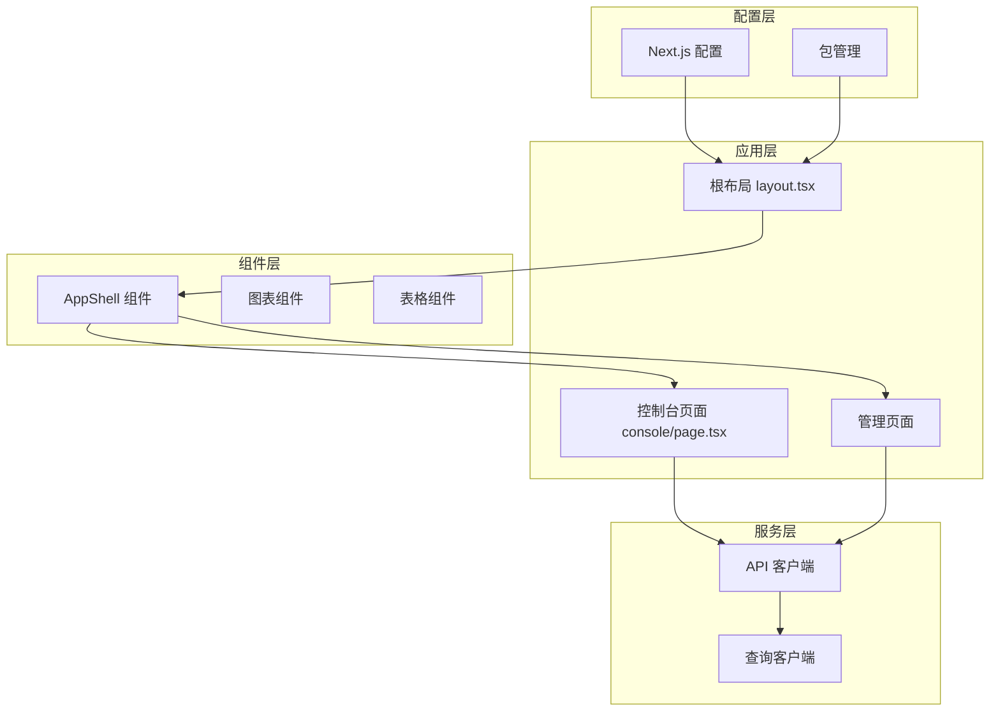
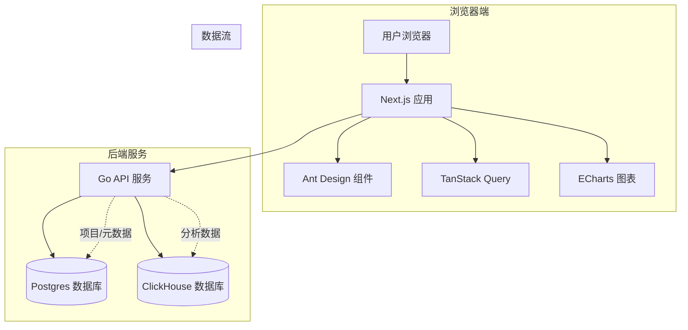
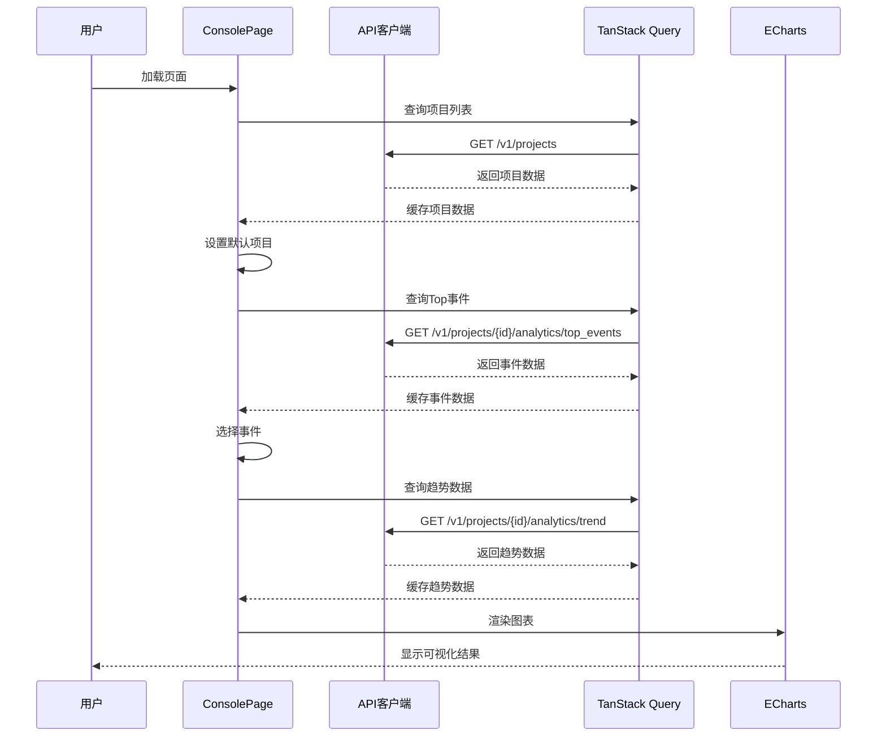
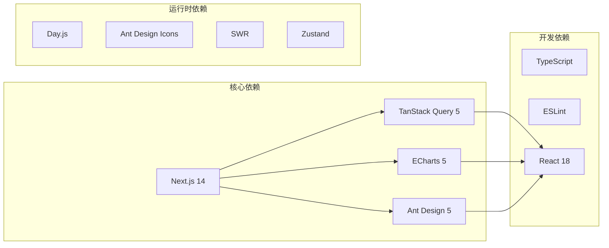
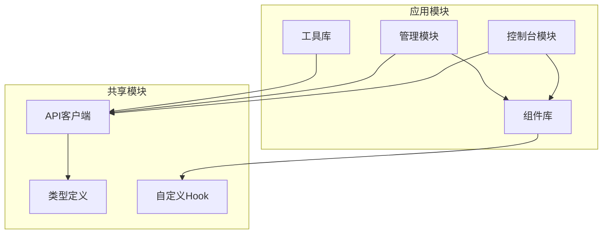

# 控制台概览

<cite>
**本文档引用的文件**
- [AppShell.tsx](file://web/src/components/AppShell.tsx)
- [layout.tsx](file://web/src/app/layout.tsx)
- [page.tsx](file://web/src/app/console/page.tsx)
- [api.ts](file://web/src/lib/api.ts)
- [package.json](file://web/package.json)
- [next.config.js](file://web/next.config.js)
- [projects/page.tsx](file://web/src/app/admin/projects/page.tsx)
- [events/page.tsx](file://web/src/app/admin/events/page.tsx)
- [event/page.tsx](file://web/src/app/console/event/page.tsx)
- [funnel/page.tsx](file://web/src/app/console/funnel/page.tsx)
- [retention/page.tsx](file://web/src/app/console/retention/page.tsx)
- [README.md](file://web/README.md)
</cite>

## 目录
1. [简介](#简介)
2. [项目结构](#项目结构)
3. [核心组件](#核心组件)
4. [架构总览](#架构总览)
5. [详细组件分析](#详细组件分析)
6. [依赖关系分析](#依赖关系分析)
7. [性能考虑](#性能考虑)
8. [故障排除指南](#故障排除指南)
9. [结论](#结论)

## 简介

AeroLog Web控制台是一个基于Next.js 14（App Router）+ Ant Design + TanStack Query + ECharts构建的数据分析平台。该控制台提供了完整的埋点分析解决方案，包括数据看板、事件分析、漏斗分析和留存分析等功能模块。

控制台采用现代化的Web技术栈，通过Ant Design提供丰富的UI组件，使用TanStack Query进行数据缓存和状态管理，结合ECharts实现高性能的图表可视化。整个系统遵循响应式设计理念，支持多设备访问。

## 项目结构

AeroLog Web控制台采用分层的项目组织结构，主要分为以下几个层次：

**图表来源**
- [layout.tsx:10-18](file://web/src/app/layout.tsx#L10-L18)
- [AppShell.tsx:10-43](file://web/src/components/AppShell.tsx#L10-L43)

**章节来源**
- [layout.tsx:1-19](file://web/src/app/layout.tsx#L1-L19)
- [package.json:1-33](file://web/package.json#L1-L33)

## 核心组件

### AppShell 组件

AppShell是整个控制台的核心容器组件，负责管理全局布局和导航结构。它实现了以下关键功能：

#### 布局结构
- **头部区域**：显示品牌标识"AeroLog"和标题
- **侧边栏导航**：提供主要功能入口的垂直菜单
- **主内容区域**：承载具体的业务页面内容
- **响应式设计**：适配不同屏幕尺寸的设备

#### 导航配置
AppShell维护了一个包含6个主要功能入口的导航菜单：
- 概览看板（/console）
- 事件分析（/console/event）
- 漏斗分析（/console/funnel）
- 留存分析（/console/retention）
- 项目管理（/admin/projects）
- 埋点元数据（/admin/events）

#### 状态管理
- 使用React Query进行全局状态管理
- 实现自动化的数据缓存和失效机制
- 支持实时数据更新和同步

**章节来源**
- [AppShell.tsx:10-43](file://web/src/components/AppShell.tsx#L10-L43)

### 根布局系统

RootLayout负责设置全局的HTML结构和样式基础：

#### 全局配置
- 设置语言环境为简体中文（zh-CN）
- 应用Ant Design的基础样式重置
- 提供全局的页面元数据配置

#### 样式基础
- 移除默认的body边距
- 确保AppShell组件占据完整视口高度
- 提供统一的页面容器

**章节来源**
- [layout.tsx:10-18](file://web/src/app/layout.tsx#L10-L18)

## 架构总览

AeroLog控制台采用前后端分离的架构模式，通过HTTP协议进行通信：

**图表来源**
- [README.md:37-42](file://web/README.md#L37-L42)
- [api.ts:32-75](file://web/src/lib/api.ts#L32-L75)

### 技术栈特性

#### 前端技术栈
- **Next.js 14**: 现代化的React框架，支持App Router
- **Ant Design 5**: 企业级UI设计系统
- **TanStack Query 5**: 强大的数据获取和状态管理
- **ECharts 5**: 专业级数据可视化图表库

#### 后端技术栈
- **Go语言**: 高性能的后端服务
- **Postgres**: 关系型数据库存储元数据
- **ClickHouse**: 列式数据库处理大规模分析数据

**章节来源**
- [package.json:11-22](file://web/package.json#L11-L22)
- [README.md:3-42](file://web/README.md#L3-L42)

## 详细组件分析

### 控制台概览页面

ConsolePage是控制台的核心仪表板页面，提供了实时的数据洞察和分析能力：

#### 功能特性
- **项目选择器**: 支持多项目切换和管理
- **Top事件展示**: 显示最近7天的热门事件排行
- **趋势图表**: 基于ECharts的交互式折线图
- **响应式布局**: 自适应不同屏幕尺寸

#### 数据流设计

**图表来源**
- [page.tsx:17-50](file://web/src/app/console/page.tsx#L17-L50)
- [api.ts:38-50](file://web/src/lib/api.ts#L38-L50)

#### 视觉设计
- **颜色方案**: 使用Ant Design的默认色彩系统
- **字体选择**: 采用系统默认字体，确保跨平台一致性
- **间距标准**: 遵循Ant Design的栅格系统和间距规范
- **交互反馈**: 提供加载状态、空状态和错误状态的视觉提示

**章节来源**
- [page.tsx:13-123](file://web/src/app/console/page.tsx#L13-L123)

### 导航体系

控制台采用清晰的功能分区导航体系：

#### 主要功能入口
1. **概览看板**: 数据仪表板和实时监控
2. **事件分析**: 单事件的深度分析和趋势追踪
3. **漏斗分析**: 用户行为路径转换率分析
4. **留存分析**: 用户长期使用情况追踪

#### 管理功能入口
1. **项目管理**: 项目创建、编辑和状态管理
2. **埋点元数据**: 事件定义和分类管理

#### 导航实现
- **侧边栏菜单**: 垂直布局，支持展开/收起
- **面包屑导航**: 在子页面中提供层级导航指示
- **路由集成**: 与Next.js的App Router无缝集成

**章节来源**
- [AppShell.tsx:15-22](file://web/src/components/AppShell.tsx#L15-L22)

### API通信层

API客户端封装了所有后端服务的通信逻辑：

#### 接口定义
- **项目管理**: 列表查询、创建、获取详情
- **数据分析**: Top事件查询、趋势分析、漏斗分析、留存分析
- **事件管理**: 事件定义查询和管理

#### 错误处理
- **HTTP状态码检查**: 自动检测和处理错误响应
- **统一错误格式**: 标准化的错误消息格式
- **网络异常处理**: 网络超时和连接失败的优雅降级

**章节来源**
- [api.ts:32-75](file://web/src/lib/api.ts#L32-L75)

## 依赖关系分析

### 外部依赖关系

**图表来源**
- [package.json:11-22](file://web/package.json#L11-L22)

### 内部模块依赖

**图表来源**
- [api.ts:21-30](file://web/src/lib/api.ts#L21-L30)
- [AppShell.tsx:3-6](file://web/src/components/AppShell.tsx#L3-L6)

**章节来源**
- [package.json:11-32](file://web/package.json#L11-L32)

## 性能考虑

### 前端性能优化

#### 代码分割
- **动态导入**: 图表组件使用动态导入减少初始包大小
- **懒加载**: 非关键资源按需加载
- **路由级别的代码分割**: 不同页面独立打包

#### 数据缓存策略
- **智能缓存**: TanStack Query提供自动化的数据缓存
- **失效策略**: 基于时间的缓存失效和手动刷新
- **离线支持**: 离线状态下提供缓存数据

#### 图表性能
- **虚拟化**: 大数据集的虚拟滚动优化
- **渲染优化**: ECharts的性能配置和优化选项
- **内存管理**: 及时清理不再使用的图表实例

### 后端性能考虑

#### 数据库优化
- **索引策略**: ClickHouse的列式存储优化
- **查询优化**: 预聚合和物化视图
- **分区策略**: 按时间分区提高查询效率

#### API优化
- **批量查询**: 减少HTTP请求次数
- **压缩传输**: Gzip压缩减少带宽占用
- **CDN加速**: 静态资源CDN分发

## 故障排除指南

### 常见问题诊断

#### API连接问题
1. **检查环境变量**: 确认NEXT_PUBLIC_API_BASE配置正确
2. **验证服务状态**: 确认Go API服务正在运行
3. **网络连通性**: 测试从浏览器到API服务器的连接

#### 数据加载问题
1. **检查项目配置**: 确认项目ID有效且有权限访问
2. **验证时间范围**: 确认查询的时间范围合理
3. **查看缓存状态**: 检查TanStack Query的缓存是否正常

#### 图表渲染问题
1. **确认数据格式**: 验证API返回的数据格式正确
2. **检查ECharts版本**: 确认ECharts版本兼容性
3. **查看浏览器控制台**: 检查JavaScript错误信息

### 开发环境配置

#### 环境变量设置
- **NEXT_PUBLIC_API_BASE**: API服务地址，默认为http://localhost:8082
- **NODE_ENV**: 运行环境配置
- **PORT**: 本地开发端口，默认3000

#### 启动流程
1. 启动后端服务和数据库
2. 安装前端依赖
3. 配置API地址
4. 启动开发服务器

**章节来源**
- [next.config.js:4-12](file://web/next.config.js#L4-L12)
- [README.md:14-27](file://web/README.md#L14-L27)

## 结论

AeroLog Web控制台是一个功能完整、架构清晰的数据分析平台。通过合理的组件设计和模块化架构，实现了良好的可维护性和扩展性。

### 主要优势

1. **现代化技术栈**: 采用最新的前端技术和最佳实践
2. **清晰的架构**: 分层设计使得代码结构清晰易懂
3. **强大的功能**: 提供全面的数据分析和可视化能力
4. **良好的用户体验**: 响应式设计和流畅的交互体验

### 发展建议

1. **国际化支持**: 添加多语言支持以服务更广泛的用户群体
2. **主题定制**: 提供更多的主题选择和个性化配置
3. **性能监控**: 集成前端性能监控和错误追踪
4. **移动端优化**: 进一步优化移动端的用户体验

该控制台为AeroLog平台提供了坚实的技术基础，能够满足当前和未来的发展需求。