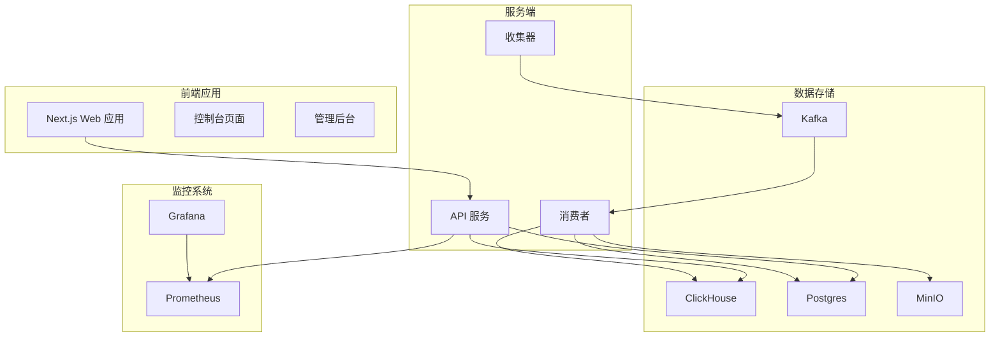
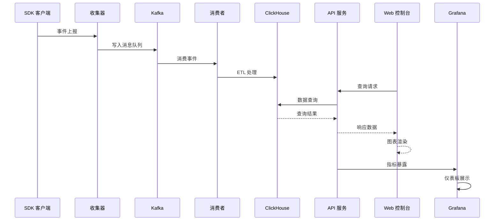
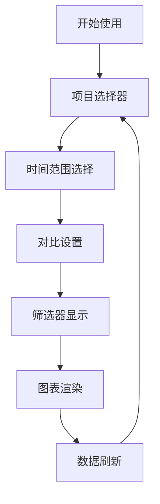
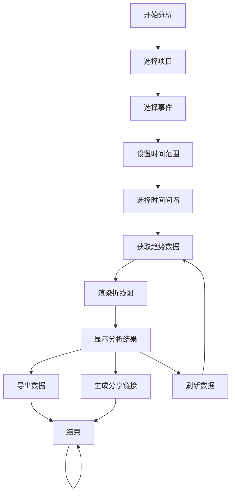
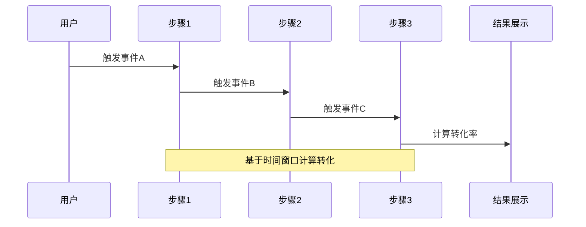
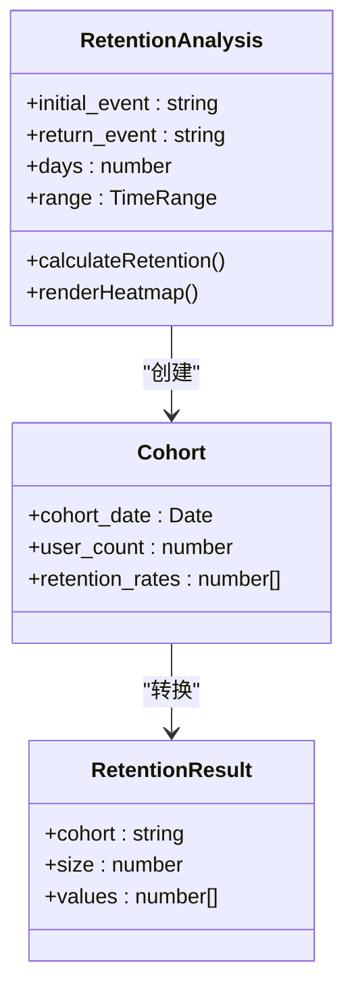
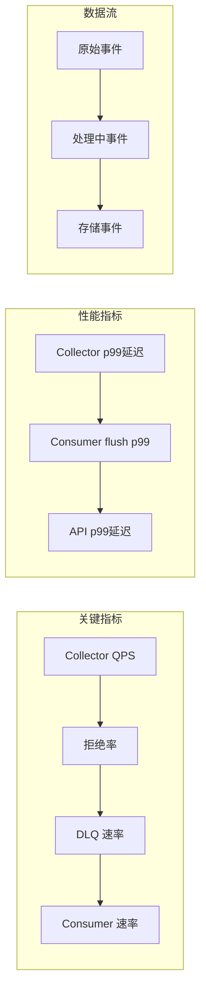
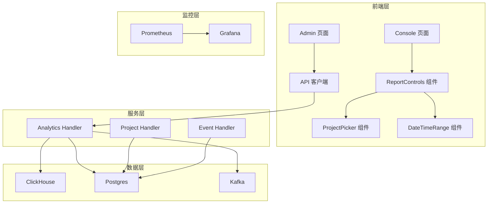

# 数据分析面板

<cite>
**本文档引用的文件**
- [analytics-ui.tsx](file://web/src/features/analytics/analytics-ui.tsx)
- [page.tsx](file://web/src/app/console/page.tsx)
- [event/page.tsx](file://web/src/app/console/event/page.tsx)
- [funnel/page.tsx](file://web/src/app/console/funnel/page.tsx)
- [conversions/page.tsx](file://web/src/app/console/conversions/page.tsx)
- [retention/page.tsx](file://web/src/app/console/retention/page.tsx)
- [realtime/page.tsx](file://web/src/app/console/realtime/page.tsx)
- [aerolog-overview.json](file://deploy/grafana/dashboards/aerolog-overview.json)
- [aerolog.yml](file://deploy/grafana/provisioning/dashboards/aerolog.yml)
- [prometheus.yml](file://deploy/prometheus/prometheus.yml)
- [docker-compose.yml](file://deploy/docker-compose.yml)
- [api.ts](file://web/src/lib/api.ts)
- [analytics.go](file://server/api/internal/handler/analytics.go)
- [main.go](file://server/api/cmd/main.go)
- [config.go](file://server/api/internal/config/config.go)
- [main.go](file://server/consumer/cmd/main.go)
- [README.md](file://README.md)
</cite>

## 更新摘要
**变更内容**
- 新增 ReportControls 组件替代原有的 ProjectPicker 系统
- 引入灵活的时间范围选择机制，支持精确到分钟的时间设置
- 统一各分析页面的控制面板布局和交互体验
- 优化项目选择和时间范围控制的用户体验

## 目录
1. [简介](#简介)
2. [项目结构](#项目结构)
3. [核心组件](#核心组件)
4. [架构概览](#架构概览)
5. [详细组件分析](#详细组件分析)
6. [依赖关系分析](#依赖关系分析)
7. [性能考虑](#性能考虑)
8. [故障排除指南](#故障排除指南)
9. [结论](#结论)

## 简介

AeroLog 是一个自研的多端埋点平台，采用参考神策（Sensors Analytics）分层架构设计。该平台提供了完整的数据分析面板，支持事件趋势分析、漏斗分析、留存分析等多种分析场景。系统采用 Go 语言构建服务端，前端使用 Next.js 开发管理后台和控制台界面。

本项目的核心优势在于：
- **实时监控**：通过 Grafana 仪表板实时展示系统状态
- **多维分析**：支持事件趋势、漏斗转化、用户留存等深度分析
- **高性能架构**：基于 Kafka 流处理和 ClickHouse OLAP 存储
- **全栈技术栈**：Android/iOS/Web 三端 SDK，统一上报协议

## 项目结构

AeroLog 采用模块化设计，主要分为以下核心模块：



**图表来源**
- [README.md:24-34](file://README.md#L24-L34)
- [docker-compose.yml:1-147](file://deploy/docker-compose.yml#L1-147)

**章节来源**
- [README.md:6-22](file://README.md#L6-L22)
- [docker-compose.yml:1-147](file://deploy/docker-compose.yml#L1-L147)

## 核心组件

### 1. 数据分析控制台

数据分析控制台是用户交互的主要界面，提供直观的数据可视化和分析功能。

**主要特性：**
- **项目选择**：支持多项目切换和管理
- **时间范围选择**：灵活的时间窗口设置，支持精确到分钟的时间控制
- **实时数据更新**：自动刷新机制确保数据时效性
- **响应式布局**：适配不同屏幕尺寸
- **统一控制面板**：标准化的 ReportControls 组件提供一致的用户体验

**更新** 新增 ReportControls 组件，替代原有的独立控制面板，提供更统一和灵活的控制体验。

### 2. 分析图表组件

系统提供多种专业级分析图表，每种图表都有特定的使用场景和配置选项。

**图表类型：**
- **事件趋势图**：展示事件随时间的变化趋势
- **流量统计表**：显示事件和用户数量统计
- **转化漏斗图**：分析用户行为转化路径
- **留存热力图**：展示用户留存情况

### 3. 数据筛选功能

提供多层次的数据筛选能力，支持精细化数据分析。

**筛选维度：**
- **时间维度**：精确到秒的时间范围选择
- **事件维度**：按事件类型进行筛选
- **用户维度**：基于用户标识符的分析

### 4. 导出与分享

支持将分析结果导出为多种格式，便于报告和分享。

**导出格式：**
- 图表截图导出
- 数据表格下载
- 分享链接生成

**章节来源**
- [page.tsx:13-124](file://web/src/app/console/page.tsx#L13-L124)
- [event/page.tsx:13-104](file://web/src/app/console/event/page.tsx#L13-L104)
- [funnel/page.tsx:30-165](file://web/src/app/console/funnel/page.tsx#L30-L165)
- [retention/page.tsx:17-128](file://web/src/app/console/retention/page.tsx#L17-L128)

## 架构概览

AeroLog 采用现代化的微服务架构，实现了从数据采集到分析展示的完整闭环。



**图表来源**
- [README.md:26-34](file://README.md#L26-L34)
- [main.go:35-78](file://server/api/cmd/main.go#L35-L78)
- [main.go:18-54](file://server/consumer/cmd/main.go#L18-L54)

### 数据流处理

系统采用流式处理架构，确保数据的实时性和准确性：

1. **事件采集**：客户端 SDK 通过 HTTPS 协议上报事件
2. **消息队列**：使用 Kafka 作为事件缓冲和传输层
3. **数据处理**：消费者服务进行 ETL 转换和清洗
4. **存储优化**：ClickHouse 提供高性能 OLAP 查询
5. **分析展示**：Web 控制台和 Grafana 提供可视化界面

**章节来源**
- [README.md:24-34](file://README.md#L24-L34)
- [docker-compose.yml:37-98](file://deploy/docker-compose.yml#L37-L98)

## 详细组件分析

### ReportControls 控制面板组件

ReportControls 是新的统一控制面板组件，替代了原有的独立控制面板设计，提供更一致的用户体验。



**图表来源**
- [analytics-ui.tsx:165-223](file://web/src/features/analytics/analytics-ui.tsx#L165-L223)

#### 组件结构和功能

| 组件部分 | 功能描述 | 配置选项 |
|----------|----------|----------|
| 项目选择器 | 从下拉菜单中选择目标项目 | 支持多项目切换，自动选择第一个项目 |
| 时间范围选择 | 精确到分钟的时间范围设置 | 支持开始时间和结束时间设置 |
| 对比设置 | 显示对比模式标签 | 默认"无对比"，可设置为"上个周期"等 |
| 筛选器显示 | 动态显示当前筛选条件 | 支持多个筛选器组合显示 |

#### 使用示例

在各个分析页面中，ReportControls 组件的使用方式如下：

**概览页面使用：**
```typescript
<ReportControls
  projects={projects?.data || []}
  projectId={projectId}
  onProjectChange={(next) => {
    setProjectId(next);
    setEvent(undefined);
  }}
  range={range}
  onRangeChange={setRange}
  comparison="上个周期"
  filters={["全部事件", "全部用户"]}
/>
```

**事件分析页面使用：**
```typescript
<ReportControls
  projects={projects?.data || []}
  projectId={projectId}
  onProjectChange={(next) => {
    setProjectId(next);
    setEvent(undefined);
  }}
  range={range}
  onRangeChange={setRange}
  comparison="上个周期"
  filters={event ? [`event = ${event}`] : ["全部事件"]}
/>
```

**章节来源**
- [analytics-ui.tsx:165-223](file://web/src/features/analytics/analytics-ui.tsx#L165-L223)
- [page.tsx:102-114](file://web/src/app/console/page.tsx#L102-L114)
- [event/page.tsx:109-120](file://web/src/app/console/event/page.tsx#L109-L120)

### 事件趋势分析组件

事件趋势分析是数据分析的核心功能之一，用于展示特定事件在时间维度上的变化情况。



**图表来源**
- [event/page.tsx:44-59](file://web/src/app/console/event/page.tsx#L44-L59)
- [api.ts:45-51](file://web/src/lib/api.ts#L45-L51)

#### 关键配置选项

| 配置项 | 类型 | 默认值 | 描述 |
|--------|------|--------|------|
| 时间间隔 | hour/day | day | 数据聚合粒度 |
| 时间范围 | ms 时间戳 | 7天 | 分析时间窗口 |
| 事件选择 | 字符串数组 | 自动选择 | 目标事件列表 |

#### 使用流程

1. **项目选择**：从下拉菜单中选择目标项目
2. **事件筛选**：在事件列表中选择要分析的事件
3. **时间设置**：使用日期选择器设置分析时间段
4. **间隔配置**：选择按小时或按天聚合
5. **结果查看**：图表实时显示事件趋势

**章节来源**
- [event/page.tsx:13-104](file://web/src/app/console/event/page.tsx#L13-L104)
- [api.ts:45-51](file://web/src/lib/api.ts#L45-L51)

### 漏斗分析组件

漏斗分析用于追踪用户在关键业务流程中的转化情况，帮助识别流失环节。



**图表来源**
- [funnel/page.tsx:71-91](file://web/src/app/console/funnel/page.tsx#L71-L91)
- [analytics.go:119-199](file://server/api/internal/handler/analytics.go#L119-L199)

#### 漏斗配置参数

| 参数 | 类型 | 默认值 | 说明 |
|------|------|--------|------|
| 事件序列 | 字符串数组 | 必填 | 2-8个事件组成的转化路径 |
| 时间窗口 | 秒 | 86400 | 用户完成转化的时间限制 |
| 分析范围 | 时间范围 | 7天 | 数据统计的时间范围 |

#### 转化率计算逻辑

漏斗分析使用 ClickHouse 的 `windowFunnel` 函数实现，计算用户在指定时间窗口内完成各步骤的比例。

**章节来源**
- [funnel/page.tsx:30-165](file://web/src/app/console/funnel/page.tsx#L30-L165)
- [analytics.go:119-199](file://server/api/internal/handler/analytics.go#L119-L199)

### 留存分析组件

留存分析帮助理解用户在一段时间内的持续使用情况，是评估产品粘性的重要指标。



**图表来源**
- [retention/page.tsx:11-16](file://web/src/app/console/retention/page.tsx#L11-L16)
- [analytics.go:201-283](file://server/api/internal/handler/analytics.go#L201-L283)

#### 留存计算算法

系统采用 SQL WITH 子句实现复杂的留存计算逻辑：

1. **同批次用户识别**：以初始事件发生的日期作为用户群组
2. **返回事件匹配**：统计每个用户在后续天数内的返回情况
3. **转化率计算**：基于同批次用户规模计算每日留存率

**章节来源**
- [retention/page.tsx:17-128](file://web/src/app/console/retention/page.tsx#L17-L128)
- [analytics.go:201-283](file://server/api/internal/handler/analytics.go#L201-L283)

### Grafana 仪表板

Grafana 仪表板提供了系统级别的监控和数据分析视图。



**图表来源**
- [aerolog-overview.json:10-128](file://deploy/grafana/dashboards/aerolog-overview.json#L10-L128)

#### 仪表板配置

| 面板类型 | 指标名称 | 查询表达式 | 更新频率 |
|----------|----------|------------|----------|
| Stat | Collector QPS | `sum(rate(aerolog_collector_events_received_total{result="accepted"}[1m]))` | 30秒 |
| Stat | 拒绝率 | `sum(rate(aerolog_collector_events_received_total{result="rejected"}[5m])) / clamp_min(...)` | 30秒 |
| Timeseries | Collector p99延迟 | `histogram_quantile(0.99, ...)` | 30秒 |
| Timeseries | API p99延迟 | `histogram_quantile(0.99, ...)` | 30秒 |

**章节来源**
- [aerolog-overview.json:1-131](file://deploy/grafana/dashboards/aerolog-overview.json#L1-L131)
- [aerolog.yml:3-13](file://deploy/grafana/provisioning/dashboards/aerolog.yml#L3-L13)

## 依赖关系分析

系统各组件之间的依赖关系体现了清晰的分层架构设计。



**图表来源**
- [main.go:55-58](file://server/api/cmd/main.go#L55-L58)
- [analytics-ui.tsx:75-223](file://web/src/features/analytics/analytics-ui.tsx#L75-L223)

### 外部依赖

系统对外部服务的依赖关系：

| 服务 | 版本 | 用途 | 连接方式 |
|------|------|------|----------|
| PostgreSQL | 15 | 元数据存储 | DSN 连接 |
| ClickHouse | 24.3 | 事件存储 | Native 协议 |
| Kafka | Redpanda | 消息队列 | Kafka API |
| Grafana | 11.0.0 | 可视化 | HTTP API |
| Prometheus | 2.53.0 | 监控 | HTTP API |

**章节来源**
- [docker-compose.yml:4-98](file://deploy/docker-compose.yml#L4-L98)
- [config.go:24-37](file://server/api/internal/config/config.go#L24-L37)

## 性能考虑

### 查询优化策略

系统在设计时充分考虑了性能优化：

1. **索引设计**：ClickHouse 中对 `time` 和 `project_id` 字段建立合适索引
2. **分区策略**：按天分区存储事件数据，提高查询效率
3. **缓存机制**：Redis 缓存热门查询结果
4. **批量处理**：Kafka 批量消费提升吞吐量

### 监控指标

系统内置了全面的监控指标：

| 指标类别 | 指标名称 | 描述 | 标签 |
|----------|----------|------|------|
| API | aerolog_api_requests_total | API 请求总数 | method, path, status |
| API | aerolog_api_request_duration_seconds | API 请求耗时 | method, path, status |
| Collector | aerolog_collector_events_received_total | 事件接收计数 | result |
| Consumer | aerolog_consumer_messages_total | 消费消息计数 | result |
| Consumer | aerolog_consumer_flush_duration_seconds | 刷新耗时 | result |

**章节来源**
- [main.go:22-33](file://server/api/cmd/main.go#L22-L33)
- [analytics.go:34-74](file://server/api/internal/handler/analytics.go#L34-L74)

## 故障排除指南

### 常见问题及解决方案

#### 1. 数据不显示或显示延迟

**可能原因：**
- Kafka 消费者未启动
- ClickHouse 连接异常
- 查询超时

**解决步骤：**
1. 检查消费者服务状态
2. 验证 ClickHouse 连接配置
3. 查看 Prometheus 监控指标

#### 2. 图表渲染异常

**可能原因：**
- 前端网络连接问题
- API 服务不可用
- 数据格式不正确

**解决步骤：**
1. 检查浏览器开发者工具
2. 验证 API 服务健康检查
3. 查看后端日志

#### 3. 性能问题

**优化建议：**
- 调整查询时间范围
- 减少同时查询的事件数量
- 检查数据库索引状态

**章节来源**
- [main.go:52-53](file://server/api/cmd/main.go#L52-L53)
- [docker-compose.yml:114-147](file://deploy/docker-compose.yml#L114-L147)

### 调试工具

系统提供了多种调试工具：

1. **Prometheus 查询**：直接查询底层指标
2. **Grafana 仪表板**：可视化监控界面
3. **后端日志**：详细的请求和错误日志
4. **前端控制台**：React Query 调试工具

## 结论

AeroLog 数据分析面板是一个功能完整、性能优异的数据分析解决方案。通过合理的架构设计和丰富的分析功能，为用户提供了深入洞察业务运营状况的能力。

### 主要优势

1. **实时性强**：从事件上报到数据展示的全流程优化
2. **分析全面**：涵盖事件趋势、转化漏斗、用户留存等多维度分析
3. **扩展性好**：模块化设计便于功能扩展和维护
4. **监控完善**：内置全面的监控指标和告警机制
5. **用户体验优化**：新的 ReportControls 组件提供统一的控制面板体验

### 发展方向

未来可以考虑的功能增强：
- 更多分析图表类型支持
- 自定义报表功能
- 高级机器学习分析
- 多租户权限管理
- 更精细的时间范围控制选项

该系统为构建企业级数据分析平台提供了良好的基础框架，适合在实际生产环境中部署和使用。

**更新** 本次更新重点介绍了新的 ReportControls 组件系统，它替代了原有的独立控制面板设计，提供了更统一和灵活的用户体验。新的组件支持精确到分钟的时间范围选择，并在所有分析页面中保持一致的交互模式。