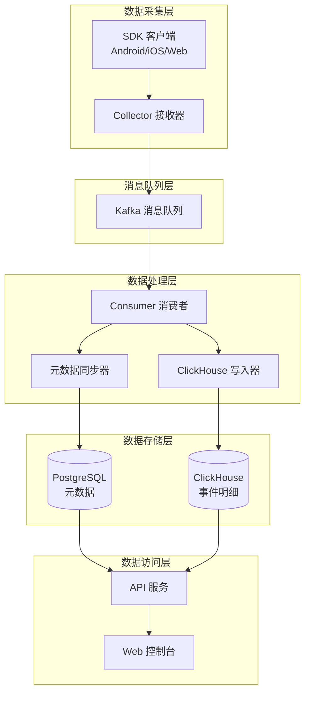
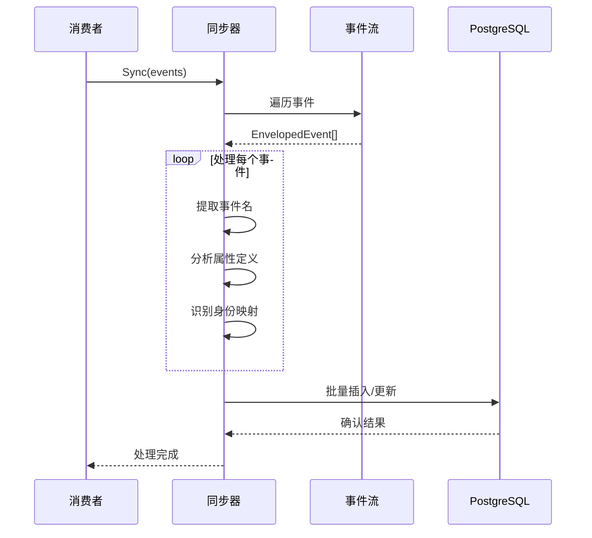
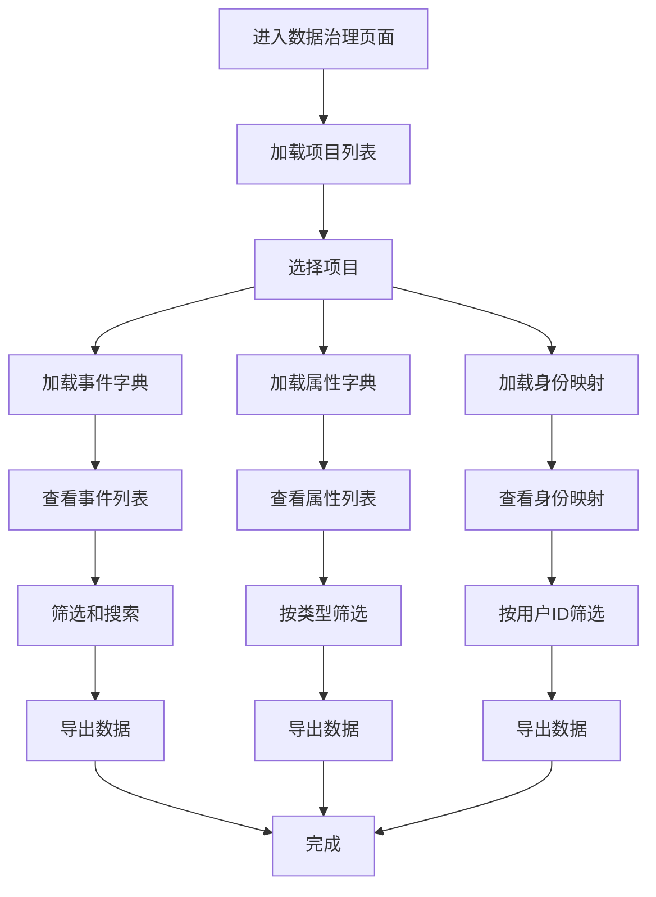
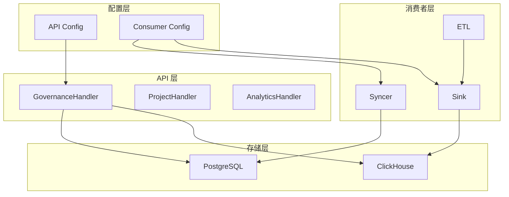

# 数据治理功能

<cite>
**本文档引用的文件**
- [server/api/internal/handler/governance.go](file://server/api/internal/handler/governance.go)
- [deploy/migrations/postgres/20260617_governance_metadata.sql](file://deploy/migrations/postgres/20260617_governance_metadata.sql)
- [server/consumer/internal/metadata/syncer.go](file://server/consumer/internal/metadata/syncer.go)
- [server/pkg/model/event.go](file://server/pkg/model/event.go)
- [server/consumer/internal/chsink/sink.go](file://server/consumer/internal/chsink/sink.go)
- [web/src/features/metadata/metadata-page.tsx](file://web/src/features/metadata/metadata-page.tsx)
- [server/api/internal/app/app.go](file://server/api/internal/app/app.go)
- [server/api/internal/config/config.go](file://server/api/internal/config/config.go)
- [server/consumer/internal/config/config.go](file://server/consumer/internal/config/config.go)
- [web/src/lib/api.ts](file://web/src/lib/api.ts)
- [deploy/init/postgres/01_schema.sql](file://deploy/init/postgres/01_schema.sql)
- [README.md](file://README.md)
</cite>

## 目录
1. [简介](#简介)
2. [项目结构](#项目结构)
3. [核心组件](#核心组件)
4. [架构概览](#架构概览)
5. [详细组件分析](#详细组件分析)
6. [依赖关系分析](#依赖关系分析)
7. [性能考虑](#性能考虑)
8. [故障排除指南](#故障排除指南)
9. [结论](#结论)

## 简介

AeroLog 是一个自研的多端埋点平台，采用分层架构设计，参考了神策（Sensors Analytics）的设计理念。该项目的核心功能是提供完整的数据治理能力，包括事件字典管理、属性定义治理、身份映射管理和用户画像维护。

系统采用 Go 语言开发服务端，支持 Android、iOS 和 Web 三个平台的 SDK，所有平台共享相同的上报协议。前端使用 Next.js 构建管理后台和控制台界面。

## 项目结构

AeroLog 项目采用模块化的目录结构，主要分为以下几个核心部分：

```mermaid
graph TB
subgraph "客户端 SDK"
A[sdk/android/] Android SDK
B[sdk/ios/] iOS SDK
C[sdk/web/] Web SDK
end
subgraph "服务端"
D[server/collector/] 接收层
E[server/consumer/] 消费层
F[server/api/] API 层
G[server/pkg/] 公共库
end
subgraph "前端"
H[web/src/app/] Next.js 应用
I[web/src/features/] 功能模块
J[web/src/components/] UI 组件
end
subgraph "部署"
K[deploy/] Docker Compose
L[docs/] 文档
M[scripts/] 脚本工具
end
A --> D
B --> D
C --> D
D --> E
E --> F
F --> H
F --> I
F --> J
```

**图表来源**
- [README.md:8-22](file://README.md#L8-L22)

**章节来源**
- [README.md:1-53](file://README.md#L1-L53)

## 核心组件

### 数据治理处理器

数据治理功能由专门的处理器负责，提供以下核心能力：

1. **事件属性字典管理** - 自动发现和管理事件属性定义
2. **身份映射管理** - 维护匿名 ID 与用户 ID 的关联关系
3. **用户画像管理** - 提供用户属性查询和分析功能
4. **元数据同步** - 实时同步事件流中的元数据变化

### 元数据同步器

元数据同步器负责从事件流中提取和更新治理数据：

- **事件定义同步** - 自动识别新的事件名称
- **属性定义同步** - 发现和推断属性类型和作用域
- **身份映射同步** - 建立匿名用户与登录用户的关联

### 数据存储架构

系统采用混合存储策略：

- **PostgreSQL** - 存储业务元数据和治理信息
- **ClickHouse** - 存储事件明细数据
- **Redis** - 缓存热点数据

**章节来源**
- [server/api/internal/handler/governance.go:14-25](file://server/api/internal/handler/governance.go#L14-L25)
- [server/consumer/internal/metadata/syncer.go:15-23](file://server/consumer/internal/metadata/syncer.go#L15-L23)

## 架构概览

AeroLog 采用分层架构设计，实现了完整的数据治理闭环：



**图表来源**
- [README.md:24-34](file://README.md#L24-L34)
- [server/api/internal/app/app.go:108-119](file://server/api/internal/app/app.go#L108-L119)

## 详细组件分析

### 数据治理处理器

数据治理处理器是 API 层的核心组件，提供了完整的数据治理接口：

```mermaid
classDiagram
class GovernanceHandler {
-PG : *pgxpool.Pool
-CH : driver.Conn
+Register(router) void
+properties(context) void
+identities(context) void
+users(context) void
+profile(context) void
-parseJSONProps(raw) map[string]interface{}
-clampLimit(raw, min, max) int
}
class PostgreSQL {
+Query(context, sql, args) rows
+SendBatch(batch) result
}
class ClickHouse {
+Query(context, sql, args) rows
+PrepareBatch(context, sql) batch
}
GovernanceHandler --> PostgreSQL : "查询属性定义"
GovernanceHandler --> ClickHouse : "查询用户数据"
```

**图表来源**
- [server/api/internal/handler/governance.go:14-18](file://server/api/internal/handler/governance.go#L14-L18)

#### 属性字典管理

处理器通过 `properties` 方法提供属性字典查询功能：

- 支持按作用域过滤（事件属性 vs 用户属性）
- 提供时间范围查询和排序功能
- 返回属性的完整元数据信息

#### 身份映射管理

`identities` 方法负责管理匿名 ID 与用户 ID 的关联：

- 支持多种查询条件组合
- 提供限制结果数量的功能
- 记录首次和最后出现时间

#### 用户画像查询

用户画像功能通过 `users` 和 `profile` 方法实现：

- 支持模糊查询和精确匹配
- 提供用户属性的实时聚合
- 维护用户画像的更新历史

**章节来源**
- [server/api/internal/handler/governance.go:27-188](file://server/api/internal/handler/governance.go#L27-L188)

### 元数据同步器

元数据同步器是数据处理层的关键组件，负责从事件流中提取治理信息：



**图表来源**
- [server/consumer/internal/metadata/syncer.go:26-97](file://server/consumer/internal/metadata/syncer.go#L26-L97)

#### 事件定义同步

同步器自动识别新的事件名称并更新事件字典：

- 从 `track` 类型事件中提取事件名
- 记录事件的首次和最后出现时间
- 维护事件的状态和描述信息

#### 属性定义推断

系统能够智能推断属性的类型和作用域：

- 支持多种数据类型检测（字符串、数字、布尔值、日期等）
- 自动合并冲突的类型定义
- 区分事件属性和用户属性

#### 身份映射建立

通过分析事件中的用户标识信息建立身份关联：

- 识别匿名 ID 和用户 ID 的对应关系
- 维护映射关系的时间戳信息
- 处理用户 ID 变更的情况

**章节来源**
- [server/consumer/internal/metadata/syncer.go:25-97](file://server/consumer/internal/metadata/syncer.go#L25-L97)

### 数据模型

事件数据模型定义了统一的事件结构：

```mermaid
classDiagram
class Event {
+EventType type
+string event
+string distinct_id
+string anonymous_id
+string user_id
+int64 time
+Lib lib
+map[string]interface{} properties
+Validate() error
}
class EnvelopedEvent {
+uint32 project_id
+string ip
+string ua
+int64 received_at
+Event event
+MarshalKafka() []byte
+UnmarshalKafka() EnvelopedEvent
}
class Lib {
+string name
+string version
}
Event --> Lib : "包含"
EnvelopedEvent --> Event : "封装"
```

**图表来源**
- [server/pkg/model/event.go:27-69](file://server/pkg/model/event.go#L27-L69)

**章节来源**
- [server/pkg/model/event.go:1-84](file://server/pkg/model/event.go#L1-L84)

### 前端数据治理界面

Web 前端提供了直观的数据治理界面：



**图表来源**
- [web/src/features/metadata/metadata-page.tsx:20-121](file://web/src/features/metadata/metadata-page.tsx#L20-L121)

**章节来源**
- [web/src/features/metadata/metadata-page.tsx:1-211](file://web/src/features/metadata/metadata-page.tsx#L1-L211)

## 依赖关系分析

系统各组件之间的依赖关系如下：



**图表来源**
- [server/api/internal/app/app.go:108-119](file://server/api/internal/app/app.go#L108-L119)
- [server/consumer/internal/config/config.go:28-45](file://server/consumer/internal/config/config.go#L28-L45)

### 外部依赖

系统依赖的主要外部组件：

- **Gin Web 框架** - 提供 HTTP 服务器功能
- **PostgreSQL** - 存储元数据和业务数据
- **ClickHouse** - 高性能 OLAP 数据库
- **Kafka** - 分布式消息队列
- **React Query** - 前端数据获取和缓存

**章节来源**
- [server/api/internal/config/config.go:8-15](file://server/api/internal/config/config.go#L8-L15)
- [server/consumer/internal/config/config.go:8-18](file://server/consumer/internal/config/config.go#L8-L18)

## 性能考虑

### 查询优化

数据治理功能在设计时充分考虑了性能优化：

1. **索引策略** - 在身份映射表上建立了用户 ID 和匿名 ID 的复合索引
2. **批量操作** - 使用 PostgreSQL 的批量插入功能减少网络往返
3. **缓存机制** - 前端使用 React Query 进行数据缓存
4. **分页查询** - 所有列表查询都支持分页和限制结果数量

### 数据类型推断

系统实现了智能的数据类型推断机制：

- **数值类型** - 自动区分整数和浮点数
- **日期时间** - 通过格式验证识别日期时间类型
- **复杂类型** - 支持数组和对象类型的识别
- **混合类型处理** - 当同一属性出现不同类型时标记为混合类型

### 并发处理

系统采用异步处理模式：

- **非阻塞写入** - ClickHouse 使用异步插入模式
- **批量提交** - 消费者采用批量处理提高吞吐量
- **连接池管理** - 合理配置数据库连接池大小

## 故障排除指南

### 常见问题及解决方案

#### 数据不一致问题

**症状**：前端显示的统计数据与实际不符

**可能原因**：
1. 元数据同步延迟
2. ClickHouse 数据聚合延迟
3. 缓存数据过期

**解决步骤**：
1. 检查消费者进程状态
2. 验证 Kafka 消费进度
3. 查看数据库连接状态

#### 查询性能问题

**症状**：数据治理页面响应缓慢

**可能原因**：
1. 缺少必要的数据库索引
2. 查询条件过于宽泛
3. 结果集过大

**解决步骤**：
1. 添加适当的数据库索引
2. 优化查询参数
3. 实施分页和限制

#### 数据类型异常

**症状**：属性类型显示为混合类型

**可能原因**：
1. 同一属性在不同事件中具有不同数据类型
2. 数据导入过程中的类型转换错误

**解决步骤**：
1. 检查事件数据的一致性
2. 更新属性定义的类型信息
3. 清理历史数据中的异常值

**章节来源**
- [server/consumer/internal/metadata/syncer.go:231-239](file://server/consumer/internal/metadata/syncer.go#L231-L239)

## 结论

AeroLog 的数据治理功能通过以下关键特性实现了完整的数据资产管理：

1. **自动化元数据管理** - 系统能够自动发现和维护事件、属性和用户画像的元数据
2. **实时数据同步** - 从事件流中实时提取治理信息并更新数据库
3. **多维度数据治理** - 支持事件字典、属性定义、身份映射和用户画像的全面管理
4. **高性能架构** - 采用分层架构和优化策略确保系统的高性能运行

该系统为数据分析和商业智能提供了坚实的基础，通过自动化的数据治理流程减少了人工干预的需求，提高了数据质量和一致性。同时，清晰的架构设计和完善的监控机制为系统的稳定运行提供了保障。

未来可以进一步增强的功能包括：
- 更精细的数据质量检查机制
- 自动化的数据清洗和标准化
- 更丰富的数据血缘追踪功能
- 增强的权限控制和审计日志