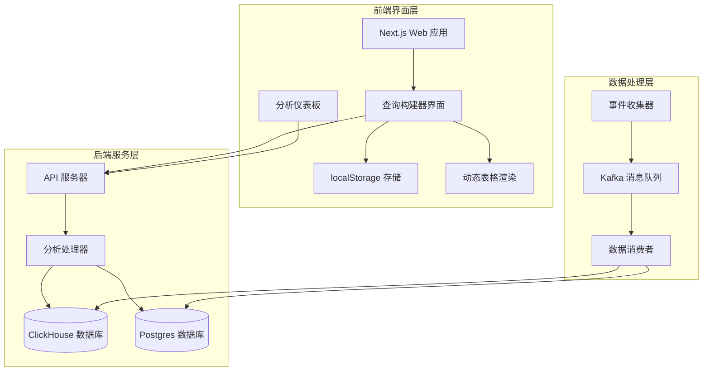
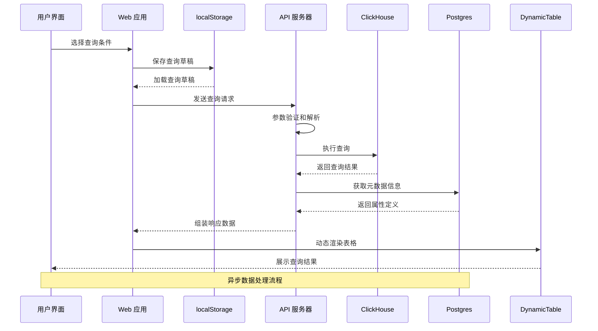
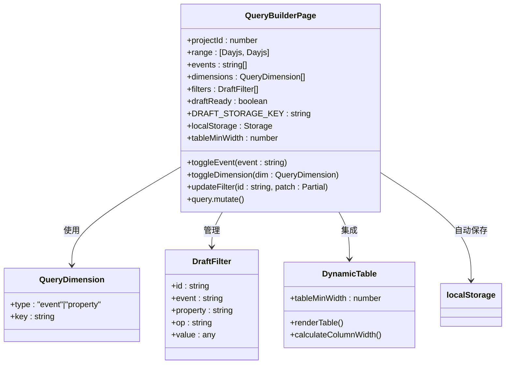
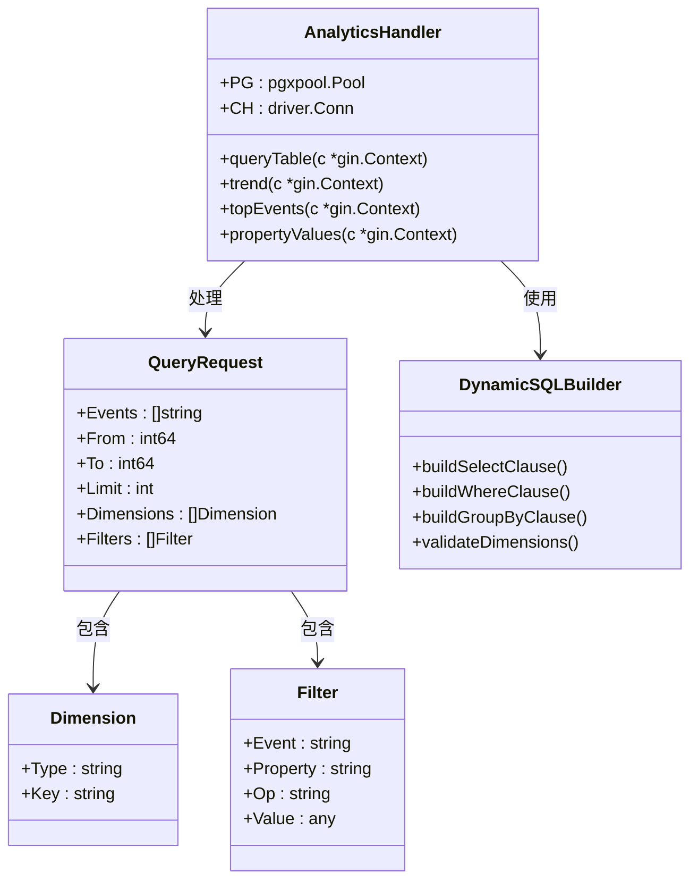
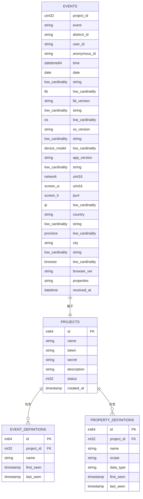
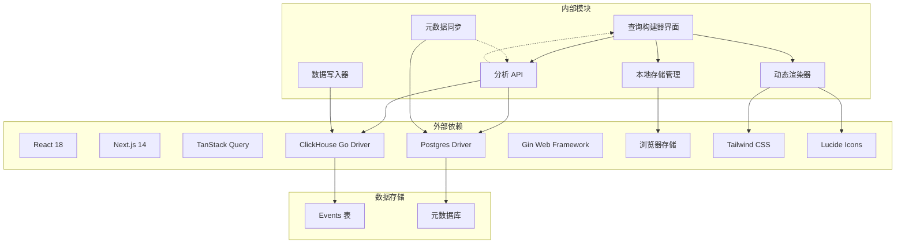

# 查询构建器

<cite>
**本文档引用的文件**
- [page.tsx](file://web/src/app/console/query/page.tsx)
- [analytics.go](file://server/api/internal/handler/analytics.go)
- [api.ts](file://web/src/lib/api.ts)
- [01_schema.sql](file://deploy/init/clickhouse/01_schema.sql)
- [table.tsx](file://web/src/components/ui/table.tsx)
</cite>

## 更新摘要
**已进行的变更**
- 新增 localStorage 自动保存功能说明
- 更新无限维度支持的实现细节
- 增强状态管理改进的描述
- 添加动态列宽渲染的技术实现
- 更新查询构建器界面组件分析
- 完善后端查询处理组件说明

## 目录
1. [简介](#简介)
2. [项目结构](#项目结构)
3. [核心组件](#核心组件)
4. [架构概览](#架构概览)
5. [详细组件分析](#详细组件分析)
6. [依赖关系分析](#依赖关系分析)
7. [性能考虑](#性能考虑)
8. [故障排除指南](#故障排除指南)
9. [结论](#结论)

## 简介

查询构建器是 AeroLog 分析平台的核心功能模块，允许用户通过直观的界面构建复杂的事件分析查询。该系统支持多维分析、条件过滤和实时数据查询，为产品运营、埋点验证和用户行为分析提供强大的工具。

**重大增强功能**：
- **localStorage 自动保存**：查询草稿自动保存到浏览器本地存储
- **无限维度支持**：支持任意数量的维度组合进行数据分析
- **改进的状态管理**：使用 React Hooks 和 TanStack Query 进行状态管理
- **动态列宽渲染**：根据维度数量自动调整表格列宽

## 项目结构

AeroLog 采用分层架构设计，查询构建器分布在前端界面层和后端服务层：

**图表来源**
- [page.tsx:37-103](file://web/src/app/console/query/page.tsx#L37-L103)
- [analytics.go:32-44](file://server/api/internal/handler/analytics.go#L32-L44)

**章节来源**
- [page.tsx:37-103](file://web/src/app/console/query/page.tsx#L37-L103)
- [analytics.go:32-44](file://server/api/internal/handler/analytics.go#L32-L44)

## 核心组件

### 前端查询构建器

查询构建器界面提供了直观的拖拽式操作体验：

- **localStorage 自动保存**：查询草稿自动保存到浏览器本地存储，支持断电恢复
- **事件选择器**：支持多事件筛选，最多可选择20个事件
- **无限维度设置**：支持任意数量的维度组合（事件名、属性值等）
- **条件过滤**：支持多种操作符（等于、不等于、存在、不存在等）
- **动态列宽**：根据维度数量自动调整表格列宽
- **时间范围**：默认7天，可自定义起止时间
- **结果展示**：实时生成分析表格，支持导出功能

### 后端分析处理器

后端提供完整的查询执行能力：

- **查询路由**：`/projects/:id/analytics/query_table`
- **参数验证**：严格的输入参数校验和限制
- **SQL 构建**：动态构建 ClickHouse 查询语句
- **结果聚合**：支持多维分组和统计计算
- **无限维度支持**：支持任意数量维度的动态查询

**章节来源**
- [page.tsx:37-103](file://web/src/app/console/query/page.tsx#L37-L103)
- [analytics.go:629-795](file://server/api/internal/handler/analytics.go#L629-L795)

## 架构概览

查询构建器的整体架构采用事件驱动的设计模式：

**图表来源**
- [page.tsx:61-103](file://web/src/app/console/query/page.tsx#L61-L103)
- [analytics.go:629-795](file://server/api/internal/handler/analytics.go#L629-L795)

## 详细组件分析

### 查询构建器界面组件

查询构建器界面采用 React Hooks 和 TypeScript 实现，支持 localStorage 自动保存和动态列宽渲染：

**图表来源**
- [page.tsx:37-103](file://web/src/app/console/query/page.tsx#L37-L103)
- [page.tsx:145](file://web/src/app/console/query/page.tsx#L145)

### 后端查询处理组件

后端分析处理器负责执行复杂的 SQL 查询，支持无限维度：

**图表来源**
- [analytics.go:629-795](file://server/api/internal/handler/analytics.go#L629-L795)
- [analytics.go:677-742](file://server/api/internal/handler/analytics.go#L677-L742)

### 数据模型和存储

系统使用 ClickHouse 作为主要的数据存储引擎：

**图表来源**
- [01_schema.sql:6-42](file://deploy/init/clickhouse/01_schema.sql#L6-L42)

**章节来源**
- [page.tsx:37-103](file://web/src/app/console/query/page.tsx#L37-L103)
- [analytics.go:629-795](file://server/api/internal/handler/analytics.go#L629-L795)
- [01_schema.sql:6-42](file://deploy/init/clickhouse/01_schema.sql#L6-L42)

## 依赖关系分析

查询构建器系统的依赖关系呈现清晰的分层结构：

**图表来源**
- [page.tsx:3-27](file://web/src/app/console/query/page.tsx#L3-L27)
- [analytics.go:3-15](file://server/api/internal/handler/analytics.go#L3-L15)

**章节来源**
- [page.tsx:3-27](file://web/src/app/console/query/page.tsx#L3-L27)
- [analytics.go:3-15](file://server/api/internal/handler/analytics.go#L3-L15)

## 性能考虑

查询构建器在设计时充分考虑了性能优化：

### 查询优化策略
- **索引利用**：利用 ClickHouse 的分区和排序键优化查询性能
- **数据类型优化**：使用 LowCardinality 类型减少存储空间
- **批量处理**：支持批量查询和结果缓存
- **连接池管理**：合理配置数据库连接池参数

### 缓存机制
- **元数据缓存**：事件和属性定义的缓存机制
- **查询结果缓存**：常用查询结果的短期缓存
- **localStorage 缓存**：查询草稿的持久化存储

### 性能监控
- **指标收集**：请求延迟、错误率等关键指标
- **告警机制**：性能异常自动告警
- **资源监控**：数据库连接数和查询执行时间

### 动态渲染优化
- **虚拟滚动**：大量数据时的虚拟滚动支持
- **列宽计算**：智能列宽计算避免布局闪烁
- **状态管理**：React Query 的智能缓存和状态同步

## 故障排除指南

### 常见问题及解决方案

**查询超时问题**
- 检查时间范围是否过大
- 验证事件选择数量是否超过限制
- 确认过滤条件是否过于复杂

**数据不一致问题**
- 确认数据同步状态
- 检查 Kafka 消费进度
- 验证 ClickHouse 数据完整性

**界面无响应问题**
- 检查网络连接状态
- 清除浏览器缓存
- 验证 API 服务可用性

**localStorage 保存失败**
- 检查浏览器存储配额
- 验证 localStorage API 可用性
- 清理过期的存储数据

**动态表格渲染问题**
- 检查 CSS 样式冲突
- 验证响应式布局配置
- 确认数据格式正确性

**章节来源**
- [page.tsx:61-103](file://web/src/app/console/query/page.tsx#L61-L103)
- [analytics.go:662-669](file://server/api/internal/handler/analytics.go#L662-L669)

## 结论

查询构建器作为 AeroLog 的核心分析工具，通过前后端协同设计实现了强大的事件分析能力。系统采用现代化的技术栈和合理的架构设计，在保证功能完整性的同时兼顾了性能和可维护性。

**重大增强功能总结**：
- **localStorage 自动保存**：提供无缝的用户体验，支持断电恢复
- **无限维度支持**：突破传统限制，支持任意数量的维度组合
- **改进的状态管理**：使用 React Hooks 和 TanStack Query 提升开发效率
- **动态列宽渲染**：智能适配不同维度数量的表格显示

未来可以进一步优化的方向包括：
- 增强查询模板功能
- 扩展可视化分析组件
- 完善权限控制机制
- 优化移动端用户体验

通过持续的功能迭代和技术升级，查询构建器将继续为用户提供高效、准确的事件分析服务。