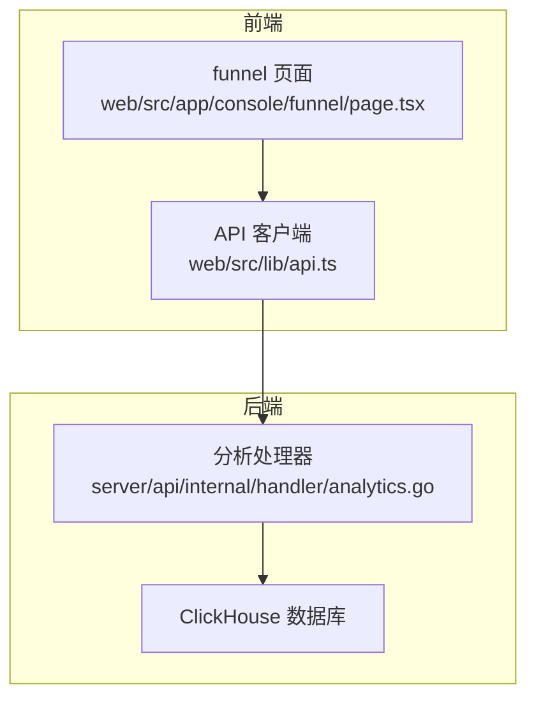
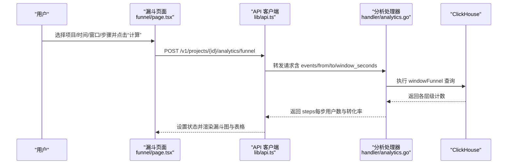
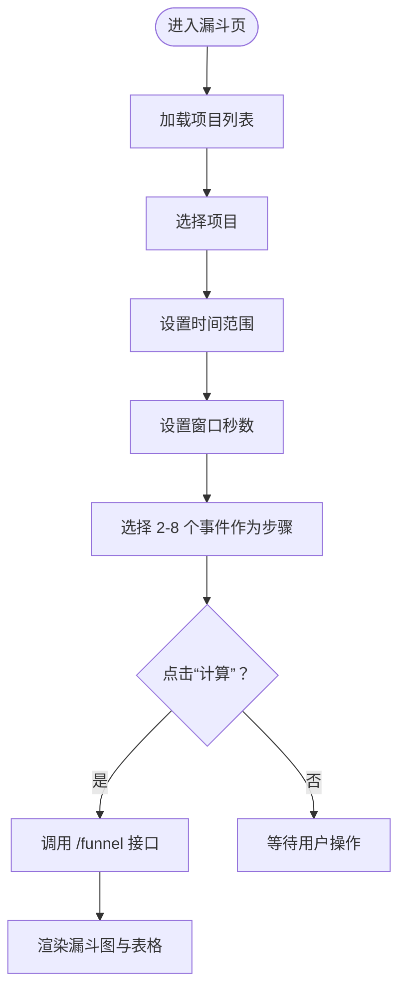
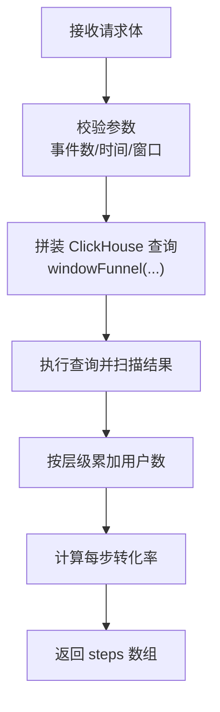
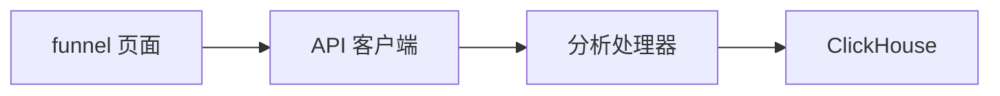

# 漏斗分析功能

<cite>
**本文引用的文件**
- [web/src/app/console/funnel/page.tsx](file://web/src/app/console/funnel/page.tsx)
- [web/src/lib/api.ts](file://web/src/lib/api.ts)
- [server/api/internal/handler/analytics.go](file://server/api/internal/handler/analytics.go)
</cite>

## 目录
1. [简介](#简介)
2. [项目结构](#项目结构)
3. [核心组件](#核心组件)
4. [架构总览](#架构总览)
5. [详细组件分析](#详细组件分析)
6. [依赖分析](#依赖分析)
7. [性能考虑](#性能考虑)
8. [故障排查指南](#故障排查指南)
9. [结论](#结论)
10. [附录](#附录)

## 简介
本文件系统性介绍 AeroLog 中“漏斗分析”功能的使用方法与实现原理，覆盖以下方面：
- 页面界面与交互：项目选择、时间范围、窗口参数、步骤选择与计算按钮
- 转化率计算逻辑：基于 ClickHouse windowFunnel 的窗口内事件序列匹配与累计统计
- 可视化展示：漏斗图与表格数据
- 漏斗建模步骤：步骤定义、条件设置与窗口参数配置
- 对比分析能力：当前实现支持单组漏斗；多版本并行对比可扩展
- 异常检测与优化建议：当前未内置异常检测；可结合趋势与留存进行诊断
- 应用案例与最佳实践：如何利用漏斗定位转化瓶颈并指导产品优化

## 项目结构
漏斗分析功能由前端页面、API 客户端与后端分析处理器三部分组成：
- 前端页面负责用户输入与结果展示
- API 客户端封装请求与响应格式
- 后端处理器对接 ClickHouse 执行漏斗计算

图表来源
- [web/src/app/console/funnel/page.tsx:1-165](file://web/src/app/console/funnel/page.tsx#L1-L165)
- [web/src/lib/api.ts:32-75](file://web/src/lib/api.ts#L32-L75)
- [server/api/internal/handler/analytics.go:27-32](file://server/api/internal/handler/analytics.go#L27-L32)

章节来源
- [web/src/app/console/funnel/page.tsx:1-165](file://web/src/app/console/funnel/page.tsx#L1-L165)
- [web/src/lib/api.ts:32-75](file://web/src/lib/api.ts#L32-L75)
- [server/api/internal/handler/analytics.go:27-32](file://server/api/internal/handler/analytics.go#L27-L32)

## 核心组件
- 漏斗页面组件：管理项目、时间范围、窗口秒数、步骤列表与计算按钮；调用 API 获取结果并渲染漏斗图与表格
- API 客户端：封装 /v1/projects/:id/analytics/funnel 接口，统一处理错误与响应
- 分析处理器：接收前端参数，校验边界，构造 ClickHouse 查询，执行 windowFunnel 并返回每一步的用户数与转化率

章节来源
- [web/src/app/console/funnel/page.tsx:30-165](file://web/src/app/console/funnel/page.tsx#L30-L165)
- [web/src/lib/api.ts:52-59](file://web/src/lib/api.ts#L52-L59)
- [server/api/internal/handler/analytics.go:121-199](file://server/api/internal/handler/analytics.go#L121-L199)

## 架构总览
下图展示了从用户操作到数据返回的关键流程。

图表来源
- [web/src/app/console/funnel/page.tsx:59-69](file://web/src/app/console/funnel/page.tsx#L59-L69)
- [web/src/lib/api.ts:52-59](file://web/src/lib/api.ts#L52-L59)
- [server/api/internal/handler/analytics.go:121-199](file://server/api/internal/handler/analytics.go#L121-L199)

## 详细组件分析

### 前端页面组件（漏斗分析）
- 状态管理
  - 项目 ID、事件序列、时间范围、窗口秒数、计算结果
- 输入控件
  - 项目选择、日期时间范围选择器、窗口秒数输入框、多选事件步骤
- 计算流程
  - 使用 mutation 触发 API 请求，成功回调更新结果，失败弹出消息提示
- 展示组件
  - 动态图表（漏斗图）、表格（步骤、用户数、整体转化率）

图表来源
- [web/src/app/console/funnel/page.tsx:30-165](file://web/src/app/console/funnel/page.tsx#L30-L165)

章节来源
- [web/src/app/console/funnel/page.tsx:30-165](file://web/src/app/console/funnel/page.tsx#L30-L165)

### API 客户端（前端）
- 统一基础地址与请求头
- funnel 方法：POST /v1/projects/:id/analytics/funnel，请求体包含 events、from、to、window_seconds
- 错误处理：非 2xx 抛出异常并显示

章节来源
- [web/src/lib/api.ts:32-75](file://web/src/lib/api.ts#L32-L75)
- [web/src/lib/api.ts:52-59](file://web/src/lib/api.ts#L52-L59)

### 后端分析处理器（Go）
- 路由注册：/v1/projects/:id/analytics/funnel
- 参数校验：事件数量限制、时间范围默认值、窗口秒数默认值
- ClickHouse 查询：
  - 使用 windowFunnel 在指定时间窗内按事件序列匹配用户路径
  - 统计达到不同层级的用户数
- 结果聚合：
  - 累加得到“达到第 k 步及之后”的用户数
  - 计算每步相对首步的转化率

图表来源
- [server/api/internal/handler/analytics.go:121-199](file://server/api/internal/handler/analytics.go#L121-L199)

章节来源
- [server/api/internal/handler/analytics.go:121-199](file://server/api/internal/handler/analytics.go#L121-L199)

## 依赖分析
- 前端依赖
  - React Hooks（状态与生命周期）
  - Ant Design 控件（选择器、日期选择器、输入框、按钮、表格、卡片、空状态）
  - ECharts-for-React（漏斗图）
  - TanStack React Query（查询与缓存）
- 后端依赖
  - Gin 路由框架
  - ClickHouse Go 驱动
- 数据流
  - 前端通过 API 客户端调用后端路由，后端连接 ClickHouse 执行 windowFunnel 查询

图表来源
- [web/src/app/console/funnel/page.tsx:19](file://web/src/app/console/funnel/page.tsx#L19)
- [web/src/lib/api.ts:3](file://web/src/lib/api.ts#L3)
- [server/api/internal/handler/analytics.go:14](file://server/api/internal/handler/analytics.go#L14)

章节来源
- [web/src/app/console/funnel/page.tsx:1-22](file://web/src/app/console/funnel/page.tsx#L1-L22)
- [web/src/lib/api.ts:1-19](file://web/src/lib/api.ts#L1-L19)
- [server/api/internal/handler/analytics.go:1-16](file://server/api/internal/handler/analytics.go#L1-L16)

## 性能考虑
- 时间窗与事件序列长度
  - 更长的时间窗与更多的步骤会增加 ClickHouse 的扫描与聚合开销
- ClickHouse 索引与分区
  - 建议确保事件表具备按 project_id 与 time 的索引或分区，以提升查询效率
- 前端渲染
  - 大量步骤时，漏斗图与表格的渲染需注意虚拟化与分页策略（当前表格已关闭分页）
- 缓存与并发
  - 使用 React Query 的查询键避免重复请求；合理设置默认时间窗与步骤上限

## 故障排查指南
- 常见错误类型
  - 参数非法：事件数量不在 2-8 之间、from/to 未设置导致越界
  - 网络异常：API 返回非 2xx，前端弹出错误消息
  - ClickHouse 查询异常：后端返回 500，检查 SQL 与连接配置
- 排查步骤
  - 确认项目 ID 有效且存在
  - 检查时间范围与窗口秒数是否合理
  - 查看浏览器网络面板与后端日志
  - 验证 ClickHouse 连接参数与表结构

章节来源
- [server/api/internal/handler/analytics.go:129-136](file://server/api/internal/handler/analytics.go#L129-L136)
- [web/src/app/console/funnel/page.tsx:67-69](file://web/src/app/console/funnel/page.tsx#L67-L69)

## 结论
漏斗分析功能通过前端直观配置与后端 ClickHouse 快速聚合，实现了从步骤定义到转化率可视化的完整闭环。当前版本聚焦单组漏斗分析，后续可在现有接口基础上扩展多版本对比与异常检测能力，进一步提升产品优化效率。

## 附录

### 漏斗建模步骤
- 步骤定义
  - 选择 2-8 个事件作为漏斗步骤，顺序即转化路径
- 条件设置
  - 设置起止时间与窗口秒数，控制事件序列匹配的时间范围
- 权重配置
  - 当前实现不支持步骤权重；如需差异化权重，可在业务层对用户数进行二次调整
- 结果解读
  - 漏斗图与表格展示每步用户数与整体转化率，用于定位流失环节

章节来源
- [web/src/app/console/funnel/page.tsx:120-135](file://web/src/app/console/funnel/page.tsx#L120-L135)
- [server/api/internal/handler/analytics.go:121-199](file://server/api/internal/handler/analytics.go#L121-L199)

### 对比分析（多版本并行）
- 当前能力
  - 单组漏斗计算与展示
- 扩展建议
  - 在前端维护多组漏斗请求与结果，并在同一图表中叠加展示
  - 或者新增对比接口，分别返回多组 steps，再进行横向对比

章节来源
- [web/src/app/console/funnel/page.tsx:59-69](file://web/src/app/console/funnel/page.tsx#L59-L69)

### 异常检测与优化建议
- 当前状态
  - 未内置异常检测与自动优化建议
- 建议方案
  - 结合趋势分析与留存分析，识别异常波动与回归
  - 将漏斗结果与时间序列、留存矩阵联动，形成综合诊断

章节来源
- [web/src/lib/api.ts:45-51](file://web/src/lib/api.ts#L45-L51)
- [server/api/internal/handler/analytics.go:34-74](file://server/api/internal/handler/analytics.go#L34-L74)