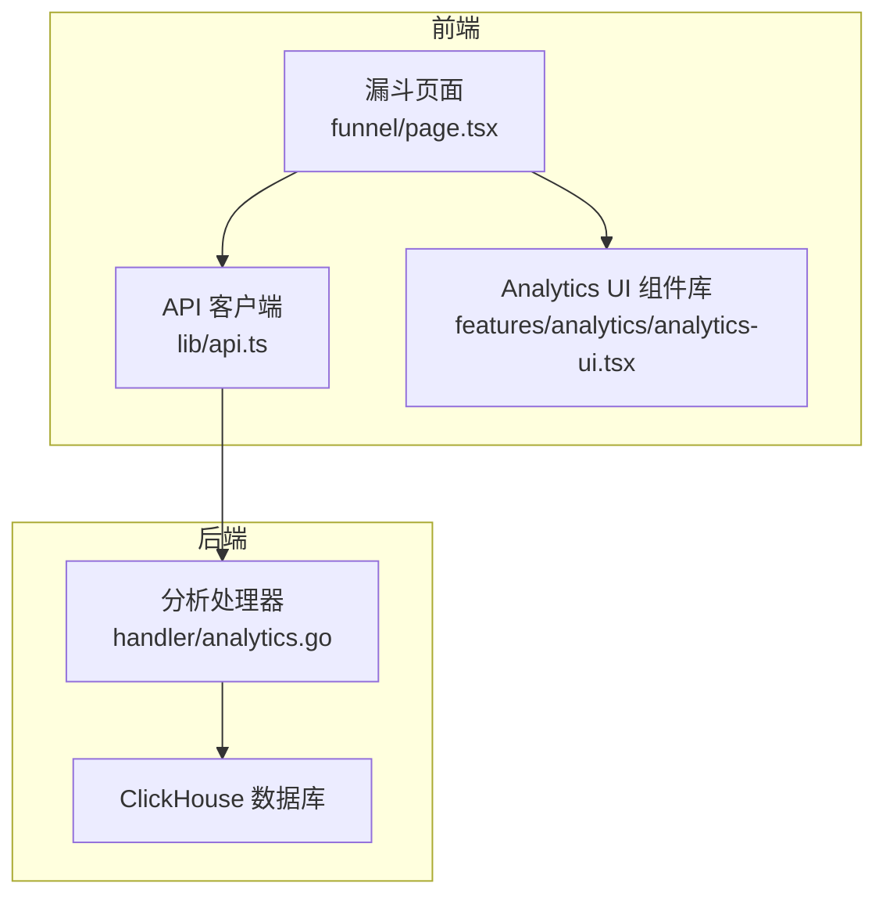
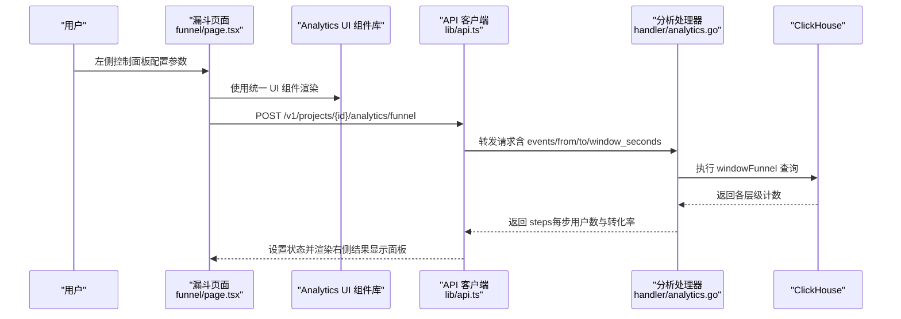
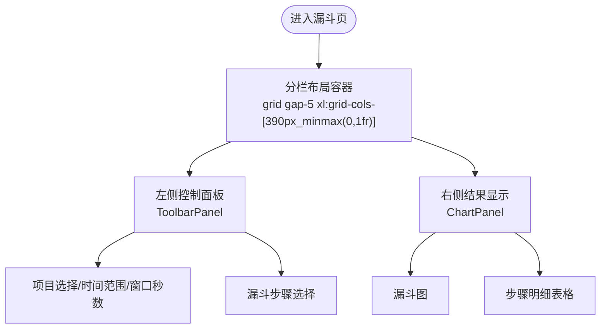
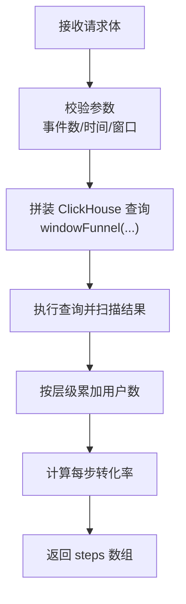
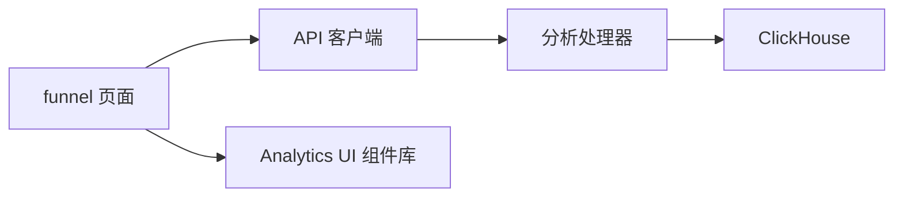

# 漏斗分析功能

<cite>
**本文引用的文件**
- [web/src/app/console/funnel/page.tsx](file://web/src/app/console/funnel/page.tsx)
- [web/src/lib/api.ts](file://web/src/lib/api.ts)
- [server/api/internal/handler/analytics.go](file://server/api/internal/handler/analytics.go)
- [web/src/features/analytics/analytics-ui.tsx](file://web/src/features/analytics/analytics-ui.tsx)
</cite>

## 更新摘要
**变更内容**
- 重新设计为分栏面板布局：左侧控制面板 + 右侧结果显示
- 新增统一的 Analytics UI 组件库
- 改进的响应式布局和用户体验
- 增强的可视化组件和指标展示

## 目录
1. [简介](#简介)
2. [项目结构](#项目结构)
3. [核心组件](#核心组件)
4. [架构总览](#架构总览)
5. [详细组件分析](#详细组件分析)
6. [依赖分析](#依赖分析)
7. [性能考虑](#性能考虑)
8. [故障排查指南](#故障排查指南)
9. [结论](#结论)
10. [附录](#附录)

## 简介
本文件系统性介绍 AeroLog 中"漏斗分析"功能的使用方法与实现原理，覆盖以下方面：
- **分栏面板布局**：左侧控制面板（项目选择、时间范围、窗口参数、步骤选择）+ 右侧结果显示（漏斗图与表格）
- **统一 UI 组件**：使用 AnalyticsHeader、ToolbarPanel、ChartPanel 等组件库
- **转化率计算逻辑**：基于 ClickHouse windowFunnel 的窗口内事件序列匹配与累计统计
- **可视化展示**：动态漏斗图与详细表格数据
- **漏斗建模步骤**：步骤定义、条件设置与窗口参数配置
- **对比分析能力**：当前实现支持单组漏斗；多版本并行对比可扩展
- **异常检测与优化建议**：当前未内置异常检测；可结合趋势与留存进行诊断
- **应用案例与最佳实践**：如何利用漏斗定位转化瓶颈并指导产品优化

## 项目结构
漏斗分析功能由前端页面、API 客户端与后端分析处理器三部分组成，采用分栏面板布局设计：
- **前端页面**：采用 xl:grid-cols-[390px_minmax(0,1fr)] 的两栏布局
- **统一 UI 组件库**：AnalyticsHeader、ToolbarPanel、ChartPanel 等
- **API 客户端**：封装请求与响应格式
- **后端处理器**：对接 ClickHouse 执行漏斗计算



**图表来源**
- [web/src/app/console/funnel/page.tsx:119-173](file://web/src/app/console/funnel/page.tsx#L119-L173)
- [web/src/lib/api.ts:138-152](file://web/src/lib/api.ts#L138-L152)
- [web/src/features/analytics/analytics-ui.tsx:289-321](file://web/src/features/analytics/analytics-ui.tsx#L289-L321)

**章节来源**
- [web/src/app/console/funnel/page.tsx:119-173](file://web/src/app/console/funnel/page.tsx#L119-L173)
- [web/src/lib/api.ts:138-152](file://web/src/lib/api.ts#L138-L152)
- [web/src/features/analytics/analytics-ui.tsx:289-321](file://web/src/features/analytics/analytics-ui.tsx#L289-L321)

## 核心组件
- **分栏布局容器**：`grid gap-5 xl:grid-cols-[390px_minmax(0,1fr)]` 实现左右分栏
- **控制面板组件**：`ToolbarPanel` 包裹项目选择、时间范围、窗口秒数、步骤选择
- **结果显示面板**：`ChartPanel` 展示漏斗图和步骤明细表格
- **统一 UI 组件库**：AnalyticsHeader、ProjectPicker、DateTimeRange、EventStepSelector 等
- **API 客户端**：封装 /v1/projects/:id/analytics/funnel 接口
- **分析处理器**：接收前端参数，校验边界，构造 ClickHouse 查询，执行 windowFunnel 并返回每一步的用户数与转化率

**章节来源**
- [web/src/app/console/funnel/page.tsx:119-173](file://web/src/app/console/funnel/page.tsx#L119-L173)
- [web/src/features/analytics/analytics-ui.tsx:289-321](file://web/src/features/analytics/analytics-ui.tsx#L289-L321)
- [web/src/lib/api.ts:138-152](file://web/src/lib/api.ts#L138-L152)
- [server/api/internal/handler/analytics.go:119-201](file://server/api/internal/handler/analytics.go#L119-L201)

## 架构总览
下图展示了从用户操作到数据返回的关键流程，采用分栏面板布局设计。



**图表来源**
- [web/src/app/console/funnel/page.tsx:119-217](file://web/src/app/console/funnel/page.tsx#L119-L217)
- [web/src/features/analytics/analytics-ui.tsx:289-321](file://web/src/features/analytics/analytics-ui.tsx#L289-L321)
- [web/src/lib/api.ts:138-152](file://web/src/lib/api.ts#L138-L152)
- [server/api/internal/handler/analytics.go:119-201](file://server/api/internal/handler/analytics.go#L119-L201)

## 详细组件分析

### 分栏面板布局设计
- **左侧控制面板**：固定宽度 390px，包含项目选择、时间范围、窗口秒数、漏斗步骤选择
- **右侧结果显示**：自适应宽度，包含漏斗图和步骤明细表格
- **响应式设计**：xl 断点下启用分栏，在小屏幕设备上自动堆叠



**图表来源**
- [web/src/app/console/funnel/page.tsx:119-217](file://web/src/app/console/funnel/page.tsx#L119-L217)

**章节来源**
- [web/src/app/console/funnel/page.tsx:119-217](file://web/src/app/console/funnel/page.tsx#L119-L217)

### 统一 UI 组件库
- **AnalyticsHeader**：页面头部标题和描述
- **ToolbarPanel**：控制面板容器，提供统一的卡片样式
- **ChartPanel**：结果显示面板，包含标题、描述和内容区域
- **ProjectPicker**：项目选择器
- **DateTimeRange**：时间范围选择器
- **EventStepSelector**：事件步骤选择器
- **MetricTile**：指标展示卡片

**章节来源**
- [web/src/features/analytics/analytics-ui.tsx:43-74](file://web/src/features/analytics/analytics-ui.tsx#L43-L74)
- [web/src/features/analytics/analytics-ui.tsx:289-321](file://web/src/features/analytics/analytics-ui.tsx#L289-L321)
- [web/src/features/analytics/analytics-ui.tsx:380-433](file://web/src/features/analytics/analytics-ui.tsx#L380-L433)

### 前端页面组件（漏斗分析）
- **状态管理**
  - 项目 ID、事件序列、时间范围、窗口秒数、计算结果
- **输入控件**
  - 项目选择、日期时间范围选择器、窗口秒数输入框、多选事件步骤
- **计算流程**
  - 使用 mutation 触发 API 请求，成功回调更新结果，失败弹出消息提示
- **展示组件**
  - 动态图表（漏斗图）、表格（步骤、用户数、整体转化率）

```mermaid
flowchart TD
Start(["进入漏斗页"]) --> LoadProjects["加载项目列表"]
LoadProjects --> SelectProj["选择项目"]
SelectProj --> SetRange["设置时间范围"]
SetRange --> SetWindow["设置窗口秒数"]
SetWindow --> ChooseSteps["选择 2-8 个事件作为步骤"]
ChooseSteps --> RunCalc{"点击"计算漏斗"？"}
RunCalc --> |是| CallAPI["调用 /funnel 接口"]
CallAPI --> Render["渲染右侧结果显示面板"]
RunCalc --> |否| Wait["等待用户操作"]
```

**图表来源**
- [web/src/app/console/funnel/page.tsx:32-76](file://web/src/app/console/funnel/page.tsx#L32-L76)

**章节来源**
- [web/src/app/console/funnel/page.tsx:32-76](file://web/src/app/console/funnel/page.tsx#L32-L76)

### API 客户端（前端）
- 统一基础地址与请求头
- funnel 方法：POST /v1/projects/:id/analytics/funnel，请求体包含 events、from、to、window_seconds
- 错误处理：非 2xx 抛出异常并显示

**章节来源**
- [web/src/lib/api.ts:138-152](file://web/src/lib/api.ts#L138-L152)

### 后端分析处理器（Go）
- 路由注册：/v1/projects/:id/analytics/funnel
- 参数校验：事件数量限制、时间范围默认值、窗口秒数默认值
- ClickHouse 查询：
  - 使用 windowFunnel 在指定时间窗内按事件序列匹配用户路径
  - 统计达到不同层级的用户数
- 结果聚合：
  - 累加得到"达到第 k 步及之后"的用户数
  - 计算每步相对首步的转化率



**图表来源**
- [server/api/internal/handler/analytics.go:119-201](file://server/api/internal/handler/analytics.go#L119-L201)

**章节来源**
- [server/api/internal/handler/analytics.go:119-201](file://server/api/internal/handler/analytics.go#L119-L201)

## 依赖分析
- **前端依赖**
  - React Hooks（状态与生命周期）
  - Next.js 动态导入（ECharts-for-React）
  - TanStack React Query（查询与缓存）
  - Tailwind CSS（响应式网格布局）
  - 统一 UI 组件库（Analytics UI）
- **后端依赖**
  - Gin 路由框架
  - ClickHouse Go 驱动
- **数据流**
  - 前端通过 API 客户端调用后端路由，后端连接 ClickHouse 执行 windowFunnel 查询



**图表来源**
- [web/src/app/console/funnel/page.tsx:18](file://web/src/app/console/funnel/page.tsx#L18)
- [web/src/lib/api.ts:3](file://web/src/lib/api.ts#L3)
- [server/api/internal/handler/analytics.go:14](file://server/api/internal/handler/analytics.go#L14)

**章节来源**
- [web/src/app/console/funnel/page.tsx:1-22](file://web/src/app/console/funnel/page.tsx#L1-L22)
- [web/src/lib/api.ts:1-19](file://web/src/lib/api.ts#L1-L19)
- [server/api/internal/handler/analytics.go:1-16](file://server/api/internal/handler/analytics.go#L1-L16)

## 性能考虑
- **布局性能**
  - 分栏布局使用 CSS Grid，响应式断点在 xl:390px 宽度下启用
  - 右侧结果显示面板采用自适应宽度，避免固定宽度带来的布局抖动
- **时间窗与事件序列长度**
  - 更长的时间窗与更多的步骤会增加 ClickHouse 的扫描与聚合开销
- **ClickHouse 索引与分区**
  - 建议确保事件表具备按 project_id 与 time 的索引或分区，以提升查询效率
- **前端渲染**
  - 大量步骤时，漏斗图与表格的渲染需注意虚拟化与分页策略（当前表格已关闭分页）
- **缓存与并发**
  - 使用 React Query 的查询键避免重复请求；合理设置默认时间窗与步骤上限

## 故障排查指南
- **常见错误类型**
  - 参数非法：事件数量不在 2-8 之间、from/to 未设置导致越界
  - 网络异常：API 返回非 2xx，前端弹出错误消息
  - ClickHouse 查询异常：后端返回 500，检查 SQL 与连接配置
- **布局问题排查**
  - 分栏布局不生效：检查 xl:grid-cols-[390px_minmax(0,1fr)] 类名是否正确
  - 控制面板溢出：确认 ToolbarPanel 内容不超过 390px 宽度
- **排查步骤**
  - 确认项目 ID 有效且存在
  - 检查时间范围与窗口秒数是否合理
  - 查看浏览器网络面板与后端日志
  - 验证 ClickHouse 连接参数与表结构

**章节来源**
- [server/api/internal/handler/analytics.go:133-145](file://server/api/internal/handler/analytics.go#L133-L145)
- [web/src/app/console/funnel/page.tsx:144-165](file://web/src/app/console/funnel/page.tsx#L144-L165)

## 结论
漏斗分析功能通过统一的分栏面板布局设计，实现了左侧控制面板与右侧结果显示的清晰分离。前端采用 Analytics UI 组件库提供了统一的视觉风格和交互体验，后端通过 ClickHouse 快速聚合实现了从步骤定义到转化率可视化的完整闭环。当前版本聚焦单组漏斗分析，后续可在现有接口基础上扩展多版本对比与异常检测能力，进一步提升产品优化效率。

## 附录

### 漏斗建模步骤
- **步骤定义**
  - 选择 2-8 个事件作为漏斗步骤，顺序即转化路径
- **条件设置**
  - 设置起止时间与窗口秒数，控制事件序列匹配的时间范围
- **权重配置**
  - 当前实现不支持步骤权重；如需差异化权重，可在业务层对用户数进行二次调整
- **结果解读**
  - 漏斗图与表格展示每步用户数与整体转化率，用于定位流失环节

**章节来源**
- [web/src/app/console/funnel/page.tsx:120-141](file://web/src/app/console/funnel/page.tsx#L120-L141)
- [server/api/internal/handler/analytics.go:119-201](file://server/api/internal/handler/analytics.go#L119-L201)

### 对比分析（多版本并行）
- **当前能力**
  - 单组漏斗计算与展示
- **扩展建议**
  - 在前端维护多组漏斗请求与结果，并在同一图表中叠加展示
  - 或者新增对比接口，分别返回多组 steps，再进行横向对比

**章节来源**
- [web/src/app/console/funnel/page.tsx:144-165](file://web/src/app/console/funnel/page.tsx#L144-L165)

### 异常检测与优化建议
- **当前状态**
  - 未内置异常检测与自动优化建议
- **建议方案**
  - 结合趋势分析与留存分析，识别异常波动与回归
  - 将漏斗结果与时间序列、留存矩阵联动，形成综合诊断

**章节来源**
- [web/src/lib/api.ts:138-152](file://web/src/lib/api.ts#L138-L152)
- [server/api/internal/handler/analytics.go:119-201](file://server/api/internal/handler/analytics.go#L119-L201)

### 统一 UI 组件库特性
- **组件分类**
  - 布局组件：AnalyticsHeader、ToolbarPanel、ChartPanel
  - 表单组件：ProjectPicker、DateTimeRange、NumberField、EventStepSelector
  - 展示组件：MetricTile、EmptyAnalysis、EventRankList
- **设计特点**
  - 统一的卡片样式和间距规范
  - 响应式设计支持不同屏幕尺寸
  - 动画过渡效果提升用户体验
  - 类型安全的 TypeScript 接口定义

**章节来源**
- [web/src/features/analytics/analytics-ui.tsx:43-74](file://web/src/features/analytics/analytics-ui.tsx#L43-L74)
- [web/src/features/analytics/analytics-ui.tsx:289-321](file://web/src/features/analytics/analytics-ui.tsx#L289-L321)
- [web/src/features/analytics/analytics-ui.tsx:380-433](file://web/src/features/analytics/analytics-ui.tsx#L380-L433)