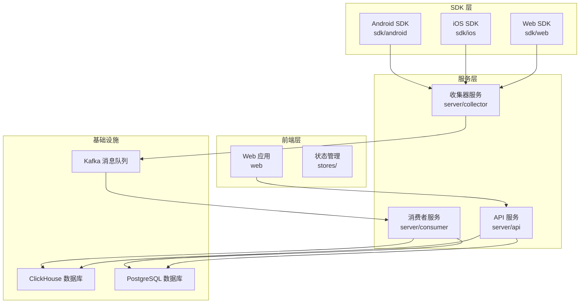
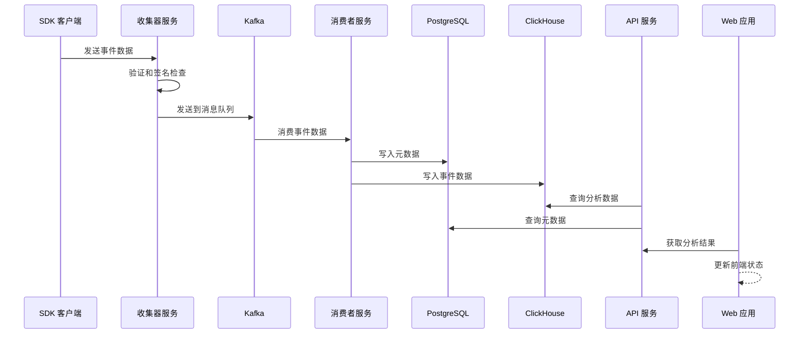
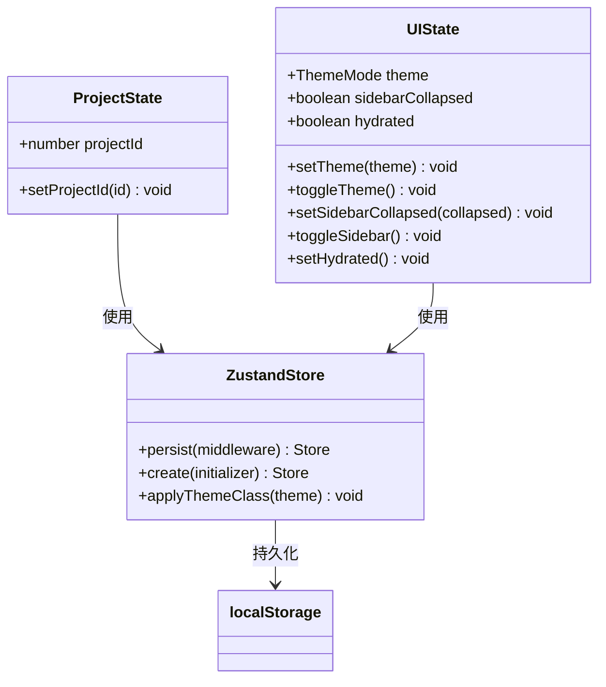
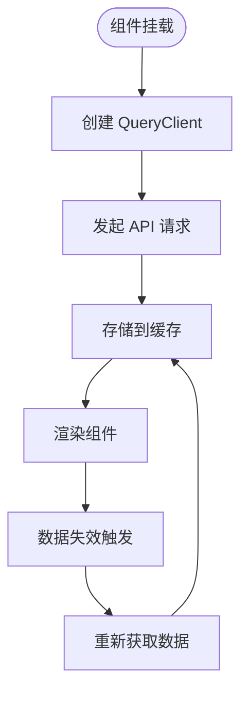
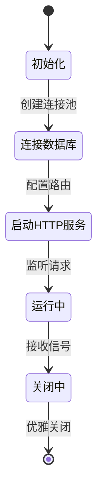
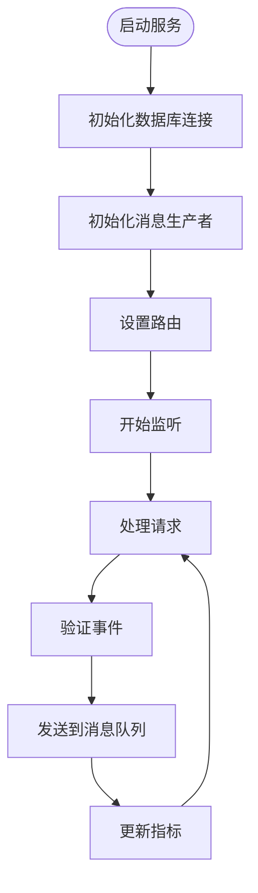
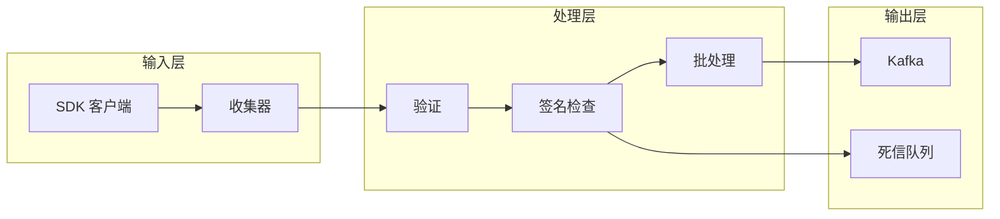
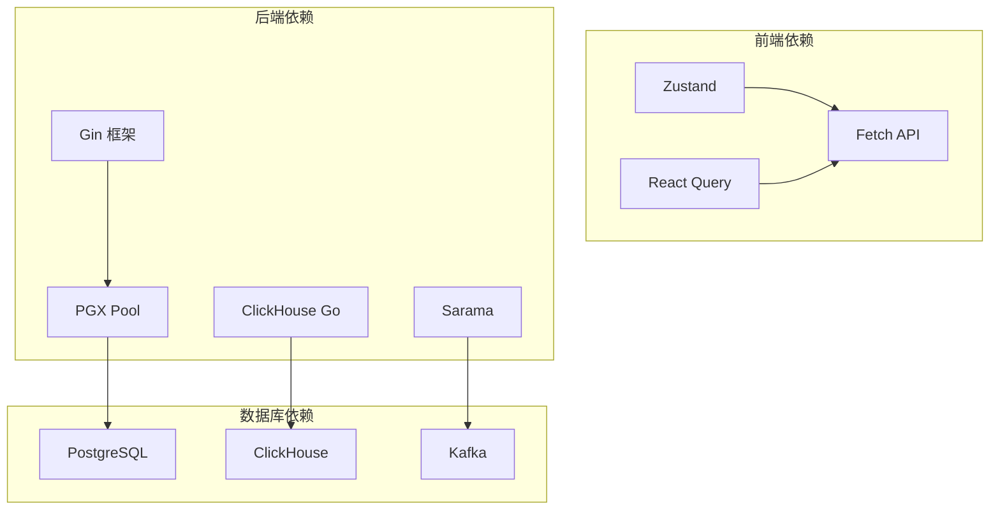
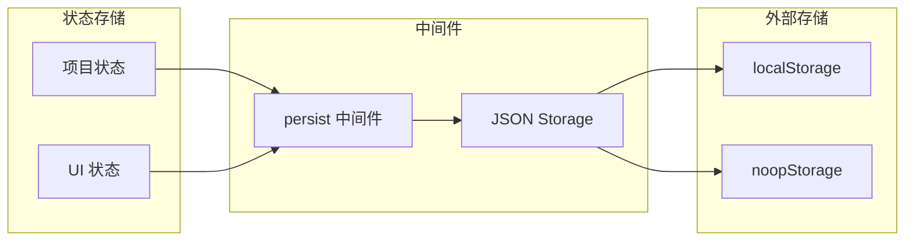

# 状态管理架构

<cite>
**本文档引用的文件**
- [main.go](file://server/api/cmd/main.go)
- [app.go](file://server/api/internal/app/app.go)
- [project.go](file://server/api/internal/handler/project.go)
- [governance.go](file://server/api/internal/handler/governance.go)
- [track.go](file://server/collector/internal/handler/track.go)
- [worker.go](file://server/consumer/internal/worker/worker.go)
- [project-store.ts](file://web/src/stores/project-store.ts)
- [ui-store.ts](file://web/src/stores/ui-store.ts)
- [api.ts](file://web/src/lib/api.ts)
- [providers.tsx](file://web/src/app/providers.tsx)
</cite>

## 目录
1. [引言](#引言)
2. [项目结构](#项目结构)
3. [核心组件](#核心组件)
4. [架构概览](#架构概览)
5. [详细组件分析](#详细组件分析)
6. [依赖关系分析](#依赖关系分析)
7. [性能考虑](#性能考虑)
8. [故障排除指南](#故障排除指南)
9. [结论](#结论)

## 引言

AeroLog 是一个实时事件分析平台，采用分层架构设计，通过状态管理实现从数据采集到分析展示的完整流程。该系统包含三个主要服务：API 服务、收集器服务和消费者服务，以及一个前端 Web 应用。

系统的核心状态管理体现在多个层面：
- **前端状态管理**：使用 Zustand 实现轻量级状态管理
- **后端服务状态**：通过应用生命周期管理各个服务组件
- **数据流状态**：通过消息队列实现异步数据处理
- **元数据状态**：通过数据库同步维护事件和属性定义

## 项目结构

AeroLog 采用模块化项目结构，每个服务都有独立的目录结构：

**图表来源**
- [main.go:13-25](file://server/api/cmd/main.go#L13-L25)
- [main.go:13-25](file://server/collector/cmd/main.go#L13-L25)
- [main.go:13-25](file://server/consumer/cmd/main.go#L13-L25)

**章节来源**
- [main.go:1-26](file://server/api/cmd/main.go#L1-L26)
- [main.go:1-26](file://server/collector/cmd/main.go#L1-L26)
- [main.go:1-26](file://server/consumer/cmd/main.go#L1-L26)

## 核心组件

### 前端状态管理系统

前端采用 Zustand 实现轻量级状态管理，包含两个主要状态存储：

#### 项目状态存储 (Project Store)
负责管理当前选中的项目信息，支持持久化存储到 localStorage。

#### UI 状态存储 (UI Store)
管理主题切换、侧边栏状态等界面相关状态，同样支持持久化。

#### API 客户端
提供统一的 API 访问接口，封装所有后端服务调用。

**章节来源**
- [project-store.ts:1-29](file://web/src/stores/project-store.ts#L1-L29)
- [ui-store.ts:1-69](file://web/src/stores/ui-store.ts#L1-L69)
- [api.ts:1-413](file://web/src/lib/api.ts#L1-L413)

### 后端服务架构

#### API 服务
提供 RESTful API 接口，处理项目管理、事件治理、分析查询等功能。

#### 收集器服务
接收来自 SDK 的事件数据，进行验证和签名检查，然后发送到消息队列。

#### 消费者服务
从消息队列消费事件数据，进行批处理和写入数据库。

**章节来源**
- [app.go:34-106](file://server/api/internal/app/app.go#L34-L106)
- [app.go:20-92](file://server/collector/internal/app/app.go#L20-L92)
- [app.go:17-79](file://server/consumer/internal/app/app.go#L17-L79)

## 架构概览

AeroLog 采用事件驱动的微服务架构，通过消息队列实现解耦：

**图表来源**
- [track.go:66-150](file://server/collector/internal/handler/track.go#L66-L150)
- [worker.go:94-156](file://server/consumer/internal/worker/worker.go#L94-L156)
- [app.go:108-119](file://server/api/internal/app/app.go#L108-L119)

## 详细组件分析

### 前端状态管理组件

#### Zustand 状态存储架构

**图表来源**
- [project-store.ts:6-22](file://web/src/stores/project-store.ts#L6-L22)
- [ui-store.ts:8-50](file://web/src/stores/ui-store.ts#L8-L50)

#### React Query 集成

前端使用 React Query 进行数据缓存和状态同步：

**图表来源**
- [providers.tsx:6-9](file://web/src/app/providers.tsx#L6-L9)

**章节来源**
- [project-store.ts:1-29](file://web/src/stores/project-store.ts#L1-L29)
- [ui-store.ts:1-69](file://web/src/stores/ui-store.ts#L1-L69)
- [providers.tsx:1-10](file://web/src/app/providers.tsx#L1-L10)

### 后端服务状态管理

#### API 服务生命周期管理

**图表来源**
- [app.go:44-106](file://server/api/internal/app/app.go#L44-L106)

#### 收集器服务状态流程

**图表来源**
- [app.go:30-107](file://server/collector/internal/app/app.go#L30-L107)
- [track.go:66-150](file://server/collector/internal/handler/track.go#L66-L150)

**章节来源**
- [app.go:1-160](file://server/api/internal/app/app.go#L1-L160)
- [app.go:1-108](file://server/collector/internal/app/app.go#L1-L108)
- [app.go:1-79](file://server/consumer/internal/app/app.go#L1-L79)

### 数据处理管道

#### 事件处理流水线

**图表来源**
- [track.go:66-150](file://server/collector/internal/handler/track.go#L66-L150)
- [worker.go:158-211](file://server/consumer/internal/worker/worker.go#L158-L211)

**章节来源**
- [track.go:1-327](file://server/collector/internal/handler/track.go#L1-L327)
- [worker.go:1-211](file://server/consumer/internal/worker/worker.go#L1-L211)

## 依赖关系分析

### 组件依赖图

**图表来源**
- [app.go:13-18](file://server/api/internal/app/app.go#L13-L18)
- [track.go:3-25](file://server/collector/internal/handler/track.go#L3-L25)

### 状态管理依赖

前端状态管理采用最小化依赖策略：

**图表来源**
- [project-store.ts:11-22](file://web/src/stores/project-store.ts#L11-L22)
- [ui-store.ts:19-50](file://web/src/stores/ui-store.ts#L19-L50)

**章节来源**
- [project-store.ts:1-29](file://web/src/stores/project-store.ts#L1-L29)
- [ui-store.ts:1-69](file://web/src/stores/ui-store.ts#L1-L69)

## 性能考虑

### 前端性能优化

1. **状态持久化**：使用 localStorage 减少重复加载
2. **按需加载**：组件懒加载和代码分割
3. **缓存策略**：React Query 提供智能缓存管理
4. **内存管理**：及时清理事件监听器和定时器

### 后端性能优化

1. **连接池管理**：数据库连接池复用
2. **批处理优化**：消息批处理减少 IO 操作
3. **异步处理**：消息队列实现异步数据处理
4. **指标监控**：内置 Prometheus 指标收集

## 故障排除指南

### 常见问题诊断

#### 前端状态问题
- 检查 localStorage 是否可用
- 验证 Zustand 存储配置
- 确认 React Query 缓存状态

#### 后端服务问题
- 监控数据库连接状态
- 检查消息队列连接
- 验证服务健康检查端点

**章节来源**
- [track.go:167-217](file://server/collector/internal/handler/track.go#L167-L217)
- [worker.go:194-211](file://server/consumer/internal/worker/worker.go#L194-L211)

## 结论

AeroLog 的状态管理架构体现了现代全栈应用的最佳实践：

1. **分层清晰**：前端、后端、基础设施各司其职
2. **解耦设计**：通过消息队列实现服务间解耦
3. **状态分离**：不同层次的状态管理职责明确
4. **可扩展性**：模块化设计便于功能扩展
5. **可观测性**：完善的日志和指标监控体系

该架构为实时事件分析场景提供了可靠的解决方案，通过合理的状态管理实现了系统的高可用性和高性能。