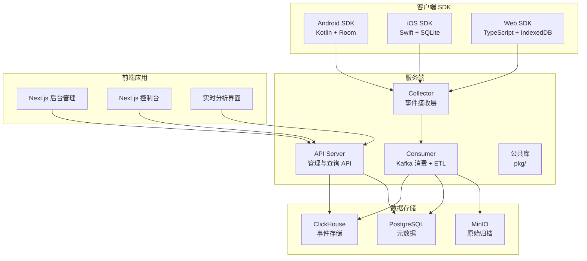
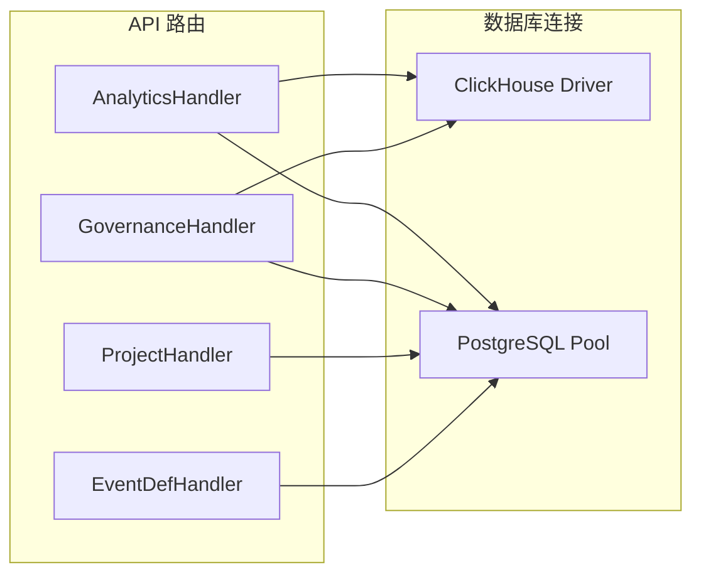
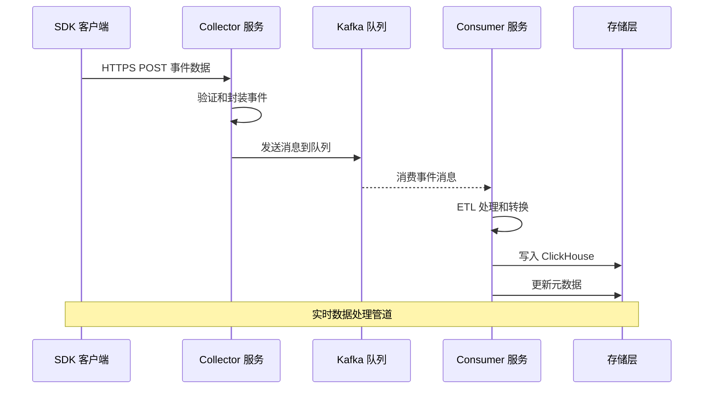
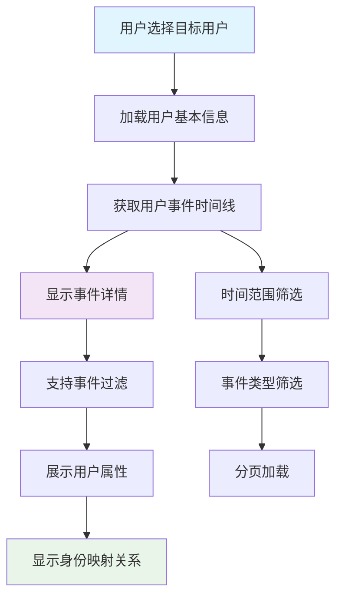
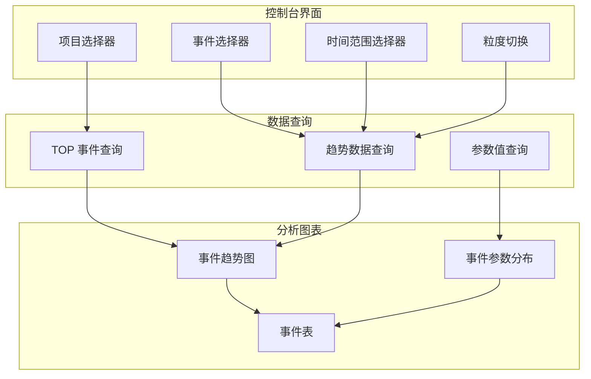
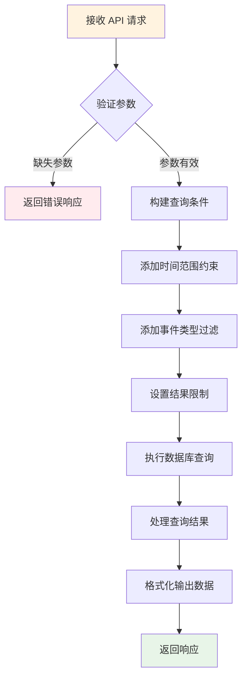
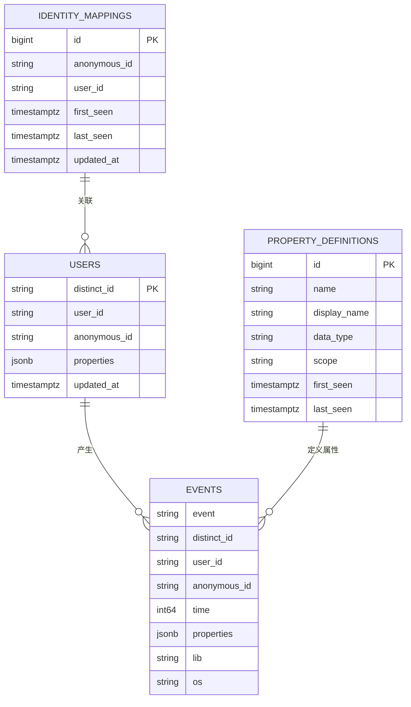
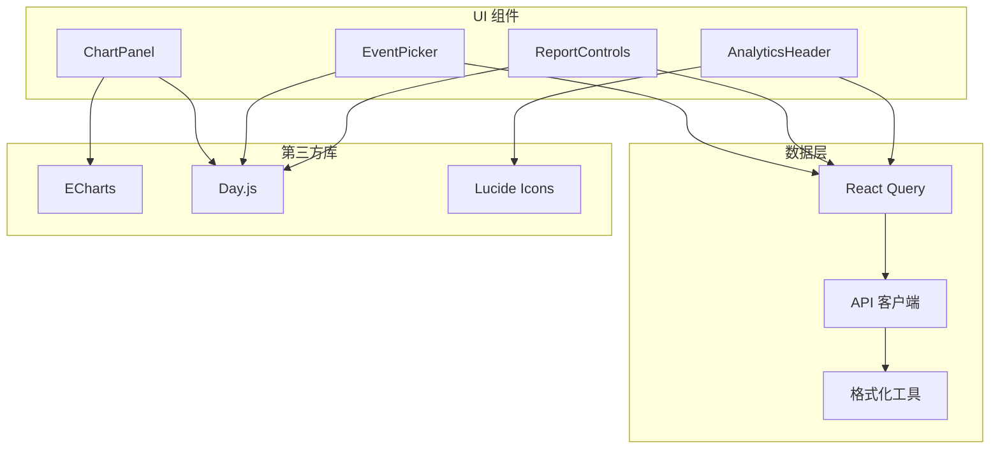
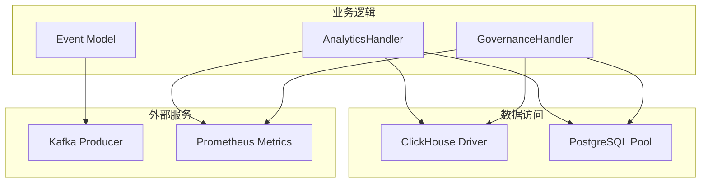
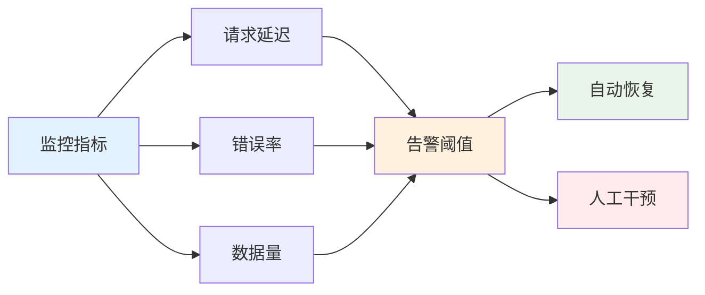

# 用户事件详情

<cite>
**本文档引用的文件**
- [README.md](file://README.md)
- [event.schema.json](file://docs/event.schema.json)
- [event.go](file://server/pkg/model/event.go)
- [analytics.go](file://server/api/internal/handler/analytics.go)
- [governance.go](file://server/api/internal/handler/governance.go)
- [app.go](file://server/api/internal/app/app.go)
- [track.go](file://server/collector/internal/handler/track.go)
- [page.tsx](file://web/src/app/console/event/page.tsx)
- [users-page.tsx](file://web/src/features/users/users-page.tsx)
- [analytics-ui.tsx](file://web/src/features/analytics/analytics-ui.tsx)
</cite>

## 目录
1. [简介](#简介)
2. [项目结构](#项目结构)
3. [核心组件](#核心组件)
4. [架构概览](#架构概览)
5. [详细组件分析](#详细组件分析)
6. [依赖关系分析](#依赖关系分析)
7. [性能考虑](#性能考虑)
8. [故障排除指南](#故障排除指南)
9. [结论](#结论)

## 简介

AeroLog 是一个自研的多端埋点平台，参考神策（Sensors Analytics）分层架构设计。该项目提供了完整的用户事件追踪和分析解决方案，支持 Android、iOS 和 Web 三个平台的 SDK，所有平台使用相同的上报协议。

用户事件详情功能是 AeroLog 的核心特性之一，它允许用户深入分析特定用户的事件行为，包括事件时间线、用户属性、身份映射等详细信息。该功能通过三层架构实现：SDK 层负责事件收集和离线缓存，服务端负责数据处理和存储，前端负责可视化展示。

## 项目结构

AeroLog 采用模块化的项目结构，主要分为以下几个部分：



**图表来源**
- [README.md:1-53](file://README.md#L1-L53)

项目的核心特点包括：
- **统一事件模型**：所有 SDK 使用相同的事件结构进行上报
- **分层架构**：清晰的职责分离，便于维护和扩展
- **高性能存储**：基于 ClickHouse 的 OLAP 数据库
- **实时处理**：通过 Kafka 实现高吞吐量的数据流处理

**章节来源**
- [README.md:6-22](file://README.md#L6-L22)

## 核心组件

### 事件模型定义

AeroLog 使用统一的事件模型来确保跨平台的一致性。事件结构包含以下关键字段：

```mermaid
classDiagram
class Event {
+EventType Type
+string Event
+string DistinctID
+string AnonymousID
+string UserID
+int64 Time
+Lib Lib
+map[string]interface{} Properties
+Validate() error
}
class EnvelopedEvent {
+uint32 ProjectID
+string IP
+string UserAgent
+int64 ReceivedAt
+Event Event
+MarshalKafka() []byte
+UnmarshalKafka([]byte) EnvelopedEvent
}
class Lib {
+string Name
+string Version
}
Event --> Lib : "包含"
EnvelopedEvent --> Event : "封装"
```

**图表来源**
- [event.go:27-83](file://server/pkg/model/event.go#L27-L83)

事件类型定义支持多种事件类别：
- `track`：普通行为事件
- `profile_set`：设置用户属性
- `profile_set_once`：一次性设置用户属性
- `profile_increment`：增量更新用户属性
- `profile_unset`：清除用户属性
- `profile_delete`：删除用户属性

**章节来源**
- [event.go:9-19](file://server/pkg/model/event.go#L9-L19)
- [event.go:27-37](file://server/pkg/model/event.go#L27-L37)

### API 服务架构

服务端采用 Gin 框架构建 RESTful API，提供完整的事件分析功能：



**图表来源**
- [app.go:113-119](file://server/api/internal/app/app.go#L113-L119)

## 架构概览

AeroLog 的整体数据流向如下：



**图表来源**
- [README.md:24-34](file://README.md#L24-L34)

系统的关键特性：
- **高并发写入**：Collector 支持高并发的事件接收
- **可靠传输**：使用 Kafka 确保消息不丢失
- **快速查询**：ClickHouse 提供高效的 OLAP 查询能力
- **元数据管理**：PostgreSQL 存储事件和属性定义

## 详细组件分析

### 用户事件详情页面

用户事件详情功能通过前端页面实现，提供完整的用户行为分析能力：



**图表来源**
- [users-page.tsx:241-307](file://web/src/features/users/users-page.tsx#L241-L307)

#### 页面组件结构

用户事件详情页面包含多个核心组件：

| 组件 | 功能 | 数据源 |
|------|------|--------|
| ProfileSheet | 用户画像详情面板 | API 用户详情接口 |
| EventTimelineItem | 事件时间线项 | 用户事件历史 |
| 时间范围选择器 | 日期时间筛选 | 本地状态管理 |
| 事件过滤器 | 事件名称过滤 | API 查询参数 |

**章节来源**
- [users-page.tsx:214-307](file://web/src/features/users/users-page.tsx#L214-L307)

### 事件分析控制台

事件分析控制台提供更全面的事件分析功能：



**图表来源**
- [page.tsx:124-296](file://web/src/app/console/event/page.tsx#L124-L296)

**章节来源**
- [page.tsx:25-296](file://web/src/app/console/event/page.tsx#L25-L296)

### API 查询逻辑

用户事件详情的后端查询逻辑实现了复杂的时间范围筛选和事件过滤：



**图表来源**
- [analytics.go:515-579](file://server/api/internal/handler/analytics.go#L515-L579)

查询优化策略：
- **索引利用**：基于 `project_id` 和 `time` 字段的复合索引
- **分页机制**：限制单次查询结果数量防止内存溢出
- **参数验证**：严格的输入参数验证和默认值处理

**章节来源**
- [analytics.go:515-579](file://server/api/internal/handler/analytics.go#L515-L579)

### 数据模型和存储

用户事件详情涉及多个数据表的关联查询：



**图表来源**
- [governance.go:120-188](file://server/api/internal/handler/governance.go#L120-L188)

## 依赖关系分析

### 前端依赖关系



**图表来源**
- [page.tsx:1-296](file://web/src/app/console/event/page.tsx#L1-L296)

### 后端依赖关系



**图表来源**
- [app.go:113-119](file://server/api/internal/app/app.go#L113-L119)

**章节来源**
- [app.go:113-159](file://server/api/internal/app/app.go#L113-L159)

## 性能考虑

### 查询性能优化

用户事件详情查询涉及大量数据的聚合和排序，需要特别关注性能优化：

1. **索引策略**
   - 在 `events` 表上建立 `(project_id, time)` 复合索引
   - 为 `distinct_id` 建立单独索引用于快速查找
   - 对 `event` 字段建立索引支持事件过滤

2. **查询优化**
   - 使用 `LIMIT` 限制结果集大小
   - 实施分页机制避免一次性加载过多数据
   - 利用 ClickHouse 的物化视图缓存常用查询结果

3. **缓存策略**
   - 前端使用 React Query 实现智能缓存
   - 缓存最近查询的用户事件数据
   - 实现缓存失效和更新机制

### 存储优化

1. **数据分区**
   - 按时间分区存储事件数据
   - 实施数据归档策略减少热数据存储压力

2. **压缩策略**
   - 使用列式存储减少磁盘占用
   - 实施数据压缩提高 I/O 性能

## 故障排除指南

### 常见问题诊断

1. **用户事件查询失败**
   - 检查 `distinct_id` 参数是否为空
   - 验证时间范围参数的有效性
   - 确认项目权限和访问令牌

2. **数据延迟问题**
   - 检查 Kafka 队列状态和消费者组
   - 验证 Consumer 服务的运行状态
   - 监控 ClickHouse 的数据同步进度

3. **前端数据显示异常**
   - 检查 API 响应状态码
   - 验证 JSON 数据格式正确性
   - 确认前端组件的状态管理

### 性能监控



**图表来源**
- [track.go:92-133](file://server/collector/internal/handler/track.go#L92-L133)

## 结论

AeroLog 的用户事件详情功能通过精心设计的架构实现了高效、可靠的用户行为分析能力。该功能的核心优势包括：

1. **统一的数据模型**：确保跨平台数据的一致性和可比性
2. **高性能的查询引擎**：基于 ClickHouse 的 OLAP 能力支持复杂的分析需求
3. **直观的用户界面**：提供丰富的可视化组件帮助用户理解数据
4. **完善的错误处理**：健壮的错误处理和监控机制确保系统稳定性

未来可以考虑的改进方向：
- 实现更细粒度的权限控制
- 增加更多高级分析功能
- 优化移动端的用户体验
- 扩展更多的数据导出格式

通过持续的优化和迭代，AeroLog 将能够为用户提供更加完善和便捷的用户事件分析解决方案。