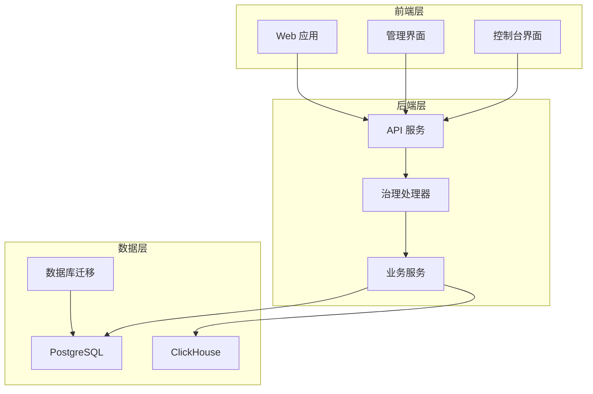
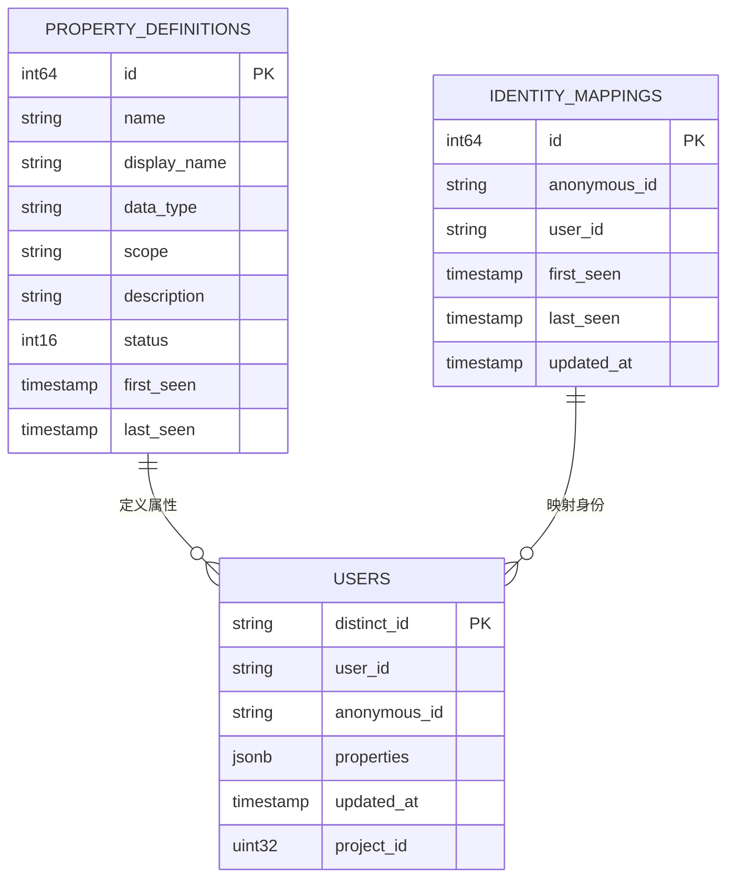
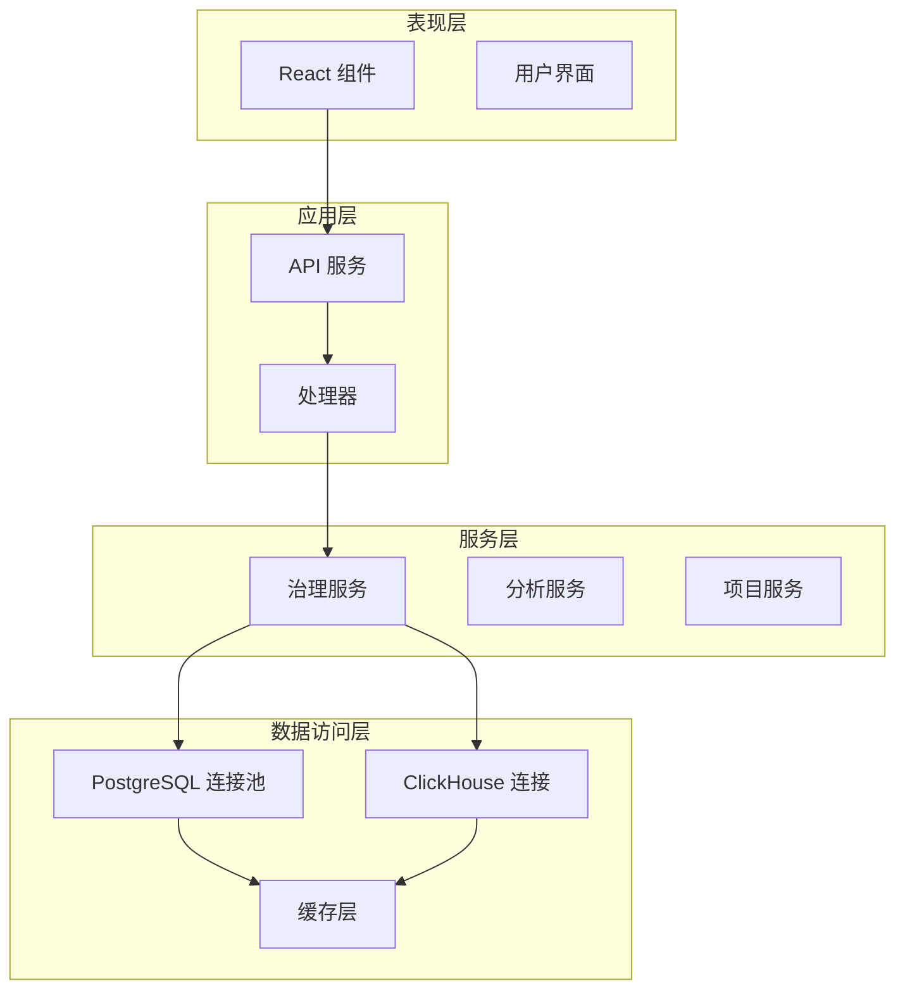
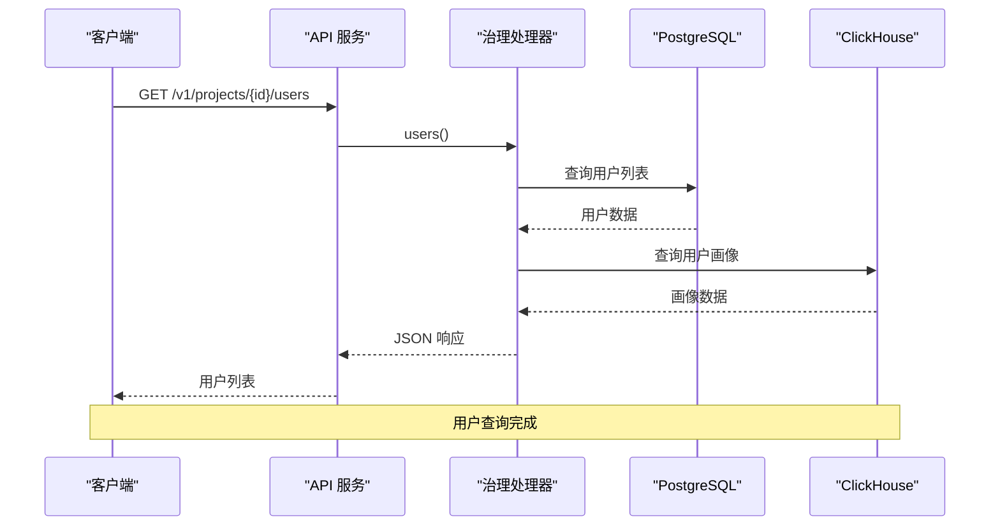
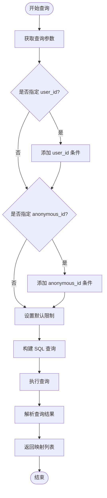
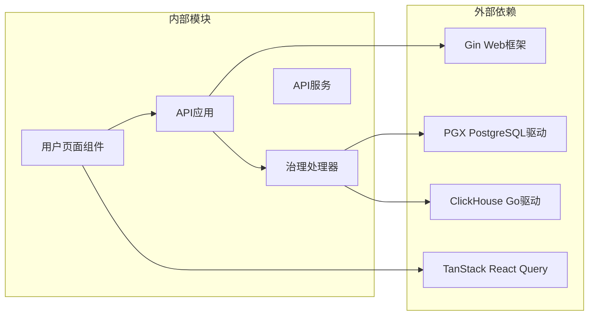

# 用户管理功能

<cite>
**本文档引用的文件**
- [users-page.tsx](file://web/src/features/users/users-page.tsx)
- [page.tsx](file://web/src/app/admin/users/page.tsx)
- [page.tsx](file://web/src/app/console/users/page.tsx)
- [governance.go](file://server/api/internal/handler/governance.go)
- [app.go](file://server/api/internal/app/app.go)
- [20260617_governance_metadata.sql](file://deploy/migrations/postgres/20260617_governance_metadata.sql)
</cite>

## 目录
1. [简介](#简介)
2. [项目结构](#项目结构)
3. [核心组件](#核心组件)
4. [架构概览](#架构概览)
5. [详细组件分析](#详细组件分析)
6. [依赖关系分析](#依赖关系分析)
7. [性能考虑](#性能考虑)
8. [故障排除指南](#故障排除指南)
9. [结论](#结论)

## 简介

AeroLog 是一个实时事件分析平台，用户管理功能是其核心模块之一。该功能允许用户查看和管理项目中的用户信息、身份映射以及用户属性配置。系统采用前后端分离架构，前端使用 Next.js 构建用户界面，后端使用 Go 语言开发 API 服务。

用户管理功能主要包含以下核心能力：
- 用户列表展示和搜索
- 用户身份映射查询
- 用户属性配置管理
- 用户画像分析
- 多项目用户管理

## 项目结构

AeroLog 项目采用模块化设计，用户管理功能分布在多个层次中：



**图表来源**
- [users-page.tsx:1-30](file://web/src/features/users/users-page.tsx#L1-L30)
- [governance.go:1-25](file://server/api/internal/handler/governance.go#L1-L25)
- [app.go:113-119](file://server/api/internal/app/app.go#L113-L119)

**章节来源**
- [users-page.tsx:1-30](file://web/src/features/users/users-page.tsx#L1-L30)
- [page.tsx:1-3](file://web/src/app/admin/users/page.tsx#L1-L3)
- [page.tsx:1-3](file://web/src/app/console/users/page.tsx#L1-L3)
- [governance.go:1-25](file://server/api/internal/handler/governance.go#L1-L25)
- [app.go:113-119](file://server/api/internal/app/app.go#L113-L119)

## 核心组件

### 前端用户页面组件

用户管理功能的前端实现位于 `web/src/features/users/users-page.tsx` 文件中，这是一个 React 客户端组件，提供了完整的用户管理界面。

**主要特性：**
- 实时用户数据查询和展示
- 搜索和过滤功能
- 用户详情面板
- 项目选择器集成
- 响应式设计支持

### 后端治理处理器

后端的用户管理逻辑由 `governance.go` 文件中的 `GovernanceHandler` 结构体实现，提供 RESTful API 接口。

**核心接口：**
- `/projects/:id/users` - 获取项目用户列表
- `/projects/:id/users/:distinct_id/profile` - 获取用户画像
- `/projects/:id/identities` - 查询身份映射
- `/projects/:id/properties` - 获取属性定义

### 数据库架构

用户管理功能依赖于 PostgreSQL 和 ClickHouse 的混合存储架构：



**图表来源**
- [20260617_governance_metadata.sql](file://deploy/migrations/postgres/20260617_governance_metadata.sql)

**章节来源**
- [users-page.tsx:21-30](file://web/src/features/users/users-page.tsx#L21-L30)
- [governance.go:14-25](file://server/api/internal/handler/governance.go#L14-L25)
- [20260617_governance_metadata.sql](file://deploy/migrations/postgres/20260617_governance_metadata.sql)

## 架构概览

用户管理功能采用分层架构设计，确保了良好的可维护性和扩展性：



**图表来源**
- [app.go:113-119](file://server/api/internal/app/app.go#L113-L119)
- [governance.go:14-18](file://server/api/internal/handler/governance.go#L14-L18)

## 详细组件分析

### 用户页面组件分析

用户页面组件是一个功能完整的 React 组件，实现了用户管理的所有核心功能：

```mermaid
classDiagram
class UsersPage {
+useState projectId
+useState query
+useState submittedQuery
+useState selected
+useEffect projects
+useQuery users
+render() JSX.Element
}
class UserProfile {
+string distinct_id
+string user_id
+string anonymous_id
+map[string]interface{} properties
+time updated_at
}
class IdentityMapping {
+string anonymous_id
+string user_id
+time first_seen
+time last_seen
+time updated_at
}
UsersPage --> UserProfile : "显示"
UsersPage --> IdentityMapping : "查询"
```

**图表来源**
- [users-page.tsx:21-30](file://web/src/features/users/users-page.tsx#L21-L30)
- [governance.go:143-149](file://server/api/internal/handler/governance.go#L143-L149)

#### 用户查询流程

用户查询功能通过以下流程实现：



**图表来源**
- [governance.go:120-160](file://server/api/internal/handler/governance.go#L120-L160)

#### 身份映射查询流程

身份映射查询支持多种过滤条件：



**图表来源**
- [governance.go:74-93](file://server/api/internal/handler/governance.go#L74-L93)

**章节来源**
- [users-page.tsx:21-30](file://web/src/features/users/users-page.tsx#L21-L30)
- [governance.go:74-160](file://server/api/internal/handler/governance.go#L74-L160)

### 治理处理器分析

治理处理器是用户管理功能的核心后端组件，负责处理所有用户相关的 API 请求：

```mermaid
classDiagram
class GovernanceHandler {
+PG pgxpool.Pool
+CH driver.Conn
+Register(router) void
+properties(context) void
+identities(context) void
+users(context) void
+profile(context) void
-parseJSONProps(raw) map
-clampLimit(raw, min, max) int
}
class UserProfile {
+string distinct_id
+string user_id
+string anonymous_id
+map[string]interface{} properties
+time updated_at
}
class PropertyDef {
+int64 id
+string name
+string display_name
+string data_type
+string scope
+string description
+int16 status
+time first_seen
+time last_seen
}
GovernanceHandler --> UserProfile : "创建"
GovernanceHandler --> PropertyDef : "创建"
```

**图表来源**
- [governance.go:14-25](file://server/api/internal/handler/governance.go#L14-L25)
- [governance.go:53-72](file://server/api/internal/handler/governance.go#L53-L72)

#### API 接口设计

治理处理器提供以下 RESTful API 接口：

| 接口 | 方法 | 描述 | 参数 |
|------|------|------|------|
| `/projects/:id/properties` | GET | 获取属性定义 | scope(event,user) |
| `/projects/:id/identities` | GET | 查询身份映射 | user_id, anonymous_id, limit |
| `/projects/:id/users` | GET | 获取用户列表 | - |
| `/projects/:id/users/:distinct_id/profile` | GET | 获取用户画像 | - |

**章节来源**
- [governance.go:20-25](file://server/api/internal/handler/governance.go#L20-L25)
- [governance.go:27-72](file://server/api/internal/handler/governance.go#L27-L72)

### 数据模型分析

用户管理功能涉及多个核心数据表，每个表都有特定的用途和关系：

#### 属性定义表 (property_definitions)

属性定义表存储用户和事件属性的元数据信息：

| 字段名 | 类型 | 描述 | 约束 |
|--------|------|------|------|
| id | int64 | 主键 | PRIMARY KEY |
| name | string | 属性名称 | NOT NULL |
| display_name | string | 显示名称 | DEFAULT '' |
| data_type | string | 数据类型 | NOT NULL |
| scope | string | 作用域 | NOT NULL |
| description | string | 描述信息 | DEFAULT '' |
| status | int16 | 状态 | NOT NULL |
| first_seen | timestamp | 首次出现时间 | |
| last_seen | timestamp | 最后出现时间 | |

#### 身份映射表 (identity_mappings)

身份映射表记录匿名用户和已登录用户之间的关联关系：

| 字段名 | 类型 | 描述 | 约束 |
|--------|------|------|------|
| id | int64 | 主键 | PRIMARY KEY |
| anonymous_id | string | 匿名用户ID | NOT NULL |
| user_id | string | 用户ID | NOT NULL |
| first_seen | timestamp | 首次关联时间 | |
| last_seen | timestamp | 最后关联时间 | |
| updated_at | timestamp | 更新时间 | NOT NULL |

#### 用户表 (users)

用户表存储用户的最终识别信息和属性：

| 字段名 | 类型 | 描述 | 约束 |
|--------|------|------|------|
| distinct_id | string | 最终用户ID | PRIMARY KEY |
| user_id | string | 已登录用户ID | |
| anonymous_id | string | 匿名用户ID | |
| properties | jsonb | 用户属性 | NOT NULL |
| updated_at | timestamp | 更新时间 | NOT NULL |
| project_id | uint32 | 项目ID | NOT NULL |

**章节来源**
- [20260617_governance_metadata.sql](file://deploy/migrations/postgres/20260617_governance_metadata.sql)

## 依赖关系分析

用户管理功能的依赖关系体现了清晰的分层架构：



**图表来源**
- [users-page.tsx:4-6](file://web/src/features/users/users-page.tsx#L4-L6)
- [governance.go:3-12](file://server/api/internal/handler/governance.go#L3-L12)
- [app.go:113-119](file://server/api/internal/app/app.go#L113-L119)

**章节来源**
- [users-page.tsx:4-6](file://web/src/features/users/users-page.tsx#L4-L6)
- [governance.go:3-12](file://server/api/internal/handler/governance.go#L3-L12)
- [app.go:113-119](file://server/api/internal/app/app.go#L113-L119)

## 性能考虑

用户管理功能在设计时充分考虑了性能优化：

### 查询优化策略

1. **索引优化**
   - 在 `property_definitions` 表上建立复合索引以加速属性查询
   - 在 `identity_mappings` 表上优化查询条件字段索引
   - 在 `users` 表上使用适当的分区策略

2. **缓存策略**
   - 使用 Redis 缓存常用的属性定义
   - 实现查询结果缓存机制
   - 支持响应式缓存失效

3. **连接池管理**
   - PostgreSQL 使用连接池避免频繁连接
   - ClickHouse 连接复用优化
   - 连接超时和重试机制

### 前端性能优化

1. **懒加载**
   - 用户详情面板按需加载
   - 分页加载大量用户数据
   - 图表组件延迟渲染

2. **状态管理**
   - 使用 React Query 管理服务器状态
   - 实现智能缓存策略
   - 支持自动刷新和手动刷新

## 故障排除指南

### 常见问题及解决方案

#### 用户数据查询失败

**症状：** 用户列表无法加载或显示错误

**可能原因：**
1. PostgreSQL 连接异常
2. 查询参数不正确
3. 数据库权限不足

**解决步骤：**
1. 检查数据库连接状态
2. 验证项目ID的有效性
3. 确认用户权限设置

#### 用户画像获取错误

**症状：** 用户详情页面显示 "未找到"

**可能原因：**
1. 用户ID不存在
2. ClickHouse 查询超时
3. 数据同步延迟

**解决步骤：**
1. 验证用户ID格式
2. 检查数据同步状态
3. 查看查询日志

#### 身份映射查询异常

**症状：** 身份映射结果不准确

**可能原因：**
1. 查询条件冲突
2. 数据重复
3. 时间戳问题

**解决步骤：**
1. 清晰化查询条件
2. 检查数据去重逻辑
3. 验证时间戳一致性

**章节来源**
- [governance.go:47-49](file://server/api/internal/handler/governance.go#L47-L49)
- [governance.go:182-184](file://server/api/internal/handler/governance.go#L182-L184)

## 结论

AeroLog 的用户管理功能展现了现代数据分析平台的最佳实践。通过前后端分离架构、清晰的分层设计和完善的性能优化策略，该功能能够高效地处理大规模用户数据的查询和管理需求。

### 主要优势

1. **架构清晰** - 分层设计确保了代码的可维护性和可扩展性
2. **性能优异** - 多种优化策略保证了系统的高性能运行
3. **用户体验好** - 响应式界面和实时数据更新提升了用户体验
4. **数据安全** - 完善的权限控制和数据保护机制

### 未来改进方向

1. **增强搜索功能** - 支持更复杂的用户属性搜索
2. **批量操作** - 添加用户数据的批量管理功能
3. **审计日志** - 记录重要的用户管理操作
4. **API 扩展** - 支持更多的用户管理 API 接口

该用户管理功能为 AeroLog 平台提供了坚实的基础，能够满足各种规模企业的用户数据分析和管理需求。