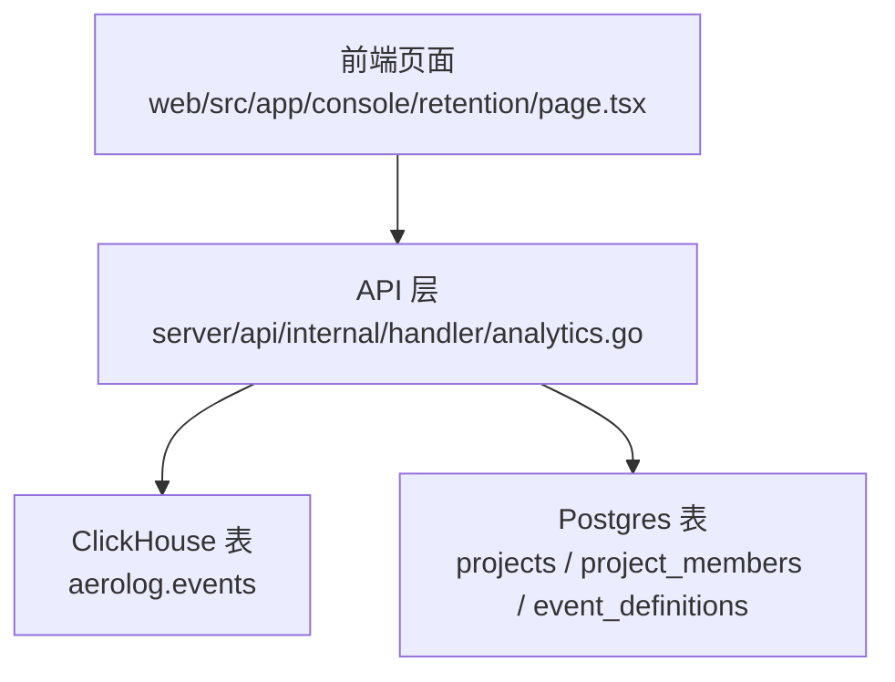
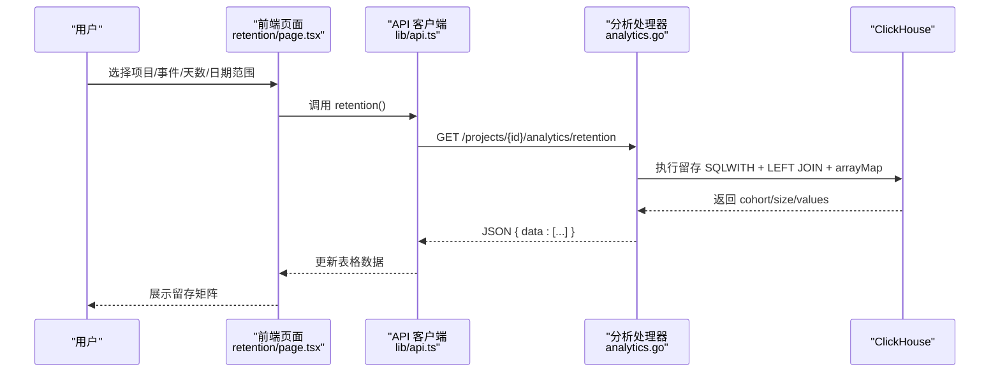
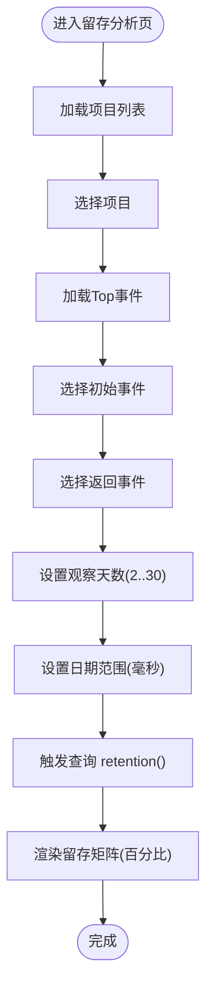
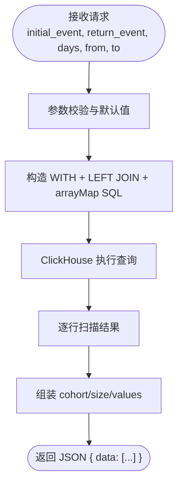
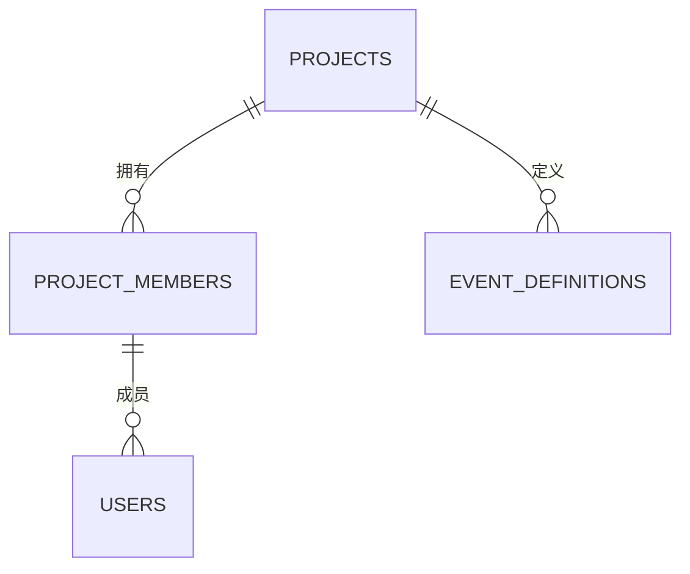
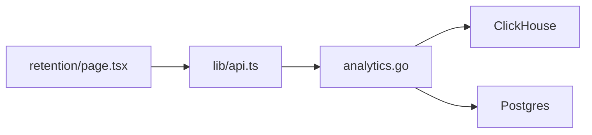

# 留存分析功能

<cite>
**本文引用的文件**
- [web/src/app/console/retention/page.tsx](file://web/src/app/console/retention/page.tsx)
- [web/src/lib/api.ts](file://web/src/lib/api.ts)
- [server/api/internal/handler/analytics.go](file://server/api/internal/handler/analytics.go)
- [deploy/init/clickhouse/01_schema.sql](file://deploy/init/clickhouse/01_schema.sql)
- [deploy/init/postgres/01_schema.sql](file://deploy/init/postgres/01_schema.sql)
</cite>

## 目录
1. [简介](#简介)
2. [项目结构](#项目结构)
3. [核心组件](#核心组件)
4. [架构总览](#架构总览)
5. [详细组件分析](#详细组件分析)
6. [依赖分析](#依赖分析)
7. [性能考虑](#性能考虑)
8. [故障排查指南](#故障排查指南)
9. [结论](#结论)
10. [附录](#附录)

## 简介
本文件面向产品运营与数据分析人员，系统性介绍 AeroLog 留存分析功能的界面设计、数据展示方式、算法原理与配置项，并结合现有实现给出可操作的应用建议与优化方向。当前版本提供“留存矩阵”与“时间轴趋势”的基础能力，尚未包含用户分群与留存预测模块。

## 项目结构
留存分析功能由前端页面、API 层与存储层构成：
- 前端页面负责参数选择、表格渲染与交互；
- API 层提供分析接口，封装 ClickHouse 查询；
- 存储层包含 ClickHouse 事件明细表与 Postgres 项目/成员/事件元数据表。

**图表来源**
- [web/src/app/console/retention/page.tsx:17-127](file://web/src/app/console/retention/page.tsx#L17-L127)
- [server/api/internal/handler/analytics.go:27-32](file://server/api/internal/handler/analytics.go#L27-L32)
- [deploy/init/clickhouse/01_schema.sql:6-49](file://deploy/init/clickhouse/01_schema.sql#L6-L49)
- [deploy/init/postgres/01_schema.sql:30-51](file://deploy/init/postgres/01_schema.sql#L30-L51)

**章节来源**
- [web/src/app/console/retention/page.tsx:17-127](file://web/src/app/console/retention/page.tsx#L17-L127)
- [server/api/internal/handler/analytics.go:27-32](file://server/api/internal/handler/analytics.go#L27-L32)
- [deploy/init/clickhouse/01_schema.sql:6-49](file://deploy/init/clickhouse/01_schema.sql#L6-L49)
- [deploy/init/postgres/01_schema.sql:30-51](file://deploy/init/postgres/01_schema.sql#L30-L51)

## 核心组件
- 留存分析页面（React 组件）
  - 支持项目选择、初始事件与返回事件选择、观察天数与日期范围配置；
  - 渲染“留存矩阵”表格，按“同期日”“用户数”“Day0..DayN”展示；
  - 使用 React Query 缓存与并发请求，支持滚动与分页。
- API 分析处理器（Go Gin）
  - 提供 /analytics/retention 接口，执行 ClickHouse SQL 计算留存；
  - 参数校验与默认值处理（days、from/to）。
- 数据模型
  - ClickHouse 事件明细表 aerolog.events 包含时间、事件名、去重标识等；
  - Postgres 项目与事件元数据表用于项目管理与事件定义。

**章节来源**
- [web/src/app/console/retention/page.tsx:17-127](file://web/src/app/console/retention/page.tsx#L17-L127)
- [server/api/internal/handler/analytics.go:201-283](file://server/api/internal/handler/analytics.go#L201-L283)
- [deploy/init/clickhouse/01_schema.sql:6-49](file://deploy/init/clickhouse/01_schema.sql#L6-L49)
- [deploy/init/postgres/01_schema.sql:30-51](file://deploy/init/postgres/01_schema.sql#L30-L51)

## 架构总览
前端通过统一 API 客户端调用后端分析接口，后端连接 ClickHouse 执行聚合查询，返回留存矩阵数据。

**图表来源**
- [web/src/app/console/retention/page.tsx:46-57](file://web/src/app/console/retention/page.tsx#L46-L57)
- [web/src/lib/api.ts:85-105](file://web/src/lib/api.ts#L85-L105)
- [server/api/internal/handler/analytics.go:201-283](file://server/api/internal/handler/analytics.go#L201-L283)

## 详细组件分析

### 界面与交互（前端）
- 参数控制区
  - 项目选择：从项目列表中选择目标项目；
  - 初始事件与返回事件：来自 Top 事件接口，支持搜索；
  - 观察天数：2–30，默认7；
  - 日期范围：起止时间均以毫秒时间戳传递。
- 表格展示
  - 固定列：同期日、用户数；
  - 动态列：Day0..DayN，单元格显示“当日留存率 = 当日返回人数 / 同期日用户数 × 100%”。

**图表来源**
- [web/src/app/console/retention/page.tsx:17-127](file://web/src/app/console/retention/page.tsx#L17-L127)

**章节来源**
- [web/src/app/console/retention/page.tsx:17-127](file://web/src/app/console/retention/page.tsx#L17-L127)

### API 与数据流（后端）
- 接口注册与路由
  - /projects/:id/analytics/retention 由 AnalyticsHandler 注册。
- 请求参数与校验
  - initial_event、return_event 必填；
  - days 默认7，限制在 1..30；
  - from/to 默认当前时间，未提供时按 days 推导起始时间。
- SQL 计算逻辑
  - 使用 WITH 子句提取“初始事件当天首次发生”的用户集合；
  - 左连接返回事件，限定日期范围；
  - 使用 arrayMap 与 dateDiff 对每个 cohort 按偏移天数统计返回人数；
  - 最终按 cohort 分组输出 size（同期日用户数）与 values（各 Day 的返回人数数组）。

**图表来源**
- [server/api/internal/handler/analytics.go:201-283](file://server/api/internal/handler/analytics.go#L201-L283)

**章节来源**
- [server/api/internal/handler/analytics.go:27-32](file://server/api/internal/handler/analytics.go#L27-L32)
- [server/api/internal/handler/analytics.go:201-283](file://server/api/internal/handler/analytics.go#L201-L283)

### 数据模型（存储层）
- ClickHouse
  - aerolog.events：按 project_id+月 分区，包含事件名、去重标识、时间、上下文字段与业务属性；
  - aerolog.users：用户属性表，按更新时间覆盖。
- Postgres
  - projects / project_members：项目与成员关系；
  - event_definitions：事件元数据（名称、显示名、状态等）。

**图表来源**
- [deploy/init/postgres/01_schema.sql:30-51](file://deploy/init/postgres/01_schema.sql#L30-L51)
- [deploy/init/clickhouse/01_schema.sql:6-49](file://deploy/init/clickhouse/01_schema.sql#L6-L49)

**章节来源**
- [deploy/init/clickhouse/01_schema.sql:6-49](file://deploy/init/clickhouse/01_schema.sql#L6-L49)
- [deploy/init/postgres/01_schema.sql:30-51](file://deploy/init/postgres/01_schema.sql#L30-L51)

## 依赖分析
- 前端依赖
  - 使用 Ant Design 组件（Select、DatePicker、InputNumber、Table）；
  - 使用 @tanstack/react-query 管理查询缓存与并发；
  - 使用 dayjs 处理日期范围。
- 后端依赖
  - Gin 路由与响应；
  - ClickHouse Go 驱动进行查询；
  - 参数解析与默认值处理。
- 存储依赖
  - aerolog.events 作为分析主表；
  - 项目与事件元数据来源于 Postgres。

**图表来源**
- [web/src/app/console/retention/page.tsx:17-127](file://web/src/app/console/retention/page.tsx#L17-L127)
- [web/src/lib/api.ts:85-105](file://web/src/lib/api.ts#L85-L105)
- [server/api/internal/handler/analytics.go:27-32](file://server/api/internal/handler/analytics.go#L27-L32)

**章节来源**
- [web/src/app/console/retention/page.tsx:17-127](file://web/src/app/console/retention/page.tsx#L17-L127)
- [web/src/lib/api.ts:85-105](file://web/src/lib/api.ts#L85-L105)
- [server/api/internal/handler/analytics.go:27-32](file://server/api/internal/handler/analytics.go#L27-L32)

## 性能考虑
- 查询性能
  - aerolog.events 按 project_id+月 分区，建议按项目与时间范围精确过滤；
  - 使用 toDate(time) 与 GROUP BY distinct_id 控制聚合规模；
  - arrayMap + uniqExactIf 在大宽表场景可能产生高基数，建议限制 days 与数据量。
- 前端性能
  - 表格固定左侧两列，开启横向滚动，避免列过多导致渲染卡顿；
  - 使用 React Query 缓存减少重复请求。
- 存储与索引
  - aerolog.events 的排序键与分区策略有助于快速按时间与事件过滤；
  - 如需更细粒度的用户分群，可在 ClickHouse 中建立物化视图或预聚合表。

[本节为通用指导，不直接分析具体文件]

## 故障排查指南
- 常见错误与定位
  - 缺少 initial_event 或 return_event：后端返回错误提示；
  - days 超出范围：后端强制回退到默认值；
  - ClickHouse 查询异常：检查 aerolog.events 是否存在对应项目与事件数据。
- 建议排查步骤
  - 确认项目 ID 正确；
  - 确认初始事件与返回事件存在于 Top 事件列表；
  - 检查时间范围是否合理；
  - 查看浏览器网络面板与后端日志。

**章节来源**
- [server/api/internal/handler/analytics.go:207-214](file://server/api/internal/handler/analytics.go#L207-L214)
- [server/api/internal/handler/analytics.go:265-267](file://server/api/internal/handler/analytics.go#L265-L267)

## 结论
当前版本的留存分析功能提供了直观的“留存矩阵”视图与灵活的参数配置，能够满足基础的留存观测需求。若需进一步提升分析深度，建议在现有基础上扩展用户分群与留存预测能力，并持续优化查询性能与数据模型。

[本节为总结性内容，不直接分析具体文件]

## 附录

### 留存矩阵与时间轴图表说明
- 留存矩阵
  - 行：每个“同期日”（初始事件当天）的用户集合；
  - 列：Day0..DayN 的返回人数，单元格显示当日留存率；
  - 适用场景：评估关键行为在短期内的回访情况。
- 时间轴图表
  - 当前页面未内置时间轴图表组件，但可基于趋势接口自行扩展；
  - 建议：复用趋势接口返回的时间序列数据，绘制折线图展示每日返回人数/比例。

**章节来源**
- [web/src/app/console/retention/page.tsx:59-77](file://web/src/app/console/retention/page.tsx#L59-L77)
- [web/src/lib/api.ts:57-69](file://web/src/lib/api.ts#L57-L69)

### 留存计算算法与配置
- 算法要点
  - 以“初始事件发生当天”为 cohort；
  - 计算从 Day0 到 DayN 的返回人数，按 cohort 用户数换算留存率；
  - 使用 LEFT JOIN 保留 cohort 内无返回的用户。
- 配置选项
  - 观察期：days（2–30，默认7）；
  - 计算周期：from/to（毫秒时间戳，默认最近 N 天）；
  - 归因规则：以“初始事件当天”为起点，按自然日偏移匹配返回事件。

**章节来源**
- [server/api/internal/handler/analytics.go:201-283](file://server/api/internal/handler/analytics.go#L201-L283)
- [web/src/lib/api.ts:85-105](file://web/src/lib/api.ts#L85-L105)

### 用户分群策略（当前实现与建议）
- 当前实现
  - 未提供用户分群功能，留存计算基于事件维度；
  - 可通过事件元数据表维护事件定义，辅助识别关键事件。
- 建议方案
  - 新用户定义：以“首日行为”或“注册/激活”事件作为 cohort；
  - 活跃度标准：按用户在 cohort 期间的行为频次/时长划分；
  - 特征筛选：结合 aerolog.users 的属性字段进行维度过滤；
  - 实施路径：在 ClickHouse 中增加物化视图或预聚合表，按分群维度输出留存指标。

**章节来源**
- [deploy/init/postgres/01_schema.sql:39-51](file://deploy/init/postgres/01_schema.sql#L39-L51)
- [deploy/init/clickhouse/01_schema.sql:52-60](file://deploy/init/clickhouse/01_schema.sql#L52-L60)

### 留存预测与趋势分析（当前实现与建议）
- 当前实现
  - 未提供留存预测功能；
  - 可基于趋势接口输出每日返回人数，用于趋势观察。
- 建议方案
  - 趋势分析：对留存矩阵按列求和或按行标准化，生成多维趋势；
  - 预测方法：基于历史序列拟合指数/多项式模型，外推未来 N 天；
  - 指标口径：建议补充“累计留存率”“周留存率”等常用口径。

**章节来源**
- [web/src/lib/api.ts:57-69](file://web/src/lib/api.ts#L57-L69)

### 在产品运营中的应用与优化建议
- 应用场景
  - 新功能上线后评估首日/首周回访；
  - 活动运营后追踪用户回归；
  - 产品迭代后对比不同版本的留存差异。
- 优化建议
  - 明确关键事件：优先分析“激活/转化/付费”等核心事件；
  - 控制观察期：结合业务节奏设定合理的 days；
  - 结合分群：按渠道/版本/用户属性细分，洞察差异；
  - 自动化报表：定期导出留存矩阵，形成周报/月报基线。

[本节为通用指导，不直接分析具体文件]