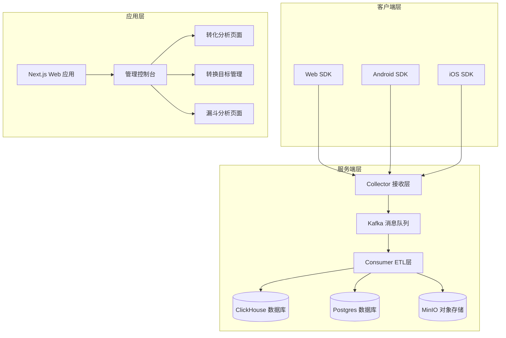
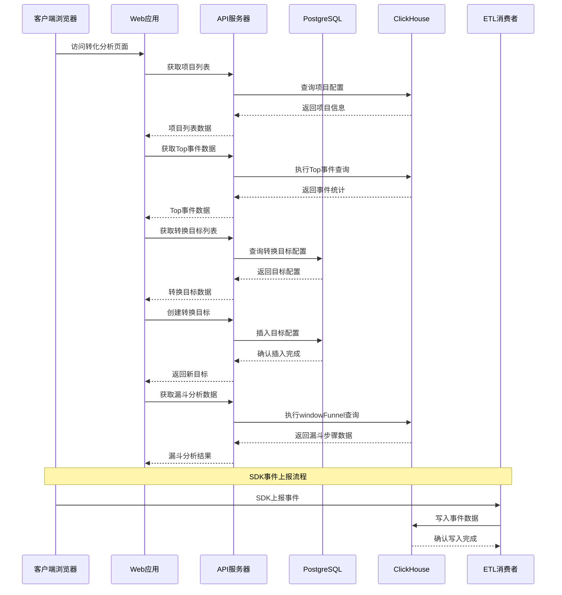
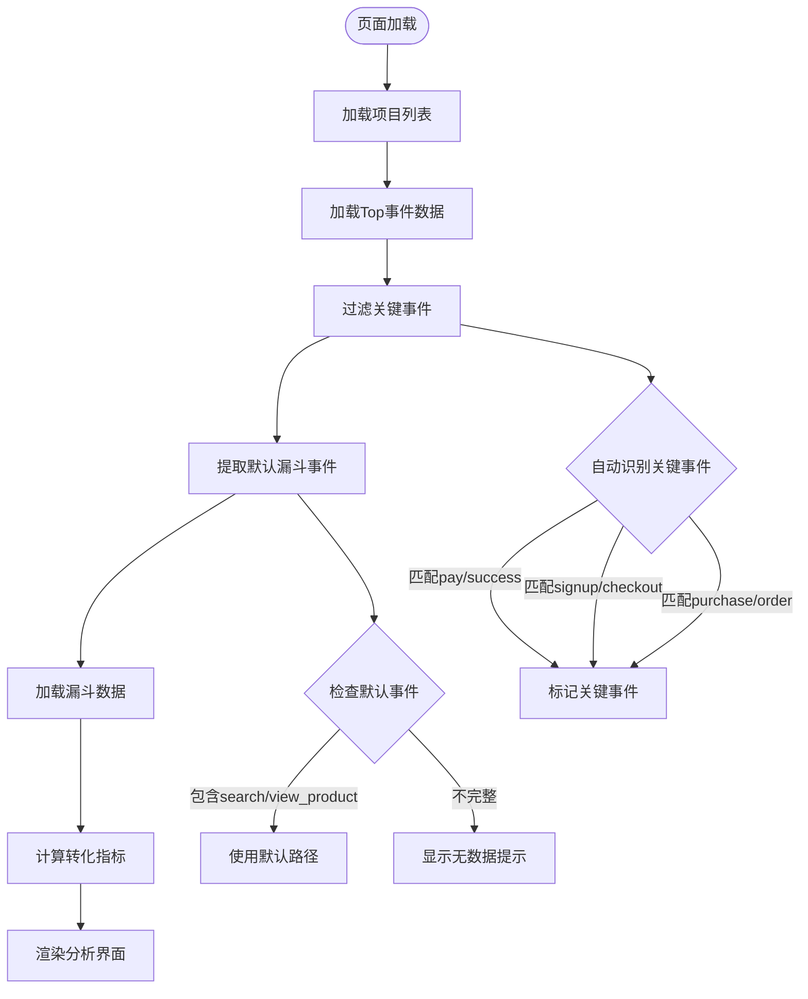
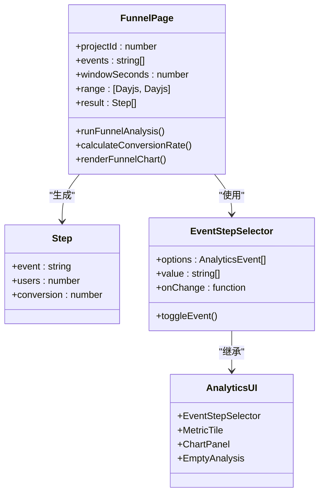
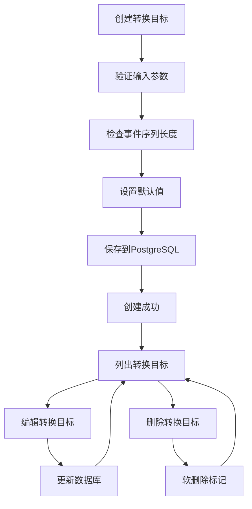
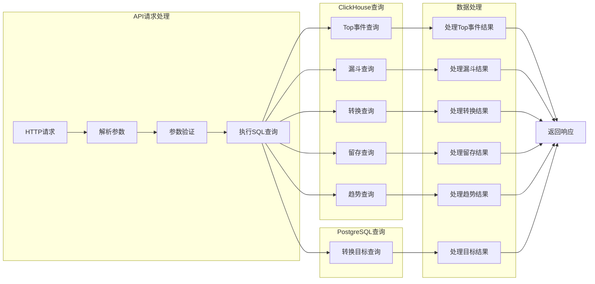
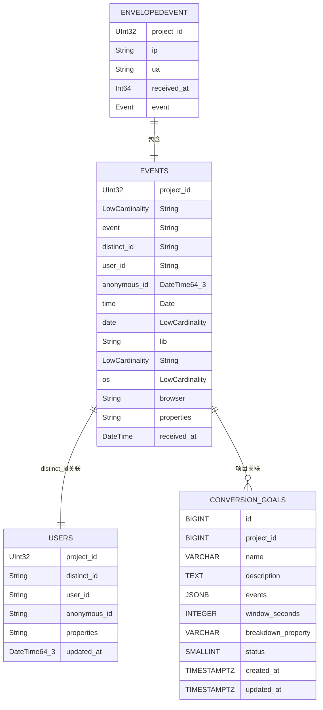
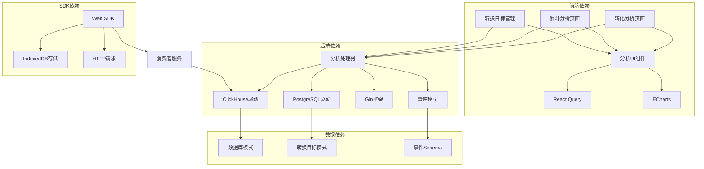

# 转化分析功能

<cite>
**本文档引用的文件**
- [README.md](file://README.md)
- [conversions/page.tsx](file://web/src/app/console/conversions/page.tsx)
- [funnel/page.tsx](file://web/src/app/console/funnel/page.tsx)
- [analytics.go](file://server/api/internal/handler/analytics.go)
- [app.go](file://server/api/internal/app/app.go)
- [etl.go](file://server/consumer/internal/etl/etl.go)
- [index.ts](file://sdk/web/src/index.ts)
- [analytics-ui.tsx](file://web/src/features/analytics/analytics-ui.tsx)
- [event.go](file://server/pkg/model/event.go)
- [01_schema.sql](file://deploy/init/clickhouse/01_schema.sql)
- [01_schema.sql](file://deploy/init/postgres/01_schema.sql)
- [20260617_governance_metadata.sql](file://deploy/migrations/postgres/20260617_governance_metadata.sql)
- [20260617_user_identity.sql](file://deploy/migrations/clickhouse/20260617_user_identity.sql)
- [api.ts](file://web/src/lib/api.ts)
- [storage.ts](file://sdk/web/src/storage.ts)
- [main.go](file://server/collector/cmd/main.go)
- [main.go](file://server/consumer/cmd/main.go)
- [protocol.md](file://docs/protocol.md)
</cite>

## 更新摘要
**所做更改**
- 新增转换目标系统（Conversion Goals）的完整实现
- 添加PostgreSQL表结构和RESTful API端点
- 更新前端转换管理界面组件
- 增强ClickHouse集成的漏斗分析功能
- 新增转换分析API端点和数据模型

## 目录
1. [简介](#简介)
2. [项目结构](#项目结构)
3. [核心组件](#核心组件)
4. [架构概览](#架构概览)
5. [详细组件分析](#详细组件分析)
6. [依赖关系分析](#依赖关系分析)
7. [性能考虑](#性能考虑)
8. [故障排除指南](#故障排除指南)
9. [结论](#结论)

## 简介

AeroLog 是一个自研的多端埋点平台，采用神策（Sensors Analytics）分层架构设计。该项目的核心功能之一是转化分析，它提供了完整的用户行为转化追踪、漏斗分析和关键事件识别能力。转化分析功能通过前端界面展示关键事件的统计信息、默认转化路径以及详细的漏斗分析图表，帮助产品团队理解和优化用户转化流程。

该系统支持 Android、iOS 和 Web 三个端的 SDK，所有端都使用统一的上报协议。服务端采用 Go 语言开发，前端使用 Next.js 构建管理后台和控制台界面。

**更新** 新增了完整的转换目标系统，包括PostgreSQL表结构、RESTful API端点、前端转换管理界面和ClickHouse集成的漏斗分析功能。

## 项目结构

AeroLog 项目采用模块化的分层架构，主要分为以下几个层次：

**图表来源**
- [README.md:24-34](file://README.md#L24-L34)
- [protocol.md:7-15](file://docs/protocol.md#L7-L15)
- [app.go:108-119](file://server/api/internal/app/app.go#L108-L119)

**章节来源**
- [README.md:1-53](file://README.md#L1-L53)
- [protocol.md:1-143](file://docs/protocol.md#L1-L143)
- [app.go:108-119](file://server/api/internal/app/app.go#L108-L119)

## 核心组件

转化分析功能由多个核心组件协同工作，包括前端界面组件、后端分析处理器、数据存储层和 SDK 收集层。

### 前端分析组件

前端分析组件主要位于 `web/src/app/console/conversions` 和 `web/src/app/console/funnel` 目录下，提供了完整的转化分析界面：

- **转化分析页面**：展示关键事件识别、默认转化路径和转化解释
- **漏斗分析页面**：提供自定义漏斗构建和可视化分析
- **转换目标管理**：新增的转换目标创建、编辑和删除功能
- **分析UI组件库**：提供通用的分析界面组件如指标卡片、图表面板等

### 后端分析处理器

后端分析处理器位于 `server/api/internal/handler/analytics.go`，提供了以下核心分析接口：

- **Top事件查询**：获取指定时间段内的热门事件及其用户统计
- **漏斗分析**：基于 ClickHouse 的 windowFunnel 函数实现用户行为路径分析
- **转换分析**：新增的转换目标分析功能，支持自定义事件序列和时间窗口
- **留存分析**：计算用户在不同时间点的返回情况
- **趋势分析**：按时间维度展示事件发生频率

### 数据存储层

数据存储层采用 ClickHouse 作为主要的数据仓库，支持高性能的实时分析查询：

- **事件明细表**：存储原始事件数据，按项目ID和月份分区
- **用户属性表**：存储用户画像和属性信息
- **转换目标表**：新增的PostgreSQL表，存储用户定义的转换目标配置
- **Buffer引擎**：提供低延迟的批量写入能力

**更新** 新增转换目标表结构，支持JSONB格式的事件序列存储和灵活的状态管理。

**章节来源**
- [conversions/page.tsx:1-179](file://web/src/app/console/conversions/page.tsx#L1-L179)
- [funnel/page.tsx:1-117](file://web/src/app/console/funnel/page.tsx#L1-L117)
- [analytics.go:32-44](file://server/api/internal/handler/analytics.go#L32-L44)
- [analytics.go:240-261](file://server/api/internal/handler/analytics.go#L240-L261)
- [01_schema.sql:6-42](file://deploy/init/clickhouse/01_schema.sql#L6-L42)
- [01_schema.sql:114-136](file://deploy/init/postgres/01_schema.sql#L114-L136)

## 架构概览

转化分析功能的整体架构采用分层设计，确保了高可用性和高性能：

**图表来源**
- [protocol.md:23-46](file://docs/protocol.md#L23-L46)
- [analytics.go:76-112](file://server/api/internal/handler/analytics.go#L76-L112)
- [analytics.go:263-297](file://server/api/internal/handler/analytics.go#L263-L297)
- [analytics.go:386-428](file://server/api/internal/handler/analytics.go#L386-L428)

## 详细组件分析

### 转化分析页面组件

转化分析页面是用户交互的核心界面，提供了智能的关键事件识别和默认转化路径分析：

**图表来源**
- [conversions/page.tsx:18-62](file://web/src/app/console/conversions/page.tsx#L18-L62)
- [conversions/page.tsx:46-66](file://web/src/app/console/conversions/page.tsx#L46-L66)

#### 关键事件识别算法

页面实现了智能的关键事件识别机制，通过事件名称的启发式匹配来自动识别重要的业务事件：

- **支付相关事件**：包含 "pay"、"success"、"purchase"、"order" 等关键词
- **注册相关事件**：包含 "signup"、"register"、"join" 等关键词  
- **购物车相关事件**：包含 "cart"、"add_to_cart"、"checkout" 等关键词
- **浏览相关事件**：包含 "view"、"watch"、"open" 等关键词

#### 默认转化路径

系统预设了常见的转化路径，默认使用以下事件序列：
- 搜索 (search)
- 查看商品 (view_product)  
- 支付成功 (pay_success)

这些默认事件会自动出现在漏斗分析中，用户也可以自定义其他事件组合。

**章节来源**
- [conversions/page.tsx:18-66](file://web/src/app/console/conversions/page.tsx#L18-L66)
- [conversions/page.tsx:94-153](file://web/src/app/console/conversions/page.tsx#L94-L153)

### 漏斗分析组件

漏斗分析提供了更灵活的自定义分析能力，允许用户构建任意的用户行为路径：

**图表来源**
- [funnel/page.tsx:26-41](file://web/src/app/console/funnel/page.tsx#L26-L41)
- [funnel/page.tsx:138-141](file://web/src/app/console/funnel/page.tsx#L138-L141)

#### 漏斗分析算法

漏斗分析基于 ClickHouse 的 `windowFunnel` 函数实现，该函数能够高效地计算用户在指定时间窗口内的行为序列：

1. **时间窗口设置**：用户可以设置转化窗口时间（默认24小时）
2. **事件序列匹配**：系统按事件发生的先后顺序匹配用户行为
3. **用户路径追踪**：基于 `distinct_id` 追踪每个用户的完整行为路径
4. **转化率计算**：以第一步的用户数量为基准计算各步骤的转化率

**更新** 新增转换分析功能，支持更复杂的事件序列分析和属性分解。

**章节来源**
- [funnel/page.tsx:63-76](file://web/src/app/console/funnel/page.tsx#L63-L76)
- [analytics.go:846-880](file://server/api/internal/handler/analytics.go#L846-L880)
- [analytics.go:446-474](file://server/api/internal/handler/analytics.go#L446-L474)

### 转换目标管理系统

**新增** 转换目标管理系统提供了完整的转换目标生命周期管理：

**图表来源**
- [analytics.go:263-297](file://server/api/internal/handler/analytics.go#L263-L297)
- [analytics.go:299-357](file://server/api/internal/handler/analytics.go#L299-L357)
- [analytics.go:359-384](file://server/api/internal/handler/analytics.go#L359-L384)

#### 转换目标数据模型

转换目标系统的核心数据模型包括：

- **ID**：自增主键标识符
- **项目ID**：关联到具体项目的外键
- **名称**：转换目标的唯一标识名称
- **描述**：转换目标的详细说明
- **事件序列**：JSONB格式存储的事件数组
- **时间窗口**：转换分析的时间范围（秒）
- **分解属性**：用于按属性分解的字段名
- **状态**：软删除标志位
- **创建/更新时间**：数据的生命周期时间戳

#### API端点设计

转换目标系统提供以下RESTful API端点：

- **GET /v1/projects/:id/conversion_goals**：获取项目的所有转换目标
- **POST /v1/projects/:id/conversion_goals**：创建新的转换目标
- **DELETE /v1/projects/:id/conversion_goals/:goal_id**：删除转换目标

**章节来源**
- [analytics.go:227-261](file://server/api/internal/handler/analytics.go#L227-L261)
- [analytics.go:263-297](file://server/api/internal/handler/analytics.go#L263-L297)
- [analytics.go:299-357](file://server/api/internal/handler/analytics.go#L299-L357)
- [analytics.go:359-384](file://server/api/internal/handler/analytics.go#L359-L384)

### 后端分析处理器

后端分析处理器提供了完整的数据分析接口，所有查询都直接针对 ClickHouse 执行：

**图表来源**
- [analytics.go:34-74](file://server/api/internal/handler/analytics.go#L34-L74)
- [analytics.go:386-428](file://server/api/internal/handler/analytics.go#L386-L428)
- [analytics.go:263-297](file://server/api/internal/handler/analytics.go#L263-L297)

#### SQL查询优化

后端分析处理器针对 ClickHouse 和 PostgreSQL 进行了专门的查询优化：

- **时间范围优化**：使用 `fromUnixTimestamp64Milli` 函数进行高效的毫秒级时间戳转换
- **索引利用**：通过 `ORDER BY (project_id, event, time, distinct_id)` 列表优化查询性能
- **分区裁剪**：利用 `PARTITION BY (project_id, toYYYYMM(date))` 实现分区级别的数据裁剪
- **聚合优化**：使用 `uniqExact` 函数进行精确的去重统计
- **JSONB查询**：优化PostgreSQL中的JSONB字段查询性能

**章节来源**
- [analytics.go:76-112](file://server/api/internal/handler/analytics.go#L76-L112)
- [analytics.go:446-474](file://server/api/internal/handler/analytics.go#L446-L474)
- [analytics.go:240-261](file://server/api/internal/handler/analytics.go#L240-L261)

### 数据模型和存储

系统采用 ClickHouse 作为主要的数据存储，支持高性能的实时分析查询：

**图表来源**
- [01_schema.sql:6-42](file://deploy/init/clickhouse/01_schema.sql#L6-L42)
- [01_schema.sql:114-136](file://deploy/init/postgres/01_schema.sql#L114-L136)
- [event.go:27-69](file://server/pkg/model/event.go#L27-L69)

#### 数据富化策略

ETL 处理器负责对原始事件数据进行富化处理：

- **User-Agent 解析**：提取操作系统、浏览器等信息
- **地理位置解析**：通过 IP 地址解析国家、省份、城市信息
- **Schema 校验**：验证事件数据格式和完整性
- **数据清洗**：去除无效或异常的数据记录

**更新** 新增转换目标表的自动创建和索引优化功能。

**章节来源**
- [etl.go:9-89](file://server/consumer/internal/etl/etl.go#L9-L89)
- [event.go:39-60](file://server/pkg/model/event.go#L39-L60)
- [analytics.go:240-261](file://server/api/internal/handler/analytics.go#L240-L261)

## 依赖关系分析

转化分析功能涉及多个组件之间的复杂依赖关系：

**图表来源**
- [api.ts:72-174](file://web/src/lib/api.ts#L72-L174)
- [index.ts:16-50](file://sdk/web/src/index.ts#L16-L50)
- [analytics.go:14-25](file://server/api/internal/handler/analytics.go#L14-L25)

### 组件耦合度分析

转化分析功能的组件设计遵循了低耦合高内聚的原则：

- **前端组件**：通过统一的 API 接口与后端通信，减少直接依赖
- **后端服务**：分析处理器独立于其他服务，专注于数据分析逻辑
- **数据存储**：ClickHouse 和 PostgreSQL 分别处理不同的数据类型
- **SDK层**：提供统一的事件收集接口，屏蔽底层实现细节

**更新** 新增转换目标系统的独立数据存储和API处理逻辑。

**章节来源**
- [api.ts:5-19](file://web/src/lib/api.ts#L5-L19)
- [index.ts:147-170](file://sdk/web/src/index.ts#L147-L170)
- [app.go:108-119](file://server/api/internal/app/app.go#L108-L119)

## 性能考虑

转化分析功能在设计时充分考虑了性能优化，特别是在大数据量场景下的查询效率：

### 查询性能优化

1. **索引优化**：ClickHouse 表使用复合索引 `(project_id, event, time, distinct_id)`，支持高效的范围查询和分组操作

2. **分区策略**：按项目ID和月份进行分区，实现数据的快速定位和裁剪

3. **列式存储**：采用列式存储格式，优化了聚合查询的性能

4. **缓存策略**：前端使用 React Query 进行数据缓存，减少重复请求

5. **PostgreSQL优化**：转换目标表使用复合索引 `(project_id, status, updated_at)`，优化查询性能

### 存储优化

1. **数据压缩**：使用 LowCardinality 类型存储高频字符串，减少存储空间占用

2. **TTL管理**：设置365天的数据保留策略，自动清理历史数据

3. **Buffer引擎**：使用 Buffer 引擎实现低延迟的批量写入

4. **JSONB优化**：PostgreSQL中JSONB字段的高效存储和查询

### 并发处理

1. **异步处理**：SDK 使用异步方式处理事件上报，避免阻塞主线程

2. **指数退避**：在网络异常时采用指数退避策略，减少服务器压力

3. **批量上传**：默认批量大小为50条，减少HTTP请求开销

**更新** 新增转换目标系统的并发安全设计和软删除机制。

## 故障排除指南

### 常见问题及解决方案

#### 数据延迟问题

**问题描述**：转化分析数据更新延迟

**可能原因**：
- Kafka 消费者处理速度不足
- ClickHouse 写入性能瓶颈
- 前端缓存未及时刷新

**解决方法**：
1. 检查消费者服务日志，确认处理状态
2. 监控 ClickHouse 表的写入性能
3. 清除前端缓存或手动刷新页面

#### 查询性能问题

**问题描述**：转化分析页面加载缓慢

**可能原因**：
- 查询时间范围过大
- 事件数量过多导致聚合计算耗时
- 网络连接不稳定

**解决方法**：
1. 缩短查询时间范围
2. 限制事件数量或使用更精确的筛选条件
3. 检查网络连接质量

#### 数据不一致问题

**问题描述**：前后端数据显示不一致

**可能原因**：
- 缓存数据未同步
- 事件上报延迟
- 时间戳计算错误

**解决方法**：
1. 清除浏览器缓存
2. 检查 SDK 的事件上报状态
3. 验证系统时间设置

#### 转换目标管理问题

**问题描述**：转换目标创建或更新失败

**可能原因**：
- PostgreSQL连接异常
- 事件序列格式不正确
- 权限不足

**解决方法**：
1. 检查PostgreSQL服务状态
2. 验证事件序列的格式和长度
3. 确认用户权限和项目访问权限

**更新** 新增转换目标系统的专用故障排除指南。

**章节来源**
- [protocol.md:125-132](file://docs/protocol.md#L125-L132)
- [index.ts:172-182](file://sdk/web/src/index.ts#L172-L182)
- [analytics.go:299-357](file://server/api/internal/handler/analytics.go#L299-L357)

## 结论

AeroLog 的转化分析功能通过精心设计的架构和优化的实现，为用户提供了强大而易用的转化分析能力。系统的主要优势包括：

1. **完整的分析体系**：从关键事件识别到漏斗分析，覆盖了转化分析的各个环节
2. **高性能架构**：基于 ClickHouse 的实时分析能力，支持大规模数据的快速查询
3. **智能识别**：通过启发式算法自动识别关键业务事件，降低人工配置成本
4. **灵活定制**：支持自定义漏斗构建，满足不同业务场景的分析需求
5. **完整的转换目标系统**：新增的转换目标管理功能，支持用户定义的转化路径分析
6. **良好的用户体验**：直观的界面设计和丰富的可视化图表

**更新** 新增的转换目标系统显著增强了平台的分析能力，用户现在可以：
- 定义自定义的转化目标和事件序列
- 设置灵活的时间窗口和属性分解
- 通过RESTful API进行转换目标的全生命周期管理
- 在漏斗分析中集成自定义的转换目标

该系统为产品团队提供了深入理解用户行为、优化转化路径的重要工具，有助于提升产品的用户转化率和商业价值。随着业务的发展，系统还可以进一步扩展更多的分析维度和更高级的功能特性。