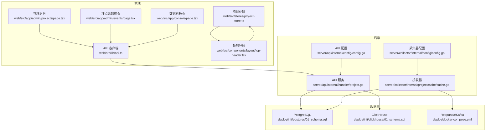
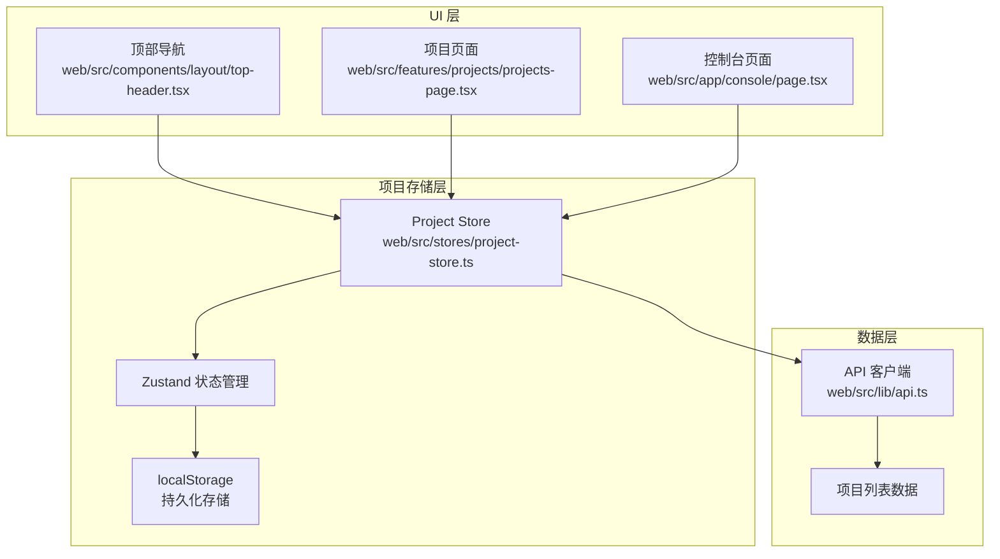
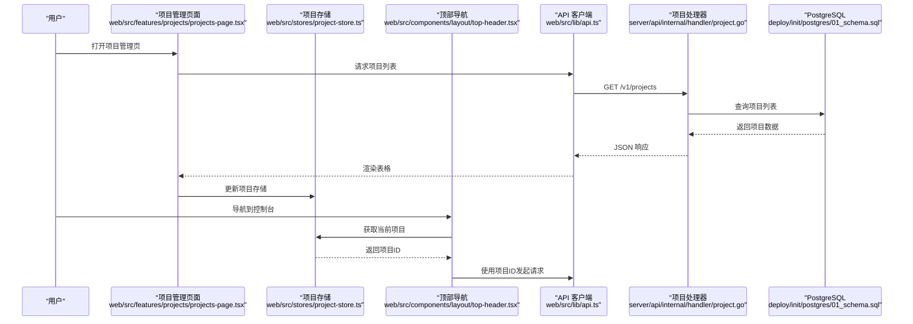
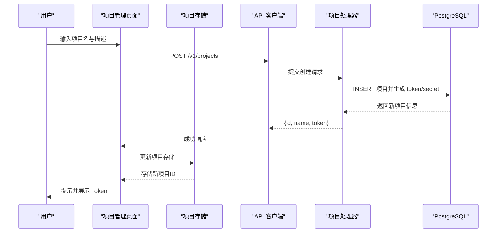
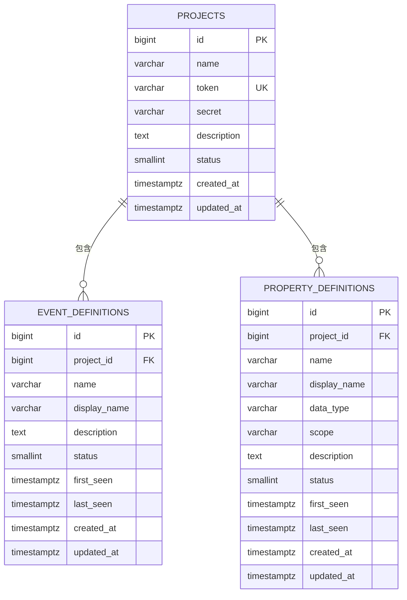
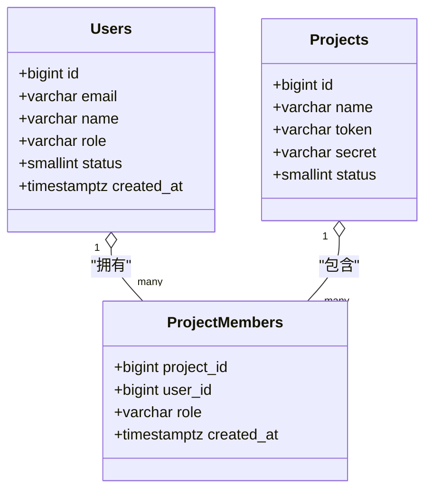
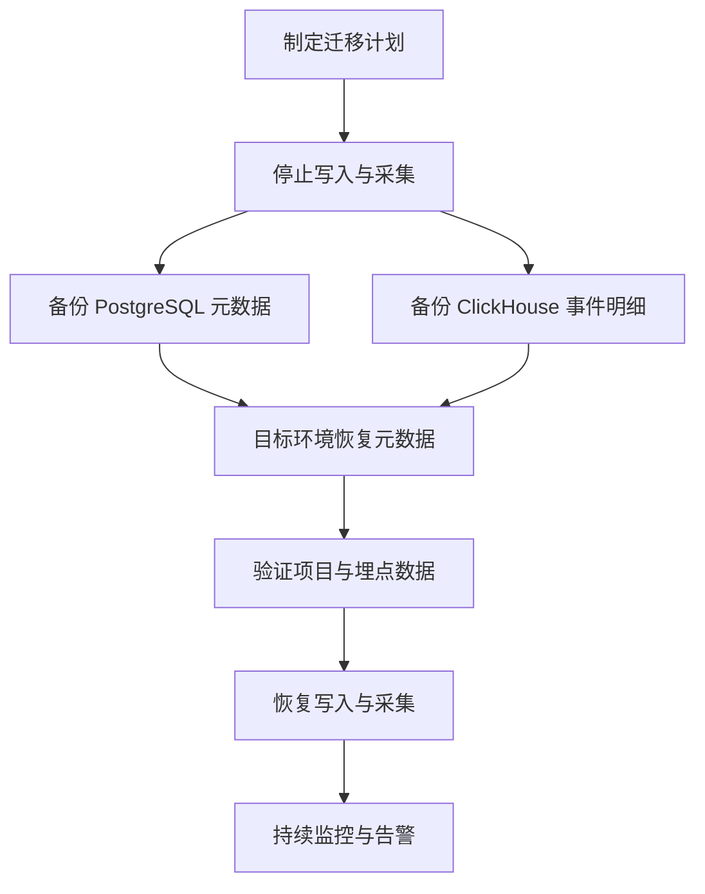
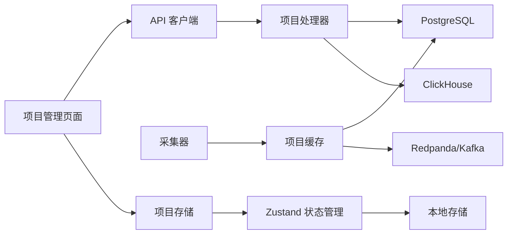

# 项目管理功能

<cite>
**本文引用的文件**
- [web/src/app/admin/projects/page.tsx](file://web/src/app/admin/projects/page.tsx)
- [web/src/features/projects/projects-page.tsx](file://web/src/features/projects/projects-page.tsx)
- [web/src/stores/project-store.ts](file://web/src/stores/project-store.ts)
- [web/src/components/layout/top-header.tsx](file://web/src/components/layout/top-header.tsx)
- [web/src/features/common/project-select.tsx](file://web/src/features/common/project-select.tsx)
- [server/api/internal/handler/project.go](file://server/api/internal/handler/project.go)
- [web/src/lib/api.ts](file://web/src/lib/api.ts)
- [deploy/init/postgres/01_schema.sql](file://deploy/init/postgres/01_schema.sql)
- [deploy/init/clickhouse/01_schema.sql](file://deploy/init/clickhouse/01_schema.sql)
- [server/collector/internal/projectcache/cache.go](file://server/collector/internal/projectcache/cache.go)
- [web/src/app/admin/events/page.tsx](file://web/src/app/admin/events/page.tsx)
- [web/src/app/console/page.tsx](file://web/src/app/console/page.tsx)
- [server/api/internal/config/config.go](file://server/api/internal/config/config.go)
- [server/collector/internal/config/config.go](file://server/collector/internal/config/config.go)
- [deploy/docker-compose.yml](file://deploy/docker-compose.yml)
- [README.md](file://README.md)
</cite>

## 更新摘要
**所做更改**
- 新增集中式项目选择系统章节，详细介绍基于 zustand 的 project-store 实现
- 更新项目管理页面架构，反映统一的项目选择机制
- 新增项目选择组件的使用模式和最佳实践
- 更新控制台页面的项目上下文管理方式

## 目录
1. [简介](#简介)
2. [项目结构](#项目结构)
3. [核心组件](#核心组件)
4. [集中式项目选择系统](#集中式项目选择系统)
5. [架构总览](#架构总览)
6. [详细组件分析](#详细组件分析)
7. [依赖分析](#依赖分析)
8. [性能考虑](#性能考虑)
9. [故障排除指南](#故障排除指南)
10. [结论](#结论)
11. [附录](#附录)

## 简介
本文件面向 AeroLog 项目的使用者与维护者，系统性梳理"项目管理"功能的设计与使用方法。内容涵盖：
- 项目管理页面的界面与功能组织（项目列表、创建向导、埋点元数据入口）
- 项目创建流程（基本信息、接入配置、初始设置）
- 项目配置管理（埋点规则、数据保留策略、安全设置）
- 项目成员管理（角色分配、权限控制、邀请机制）
- 项目生命周期与迁移备份操作指引
- **新增**：集中式项目选择系统（基于 zustand 的统一项目状态管理）

## 项目结构
AeroLog 采用前后端分离架构：前端使用 Next.js 提供管理后台与控制台；后端由 Go 语言实现，包含接收层、消费层与管理查询 API；数据层由 PostgreSQL 存放元数据、ClickHouse 存放事件明细，辅以 Kafka/Redpanda 作为消息通道。



**图表来源**
- [web/src/app/admin/projects/page.tsx:1-3](file://web/src/app/admin/projects/page.tsx#L1-L3)
- [web/src/app/admin/events/page.tsx:1-89](file://web/src/app/admin/events/page.tsx#L1-L89)
- [web/src/app/console/page.tsx:1-124](file://web/src/app/console/page.tsx#L1-L124)
- [web/src/lib/api.ts:1-107](file://web/src/lib/api.ts#L1-L107)
- [web/src/stores/project-store.ts:1-28](file://web/src/stores/project-store.ts#L1-L28)
- [web/src/components/layout/top-header.tsx:1-41](file://web/src/components/layout/top-header.tsx#L1-L41)
- [server/api/internal/handler/project.go:1-143](file://server/api/internal/handler/project.go#L1-L143)
- [server/collector/internal/projectcache/cache.go:1-57](file://server/collector/internal/projectcache/cache.go#L1-L57)
- [server/api/internal/config/config.go:1-46](file://server/api/internal/config/config.go#L1-L46)
- [server/collector/internal/config/config.go:1-38](file://server/collector/internal/config/config.go#L1-L38)
- [deploy/init/postgres/01_schema.sql:1-120](file://deploy/init/postgres/01_schema.sql#L1-L120)
- [deploy/init/clickhouse/01_schema.sql:1-66](file://deploy/init/clickhouse/01_schema.sql#L1-L66)
- [deploy/docker-compose.yml:1-147](file://deploy/docker-compose.yml#L1-L147)

**章节来源**
- [README.md:1-50](file://README.md#L1-L50)
- [deploy/docker-compose.yml:1-147](file://deploy/docker-compose.yml#L1-L147)

## 核心组件
- 项目管理页面：提供项目列表展示、创建向导与 Token 查看能力，支持快速复制与状态标识。
- 项目 API：提供项目列表、详情、创建等接口，并生成项目级 Token 与 Secret。
- API 客户端：封装统一的请求与错误处理，对接后端 v1 接口。
- 元数据与埋点：通过 PostgreSQL 存储项目与事件/属性元数据；通过 ClickHouse 存储事件明细。
- 采集缓存：在接收层对 token→project_id 进行内存缓存，提升鉴权与路由效率。
- 控制台与埋点元数据页：提供事件统计、趋势分析与埋点元数据管理入口。
- **新增**：项目存储（Project Store）：基于 Zustand 的集中式项目状态管理，提供跨页面的项目上下文一致性。

**章节来源**
- [web/src/app/admin/projects/page.tsx:1-3](file://web/src/app/admin/projects/page.tsx#L1-L3)
- [web/src/features/projects/projects-page.tsx:1-119](file://web/src/features/projects/projects-page.tsx#L1-L119)
- [web/src/stores/project-store.ts:1-28](file://web/src/stores/project-store.ts#L1-L28)
- [web/src/components/layout/top-header.tsx:1-41](file://web/src/components/layout/top-header.tsx#L1-L41)
- [server/api/internal/handler/project.go:1-143](file://server/api/internal/handler/project.go#L1-L143)
- [web/src/lib/api.ts:1-107](file://web/src/lib/api.ts#L1-L107)
- [deploy/init/postgres/01_schema.sql:1-120](file://deploy/init/postgres/01_schema.sql#L1-L120)
- [deploy/init/clickhouse/01_schema.sql:1-66](file://deploy/init/clickhouse/01_schema.sql#L1-L66)
- [server/collector/internal/projectcache/cache.go:1-57](file://server/collector/internal/projectcache/cache.go#L1-L57)
- [web/src/app/admin/events/page.tsx:1-89](file://web/src/app/admin/events/page.tsx#L1-L89)
- [web/src/app/console/page.tsx:1-124](file://web/src/app/console/page.tsx#L1-L124)

## 集中式项目选择系统

### 系统概述
AeroLog 引入了基于 Zustand 的集中式项目选择系统，所有控制台页面现在使用统一的 project-store，移除了独立的 ProjectPicker 组件使用模式。该系统通过持久化存储确保项目上下文在用户会话期间保持一致。

### 核心架构



**图表来源**
- [web/src/stores/project-store.ts:1-28](file://web/src/stores/project-store.ts#L1-L28)
- [web/src/components/layout/top-header.tsx:1-41](file://web/src/components/layout/top-header.tsx#L1-L41)
- [web/src/features/projects/projects-page.tsx:1-119](file://web/src/features/projects/projects-page.tsx#L1-L119)
- [web/src/lib/api.ts:1-107](file://web/src/lib/api.ts#L1-L107)

### 项目存储实现

#### Store 定义
项目存储使用 Zustand 的 create 函数创建，包含以下核心功能：

- **状态管理**：`projectId?: number` 存储当前选中的项目 ID
- **动作函数**：`setProjectId` 用于更新当前项目
- **持久化**：使用 `persist` 中间件将状态存储到 localStorage
- **类型安全**：完整的 TypeScript 类型定义

#### 自动项目选择逻辑
顶部导航组件实现了智能的项目选择逻辑：

1. **首次加载**：当 store 中没有选中项目且项目列表加载完成后，自动选择第一个项目
2. **项目切换**：当当前选中项目不存在于新的项目列表时，自动回退到第一个项目
3. **状态同步**：确保项目选择状态在整个应用中保持一致

#### 项目选择组件
提供通用的项目选择组件 `ProjectSelect`，支持：

- 下拉选择框形式
- 支持自定义样式类名
- 响应式设计适配移动端
- 与项目存储集成

**章节来源**
- [web/src/stores/project-store.ts:1-28](file://web/src/stores/project-store.ts#L1-L28)
- [web/src/components/layout/top-header.tsx:18-41](file://web/src/components/layout/top-header.tsx#L18-L41)
- [web/src/features/common/project-select.tsx:1-34](file://web/src/features/common/project-select.tsx#L1-L34)

## 架构总览
项目管理功能贯穿"前端页面—API—数据库—采集/消费"的全链路，核心交互如下：



**图表来源**
- [web/src/features/projects/projects-page.tsx:28-119](file://web/src/features/projects/projects-page.tsx#L28-L119)
- [web/src/stores/project-store.ts:11-22](file://web/src/stores/project-store.ts#L11-L22)
- [web/src/components/layout/top-header.tsx:18-41](file://web/src/components/layout/top-header.tsx#L18-L41)
- [web/src/lib/api.ts:1-107](file://web/src/lib/api.ts#L1-L107)
- [server/api/internal/handler/project.go:1-143](file://server/api/internal/handler/project.go#L1-L143)
- [deploy/init/postgres/01_schema.sql:1-120](file://deploy/init/postgres/01_schema.sql#L1-L120)

## 详细组件分析

### 项目管理页面（项目列表与创建向导）
- 功能要点
  - 列表字段：ID、项目名、Token、描述、状态、创建时间。
  - 创建向导：弹窗表单，必填项目名，选填描述；提交后调用创建接口并刷新列表。
  - Token 展示：支持复制，便于 SDK 配置。
  - 状态标签：启用/禁用直观标识。
- 技术实现
  - 使用查询客户端加载数据，创建使用变更提交，成功后失效查询缓存并重置表单。
  - 表格分页每页 20 条，加载态友好提示。
  - **更新**：项目存储自动同步项目选择状态，确保跨页面一致性。

```mermaid
flowchart TD
Start(["进入项目管理页"]) --> Load["加载项目列表"]
Load --> StoreSync["同步项目存储"]
StoreSync --> Show["渲染表格与按钮"]
Show --> ClickCreate{"点击"新建项目"？"}
ClickCreate --> |是| OpenModal["打开创建弹窗"]
OpenModal --> Submit{"提交表单？"}
Submit --> |是| CallAPI["调用创建接口"]
CallAPI --> Success{"成功？"}
Success --> |是| Refresh["提示成功并刷新列表"]
Success --> |否| Error["提示错误"]
Refresh --> StoreUpdate["更新项目存储"]
StoreUpdate --> End(["完成"])
Error --> End
Wait["等待操作"] --> End
```

**图表来源**
- [web/src/features/projects/projects-page.tsx:28-119](file://web/src/features/projects/projects-page.tsx#L28-L119)
- [web/src/stores/project-store.ts:11-22](file://web/src/stores/project-store.ts#L11-L22)
- [web/src/lib/api.ts:1-107](file://web/src/lib/api.ts#L1-L107)

**章节来源**
- [web/src/features/projects/projects-page.tsx:28-119](file://web/src/features/projects/projects-page.tsx#L28-L119)

### 项目创建流程（基本信息、接入配置、初始设置）
- 基本信息
  - 必填项：项目名；选填：描述。
  - 后端生成：项目 ID、名称、Token。
- 接入配置
  - SDK 配置需使用生成的 Token；后端同时生成 Secret 用于签名校验（见项目表结构）。
- 初始设置
  - 建议立即复制并保存 Token/Secret。
  - 在埋点元数据页查看事件定义，确认采集是否生效。
  - **更新**：创建成功后自动更新项目存储，确保新项目立即可用。



**图表来源**
- [web/src/features/projects/projects-page.tsx:28-119](file://web/src/features/projects/projects-page.tsx#L28-L119)
- [web/src/stores/project-store.ts:11-22](file://web/src/stores/project-store.ts#L11-L22)
- [web/src/lib/api.ts:1-107](file://web/src/lib/api.ts#L1-L107)
- [server/api/internal/handler/project.go:1-143](file://server/api/internal/handler/project.go#L1-L143)
- [deploy/init/postgres/01_schema.sql:1-120](file://deploy/init/postgres/01_schema.sql#L1-L120)

**章节来源**
- [server/api/internal/handler/project.go:66-96](file://server/api/internal/handler/project.go#L66-L96)
- [deploy/init/postgres/01_schema.sql:18-28](file://deploy/init/postgres/01_schema.sql#L18-L28)

### 项目配置管理（埋点规则、数据保留策略、安全设置）
- 埋点规则
  - 事件与属性元数据存储于 PostgreSQL，支持显示名、描述、状态、首次/最近出现时间等。
  - 埋点元数据页可按项目筛选，查看事件定义与状态。
- 数据保留策略
  - ClickHouse 事件明细默认 TTL 365 天，按 project_id+月份分区，适合长期留存与成本控制。
- 安全设置
  - 项目表包含 token 与 secret 字段，用于 SDK 上报凭证与服务端签名校验。
  - 接收层对 token→project_id 做内存缓存，减少数据库压力并提升鉴权速度。
  - **更新**：项目存储确保安全的项目上下文传递，避免跨项目数据泄露。



**图表来源**
- [deploy/init/postgres/01_schema.sql:18-51](file://deploy/init/postgres/01_schema.sql#L18-L51)

**章节来源**
- [deploy/init/clickhouse/01_schema.sql:1-66](file://deploy/init/clickhouse/01_schema.sql#L1-L66)
- [server/collector/internal/projectcache/cache.go:1-57](file://server/collector/internal/projectcache/cache.go#L1-L57)
- [web/src/app/admin/events/page.tsx:1-89](file://web/src/app/admin/events/page.tsx#L1-L89)

### 项目成员管理（角色分配、权限控制、邀请机制）
- 角色与权限
  - 用户表含角色字段，默认 member；项目成员表定义 owner/editor/viewer 等角色。
- 邀请机制
  - 通过管理后台添加项目成员并分配角色；成员绑定项目后即可访问对应资源。
- 当前实现
  - 项目成员管理接口未在已分析文件中暴露，建议在管理后台扩展成员管理页面并与项目成员表联动。
  - **更新**：项目存储确保成员权限验证时的项目上下文准确性。



**图表来源**
- [deploy/init/postgres/01_schema.sql:7-36](file://deploy/init/postgres/01_schema.sql#L7-L36)

**章节来源**
- [deploy/init/postgres/01_schema.sql:30-36](file://deploy/init/postgres/01_schema.sql#L30-L36)

### 项目生命周期管理与迁移备份
- 生命周期
  - 启用/禁用：项目状态字段控制是否参与采集与查询。
  - 删除：建议先停用再归档数据，避免影响线上流量。
- 迁移与备份
  - PostgreSQL 元数据：可通过标准备份工具进行快照与恢复。
  - ClickHouse 事件明细：按月分区，结合 TTL 策略进行冷热分离与归档。
  - Kafka/Redpanda：作为缓冲与传输层，建议开启副本与备份策略。
- 开发环境一键启动
  - 使用 docker-compose 启动所有依赖组件，便于本地验证与演示。
  - **更新**：项目存储支持跨环境的项目上下文迁移。



**图表来源**
- [deploy/docker-compose.yml:1-147](file://deploy/docker-compose.yml#L1-L147)
- [deploy/init/postgres/01_schema.sql:1-120](file://deploy/init/postgres/01_schema.sql#L1-L120)
- [deploy/init/clickhouse/01_schema.sql:1-66](file://deploy/init/clickhouse/01_schema.sql#L1-L66)

**章节来源**
- [deploy/docker-compose.yml:1-147](file://deploy/docker-compose.yml#L1-L147)

## 依赖分析
- 前端依赖
  - 项目管理页面依赖 API 客户端与查询框架；创建流程依赖表单与消息提示。
  - **新增**：项目存储依赖 Zustand 和持久化中间件，提供跨组件的状态共享。
- 后端依赖
  - 项目处理器依赖 PostgreSQL 连接池；采集缓存依赖 Postgres 查询与内存缓存。
- 数据依赖
  - 项目与成员信息存储于 PostgreSQL；事件明细存储于 ClickHouse；消息通道使用 Redpanda/Kafka。



**图表来源**
- [web/src/features/projects/projects-page.tsx:1-119](file://web/src/features/projects/projects-page.tsx#L1-L119)
- [web/src/stores/project-store.ts:1-28](file://web/src/stores/project-store.ts#L1-L28)
- [web/src/lib/api.ts:1-107](file://web/src/lib/api.ts#L1-L107)
- [server/api/internal/handler/project.go:1-143](file://server/api/internal/handler/project.go#L1-L143)
- [server/collector/internal/projectcache/cache.go:1-57](file://server/collector/internal/projectcache/cache.go#L1-L57)
- [deploy/docker-compose.yml:1-147](file://deploy/docker-compose.yml#L1-L147)

**章节来源**
- [server/api/internal/config/config.go:1-46](file://server/api/internal/config/config.go#L1-L46)
- [server/collector/internal/config/config.go:1-38](file://server/collector/internal/config/config.go#L1-L38)

## 性能考虑
- 采集缓存
  - 通过内存 LRU-like 缓存 token→project_id，降低数据库查询压力，提升鉴权吞吐。
- 分区与 TTL
  - ClickHouse 按月分区并设置 365 天 TTL，兼顾查询性能与存储成本。
- 并发与限流
  - 采集器与消费者通过缓冲与批处理优化写入延迟与资源占用。
- **新增**：项目存储优化
  - 使用持久化存储避免频繁重新获取项目列表
  - Zustand 提供高性能的状态更新机制
  - 跨组件状态共享减少重复的数据请求

**章节来源**
- [server/collector/internal/projectcache/cache.go:1-57](file://server/collector/internal/projectcache/cache.go#L1-L57)
- [deploy/init/clickhouse/01_schema.sql:1-66](file://deploy/init/clickhouse/01_schema.sql#L1-L66)
- [web/src/stores/project-store.ts:1-28](file://web/src/stores/project-store.ts#L1-L28)

## 故障排除指南
- 无法创建项目
  - 检查网络与 API 地址配置；确认必填字段完整；查看后端日志定位数据库异常。
- Token 无效
  - 确认项目状态为启用；检查 SDK 配置中的 Token 是否正确；核对缓存是否命中。
- 数据未显示
  - 确认采集器正常运行并向 Kafka 写入；检查消费者是否成功导入 ClickHouse；验证项目 ID 与事件定义。
- 前端请求失败
  - 检查 API 基础地址与 CORS 设置；确认浏览器控制台网络错误与后端响应码。
- **新增**：项目选择问题
  - 检查项目存储是否正常工作；确认 localStorage 可用；验证项目 ID 格式正确性。
  - 如果项目自动切换异常，检查项目列表数据源和存储同步逻辑。

**章节来源**
- [web/src/lib/api.ts:1-107](file://web/src/lib/api.ts#L1-L107)
- [server/api/internal/config/config.go:1-46](file://server/api/internal/config/config.go#L1-L46)
- [server/collector/internal/config/config.go:1-38](file://server/collector/internal/config/config.go#L1-L38)
- [web/src/stores/project-store.ts:1-28](file://web/src/stores/project-store.ts#L1-L28)

## 结论
项目管理功能以简洁的前端界面与完善的后端接口为核心，配合 PostgreSQL 元数据与 ClickHouse 明细存储，形成从"项目创建—埋点配置—数据分析—生命周期管理"的闭环。通过引入基于 Zustand 的集中式项目选择系统，进一步提升了用户体验的一致性和系统的可维护性。

**更新后的优势**：
- 统一的项目上下文管理，消除跨页面的项目状态不一致问题
- 智能的项目选择逻辑，提供更好的用户体验
- 持久化的状态存储，确保用户会话期间的项目上下文保持
- 更好的性能表现，减少重复的数据请求和状态同步开销

建议后续补充成员管理与更丰富的配置项，进一步完善项目治理能力。

## 附录
- 快速开始
  - 一键启动开发环境：在 deploy 目录执行 docker compose 启动所有依赖。
  - 访问管理后台：在项目管理页创建项目并复制 Token。
  - 验证采集：在埋点元数据页查看事件定义，确认采集生效。
  - **新增**：项目选择测试：在不同页面间切换验证项目上下文一致性。
- 相关文件路径
  - 项目管理页面：[web/src/app/admin/projects/page.tsx:1-3](file://web/src/app/admin/projects/page.tsx#L1-L3)
  - 项目页面组件：[web/src/features/projects/projects-page.tsx:1-119](file://web/src/features/projects/projects-page.tsx#L1-L119)
  - 项目存储：[web/src/stores/project-store.ts:1-28](file://web/src/stores/project-store.ts#L1-L28)
  - 顶部导航组件：[web/src/components/layout/top-header.tsx:1-41](file://web/src/components/layout/top-header.tsx#L1-L41)
  - 项目选择组件：[web/src/features/common/project-select.tsx:1-34](file://web/src/features/common/project-select.tsx#L1-L34)
  - 项目 API 处理器：[server/api/internal/handler/project.go:1-143](file://server/api/internal/handler/project.go#L1-L143)
  - API 客户端：[web/src/lib/api.ts:1-107](file://web/src/lib/api.ts#L1-L107)
  - PostgreSQL 初始化脚本：[deploy/init/postgres/01_schema.sql:1-120](file://deploy/init/postgres/01_schema.sql#L1-L120)
  - ClickHouse 初始化脚本：[deploy/init/clickhouse/01_schema.sql:1-66](file://deploy/init/clickhouse/01_schema.sql#L1-L66)
  - 采集缓存：[server/collector/internal/projectcache/cache.go:1-57](file://server/collector/internal/projectcache/cache.go#L1-L57)
  - 埋点元数据页：[web/src/app/admin/events/page.tsx:1-89](file://web/src/app/admin/events/page.tsx#L1-L89)
  - 数据看板页：[web/src/app/console/page.tsx:1-124](file://web/src/app/console/page.tsx#L1-L124)
  - API 配置：[server/api/internal/config/config.go:1-46](file://server/api/internal/config/config.go#L1-L46)
  - 采集器配置：[server/collector/internal/config/config.go:1-38](file://server/collector/internal/config/config.go#L1-L38)
  - Docker Compose：[deploy/docker-compose.yml:1-147](file://deploy/docker-compose.yml#L1-L147)
  - 项目说明：[README.md:1-50](file://README.md#L1-L50)