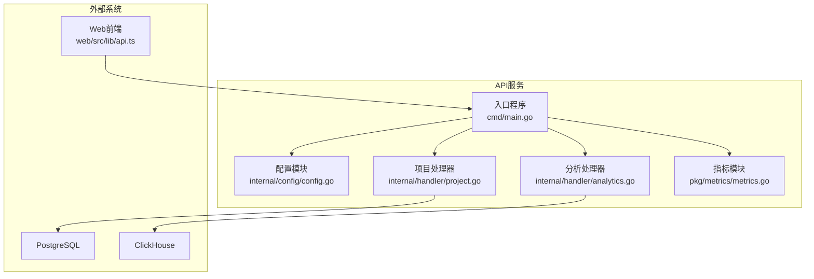
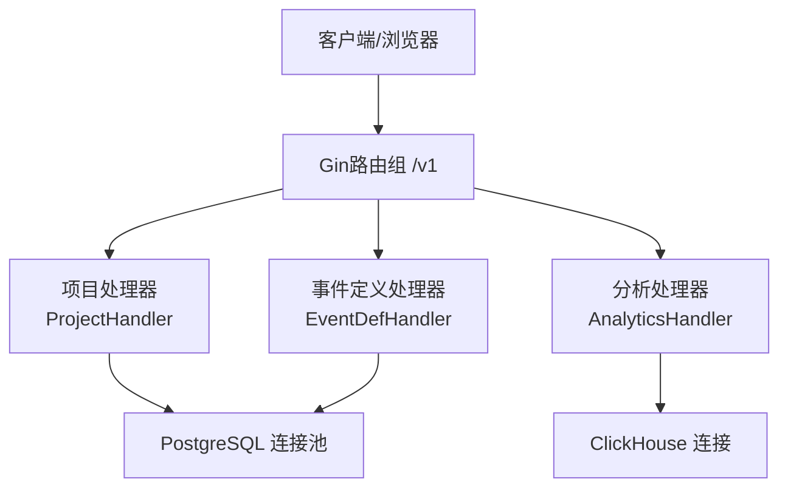
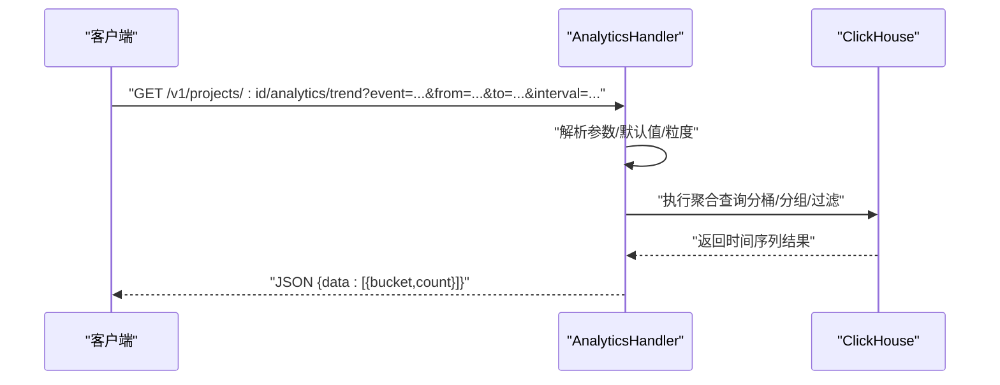
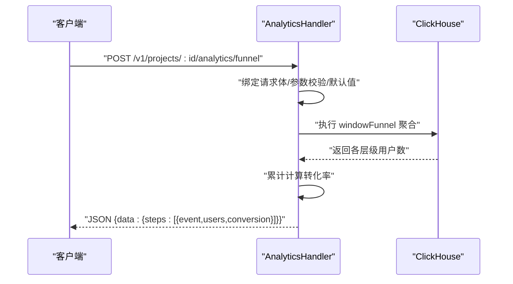
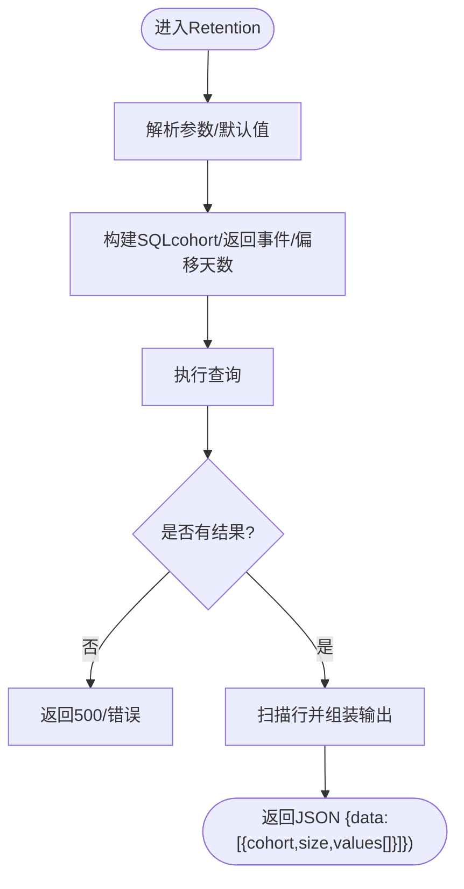
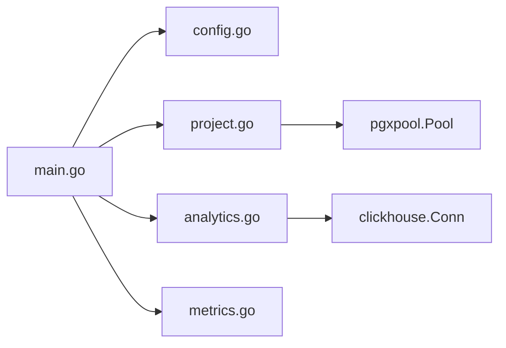

# API服务

<cite>
**本文引用的文件**
- [server/api/cmd/main.go](file://server/api/cmd/main.go)
- [server/api/internal/config/config.go](file://server/api/internal/config/config.go)
- [server/api/internal/handler/analytics.go](file://server/api/internal/handler/analytics.go)
- [server/api/internal/handler/project.go](file://server/api/internal/handler/project.go)
- [server/pkg/metrics/metrics.go](file://server/pkg/metrics/metrics.go)
- [server/pkg/model/event.go](file://server/pkg/model/event.go)
- [deploy/init/postgres/01_schema.sql](file://deploy/init/postgres/01_schema.sql)
- [deploy/init/clickhouse/01_schema.sql](file://deploy/init/clickhouse/01_schema.sql)
- [web/src/lib/api.ts](file://web/src/lib/api.ts)
</cite>

## 目录
1. [引言](#引言)
2. [项目结构](#项目结构)
3. [核心组件](#核心组件)
4. [架构总览](#架构总览)
5. [详细组件分析](#详细组件分析)
6. [依赖分析](#依赖分析)
7. [性能考虑](#性能考虑)
8. [故障排查指南](#故障排查指南)
9. [结论](#结论)
10. [附录](#附录)

## 引言
本文件面向API服务的架构与实现，围绕基于Gin框架的RESTful服务展开，重点覆盖以下方面：
- 路由组织与中间件配置
- 数据库连接管理（PostgreSQL与ClickHouse）
- 分析类API：事件趋势、Top事件、漏斗分析、留存分析的数据查询逻辑
- 项目管理接口：CRUD、权限与数据隔离
- 查询优化、事务处理与可观测性
- API版本管理、错误处理与安全策略
- 完整接口文档示例与前端集成指南

## 项目结构
API服务位于 server/api，采用“入口程序 + 配置 + 处理器 + 公共包”的分层组织：
- 入口程序负责初始化配置、连接数据库、注册路由组与中间件，并启动HTTP与指标服务
- 配置模块从环境变量读取运行参数
- 处理器模块提供项目管理与分析类API
- 公共包提供指标采集与通用模型

图表来源
- [server/api/cmd/main.go:35-78](file://server/api/cmd/main.go#L35-L78)
- [server/api/internal/config/config.go:24-38](file://server/api/internal/config/config.go#L24-L38)
- [server/api/internal/handler/project.go:29-33](file://server/api/internal/handler/project.go#L29-L33)
- [server/api/internal/handler/analytics.go:27-32](file://server/api/internal/handler/analytics.go#L27-L32)
- [server/pkg/metrics/metrics.go:53-80](file://server/pkg/metrics/metrics.go#L53-L80)
- [web/src/lib/api.ts:32-75](file://web/src/lib/api.ts#L32-L75)

章节来源
- [server/api/cmd/main.go:35-78](file://server/api/cmd/main.go#L35-L78)
- [server/api/internal/config/config.go:24-38](file://server/api/internal/config/config.go#L24-L38)

## 核心组件
- 入口程序与中间件
  - 初始化PostgreSQL连接池与ClickHouse连接
  - 注册路由组 /v1 并挂载处理器
  - 使用 Recovery、CORS与自定义指标中间件
  - 暴露 /metrics 与 /healthz
- 配置模块
  - 从环境变量读取监听地址、指标地址、PostgreSQL DSN、ClickHouse连接信息、JWT密钥、CORS允许源
- 指标模块
  - 注册Counter/Histogram/Gauge，提供 /metrics 与 /healthz
- 处理器
  - 项目处理器：列出、创建、查询项目
  - 事件定义处理器：列出事件定义
  - 分析处理器：趋势、Top事件、漏斗、留存

章节来源
- [server/api/cmd/main.go:35-78](file://server/api/cmd/main.go#L35-L78)
- [server/api/internal/config/config.go:8-38](file://server/api/internal/config/config.go#L8-L38)
- [server/pkg/metrics/metrics.go:18-80](file://server/pkg/metrics/metrics.go#L18-L80)
- [server/api/internal/handler/project.go:24-134](file://server/api/internal/handler/project.go#L24-L134)
- [server/api/internal/handler/analytics.go:13-32](file://server/api/internal/handler/analytics.go#L13-L32)

## 架构总览
API服务采用“单进程多职责”模式：同一进程内同时承载HTTP服务、指标服务与业务路由。数据库侧分别对接PostgreSQL（元数据）与ClickHouse（事件明细）。前端通过统一的NEXT_PUBLIC_API_BASE访问 /v1 接口。

图表来源
- [server/api/cmd/main.go:55-58](file://server/api/cmd/main.go#L55-L58)
- [server/api/internal/handler/project.go:29-33](file://server/api/internal/handler/project.go#L29-L33)
- [server/api/internal/handler/analytics.go:27-32](file://server/api/internal/handler/analytics.go#L27-L32)

## 详细组件分析

### 路由与中间件
- 路由组织
  - /v1 下挂载项目、事件定义与分析相关接口
- 中间件
  - Recovery：异常恢复
  - CORS：支持通配或白名单，预检请求直接返回
  - 指标中间件：记录请求耗时与总量，标签包含方法、路径、状态码

章节来源
- [server/api/cmd/main.go:50-58](file://server/api/cmd/main.go#L50-L58)
- [server/api/cmd/main.go:80-93](file://server/api/cmd/main.go#L80-L93)
- [server/api/cmd/main.go:95-120](file://server/api/cmd/main.go#L95-L120)

### 配置管理
- 关键配置项
  - 监听地址、指标地址、PostgreSQL DSN、ClickHouse地址/库/用户名/密码、JWT密钥、CORS允许源
- 环境变量加载策略：若未设置则使用默认值

章节来源
- [server/api/internal/config/config.go:24-38](file://server/api/internal/config/config.go#L24-L38)

### 指标与可观测性
- 指标类型
  - 请求耗时直方图、请求总量计数器
- 暴露端点
  - /metrics 与 /healthz，独立端口运行

章节来源
- [server/api/cmd/main.go:22-33](file://server/api/cmd/main.go#L22-L33)
- [server/pkg/metrics/metrics.go:18-80](file://server/pkg/metrics/metrics.go#L18-L80)

### 项目管理接口
- 接口清单
  - GET /v1/projects：分页列出项目（限制最大200条）
  - POST /v1/projects：创建项目，生成token与secret
  - GET /v1/projects/:id：按ID查询项目
  - GET /v1/projects/:id/events：列出事件定义（限制最大500条）
- 数据库交互
  - PostgreSQL：查询/插入项目与事件定义
- 权限与数据隔离
  - 当前处理器未显式进行鉴权与成员角色检查，建议在生产中引入鉴权中间件与按项目隔离的查询约束

章节来源
- [server/api/internal/handler/project.go:29-64](file://server/api/internal/handler/project.go#L29-L64)
- [server/api/internal/handler/project.go:71-96](file://server/api/internal/handler/project.go#L71-L96)
- [server/api/internal/handler/project.go:103-134](file://server/api/internal/handler/project.go#L103-L134)

### 分析类API
- 接口清单
  - GET /v1/projects/:id/analytics/trend：事件趋势，支持小时/日粒度
  - GET /v1/projects/:id/analytics/top_events：Top事件，含事件计数与去重用户数
  - POST /v1/projects/:id/analytics/funnel：漏斗分析，支持窗口期
  - GET /v1/projects/:id/analytics/retention：留存分析，按 cohort 计算多日留存
- 数据库交互
  - ClickHouse：事件明细聚合查询，使用时间区间过滤、按日期/小时分桶、窗口函数与分组聚合
- 查询逻辑要点
  - 时间戳：前端与后端均使用毫秒时间戳
  - 粒度：小时/日可选，默认日粒度
  - 窗口：漏斗分析支持窗口秒数，超过阈值使用默认值
  - 留存：按初始事件当日作为 cohort，计算偏移天数的留存位图

图表来源
- [server/api/internal/handler/analytics.go:34-74](file://server/api/internal/handler/analytics.go#L34-L74)

图表来源
- [server/api/internal/handler/analytics.go:119-199](file://server/api/internal/handler/analytics.go#L119-L199)

图表来源
- [server/api/internal/handler/analytics.go:201-283](file://server/api/internal/handler/analytics.go#L201-L283)

章节来源
- [server/api/internal/handler/analytics.go:27-32](file://server/api/internal/handler/analytics.go#L27-L32)
- [server/api/internal/handler/analytics.go:34-112](file://server/api/internal/handler/analytics.go#L34-L112)
- [server/api/internal/handler/analytics.go:119-199](file://server/api/internal/handler/analytics.go#L119-L199)
- [server/api/internal/handler/analytics.go:201-283](file://server/api/internal/handler/analytics.go#L201-L283)

### 数据模型与SDK协议
- 事件模型
  - 包含事件类型、事件名、匿名/登录ID、时间、SDK标识与属性
  - 基础校验规则：必填字段、长度限制
- 传输封装
  - EnvelopedEvent：携带项目ID、IP、UA、接收时间与原始事件

章节来源
- [server/pkg/model/event.go:27-69](file://server/pkg/model/event.go#L27-L69)

## 依赖分析
- 组件耦合
  - 入口程序与处理器通过接口注册解耦
  - 处理器与数据库通过连接对象注入，便于测试替换
- 外部依赖
  - Gin：HTTP框架与路由
  - pgx/pool：PostgreSQL连接池
  - clickhouse-go：ClickHouse连接与查询
  - Prometheus：指标采集与导出

图表来源
- [server/api/cmd/main.go:35-58](file://server/api/cmd/main.go#L35-L58)
- [server/api/internal/handler/project.go:25-27](file://server/api/internal/handler/project.go#L25-L27)
- [server/api/internal/handler/analytics.go:14-16](file://server/api/internal/handler/analytics.go#L14-L16)

章节来源
- [server/api/cmd/main.go:35-58](file://server/api/cmd/main.go#L35-L58)

## 性能考虑
- 查询优化
  - ClickHouse：按 project_id + 月分区，利用时间过滤与分桶函数减少扫描范围
  - Top事件与趋势：使用GROUP BY与LIMIT控制结果集规模
- 连接管理
  - PostgreSQL使用连接池，ClickHouse使用短连接复用
- 指标观测
  - 通过直方图与计数器监控请求耗时与成功率，辅助容量规划与告警
- 前端调用
  - 前端统一使用毫秒时间戳，避免时区与精度差异带来的额外开销

章节来源
- [deploy/init/clickhouse/01_schema.sql:6-42](file://deploy/init/clickhouse/01_schema.sql#L6-L42)
- [server/pkg/metrics/metrics.go:26-42](file://server/pkg/metrics/metrics.go#L26-L42)
- [web/src/lib/api.ts:32-75](file://web/src/lib/api.ts#L32-L75)

## 故障排查指南
- 常见错误与定位
  - 数据库连接失败：检查PostgreSQL/ClickHouse地址、凭据与网络连通性
  - CORS问题：确认 AllowOrigins 配置与预检请求处理
  - 查询异常：查看指标 /metrics 中的错误率与耗时分布
- 日志与健康检查
  - 服务与指标服务均提供 /healthz，用于存活探测
- 建议
  - 引入鉴权中间件与请求体大小限制
  - 对高并发场景增加连接池参数调优与超时配置

章节来源
- [server/api/cmd/main.go:53](file://server/api/cmd/main.go#L53)
- [server/pkg/metrics/metrics.go:59-61](file://server/pkg/metrics/metrics.go#L59-L61)
- [server/api/cmd/main.go:95-120](file://server/api/cmd/main.go#L95-L120)

## 结论
本API服务以Gin为核心，结合PostgreSQL与ClickHouse实现“元数据+事件明细”的双数据库架构，提供项目管理与分析类API。通过中间件与指标模块实现了可观测性，前端通过统一的 /v1 接口进行访问。建议在生产环境中补充鉴权与权限控制、请求体限制与更细粒度的查询优化策略。

## 附录

### 接口文档示例
- 项目管理
  - GET /v1/projects：分页列出项目
  - POST /v1/projects：创建项目（返回id/name/token）
  - GET /v1/projects/:id：按ID查询项目
  - GET /v1/projects/:id/events：列出事件定义
- 分析类
  - GET /v1/projects/:id/analytics/trend
    - 查询参数：event、from（毫秒）、to（毫秒）、interval（hour/day）
    - 返回：时间序列数组
  - GET /v1/projects/:id/analytics/top_events
    - 查询参数：from、to、limit
    - 返回：事件列表（含事件计数与去重用户数）
  - POST /v1/projects/:id/analytics/funnel
    - 请求体：events（2..8）、from、to、window_seconds
    - 返回：步骤级用户数与转化率
  - GET /v1/projects/:id/analytics/retention
    - 查询参数：initial_event、return_event、from、to、days
    - 返回：cohort、人数与多日留存数组

章节来源
- [server/api/internal/handler/project.go:29-64](file://server/api/internal/handler/project.go#L29-L64)
- [server/api/internal/handler/project.go:103-134](file://server/api/internal/handler/project.go#L103-L134)
- [server/api/internal/handler/analytics.go:27-32](file://server/api/internal/handler/analytics.go#L27-L32)
- [server/api/internal/handler/analytics.go:34-112](file://server/api/internal/handler/analytics.go#L34-L112)
- [server/api/internal/handler/analytics.go:119-199](file://server/api/internal/handler/analytics.go#L119-L199)
- [server/api/internal/handler/analytics.go:201-283](file://server/api/internal/handler/analytics.go#L201-L283)

### 数据库模式
- PostgreSQL（元数据）
  - users、projects、project_members、event_definitions、property_definitions、dashboards、event_dlq
- ClickHouse（事件明细）
  - events、events_buffer、users

章节来源
- [deploy/init/postgres/01_schema.sql:7-91](file://deploy/init/postgres/01_schema.sql#L7-L91)
- [deploy/init/clickhouse/01_schema.sql:6-61](file://deploy/init/clickhouse/01_schema.sql#L6-L61)

### 前端集成指南
- 基础地址
  - NEXT_PUBLIC_API_BASE 指向API服务地址（默认 http://localhost:8082）
- 调用约定
  - 所有接口均在 /v1 路径下
  - 时间戳统一使用毫秒
  - Content-Type: application/json
- 示例方法
  - 列出项目、创建项目、查询项目详情
  - 获取Top事件、趋势、漏斗、留存

章节来源
- [web/src/lib/api.ts:3-19](file://web/src/lib/api.ts#L3-L19)
- [web/src/lib/api.ts:32-75](file://web/src/lib/api.ts#L32-L75)