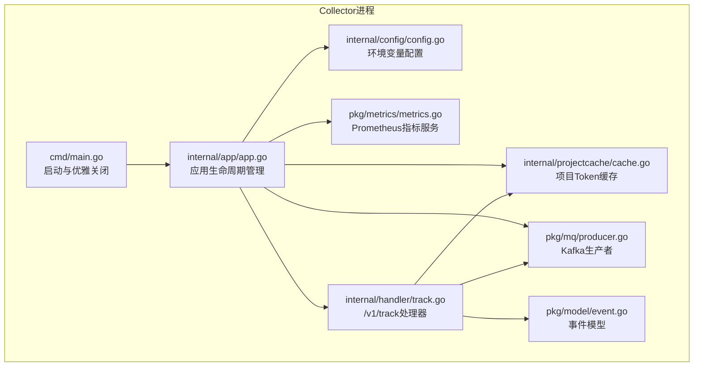
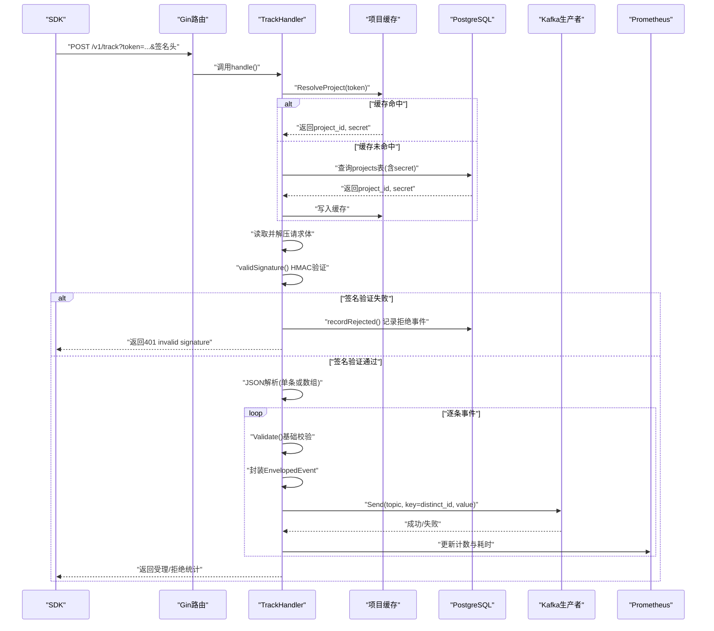
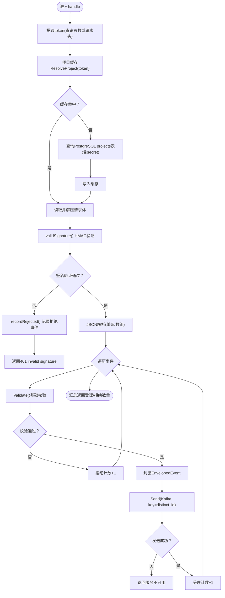
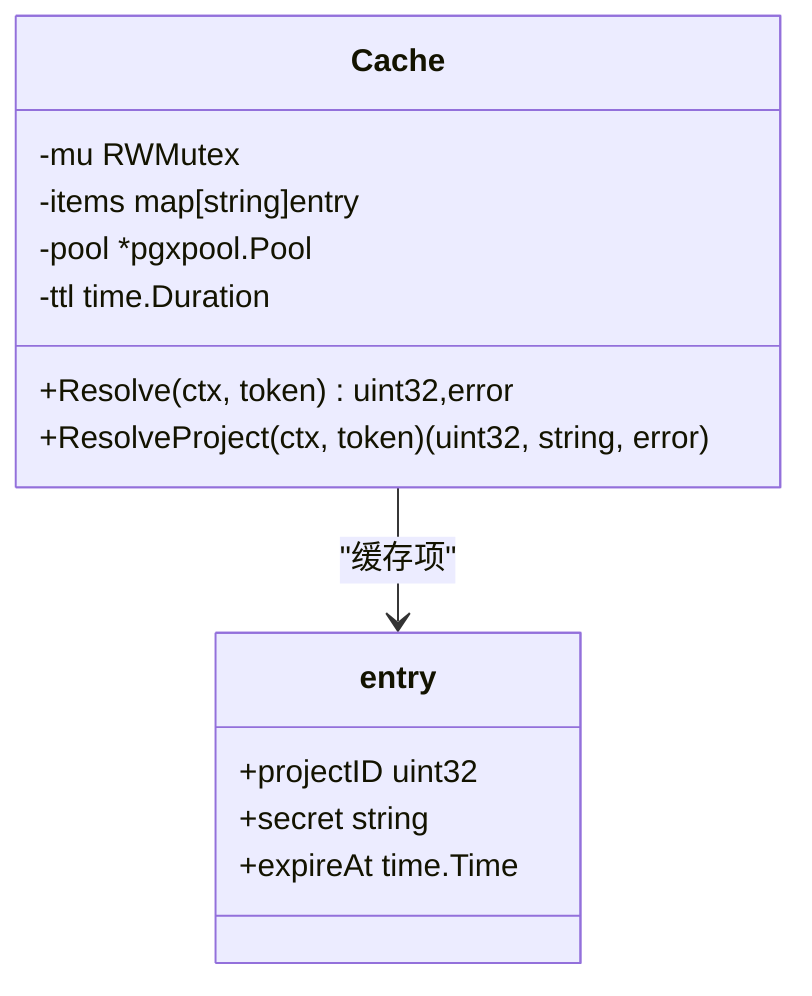
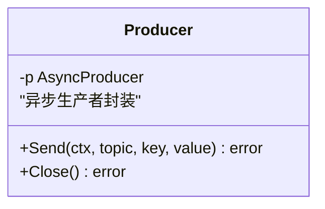
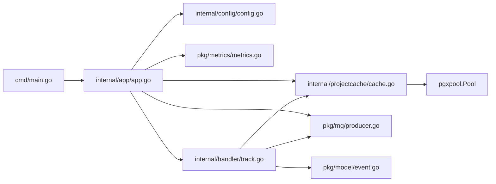

# Collector服务

<cite>
**本文引用的文件**
- [main.go](file://server/collector/cmd/main.go)
- [app.go](file://server/collector/internal/app/app.go)
- [config.go](file://server/collector/internal/config/config.go)
- [track.go](file://server/collector/internal/handler/track.go)
- [cache.go](file://server/collector/internal/projectcache/cache.go)
- [producer.go](file://server/pkg/mq/producer.go)
- [metrics.go](file://server/pkg/metrics/metrics.go)
- [event.go](file://server/pkg/model/event.go)
- [README.md](file://server/collector/README.md)
- [docker-compose.yml](file://deploy/docker-compose.yml)
</cite>

## 目录
1. [简介](#简介)
2. [项目结构](#项目结构)
3. [核心组件](#核心组件)
4. [架构总览](#架构总览)
5. [详细组件分析](#详细组件分析)
6. [依赖分析](#依赖分析)
7. [性能考虑](#性能考虑)
8. [故障排查指南](#故障排查指南)
9. [结论](#结论)
10. [附录](#附录)

## 简介
本文件面向Collector服务的架构与实现，重点阐述其作为事件收集入口的职责：基于Gin框架的HTTP服务器、PostgreSQL连接池、Kafka生产者、项目级Token缓存机制，以及事件接收流程、请求验证、限流策略与错误处理。同时给出配置参数说明、监控指标暴露、优雅关闭机制与性能调优建议，并提供实际配置示例与常见问题排查方法。

## 项目结构
Collector服务位于 server/collector 目录，采用"命令入口 + 应用层 + 内部包"的分层组织方式：
- 命令入口：cmd/main.go 负责初始化配置、数据库连接池、Kafka生产者、项目缓存、HTTP路由与指标服务，并处理信号进行优雅关闭。
- 应用层：internal/app/app.go 封装应用生命周期管理，协调各组件初始化与关闭。
- 配置模块：internal/config/config.go 从环境变量读取配置，提供默认值。
- 事件处理：internal/handler/track.go 实现 /v1/track 路由，负责鉴权、请求体读取与解压、JSON解析、事件校验、HMAC签名验证、封装上下文、投递Kafka与响应。
- 项目缓存：internal/projectcache/cache.go 提供基于内存的项目Token到ID与密钥映射缓存，减少数据库查询。
- 公共能力：server/pkg/mq/producer.go 提供Kafka异步生产者封装；server/pkg/metrics/metrics.go 提供Prometheus指标注册与独立的metrics服务；server/pkg/model/event.go 定义事件数据模型与基本校验。

**图表来源**
- [main.go:1-26](file://server/collector/cmd/main.go#L1-L26)
- [app.go:1-108](file://server/collector/internal/app/app.go#L1-L108)
- [config.go:1-38](file://server/collector/internal/config/config.go#L1-L38)
- [track.go:1-327](file://server/collector/internal/handler/track.go#L1-L327)
- [cache.go:1-65](file://server/collector/internal/projectcache/cache.go#L1-L65)
- [producer.go:1-69](file://server/pkg/mq/producer.go#L1-L69)
- [metrics.go:1-81](file://server/pkg/metrics/metrics.go#L1-L81)
- [event.go:1-84](file://server/pkg/model/event.go#L1-L84)

**章节来源**
- [main.go:1-26](file://server/collector/cmd/main.go#L1-L26)
- [app.go:1-108](file://server/collector/internal/app/app.go#L1-L108)
- [config.go:1-38](file://server/collector/internal/config/config.go#L1-L38)
- [track.go:1-327](file://server/collector/internal/handler/track.go#L1-L327)
- [cache.go:1-65](file://server/collector/internal/projectcache/cache.go#L1-L65)
- [producer.go:1-69](file://server/pkg/mq/producer.go#L1-L69)
- [metrics.go:1-81](file://server/pkg/metrics/metrics.go#L1-L81)
- [event.go:1-84](file://server/pkg/model/event.go#L1-L84)

## 核心组件
- Gin HTTP服务器：在Release模式下运行，启用panic恢复中间件，注册/v1/track与/healthz健康检查端点。
- 应用生命周期管理：统一协调配置加载、数据库连接、Kafka生产者、项目缓存与HTTP服务的初始化与关闭。
- PostgreSQL连接池：通过pgxpool.New建立，用于项目Token到ID与密钥的查询与缓存。
- Kafka生产者：基于IBM/sarama的异步生产者，启用Snappy压缩、本地确认、批量刷新与重试。
- 项目缓存：以token为键的内存缓存，带过期时间，避免频繁访问数据库，缓存项目ID与密钥。
- 事件模型与校验：定义事件结构与基础校验规则，确保必要字段存在且长度合理。
- HMAC签名验证：新增的请求签名验证机制，支持可选的HMAC SHA-256签名，增强请求安全性。
- 拒绝事件记录：当请求鉴权失败或签名验证失败时，将拒绝原因、原始请求体等信息记录到PostgreSQL debug_events表。
- 指标与监控：独立的metrics端口暴露Prometheus指标，包含事件计数、请求耗时与Kafka发送错误计数。

**章节来源**
- [main.go:13-25](file://server/collector/cmd/main.go#L13-L25)
- [app.go:56-108](file://server/collector/internal/app/app.go#L56-L108)
- [track.go:66-165](file://server/collector/internal/handler/track.go#L66-L165)
- [cache.go:41-64](file://server/collector/internal/projectcache/cache.go#L41-L64)
- [producer.go:17-40](file://server/pkg/mq/producer.go#L17-L40)
- [metrics.go:26-49](file://server/pkg/metrics/metrics.go#L26-L49)
- [event.go:39-60](file://server/pkg/model/event.go#L39-L60)

## 架构总览
Collector作为无状态的高并发HTTP入口，接收SDK上报的事件，完成鉴权、签名验证、解析、校验与投递，最终返回受理/拒绝统计。其关键路径如下：

**图表来源**
- [main.go:18-25](file://server/collector/cmd/main.go#L18-L25)
- [track.go:77-165](file://server/collector/internal/handler/track.go#L77-L165)
- [cache.go:41-64](file://server/collector/internal/projectcache/cache.go#L41-L64)
- [producer.go:42-60](file://server/pkg/mq/producer.go#L42-L60)
- [metrics.go:26-42](file://server/pkg/metrics/metrics.go#L26-L42)

## 详细组件分析

### 应用层（internal/app/app.go）
- 职责：封装应用生命周期管理，协调各组件初始化与关闭，提供统一的应用容器。
- 功能特性：
  - 组件编排：按依赖顺序初始化配置、数据库、缓存、生产者与HTTP服务
  - 生命周期：支持优雅关闭，确保资源有序释放
  - 错误处理：集中处理组件初始化过程中的异常情况
  - 日志集成：统一的日志输出与调试信息

**章节来源**
- [app.go:1-108](file://server/collector/internal/app/app.go#L1-L108)

### 配置模块（internal/config/config.go）
- 职责：从环境变量读取Collector运行所需的关键配置，提供默认值，便于快速启动。
- 关键参数：
  - 地址绑定：AEROLOG_ADDR，默认":8081"
  - 指标地址：AEROLOG_METRICS_ADDR，默认":9101"
  - KafkaBroker列表：AEROLOG_KAFKA_BROKERS，默认"localhost:19092"，逗号分隔
  - Kafka主题：AEROLOG_KAFKA_TOPIC，默认"events.raw"
  - PostgreSQL DSN：AEROLOG_PG_DSN，默认开发环境地址
  - Redis地址：AEROLOG_REDIS_ADDR，默认"localhost:6379"
  - 最大请求体大小：MaxBodyBytes，默认5MB
- 设计要点：使用字符串分割与默认值策略，确保部署灵活性。

**章节来源**
- [config.go:8-30](file://server/collector/internal/config/config.go#L8-L30)

### 事件处理（internal/handler/track.go）
- 路由注册：/v1/track POST，/healthz GET
- 鉴权：优先从查询参数获取token，其次从请求头X-AeroLog-Token；通过项目缓存解析project_id与secret
- HMAC签名验证：新增的可选验证机制，支持X-AeroLog-Signature头，使用HMAC SHA-256算法验证请求完整性
- 请求体处理：限制最大字节数，支持gzip解压，兼容单条事件与事件数组
- 事件校验：调用Event.Validate()执行基础字段校验
- 上下文封装：为每条事件附加ProjectID、IP、UA、接收时间等信息
- Kafka投递：以DistinctID作为key，保证同一用户事件落入相同分区；超时控制为2秒
- 响应：返回受理/拒绝数量统计；错误时返回对应状态码与消息
- 指标：记录事件总数（含拒绝）、请求耗时直方图、Kafka发送错误计数
- 拒绝事件记录：当鉴权失败或签名验证失败时，将拒绝原因、原始请求体等信息持久化到PostgreSQL

**图表来源**
- [track.go:66-165](file://server/collector/internal/handler/track.go#L66-L165)
- [track.go:152-165](file://server/collector/internal/handler/track.go#L152-L165)
- [event.go:39-60](file://server/pkg/model/event.go#L39-L60)

**章节来源**
- [track.go:53-165](file://server/collector/internal/handler/track.go#L53-L165)
- [event.go:27-60](file://server/pkg/model/event.go#L27-L60)

### HMAC签名验证机制（新增）
- 验证头：X-AeroLog-Signature，格式为sha256=<HMAC_SHA256_HEX>
- 算法：使用项目密钥作为HMAC密钥，对原始请求体进行SHA-256计算
- 可选性：如果请求头为空，则跳过验证，允许未签名请求通过
- 安全性：签名验证失败时返回401状态码，并记录详细的拒绝信息
- 性能：使用crypto/hmac库进行常量时间比较，防止时序攻击

**章节来源**
- [track.go:152-165](file://server/collector/internal/handler/track.go#L152-L165)

### 拒绝事件记录（新增）
- 记录内容：拒绝原因、token、IP、User-Agent、原始请求体片段
- 存储位置：PostgreSQL debug_events表
- 触发条件：鉴权失败、签名验证失败、事件校验失败
- 结构设计：包含项目ID、事件类型、用户标识、结果状态、原因描述、完整载荷等字段
- 索引优化：为项目ID和时间戳创建复合索引，便于查询和分析

**章节来源**
- [track.go:167-242](file://server/collector/internal/handler/track.go#L167-L242)

### 项目缓存（internal/projectcache/cache.go）
- 结构：以token为键的map，存储project_id、secret与过期时间；使用互斥锁保护并发安全
- 行为：先读锁尝试命中；未命中则查询PostgreSQL projects表（status=1），随后写入缓存并设置TTL
- 并发：读多写少场景下的RWMutex提升并发性能
- TTL：默认60秒，避免缓存击穿与陈旧数据
- 新增功能：同时缓存项目密钥，支持HMAC签名验证

**图表来源**
- [cache.go:13-64](file://server/collector/internal/projectcache/cache.go#L13-L64)

**章节来源**
- [cache.go:1-65](file://server/collector/internal/projectcache/cache.go#L1-L65)

### Kafka生产者（pkg/mq/producer.go）
- 配置要点：版本、确认策略、压缩算法（Snappy）、批量刷新频率与消息数、重试次数、错误回调开关
- 发送语义：异步非阻塞发送，通过channel与context控制超时；错误通过独立goroutine消费，避免阻塞内部缓冲
- 关闭：提供Close接口，优雅退出

**图表来源**
- [producer.go:12-69](file://server/pkg/mq/producer.go#L12-L69)

**章节来源**
- [producer.go:1-69](file://server/pkg/mq/producer.go#L1-L69)

### 指标与监控（pkg/metrics/metrics.go）
- 注册表：内置Go运行时与进程指标
- 指标类型：
  - 计数器：事件接收总数（受理/拒绝）
  - 直方图：/v1/track请求耗时
  - 错误计数：Kafka发送失败次数
- 服务：独立端口暴露/metrics与/healthz，支持优雅关闭

**章节来源**
- [metrics.go:18-81](file://server/pkg/metrics/metrics.go#L18-L81)

### 事件模型（pkg/model/event.go）
- 事件类型：track及用户属性相关类型枚举
- 字段：事件类型、事件名、匿名/登录标识、时间戳、SDK元信息、自定义属性
- 校验规则：必填字段检查、长度约束等，详细校验在下游消费者阶段执行

**章节来源**
- [event.go:9-60](file://server/pkg/model/event.go#L9-L60)

## 依赖分析
- 组件耦合：
  - main.go依赖应用层、配置、缓存、生产者与指标模块，形成入口聚合
  - app.go协调各组件初始化与关闭，提供统一的应用容器
  - track.go依赖缓存、生产者、事件模型与PostgreSQL，承担业务主流程
  - cache.go依赖pgxpool.Pool，提供轻量LRU式缓存
  - producer.go封装sarama异步生产者，提供非阻塞发送
  - metrics.go提供独立的Prometheus注册表与HTTP服务
- 外部依赖：
  - Gin：HTTP路由与中间件
  - pgxpool：PostgreSQL连接池
  - IBM/sarama：Kafka客户端
  - Prometheus：指标采集

**图表来源**
- [main.go:13-25](file://server/collector/cmd/main.go#L13-L25)
- [app.go:29-108](file://server/collector/internal/app/app.go#L29-L108)
- [track.go:3-25](file://server/collector/internal/handler/track.go#L3-L25)
- [cache.go:4-11](file://server/collector/internal/projectcache/cache.go#L4-L11)
- [producer.go:4-10](file://server/pkg/mq/producer.go#L4-L10)
- [metrics.go:6-16](file://server/pkg/metrics/metrics.go#L6-L16)
- [event.go:4-7](file://server/pkg/model/event.go#L4-L7)

**章节来源**
- [main.go:1-26](file://server/collector/cmd/main.go#L1-L26)
- [app.go:1-108](file://server/collector/internal/app/app.go#L1-L108)
- [track.go:1-327](file://server/collector/internal/handler/track.go#L1-L327)
- [cache.go:1-65](file://server/collector/internal/projectcache/cache.go#L1-L65)
- [producer.go:1-69](file://server/pkg/mq/producer.go#L1-L69)
- [metrics.go:1-81](file://server/pkg/metrics/metrics.go#L1-L81)
- [event.go:1-84](file://server/pkg/model/event.go#L1-L84)

## 性能考虑
- 请求体限制：通过MaxBytesReader限制最大请求体，防止内存膨胀与DoS攻击
- 压缩传输：支持gzip解压，降低网络开销
- 批量与重试：Kafka生产者启用Snappy压缩、批量刷新与本地确认，提高吞吐与可靠性
- 分区键一致性：以DistinctID作为key，保障同一用户事件落在同一分区，利于后续处理
- 缓存命中：项目Token缓存减少数据库压力，建议根据流量调整TTL
- HMAC验证性能：使用常量时间比较函数，避免时序攻击，性能开销极小
- 拒绝事件记录：异步写入PostgreSQL，不影响主要业务流程
- 指标观测：通过直方图与计数器定位瓶颈，结合外部Prometheus/Grafana进行可视化
- 并发与超时：读写分离的RWMutex与2秒发送超时，平衡吞吐与稳定性
- 应用层优化：统一的生命周期管理减少资源竞争，提高系统稳定性

## 故障排查指南
- 无法鉴权/401：
  - 检查token来源（查询参数或请求头）
  - 确认项目状态为有效（status=1）
  - 查看项目缓存是否命中
  - 验证项目密钥是否正确配置
- HMAC签名验证失败/401：
  - 检查X-AeroLog-Signature头格式是否为sha256=<HEX_STRING>
  - 确认签名算法使用HMAC SHA-256，密钥为项目密钥
  - 验证请求体与签名是否匹配（包括Content-Encoding）
  - 检查签名生成逻辑是否正确
- 请求过大/400：
  - 检查MaxBodyBytes配置与请求体大小
  - 确认Content-Length与压缩格式
- Kafka不可用/503：
  - 检查KafkaBroker列表与网络连通性
  - 观察Kafka发送错误计数指标
  - 确认主题存在且分区/副本配置正确
- 拒绝事件记录：
  - 检查debug_events表是否存在
  - 验证PostgreSQL连接是否正常
  - 查看拒绝事件的reason字段了解具体原因
- 健康检查：
  - /healthz用于快速判断服务存活
  - 指标服务/healthz用于判断监控端口可用性
- 优雅关闭：
  - 收到SIGINT/SIGTERM后，服务在5秒内优雅关闭HTTP与metrics服务
- 应用层问题：
  - 检查应用初始化日志，确认各组件按顺序成功启动
  - 关注应用层的错误处理与资源释放

**章节来源**
- [track.go:77-97](file://server/collector/internal/handler/track.go#L77-L97)
- [track.go:152-165](file://server/collector/internal/handler/track.go#L152-L165)
- [track.go:167-242](file://server/collector/internal/handler/track.go#L167-L242)
- [metrics.go:59-61](file://server/pkg/metrics/metrics.go#L59-L61)
- [main.go:15-25](file://server/collector/cmd/main.go#L15-L25)
- [app.go:79-108](file://server/collector/internal/app/app.go#L79-L108)

## 结论
Collector服务以简洁清晰的分层设计实现了高并发事件收集入口：通过Gin提供稳定HTTP服务，利用pgxpool与项目缓存降低鉴权成本，借助sarama异步生产者保障事件可靠投递，并通过独立的Prometheus端口实现可观测性。新增的HMAC签名验证机制显著提升了请求安全性，而拒绝事件记录功能为问题诊断提供了有力支撑。统一的应用层组件提供了良好的生命周期管理，增强了系统的可维护性与稳定性。配合合理的配置与限流策略，可在生产环境中获得良好的吞吐与稳定性表现。

## 附录

### 配置参数与默认值
- AEROLOG_ADDR：服务监听地址，默认":8081"
- AEROLOG_METRICS_ADDR：指标服务地址，默认":9101"
- AEROLOG_KAFKA_BROKERS：Kafka Broker列表，默认"localhost:19092"
- AEROLOG_KAFKA_TOPIC：Kafka主题，默认"events.raw"
- AEROLOG_PG_DSN：PostgreSQL连接串，默认开发环境地址
- AEROLOG_REDIS_ADDR：Redis地址，默认"localhost:6379"
- MaxBodyBytes：最大请求体大小，默认5MB

**章节来源**
- [config.go:20-29](file://server/collector/internal/config/config.go#L20-L29)

### HMAC签名验证配置
- 请求头格式：X-AeroLog-Signature: sha256=<HMAC_SHA256_HEX>
- 签名算法：HMAC SHA-256
- 密钥来源：项目密钥（从项目缓存获取）
- 验证范围：对原始请求体进行签名验证
- 可选性：如果请求头为空，则跳过验证

**章节来源**
- [track.go:152-165](file://server/collector/internal/handler/track.go#L152-L165)

### 拒绝事件记录配置
- 数据库表：debug_events
- 记录字段：reason, token, ip, ua, raw_body, event等
- 触发条件：鉴权失败、签名验证失败、事件校验失败
- 查询优化：为project_id和created_at创建复合索引

**章节来源**
- [track.go:167-242](file://server/collector/internal/handler/track.go#L167-L242)

### 启动与自测步骤
- 启动依赖（PostgreSQL、Redpanda、Prometheus、Grafana）
- 创建Kafka主题（如Redpanda未自动创建）
- 在PostgreSQL中插入测试项目并获取token与密钥
- 启动Collector并使用curl进行自测

**章节来源**
- [README.md:5-37](file://server/collector/README.md#L5-L37)
- [docker-compose.yml:3-147](file://deploy/docker-compose.yml#L3-L147)