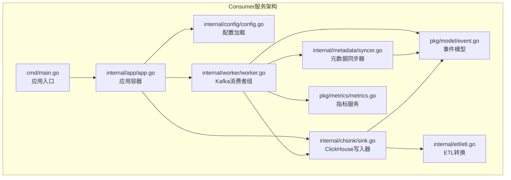
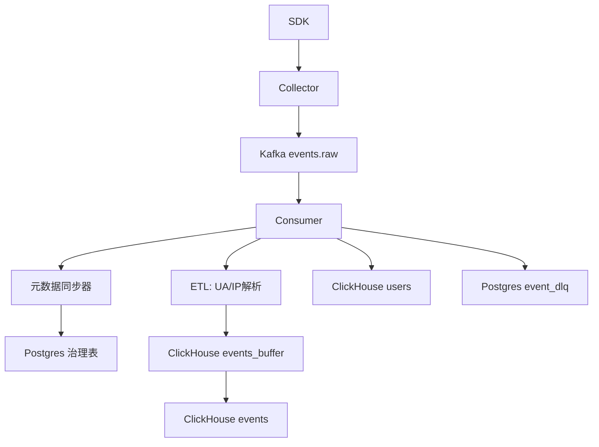
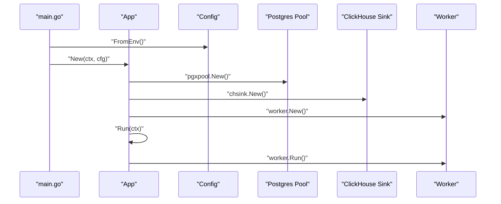
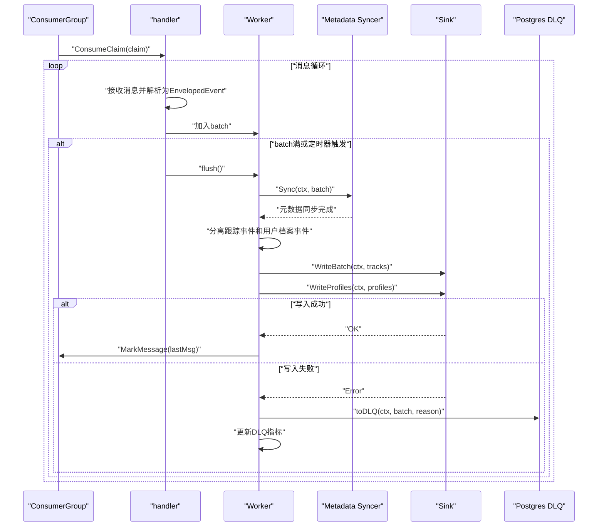
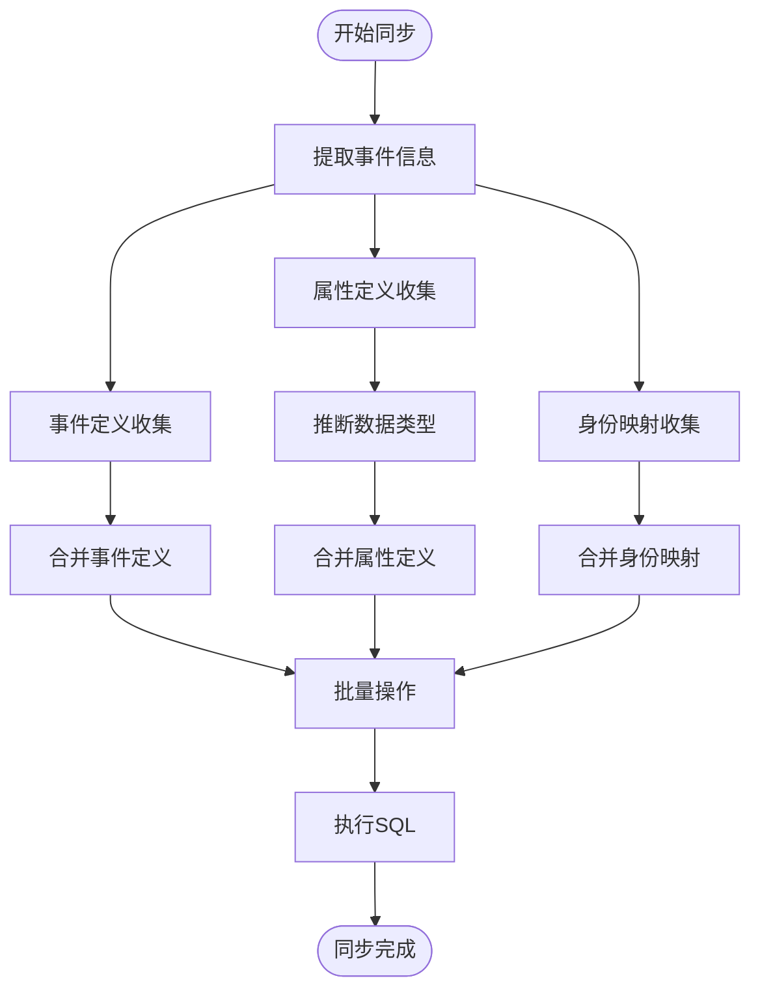
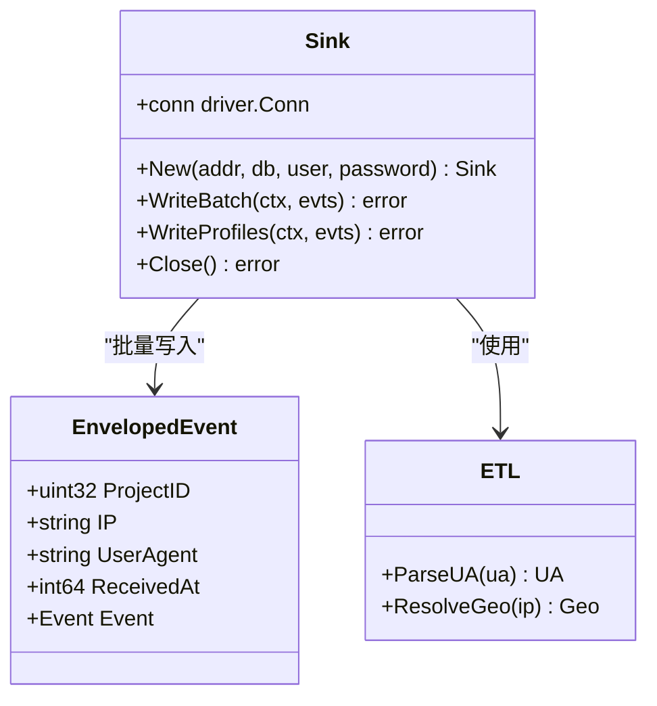
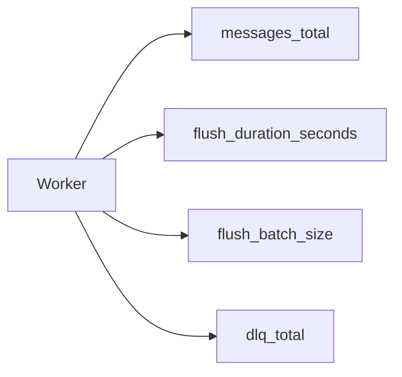
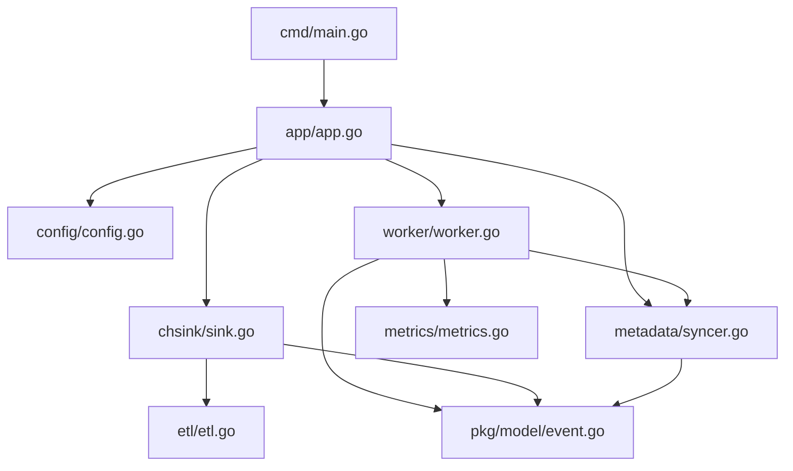

# Consumer服务

<cite>
**本文档引用的文件**
- [main.go](file://server/consumer/cmd/main.go)
- [app.go](file://server/consumer/internal/app/app.go)
- [config.go](file://server/consumer/internal/config/config.go)
- [worker.go](file://server/consumer/internal/worker/worker.go)
- [syncer.go](file://server/consumer/internal/metadata/syncer.go)
- [etl.go](file://server/consumer/internal/etl/etl.go)
- [sink.go](file://server/consumer/internal/chsink/sink.go)
- [event.go](file://server/pkg/model/event.go)
- [metrics.go](file://server/pkg/metrics/metrics.go)
- [architecture.md](file://docs/architecture.md)
- [observability.md](file://docs/observability.md)
- [docker-compose.yml](file://deploy/docker-compose.yml)
- [01_schema.sql](file://deploy/init/clickhouse/01_schema.sql)
- [01_schema.sql](file://deploy/init/postgres/01_schema.sql)
- [README.md](file://server/consumer/README.md)
</cite>

## 更新摘要
**所做更改**
- 完全重构Consumer服务架构，从简单的事件处理升级为完整的事件处理流水线
- 重构Worker系统，分离跟踪事件和用户档案事件处理，提升处理效率
- 集成元数据同步器，实现实时事件/属性字典和身份映射同步
- 增强ETL模块，提供更精确的UA解析和地理信息处理
- 优化ClickHouse写入器，支持用户档案事件的专门处理方法
- 改进应用初始化流程，采用依赖注入模式

## 目录
1. [简介](#简介)
2. [项目结构](#项目结构)
3. [核心组件](#核心组件)
4. [架构总览](#架构总览)
5. [详细组件分析](#详细组件分析)
6. [依赖关系分析](#依赖关系分析)
7. [性能考虑](#性能考虑)
8. [故障排查指南](#故障排查指南)
9. [结论](#结论)
10. [附录](#附录)

## 简介
本文件面向AeroLog项目中的Consumer服务，提供一份全面的架构文档，重点阐述基于Kafka的事件消费处理流程：消费者组管理、并发工作线程调度、ETL数据转换以及ClickHouse写入。文档将深入解释数据处理管道的每个环节，从Kafka消息解析、数据清洗验证到最终的OLAP存储优化；同时描述Worker的工作机制、任务分配策略和错误重试逻辑，详述ETL转换规则、数据建模与索引优化，并给出性能监控指标、吞吐量调优与故障恢复策略，最后提供配置参数详解与运维最佳实践。

**更新** 基于最新代码变更，Consumer服务已完成完全重构，采用现代化的依赖注入架构，实现了分离的事件处理和实时元数据同步功能。

## 项目结构
Consumer服务位于server/consumer目录，采用现代Go语言分层设计：
- cmd：应用入口，负责信号处理和应用生命周期管理
- internal/app：应用容器，负责依赖注入和组件协调
- internal/config：配置加载与环境变量解析
- internal/worker：Kafka消费者组、消息批处理、写入触发与DLQ落库
- internal/metadata：元数据同步器，负责事件/属性字典和身份映射的实时同步
- internal/etl：UA解析与地理信息占位解析
- internal/chsink：ClickHouse批量写入器，支持跟踪事件和用户档案事件分别写入
- pkg/model：事件模型定义，包括EnvelopedEvent与Event结构及序列化方法
- pkg/metrics：Prometheus指标注册与/metrics端点服务

**图表来源**
- [main.go:1-26](file://server/consumer/cmd/main.go#L1-L26)
- [app.go:1-79](file://server/consumer/internal/app/app.go#L1-L79)
- [config.go:1-53](file://server/consumer/internal/config/config.go#L1-L53)
- [worker.go:1-211](file://server/consumer/internal/worker/worker.go#L1-L211)
- [syncer.go:1-273](file://server/consumer/internal/metadata/syncer.go#L1-L273)
- [etl.go:1-90](file://server/consumer/internal/etl/etl.go#L1-L90)
- [sink.go:1-333](file://server/consumer/internal/chsink/sink.go#L1-L333)
- [event.go:1-84](file://server/pkg/model/event.go#L1-L84)
- [metrics.go:1-81](file://server/pkg/metrics/metrics.go#L1-L81)

## 核心组件
- **应用容器**：负责依赖注入、资源管理和生命周期控制
- **配置模块**：从环境变量读取Kafka、ClickHouse、Postgres、批处理参数与指标端口
- **Worker**：封装Sarama消费者组，实现消息批处理、超时控制、错误处理与DLQ落库，支持事件分离处理
- **元数据同步器**：实时同步事件/属性字典和身份映射，支持批量更新和类型推断
- **ETL模块**：UA极简解析与地理信息占位解析，为写入ClickHouse提供上下文字段
- **ClickHouse写入器**：支持跟踪事件和用户档案事件分别写入events_buffer和users表
- **指标服务**：注册并暴露Prometheus指标，包括消息计数、flush耗时、批次大小与DLQ计数

**更新** 应用容器采用依赖注入模式，Worker现在集成元数据同步器，支持事件分离处理。

**章节来源**
- [app.go:17-55](file://server/consumer/internal/app/app.go#L17-L55)
- [config.go:28-45](file://server/consumer/internal/config/config.go#L28-L45)
- [worker.go:42-59](file://server/consumer/internal/worker/worker.go#L42-L59)
- [worker.go:158-192](file://server/consumer/internal/worker/worker.go#L158-L192)
- [syncer.go:15-23](file://server/consumer/internal/metadata/syncer.go#L15-L23)
- [syncer.go:25-97](file://server/consumer/internal/metadata/syncer.go#L25-L97)
- [etl.go:9-89](file://server/consumer/internal/etl/etl.go#L9-L89)
- [sink.go:21-47](file://server/consumer/internal/chsink/sink.go#L21-L47)
- [sink.go:109-168](file://server/consumer/internal/chsink/sink.go#L109-L168)
- [metrics.go:18-81](file://server/pkg/metrics/metrics.go#L18-L81)

## 架构总览
Consumer服务的数据处理链路如下：
- SDK上报事件经Collector鉴权与限流后写入Kafka events.raw主题
- Consumer以消费者组形式订阅events.raw，进行消息解析与ETL转换
- 成功事件批量写入ClickHouse的events_buffer表，由Buffer引擎异步刷新至events主表
- 用户档案事件写入users表，支持profile_set等操作的增量更新
- 失败事件落至Postgres的event_dlq表，便于离线排查与重放
- 元数据同步器实时同步事件/属性字典和身份映射，确保治理表的准确性

**更新** 新增用户档案事件处理流程，支持profile_set、profile_increment等操作的增量更新。

**图表来源**
- [architecture.md:1-53](file://docs/architecture.md#L1-L53)
- [worker.go:158-192](file://server/consumer/internal/worker/worker.go#L158-L192)
- [worker.go:168-191](file://server/consumer/internal/worker/worker.go#L168-L191)
- [syncer.go:25-97](file://server/consumer/internal/metadata/syncer.go#L25-L97)
- [sink.go:49-107](file://server/consumer/internal/chsink/sink.go#L49-L107)
- [sink.go:109-168](file://server/consumer/internal/chsink/sink.go#L109-L168)
- [01_schema.sql:44-49](file://deploy/init/clickhouse/01_schema.sql#L44-L49)
- [01_schema.sql:51-62](file://deploy/init/clickhouse/01_schema.sql#L51-L62)
- [01_schema.sql:94-101](file://deploy/init/postgres/01_schema.sql#L94-L101)

## 详细组件分析

### 应用容器分析
应用容器负责整个Consumer服务的依赖注入和生命周期管理：
- **依赖注入**：创建并注入Postgres连接池、ClickHouse写入器、元数据同步器和Worker实例
- **资源管理**：负责连接池的创建和关闭，确保资源正确释放
- **生命周期控制**：启动指标服务，管理Worker运行，优雅关闭所有依赖
- **错误处理**：捕获初始化和运行时错误，提供清晰的错误信息

**更新** 应用容器现在采用依赖注入模式，简化了组件间的耦合关系。

**图表来源**
- [main.go:13-25](file://server/consumer/cmd/main.go#L13-L25)
- [app.go:26-55](file://server/consumer/internal/app/app.go#L26-L55)
- [app.go:57-67](file://server/consumer/internal/app/app.go#L57-L67)

**章节来源**
- [app.go:17-79](file://server/consumer/internal/app/app.go#L17-L79)

### Worker组件分析
Worker负责Kafka消费者组的生命周期管理、消息批处理与写入触发。其核心机制包括：
- **消费者组初始化**：使用Sarama配置版本、偏移策略与再均衡策略
- **消息批处理**：基于固定批大小与定时器双触发条件，达到阈值或超时即flush
- **元数据同步**：在处理前对事件进行元数据同步，包括事件定义、属性定义和身份映射
- **事件分类处理**：分离跟踪事件和用户档案事件，分别进行ETL和写入
- **错误处理**：写入ClickHouse失败时记录日志并调用DLQ落库，同时更新指标
- **上下文控制**：使用session.Context监听取消信号，优雅退出

**更新** Worker现在集成元数据同步器，在flushBatch方法中先执行元数据同步，然后分离处理跟踪事件和用户档案事件。

**图表来源**
- [worker.go:94-156](file://server/consumer/internal/worker/worker.go#L94-L156)
- [worker.go:158-192](file://server/consumer/internal/worker/worker.go#L158-L192)
- [worker.go:195-210](file://server/consumer/internal/worker/worker.go#L195-L210)
- [syncer.go:25-97](file://server/consumer/internal/metadata/syncer.go#L25-L97)

**章节来源**
- [worker.go:41-211](file://server/consumer/internal/worker/worker.go#L41-L211)

### 元数据同步器分析
元数据同步器负责实时同步事件/属性字典和身份映射，确保治理表的准确性：
- **事件定义同步**：收集事件名称，维护首次和最后观察时间
- **属性定义同步**：收集属性名称和类型，支持数据类型推断和合并
- **身份映射同步**：建立匿名ID到用户ID的映射关系
- **批量操作**：使用pgx.Batch进行批量插入和更新
- **类型推断**：智能推断属性数据类型，支持混合类型处理

**更新** 新增独立的元数据同步器组件，提供完整的事件治理功能。

**图表来源**
- [syncer.go:25-97](file://server/consumer/internal/metadata/syncer.go#L25-L97)
- [syncer.go:204-239](file://server/consumer/internal/metadata/syncer.go#L204-L239)

**章节来源**
- [syncer.go:15-273](file://server/consumer/internal/metadata/syncer.go#L15-L273)

### ETL转换规则
ETL模块提供两类富化能力：
- **UA解析**：从User-Agent字符串中提取浏览器名称与版本、操作系统与版本，支持Edge、Chrome、Firefox、Safari与Windows/macOS/Android/iOS识别
- **地理信息**：当前为占位实现，建议接入ip2region或MaxMind等IP库；当前实现对私有地址段与本地回环地址返回空值

**更新** ETL模块现在提供更精确的UA解析和地理信息占位解析。

**图表来源**
- [etl.go:29-89](file://server/consumer/internal/etl/etl.go#L29-L89)

**章节来源**
- [etl.go:9-90](file://server/consumer/internal/etl/etl.go#L9-L90)

### ClickHouse写入器
Sink组件负责将批量事件写入ClickHouse，其特性包括：
- **连接配置**：异步插入开启、等待确认关闭、连接池上限与生命周期设置
- **字段映射**：将EnvelopedEvent与ETL结果映射到表字段，含IP规范化、时间戳UTC化、属性JSON序列化
- **分离写入**：支持跟踪事件和用户档案事件分别写入不同的表结构
- **批量写入**：使用PrepareBatch提升写入效率，Send()提交事务
- **错误处理**：异常直接返回，由上层Worker捕获并执行DLQ

**更新** 写入器现在支持用户档案事件的专门处理方法WriteProfiles，实现增量更新。

**图表来源**
- [sink.go:21-47](file://server/consumer/internal/chsink/sink.go#L21-L47)
- [sink.go:49-107](file://server/consumer/internal/chsink/sink.go#L49-L107)
- [sink.go:109-168](file://server/consumer/internal/chsink/sink.go#L109-L168)
- [event.go:62-69](file://server/pkg/model/event.go#L62-L69)
- [etl.go:29-89](file://server/consumer/internal/etl/etl.go#L29-L89)

**章节来源**
- [sink.go:21-333](file://server/consumer/internal/chsink/sink.go#L21-L333)
- [event.go:62-83](file://server/pkg/model/event.go#L62-L83)

### 指标与可观测性
Consumer服务通过独立的metrics端口暴露关键指标，便于Prometheus抓取与Grafana可视化：
- **消息计数**：aerolog_consumer_messages_total，消费消息总数（ok/invalid）
- **flush耗时**：aerolog_consumer_flush_duration_seconds，批量写ClickHouse耗时（ok/error）
- **批次大小**：aerolog_consumer_flush_batch_size，每次flush的批大小
- **DLQ计数**：aerolog_consumer_dlq_total，进入DLQ的消息数

**更新** 指标服务现在提供独立的metrics端口，避免与业务端口耦合。

**图表来源**
- [metrics.go:18-81](file://server/pkg/metrics/metrics.go#L18-L81)
- [worker.go:20-39](file://server/consumer/internal/worker/worker.go#L20-L39)

**章节来源**
- [metrics.go:18-81](file://server/pkg/metrics/metrics.go#L18-L81)
- [worker.go:20-39](file://server/consumer/internal/worker/worker.go#L20-L39)

## 依赖关系分析
Consumer服务内部依赖清晰，职责分离明确：
- **cmd**依赖**app**、**config**
- **app**依赖**config**、**chsink**、**worker**、**metadata**、**metrics**
- **worker**依赖**sarama**、**metrics**、**model**、**chsink**、**metadata**
- **metadata**依赖**pgxpool**、**model**
- **chsink**依赖**clickhouse-go**、**etl**、**model**
- **etl**依赖正则表达式与strings
- **metrics**提供通用指标注册与HTTP服务

**更新** 新增**app**包作为依赖注入容器，Worker现在依赖元数据同步器。

**图表来源**
- [main.go:3-11](file://server/consumer/cmd/main.go#L3-L11)
- [app.go:4-15](file://server/consumer/internal/app/app.go#L4-L15)
- [worker.go:4-18](file://server/consumer/internal/worker/worker.go#L4-L18)
- [sink.go:4-19](file://server/consumer/internal/chsink/sink.go#L4-L19)

**章节来源**
- [main.go:1-26](file://server/consumer/cmd/main.go#L1-L26)
- [app.go:1-79](file://server/consumer/internal/app/app.go#L1-L79)
- [worker.go:1-211](file://server/consumer/internal/worker/worker.go#L1-L211)
- [sink.go:1-333](file://server/consumer/internal/chsink/sink.go#L1-L333)

## 性能考虑
- **批处理策略**：通过BatchSize与BatchMs控制flush时机，平衡延迟与吞吐
- **连接池与异步写入**：ClickHouse连接池上限与异步插入配置降低写入阻塞
- **元数据同步**：批量操作减少数据库往返次数，提高同步效率
- **事件分离处理**：跟踪事件和用户档案事件分别处理，优化写入路径
- **指标监控**：通过flush耗时与批次大小直方图定位瓶颈
- **缓冲表设计**：events_buffer使用Buffer引擎，最小化写入延迟并自动刷新
- **用户档案增量更新**：users表使用ReplacingMergeTree，支持profile_set等操作的增量更新
- **建议优化方向**：
  - 根据QPS调整BatchSize与BatchMs
  - 监控ClickHouse merges与parts，必要时引入clickhouse-exporter
  - 对DLQ持续率建立告警，防止积压
  - 监控元数据同步延迟，确保治理表实时性

**更新** 新增用户档案事件的增量更新机制和元数据同步性能考虑。

## 故障排查指南
- **Kafka消费失败**：检查消费者组是否正常、topic是否存在、broker连通性
- **ClickHouse写入失败**：查看flush耗时直方图与DLQ计数，确认连接参数与表结构
- **DLQ堆积**：检查event_dlq表，定位失败原因并修复后重放
- **元数据同步失败**：检查Postgres连接和SQL执行情况，确认治理表结构
- **用户档案更新异常**：检查users表的profile操作，确认updated_at字段正确更新
- **指标异常**：结合Go runtime与process指标判断服务健康度

**更新** 新增用户档案事件处理和元数据同步相关的故障排查指导。

**章节来源**
- [worker.go:107-112](file://server/consumer/internal/worker/worker.go#L107-L112)
- [syncer.go:25-97](file://server/consumer/internal/metadata/syncer.go#L25-L97)
- [sink.go:109-168](file://server/consumer/internal/chsink/sink.go#L109-L168)
- [01_schema.sql:94-101](file://deploy/init/postgres/01_schema.sql#L94-L101)

## 结论
Consumer服务通过现代化的依赖注入架构与完善的指标体系，实现了从Kafka到ClickHouse的高效事件处理流水线。其批处理与缓冲表设计兼顾了低延迟与高吞吐，DLQ机制保障了数据可靠性。新集成的元数据同步器进一步增强了事件治理能力，实现了事件/属性字典和身份映射的实时同步。用户档案事件的专门处理方法支持profile_set、profile_increment等操作的增量更新，提升了数据一致性。配合Prometheus与Grafana的可观测性方案，能够有效支撑从MVP到大规模场景的演进。

**更新** 重构后的Consumer服务采用现代化架构，显著提升了系统的治理能力、可维护性和扩展性。

## 附录

### 配置参数详解
- **AEROLOG_KAFKA_BROKERS**：Kafka集群地址列表，默认localhost:19092
- **AEROLOG_KAFKA_TOPIC**：事件主题，默认events.raw
- **AEROLOG_GROUP_ID**：消费者组ID，默认aerolog-consumer
- **AEROLOG_CH_ADDR**：ClickHouse地址，默认localhost:9000
- **AEROLOG_CH_DB**：数据库名，默认aerolog
- **AEROLOG_CH_USER**：用户名，默认aerolog
- **AEROLOG_CH_PASSWORD**：密码，默认aerolog
- **AEROLOG_PG_DSN**：Postgres连接串，默认本地开发环境
- **AEROLOG_METRICS_ADDR**：指标端口，默认:9102

**章节来源**
- [config.go:28-45](file://server/consumer/internal/config/config.go#L28-L45)
- [README.md:13-25](file://server/consumer/README.md#L13-L25)

### 运维最佳实践
- **独立指标端口**：使用独立metrics端口暴露指标，避免与业务端口耦合
- **优雅关闭**：通过signal.NotifyContext处理SIGINT/SIGTERM信号，确保资源正确释放
- **Docker Compose部署**：通过Docker Compose快速搭建本地开发环境，生产环境迁移至Kubernetes
- **DLQ监控**：建立DLQ告警，定期清理与重放失败事件
- **kminion监控**：结合kminion监控消费者组lag，及时发现积压
- **元数据同步监控**：监控元数据同步延迟，确保治理表实时性
- **用户档案一致性**：定期检查users表的数据质量，维护用户档案的准确性
- **性能调优**：根据实际负载调整批处理参数和连接池配置

**更新** 新增用户档案事件处理和元数据同步相关的运维建议。

**章节来源**
- [observability.md:1-67](file://docs/observability.md#L1-L67)
- [docker-compose.yml:1-147](file://deploy/docker-compose.yml#L1-L147)
- [syncer.go:25-97](file://server/consumer/internal/metadata/syncer.go#L25-L97)
- [sink.go:109-168](file://server/consumer/internal/chsink/sink.go#L109-L168)