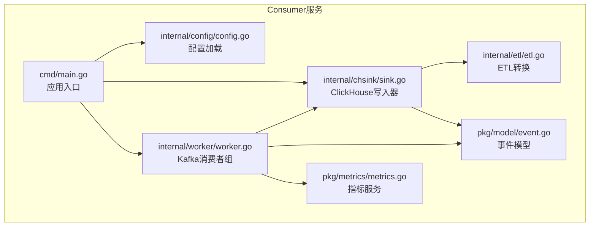
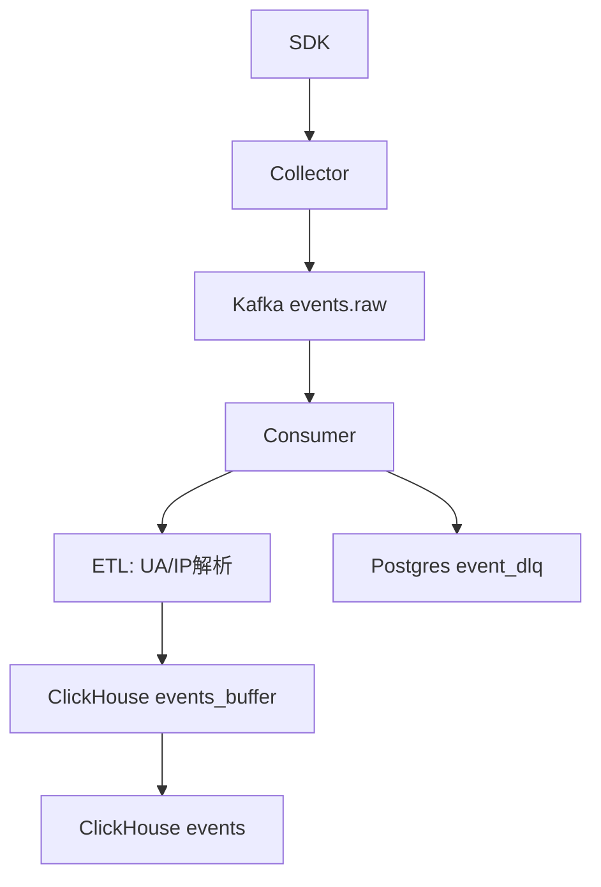
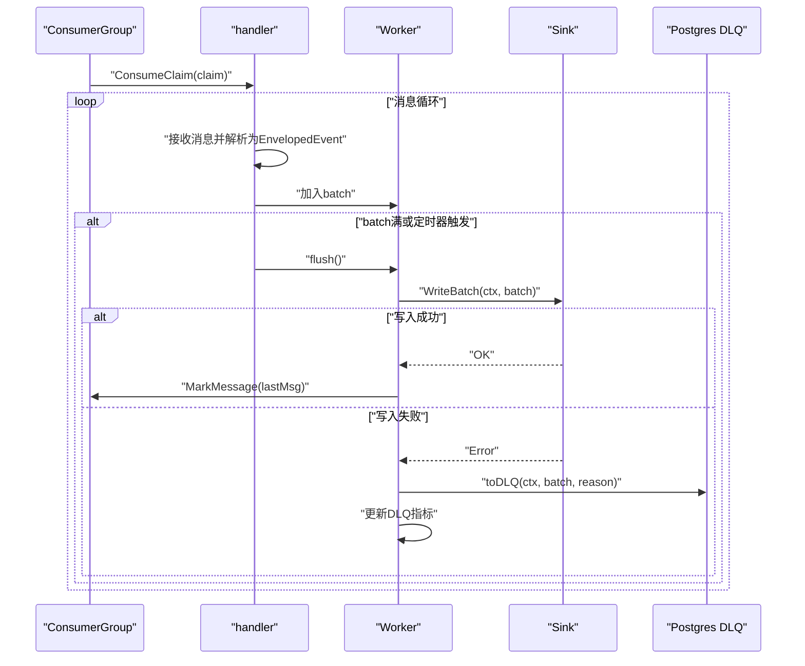
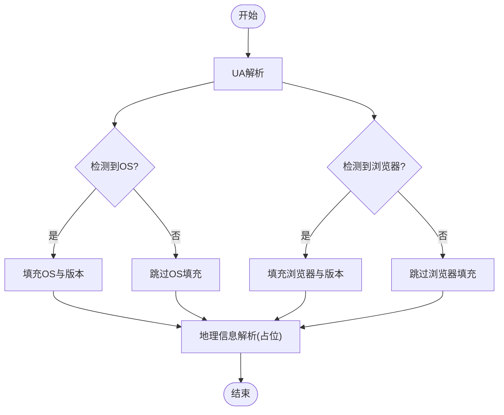
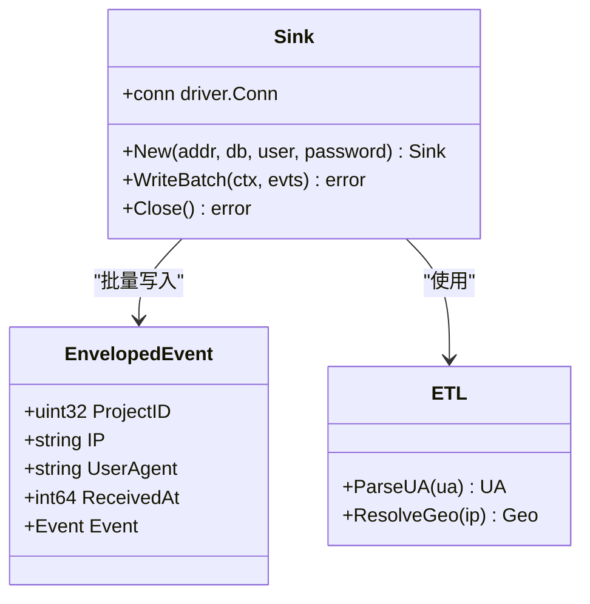
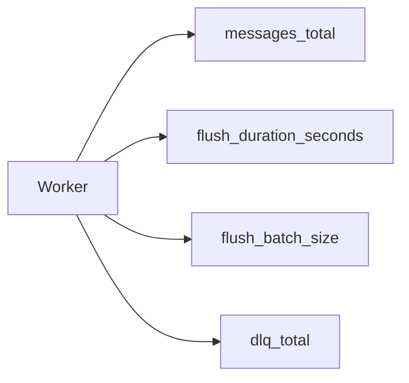
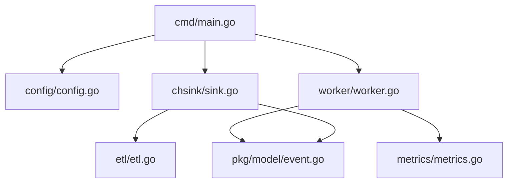

# Consumer服务

<cite>
**本文档引用的文件**
- [main.go](file://server/consumer/cmd/main.go)
- [config.go](file://server/consumer/internal/config/config.go)
- [worker.go](file://server/consumer/internal/worker/worker.go)
- [etl.go](file://server/consumer/internal/etl/etl.go)
- [sink.go](file://server/consumer/internal/chsink/sink.go)
- [event.go](file://server/pkg/model/event.go)
- [metrics.go](file://server/pkg/metrics/metrics.go)
- [architecture.md](file://docs/architecture.md)
- [observability.md](file://docs/observability.md)
- [docker-compose.yml](file://deploy/docker-compose.yml)
- [01_schema.sql](file://deploy/init/clickhouse/01_schema.sql)
- [01_schema.sql](file://deploy/init/postgres/01_schema.sql)
- [README.md](file://server/consumer/README.md)
</cite>

## 目录
1. [简介](#简介)
2. [项目结构](#项目结构)
3. [核心组件](#核心组件)
4. [架构总览](#架构总览)
5. [详细组件分析](#详细组件分析)
6. [依赖关系分析](#依赖关系分析)
7. [性能考虑](#性能考虑)
8. [故障排查指南](#故障排查指南)
9. [结论](#结论)
10. [附录](#附录)

## 简介
本文件面向AeroLog项目中的Consumer服务，提供一份全面的架构文档，重点阐述基于Kafka的事件消费处理流程：消费者组管理、并发工作线程调度、ETL数据转换以及ClickHouse写入。文档将深入解释数据处理管道的每个环节，从Kafka消息解析、数据清洗验证到最终的OLAP存储优化；同时描述Worker的工作机制、任务分配策略和错误重试逻辑，详述ETL转换规则、数据建模与索引优化，并给出性能监控指标、吞吐量调优与故障恢复策略，最后提供配置参数详解与运维最佳实践。

## 项目结构
Consumer服务位于server/consumer目录，采用分层设计：
- cmd：应用入口，负责初始化配置、数据库连接、ClickHouse写入器、Worker实例化与运行控制
- internal/config：配置加载与环境变量解析
- internal/worker：Kafka消费者组、消息批处理、写入触发与DLQ落库
- internal/etl：极简UA解析与地理信息占位解析
- internal/chsink：ClickHouse批量写入器，负责将事件写入events_buffer表
- pkg/model：事件模型定义，包括EnvelopedEvent与Event结构及序列化方法
- pkg/metrics：Prometheus指标注册与/metrics端点服务

图表来源
- [main.go:1-55](file://server/consumer/cmd/main.go#L1-L55)
- [config.go:1-53](file://server/consumer/internal/config/config.go#L1-L53)
- [worker.go:1-173](file://server/consumer/internal/worker/worker.go#L1-L173)
- [etl.go:1-90](file://server/consumer/internal/etl/etl.go#L1-L90)
- [sink.go:1-126](file://server/consumer/internal/chsink/sink.go#L1-L126)
- [event.go:1-84](file://server/pkg/model/event.go#L1-L84)
- [metrics.go:1-81](file://server/pkg/metrics/metrics.go#L1-L81)

章节来源
- [main.go:1-55](file://server/consumer/cmd/main.go#L1-L55)
- [config.go:1-53](file://server/consumer/internal/config/config.go#L1-L53)
- [worker.go:1-173](file://server/consumer/internal/worker/worker.go#L1-L173)
- [etl.go:1-90](file://server/consumer/internal/etl/etl.go#L1-L90)
- [sink.go:1-126](file://server/consumer/internal/chsink/sink.go#L1-L126)
- [event.go:1-84](file://server/pkg/model/event.go#L1-L84)
- [metrics.go:1-81](file://server/pkg/metrics/metrics.go#L1-L81)

## 核心组件
- 配置模块：从环境变量读取Kafka、ClickHouse、Postgres、批处理参数与指标端口，提供FromEnv函数统一构造Config对象
- Worker：封装Sarama消费者组，实现消息批处理、超时控制、错误处理与DLQ落库
- ETL模块：UA极简解析与地理信息占位解析，为写入ClickHouse提供上下文字段
- ClickHouse写入器：PrepareBatch批量插入events_buffer表，支持异步插入与连接池配置
- 指标服务：注册并暴露Prometheus指标，包括消息计数、flush耗时、批次大小与DLQ计数

章节来源
- [config.go:28-45](file://server/consumer/internal/config/config.go#L28-L45)
- [worker.go:40-83](file://server/consumer/internal/worker/worker.go#L40-L83)
- [etl.go:9-89](file://server/consumer/internal/etl/etl.go#L9-L89)
- [sink.go:17-106](file://server/consumer/internal/chsink/sink.go#L17-L106)
- [metrics.go:18-81](file://server/pkg/metrics/metrics.go#L18-L81)

## 架构总览
Consumer服务的数据处理链路如下：
- SDK上报事件经Collector鉴权与限流后写入Kafka events.raw主题
- Consumer以消费者组形式订阅events.raw，进行消息解析与ETL转换
- 成功事件批量写入ClickHouse的events_buffer表，由Buffer引擎异步刷新至events主表
- 失败事件落至Postgres的event_dlq表，便于离线排查与重放

图表来源
- [architecture.md:1-53](file://docs/architecture.md#L1-L53)
- [worker.go:92-154](file://server/consumer/internal/worker/worker.go#L92-L154)
- [sink.go:45-103](file://server/consumer/internal/chsink/sink.go#L45-L103)
- [01_schema.sql:44-49](file://deploy/init/clickhouse/01_schema.sql#L44-L49)
- [01_schema.sql:66-73](file://deploy/init/postgres/01_schema.sql#L66-L73)

## 详细组件分析

### Worker组件分析
Worker负责Kafka消费者组的生命周期管理、消息批处理与写入触发。其核心机制包括：
- 消费者组初始化：使用Sarama配置版本、偏移策略与再均衡策略
- 消息批处理：基于固定批大小与定时器双触发条件，达到阈值或超时即flush
- 错误处理：写入ClickHouse失败时记录日志并调用DLQ落库，同时更新指标
- 上下文控制：使用session.Context监听取消信号，优雅退出

图表来源
- [worker.go:60-83](file://server/consumer/internal/worker/worker.go#L60-L83)
- [worker.go:92-154](file://server/consumer/internal/worker/worker.go#L92-L154)
- [worker.go:156-173](file://server/consumer/internal/worker/worker.go#L156-L173)

章节来源
- [worker.go:40-173](file://server/consumer/internal/worker/worker.go#L40-L173)

### ETL转换规则
ETL模块提供两类富化能力：
- UA解析：从User-Agent字符串中提取浏览器名称与版本、操作系统与版本，支持Edge、Chrome、Firefox、Safari与Windows/macOS/Android/iOS识别
- 地理信息：当前为占位实现，建议接入ip2region或MaxMind等IP库；当前实现对私有地址段与本地回环地址返回空值

图表来源
- [etl.go:29-89](file://server/consumer/internal/etl/etl.go#L29-L89)

章节来源
- [etl.go:9-89](file://server/consumer/internal/etl/etl.go#L9-L89)

### ClickHouse写入器
Sink组件负责将批量事件写入ClickHouse的events_buffer表，其特性包括：
- 连接配置：异步插入开启、等待确认关闭、连接池上限与生命周期设置
- 字段映射：将EnvelopedEvent与ETL结果映射到表字段，含IP规范化、时间戳UTC化、属性JSON序列化
- 批量写入：使用PrepareBatch提升写入效率，Send()提交事务
- 错误处理：异常直接返回，由上层Worker捕获并执行DLQ

图表来源
- [sink.go:17-106](file://server/consumer/internal/chsink/sink.go#L17-L106)
- [event.go:62-69](file://server/pkg/model/event.go#L62-L69)
- [etl.go:29-89](file://server/consumer/internal/etl/etl.go#L29-L89)

章节来源
- [sink.go:17-126](file://server/consumer/internal/chsink/sink.go#L17-L126)
- [event.go:62-83](file://server/pkg/model/event.go#L62-L83)

### 指标与可观测性
Consumer服务通过独立的metrics端口暴露关键指标，便于Prometheus抓取与Grafana可视化：
- aerolog_consumer_messages_total：消费消息总数（ok/invalid）
- aerolog_consumer_flush_duration_seconds：批量写ClickHouse耗时（ok/error）
- aerolog_consumer_flush_batch_size：每次flush的批大小
- aerolog_consumer_dlq_total：进入DLQ的消息数

图表来源
- [metrics.go:18-81](file://server/pkg/metrics/metrics.go#L18-L81)
- [worker.go:19-38](file://server/consumer/internal/worker/worker.go#L19-L38)

章节来源
- [metrics.go:18-81](file://server/pkg/metrics/metrics.go#L18-L81)
- [worker.go:19-38](file://server/consumer/internal/worker/worker.go#L19-L38)

## 依赖关系分析
Consumer服务内部依赖清晰，职责分离明确：
- cmd依赖config、chsink、worker与metrics
- worker依赖sarama、metrics、model与chsink
- chsink依赖clickhouse-go、etl与model
- etl依赖正则表达式与strings
- metrics提供通用指标注册与HTTP服务

图表来源
- [main.go:3-16](file://server/consumer/cmd/main.go#L3-L16)
- [worker.go:4-17](file://server/consumer/internal/worker/worker.go#L4-L17)
- [sink.go:4-15](file://server/consumer/internal/chsink/sink.go#L4-L15)

章节来源
- [main.go:1-55](file://server/consumer/cmd/main.go#L1-L55)
- [worker.go:1-173](file://server/consumer/internal/worker/worker.go#L1-L173)
- [sink.go:1-126](file://server/consumer/internal/chsink/sink.go#L1-L126)

## 性能考虑
- 批处理策略：通过BatchSize与BatchMs控制flush时机，平衡延迟与吞吐
- 连接池与异步写入：ClickHouse连接池上限与异步插入配置降低写入阻塞
- 指标监控：通过flush耗时与批次大小直方图定位瓶颈
- 缓冲表设计：events_buffer使用Buffer引擎，最小化写入延迟并自动刷新
- 建议优化方向：
  - 根据QPS调整BatchSize与BatchMs
  - 监控ClickHouse merges与parts，必要时引入clickhouse-exporter
  - 对DLQ持续率建立告警，防止积压

[本节为通用性能指导，无需特定文件引用]

## 故障排查指南
- Kafka消费失败：检查消费者组是否正常、topic是否存在、broker连通性
- ClickHouse写入失败：查看flush耗时直方图与DLQ计数，确认连接参数与表结构
- DLQ堆积：检查event_dlq表，定位失败原因并修复后重放
- 指标异常：结合Go runtime与process指标判断服务健康度

章节来源
- [worker.go:107-112](file://server/consumer/internal/worker/worker.go#L107-L112)
- [01_schema.sql:66-73](file://deploy/init/postgres/01_schema.sql#L66-L73)

## 结论
Consumer服务通过清晰的分层设计与完善的指标体系，实现了从Kafka到ClickHouse的高效事件处理流水线。其批处理与缓冲表设计兼顾了低延迟与高吞吐，DLQ机制保障了数据可靠性。配合Prometheus与Grafana的可观测性方案，能够有效支撑从MVP到大规模场景的演进。

[本节为总结性内容，无需特定文件引用]

## 附录

### 配置参数详解
- AEROLOG_KAFKA_BROKERS：Kafka集群地址列表，默认localhost:19092
- AEROLOG_KAFKA_TOPIC：事件主题，默认events.raw
- AEROLOG_GROUP_ID：消费者组ID，默认aerolog-consumer
- AEROLOG_CH_ADDR：ClickHouse地址，默认localhost:9000
- AEROLOG_CH_DB：数据库名，默认aerolog
- AEROLOG_CH_USER：用户名，默认aerolog
- AEROLOG_CH_PASSWORD：密码，默认aerolog
- AEROLOG_PG_DSN：Postgres连接串，默认本地开发环境
- AEROLOG_METRICS_ADDR：指标端口，默认:9102

章节来源
- [config.go:28-45](file://server/consumer/internal/config/config.go#L28-L45)
- [README.md:13-25](file://server/consumer/README.md#L13-L25)

### 运维最佳实践
- 使用独立metrics端口暴露指标，避免与业务端口耦合
- 通过Docker Compose快速搭建本地开发环境，生产环境迁移至Kubernetes
- 建立DLQ告警，定期清理与重放失败事件
- 结合kminion监控消费者组lag，及时发现积压

章节来源
- [observability.md:1-67](file://docs/observability.md#L1-L67)
- [docker-compose.yml:1-147](file://deploy/docker-compose.yml#L1-L147)