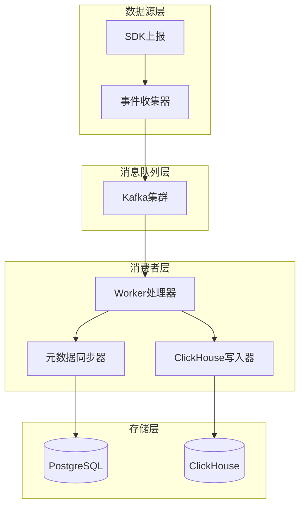
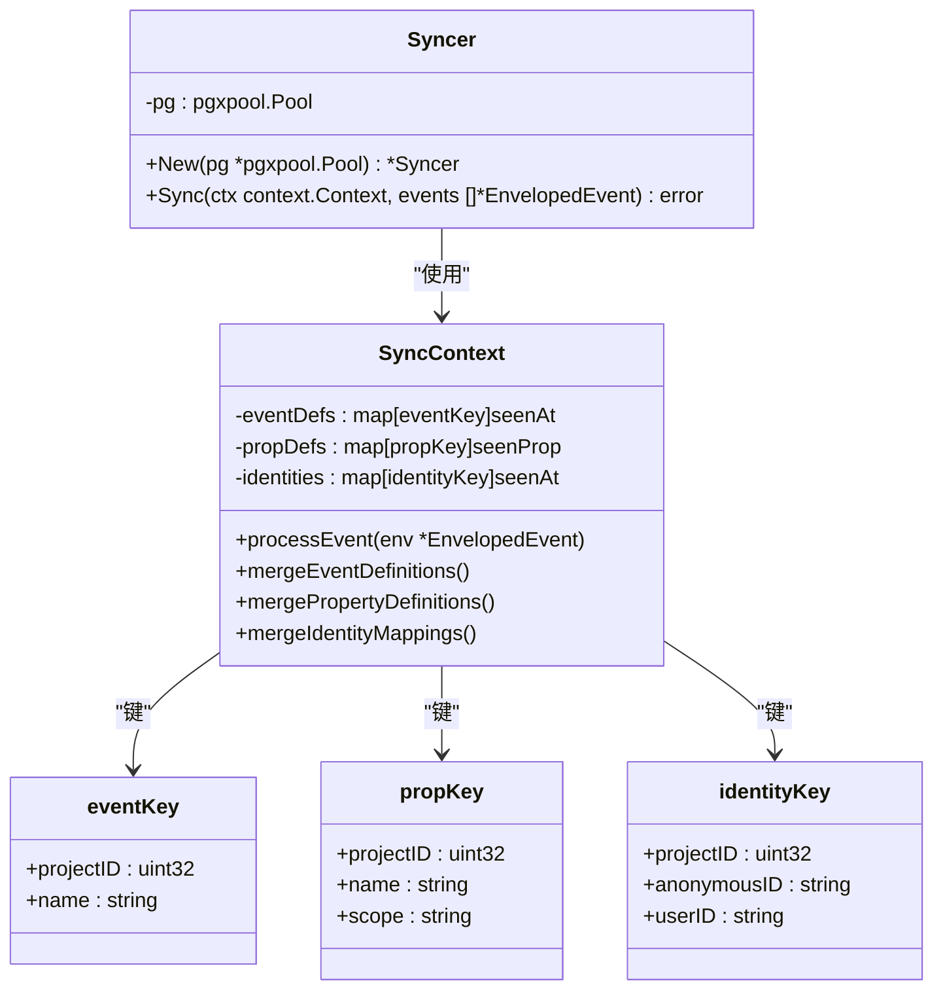
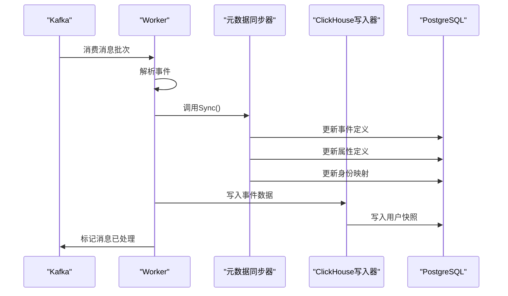
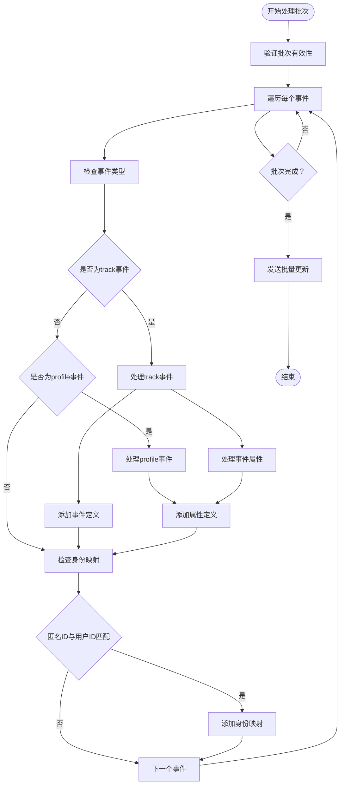
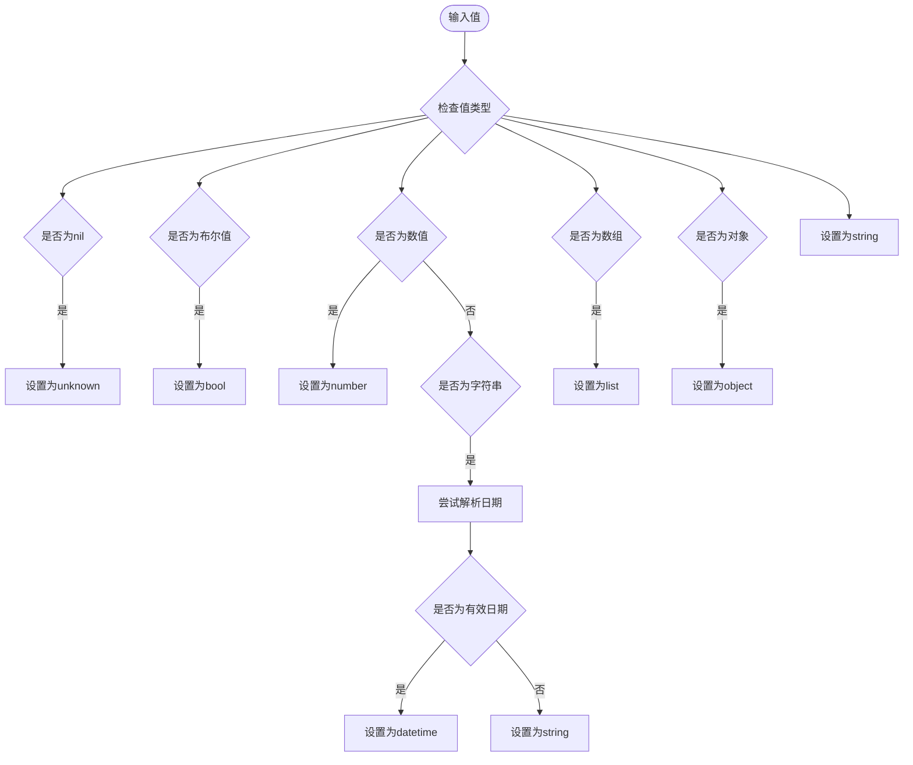
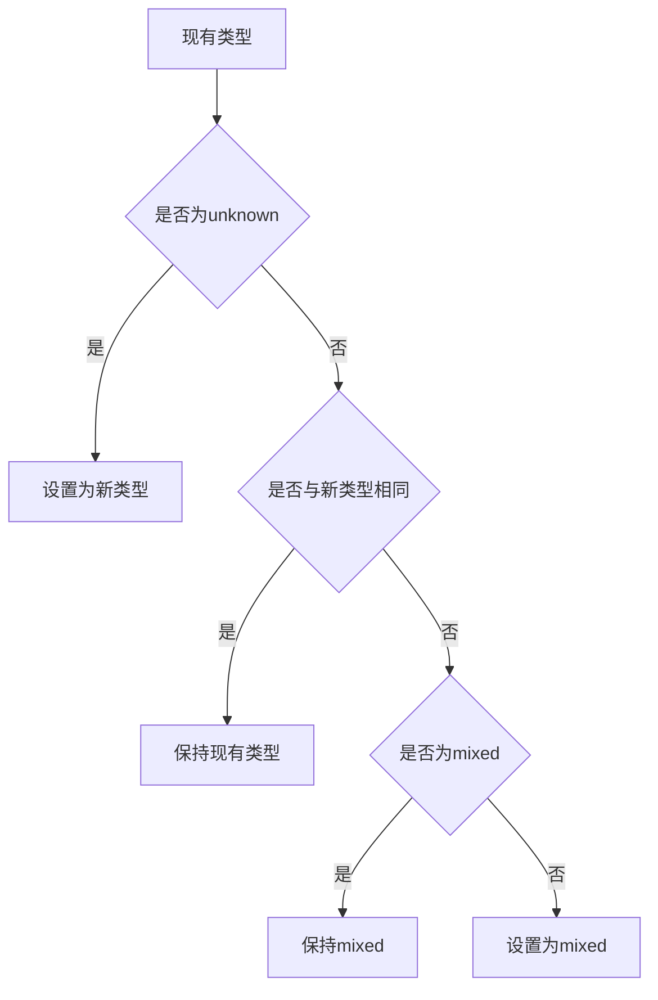
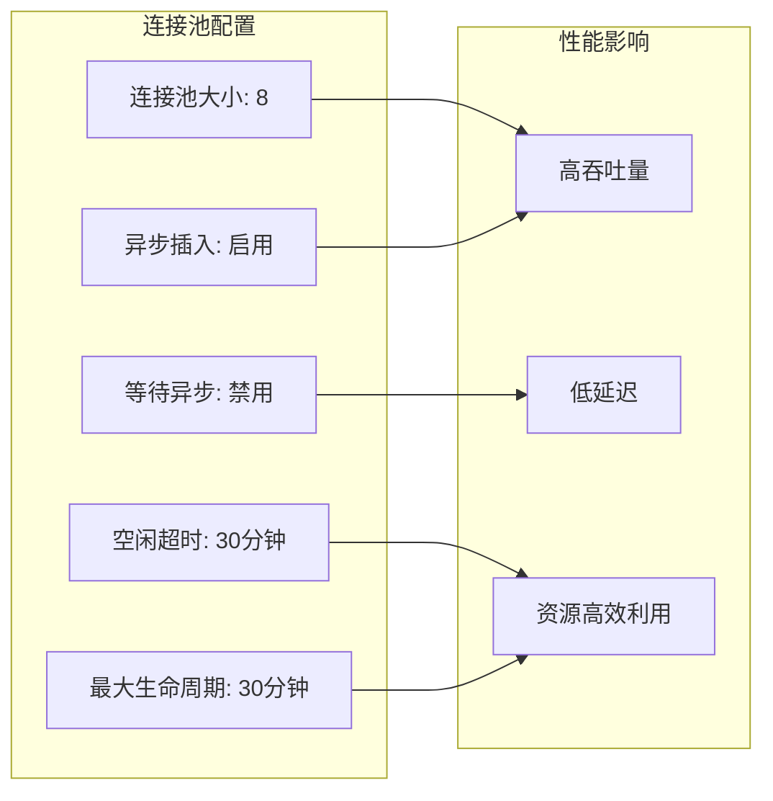
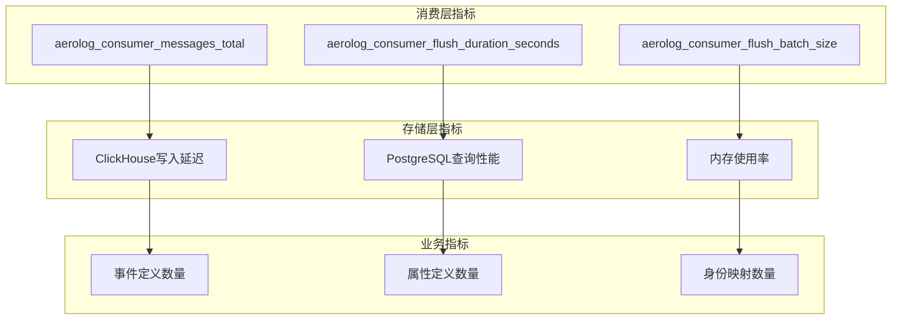
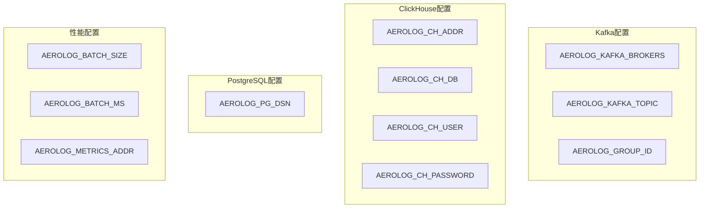
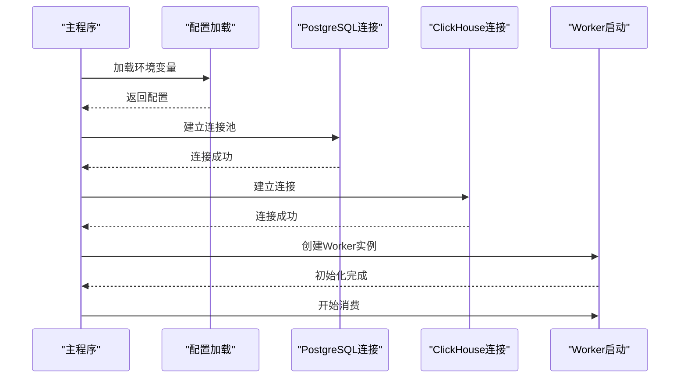

# 元数据同步机制

<cite>
**本文档引用的文件**
- [syncer.go](file://server/consumer/internal/metadata/syncer.go)
- [worker.go](file://server/consumer/internal/worker/worker.go)
- [sink.go](file://server/consumer/internal/chsink/sink.go)
- [event.go](file://server/pkg/model/event.go)
- [main.go](file://server/consumer/cmd/main.go)
- [01_schema.sql](file://deploy/init/postgres/01_schema.sql)
- [01_schema.sql](file://deploy/init/clickhouse/01_schema.sql)
- [config.go](file://server/consumer/internal/config/config.go)
- [cache.go](file://server/collector/internal/projectcache/cache.go)
</cite>

## 目录
1. [简介](#简介)
2. [系统架构概览](#系统架构概览)
3. [核心组件分析](#核心组件分析)
4. [元数据同步流程](#元数据同步流程)
5. [数据库设计](#数据库设计)
6. [类型推断机制](#类型推断机制)
7. [性能优化策略](#性能优化策略)
8. [故障处理机制](#故障处理机制)
9. [监控与指标](#监控与指标)
10. [部署与配置](#部署与配置)

## 简介

AeroLog 的元数据同步机制是整个数据分析平台的核心基础设施，负责维护 PostgreSQL 中的治理表与实时事件流之间的同步。该机制确保事件定义、属性定义和身份映射关系能够随着业务事件的产生而动态更新，为后续的数据分析和可视化提供准确的元数据支持。

元数据同步机制主要包含三个核心功能：
- **事件定义同步**：自动发现新的事件名称并维护其生命周期信息
- **属性定义同步**：识别事件和用户属性并推断数据类型
- **身份映射同步**：建立匿名ID与用户ID之间的关联关系

## 系统架构概览



**图表来源**
- [worker.go:41-51](file://server/consumer/internal/worker/worker.go#L41-L51)
- [syncer.go:15-23](file://server/consumer/internal/metadata/syncer.go#L15-L23)
- [sink.go:21-24](file://server/consumer/internal/chsink/sink.go#L21-L24)

## 核心组件分析

### 元数据同步器 (Syncer)

元数据同步器是整个同步机制的核心组件，负责处理事件流中的元数据提取和更新逻辑。



**图表来源**
- [syncer.go:15-23](file://server/consumer/internal/metadata/syncer.go#L15-L23)
- [syncer.go:99-114](file://server/consumer/internal/metadata/syncer.go#L99-L114)

### 工作进程 (Worker)

工作进程负责从 Kafka 消费消息、批处理和协调各个组件的工作流程。



**图表来源**
- [worker.go:94-156](file://server/consumer/internal/worker/worker.go#L94-L156)
- [worker.go:158-192](file://server/consumer/internal/worker/worker.go#L158-L192)

**章节来源**
- [syncer.go:15-97](file://server/consumer/internal/metadata/syncer.go#L15-L97)
- [worker.go:41-85](file://server/consumer/internal/worker/worker.go#L41-L85)

## 元数据同步流程

### 事件处理流程



**图表来源**
- [syncer.go:25-97](file://server/consumer/internal/metadata/syncer.go#L25-L97)
- [syncer.go:35-69](file://server/consumer/internal/metadata/syncer.go#L35-L69)

### 数据类型推断流程



**图表来源**
- [syncer.go:204-229](file://server/consumer/internal/metadata/syncer.go#L204-L229)

**章节来源**
- [syncer.go:127-156](file://server/consumer/internal/metadata/syncer.go#L127-L156)
- [syncer.go:204-239](file://server/consumer/internal/metadata/syncer.go#L204-L239)

## 数据库设计

### PostgreSQL 元数据表结构

AeroLog 使用 PostgreSQL 存储业务治理元数据，主要包括以下三张核心表：

```mermaid
erDiagram
PROJECTS {
bigint id PK
varchar name
varchar token UK
varchar secret
text description
smallint status
bigint created_by FK
timestamptz created_at
timestamptz updated_at
}
EVENT_DEFINITIONS {
bigint id PK
bigint project_id FK
varchar name
varchar display_name
text description
smallint status
timestamptz first_seen
timestamptz last_seen
timestamptz created_at
timestamptz updated_at
unique(project_id, name)
}
PROPERTY_DEFINITIONS {
bigint id PK
bigint project_id FK
varchar name
varchar display_name
varchar data_type
varchar scope
text description
smallint status
timestamptz first_seen
timestamptz last_seen
timestamptz created_at
timestamptz updated_at
unique(project_id, name, scope)
}
IDENTITY_MAPPINGS {
bigint id PK
bigint project_id FK
varchar anonymous_id
varchar user_id
timestamptz first_seen
timestamptz last_seen
timestamptz created_at
timestamptz updated_at
unique(project_id, anonymous_id, user_id)
}
PROJECTS ||--o{ EVENT_DEFINITIONS : "包含"
PROJECTS ||--o{ PROPERTY_DEFINITIONS : "包含"
PROJECTS ||--o{ IDENTITY_MAPPINGS : "包含"
```

**图表来源**
- [01_schema.sql:38-86](file://deploy/init/postgres/01_schema.sql#L38-L86)

### ClickHouse 事件存储

ClickHouse 作为高性能 OLAP 数据库，专门用于存储海量事件明细数据：

```mermaid
erDiagram
EVENTS_BUFFER {
uint32 project_id
string event
string distinct_id
string user_id
string anonymous_id
datetime64 time
date date
lowcardinality string lib
lowcardinality string os
lowcardinality string browser
ipv4 ip
string properties
datetime received_at
}
USERS {
uint32 project_id
string distinct_id
string user_id
string properties
datetime64 updated_at
}
EVENTS_BUFFER ||--|| USERS : "通过buffer引擎同步"
```

**图表来源**
- [01_schema.sql:6-42](file://deploy/init/clickhouse/01_schema.sql#L6-L42)
- [01_schema.sql:51-62](file://deploy/init/clickhouse/01_schema.sql#L51-L62)

**章节来源**
- [01_schema.sql:38-86](file://deploy/init/postgres/01_schema.sql#L38-L86)
- [01_schema.sql:6-42](file://deploy/init/clickhouse/01_schema.sql#L6-L42)

## 类型推断机制

### 数据类型识别算法

元数据同步器实现了智能的数据类型推断机制，能够根据实际数据内容自动识别属性的数据类型：

| 输入类型 | 推断结果 | 特殊处理 |
|---------|---------|----------|
| nil | unknown | 标记为未知类型 |
| bool | bool | 布尔类型 |
| float64/int* | number | 数值类型，排除NaN和无穷大 |
| string | datetime/string | 尝试RFC3339格式解析 |
| []interface{} | list | 数组类型 |
| map[string]interface{} | object | 对象类型 |
| 其他 | string | 字符串类型 |

### 类型合并策略

当同一属性在不同事件中出现不同类型时，系统采用智能合并策略：



**图表来源**
- [syncer.go:231-239](file://server/consumer/internal/metadata/syncer.go#L231-L239)

**章节来源**
- [syncer.go:204-239](file://server/consumer/internal/metadata/syncer.go#L204-L239)

## 性能优化策略

### 批量处理优化

元数据同步器采用了多种性能优化策略：

1. **内存聚合**：在内存中先聚合所有需要更新的元数据，然后一次性批量提交
2. **批量SQL执行**：使用 PostgreSQL 的批量执行功能减少网络往返
3. **类型推断缓存**：避免重复计算相同类型的属性

### 连接池管理



**图表来源**
- [sink.go:27-47](file://server/consumer/internal/chsink/sink.go#L27-L47)

**章节来源**
- [sink.go:27-47](file://server/consumer/internal/chsink/sink.go#L27-L47)
- [worker.go:20-39](file://server/consumer/internal/worker/worker.go#L20-L39)

## 故障处理机制

### 错误恢复策略

元数据同步机制具备完善的错误处理和恢复能力：

1. **死信队列 (DLQ)**：处理失败的事件会被写入 PostgreSQL 的 `event_dlq` 表
2. **事务回滚**：批量操作中任何一个失败都会导致整个批次回滚
3. **重试机制**：消费者会持续重试失败的消息直到成功

### 监控指标

系统提供了丰富的监控指标来跟踪同步状态：

| 指标名称 | 描述 | 标签 |
|---------|------|------|
| aerolog_consumer_messages_total | 消费的消息总数 | result: ok/error |
| aerolog_consumer_flush_duration_seconds | 批量写 ClickHouse 耗时 | result: ok/error |
| aerolog_consumer_flush_batch_size | 每次 flush 的批大小 | 无 |
| aerolog_consumer_dlq_total | 进入 DLQ 的消息总数 | 无 |

**章节来源**
- [worker.go:20-39](file://server/consumer/internal/worker/worker.go#L20-L39)
- [worker.go:194-210](file://server/consumer/internal/worker/worker.go#L194-L210)

## 监控与指标

### 关键性能指标



**图表来源**
- [worker.go:20-39](file://server/consumer/internal/worker/worker.go#L20-L39)

## 部署与配置

### 环境变量配置



**图表来源**
- [config.go:28-44](file://server/consumer/internal/config/config.go#L28-L44)

### 启动流程



**图表来源**
- [main.go:19-55](file://server/consumer/cmd/main.go#L19-L55)

**章节来源**
- [config.go:28-44](file://server/consumer/internal/config/config.go#L28-L44)
- [main.go:19-55](file://server/consumer/cmd/main.go#L19-L55)

## 总结

AeroLog 的元数据同步机制通过精心设计的架构和算法，实现了高效的事件元数据管理。该机制的主要特点包括：

1. **实时性**：通过 Kafka 流处理实现实时元数据更新
2. **准确性**：智能类型推断确保元数据的精确性
3. **可靠性**：完善的错误处理和恢复机制保证系统稳定性
4. **可扩展性**：模块化的架构设计支持水平扩展
5. **可观测性**：丰富的监控指标帮助运维人员掌握系统状态

该机制为 AeroLog 的数据分析功能奠定了坚实的基础，确保用户能够获得准确、及时的业务洞察。