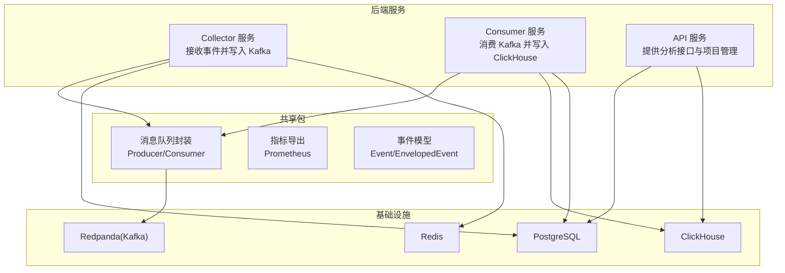
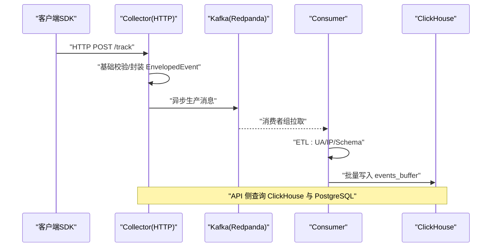
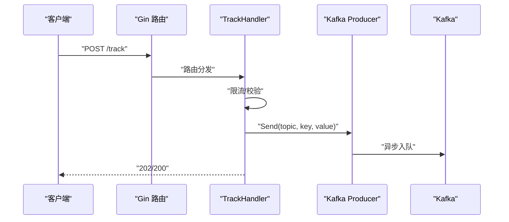
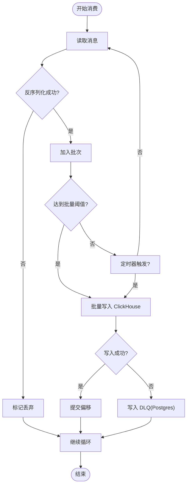
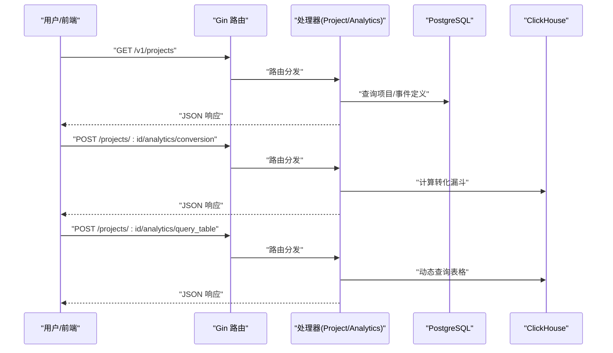
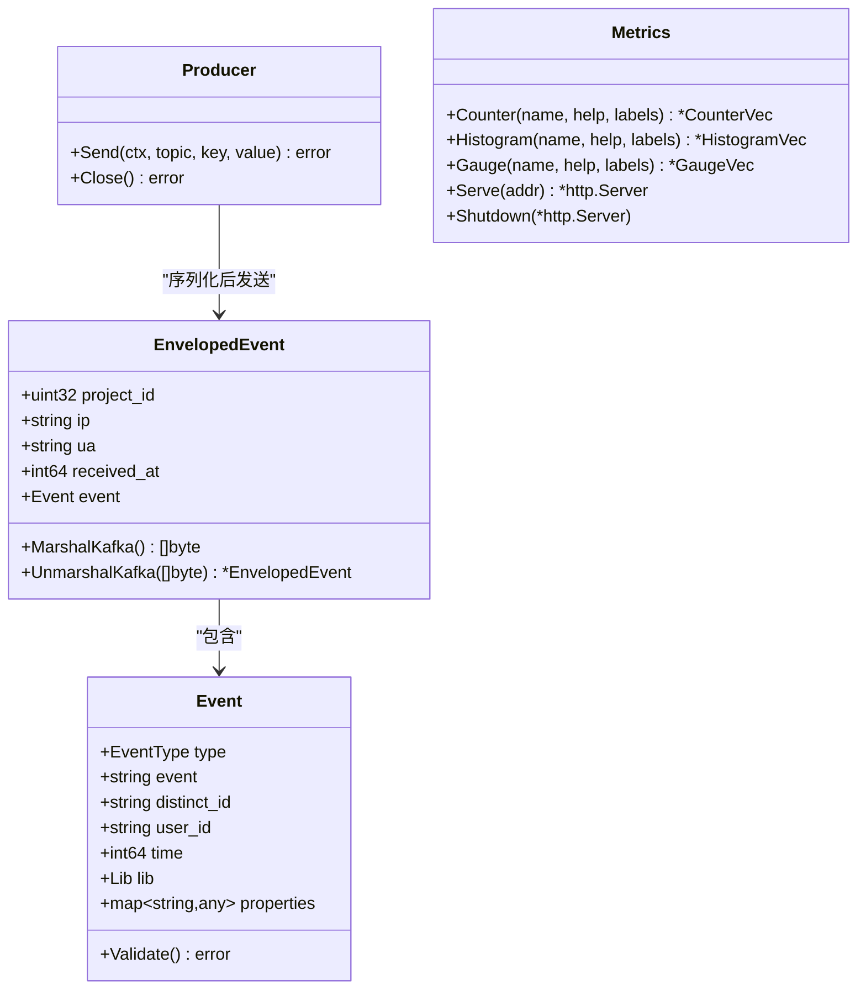
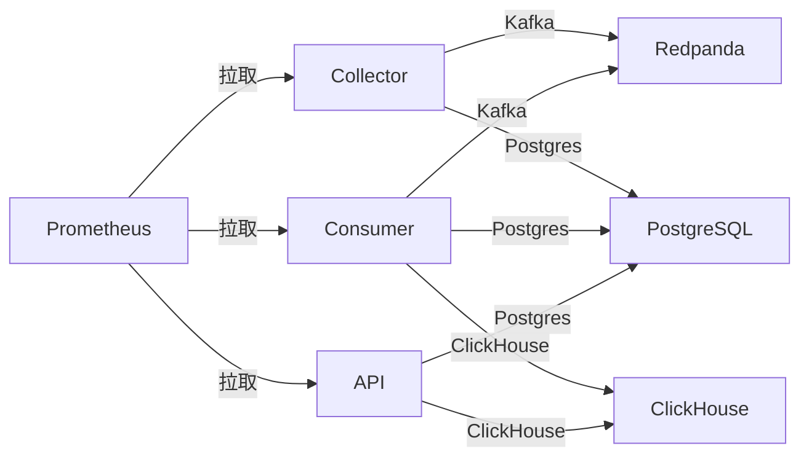

# 后端服务架构

<cite>
**本文引用的文件**
- [server/go.work](file://server/go.work)
- [server/go.work.sum](file://server/go.work.sum)
- [server/api/cmd/main.go](file://server/api/cmd/main.go)
- [server/api/internal/app/app.go](file://server/api/internal/app/app.go)
- [server/api/internal/config/config.go](file://server/api/internal/config/config.go)
- [server/api/internal/handler/analytics.go](file://server/api/internal/handler/analytics.go)
- [server/api/internal/handler/governance.go](file://server/api/internal/handler/governance.go)
- [server/api/internal/handler/project.go](file://server/api/internal/handler/project.go)
- [server/collector/cmd/main.go](file://server/collector/cmd/main.go)
- [server/collector/internal/config/config.go](file://server/collector/internal/config/config.go)
- [server/consumer/cmd/main.go](file://server/consumer/cmd/main.go)
- [server/consumer/internal/config/config.go](file://server/consumer/internal/config/config.go)
- [server/consumer/internal/chsink/sink.go](file://server/consumer/internal/chsink/sink.go)
- [server/consumer/internal/etl/etl.go](file://server/consumer/internal/etl/etl.go)
- [server/consumer/internal/worker/worker.go](file://server/consumer/internal/worker/worker.go)
- [server/pkg/metrics/metrics.go](file://server/pkg/metrics/metrics.go)
- [server/pkg/model/event.go](file://server/pkg/model/event.go)
- [server/pkg/mq/producer.go](file://server/pkg/mq/producer.go)
- [deploy/docker-compose.yml](file://deploy/docker-compose.yml)
- [deploy/init/clickhouse/01_schema.sql](file://deploy/init/clickhouse/01_schema.sql)
</cite>

## 更新摘要
**所做更改**
- 新增转换目标API端点的详细说明，包括转化漏斗分析和目标管理功能
- 增强ClickHouse查询优化机制，包括异步插入和连接池配置
- 完善错误处理机制，涵盖数据库连接、查询执行和API响应处理
- 更新API路由注册和处理程序实现细节
- 增加前端集成示例和实际使用场景

## 目录
1. [引言](#引言)
2. [项目结构](#项目结构)
3. [核心组件](#核心组件)
4. [架构总览](#架构总览)
5. [详细组件分析](#详细组件分析)
6. [依赖分析](#依赖分析)
7. [性能考虑](#性能考虑)
8. [故障排查指南](#故障排查指南)
9. [结论](#结论)
10. [附录](#附录)

## 引言
本文件面向 AeroLog 后端服务的架构与运维，聚焦三大微服务：Collector（采集）、Consumer（消费与ETL）、API（分析与项目管理）。文档从职责边界、配置参数、监控指标、性能调优、服务间通信与容错、服务发现与健康检查、自动扩缩容、部署与运维最佳实践等维度进行系统化说明，帮助读者快速理解并稳定运营该平台。

**更新** 本次更新重点增强了转换目标分析功能、ClickHouse查询优化和错误处理机制，为用户提供更完善的转化漏斗分析和目标管理能力。

## 项目结构
AeroLog 后端采用多模块工作区组织，由 Collector、Consumer、API 三类服务与共享包组成，共享包提供通用模型、消息队列封装与指标导出能力。



**图表来源**
- [server/go.work:1-9](file://server/go.work#L1-L9)
- [server/collector/cmd/main.go:22-54](file://server/collector/cmd/main.go#L22-L54)
- [server/consumer/cmd/main.go:18-37](file://server/consumer/cmd/main.go#L18-L37)
- [server/api/cmd/main.go:35-63](file://server/api/cmd/main.go#L35-L63)

**章节来源**
- [server/go.work:1-9](file://server/go.work#L1-L9)
- [server/go.work.sum:1-180](file://server/go.work.sum#L1-L180)

## 核心组件
- Collector 服务
  - 职责：接收 SDK 上报事件，进行基础校验，封装 EnvelopedEvent，投递至 Kafka。
  - 关键点：基于 Gin 提供 HTTP 接口；使用 PostgreSQL 连接池；Kafka 生产者异步批量发送；独立指标端口暴露。
- Consumer 服务
  - 职责：消费 Kafka 事件，执行 ETL（UA/IP 解析、Schema 校验），批量写入 ClickHouse，异常落库 DLQ。
  - 关键点：基于 Kafka 消费组；定时与容量双触发批量刷新；失败事件写入 PostgreSQL event_dlq。
- API 服务
  - 职责：提供项目管理与分析接口；对接 PostgreSQL 与 ClickHouse；独立指标端口。
  - 关键点：Gin 中间件统计请求耗时与总量；支持 CORS；/healthz 健康检查。

**更新** API服务现已增强转换目标分析功能，包括转化漏斗计算、目标管理和维度拆解分析。

**章节来源**
- [server/collector/cmd/main.go:22-74](file://server/collector/cmd/main.go#L22-L74)
- [server/consumer/cmd/main.go:18-55](file://server/consumer/cmd/main.go#L18-L55)
- [server/api/cmd/main.go:35-121](file://server/api/cmd/main.go#L35-L121)

## 架构总览
整体数据流自下而上：SDK 将事件上报至 Collector；Collector 以 EnvelopedEvent 形式写入 Kafka；Consumer 从 Kafka 消费并进行 ETL，最终批量写入 ClickHouse；API 服务对外提供查询与管理接口。



**图表来源**
- [server/pkg/model/event.go:27-84](file://server/pkg/model/event.go#L27-L84)
- [server/pkg/mq/producer.go:17-40](file://server/pkg/mq/producer.go#L17-L40)
- [server/consumer/internal/worker/worker.go:92-154](file://server/consumer/internal/worker/worker.go#L92-L154)
- [server/consumer/internal/chsink/sink.go:45-103](file://server/consumer/internal/chsink/sink.go#L45-L103)

## 详细组件分析

### Collector 服务
- 入口与路由
  - 使用 Gin 初始化 HTTP 服务器，注册 Track 路由处理器。
- 配置参数
  - 监听地址、指标端口、Kafka 地址列表、主题名、PostgreSQL DSN、Redis 地址、最大请求体字节数。
- 处理流程
  - 从 Postgres 获取项目缓存；对请求体进行限流；调用 Kafka Producer 发送 EnvelopedEvent。
- 监控与指标
  - 独立指标端口暴露；业务中间件统计请求耗时与总量；/healthz 健康检查。
- 错误处理
  - Kafka 生产错误异步消费，避免阻塞；优雅关闭 HTTP 与指标服务。



**图表来源**
- [server/collector/cmd/main.go:39-54](file://server/collector/cmd/main.go#L39-L54)
- [server/collector/internal/config/config.go:19-38](file://server/collector/internal/config/config.go#L19-L38)
- [server/pkg/mq/producer.go:42-60](file://server/pkg/mq/producer.go#L42-L60)

**章节来源**
- [server/collector/cmd/main.go:22-74](file://server/collector/cmd/main.go#L22-L74)
- [server/collector/internal/config/config.go:8-38](file://server/collector/internal/config/config.go#L8-L38)
- [server/pkg/mq/producer.go:12-69](file://server/pkg/mq/producer.go#L12-L69)

### Consumer 服务
- 入口与路由
  - 读取配置，建立 PostgreSQL 连接池与 ClickHouse Sink，启动 Worker 消费组。
- 配置参数
  - Kafka 地址列表、主题、消费者组 ID、批量大小、批量间隔、ClickHouse 连接参数、PostgreSQL DSN、指标端口。
- 处理流程
  - 基于 sarama 消费组；按容量与时间双触发批量；反序列化 EnvelopedEvent；ETL 解析 UA/IP；批量写入 ClickHouse；失败写入 DLQ。
- 监控与指标
  - 消费计数、批量耗时直方图、批量大小直方图、DLQ 计数。
- 错误处理
  - 写入 ClickHouse 失败时记录日志并写入 PostgreSQL event_dlq；优雅退出。



**图表来源**
- [server/consumer/internal/worker/worker.go:92-154](file://server/consumer/internal/worker/worker.go#L92-L154)
- [server/consumer/internal/chsink/sink.go:45-103](file://server/consumer/internal/chsink/sink.go#L45-L103)
- [server/consumer/internal/etl/etl.go:29-73](file://server/consumer/internal/etl/etl.go#L29-L73)

**章节来源**
- [server/consumer/cmd/main.go:18-55](file://server/consumer/cmd/main.go#L18-L55)
- [server/consumer/internal/config/config.go:8-53](file://server/consumer/internal/config/config.go#L8-L53)
- [server/consumer/internal/worker/worker.go:40-173](file://server/consumer/internal/worker/worker.go#L40-L173)
- [server/consumer/internal/chsink/sink.go:17-126](file://server/consumer/internal/chsink/sink.go#L17-L126)
- [server/consumer/internal/etl/etl.go:1-90](file://server/consumer/internal/etl/etl.go#L1-L90)

### API 服务
- 入口与路由
  - 初始化 Gin，注册 CORS 与指标中间件，提供 /healthz；挂载项目、事件定义与分析接口。
- 配置参数
  - 监听地址、指标端口、PostgreSQL DSN、ClickHouse 连接参数、JWT 密钥、允许的 Origin 列表。
- 处理流程
  - 对外提供分析接口；内部连接 ClickHouse 与 PostgreSQL；Gin 中间件统计请求耗时与总量。
- 监控与指标
  - 独立指标端口；请求耗时直方图与请求总量计数。

**更新** API服务现已包含完整的转换目标分析功能，包括：

#### 转换目标管理API
- 列出转换目标：`GET /projects/:id/conversion_goals`
- 创建转换目标：`POST /projects/:id/conversion_goals`
- 删除转换目标：`DELETE /projects/:id/conversion_goals/:goal_id`

#### 转化漏斗分析API
- 转化漏斗计算：`POST /projects/:id/analytics/conversion`
- 支持多步骤转化路径分析
- 支持按属性维度拆解分析
- 支持时间窗口配置

#### 查询表格API
- 动态查询表格：`POST /projects/:id/analytics/query_table`
- 支持多维度聚合
- 支持复杂过滤条件
- 支持JSON属性查询



**图表来源**
- [server/api/cmd/main.go:50-63](file://server/api/cmd/main.go#L50-L63)
- [server/api/internal/config/config.go:24-46](file://server/api/internal/config/config.go#L24-L46)
- [server/api/internal/handler/analytics.go:32-44](file://server/api/internal/handler/analytics.go#L32-L44)

**章节来源**
- [server/api/cmd/main.go:35-121](file://server/api/cmd/main.go#L35-L121)
- [server/api/internal/config/config.go:8-46](file://server/api/internal/config/config.go#L8-L46)
- [server/api/internal/handler/analytics.go:1-1022](file://server/api/internal/handler/analytics.go#L1-L1022)

### 共享包与数据模型
- 事件模型
  - 定义事件类型、SDK 标识、原始事件与封装事件；提供基本校验与序列化/反序列化。
- 指标导出
  - 统一 Prometheus 注册表；提供 Counter/Histogram/Gauge 工厂方法；独立 /metrics 与 /healthz。
- 消息队列封装
  - Kafka 异步生产者，启用 Snappy 压缩、批量与重试；非阻塞发送；异步消费错误。



**图表来源**
- [server/pkg/model/event.go:27-84](file://server/pkg/model/event.go#L27-L84)
- [server/pkg/mq/producer.go:12-69](file://server/pkg/mq/producer.go#L12-L69)
- [server/pkg/metrics/metrics.go:18-81](file://server/pkg/metrics/metrics.go#L18-L81)

**章节来源**
- [server/pkg/model/event.go:1-84](file://server/pkg/model/event.go#L1-L84)
- [server/pkg/metrics/metrics.go:1-81](file://server/pkg/metrics/metrics.go#L1-L81)
- [server/pkg/mq/producer.go:1-69](file://server/pkg/mq/producer.go#L1-L69)

## 依赖分析
- 语言与构建
  - Go 工作区包含 collector、consumer、api、pkg 四个模块；依赖版本由 go.work.sum 管理。
- 外部组件
  - Kafka：Redpanda（Kafka 协议兼容）；Producer 使用 IBM/sarama；Consumer 使用 sarama 消费组。
  - 存储：PostgreSQL（项目与 DLQ）、ClickHouse（事件缓冲表）。
  - 监控：Prometheus 拉取各服务 /metrics；Grafana 展示面板。
- 服务耦合
  - Collector 与 Consumer 通过 Kafka 解耦；API 与数据存储解耦；共享包降低重复实现。



**图表来源**
- [server/go.work:3-8](file://server/go.work#L3-L8)
- [deploy/docker-compose.yml:37-62](file://deploy/docker-compose.yml#L37-L62)
- [server/consumer/internal/chsink/sink.go:23-43](file://server/consumer/internal/chsink/sink.go#L23-L43)

**章节来源**
- [server/go.work:1-9](file://server/go.work#L1-L9)
- [server/go.work.sum:1-180](file://server/go.work.sum#L1-L180)
- [deploy/docker-compose.yml:1-147](file://deploy/docker-compose.yml#L1-L147)

## 性能考虑
- Collector
  - Kafka 生产者启用 Snappy 压缩与批量刷新，减少网络开销；异步发送避免阻塞；建议根据吞吐调优 Flush.Messages 与 Frequency。
  - Gin Recovery 与限流策略降低异常风暴影响。
- Consumer
  - 批量大小与批量间隔控制内存占用与延迟；ClickHouse async_insert 与 wait_for_async_insert 参数平衡一致性与吞吐。
  - ETL 正则解析可替换为更精确的 UA/Geo 解析库以提升准确性与性能。
- API
  - Gin Release 模式与中间件统计有助于定位慢接口；建议对热点查询增加索引与物化视图。
  - **新增** 转换目标分析功能使用 ClickHouse windowFunnel 函数进行高性能漏斗计算。
  - **新增** 查询表格API支持动态维度聚合，优化复杂查询性能。
- 监控
  - 独立指标端口避免业务端口鉴权复杂度；Prometheus 拉取间隔与超时需结合实例规模调整。

**更新** ClickHouse查询优化方面：
- 启用异步插入模式，提升写入性能
- 优化连接池配置，支持并发连接
- 使用windowFunnel函数进行高效转化漏斗计算
- 实现动态查询优化，支持复杂过滤条件

## 故障排查指南
- 健康检查
  - 各服务均提供 /healthz；容器层面通过 healthcheck 实现自动重启。
- 日志与错误
  - Kafka 生产错误异步消费；Consumer 写入 ClickHouse 失败写入 DLQ；建议结合日志与 DLQ 表进行根因分析。
  - **新增** 转换目标分析错误处理，包括数据库连接失败和查询超时。
- 常见问题
  - Kafka 不可达：检查 AEROLOG_KAFKA_BROKERS 与主题存在性；确认 Redpanda 控制台连通。
  - ClickHouse 写入失败：检查 async_insert 设置、连接参数与表结构；关注批量大小与超时。
  - PostgreSQL 连接池耗尽：检查 DSN 与连接池上限；优化查询与事务时长。
  - 指标不可达：确认 AEROLOG_METRICS_ADDR 未与业务端口冲突；Prometheus 抓取目标正确。
  - **新增** 转换目标查询失败：检查conversion_goals表结构和索引配置。

**更新** 新增转换目标分析相关的故障排查：
- 转化漏斗计算超时：检查windowFunnel参数和时间范围配置
- 目标管理API错误：验证PostgreSQL连接和conversion_goals表权限
- 查询表格性能问题：优化WHERE条件和GROUP BY字段

**章节来源**
- [server/collector/cmd/main.go:50-54](file://server/collector/cmd/main.go#L50-L54)
- [server/consumer/cmd/main.go:36-37](file://server/consumer/cmd/main.go#L36-L37)
- [server/api/cmd/main.go:53-53](file://server/api/cmd/main.go#L53-L53)
- [server/consumer/internal/worker/worker.go:108-112](file://server/consumer/internal/worker/worker.go#L108-L112)
- [deploy/docker-compose.yml:17-21](file://deploy/docker-compose.yml#L17-L21)

## 结论
AeroLog 后端以清晰的职责划分与解耦设计实现了高并发事件采集、可靠消费与高效分析。通过 Kafka 实现采集与消费解耦、ClickHouse 支撑海量事件存储、独立指标端口与容器健康检查保障可观测性与稳定性。**更新后的架构**进一步增强了转换目标分析能力，提供完整的转化漏斗计算和目标管理功能，为业务分析提供更强大的支持。

建议在生产环境中进一步完善 ETL 准确性、优化批量参数、强化告警与自动扩缩容策略，同时充分利用新增的转换目标分析功能提升业务洞察力。

## 附录

### 部署配置示例
- Docker Compose
  - 包含 Postgres、Redis、Redpanda、Redpanda Console、ClickHouse、MinIO、Prometheus、Grafana。
  - Kafka/Console/ClickHouse/MinIO 端口映射与持久化目录配置。
- Prometheus
  - 拉取 collector/consumer/api 的 /metrics；保留期与生命周期接口配置。
- Grafana
  - 预置 Prometheus 数据源与 AeroLog 仪表盘。

**章节来源**
- [deploy/docker-compose.yml:1-147](file://deploy/docker-compose.yml#L1-L147)

### 运维最佳实践
- 服务发现与负载均衡
  - 容器编排中通过服务名访问；如需外部 LB，建议使用 Nginx 或 Ingress；Kafka 消费组自动分区再平衡。
- 故障恢复
  - 健康检查失败自动重启；Kafka 消费组重平衡；DLQ 作为兜底；ClickHouse async_insert 提升写入弹性。
- 自动扩缩容
  - 基于 CPU/内存与指标（请求速率、延迟、Kafka lag）设置 HPA；Consumer 可水平扩展以提升吞吐。
- 安全与合规
  - 禁止将密钥硬编码在镜像；使用 Secret 管理；限制容器权限与资源配额；开启 TLS（Kafka/ClickHouse/Postgres）。
- **新增** 转换目标分析运维
  - 监控转化漏斗计算性能，设置合理的windowFunnel参数
  - 定期清理过期的转换目标，优化conversion_goals表空间
  - 监控查询表格API的复杂查询执行时间，及时优化慢查询

### 转换目标分析使用示例
- 创建转化目标
  ```bash
  curl -X POST /projects/1/conversion_goals \
    -H "Content-Type: application/json" \
    -d '{
      "name": "购买转化",
      "events": ["浏览页面", "加入购物车", "下单支付"],
      "window_seconds": 7*24*3600,
      "breakdown_property": "utm_source"
    }'
  ```

- 计算转化漏斗
  ```bash
  curl -X POST /projects/1/analytics/conversion \
    -H "Content-Type: application/json" \
    -d '{
      "events": ["浏览页面", "加入购物车", "下单支付"],
      "from": 1640995200000,
      "to": 1643673600000,
      "window_seconds": 7*24*3600,
      "breakdown_property": "utm_source"
    }'
  ```

- 查询表格数据
  ```bash
  curl -X POST /projects/1/analytics/query_table \
    -H "Content-Type: application/json" \
    -d '{
      "events": ["浏览页面", "加入购物车", "下单支付"],
      "from": 1640995200000,
      "to": 1643673600000,
      "limit": 100,
      "dimensions": [
        {"type": "event", "key": "event"},
        {"type": "property", "key": "utm_source"}
      ],
      "filters": [
        {"event": "浏览页面", "property": "device", "op": "eq", "value": "mobile"}
      ]
    }'
  ```