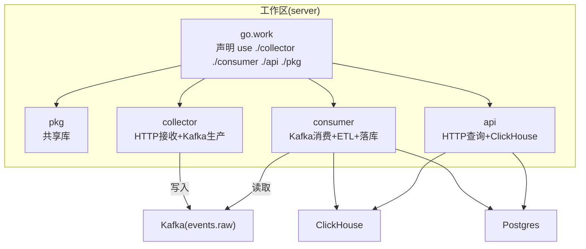
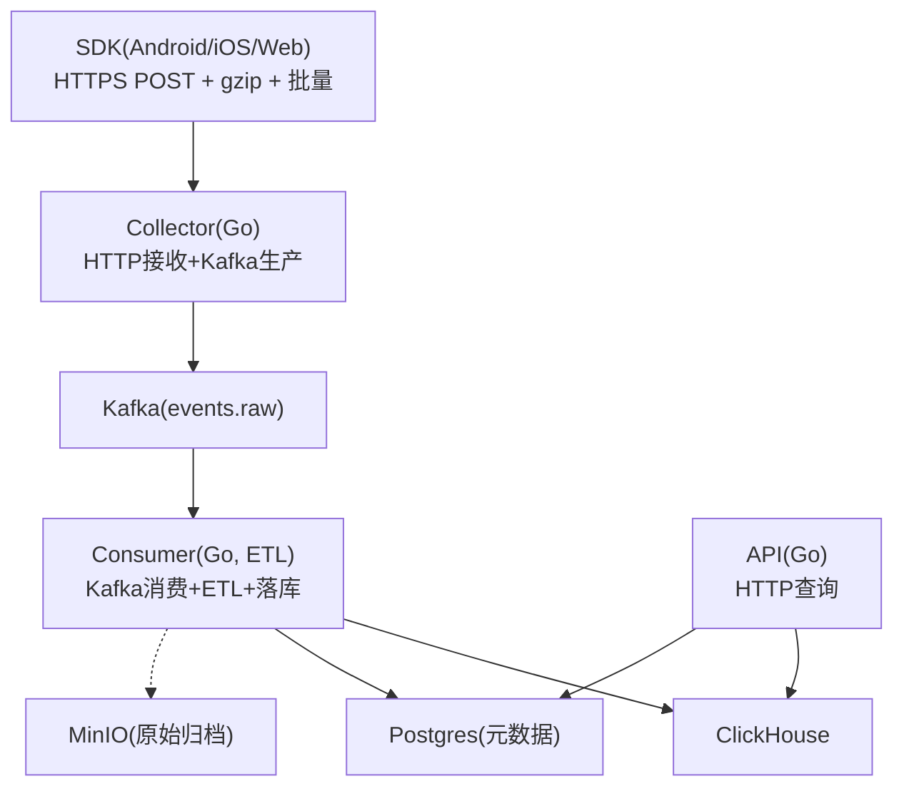
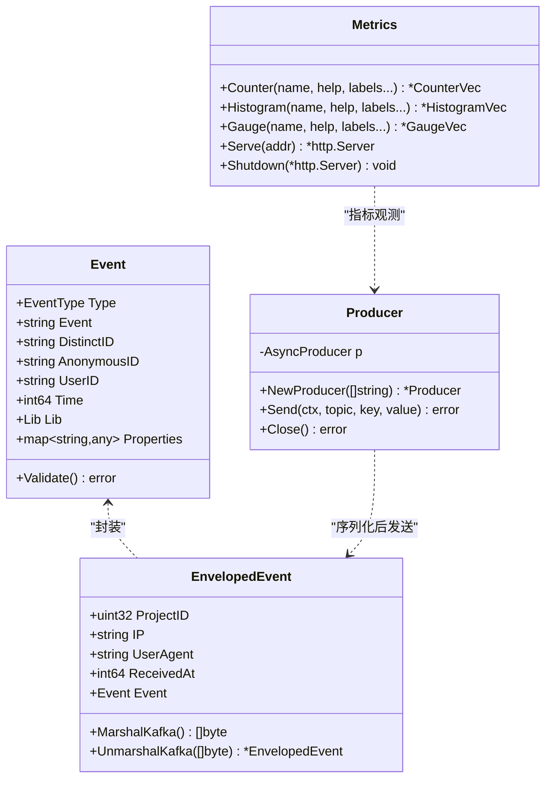
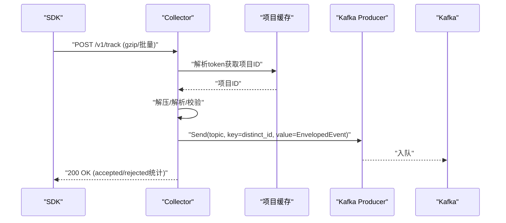
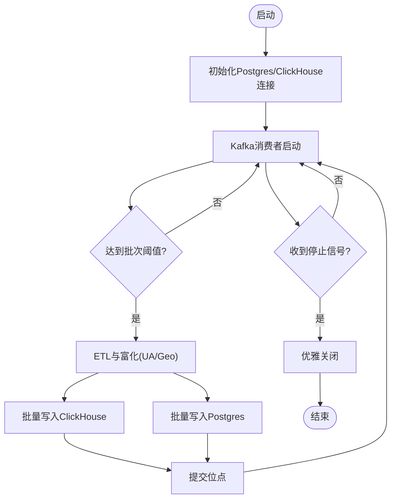
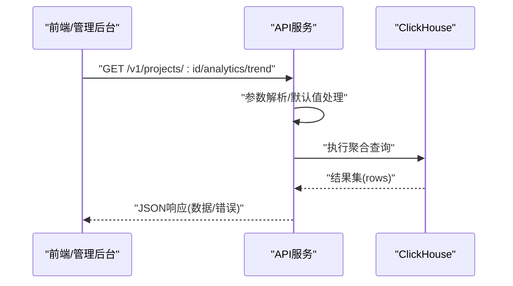
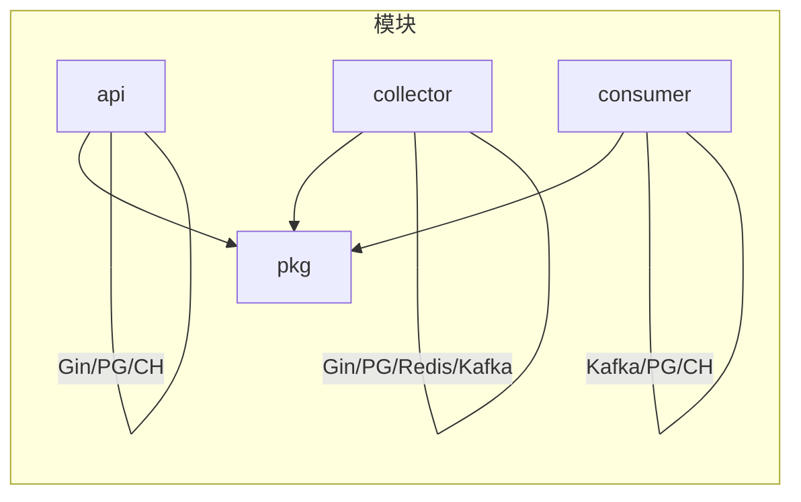

# 代码结构说明

<cite>
**本文引用的文件**
- [README.md](file://README.md)
- [server/go.work](file://server/go.work)
- [server/go.work.sum](file://server/go.work.sum)
- [server/pkg/go.mod](file://server/pkg/go.mod)
- [server/api/go.mod](file://server/api/go.mod)
- [server/collector/go.mod](file://server/collector/go.mod)
- [server/consumer/go.mod](file://server/consumer/go.mod)
- [server/api/cmd/main.go](file://server/api/cmd/main.go)
- [server/collector/cmd/main.go](file://server/collector/cmd/main.go)
- [server/consumer/cmd/main.go](file://server/consumer/cmd/main.go)
- [server/pkg/model/event.go](file://server/pkg/model/event.go)
- [server/pkg/mq/producer.go](file://server/pkg/mq/producer.go)
- [server/pkg/metrics/metrics.go](file://server/pkg/metrics/metrics.go)
- [server/api/internal/config/config.go](file://server/api/internal/config/config.go)
- [server/collector/internal/config/config.go](file://server/collector/internal/config/config.go)
- [server/consumer/internal/config/config.go](file://server/consumer/internal/config/config.go)
- [server/collector/internal/handler/track.go](file://server/collector/internal/handler/track.go)
- [server/api/internal/handler/analytics.go](file://server/api/internal/handler/analytics.go)
- [server/consumer/internal/etl/etl.go](file://server/consumer/internal/etl/etl.go)
</cite>

## 目录
1. [简介](#简介)
2. [项目结构](#项目结构)
3. [核心组件](#核心组件)
4. [架构总览](#架构总览)
5. [详细组件分析](#详细组件分析)
6. [依赖分析](#依赖分析)
7. [性能考虑](#性能考虑)
8. [故障排查指南](#故障排查指南)
9. [结论](#结论)
10. [附录](#附录)

## 简介
本文件面向AeroLog项目的开发者与维护者，系统性梳理服务端Go工作区的组织方式、模块化设计与共享库复用策略，深入解析三大服务（api、collector、consumer）的职责边界与代码组织，同时给出SDK侧模块化设计的指导原则与共享配置/工具类的复用机制。文档还提供代码导航指南、包导入关系图与模块依赖说明，帮助读者快速定位功能模块并理解整体架构。

## 项目结构
AeroLog采用“工作区 + 多模块”的Go组织方式，服务端位于server目录，包含三个独立可运行的服务模块与一个共享库模块，配合工作区文件统一管理版本与依赖锁定。前端web应用位于独立目录，SDK分别覆盖Android、iOS与Web三端。

- 工作区与模块
  - 工作区文件声明了四个模块：collector、consumer、api、pkg，统一Go版本与模块路径。
  - 各服务模块通过replace指令指向本地共享库，确保开发期可直接修改共享库并即时生效。
- 服务模块职责
  - api：提供管理与查询API，基于Gin框架，对接Postgres与ClickHouse。
  - collector：高并发接收SDK上报，进行基础校验与限流，写入Kafka。
  - consumer：从Kafka消费事件，执行ETL与富化，落库至ClickHouse与Postgres。
  - pkg：共享库，提供事件模型、消息队列封装、Prometheus指标等通用能力。

图表来源
- [server/go.work:1-9](file://server/go.work#L1-L9)
- [server/api/cmd/main.go:1-121](file://server/api/cmd/main.go#L1-L121)
- [server/collector/cmd/main.go:1-74](file://server/collector/cmd/main.go#L1-L74)
- [server/consumer/cmd/main.go:1-55](file://server/consumer/cmd/main.go#L1-L55)

章节来源
- [README.md:1-50](file://README.md#L1-L50)
- [server/go.work:1-9](file://server/go.work#L1-L9)
- [server/go.work.sum:1-180](file://server/go.work.sum#L1-L180)

## 核心组件
- 共享库(pkg)
  - 事件模型：统一SDK上报与服务端流转的事件结构，包含基础校验与Kafka序列化接口。
  - 消息队列：对Sarama的薄封装，提供异步生产者、批量发送与错误处理。
  - 指标监控：基于Prometheus的指标注册与独立/metrics端口暴露。
- 服务模块(api/collector/consumer)
  - 通过各自的cmd/main入口初始化配置、连接外部系统、注册路由与任务，统一使用pkg中的共享能力。
  - 通过replace指向本地pkg，避免发布与版本漂移带来的复杂性。

章节来源
- [server/pkg/model/event.go:1-84](file://server/pkg/model/event.go#L1-L84)
- [server/pkg/mq/producer.go:1-69](file://server/pkg/mq/producer.go#L1-L69)
- [server/pkg/metrics/metrics.go:1-81](file://server/pkg/metrics/metrics.go#L1-L81)
- [server/api/go.mod:1-13](file://server/api/go.mod#L1-L13)
- [server/collector/go.mod:1-13](file://server/collector/go.mod#L1-L13)
- [server/consumer/go.mod:1-13](file://server/consumer/go.mod#L1-L13)

## 架构总览
整体链路遵循“采集-缓冲-消费-存储”的分层设计：SDK通过HTTPS批量上报，collector接收并写入Kafka；consumer消费Kafka事件，执行ETL与富化，最终落库至ClickHouse与Postgres；api提供查询与管理接口。

图表来源
- [README.md:24-34](file://README.md#L24-L34)
- [server/collector/cmd/main.go:1-74](file://server/collector/cmd/main.go#L1-L74)
- [server/consumer/cmd/main.go:1-55](file://server/consumer/cmd/main.go#L1-L55)
- [server/api/cmd/main.go:1-121](file://server/api/cmd/main.go#L1-L121)

## 详细组件分析

### 共享库(pkg)设计与使用
- 事件模型(model)
  - 统一事件类型、SDK标识、原始事件与封装事件，提供Kafka序列化/反序列化接口，确保跨服务一致性。
  - 基础校验逻辑集中在事件模型中，降低下游复杂度。
- 消息队列(mq)
  - 对Sarama AsyncProducer进行薄封装，启用Snappy压缩、批量刷新、重试与异步错误通道，满足高吞吐场景。
  - 提供非阻塞Send接口与优雅关闭。
- 指标监控(metrics)
  - 默认注册Go runtime与process指标，提供Counter/Histogram/Gauge工厂方法。
  - 独立/metrics端口暴露，避免与业务端口耦合。

图表来源
- [server/pkg/model/event.go:1-84](file://server/pkg/model/event.go#L1-L84)
- [server/pkg/mq/producer.go:1-69](file://server/pkg/mq/producer.go#L1-L69)
- [server/pkg/metrics/metrics.go:1-81](file://server/pkg/metrics/metrics.go#L1-L81)

章节来源
- [server/pkg/model/event.go:1-84](file://server/pkg/model/event.go#L1-L84)
- [server/pkg/mq/producer.go:1-69](file://server/pkg/mq/producer.go#L1-L69)
- [server/pkg/metrics/metrics.go:1-81](file://server/pkg/metrics/metrics.go#L1-L81)

### Collector服务：高并发接收与Kafka写入
- 职责
  - 解析SDK上报，进行基础校验与限流，提取客户端IP与UA，封装为EnvelopedEvent并写入Kafka。
  - 提供健康检查与指标端口。
- 关键流程
  - 认证：通过项目令牌解析项目ID。
  - 解析：支持gzip压缩与单条/数组两种上报格式。
  - 校验：调用事件模型的Validate进行基础校验。
  - 发送：以distinct_id作为key保证同用户事件落入同一分区，提升消费时序性。
- 中间件与可观测性
  - 使用Gin中间件记录请求耗时与总量，结合pkg.metrics导出Prometheus指标。

图表来源
- [server/collector/cmd/main.go:1-74](file://server/collector/cmd/main.go#L1-L74)
- [server/collector/internal/handler/track.go:1-211](file://server/collector/internal/handler/track.go#L1-L211)
- [server/pkg/mq/producer.go:1-69](file://server/pkg/mq/producer.go#L1-L69)
- [server/pkg/model/event.go:1-84](file://server/pkg/model/event.go#L1-L84)

章节来源
- [server/collector/cmd/main.go:1-74](file://server/collector/cmd/main.go#L1-L74)
- [server/collector/internal/handler/track.go:1-211](file://server/collector/internal/handler/track.go#L1-L211)
- [server/collector/internal/config/config.go:1-38](file://server/collector/internal/config/config.go#L1-L38)

### Consumer服务：Kafka消费与ETL
- 职责
  - 从Kafka拉取消息，执行ETL与富化（UA解析、地理信息占位），批量写入ClickHouse与Postgres。
  - 提供独立指标端口与优雅退出。
- 关键流程
  - 初始化ClickHouse连接与Postgres连接池。
  - 启动Worker循环消费，按批次大小与频率提交。
  - ETL阶段：极简UA解析与地理信息占位，后续可替换为专业库。
- 错误处理
  - 消费异常与写库失败均记录日志并继续处理，避免单点故障影响整体。

图表来源
- [server/consumer/cmd/main.go:1-55](file://server/consumer/cmd/main.go#L1-L55)
- [server/consumer/internal/etl/etl.go:1-90](file://server/consumer/internal/etl/etl.go#L1-L90)

章节来源
- [server/consumer/cmd/main.go:1-55](file://server/consumer/cmd/main.go#L1-L55)
- [server/consumer/internal/config/config.go:1-53](file://server/consumer/internal/config/config.go#L1-L53)
- [server/consumer/internal/etl/etl.go:1-90](file://server/consumer/internal/etl/etl.go#L1-L90)

### API服务：查询与管理
- 职责
  - 提供项目与事件分析相关的查询接口，如趋势、Top事件、漏斗、留存等。
  - 通过ClickHouse驱动执行SQL，返回聚合结果。
- 关键流程
  - 注册路由组，绑定各分析接口。
  - 参数校验与默认值处理，构造ClickHouse查询语句。
  - 结果集映射与JSON响应。

图表来源
- [server/api/cmd/main.go:1-121](file://server/api/cmd/main.go#L1-L121)
- [server/api/internal/handler/analytics.go:1-304](file://server/api/internal/handler/analytics.go#L1-L304)

章节来源
- [server/api/cmd/main.go:1-121](file://server/api/cmd/main.go#L1-L121)
- [server/api/internal/config/config.go:1-46](file://server/api/internal/config/config.go#L1-L46)
- [server/api/internal/handler/analytics.go:1-304](file://server/api/internal/handler/analytics.go#L1-L304)

## 依赖分析
- 工作区与模块
  - go.work声明四个模块，统一Go版本，避免重复依赖与版本冲突。
  - go.work.sum记录工作区依赖树，确保构建一致性。
- 模块依赖
  - api/collector/consumer均依赖pkg，通过replace指向本地共享库，便于联调与热迭代。
  - 第三方依赖通过各模块go.mod声明，如Gin、Sarama、pgx、ClickHouse驱动、Prometheus等。
- 导入关系图

图表来源
- [server/go.work:1-9](file://server/go.work#L1-L9)
- [server/api/go.mod:1-13](file://server/api/go.mod#L1-L13)
- [server/collector/go.mod:1-13](file://server/collector/go.mod#L1-L13)
- [server/consumer/go.mod:1-13](file://server/consumer/go.mod#L1-L13)
- [server/pkg/go.mod:1-11](file://server/pkg/go.mod#L1-L11)

章节来源
- [server/go.work:1-9](file://server/go.work#L1-L9)
- [server/go.work.sum:1-180](file://server/go.work.sum#L1-L180)
- [server/api/go.mod:1-13](file://server/api/go.mod#L1-L13)
- [server/collector/go.mod:1-13](file://server/collector/go.mod#L1-L13)
- [server/consumer/go.mod:1-13](file://server/consumer/go.mod#L1-L13)
- [server/pkg/go.mod:1-11](file://server/pkg/go.mod#L1-L11)

## 性能考虑
- Collector
  - 使用异步生产者与批量刷新，减少网络往返；以distinct_id作为Key保证分区局部性，利于下游有序处理。
  - gzip解压与最大请求体限制，平衡带宽与安全。
- Consumer
  - 批量大小与频率可调，结合ClickHouse批量写入接口，提高吞吐。
  - ETL阶段保持轻量，复杂解析建议下沉或异步化。
- API
  - 查询接口尽量利用ClickHouse的向量化与物化视图能力，必要时添加索引与分区策略。
- 指标与可观测性
  - 独立metrics端口避免与业务端口争用资源，便于Prometheus抓取与告警。

## 故障排查指南
- 常见问题定位
  - Collector
    - 认证失败：检查项目令牌与项目缓存解析逻辑。
    - Kafka发送失败：查看Producer错误通道与网络连通性。
    - 请求过大：确认MaxBodyBytes限制与SDK压缩设置。
  - Consumer
    - Kafka消费停滞：检查消费者组状态与分区分配。
    - ClickHouse写入失败：核对连接参数与表结构。
  - API
    - 查询超时：优化SQL或增加索引；检查ClickHouse负载。
- 日志与指标
  - 通过pkg.metrics导出的/metrics端点与服务日志定位瓶颈。
  - 使用健康检查端点确认服务存活。

章节来源
- [server/collector/internal/handler/track.go:1-211](file://server/collector/internal/handler/track.go#L1-L211)
- [server/consumer/cmd/main.go:1-55](file://server/consumer/cmd/main.go#L1-L55)
- [server/api/internal/handler/analytics.go:1-304](file://server/api/internal/handler/analytics.go#L1-L304)
- [server/pkg/metrics/metrics.go:1-81](file://server/pkg/metrics/metrics.go#L1-L81)

## 结论
AeroLog的服务端通过Go工作区与共享库实现了清晰的模块化与高内聚低耦合：collector负责高吞吐接入，consumer专注ETL与落库，api提供分析查询，pkg沉淀通用能力。配合独立指标端口与明确的职责边界，整体架构具备良好的扩展性与可维护性。建议在后续迭代中完善UA解析与地理信息解析、引入更细粒度的监控与告警，并持续优化查询与写入路径。

## 附录
- 代码导航指南
  - 共享库
    - 事件模型：server/pkg/model/event.go
    - 消息队列：server/pkg/mq/producer.go
    - 指标监控：server/pkg/metrics/metrics.go
  - Collector
    - 入口：server/collector/cmd/main.go
    - 配置：server/collector/internal/config/config.go
    - 路由与处理器：server/collector/internal/handler/track.go
  - Consumer
    - 入口：server/consumer/cmd/main.go
    - 配置：server/consumer/internal/config/config.go
    - ETL：server/consumer/internal/etl/etl.go
  - API
    - 入口：server/api/cmd/main.go
    - 配置：server/api/internal/config/config.go
    - 分析接口：server/api/internal/handler/analytics.go
- SDK模块化设计要点
  - 三端SDK共享协议与上报格式，确保跨端一致性。
  - 本地缓存策略（Android Room、iOS SQLite、Web IndexedDB）提升离线与弱网体验。
  - 统一的配置类与工具类在各端复用，减少重复实现与维护成本。