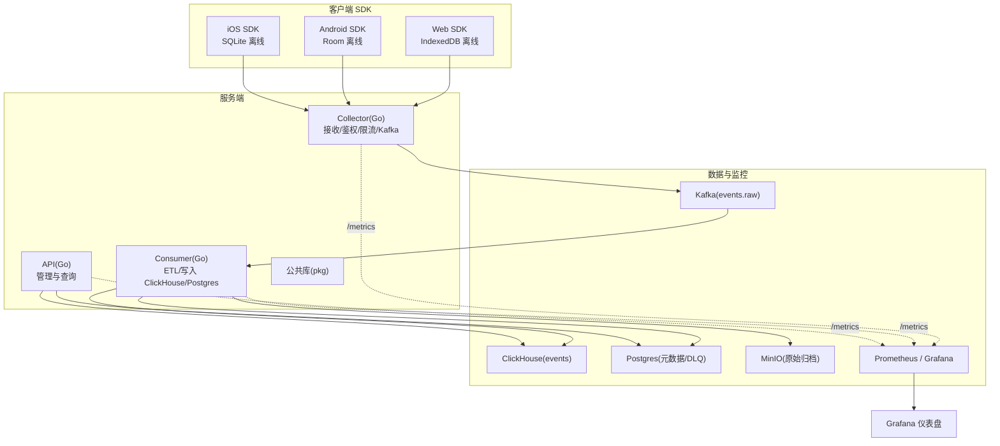
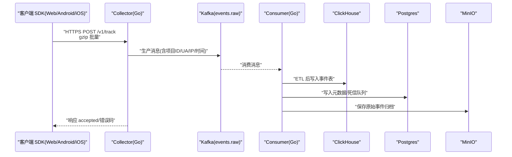
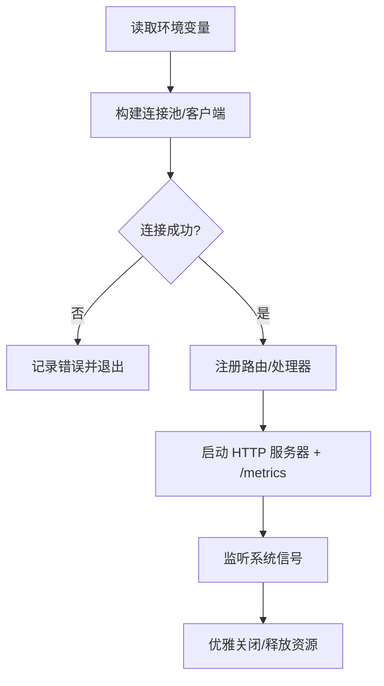
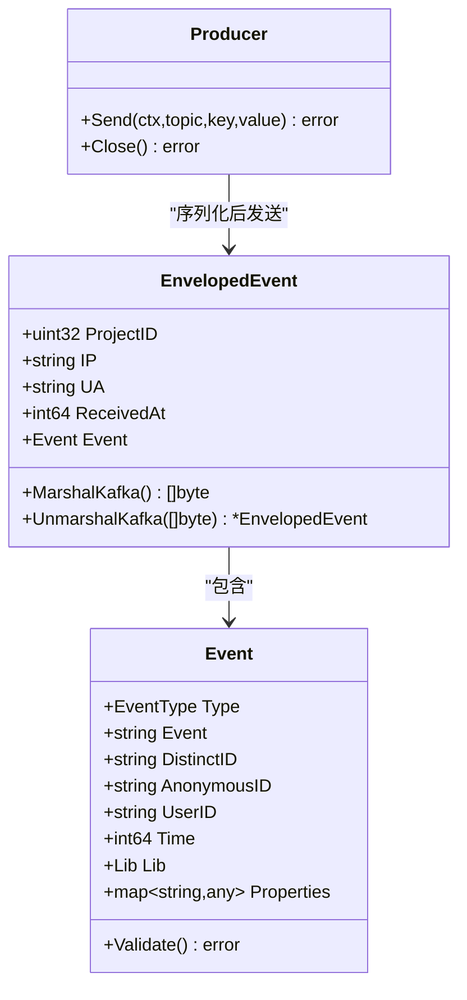
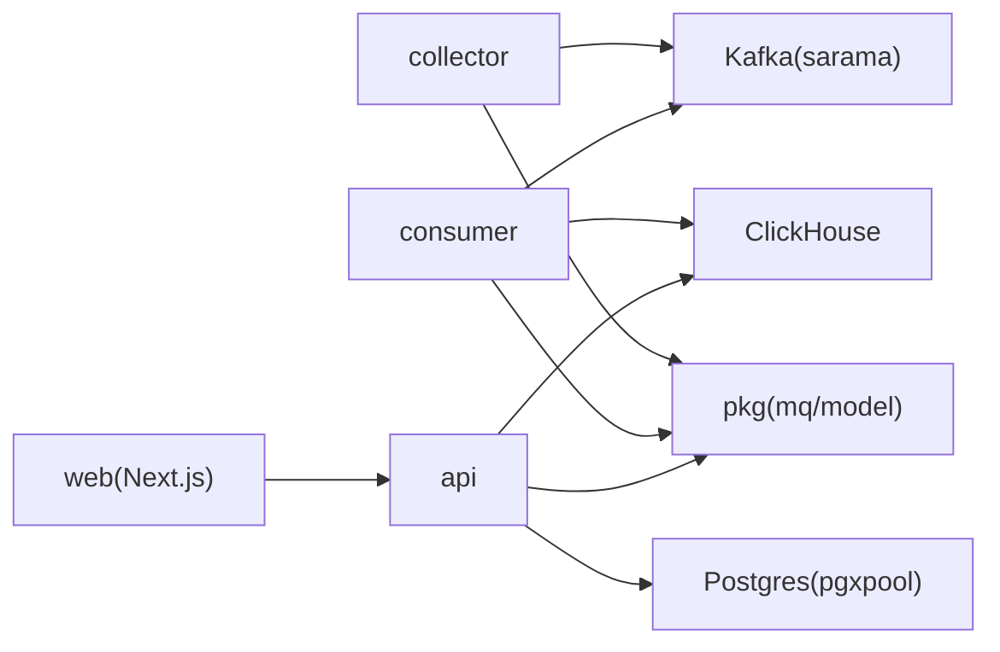

# 开发指南

<cite>
**本文引用的文件**
- [README.md](file://README.md)
- [架构文档](file://docs/architecture.md)
- [上报协议](file://docs/protocol.md)
- [docker-compose.yml](file://deploy/docker-compose.yml)
- [go.work](file://server/go.work)
- [API 主程序](file://server/api/cmd/main.go)
- [收集器主程序](file://server/collector/cmd/main.go)
- [消费者主程序](file://server/consumer/cmd/main.go)
- [API 配置](file://server/api/internal/config/config.go)
- [收集器配置](file://server/collector/internal/config/config.go)
- [消费者配置](file://server/consumer/internal/config/config.go)
- [事件模型](file://server/pkg/model/event.go)
- [Kafka 生产者](file://server/pkg/mq/producer.go)
- [Web SDK 入口](file://sdk/web/src/index.ts)
- [Android SDK 构建脚本](file://sdk/android/aerolog/build.gradle.kts)
- [iOS 包配置](file://sdk/ios/Package.swift)
- [Next.js 应用包配置](file://web/package.json)
</cite>

## 目录
1. [简介](#简介)
2. [项目结构](#项目结构)
3. [核心组件](#核心组件)
4. [架构总览](#架构总览)
5. [详细组件分析](#详细组件分析)
6. [依赖关系分析](#依赖关系分析)
7. [性能考量](#性能考量)
8. [故障排查指南](#故障排查指南)
9. [结论](#结论)
10. [附录](#附录)

## 简介
本开发指南面向希望参与 AeroLog 平台开发的工程师，覆盖开发环境搭建、代码结构与模块组织、开发流程与规范、调试与性能分析、扩展与集成第三方服务，以及贡献代码的最佳实践。AeroLog 是一个自研的多端埋点平台，采用“三端 SDK（Android/iOS/Web）+ Go 服务端 + Next.js 前后台”的分层架构，数据链路由 SDK → 收集器（Collector）→ Kafka → 消费者（Consumer）→ ClickHouse/Postgres/MInIO 组成。

## 项目结构
- 顶层目录包含服务端（server）、前端（web）、SDK（sdk）、部署（deploy）、文档（docs）等模块。
- 服务端采用 Go 工作区（go.work）统一管理多个子模块（collector、consumer、api、pkg）。
- 前端基于 Next.js，提供管理后台与控制台页面。
- SDK 分别在 Android（Kotlin + Room）、iOS（Swift + SQLite）、Web（TypeScript + IndexedDB）实现，统一上报协议与离线策略。



图表来源
- [架构文档](file://docs/architecture.md)
- [docker-compose.yml](file://deploy/docker-compose.yml)
- [go.work](file://server/go.work)

章节来源
- [README.md:1-50](file://README.md#L1-L50)
- [go.work:1-9](file://server/go.work#L1-L9)

## 核心组件
- 收集器（Collector）：高并发接收端，负责鉴权、限流、请求体大小限制、批量入库 Kafka。
- 消费者（Consumer）：Kafka 消费者，进行 UA/IP/Schema 等 ETL，写入 ClickHouse 与 Postgres，并处理死信队列（DLQ）。
- API 服务：提供管理与查询接口，连接 Postgres 与 ClickHouse，暴露指标。
- 公共库（pkg）：共享模型、消息队列封装、指标等。
- Web/Android/iOS SDK：统一上报协议，内置离线缓存、批量与指数退避重试。
- 前台（web）：Next.js 应用，提供管理与分析界面。

章节来源
- [架构文档](file://docs/architecture.md)
- [API 主程序:35-78](file://server/api/cmd/main.go#L35-L78)
- [收集器主程序:22-73](file://server/collector/cmd/main.go#L22-L73)
- [消费者主程序:18-54](file://server/consumer/cmd/main.go#L18-L54)
- [事件模型:27-69](file://server/pkg/model/event.go#L27-L69)
- [Kafka 生产者:12-40](file://server/pkg/mq/producer.go#L12-L40)
- [Web SDK 入口:16-50](file://sdk/web/src/index.ts#L16-L50)

## 架构总览
AeroLog 的整体链路为：三端 SDK 将事件批量压缩上报至 Collector，经 Kafka 缓冲后由 Consumer 进行 ETL 并写入 ClickHouse、Postgres 与 MinIO，API 服务提供查询与管理能力，Prometheus/Grafana 实现可观测性。



图表来源
- [上报协议](file://docs/protocol.md)
- [架构文档](file://docs/architecture.md)
- [Kafka 生产者:42-60](file://server/pkg/mq/producer.go#L42-L60)

章节来源
- [README.md:24-34](file://README.md#L24-L34)
- [架构文档](file://docs/architecture.md)

## 详细组件分析

### 服务端配置与运行
- 配置来源：各服务均通过环境变量初始化，支持地址、指标端口、数据库/消息队列连接、限流参数等。
- 运行方式：每个服务以独立进程启动，暴露健康检查与指标端点，优雅关闭。



图表来源
- [API 配置:24-38](file://server/api/internal/config/config.go#L24-L38)
- [收集器配置:19-30](file://server/collector/internal/config/config.go#L19-L30)
- [消费者配置:28-44](file://server/consumer/internal/config/config.go#L28-L44)
- [API 主程序:35-78](file://server/api/cmd/main.go#L35-L78)
- [收集器主程序:22-73](file://server/collector/cmd/main.go#L22-L73)
- [消费者主程序:18-54](file://server/consumer/cmd/main.go#L18-L54)

章节来源
- [API 配置:1-46](file://server/api/internal/config/config.go#L1-L46)
- [收集器配置:1-38](file://server/collector/internal/config/config.go#L1-L38)
- [消费者配置:1-53](file://server/consumer/internal/config/config.go#L1-L53)
- [API 主程序:35-78](file://server/api/cmd/main.go#L35-L78)
- [收集器主程序:22-73](file://server/collector/cmd/main.go#L22-L73)
- [消费者主程序:18-54](file://server/consumer/cmd/main.go#L18-L54)

### 事件模型与跨服务通信
- 事件模型：统一的事件结构与最小校验，后续详细校验在消费者侧完成。
- 跨服务通信：Collector → Kafka（包装项目上下文），Consumer → ClickHouse/Postgres，API → 查询 ClickHouse 与 Postgres。



图表来源
- [事件模型:27-83](file://server/pkg/model/event.go#L27-L83)
- [Kafka 生产者:12-69](file://server/pkg/mq/producer.go#L12-L69)

章节来源
- [事件模型:1-84](file://server/pkg/model/event.go#L1-L84)
- [Kafka 生产者:1-69](file://server/pkg/mq/producer.go#L1-L69)

### Web SDK 行为与离线策略
- 行为概览：内存批量、失敗落盘 IndexedDB、指数退避重试、生命周期钩子（sendBeacon、在线/离线、SPA 路由）。
- 自动属性采集：操作系统、浏览器、屏幕、网络类型、UA 等。
- 用户身份：anonymous_id 与 user_id 切换，登录时触发 $SignUp。

```mermaid
flowchart TD
S["开始"] --> B["加入缓冲(批量/定时)"]
B --> J{"达到批次或定时?"}
J --> |是| U["发送(HTTP)"]
J --> |否| W["等待"]
U --> R{"响应状态"}
R --> |2xx| OK["成功"]
R --> |4xx(非429)| DROP["丢弃(不重试)"]
R --> |429/5xx/网络错误| IDB["写入 IndexedDB"]
IDB --> RET["指数退避重试"]
RET --> U
OK --> END["结束"]
DROP --> END
```

图表来源
- [Web SDK 入口:147-170](file://sdk/web/src/index.ts#L147-L170)
- [Web SDK 入口:126-145](file://sdk/web/src/index.ts#L126-L145)
- [Web SDK 入口:179-182](file://sdk/web/src/index.ts#L179-L182)

章节来源
- [Web SDK 入口:1-307](file://sdk/web/src/index.ts#L1-L307)
- [上报协议:100-107](file://docs/protocol.md#L100-L107)

### Android/iOS SDK 与 Web SDK 的差异
- Android：Kotlin + Room，离线缓存使用 Room；构建脚本声明 Room、OkHttp、协程等依赖。
- iOS：Swift + SQLite，包配置声明目标与测试目标；与 Web SDK 共享协议与行为约定。
- Web：TypeScript + IndexedDB，自动采集浏览器与设备信息，支持 SPA 路由钩子。

章节来源
- [Android SDK 构建脚本:1-34](file://sdk/android/aerolog/build.gradle.kts#L1-L34)
- [iOS 包配置:1-15](file://sdk/ios/Package.swift#L1-L15)
- [Web SDK 入口:1-307](file://sdk/web/src/index.ts#L1-L307)

## 依赖关系分析
- 服务端模块：go.work 统一管理 collector、consumer、api、pkg 四个模块，pkg 作为共享库被其他模块复用。
- 外部依赖：Kafka（IBM sarama）、Postgres（pgxpool）、ClickHouse（HTTP/原生）、Redis（用于限流/缓存，视配置而定）。
- 前端依赖：Next.js、Ant Design、ECharts、SWR/Zustand、Day.js 等。



图表来源
- [go.work:3-8](file://server/go.work#L3-L8)
- [API 主程序:14-20](file://server/api/cmd/main.go#L14-L20)
- [收集器主程序:12-20](file://server/collector/cmd/main.go#L12-L20)
- [消费者主程序:10-16](file://server/consumer/cmd/main.go#L10-L16)
- [Kafka 生产者:9-10](file://server/pkg/mq/producer.go#L9-L10)
- [Next.js 应用包配置:11-31](file://web/package.json#L11-L31)

章节来源
- [go.work:1-9](file://server/go.work#L1-9)
- [Next.js 应用包配置:1-33](file://web/package.json#L1-L33)

## 性能考量
- 批量与压缩：上报采用批量与 gzip 压缩，降低网络开销与吞吐压力。
- 指数退避：SDK 与服务端均采用指数退避重试，缓解瞬时峰值。
- 指标与可观测：Collector/Consumer/API 暴露 /metrics，Prometheus 抓取，Grafana 可视化。
- 存储与容量：本地离线存储上限与保留周期，避免无限增长；Kafka/ClickHouse/Postgres 的容量规划与副本/分片策略影响吞吐与延迟。

章节来源
- [上报协议:100-107](file://docs/protocol.md#L100-L107)
- [架构文档:43-47](file://docs/architecture.md#L43-L47)
- [docker-compose.yml:113-147](file://deploy/docker-compose.yml#L113-L147)

## 故障排查指南
- 开发环境启动：进入 deploy 目录，使用 docker compose 一键启动 PostgreSQL、Redis、Redpanda（Kafka API）、ClickHouse、MinIO、Prometheus、Grafana。
- 健康检查：容器自带健康检查，可通过日志与端口确认服务就绪。
- 日志与指标：查看各服务 /metrics 端口输出，结合 Grafana 仪表盘定位异常。
- 常见问题：
  - Kafka 不可用：确认 Broker 地址与 Topic；检查 Redpanda 控制台。
  - ClickHouse/Postgres 连接失败：核对 DSN 与凭据。
  - SDK 重试过多：检查网络、服务端限流与签名配置。
- 调试技巧：
  - 使用浏览器开发者工具观察网络请求与 IndexedDB 存储。
  - 在 SDK 中开启 debug 输出，观察丢弃与重试行为。
  - 使用 sendBeacon 与在线/离线事件验证生命周期钩子。

章节来源
- [README.md:36-43](file://README.md#L36-L43)
- [docker-compose.yml:1-147](file://deploy/docker-compose.yml#L1-L147)
- [Web SDK 入口:147-170](file://sdk/web/src/index.ts#L147-L170)

## 结论
AeroLog 通过清晰的分层架构与统一协议，实现了从多端 SDK 到服务端的高效数据通路。开发时应重点关注配置管理、跨服务通信、离线策略与可观测性建设。遵循本文档的环境搭建、流程规范与调试方法，可快速上手并稳定交付功能。

## 附录

### 开发环境搭建步骤
- Go 环境：安装 Go 1.22+，使用 go.work 管理多模块。
- Node.js 环境：安装 Node.js 与 npm/yarn，安装依赖后运行前端应用。
- Android 开发：安装 Android Studio 与 JDK 17，确保 SDK 使用 Room 依赖。
- iOS 开发：安装 Xcode，使用 Swift Package Manager 管理依赖。
- 一键启动：在 deploy 目录执行 docker compose，启动所有依赖服务。

章节来源
- [go.work:1-1](file://server/go.work#L1-L1)
- [Next.js 应用包配置:1-33](file://web/package.json#L1-L33)
- [Android SDK 构建脚本:17-22](file://sdk/android/aerolog/build.gradle.kts#L17-L22)
- [iOS 包配置:1-15](file://sdk/ios/Package.swift#L1-L15)
- [README.md:36-43](file://README.md#L36-L43)

### 代码结构与模块组织
- server：collector（接收）、consumer（消费/ETL）、api（管理/查询）、pkg（共享库）。
- sdk：android、ios、web 三个子目录，分别实现对应平台的 SDK。
- web：Next.js 前台应用。
- deploy：Docker Compose 编排与初始化脚本。
- docs：协议、架构、可观测性文档。

章节来源
- [README.md:6-22](file://README.md#L6-L22)
- [go.work:3-8](file://server/go.work#L3-L8)

### 开发流程与代码规范
- Git 工作流：建议采用分支策略（如 main、develop、feature/*、hotfix/*），提交信息清晰描述变更内容。
- 代码审查：关注模块边界、配置项一致性、错误处理与指标埋点。
- 测试策略：单元测试覆盖核心逻辑（如事件模型校验、SDK 发送与重试），集成测试覆盖 Collector/Consumer/DB 交互。

章节来源
- [事件模型:39-60](file://server/pkg/model/event.go#L39-L60)
- [Web SDK 入口:116-145](file://sdk/web/src/index.ts#L116-L145)

### 调试技巧与工具使用
- 断点调试：服务端使用 Delve 或 IDE 断点；前端使用浏览器断点与 React DevTools。
- 日志分析：关注服务端 /metrics 输出与容器日志；Web SDK 开启 debug 查看丢弃与重试。
- 性能分析：利用 Prometheus 指标与 Grafana 仪表盘，定位瓶颈（QPS、p99、Kafka lag、CH 写入耗时）。

章节来源
- [API 主程序:80-93](file://server/api/cmd/main.go#L80-L93)
- [收集器主程序:39-41](file://server/collector/cmd/main.go#L39-L41)
- [消费者主程序:36-37](file://server/consumer/cmd/main.go#L36-L37)
- [docker-compose.yml:113-147](file://deploy/docker-compose.yml#L113-L147)

### 扩展新功能与集成第三方服务
- 新增 API：在 api 模块新增路由与处理器，注意配置注入与指标埋点。
- 新增 Collector 端点：在 collector 注册路由，确保鉴权、限流与指标覆盖。
- 新增 SDK 功能：在对应平台 SDK 增加 API 与离线策略，保持与协议一致。
- 集成第三方：通过配置项扩展（如新的消息队列/存储），确保最小侵入与向后兼容。

章节来源
- [API 主程序:55-58](file://server/api/cmd/main.go#L55-L58)
- [收集器主程序:43-48](file://server/collector/cmd/main.go#L43-L48)
- [上报协议:1-18](file://docs/protocol.md#L1-L18)

### 贡献代码流程与最佳实践
- 提交前：运行 linter 与单元测试；更新相关文档（协议/架构/部署）。
- 提交流程：创建 PR，描述变更动机、影响范围与测试结果；至少一名维护者审核。
- 最佳实践：保持模块内聚、解耦外部依赖；为关键路径添加指标与日志；确保配置项有默认值与环境变量覆盖。

章节来源
- [Next.js 应用包配置:24-31](file://web/package.json#L24-L31)
- [架构文档:43-47](file://docs/architecture.md#L43-L47)