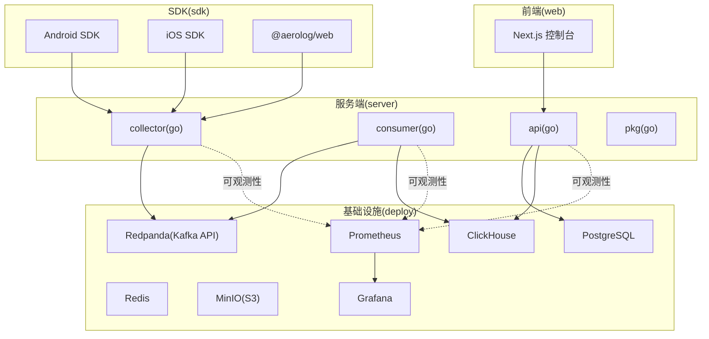
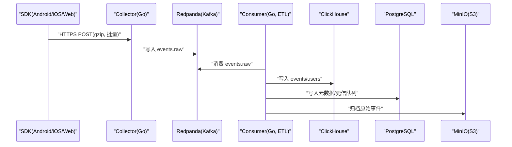

# 开发环境搭建

<cite>
**本文引用的文件**
- [.gitignore](file://.gitignore)
- [README.md](file://README.md)
- [docker-compose.yml](file://deploy/docker-compose.yml)
- [01_schema.sql（Postgres）](file://deploy/init/postgres/01_schema.sql)
- [01_schema.sql（ClickHouse）](file://deploy/init/clickhouse/01_schema.sql)
- [go.work](file://server/go.work)
- [go.mod（server/api）](file://server/api/go.mod)
- [go.mod（server/collector）](file://server/collector/go.mod)
- [go.mod（server/consumer）](file://server/consumer/go.mod)
- [go.mod（server/pkg）](file://server/pkg/go.mod)
- [build.gradle.kts（Android SDK）](file://sdk/android/aerolog/build.gradle.kts)
- [README.md（Android SDK）](file://sdk/android/README.md)
- [Package.swift（iOS SDK）](file://sdk/ios/Package.swift)
- [README.md（iOS SDK）](file://sdk/ios/README.md)
- [package.json（Web 控制台）](file://web/package.json)
- [tsconfig.json（Web 控制台）](file://web/tsconfig.json)
- [README.md（Web 控制台）](file://web/README.md)
- [package.json（Web SDK）](file://sdk/web/package.json)
- [tsconfig.json（Web SDK）](file://sdk/web/tsconfig.json)
</cite>

## 更新摘要
**变更内容**
- 新增了IntelliJ IDEA运行配置文件排除规则的说明
- 更新了IDE配置建议，特别强调了.gitignore中'.run/'条目的作用
- 补充了团队协作效率和开发环境一致性的重要性说明

## 目录
1. [简介](#简介)
2. [项目结构](#项目结构)
3. [核心组件](#核心组件)
4. [架构总览](#架构总览)
5. [详细组件分析](#详细组件分析)
6. [依赖分析](#依赖分析)
7. [性能考虑](#性能考虑)
8. [故障排查指南](#故障排查指南)
9. [结论](#结论)
10. [附录](#附录)

## 简介
本指南面向希望在本地完整搭建 AeroLog 开发环境的工程师，涵盖以下内容：
- Go 1.22+ 的安装与工作区配置
- Docker 与 Docker Compose 的环境准备与一键启动
- 各平台 SDK 的开发环境配置：Android（Android Studio + Gradle）、iOS（Xcode + Swift Package Manager）、Web（Node.js + npm/yarn）
- 依赖安装步骤与验证方法
- IDE 配置建议、插件推荐与开发工具链设置
- 如何克隆项目、初始化子模块与解决常见环境问题
- **新增**：IntelliJ IDEA运行配置文件管理与团队协作最佳实践

## 项目结构
AeroLog 采用多模块分层架构：
- server：Go 服务端，包含 collector（采集）、consumer（消费与ETL）、api（管理与查询）、pkg（公共库）
- sdk：三端 SDK，分别对应 Android、iOS、Web
- web：Next.js 前后台控制台
- deploy：Docker 编排与初始化脚本（PostgreSQL、Redis、Redpanda/Kafka、ClickHouse、MinIO、Prometheus、Grafana）

**图表来源**
- [docker-compose.yml:1-147](file://deploy/docker-compose.yml#L1-L147)
- [go.work:1-9](file://server/go.work#L1-L9)
- [go.mod（server/api）:1-13](file://server/api/go.mod#L1-L13)
- [go.mod（server/collector）:1-13](file://server/collector/go.mod#L1-L13)
- [go.mod（server/consumer）:1-13](file://server/consumer/go.mod#L1-L13)
- [go.mod（server/pkg）:1-11](file://server/pkg/go.mod#L1-L11)

**章节来源**
- [README.md:1-50](file://README.md#L1-L50)

## 核心组件
- Go 工作区与版本
  - 使用 go.work 统一管理 server 子模块，Go 版本要求 1.22+
- Docker Compose 一键启动
  - 包含 PostgreSQL、Redis、Redpanda（Kafka API）、ClickHouse、MinIO、Prometheus、Grafana
- 服务端模块
  - collector：接收层（高并发写入 Kafka/Redpanda）
  - consumer：Kafka 消费 + ETL，写入 ClickHouse 与 Postgres
  - api：管理与查询 API，连接 Postgres 与 ClickHouse
  - pkg：公共库（通用依赖与封装）
- SDK
  - Android：Kotlin + Room 离线缓存
  - iOS：Swift + SQLite 离线缓存
  - Web：TypeScript + IndexedDB 离线缓存
- 前端控制台
  - Next.js App Router + Ant Design + TanStack Query + ECharts

**章节来源**
- [go.work:1-9](file://server/go.work#L1-L9)
- [docker-compose.yml:1-147](file://deploy/docker-compose.yml#L1-L147)
- [README.md:14-22](file://README.md#L14-L22)

## 架构总览
AeroLog 的整体链路如下：
- SDK（Android/iOS/Web）通过 HTTPS POST + gzip + 批量上报
- Collector 接收后写入 Kafka/Redpanda
- Consumer 消费并进行 ETL，写入 ClickHouse 与 Postgres，并持久化原始事件到 MinIO
- Grafana 通过 Prometheus 拉取指标进行可视化

**图表来源**
- [README.md:24-34](file://README.md#L24-L34)
- [docker-compose.yml:37-112](file://deploy/docker-compose.yml#L37-L112)

## 详细组件分析

### 服务端（Go 1.22+ 与工作区）
- 版本与工作区
  - go.work 明确指定 Go 1.22，并声明使用 collector、consumer、api、pkg 四个模块
- 模块依赖
  - api/collector/consumer/pkg 均以 go.mod 指定 go 1.22，并通过 replace 引用本地 pkg
- 启动顺序建议
  - 先启动基础设施（Docker Compose），再启动各服务进程

**章节来源**
- [go.work:1-9](file://server/go.work#L1-L9)
- [go.mod（server/api）:1-13](file://server/api/go.mod#L1-L13)
- [go.mod（server/collector）:1-13](file://server/collector/go.mod#L1-L13)
- [go.mod（server/consumer）:1-13](file://server/consumer/go.mod#L1-L13)
- [go.mod（server/pkg）:1-11](file://server/pkg/go.mod#L1-L11)

### Android SDK（Android Studio + Gradle）
- 构建与依赖
  - Android SDK 使用 Gradle Kotlin DSL，compileSdk 34，minSdk 21
  - JVM 目标版本为 17，Kotlin 版本 1.9.24
  - 依赖 Room（离线缓存）、OkHttp、kotlinx-coroutines、AndroidX Lifecycle
- 引入方式
  - 支持在 settings.gradle.kts 中 include 并在 app/build.gradle.kts 中 implementation 引入
- 离线兜底策略
  - 内存批量（默认 50 条/5 秒），失败或离线写入 Room（SQLite），容量上限 10000 条，超限丢弃最旧；应用退到后台时主动 flush

**章节来源**
- [build.gradle.kts（Android SDK）:1-34](file://sdk/android/aerolog/build.gradle.kts#L1-L34)
- [README.md（Android SDK）:1-44](file://sdk/android/README.md#L1-L44)

### iOS SDK（Xcode + Swift Package Manager）
- 包与平台
  - 使用 Swift Package，最低 iOS 13，支持 macOS 11
- 引入方式
  - 通过 Package.swift 指定路径引入，或在 Xcode 中通过"Add Packages"选择本地路径
- 离线兜底策略
  - 内存批量（默认 50 条/5 秒），失败或离线写入 Application Support 目录的 events.ndjson，容量上限 10000 条，超限丢弃最旧；App 进入后台时主动 flush

**章节来源**
- [Package.swift（iOS SDK）:1-15](file://sdk/ios/Package.swift#L1-L15)
- [README.md（iOS SDK）:1-42](file://sdk/ios/README.md#L1-L42)

### Web SDK（Node.js + TypeScript）
- 构建与类型
  - 使用 TypeScript 5.4.5，模块系统为 ESNext，输出目标 ES2019
  - 通过 tsup 构建，支持 watch、测试（vitest）与类型检查
- 离线兜底策略
  - 基于 IndexedDB 的离线缓存与批量上报机制（具体实现位于源码中）

**章节来源**
- [package.json（Web SDK）:1-29](file://sdk/web/package.json#L1-L29)
- [tsconfig.json（Web SDK）:1-17](file://sdk/web/tsconfig.json#L1-L17)

### Web 控制台（Next.js + Ant Design）
- 技术栈
  - Next.js 14（App Router），Ant Design 5、TanStack React Query、ECharts、SWR、Zustand、Day.js
- 启动流程
  - 先启动基础设施与后端服务，再在 web 目录执行 npm install 与 NEXT_PUBLIC_API_BASE 指向后端地址
- 环境变量
  - NEXT_PUBLIC_API_BASE：浏览器侧请求的 Go API 地址

**章节来源**
- [package.json（Web 控制台）:1-33](file://web/package.json#L1-L33)
- [tsconfig.json（Web 控制台）:1-22](file://web/tsconfig.json#L1-L22)
- [README.md（Web 控制台）:14-27](file://web/README.md#L14-L27)

### IDE 配置与团队协作最佳实践

#### Git 忽略配置与运行配置管理
- **新增**：.gitignore 中的 '.run/' 条目专门用于排除 IntelliJ IDEA 的运行配置文件
- 运行配置文件通常包含敏感信息（如 API 密钥、调试参数、本地路径等）
- 将运行配置文件排除在版本控制之外可以避免：
  - 敏感信息泄露到代码仓库
  - 不同开发者环境间的配置冲突
  - 团队协作时的配置不一致问题

#### IDE 配置与插件建议
- **IntelliJ IDEA/Android Studio**
  - 插件：Kotlin、Android、SQLiteDatabase、GitToolBox
  - 建议：启用编译器严格模式、Kotlin 选项 jvmTarget 17
  - 运行配置：使用 .run/ 目录管理项目特定的运行配置，但不要提交到版本控制
- **Xcode（iOS 开发）**
  - 插件：SwiftLint（可选）、SwiftFormat（可选）
  - 建议：启用 Build Phases 中的 Swift Package 依赖解析
- **VSCode/Web 开发**
  - 插件：ESLint、Prettier、TypeScript Importer、EditorConfig
  - 建议：启用 TypeScript Watch 模式、TSUP 监听构建

**章节来源**
- [.gitignore:7](file://.gitignore#L7)
- [build.gradle.kts（Android SDK）:17-21](file://sdk/android/aerolog/build.gradle.kts#L17-L21)
- [tsconfig.json（Web 控制台）:16](file://web/tsconfig.json#L16)
- [tsconfig.json（Web SDK）:13](file://sdk/web/tsconfig.json#L13)

## 依赖分析
- 服务端依赖
  - Gin（HTTP 框架）、pgx（PostgreSQL）、clickhouse-go（ClickHouse）、sarama（Kafka）、redis/go-redis（Redis）、prometheus 客户端
- 基础设施依赖
  - PostgreSQL、Redis、Redpanda（Kafka API）、ClickHouse、MinIO、Prometheus、Grafana
- 初始化脚本
  - Postgres 初始化包含用户、项目、成员、事件与属性元数据、看板、死信队列等表结构
  - ClickHouse 初始化包含事件明细表、缓冲表、用户属性表及分区与 TTL 设置

**章节来源**
- [go.mod（server/api）:5-10](file://server/api/go.mod#L5-L10)
- [go.mod（server/collector）:5-10](file://server/collector/go.mod#L5-L10)
- [go.mod（server/consumer）:5-10](file://server/consumer/go.mod#L5-L10)
- [go.mod（server/pkg）:5-10](file://server/pkg/go.mod#L5-L10)
- [01_schema.sql（Postgres）:1-92](file://deploy/init/postgres/01_schema.sql#L1-L92)
- [01_schema.sql（ClickHouse）:1-61](file://deploy/init/clickhouse/01_schema.sql#L1-L61)

## 性能考虑
- Kafka/Redpanda
  - Redpanda 提供 Kafka API，无需 ZooKeeper，适合单机开发环境
- ClickHouse
  - 使用 Buffer 引擎降低写入延迟，后台自动 flush 到主表
- Prometheus/Grafana
  - 通过 Prometheus 拉取各服务 /metrics，Grafana 预置数据源与面板
- Docker 资源
  - Redpanda 设置了内存限制与无过保护模式，适配本地资源有限场景

**章节来源**
- [docker-compose.yml:37-147](file://deploy/docker-compose.yml#L37-L147)
- [01_schema.sql（ClickHouse）:44-49](file://deploy/init/clickhouse/01_schema.sql#L44-L49)

## 故障排查指南
- Docker Compose 启动失败
  - 检查端口占用（如 5432、6379、8082、9000、9090、3001 等），必要时释放或修改映射
  - 查看容器健康检查状态（PostgreSQL、Redis、ClickHouse 的 healthcheck）
- 数据库初始化异常
  - 确认 Postgres 初始化 SQL 已执行（包含扩展与表结构）
  - 确认 ClickHouse 初始化 SQL 已执行（包含数据库、表、Buffer 引擎与 TTL）
- 服务端无法连接数据库
  - 核对服务端配置中的数据库连接参数与凭据
  - 确认容器网络可达（服务端与数据库在同一 Docker 网络）
- Web 控制台无法访问后端
  - 确认 NEXT_PUBLIC_API_BASE 指向正确的后端地址（默认 http://localhost:8082）
- Android/iOS/Web SDK 无法上报
  - 检查 SDK 初始化配置（serverUrl、token），确认 Collector 可达
  - 关注离线缓存与批量阈值，确保触发 flush 逻辑
- **新增**：IDE 运行配置问题
  - 如果运行配置丢失或不生效，检查 .run/ 目录是否被正确忽略
  - 确保运行配置文件中没有硬编码的敏感信息
  - 重新创建运行配置时，注意不要将其提交到版本控制

**章节来源**
- [docker-compose.yml:17-21](file://deploy/docker-compose.yml#L17-L21)
- [docker-compose.yml:31-35](file://deploy/docker-compose.yml#L31-L35)
- [docker-compose.yml:93-97](file://deploy/docker-compose.yml#L93-L97)
- [README.md（Web 控制台）:29-33](file://web/README.md#L29-L33)
- [README.md（Android SDK）:38-44](file://sdk/android/README.md#L38-L44)
- [README.md（iOS SDK）:36-42](file://sdk/ios/README.md#L36-L42)
- [.gitignore:7](file://.gitignore#L7)

## 结论
通过本指南，您可以在本地完成 AeroLog 的全栈开发环境搭建：先安装 Go 1.22+ 与 Docker，再使用 docker-compose 一键启动基础设施，随后根据平台分别配置 Android/iOS/Web 的开发工具链，最后启动服务端与前端控制台进行联调。遇到问题时，可依据故障排查指南逐项定位。

**新增**：通过合理管理 IDE 运行配置文件（使用 .run/ 目录并将其排除在版本控制之外），可以显著提升团队协作效率，避免配置冲突和敏感信息泄露问题。

## 附录

### 一键启动开发环境
- 进入 deploy 目录，使用 docker compose 启动所有服务
- 启动后包含：PostgreSQL、Redis、Redpanda（Kafka API）、ClickHouse、MinIO、Prometheus、Grafana

**章节来源**
- [README.md:36-43](file://README.md#L36-L43)
- [docker-compose.yml:1-147](file://deploy/docker-compose.yml#L1-L147)

### 服务端启动步骤（示例）
- 启动基础设施与后端
  - 在 deploy 目录启动容器
  - 在 server/api 目录运行 Go 应用（默认监听 8082）
- 启动前端控制台
  - 在 web 目录安装依赖并启动开发服务器，设置 NEXT_PUBLIC_API_BASE 指向后端地址

**章节来源**
- [README.md（Web 控制台）:16-25](file://web/README.md#L16-L25)

### 各平台 SDK 开发环境配置清单
- Android（Android Studio + Gradle）
  - JDK 17，compileSdk 34，minSdk 21
  - 依赖：Room、OkHttp、kotlinx-coroutines、AndroidX Lifecycle
  - 引入方式：settings.gradle.kts include + app build.gradle.kts implementation
- iOS（Xcode + Swift Package Manager）
  - 最低 iOS 13，Swift Package
  - 引入方式：Package.swift 指定路径或 Xcode Add Packages 选择本地
- Web（Node.js + npm/yarn）
  - TypeScript 5.4.5，ESNext 模块系统
  - 构建工具：tsup，测试：vitest，类型检查：tsc

**章节来源**
- [build.gradle.kts（Android SDK）:7-23](file://sdk/android/aerolog/build.gradle.kts#L7-L23)
- [README.md（Android SDK）:5-15](file://sdk/android/README.md#L5-L15)
- [Package.swift（iOS SDK）:4-13](file://sdk/ios/Package.swift#L4-L13)
- [package.json（Web SDK）:17-22](file://sdk/web/package.json#L17-L22)
- [tsconfig.json（Web SDK）:2-14](file://sdk/web/tsconfig.json#L2-L14)

### 克隆项目与初始化子模块
- 克隆仓库后，使用 docker compose 启动基础设施
- 服务端使用 go.work 管理多模块，无需额外 submodule 初始化
- 若需独立运行任一服务，可在对应目录执行 go run ./cmd
- **新增**：IDE 运行配置管理
  - 使用 .run/ 目录存放 IDE 运行配置文件
  - 这些文件已被 .gitignore 排除，不会影响版本控制
  - 不要手动编辑 .gitignore 文件来添加新的运行配置目录

**章节来源**
- [go.work:3-8](file://server/go.work#L3-L8)
- [README.md:36-43](file://README.md#L36-L43)
- [.gitignore:7](file://.gitignore#L7)