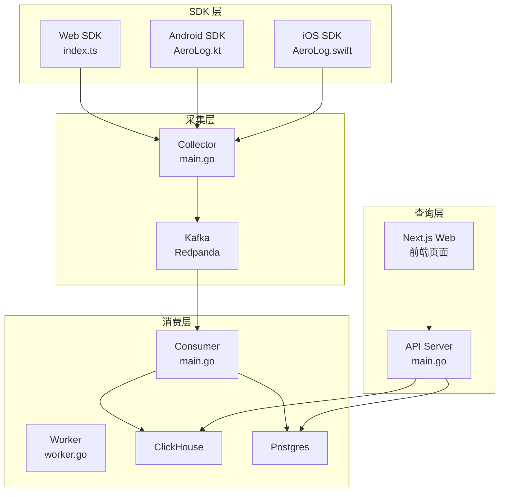
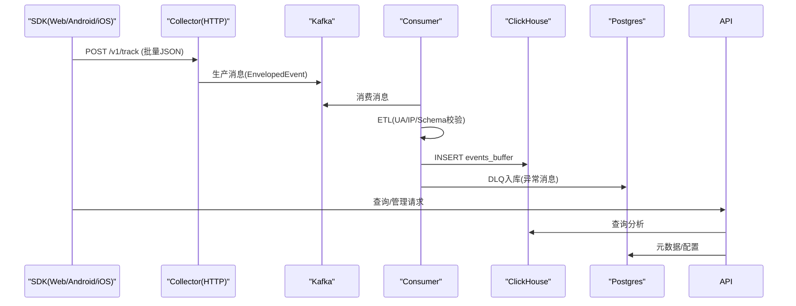
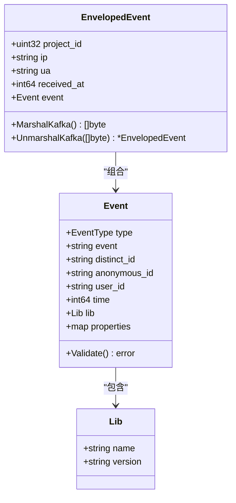
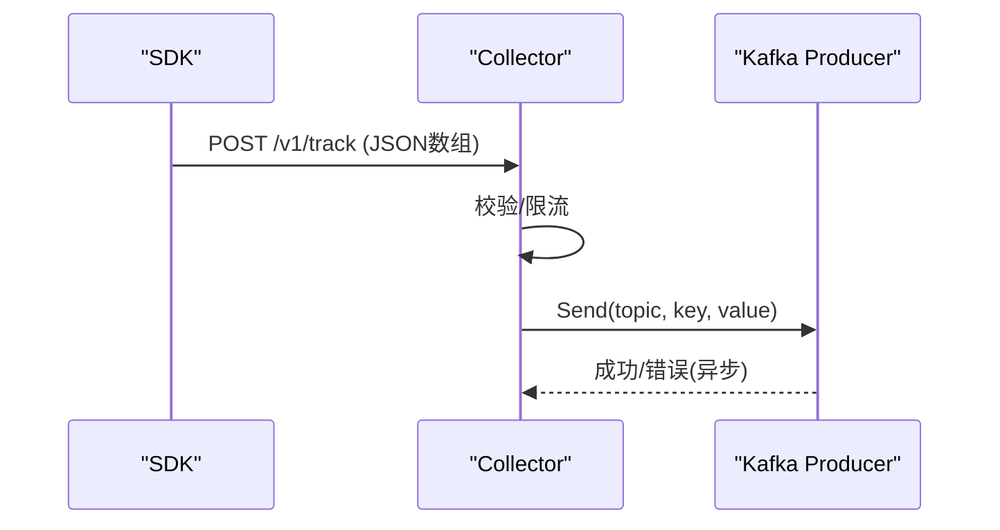
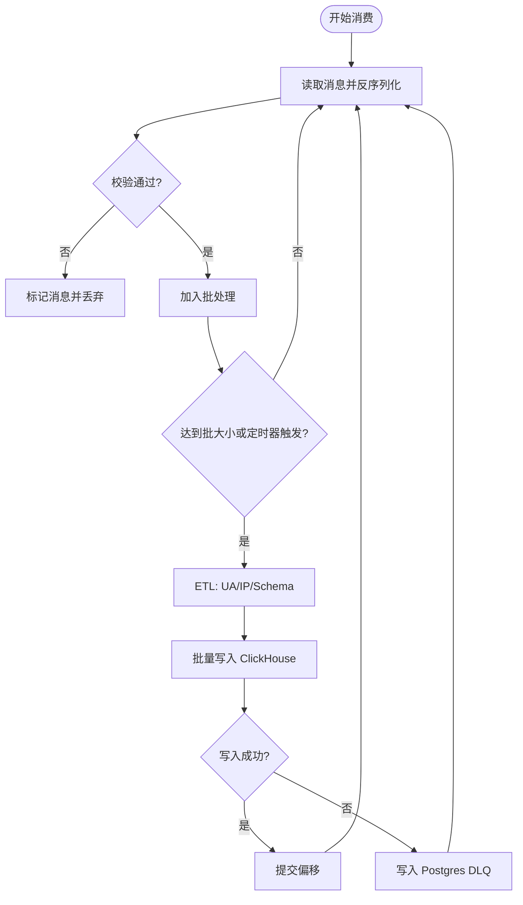
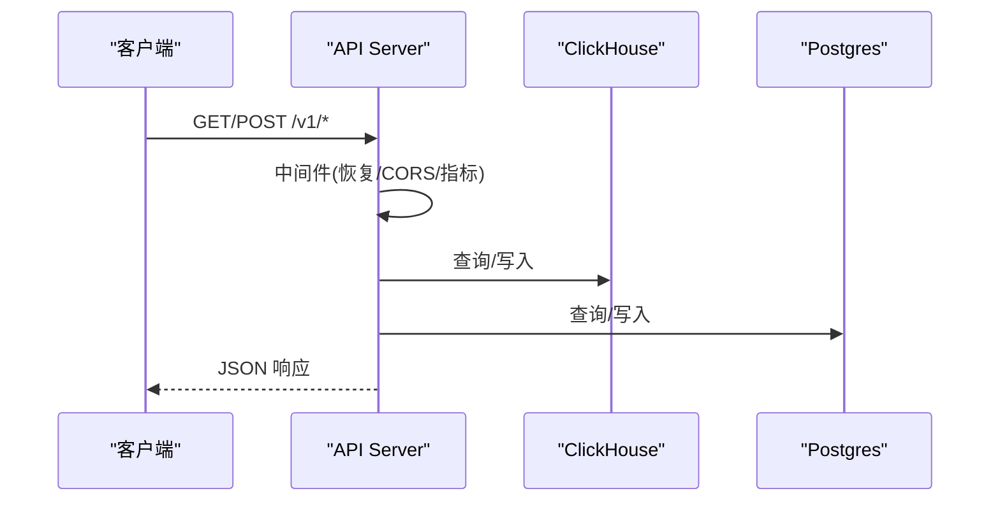
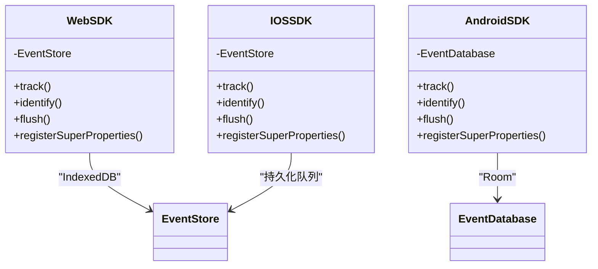
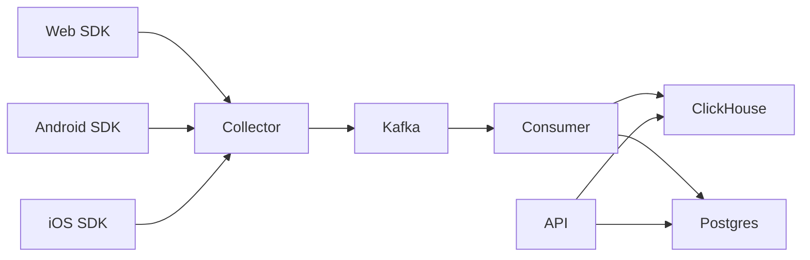

# 扩展开发

<cite>
**本文引用的文件**
- [README.md](file://README.md)
- [docker-compose.yml](file://deploy/docker-compose.yml)
- [main.go](file://server/api/cmd/main.go)
- [main.go](file://server/collector/cmd/main.go)
- [main.go](file://server/consumer/cmd/main.go)
- [event.go](file://server/pkg/model/event.go)
- [producer.go](file://server/pkg/mq/producer.go)
- [sink.go](file://server/consumer/internal/chsink/sink.go)
- [etl.go](file://server/consumer/internal/etl/etl.go)
- [worker.go](file://server/consumer/internal/worker/worker.go)
- [index.ts](file://sdk/web/src/index.ts)
- [types.ts](file://sdk/web/src/types.ts)
- [storage.ts](file://sdk/web/src/storage.ts)
- [AeroLog.kt](file://sdk/android/aerolog/src/main/java/dev/aerolog/sdk/AeroLog.kt)
- [EventDatabase.kt](file://sdk/android/aerolog/src/main/java/dev/aerolog/sdk/storage/EventDatabase.kt)
- [AeroLog.swift](file://sdk/ios/Sources/AeroLog/AeroLog.swift)
</cite>

## 目录
1. [简介](#简介)
2. [项目结构](#项目结构)
3. [核心组件](#核心组件)
4. [架构总览](#架构总览)
5. [详细组件分析](#详细组件分析)
6. [依赖关系分析](#依赖关系分析)
7. [性能考量](#性能考量)
8. [故障排查指南](#故障排查指南)
9. [结论](#结论)
10. [附录](#附录)

## 简介
本指南面向希望为 AeroLog 平台进行扩展开发的工程师，覆盖以下主题：
- 新增分析功能与 API 接口：数据模型扩展、事件处理流程修改、数据库 schema 变更
- 集成新数据源与存储后端：Kafka 配置与 ClickHouse 连接
- SDK 扩展：新增平台支持与自定义事件类型
- 自定义中间件与插件系统：在采集、消费、查询链路中插入扩展点
- 向后兼容性与迁移策略：版本演进与平滑过渡
- 最佳实践与示例路径：基于现有代码的扩展方法与注意事项

## 项目结构
AeroLog 采用分层架构：SDK（三端）负责事件采集与离线缓存；Collector 接收并写入 Kafka；Consumer 从 Kafka 消费并进行 ETL，写入 ClickHouse 与 Postgres；API 提供管理与查询接口；Web 前后台用于可视化与管理。

图表来源
- [main.go:22-54](file://server/collector/cmd/main.go#L22-L54)
- [main.go:18-54](file://server/consumer/cmd/main.go#L18-L54)
- [main.go:35-78](file://server/api/cmd/main.go#L35-L78)
- [docker-compose.yml:37-97](file://deploy/docker-compose.yml#L37-L97)

章节来源
- [README.md:1-50](file://README.md#L1-L50)
- [docker-compose.yml:1-147](file://deploy/docker-compose.yml#L1-L147)

## 核心组件
- 统一事件模型：定义事件类型、SDK 标识与基本校验逻辑，确保三端上报格式一致。
- Kafka 生产者：封装异步批量发送、压缩与错误处理。
- Consumer 工作流：Kafka 消费、批处理、ETL（UA/IP 解析）、写入 ClickHouse 与 Postgres。
- API 服务：Gin 路由注册、指标中间件、CORS、健康检查与业务接口。
- SDK 三端实现：Web（IndexedDB）、Android（Room）、iOS（持久化队列），均支持离线缓存与退避重传。

章节来源
- [event.go:27-69](file://server/pkg/model/event.go#L27-L69)
- [producer.go:12-68](file://server/pkg/mq/producer.go#L12-L68)
- [worker.go:40-173](file://server/consumer/internal/worker/worker.go#L40-L173)
- [main.go:35-78](file://server/api/cmd/main.go#L35-L78)
- [index.ts:16-307](file://sdk/web/src/index.ts#L16-L307)
- [AeroLog.kt:37-216](file://sdk/android/aerolog/src/main/java/dev/aerolog/sdk/AeroLog.kt#L37-L216)
- [AeroLog.swift:7-207](file://sdk/ios/Sources/AeroLog/AeroLog.swift#L7-L207)

## 架构总览
整体链路由“SDK → Collector → Kafka → Consumer → ClickHouse/Postgres”构成，API 与 Web 前后台提供查询与管理能力。

图表来源
- [index.ts:147-170](file://sdk/web/src/index.ts#L147-L170)
- [AeroLog.kt:175-190](file://sdk/android/aerolog/src/main/java/dev/aerolog/sdk/AeroLog.kt#L175-L190)
- [AeroLog.swift:158-181](file://sdk/ios/Sources/AeroLog/AeroLog.swift#L158-L181)
- [producer.go:42-60](file://server/pkg/mq/producer.go#L42-L60)
- [worker.go:92-154](file://server/consumer/internal/worker/worker.go#L92-L154)
- [sink.go:45-103](file://server/consumer/internal/chsink/sink.go#L45-L103)

## 详细组件分析

### 事件模型与数据流
- 统一事件结构：包含事件类型、标识、时间戳、SDK 信息与属性集合；提供基础校验。
- 包装事件：Collector 将原始事件包装上下文（项目 ID、IP、UA、接收时间）再投递 Kafka。
- 数据流：Web/Android/iOS 三端上报，经 Collector 校验后写入 Kafka；Consumer 消费并 ETL，写入 ClickHouse 与 Postgres。

图表来源
- [event.go:27-83](file://server/pkg/model/event.go#L27-L83)

章节来源
- [event.go:9-83](file://server/pkg/model/event.go#L9-L83)

### Kafka 生产者与 Collector
- 生产者特性：Snappy 压缩、批量刷新、重试、异步错误通道。
- Collector 职责：从 SDK 接收批量事件，写入 Kafka；提供健康检查与指标端点。

图表来源
- [index.ts:147-170](file://sdk/web/src/index.ts#L147-L170)
- [AeroLog.kt:175-190](file://sdk/android/aerolog/src/main/java/dev/aerolog/sdk/AeroLog.kt#L175-L190)
- [AeroLog.swift:158-181](file://sdk/ios/Sources/AeroLog/AeroLog.swift#L158-L181)
- [producer.go:17-40](file://server/pkg/mq/producer.go#L17-L40)
- [main.go:39-48](file://server/collector/cmd/main.go#L39-L48)

章节来源
- [producer.go:12-68](file://server/pkg/mq/producer.go#L12-L68)
- [main.go:22-54](file://server/collector/cmd/main.go#L22-L54)

### Consumer ETL 与写入
- 消费与批处理：按批次与定时器触发，批量写入 ClickHouse；异常写入 Postgres DLQ。
- ETL 能力：UA 解析、地理信息解析（占位）。
- ClickHouse 写入：events_buffer 表，字段覆盖事件、设备、网络、地理位置与属性。

图表来源
- [worker.go:92-154](file://server/consumer/internal/worker/worker.go#L92-L154)
- [etl.go:29-89](file://server/consumer/internal/etl/etl.go#L29-L89)
- [sink.go:45-103](file://server/consumer/internal/chsink/sink.go#L45-L103)

章节来源
- [worker.go:40-173](file://server/consumer/internal/worker/worker.go#L40-L173)
- [etl.go:1-90](file://server/consumer/internal/etl/etl.go#L1-L90)
- [sink.go:17-126](file://server/consumer/internal/chsink/sink.go#L17-L126)

### API 服务与中间件
- 中间件：统一恢复、CORS、指标埋点。
- 路由注册：项目、事件定义、分析接口。
- 存储：ClickHouse 连接、Postgres 连接池。

图表来源
- [main.go:35-78](file://server/api/cmd/main.go#L35-L78)

章节来源
- [main.go:22-121](file://server/api/cmd/main.go#L22-L121)

### SDK 三端扩展要点
- Web SDK：IndexedDB 持久化、退避重传、自动属性收集、生命周期事件。
- Android SDK：Room 持久化、协程调度、自动属性与生命周期埋点。
- iOS SDK：持久化队列、自动属性与生命周期埋点。

图表来源
- [index.ts:16-307](file://sdk/web/src/index.ts#L16-L307)
- [storage.ts:16-141](file://sdk/web/src/storage.ts#L16-L141)
- [AeroLog.kt:37-216](file://sdk/android/aerolog/src/main/java/dev/aerolog/sdk/AeroLog.kt#L37-L216)
- [EventDatabase.kt:12-41](file://sdk/android/aerolog/src/main/java/dev/aerolog/sdk/storage/EventDatabase.kt#L12-L41)
- [AeroLog.swift:7-207](file://sdk/ios/Sources/AeroLog/AeroLog.swift#L7-L207)

章节来源
- [index.ts:16-307](file://sdk/web/src/index.ts#L16-L307)
- [storage.ts:16-141](file://sdk/web/src/storage.ts#L16-L141)
- [AeroLog.kt:37-216](file://sdk/android/aerolog/src/main/java/dev/aerolog/sdk/AeroLog.kt#L37-L216)
- [EventDatabase.kt:12-41](file://sdk/android/aerolog/src/main/java/dev/aerolog/sdk/storage/EventDatabase.kt#L12-L41)
- [AeroLog.swift:7-207](file://sdk/ios/Sources/AeroLog/AeroLog.swift#L7-L207)

## 依赖关系分析
- Collector 依赖 Kafka 生产者与 Postgres 缓存；API 依赖 Postgres 与 ClickHouse；Consumer 依赖 Kafka、ClickHouse 与 Postgres。
- SDK 三端依赖各自的持久化存储（IndexedDB/Room/持久化队列）与网络栈。

图表来源
- [main.go:22-54](file://server/collector/cmd/main.go#L22-L54)
- [main.go:18-54](file://server/consumer/cmd/main.go#L18-L54)
- [main.go:35-78](file://server/api/cmd/main.go#L35-L78)

章节来源
- [main.go:22-54](file://server/collector/cmd/main.go#L22-L54)
- [main.go:18-54](file://server/consumer/cmd/main.go#L18-L54)
- [main.go:35-78](file://server/api/cmd/main.go#L35-L78)

## 性能考量
- 批量与频率：合理设置 SDK 的批量大小与刷新间隔，减少网络开销与数据库压力。
- 压缩与重试：Kafka 生产者启用 Snappy 压缩与重试，提升吞吐与可靠性。
- 写入策略：ClickHouse 使用异步插入与批量写入，降低写入延迟。
- 指标监控：API 与 Consumer 均内置指标，建议结合 Prometheus/Grafana 实时观测。

## 故障排查指南
- SDK 层
  - Web：IndexedDB 不可用时回退内存队列；离线状态会退避重传。
  - Android：Room 初始化失败或存储上限时清理旧数据。
  - iOS：持久化失败时回退内存队列。
- Collector
  - Kafka 连接失败或写入错误：检查 Broker 地址与 Topic 权限。
- Consumer
  - 写入 ClickHouse 失败：检查表结构与字段映射；异常消息写入 DLQ。
  - ETL 失败：UA/IP 解析异常或字段缺失。
- API
  - ClickHouse/Postgres 连接失败：检查 DSN 与网络连通性。

章节来源
- [storage.ts:46-125](file://sdk/web/src/storage.ts#L46-L125)
- [AeroLog.kt:167-173](file://sdk/android/aerolog/src/main/java/dev/aerolog/sdk/AeroLog.kt#L167-L173)
- [AeroLog.swift:140-156](file://sdk/ios/Sources/AeroLog/AeroLog.swift#L140-L156)
- [producer.go:33-38](file://server/pkg/mq/producer.go#L33-L38)
- [worker.go:107-112](file://server/consumer/internal/worker/worker.go#L107-L112)
- [sink.go:45-103](file://server/consumer/internal/chsink/sink.go#L45-L103)

## 结论
AeroLog 的扩展开发应遵循“统一事件模型 + 分层处理 + 可观测性”的原则。新增功能需同步考虑 SDK、采集、消费与查询链路的兼容性与一致性，并通过指标与日志保障稳定性。

## 附录

### 如何添加新的分析功能与 API 接口
- 数据模型扩展
  - 在统一事件模型中增加字段或事件类型时，需保证三端 SDK 与服务端一致。
  - 示例路径：[event.go:27-69](file://server/pkg/model/event.go#L27-L69)
- 事件处理流程修改
  - 在 Consumer 的 ETL 步骤中扩展字段解析与映射。
  - 示例路径：[etl.go:29-89](file://server/consumer/internal/etl/etl.go#L29-L89)
- 数据库 schema 变更
  - ClickHouse：在写入前确保字段存在且类型匹配。
    - 示例路径：[sink.go:50-103](file://server/consumer/internal/chsink/sink.go#L50-L103)
  - Postgres：DLQ 表与元数据表需同步迁移。
    - 示例路径：[worker.go:156-172](file://server/consumer/internal/worker/worker.go#L156-L172)
- API 接口
  - 在 API 服务中注册新路由，使用中间件与指标。
    - 示例路径：[main.go:55-58](file://server/api/cmd/main.go#L55-L58)

章节来源
- [event.go:27-83](file://server/pkg/model/event.go#L27-L83)
- [etl.go:29-89](file://server/consumer/internal/etl/etl.go#L29-L89)
- [sink.go:50-103](file://server/consumer/internal/chsink/sink.go#L50-L103)
- [worker.go:156-172](file://server/consumer/internal/worker/worker.go#L156-L172)
- [main.go:55-58](file://server/api/cmd/main.go#L55-L58)

### 如何集成新的数据源与存储后端
- Kafka 配置
  - Broker 地址、Topic、分区与副本策略；生产者压缩与重试参数。
  - 示例路径：[producer.go:17-40](file://server/pkg/mq/producer.go#L17-L40)
- ClickHouse 连接
  - 连接参数、异步插入设置、连接池与超时。
  - 示例路径：[sink.go:23-43](file://server/consumer/internal/chsink/sink.go#L23-L43)
- Docker Compose
  - Redpanda/Kafka API、ClickHouse、Postgres、MinIO、Prometheus/Grafana。
  - 示例路径：[docker-compose.yml:37-147](file://deploy/docker-compose.yml#L37-L147)

章节来源
- [producer.go:17-40](file://server/pkg/mq/producer.go#L17-L40)
- [sink.go:23-43](file://server/consumer/internal/chsink/sink.go#L23-L43)
- [docker-compose.yml:37-147](file://deploy/docker-compose.yml#L37-L147)

### SDK 扩展指导
- 新增平台支持
  - 参考现有三端实现：网络请求、批量发送、离线缓存、退避重传、自动属性与生命周期事件。
  - 示例路径（Web）：[index.ts:147-170](file://sdk/web/src/index.ts#L147-L170)
  - 示例路径（Android）：[AeroLog.kt:175-190](file://sdk/android/aerolog/src/main/java/dev/aerolog/sdk/AeroLog.kt#L175-L190)
  - 示例路径（iOS）：[AeroLog.swift:158-181](file://sdk/ios/Sources/AeroLog/AeroLog.swift#L158-L181)
- 自定义事件类型
  - 在 SDK 事件类型枚举中新增；保持与服务端统一。
  - 示例路径（Web 类型）：[types.ts:3-9](file://sdk/web/src/types.ts#L3-L9)
  - 示例路径（服务端事件类型）：[event.go:12-19](file://server/pkg/model/event.go#L12-L19)

章节来源
- [index.ts:147-170](file://sdk/web/src/index.ts#L147-L170)
- [AeroLog.kt:175-190](file://sdk/android/aerolog/src/main/java/dev/aerolog/sdk/AeroLog.kt#L175-L190)
- [AeroLog.swift:158-181](file://sdk/ios/Sources/AeroLog/AeroLog.swift#L158-L181)
- [types.ts:3-9](file://sdk/web/src/types.ts#L3-L9)
- [event.go:12-19](file://server/pkg/model/event.go#L12-L19)

### 自定义中间件与插件系统
- Collector 中间件
  - 可在 Gin 路由上挂载自定义中间件（鉴权、限流、审计）。
  - 示例路径：[main.go:39-48](file://server/collector/cmd/main.go#L39-L48)
- API 中间件
  - 统一恢复、CORS、指标中间件，可扩展鉴权与审计。
  - 示例路径：[main.go:50-58](file://server/api/cmd/main.go#L50-L58)
- Consumer 插件化
  - ETL 步骤可抽象为插件（UA/IP/Schema），便于替换与扩展。
  - 示例路径：[etl.go:29-89](file://server/consumer/internal/etl/etl.go#L29-L89)

章节来源
- [main.go:39-48](file://server/collector/cmd/main.go#L39-L48)
- [main.go:50-58](file://server/api/cmd/main.go#L50-L58)
- [etl.go:29-89](file://server/consumer/internal/etl/etl.go#L29-L89)

### 向后兼容性与迁移策略
- 字段演进
  - ClickHouse 写入时对缺失字段使用默认值；保留历史字段避免破坏查询。
  - 示例路径：[sink.go:108-125](file://server/consumer/internal/chsink/sink.go#L108-L125)
- 事件类型演进
  - 新增事件类型不影响旧类型处理；服务端校验保留兼容。
  - 示例路径：[event.go:40-60](file://server/pkg/model/event.go#L40-L60)
- SDK 版本管理
  - 通过 lib.name/lib.version 识别 SDK 类型与版本，便于灰度与回滚。
  - 示例路径（Web）：[index.ts:13-14](file://sdk/web/src/index.ts#L13-L14)
  - 示例路径（Android）：[AeroLog.kt:41-42](file://sdk/android/aerolog/src/main/java/dev/aerolog/sdk/AeroLog.kt#L41-L42)
  - 示例路径（iOS）：[AeroLog.swift:11-12](file://sdk/ios/Sources/AeroLog/AeroLog.swift#L11-L12)

章节来源
- [sink.go:108-125](file://server/consumer/internal/chsink/sink.go#L108-L125)
- [event.go:40-60](file://server/pkg/model/event.go#L40-L60)
- [index.ts:13-14](file://sdk/web/src/index.ts#L13-L14)
- [AeroLog.kt:41-42](file://sdk/android/aerolog/src/main/java/dev/aerolog/sdk/AeroLog.kt#L41-L42)
- [AeroLog.swift:11-12](file://sdk/ios/Sources/AeroLog/AeroLog.swift#L11-L12)

### 扩展现有功能的最佳实践
- 扩展点定位
  - SDK：事件类型、属性、自动埋点开关与持久化策略。
  - Collector：鉴权、限流、审计与路由扩展。
  - Consumer：ETL 插件、DLQ 策略、写入目标扩展。
  - API：查询接口、聚合函数与权限控制。
- 示例路径
  - Web SDK 扩展：[index.ts:52-88](file://sdk/web/src/index.ts#L52-L88)
  - Android SDK 扩展：[AeroLog.kt:82-105](file://sdk/android/aerolog/src/main/java/dev/aerolog/sdk/AeroLog.kt#L82-L105)
  - iOS SDK 扩展：[AeroLog.swift:50-75](file://sdk/ios/Sources/AeroLog/AeroLog.swift#L50-L75)
  - API 注册：[main.go:55-58](file://server/api/cmd/main.go#L55-L58)
  - Consumer 写入：[sink.go:45-103](file://server/consumer/internal/chsink/sink.go#L45-L103)

章节来源
- [index.ts:52-88](file://sdk/web/src/index.ts#L52-L88)
- [AeroLog.kt:82-105](file://sdk/android/aerolog/src/main/java/dev/aerolog/sdk/AeroLog.kt#L82-L105)
- [AeroLog.swift:50-75](file://sdk/ios/Sources/AeroLog/AeroLog.swift#L50-L75)
- [main.go:55-58](file://server/api/cmd/main.go#L55-L58)
- [sink.go:45-103](file://server/consumer/internal/chsink/sink.go#L45-L103)