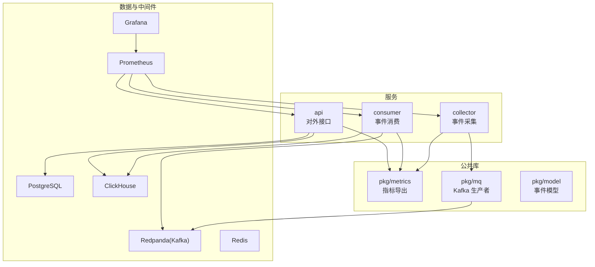
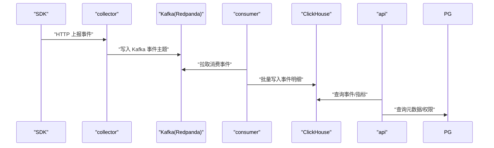
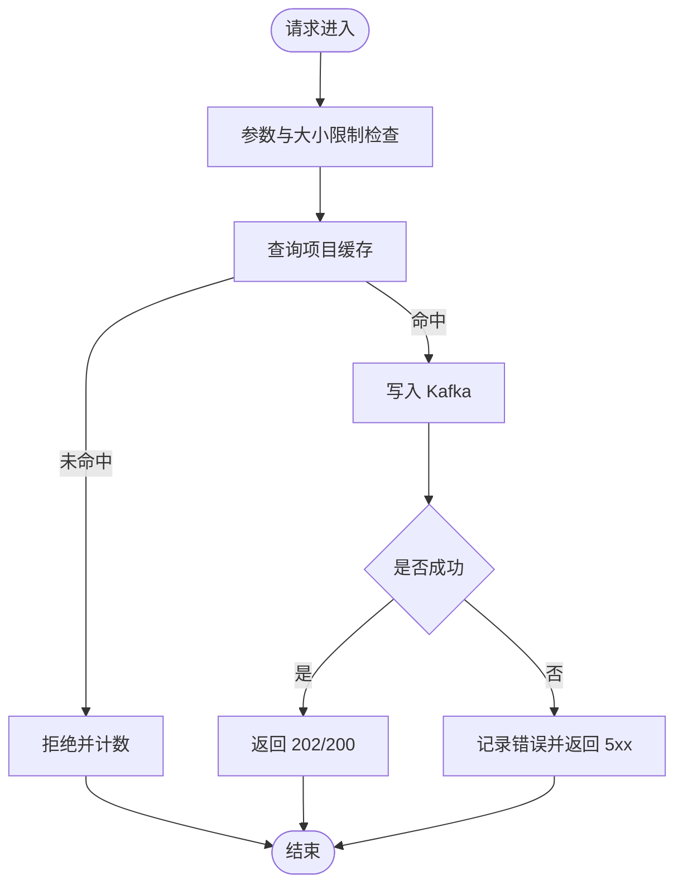
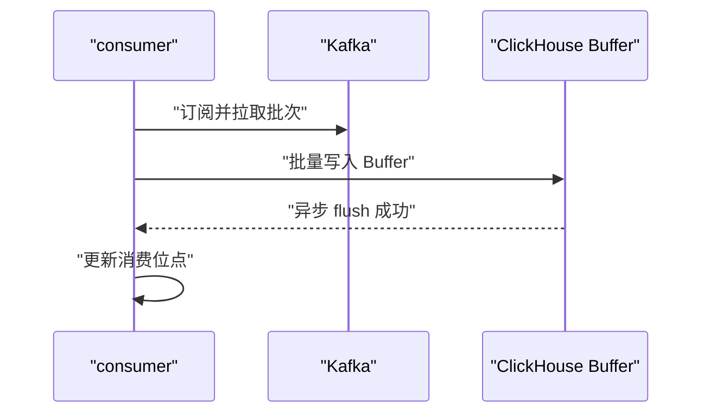
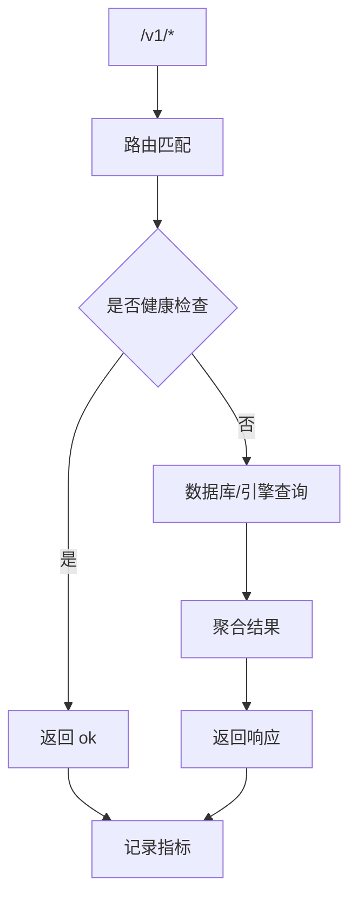
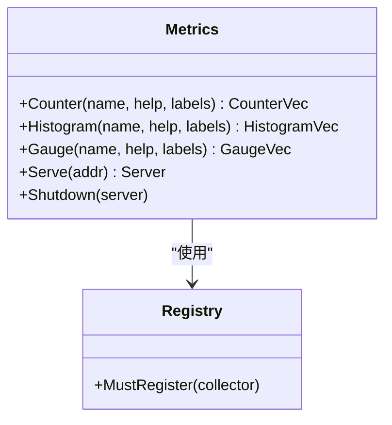
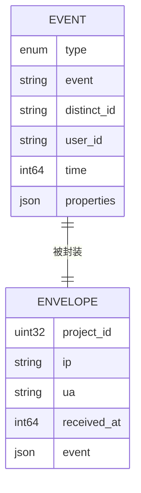
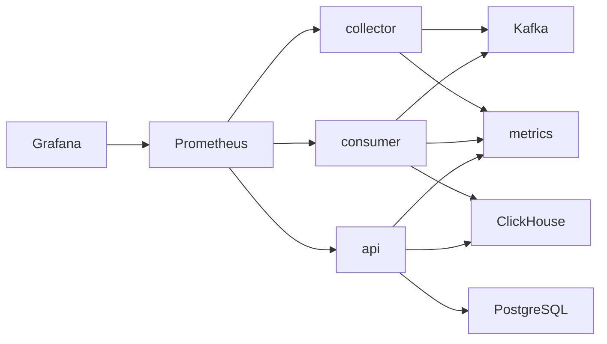

# 调试与测试

<cite>
**本文引用的文件**
- [server/go.work](file://server/go.work)
- [server/go.work.sum](file://server/go.work.sum)
- [deploy/docker-compose.yml](file://deploy/docker-compose.yml)
- [deploy/prometheus/prometheus.yml](file://deploy/prometheus/prometheus.yml)
- [deploy/grafana/provisioning/datasources/prometheus.yml](file://deploy/grafana/provisioning/datasources/prometheus.yml)
- [deploy/grafana/dashboards/aerolog-overview.json](file://deploy/grafana/dashboards/aerolog-overview.json)
- [server/api/cmd/main.go](file://server/api/cmd/main.go)
- [server/api/internal/config/config.go](file://server/api/internal/config/config.go)
- [server/collector/cmd/main.go](file://server/collector/cmd/main.go)
- [server/collector/internal/config/config.go](file://server/collector/internal/config/config.go)
- [server/consumer/cmd/main.go](file://server/consumer/cmd/main.go)
- [server/consumer/internal/config/config.go](file://server/consumer/internal/config/config.go)
- [server/pkg/metrics/metrics.go](file://server/pkg/metrics/metrics.go)
- [server/pkg/model/event.go](file://server/pkg/model/event.go)
- [server/pkg/mq/producer.go](file://server/pkg/mq/producer.go)
- [deploy/init/postgres/01_schema.sql](file://deploy/init/postgres/01_schema.sql)
- [deploy/init/clickhouse/01_schema.sql](file://deploy/init/clickhouse/01_schema.sql)
</cite>

## 目录
1. [简介](#简介)
2. [项目结构](#项目结构)
3. [核心组件](#核心组件)
4. [架构总览](#架构总览)
5. [详细组件分析](#详细组件分析)
6. [依赖分析](#依赖分析)
7. [性能考虑](#性能考虑)
8. [故障排查指南](#故障排查指南)
9. [结论](#结论)
10. [附录](#附录)

## 简介
本指南面向 AeroLog 的开发与运维团队，提供从本地调试、日志与性能分析，到 Docker 联调与集成测试，再到单元测试与集成测试最佳实践的完整方案。同时涵盖基于 Prometheus 与 Grafana 的监控与可视化，以及常见问题的排查技巧与测试环境搭建。

## 项目结构
AeroLog 采用多模块工作区组织 Go 服务，核心由以下模块组成：
- collector：事件采集服务，接收 SDK 上报，写入 Kafka
- consumer：事件消费服务，从 Kafka 拉取事件，落库 ClickHouse
- api：对外 API 服务，提供查询与管理接口，连接 PostgreSQL 与 ClickHouse
- pkg：公共库，包含指标、消息队列、模型等

图表来源
- [server/go.work:1-9](file://server/go.work#L1-L9)
- [server/collector/cmd/main.go:1-74](file://server/collector/cmd/main.go#L1-L74)
- [server/consumer/cmd/main.go:1-55](file://server/consumer/cmd/main.go#L1-L55)
- [server/api/cmd/main.go:1-121](file://server/api/cmd/main.go#L1-L121)
- [server/pkg/metrics/metrics.go:1-81](file://server/pkg/metrics/metrics.go#L1-L81)
- [server/pkg/mq/producer.go:1-69](file://server/pkg/mq/producer.go#L1-L69)
- [deploy/docker-compose.yml:1-147](file://deploy/docker-compose.yml#L1-L147)

章节来源
- [server/go.work:1-9](file://server/go.work#L1-L9)
- [server/go.work.sum:1-180](file://server/go.work.sum#L1-L180)

## 核心组件
- 采集器（collector）：HTTP 入口，负责限流、鉴权、写入 Kafka，并暴露独立指标端口
- 消费器（consumer）：Kafka 消费者，批量处理后写入 ClickHouse，暴露独立指标端口
- API 服务（api）：HTTP 入口，聚合 PostgreSQL 与 ClickHouse，暴露独立指标端口
- 指标系统（pkg/metrics）：统一注册表，导出 Go runtime/process 指标与服务自定义指标
- 模型与消息队列（pkg/model、pkg/mq）：统一事件结构与 Kafka 生产者封装

章节来源
- [server/collector/cmd/main.go:1-74](file://server/collector/cmd/main.go#L1-L74)
- [server/consumer/cmd/main.go:1-55](file://server/consumer/cmd/main.go#L1-L55)
- [server/api/cmd/main.go:1-121](file://server/api/cmd/main.go#L1-L121)
- [server/pkg/metrics/metrics.go:1-81](file://server/pkg/metrics/metrics.go#L1-L81)
- [server/pkg/model/event.go:1-84](file://server/pkg/model/event.go#L1-L84)
- [server/pkg/mq/producer.go:1-69](file://server/pkg/mq/producer.go#L1-L69)

## 架构总览
AeroLog 采用“采集-存储-查询”的分层架构：
- 采集层：collector 接收 SDK 上报，经 Kafka 缓冲
- 存储层：consumer 将事件批量写入 ClickHouse；元数据存于 PostgreSQL
- 查询层：api 提供查询与管理接口，支持 ClickHouse 与 PostgreSQL

图表来源
- [server/collector/cmd/main.go:1-74](file://server/collector/cmd/main.go#L1-L74)
- [server/consumer/cmd/main.go:1-55](file://server/consumer/cmd/main.go#L1-L55)
- [server/api/cmd/main.go:1-121](file://server/api/cmd/main.go#L1-L121)
- [server/pkg/mq/producer.go:1-69](file://server/pkg/mq/producer.go#L1-L69)
- [deploy/docker-compose.yml:37-62](file://deploy/docker-compose.yml#L37-L62)

## 详细组件分析

### 组件一：采集器（collector）
- 功能要点
  - HTTP 路由注册与中间件（恢复、CORS）
  - 项目级缓存（基于 Redis 或内存，用于快速校验）
  - Kafka 异步生产者，启用 Snappy 压缩与重试
  - 独立指标端口，暴露请求耗时与总量
- 关键路径
  - 入口：[server/collector/cmd/main.go:1-74](file://server/collector/cmd/main.go#L1-L74)
  - 配置：[server/collector/internal/config/config.go:1-38](file://server/collector/internal/config/config.go#L1-L38)
  - 指标导出：[server/pkg/metrics/metrics.go:1-81](file://server/pkg/metrics/metrics.go#L1-L81)
  - Kafka 生产者：[server/pkg/mq/producer.go:1-69](file://server/pkg/mq/producer.go#L1-L69)

图表来源
- [server/collector/cmd/main.go:1-74](file://server/collector/cmd/main.go#L1-L74)
- [server/pkg/mq/producer.go:1-69](file://server/pkg/mq/producer.go#L1-L69)

章节来源
- [server/collector/cmd/main.go:1-74](file://server/collector/cmd/main.go#L1-L74)
- [server/collector/internal/config/config.go:1-38](file://server/collector/internal/config/config.go#L1-L38)
- [server/pkg/metrics/metrics.go:1-81](file://server/pkg/metrics/metrics.go#L1-L81)
- [server/pkg/mq/producer.go:1-69](file://server/pkg/mq/producer.go#L1-L69)

### 组件二：消费者（consumer）
- 功能要点
  - Kafka 消费组订阅事件主题
  - 批量缓冲与定时刷新
  - 写入 ClickHouse Buffer 表，后台自动落盘
  - 独立指标端口，暴露处理速率与延迟
- 关键路径
  - 入口：[server/consumer/cmd/main.go:1-55](file://server/consumer/cmd/main.go#L1-L55)
  - 配置：[server/consumer/internal/config/config.go:1-53](file://server/consumer/internal/config/config.go#L1-L53)

图表来源
- [server/consumer/cmd/main.go:1-55](file://server/consumer/cmd/main.go#L1-L55)
- [deploy/init/clickhouse/01_schema.sql:44-49](file://deploy/init/clickhouse/01_schema.sql#L44-L49)

章节来源
- [server/consumer/cmd/main.go:1-55](file://server/consumer/cmd/main.go#L1-L55)
- [server/consumer/internal/config/config.go:1-53](file://server/consumer/internal/config/config.go#L1-L53)
- [deploy/init/clickhouse/01_schema.sql:44-49](file://deploy/init/clickhouse/01_schema.sql#L44-L49)

### 组件三：API 服务（api）
- 功能要点
  - 路由注册：项目、事件定义、分析查询
  - 连接 PostgreSQL 与 ClickHouse
  - 中间件：恢复、CORS、指标埋点
  - 独立指标端口，暴露请求耗时与总量
- 关键路径
  - 入口：[server/api/cmd/main.go:1-121](file://server/api/cmd/main.go#L1-L121)
  - 配置：[server/api/internal/config/config.go:1-46](file://server/api/internal/config/config.go#L1-L46)

图表来源
- [server/api/cmd/main.go:1-121](file://server/api/cmd/main.go#L1-L121)
- [server/api/internal/config/config.go:1-46](file://server/api/internal/config/config.go#L1-L46)

章节来源
- [server/api/cmd/main.go:1-121](file://server/api/cmd/main.go#L1-L121)
- [server/api/internal/config/config.go:1-46](file://server/api/internal/config/config.go#L1-L46)

### 组件四：指标与监控（pkg/metrics）
- 功能要点
  - 统一注册表，内置 Go runtime/process 指标
  - 提供 Counter/Histogram/Gauge 工厂方法
  - 独立 /metrics HTTP 服务，支持优雅关闭
- 关键路径
  - 实现：[server/pkg/metrics/metrics.go:1-81](file://server/pkg/metrics/metrics.go#L1-L81)

图表来源
- [server/pkg/metrics/metrics.go:1-81](file://server/pkg/metrics/metrics.go#L1-L81)

章节来源
- [server/pkg/metrics/metrics.go:1-81](file://server/pkg/metrics/metrics.go#L1-L81)

### 组件五：事件模型与消息队列
- 事件模型（pkg/model/event.go）
  - 统一事件结构，含类型、上下文、属性等
  - 基础校验逻辑
- Kafka 生产者（pkg/mq/producer.go）
  - 异步生产，Snappy 压缩，批量/频率控制，错误异步消费

图表来源
- [server/pkg/model/event.go:1-84](file://server/pkg/model/event.go#L1-L84)

章节来源
- [server/pkg/model/event.go:1-84](file://server/pkg/model/event.go#L1-L84)
- [server/pkg/mq/producer.go:1-69](file://server/pkg/mq/producer.go#L1-L69)

## 依赖分析
- 服务间耦合
  - collector 依赖 Kafka 与指标服务
  - consumer 依赖 Kafka、ClickHouse 与指标服务
  - api 依赖 PostgreSQL、ClickHouse 与指标服务
- 外部依赖
  - Prometheus/Grafana：指标抓取与可视化
  - Docker Compose：一键拉起 Postgres、Redis、Redpanda、ClickHouse、MinIO、Prometheus、Grafana

图表来源
- [server/collector/cmd/main.go:1-74](file://server/collector/cmd/main.go#L1-L74)
- [server/consumer/cmd/main.go:1-55](file://server/consumer/cmd/main.go#L1-L55)
- [server/api/cmd/main.go:1-121](file://server/api/cmd/main.go#L1-L121)
- [server/pkg/metrics/metrics.go:1-81](file://server/pkg/metrics/metrics.go#L1-L81)
- [deploy/docker-compose.yml:1-147](file://deploy/docker-compose.yml#L1-L147)
- [deploy/prometheus/prometheus.yml:1-32](file://deploy/prometheus/prometheus.yml#L1-L32)

章节来源
- [deploy/docker-compose.yml:1-147](file://deploy/docker-compose.yml#L1-L147)
- [deploy/prometheus/prometheus.yml:1-32](file://deploy/prometheus/prometheus.yml#L1-L32)

## 性能考虑
- 指标体系
  - 采集器：请求耗时直方图、请求总量计数、Kafka 发送错误计数
  - 消费器：处理速率、flush 延迟、死信队列增量
  - API：请求耗时直方图、请求总量计数
- 监控面板
  - Grafana 面板已预置 AeroLog 概览，包含 QPS、拒绝率、Kafka 写失败、p99 延迟、DLQ 速率等
- 性能优化建议
  - Kafka 批量参数与频率需结合吞吐与延迟权衡
  - ClickHouse Buffer 参数需根据写入峰值调整
  - API 查询尽量利用索引与分区裁剪

章节来源
- [server/pkg/metrics/metrics.go:1-81](file://server/pkg/metrics/metrics.go#L1-L81)
- [deploy/grafana/dashboards/aerolog-overview.json:1-131](file://deploy/grafana/dashboards/aerolog-overview.json#L1-L131)

## 故障排查指南
- 本地调试
  - 断点调试：在各服务 main 函数中设置断点，使用 IDE attach 或外部调试器
  - 日志输出：服务均输出启动与错误日志；采集器/消费者/API 的指标端口可用于快速定位
  - 性能分析：结合 pprof（如需要）与指标面板观察延迟与错误趋势
- Docker 联调
  - 使用 Compose 一键启动所有依赖；Prometheus 通过 host.docker.internal 抓取宿主机进程指标
  - 如需容器内访问宿主机，使用 extra_hosts 映射 host.docker.internal -> host-gateway
- 常见问题
  - Kafka 不可用：检查 broker 地址与网络连通性；确认 Topic 已创建
  - ClickHouse 写入失败：检查 Buffer 表与磁盘配额；确认 TTL/分区策略
  - API 查询异常：检查 PostgreSQL/ClickHouse 连接串与权限
  - 指标缺失：确认各服务指标端口未与业务端口冲突，且 Prometheus 抓取目标正确

章节来源
- [deploy/docker-compose.yml:1-147](file://deploy/docker-compose.yml#L1-L147)
- [deploy/prometheus/prometheus.yml:1-32](file://deploy/prometheus/prometheus.yml#L1-L32)

## 结论
通过统一的指标体系与 Docker 化部署，AeroLog 能够实现高效的本地调试、联调与监控。建议在开发流程中坚持“先指标、后修复”的原则，配合 Grafana 面板与 Prometheus 抓取，快速定位瓶颈与异常。

## 附录

### 本地调试与性能分析
- 断点调试
  - 在各服务入口函数设置断点，使用 IDE attach 或外部调试器
  - 采集器/消费者/API 的 main 函数分别为：
    - [server/collector/cmd/main.go:1-74](file://server/collector/cmd/main.go#L1-L74)
    - [server/consumer/cmd/main.go:1-55](file://server/consumer/cmd/main.go#L1-L55)
    - [server/api/cmd/main.go:1-121](file://server/api/cmd/main.go#L1-L121)
- 日志输出
  - 服务启动与错误日志会打印到标准输出，便于本地查看
- 性能分析
  - 结合指标面板观察 p99 延迟、QPS、错误率；必要时引入 pprof 进行 CPU/内存采样

章节来源
- [server/collector/cmd/main.go:1-74](file://server/collector/cmd/main.go#L1-L74)
- [server/consumer/cmd/main.go:1-55](file://server/consumer/cmd/main.go#L1-L55)
- [server/api/cmd/main.go:1-121](file://server/api/cmd/main.go#L1-L121)

### Docker 联调与集成测试
- 一键启动
  - 使用 Compose 启动 Postgres、Redis、Redpanda、ClickHouse、MinIO、Prometheus、Grafana
  - 采集器/消费者/API 以宿主机进程方式运行，Prometheus 通过 host.docker.internal 抓取
- 测试策略
  - 使用压测工具向采集器发送事件，观察 Kafka 消费与 ClickHouse 写入
  - 通过 Grafana 查看关键指标变化趋势
- 环境隔离
  - 不同测试场景可切换不同的 Kafka 主题或 ClickHouse 表前缀

章节来源
- [deploy/docker-compose.yml:1-147](file://deploy/docker-compose.yml#L1-L147)
- [deploy/prometheus/prometheus.yml:1-32](file://deploy/prometheus/prometheus.yml#L1-L32)

### 单元测试与集成测试最佳实践
- 单元测试
  - 对关键函数（如事件校验、Kafka 生产者 Send）编写最小化测试用例
  - 使用表驱动测试覆盖边界条件（空字段、超长字符串、非法时间）
- 集成测试
  - 使用 Testcontainers 或 Compose 启动最小化依赖集（Postgres/ClickHouse/Redpanda）
  - 通过真实 HTTP 请求验证端到端链路
- Mock 策略
  - Kafka 生产者：使用接口抽象，注入 Fake 实现
  - 数据库：使用内存数据库或临时数据库实例
  - 外部 HTTP：使用 httptest 或 wiremock

章节来源
- [server/pkg/model/event.go:1-84](file://server/pkg/model/event.go#L1-L84)
- [server/pkg/mq/producer.go:1-69](file://server/pkg/mq/producer.go#L1-L69)

### 监控与可视化（Prometheus + Grafana）
- Prometheus 抓取
  - 采集器/消费者/API 的指标端口分别在 9101/9102/9103（默认）
  - 抓取配置参考：[deploy/prometheus/prometheus.yml:1-32](file://deploy/prometheus/prometheus.yml#L1-L32)
- Grafana 面板
  - 预置 AeroLog 概览面板，包含 QPS、拒绝率、Kafka 写失败、p99 延迟、DLQ 速率等
  - 面板文件：[deploy/grafana/dashboards/aerolog-overview.json:1-131](file://deploy/grafana/dashboards/aerolog-overview.json#L1-L131)
  - 数据源配置：[deploy/grafana/provisioning/datasources/prometheus.yml:1-10](file://deploy/grafana/provisioning/datasources/prometheus.yml#L1-L10)

章节来源
- [deploy/prometheus/prometheus.yml:1-32](file://deploy/prometheus/prometheus.yml#L1-L32)
- [deploy/grafana/dashboards/aerolog-overview.json:1-131](file://deploy/grafana/dashboards/aerolog-overview.json#L1-L131)
- [deploy/grafana/provisioning/datasources/prometheus.yml:1-10](file://deploy/grafana/provisioning/datasources/prometheus.yml#L1-L10)

### 测试数据准备与测试环境搭建
- 初始化脚本
  - PostgreSQL 元数据表：[deploy/init/postgres/01_schema.sql:1-92](file://deploy/init/postgres/01_schema.sql#L1-L92)
  - ClickHouse 事件与用户表：[deploy/init/clickhouse/01_schema.sql:1-61](file://deploy/init/clickhouse/01_schema.sql#L1-L61)
- 环境变量
  - 采集器：Kafka 地址、Topic、Postgres DSN、Redis 地址、最大请求体大小
    - 参考：[server/collector/internal/config/config.go:1-38](file://server/collector/internal/config/config.go#L1-L38)
  - 消费器：Kafka 地址、Topic、GroupID、ClickHouse 连接、Batch 参数、Postgres DSN
    - 参考：[server/consumer/internal/config/config.go:1-53](file://server/consumer/internal/config/config.go#L1-L53)
  - API：服务地址、指标地址、Postgres DSN、ClickHouse 连接、JWT Secret、CORS
    - 参考：[server/api/internal/config/config.go:1-46](file://server/api/internal/config/config.go#L1-L46)
- 指标端口
  - 采集器/消费者/API 默认指标端口分别为 9101/9102/9103
  - 参考：[server/pkg/metrics/metrics.go:1-81](file://server/pkg/metrics/metrics.go#L1-L81)

章节来源
- [deploy/init/postgres/01_schema.sql:1-92](file://deploy/init/postgres/01_schema.sql#L1-L92)
- [deploy/init/clickhouse/01_schema.sql:1-61](file://deploy/init/clickhouse/01_schema.sql#L1-L61)
- [server/collector/internal/config/config.go:1-38](file://server/collector/internal/config/config.go#L1-L38)
- [server/consumer/internal/config/config.go:1-53](file://server/consumer/internal/config/config.go#L1-L53)
- [server/api/internal/config/config.go:1-46](file://server/api/internal/config/config.go#L1-L46)
- [server/pkg/metrics/metrics.go:1-81](file://server/pkg/metrics/metrics.go#L1-L81)