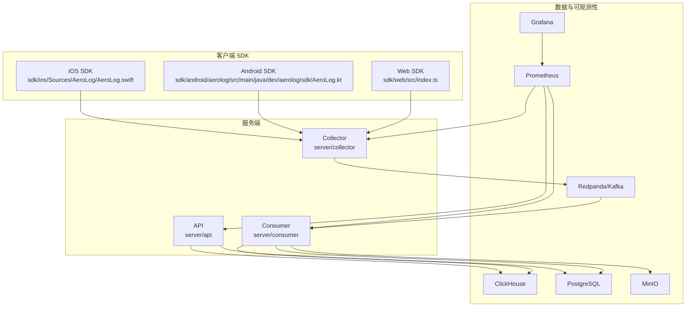
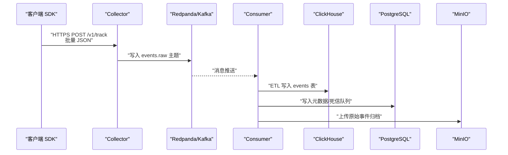
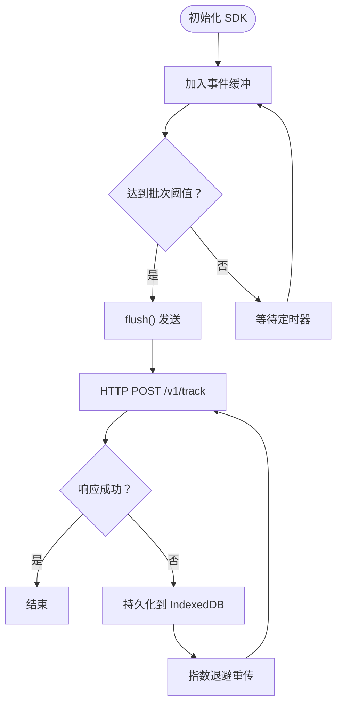
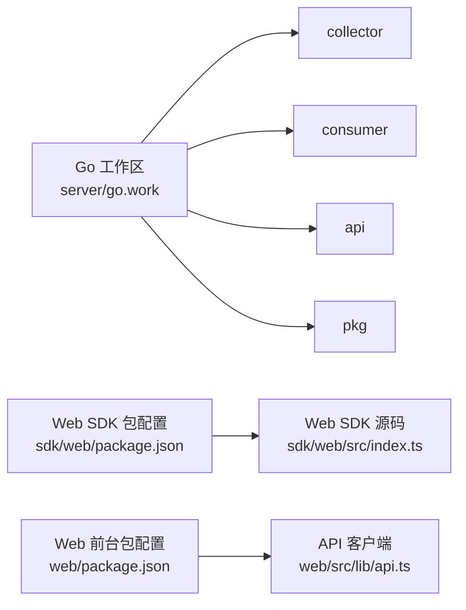

# 快速开始

<cite>
**本文引用的文件**
- [README.md](file://README.md)
- [docker-compose.yml](file://deploy/docker-compose.yml)
- [01_schema.sql（Postgres）](file://deploy/init/postgres/01_schema.sql)
- [01_schema.sql（ClickHouse）](file://deploy/init/clickhouse/01_schema.sql)
- [api 配置（Go）](file://server/api/internal/config/config.go)
- [collector 配置（Go）](file://server/collector/internal/config/config.go)
- [consumer 配置（Go）](file://server/consumer/internal/config/config.go)
- [Go 工作区（go.work）](file://server/go.work)
- [Web 应用包配置（web/package.json）](file://web/package.json)
- [Web SDK 包配置（sdk/web/package.json）](file://sdk/web/package.json)
- [Web SDK 入口（sdk/web/src/index.ts）](file://sdk/web/src/index.ts)
- [Android SDK 入口（sdk/android/aerolog/src/main/java/dev/aerolog/sdk/AeroLog.kt）](file://sdk/android/aerolog/src/main/java/dev/aerolog/sdk/AeroLog.kt)
- [iOS SDK 入口（sdk/ios/Sources/AeroLog/AeroLog.swift）](file://sdk/ios/Sources/AeroLog/AeroLog.swift)
- [Web 应用入口（web/src/app/page.tsx）](file://web/src/app/page.tsx)
- [Web API 客户端（web/src/lib/api.ts）](file://web/src/lib/api.ts)
</cite>

## 目录
1. [简介](#简介)
2. [项目结构](#项目结构)
3. [核心组件](#核心组件)
4. [架构总览](#架构总览)
5. [详细组件分析](#详细组件分析)
6. [依赖关系分析](#依赖关系分析)
7. [性能注意事项](#性能注意事项)
8. [故障排查指南](#故障排查指南)
9. [结论](#结论)
10. [附录](#附录)

## 简介
本指南面向首次接触 AeroLog 的用户，目标是在最短时间内完成本地开发环境搭建、系统启动、第一个项目创建与 SDK 集成，并通过一个简单的 Hello World 示例，演示从事件采集到数据可视化的完整流程。同时提供常见环境问题的排查方法与解决方案。

## 项目结构
AeroLog 采用“多端 SDK + 分层服务端 + 可观测性”的架构设计，主要模块包括：
- SDK：Android、iOS、Web 三端统一上报协议，内置离线缓存与重传机制
- 服务端：Go 实现的接收层（collector）、消费层（consumer）、管理与查询 API（api）
- 数据存储：ClickHouse（事件明细）、PostgreSQL（元数据）、MinIO（原始归档）
- 可视化：Prometheus + Grafana
- 启动方式：docker-compose 一键拉起所有依赖

图表来源
- [docker-compose.yml:1-147](file://deploy/docker-compose.yml#L1-L147)
- [01_schema.sql（ClickHouse）:1-61](file://deploy/init/clickhouse/01_schema.sql#L1-L61)
- [01_schema.sql（Postgres）:1-92](file://deploy/init/postgres/01_schema.sql#L1-L92)
- [collector 配置（Go）:1-38](file://server/collector/internal/config/config.go#L1-L38)
- [consumer 配置（Go）:1-53](file://server/consumer/internal/config/config.go#L1-L53)
- [api 配置（Go）:1-46](file://server/api/internal/config/config.go#L1-L46)

章节来源
- [README.md:1-50](file://README.md#L1-L50)
- [docker-compose.yml:1-147](file://deploy/docker-compose.yml#L1-L147)

## 核心组件
- Docker Compose 一键启动：包含 PostgreSQL、Redis、Redpanda（Kafka API）、ClickHouse、MinIO、Prometheus、Grafana
- Go 服务端工作区：collector、consumer、api、pkg 四个模块
- Web SDK：支持自动页面浏览、点击采集、会话管理、IndexedDB 离线缓存与指数退避重传
- Android SDK：Room 离线缓存、生命周期自动采集、OkHttp 发送
- iOS SDK：UserDefaults + 文件存储、定时 flush、指数退避重传
- Web 前台：Next.js 控制台，基于 API 客户端进行项目与分析查询

章节来源
- [README.md:36-50](file://README.md#L36-L50)
- [docker-compose.yml:1-147](file://deploy/docker-compose.yml#L1-L147)
- [go.work:1-9](file://server/go.work#L1-L9)
- [sdk/web/src/index.ts:1-307](file://sdk/web/src/index.ts#L1-L307)
- [sdk/android/aerolog/src/main/java/dev/aerolog/sdk/AeroLog.kt:1-216](file://sdk/android/aerolog/src/main/java/dev/aerolog/sdk/AeroLog.kt#L1-L216)
- [sdk/ios/Sources/AeroLog/AeroLog.swift:1-207](file://sdk/ios/Sources/AeroLog/AeroLog.swift#L1-L207)
- [web/src/lib/api.ts:1-76](file://web/src/lib/api.ts#L1-L76)

## 架构总览
AeroLog 的整体链路是“多端 SDK → Collector（HTTPS + 批量）→ Redpanda/Kafka → Consumer（ETL）→ ClickHouse/PostgreSQL/MinIO”，并通过 Prometheus + Grafana 提供指标与可视化。

图表来源
- [README.md:24-34](file://README.md#L24-L34)
- [collector 配置（Go）:1-38](file://server/collector/internal/config/config.go#L1-L38)
- [consumer 配置（Go）:1-53](file://server/consumer/internal/config/config.go#L1-L53)
- [01_schema.sql（ClickHouse）:1-61](file://deploy/init/clickhouse/01_schema.sql#L1-L61)
- [01_schema.sql（Postgres）:1-92](file://deploy/init/postgres/01_schema.sql#L1-L92)

## 详细组件分析

### 开发环境准备与一键启动
- 环境要求
  - Docker 与 docker-compose
  - Node.js（用于 Web SDK 构建与测试）
  - Go 1.22（服务端构建）
- 一键启动
  - 在 deploy 目录执行 docker compose up -d
  - 启动后包含：PostgreSQL、Redis、Redpanda（含控制台）、ClickHouse、MinIO、Prometheus、Grafana
- 验证步骤
  - 浏览器访问 Grafana：默认账号 admin/admin，导入 AeroLog 面板
  - 访问 Prometheus：确认 collector/consumer/api 的 /metrics 指标可用
  - 访问 Redpanda Console：确认 events.raw 主题存在且可查看消息

章节来源
- [README.md:36-43](file://README.md#L36-L43)
- [docker-compose.yml:1-147](file://deploy/docker-compose.yml#L1-L147)

### 初始化数据库与模式
- PostgreSQL（元数据）
  - 创建 users、projects、event_definitions、property_definitions、dashboards 等表
  - 插入默认管理员用户（上线后请立即修改密码）
- ClickHouse（事件明细）
  - 创建 aerolog.events、aerolog.events_buffer、aerolog.users 表
  - events 表按 project_id + 月分区，TTL 365 天
  - events_buffer 使用 Buffer 引擎，降低写入延迟

章节来源
- [01_schema.sql（Postgres）:1-92](file://deploy/init/postgres/01_schema.sql#L1-L92)
- [01_schema.sql（ClickHouse）:1-61](file://deploy/init/clickhouse/01_schema.sql#L1-L61)

### 服务端配置要点（Go）
- Collector
  - 监听地址、指标端口、Kafka 主题与 Broker、Postgres DSN、Redis 地址、最大请求体大小
- Consumer
  - Kafka 消费组、主题、批大小、批间隔、ClickHouse 连接参数、Postgres DSN、指标端口
- API
  - 监听地址、指标端口、Postgres DSN、ClickHouse 连接、JWT Secret、CORS 允许来源

章节来源
- [collector 配置（Go）:1-38](file://server/collector/internal/config/config.go#L1-L38)
- [consumer 配置（Go）:1-53](file://server/consumer/internal/config/config.go#L1-L53)
- [api 配置（Go）:1-46](file://server/api/internal/config/config.go#L1-L46)

### Web SDK 集成与 Hello World
- 初始化
  - 传入 serverUrl 与 token，设置批量大小、刷新间隔、是否自动采集页面浏览/点击等
  - SDK 自动注入设备/系统/网络等上下文属性，并维护匿名 ID、用户 ID、会话 ID
- 采集流程
  - track 发送事件，达到批次阈值或定时器触发时 flush
  - 发送失败时持久化到 IndexedDB，联网后指数退避重传
- Hello World 示例步骤
  1) 在 Web 前台创建项目，获取 token
  2) 在前端应用中初始化 SDK 并调用 track
  3) 在 Grafana 查看面板，或在 Web 控制台查看实时事件

图表来源
- [sdk/web/src/index.ts:147-182](file://sdk/web/src/index.ts#L147-L182)
- [sdk/web/src/index.ts:126-145](file://sdk/web/src/index.ts#L126-L145)

章节来源
- [sdk/web/src/index.ts:1-307](file://sdk/web/src/index.ts#L1-L307)
- [web/src/lib/api.ts:1-76](file://web/src/lib/api.ts#L1-L76)

### Android SDK 集成与 Hello World
- 初始化
  - Application 中初始化，配置 serverUrl 与 token，开启自动采集生命周期/页面等
  - 使用 Room 存储离线事件，周期性 flush
- 采集流程
  - track 发送事件，失败则持久化到数据库，联网后重传
  - 支持自动注入 OS、版本、机型、分辨率等属性

章节来源
- [sdk/android/aerolog/src/main/java/dev/aerolog/sdk/AeroLog.kt:59-80](file://sdk/android/aerolog/src/main/java/dev/aerolog/sdk/AeroLog.kt#L59-L80)
- [sdk/android/aerolog/src/main/java/dev/aerolog/sdk/AeroLog.kt:108-124](file://sdk/android/aerolog/src/main/java/dev/aerolog/sdk/AeroLog.kt#L108-L124)

### iOS SDK 集成与 Hello World
- 初始化
  - setup 后自动维护匿名 ID、用户 ID、会话 ID
  - 支持自动采集生命周期事件，定时 flush
- 采集流程
  - track 发送事件，失败持久化到本地存储，联网后重传

章节来源
- [sdk/ios/Sources/AeroLog/AeroLog.swift:33-48](file://sdk/ios/Sources/AeroLog/AeroLog.swift#L33-L48)
- [sdk/ios/Sources/AeroLog/AeroLog.swift:77-82](file://sdk/ios/Sources/AeroLog/AeroLog.swift#L77-L82)

### Web 前台与项目创建
- 启动前台
  - 使用 Next.js，开发端口 3000
- 项目创建
  - 通过 API 客户端创建项目，获取 token
  - 在控制台页面查看项目与分析报表

章节来源
- [web/package.json:5-10](file://web/package.json#L5-L10)
- [web/src/app/page.tsx:1-6](file://web/src/app/page.tsx#L1-L6)
- [web/src/lib/api.ts:33-37](file://web/src/lib/api.ts#L33-L37)

## 依赖关系分析
- 服务端模块
  - go.work 将 collector、consumer、api、pkg 组织为工作区，便于统一构建与调试
- Web SDK
  - 构建产物通过 tsup 输出 ES Module/CJS/TYPES，支持开发与测试
- Web 前台
  - 依赖 @tanstack/react-query、echarts 等生态库，API 客户端统一指向 Go API 服务

图表来源
- [go.work:1-9](file://server/go.work#L1-L9)
- [sdk/web/package.json:17-22](file://sdk/web/package.json#L17-L22)
- [web/package.json:11-22](file://web/package.json#L11-L22)
- [web/src/lib/api.ts:1-19](file://web/src/lib/api.ts#L1-L19)

章节来源
- [go.work:1-9](file://server/go.work#L1-L9)
- [sdk/web/package.json:1-29](file://sdk/web/package.json#L1-L29)
- [web/package.json:1-33](file://web/package.json#L1-L33)
- [web/src/lib/api.ts:1-76](file://web/src/lib/api.ts#L1-L76)

## 性能注意事项
- 批量与刷新
  - 合理设置 batchSize 与 flushInterval，避免频繁网络请求与内存占用过高
- 离线缓存上限
  - storageLimit 控制本地持久化上限，防止磁盘膨胀
- Kafka/ClickHouse
  - Redpanda/Kafka 与 ClickHouse 的分区与 TTL 设置已针对高吞吐场景优化
- 指标与监控
  - 通过 Prometheus 抓取各服务 /metrics，结合 Grafana 面板进行容量与性能观察

## 故障排查指南
- 无法连接数据库
  - 检查 PostgreSQL/ClickHouse 容器健康检查与端口映射
  - 确认初始化 SQL 已执行（Postgres/ClickHouse 模式）
- 事件未入库
  - 检查 Collector 是否收到请求（日志与 /metrics）
  - 检查 Redpanda 主题是否存在，Consumer 是否正常消费
  - 确认 API 服务可访问 PostgreSQL/ClickHouse
- SDK 发送失败
  - Web：检查 IndexedDB 是否有积压事件，确认网络与跨域配置
  - Android/iOS：确认 token 与 serverUrl 正确，查看指数退避重传日志
- 前台无法登录或看不到数据
  - 默认管理员密码提示已在初始化 SQL 中给出，上线后请立即修改
  - 确认 NEXT_PUBLIC_API_BASE 指向正确的 API 地址

章节来源
- [docker-compose.yml:17-21](file://deploy/docker-compose.yml#L17-L21)
- [docker-compose.yml:93-97](file://deploy/docker-compose.yml#L93-L97)
- [01_schema.sql（Postgres）:86-92](file://deploy/init/postgres/01_schema.sql#L86-L92)
- [api 配置（Go）:24-38](file://server/api/internal/config/config.go#L24-L38)
- [collector 配置（Go）:20-30](file://server/collector/internal/config/config.go#L20-L30)
- [consumer 配置（Go）:29-44](file://server/consumer/internal/config/config.go#L29-L44)

## 结论
通过本快速开始指南，您已经完成了 AeroLog 的环境搭建、系统启动、项目创建与 SDK 集成，并了解了从事件采集到数据可视化的完整链路。建议在本地验证无误后，逐步完善生产级配置（如 TLS、鉴权、限流与备份策略）。

## 附录
- 一键启动命令
  - 在 deploy 目录执行 docker compose up -d
- 项目创建与 SDK 集成
  - 在 Web 前台创建项目并获取 token
  - 在前端应用中初始化 SDK 并调用 track
- 可视化
  - 登录 Grafana，默认账号 admin/admin，查看 AeroLog 面板