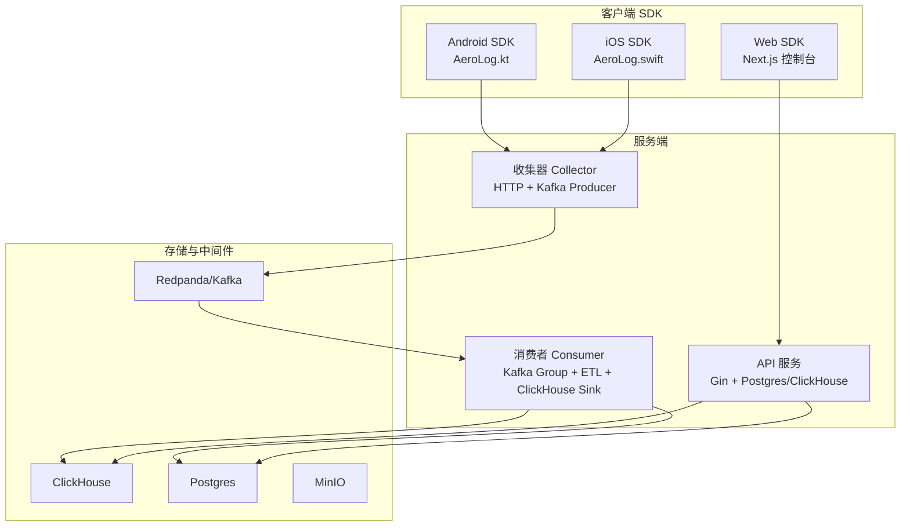
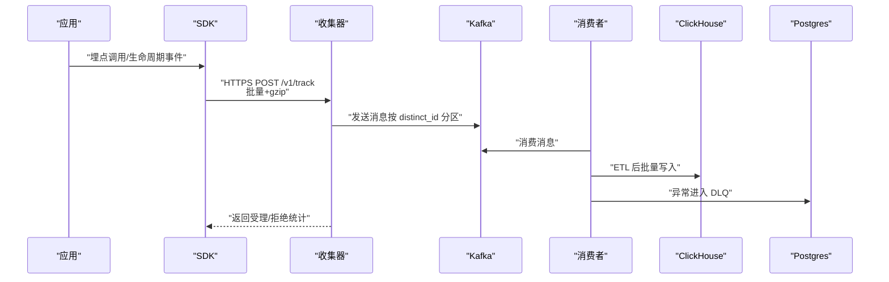
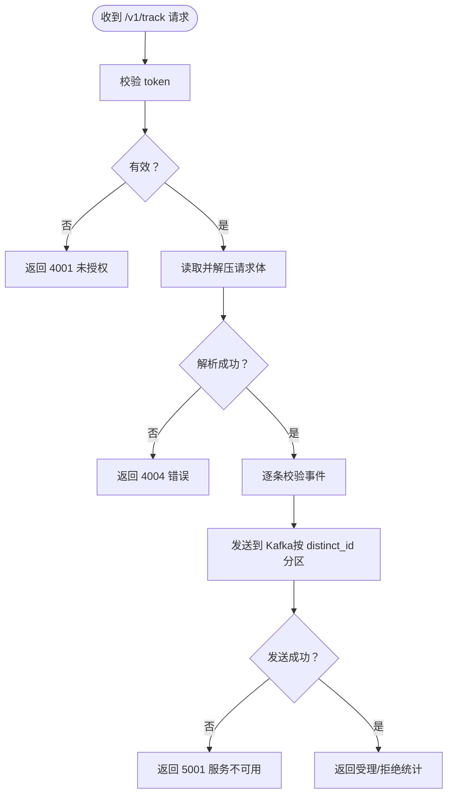
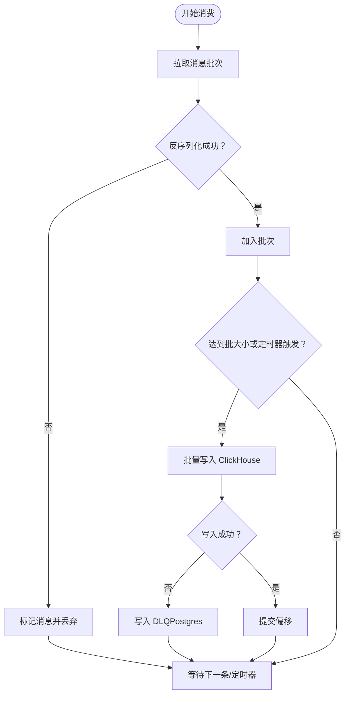
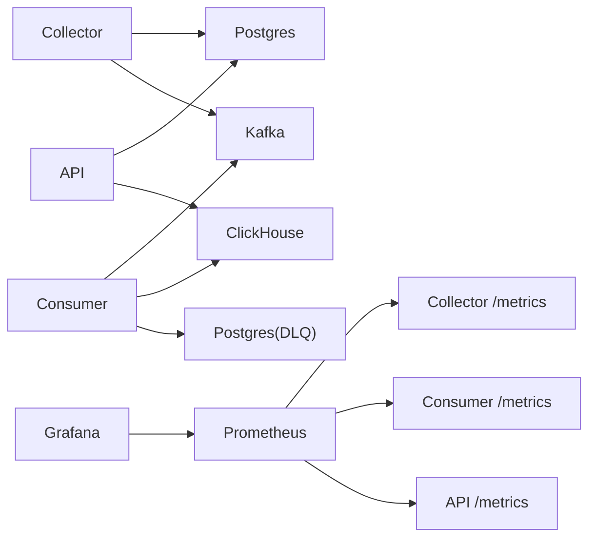

# 故障排除

<cite>
**本文引用的文件**
- [README.md](file://README.md)
- [docker-compose.yml](file://deploy/docker-compose.yml)
- [prometheus.yml](file://deploy/prometheus/prometheus.yml)
- [aerolog-overview.json](file://deploy/grafana/dashboards/aerolog-overview.json)
- [main.go（API）](file://server/api/cmd/main.go)
- [main.go（收集器）](file://server/collector/cmd/main.go)
- [main.go（消费者）](file://server/consumer/cmd/main.go)
- [track.go（收集器处理器）](file://server/collector/internal/handler/track.go)
- [worker.go（消费者工作器）](file://server/consumer/internal/worker/worker.go)
- [sink.go（ClickHouse 写入器）](file://server/consumer/internal/chsink/sink.go)
- [metrics.go（指标导出）](file://server/pkg/metrics/metrics.go)
- [AeroLog.kt（Android SDK）](file://sdk/android/aerolog/src/main/java/dev/aerolog/sdk/AeroLog.kt)
- [AeroLog.swift（iOS SDK）](file://sdk/ios/Sources/AeroLog/AeroLog.swift)
- [AeroConfig.kt（Android 配置）](file://sdk/android/aerolog/src/main/java/dev/aerolog/sdk/AeroConfig.kt)
- [AeroConfig.swift（iOS 配置）](file://sdk/ios/Sources/AeroLog/AeroConfig.swift)
- [page.tsx（Web 入口）](file://web/src/app/page.tsx)
</cite>

## 目录
1. [简介](#简介)
2. [项目结构](#项目结构)
3. [核心组件](#核心组件)
4. [架构总览](#架构总览)
5. [详细组件分析](#详细组件分析)
6. [依赖关系分析](#依赖关系分析)
7. [性能考量](#性能考量)
8. [故障排除指南](#故障排除指南)
9. [结论](#结论)
10. [附录](#附录)

## 简介
本指南面向 AeroLog 平台的运维与开发人员，聚焦于常见问题的诊断与解决，覆盖 SDK 集成问题、服务启动失败、数据不显示、性能瓶颈（内存泄漏、CPU 占用过高、数据库连接池问题）、监控告警配置与响应流程、系统扩容与容量规划，以及紧急故障处理标准流程与应急预案。

## 项目结构
AeroLog 采用“多端 SDK + Go 服务 + 流式处理 + 存储”的分层架构。整体链路由 SDK 收集事件，经收集器写入 Kafka，消费者消费并进行 ETL 后写入 ClickHouse 与 Postgres，并通过 Prometheus/Grafana 进行可观测性展示。

图表来源
- [README.md:24-34](file://README.md#L24-L34)
- [docker-compose.yml:3-147](file://deploy/docker-compose.yml#L3-L147)

章节来源
- [README.md:6-50](file://README.md#L6-L50)
- [docker-compose.yml:3-147](file://deploy/docker-compose.yml#L3-L147)

## 核心组件
- 收集器（Collector）：接收 SDK 上报，校验令牌与请求体，解析事件，写入 Kafka，暴露独立 metrics 端口。
- 消费者（Consumer）：消费 Kafka，批量 ETL，写入 ClickHouse，异常进入 DLQ（Postgres），暴露独立 metrics 端口。
- API 服务：提供管理与查询接口，连接 Postgres 与 ClickHouse，暴露独立 metrics 端口。
- SDK：Android/iOS/Web 三端离线缓存 + 批量上报，支持生命周期自动采集与超时控制。
- 中间件与存储：Kafka（Redpanda）、ClickHouse、Postgres、MinIO、Prometheus、Grafana。

章节来源
- [main.go（收集器）:22-74](file://server/collector/cmd/main.go#L22-L74)
- [main.go（消费者）:18-55](file://server/consumer/cmd/main.go#L18-L55)
- [main.go（API）:35-78](file://server/api/cmd/main.go#L35-L78)
- [track.go（收集器处理器）:47-133](file://server/collector/internal/handler/track.go#L47-L133)
- [worker.go（消费者工作器）:60-173](file://server/consumer/internal/worker/worker.go#L60-L173)
- [sink.go（ClickHouse 写入器）:22-106](file://server/consumer/internal/chsink/sink.go#L22-L106)
- [AeroLog.kt（Android SDK）:59-216](file://sdk/android/aerolog/sdk/AeroLog.kt#L59-L216)
- [AeroLog.swift（iOS SDK）:33-207](file://sdk/ios/Sources/AeroLog/AeroLog.swift#L33-L207)

## 架构总览
下图展示从 SDK 到存储的关键路径与关键观测指标位置：

图表来源
- [README.md:24-34](file://README.md#L24-L34)
- [track.go（收集器处理器）:60-133](file://server/collector/internal/handler/track.go#L60-L133)
- [worker.go（消费者工作器）:92-154](file://server/consumer/internal/worker/worker.go#L92-L154)
- [sink.go（ClickHouse 写入器）:45-103](file://server/consumer/internal/chsink/sink.go#L45-L103)

## 详细组件分析

### 收集器（Collector）故障定位
- 启动失败
  - 检查 Postgres 连接 DSN 是否正确、网络可达、凭据匹配。
  - 检查 Kafka 生产者初始化是否成功，Broker 地址与 Topic 配置。
  - 查看 metrics 端口是否监听成功（默认独立端口）。
- 上报接口异常
  - /v1/track 返回 4001：令牌无效或缺失，检查 X-AeroLog-Token 或查询参数 token。
  - /v1/track 返回 4004：请求体解析失败或超过最大 Body 限制。
  - /v1/track 返回 5001：Kafka 写入失败，检查 Broker 可用性与网络。
- 指标与可观测性
  - aerolog_collector_events_received_total：区分 accepted/rejected 计数。
  - aerolog_collector_request_duration_seconds：按状态分桶的 p99 延迟。
  - aerolog_collector_kafka_send_errors_total：Kafka 写失败计数。

图表来源
- [track.go（收集器处理器）:60-133](file://server/collector/internal/handler/track.go#L60-L133)

章节来源
- [main.go（收集器）:22-74](file://server/collector/cmd/main.go#L22-L74)
- [track.go（收集器处理器）:22-133](file://server/collector/internal/handler/track.go#L22-L133)
- [metrics.go（指标导出）:26-49](file://server/pkg/metrics/metrics.go#L26-L49)

### 消费者（Consumer）故障定位
- 启动失败
  - 检查 Postgres 连接与 Kafka Broker/Topic/Group 配置。
  - 确认 metrics 端口可用。
- 消费停滞或积压
  - 关注 aerolog_consumer_messages_total（result=ok/invalid）与 aerolog_consumer_dlq_total。
  - 检查 flush 批大小与周期（batchSize/batchMs），观察 aerolog_consumer_flush_duration_seconds 与 aerolog_consumer_flush_batch_size。
- 写入失败
  - sink 写入 ClickHouse 失败会触发 DLQ（插入 Postgres event_dlq 表），需排查网络、权限、表结构与数据类型。
- 指标与可观测性
  - aerolog_consumer_messages_total：消费速率与有效性。
  - aerolog_consumer_flush_duration_seconds：批量写耗时分布。
  - aerolog_consumer_dlq_total：进入死信队列的消息数。

图表来源
- [worker.go（消费者工作器）:92-154](file://server/consumer/internal/worker/worker.go#L92-L154)
- [sink.go（ClickHouse 写入器）:45-103](file://server/consumer/internal/chsink/sink.go#L45-L103)

章节来源
- [main.go（消费者）:18-55](file://server/consumer/cmd/main.go#L18-L55)
- [worker.go（消费者工作器）:19-173](file://server/consumer/internal/worker/worker.go#L19-L173)
- [sink.go（ClickHouse 写入器）:17-106](file://server/consumer/internal/chsink/sink.go#L17-L106)
- [metrics.go（指标导出）:26-49](file://server/pkg/metrics/metrics.go#L26-L49)

### API 服务（管理与查询）故障定位
- 启动失败
  - Postgres 连接失败：检查 DSN、网络、认证。
  - ClickHouse 连接失败：检查地址、凭据、网络。
  - 独立 metrics 端口未监听：确认配置与防火墙。
- 查询异常
  - 关注 aerolog_api_request_duration_seconds 与 aerolog_api_requests_total，定位慢查询与错误路径。
- 健康检查
  - /healthz 返回 ok 表示服务就绪。

章节来源
- [main.go（API）:35-78](file://server/api/cmd/main.go#L35-L78)
- [metrics.go（指标导出）:51-81](file://server/pkg/metrics/metrics.go#L51-L81)

### SDK（Android/iOS/Web）集成与数据不显示
- Android
  - 初始化顺序：必须先 init，再 track。
  - 缓冲与持久化：内存缓冲满或周期 flush 会尝试上报；持久化表用于失败重放。
  - 超时与重试：HTTP 超时、非 429 的 4xx 不重试。
- iOS
  - 单例共享实例，线程安全；定时器驱动 flush。
  - 发送逻辑与 Android 类似，遇到 4xx（除 429）视为拒绝。
- Web
  - 控制台入口跳转至 /console，确保前端路由与权限配置正确。

章节来源
- [AeroLog.kt（Android SDK）:59-216](file://sdk/android/aerolog/sdk/AeroLog.kt#L59-L216)
- [AeroConfig.kt（Android 配置）:6-15](file://sdk/android/aerolog/sdk/AeroConfig.kt#L6-L15)
- [AeroLog.swift（iOS SDK）:33-207](file://sdk/ios/Sources/AeroLog/AeroLog.swift#L33-L207)
- [AeroConfig.swift（iOS 配置）:3-29](file://sdk/ios/Sources/AeroLog/AeroConfig.swift#L3-L29)
- [page.tsx（Web 入口）:1-6](file://web/src/app/page.tsx#L1-L6)

## 依赖关系分析
- 组件耦合
  - 收集器依赖 Postgres（项目令牌解析）、Kafka（消息队列）。
  - 消费者依赖 Kafka、ClickHouse、Postgres（DLQ）。
  - API 服务依赖 Postgres 与 ClickHouse。
- 外部依赖
  - Docker Compose 提供 Postgres、Redis、Redpanda、ClickHouse、MinIO、Prometheus、Grafana。
  - Prometheus 通过独立端口抓取各服务 metrics。

图表来源
- [docker-compose.yml:3-147](file://deploy/docker-compose.yml#L3-L147)
- [prometheus.yml:10-28](file://deploy/prometheus/prometheus.yml#L10-L28)

章节来源
- [docker-compose.yml:3-147](file://deploy/docker-compose.yml#L3-L147)
- [prometheus.yml:10-28](file://deploy/prometheus/prometheus.yml#L10-L28)

## 性能考量
- CPU 占用过高
  - 检查消费者 flush 频率与批大小，避免过小批次导致频繁写入。
  - 关注 aerolog_consumer_flush_duration_seconds 的 p99，定位热点。
- 内存泄漏
  - Android：确认周期 flush 协程未泄漏，Room 数据库引用及时释放。
  - iOS：定时器与 URLSession 使用完成后释放。
- 数据库连接池问题
  - ClickHouse 连接池：MaxOpenConns、MaxIdleConns、ConnMaxLifetime 设置合理，避免连接耗尽或老化。
  - Postgres 连接池：确保连接池参数与负载匹配，避免超时与排队。
- Kafka 写入压力
  - 检查 aerolog_collector_kafka_send_errors_total 与 /v1/track 延迟，必要时增加副本与分区。

章节来源
- [sink.go（ClickHouse 写入器）:22-43](file://server/consumer/internal/chsink/sink.go#L22-L43)
- [worker.go（消费者工作器）:19-38](file://server/consumer/internal/worker/worker.go#L19-L38)
- [metrics.go（指标导出）:26-49](file://server/pkg/metrics/metrics.go#L26-L49)

## 故障排除指南

### 一、SDK 集成问题
- 症状：应用内埋点无数据、崩溃或无法上报。
- 诊断步骤
  - Android：确认已调用 init，检查 AeroConfig 参数（serverUrl/token/batchSize/flushInterval/storageLimit），查看日志中 flush 与持久化行为。
  - iOS：确认 shared.setup 已调用，检查 AeroConfig 参数与定时器是否生效。
  - Web：确认控制台页面跳转与路由配置。
- 解决建议
  - 调整 flushInterval 与 batchSize，降低上报频率与体积。
  - 开启 debug 模式（如 SDK 支持）收集更细粒度日志。
  - 校验网络与证书，确保 HTTPS 可达。

章节来源
- [AeroLog.kt（Android SDK）:59-216](file://sdk/android/aerolog/sdk/AeroLog.kt#L59-L216)
- [AeroConfig.kt（Android 配置）:6-15](file://sdk/android/aerolog/sdk/AeroConfig.kt#L6-L15)
- [AeroLog.swift（iOS SDK）:33-207](file://sdk/ios/Sources/AeroLog/AeroLog.swift#L33-L207)
- [AeroConfig.swift（iOS 配置）:3-29](file://sdk/ios/Sources/AeroLog/AeroConfig.swift#L3-L29)
- [page.tsx（Web 入口）:1-6](file://web/src/app/page.tsx#L1-L6)

### 二、服务启动失败
- 症状：服务启动后立即退出或无法访问。
- 诊断步骤
  - 查看各服务启动日志，确认 Postgres/Kafka/ClickHouse 连接成功。
  - 检查独立 metrics 端口是否监听成功。
  - Docker 环境：确认容器健康检查（healthcheck）通过。
- 解决建议
  - 修正 DSN 与凭据，确保网络连通。
  - 调整资源限制（如 Redpanda 内存参数）。

章节来源
- [main.go（收集器）:22-74](file://server/collector/cmd/main.go#L22-L74)
- [main.go（消费者）:18-55](file://server/consumer/cmd/main.go#L18-L55)
- [main.go（API）:35-78](file://server/api/cmd/main.go#L35-L78)
- [docker-compose.yml:17-21](file://deploy/docker-compose.yml#L17-L21)
- [docker-compose.yml:31-35](file://deploy/docker-compose.yml#L31-L35)
- [docker-compose.yml:93-97](file://deploy/docker-compose.yml#L93-L97)

### 三、数据不显示（无事件）
- 症状：前端控制台无事件、指标为零。
- 诊断步骤
  - 收集器：查看 aerolog_collector_events_received_total（accepted/rejected），拒绝率是否升高。
  - Kafka：确认主题存在且有消息。
  - 消费者：查看 aerolog_consumer_messages_total 与 aerolog_consumer_dlq_total，是否存在 DLQ。
  - ClickHouse：确认目标表存在且写入成功。
- 解决建议
  - 修复令牌或请求体格式问题，降低拒绝率。
  - 调整消费者批大小与周期，提升吞吐。
  - 检查 DLQ 并修复写入异常。

章节来源
- [track.go（收集器处理器）:22-37](file://server/collector/internal/handler/track.go#L22-L37)
- [worker.go（消费者工作器）:19-38](file://server/consumer/internal/worker/worker.go#L19-L38)
- [aerolog-overview.json:14-128](file://deploy/grafana/dashboards/aerolog-overview.json#L14-L128)

### 四、性能问题识别与优化
- CPU 占用过高
  - 优化消费者批大小与 flush 周期，减少频繁写入。
  - 关注 aerolog_consumer_flush_duration_seconds 的 p99，定位热点。
- 内存泄漏
  - Android：确认协程作用域与数据库引用释放。
  - iOS：确认定时器与 URLSession 生命周期。
- 数据库连接池问题
  - ClickHouse：调整 MaxOpenConns/MaxIdleConns/ConnMaxLifetime。
  - Postgres：根据并发与查询复杂度调整连接池。

章节来源
- [sink.go（ClickHouse 写入器）:22-43](file://server/consumer/internal/chsink/sink.go#L22-L43)
- [worker.go（消费者工作器）:19-38](file://server/consumer/internal/worker/worker.go#L19-L38)
- [metrics.go（指标导出）:26-49](file://server/pkg/metrics/metrics.go#L26-L49)

### 五、监控告警配置与响应流程
- 配置
  - Prometheus 抓取各服务 /metrics 端口（collector:9101、consumer:9102、api:9103）。
  - Grafana 面板包含 AeroLog 概览，关注 p99 延迟、速率、拒绝率、DLQ 速率。
- 响应流程
  - 当 aerolog_collector_kafka_send_errors_total 或 aerolog_consumer_dlq_total 持续上升时，优先检查 Kafka 与写入链路。
  - 当 aerolog_api_request_duration_seconds p99 升高时，定位慢查询与路由。

章节来源
- [prometheus.yml:10-28](file://deploy/prometheus/prometheus.yml#L10-L28)
- [aerolog-overview.json:14-128](file://deploy/grafana/dashboards/aerolog-overview.json#L14-L128)

### 六、系统扩容与容量规划
- Kafka
  - 增加分区数与副本数，提升并行度与可靠性。
- ClickHouse
  - 评估写入速率与查询负载，增加副本与分片，优化表引擎与分区键。
- Postgres
  - 为 DLQ 与元数据表建立索引，必要时拆分数据库或引入只读副本。
- 容器资源
  - 根据负载调整 CPU/内存限额，确保健康检查通过。

章节来源
- [docker-compose.yml:37-62](file://deploy/docker-compose.yml#L37-L62)
- [sink.go（ClickHouse 写入器）:22-43](file://server/consumer/internal/chsink/sink.go#L22-L43)

### 七、紧急故障处理标准流程与应急预案
- 标准流程
  - 快速隔离：停止向下游写入（如临时禁用消费者或限流）。
  - 降级：优先保障核心查询接口可用，关闭非关键指标。
  - 修复：定位根因（Kafka/ClickHouse/Postgres），修复后逐步恢复。
  - 验证：通过 Grafana 与 /healthz 验证服务恢复。
- 应急预案
  - Kafka 不可用：切换到备用集群或临时落盘重放。
  - ClickHouse 写入失败：暂停新写入，修复后再恢复。
  - API 查询慢：启用只读副本、优化查询计划。

章节来源
- [track.go（收集器处理器）:120-133](file://server/collector/internal/handler/track.go#L120-L133)
- [worker.go（消费者工作器）:107-112](file://server/consumer/internal/worker/worker.go#L107-L112)
- [main.go（API）:50-58](file://server/api/cmd/main.go#L50-L58)

## 结论
通过明确的组件职责、完善的指标体系与可视化面板，AeroLog 能够快速定位与解决从 SDK 集成到服务端链路的各类问题。建议在日常运维中持续关注关键指标阈值，结合容量规划与应急演练，确保系统稳定与可扩展。

## 附录
- 常用命令
  - 启动开发环境：docker compose up -d
  - 查看容器状态：docker compose ps
  - 进入容器调试：docker compose exec <service> sh
- 关键端口
  - Prometheus: 9090
  - Grafana: 3001
  - Collector metrics: 9101
  - Consumer metrics: 9102
  - API metrics: 9103

章节来源
- [README.md:36-43](file://README.md#L36-L43)
- [docker-compose.yml:114-147](file://deploy/docker-compose.yml#L114-L147)
- [prometheus.yml:10-28](file://deploy/prometheus/prometheus.yml#L10-L28)