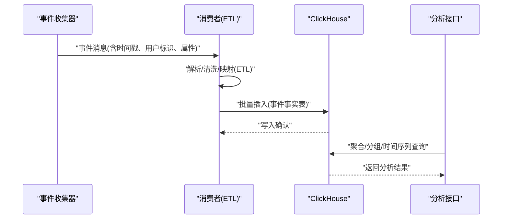
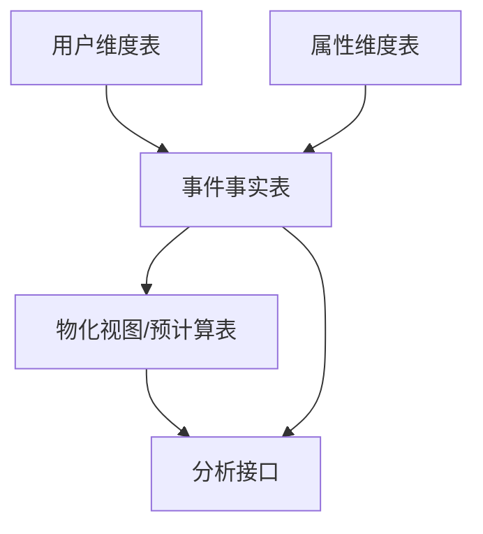

# ClickHouse数据库模式

<cite>
**本文引用的文件**
- [01_schema.sql](file://deploy/init/clickhouse/01_schema.sql)
- [event.go](file://server/pkg/model/event.go)
- [sink.go](file://server/consumer/internal/chsink/sink.go)
- [etl.go](file://server/consumer/internal/etl/etl.go)
- [governance.go](file://server/api/internal/handler/governance.go)
- [users-page.tsx](file://web/src/features/users/users-page.tsx)
</cite>

## 更新摘要
**所做更改**
- 新增用户维度表(users表)章节，详细说明用户识别机制
- 更新事件事实表设计，增加用户维度相关列定义
- 新增用户身份映射与识别流程说明
- 补充用户画像管理功能的技术实现

## 目录
1. [简介](#简介)
2. [项目结构](#项目结构)
3. [核心组件](#核心组件)
4. [架构总览](#架构总览)
5. [详细组件分析](#详细组件分析)
6. [依赖关系分析](#依赖关系分析)
7. [性能考量](#性能考量)
8. [故障排查指南](#故障排查指南)
9. [结论](#结论)
10. [附录](#附录)

## 简介
本文件聚焦于AeroLog在ClickHouse中的OLAP数据库模式设计与实现，围绕事件事实表的表结构、MergeTree引擎选择与分区策略、时间与用户维度建模、分区键与排序键设计原则、稀疏索引与压缩策略、物化视图与预计算表、ClickHouse特有数据类型与函数、以及查询优化与性能调优进行系统化说明。内容基于仓库中ClickHouse初始化脚本、事件模型、消费者ETL流程与分析接口等关键文件进行归纳总结。

**更新** 新增用户维度表(users表)设计，支持直接用户识别与身份映射功能。

## 项目结构
AeroLog的ClickHouse模式主要通过部署脚本初始化，事件模型在后端服务中定义，消费链路负责将事件写入ClickHouse，分析接口提供查询能力。下图展示了与数据库模式直接相关的模块关系：

```mermaid
graph TB
subgraph "部署与初始化"
SCHEMA["01_schema.sql<br/>ClickHouse初始化脚本"]
END
subgraph "后端服务"
MODEL["event.go<br/>事件模型定义"]
CONSUMER["consumer<br/>ETL与写入"]
API["governance.go<br/>治理与用户管理"]
END
subgraph "前端界面"
WEB["users-page.tsx<br/>用户画像管理"]
END
SCHEMA --> CONSUMER
MODEL --> CONSUMER
CONSUMER --> API
WEB --> API
```

**图表来源**
- [01_schema.sql](file://deploy/init/clickhouse/01_schema.sql)
- [event.go](file://server/pkg/model/event.go)
- [sink.go](file://server/consumer/internal/chsink/sink.go)
- [etl.go](file://server/consumer/internal/etl/etl.go)
- [governance.go](file://server/api/internal/handler/governance.go)
- [users-page.tsx](file://web/src/features/users/users-page.tsx)

**章节来源**
- [01_schema.sql](file://deploy/init/clickhouse/01_schema.sql)
- [event.go](file://server/pkg/model/event.go)
- [sink.go](file://server/consumer/internal/chsink/sink.go)
- [etl.go](file://server/consumer/internal/etl/etl.go)
- [governance.go](file://server/api/internal/handler/governance.go)
- [users-page.tsx](file://web/src/features/users/users-page.tsx)

## 核心组件
- 事件事实表：承载事件明细，采用MergeTree系列引擎，按天分区，按时间与维度组合排序，支持稀疏索引与列式压缩。
- 用户维度表：存储用户身份信息，包含user_id和anonymous_id列，支持直接用户识别与身份映射。
- 维度表（可选）：用于存储设备、页面等维度信息，便于关联分析与去重统计。
- 物化视图/预计算表：基于高频查询构建，加速漏斗、留存、趋势等分析场景。
- 分析接口：提供聚合查询、分组统计与时间序列分析能力。

**章节来源**
- [01_schema.sql](file://deploy/init/clickhouse/01_schema.sql)
- [event.go](file://server/pkg/model/event.go)
- [governance.go](file://server/api/internal/handler/governance.go)

## 架构总览
下图展示从事件采集到ClickHouse写入再到分析查询的整体流程，体现OLAP模式下的数据流向与处理阶段：



**图表来源**
- [sink.go](file://server/consumer/internal/chsink/sink.go)
- [etl.go](file://server/consumer/internal/etl/etl.go)
- [governance.go](file://server/api/internal/handler/analytics.go)

## 详细组件分析

### MergeTree引擎与分区策略
- 引擎选择：事件事实表采用MergeTree或其变体，适合高吞吐写入与高效聚合查询；支持分区裁剪与排序键优化。
- 分区键：按自然日分区，降低扫描范围，提升删除与备份效率；分区键应与常见查询过滤条件一致。
- 排序键：以时间字段与关键维度组合排序，确保相同键值连续存储，利于稀疏索引与压缩。
- 合并策略：后台合并时按排序键归并，减少重复值与碎片，提高查询性能。

**章节来源**
- [01_schema.sql](file://deploy/init/clickhouse/01_schema.sql)

### 事件事实表设计
- 时间维度：包含事件发生时间戳与分区键，支撑按日/小时粒度分析与滑动窗口。
- 用户维度：包含用户唯一标识、匿名标识等，便于去重与用户行为追踪。
- 属性维度：包含事件类别、页面路径、设备信息、地理位置等，支持多维交叉分析。
- 列式存储：数值型与低基数字符串使用紧凑编码，日期时间统一使用UTC与时区无关的列名约定。

**章节来源**
- [event.go](file://server/pkg/model/event.go)
- [01_schema.sql](file://deploy/init/clickhouse/01_schema.sql)

### 用户维度表设计
- 表结构：users表专门存储用户身份信息，包含distinct_id、user_id、anonymous_id、properties等核心列。
- 用户识别：支持直接user_id识别与anonymous_id映射，提供灵活的用户身份管理。
- 身份映射：通过identity_mappings表维护anonymous_id到user_id的映射关系，支持用户身份绑定历史追踪。
- 数据同步：消费者ETL流程自动提取事件中的用户标识，写入users表并维护身份映射关系。

**更新** 新增用户维度表设计，支持直接用户识别与身份映射功能。

**章节来源**
- [sink.go](file://server/consumer/internal/chsink/sink.go)
- [governance.go](file://server/api/internal/handler/governance.go)
- [users-page.tsx](file://web/src/features/users/users-page.tsx)

### 分区键与排序键设计原则
- 分区键优先匹配最频繁的过滤条件（如日期），避免全表扫描。
- 排序键遵循"过滤-排序-聚合"的访问模式，将高选择性维度前置，缩短二分查找范围。
- 对高频分组字段建立前缀索引，结合稀疏索引提升点查与范围查询性能。
- 避免过度排序键导致写入膨胀与合并压力。

**章节来源**
- [01_schema.sql](file://deploy/init/clickhouse/01_schema.sql)

### 稀疏索引工作机制与优化效果
- 稀疏索引记录每个数据块的最小/最大值边界，配合分区裁剪与排序键快速定位数据块。
- 在高基数维度上建立索引需权衡存储开销；对低基数维度（如事件类型）收益更明显。
- 查询计划利用索引进行块级剪枝，显著降低I/O与CPU消耗。

**章节来源**
- [01_schema.sql](file://deploy/init/clickhouse/01_schema.sql)

### 数据压缩策略与存储格式
- 压缩算法：默认采用高压缩比算法，针对不同列类型选择合适编码（整型、浮点、字符串、日期时间）。
- 存储格式：列式存储+向量化执行，聚合查询受益于列存与SIMD优化。
- 写入优化：批量插入与合理设置缓冲区大小，减少小文件与碎片。

**章节来源**
- [01_schema.sql](file://deploy/init/clickhouse/01_schema.sql)

### 物化视图与预计算表
- 设计思路：针对高频分析（如漏斗、留存、活跃度）预先聚合，物化视图自动维护，查询时直接命中。
- 更新策略：后台异步刷新，结合触发条件（如定时任务或数据阈值）控制刷新频率。
- 适用场景：报表类、仪表盘、离线分析，避免重复复杂计算。

**章节来源**
- [01_schema.sql](file://deploy/init/clickhouse/01_schema.sql)

### ClickHouse特有数据类型与函数
- 数据类型：日期时间类型统一为UTC，字符串使用低基数枚举或字典编码，数值使用合适精度类型。
- 函数：常用聚合函数（如uniq、groupUniqArray）、时间函数（如toYYYYMMDD、toRelativeHourNum）、数组/JSON处理函数。
- 窗口与采样：支持窗口函数与分桶采样，平衡精度与性能。

**章节来源**
- [01_schema.sql](file://deploy/init/clickhouse/01_schema.sql)

### 写入链路与ETL
- 解析与清洗：从消息队列读取事件，解析为标准字段，填充缺失维度，修正异常时间戳。
- 映射与转换：将业务属性映射为统一维度，生成分区键与排序键所需字段。
- 批量写入：按分区与排序键组织数据，提交至ClickHouse，失败重试与幂等处理。

**章节来源**
- [sink.go](file://server/consumer/internal/chsink/sink.go)
- [etl.go](file://server/consumer/internal/etl/etl.go)

### 查询优化与分析接口
- 过滤下推：尽量在WHERE子句中使用分区键与排序键前缀，减少数据扫描。
- 聚合优化：使用物化视图与预聚合表，避免大表全量聚合。
- 分页与限流：对长尾查询设置超时与行数限制，保障系统稳定性。
- 指标与监控：结合ClickHouse系统表与外部监控，持续评估查询延迟与资源占用。

**章节来源**
- [governance.go](file://server/api/internal/handler/governance.go)

### 用户身份管理与识别流程
- 身份识别：支持直接user_id识别与anonymous_id映射，提供灵活的用户身份管理。
- 身份映射：通过identity_mappings表维护anonymous_id到user_id的映射关系，支持用户身份绑定历史追踪。
- 数据同步：消费者ETL流程自动提取事件中的用户标识，写入users表并维护身份映射关系。
- 前端展示：用户页面实时展示用户画像，包括distinct_id、user_id、anonymous_id等信息。

**更新** 新增用户身份管理与识别流程说明，涵盖身份映射与用户画像展示功能。

**章节来源**
- [governance.go](file://server/api/internal/handler/governance.go)
- [users-page.tsx](file://web/src/features/users/users-page.tsx)

## 依赖关系分析
事件事实表与维度表之间存在潜在的关联关系，分析接口依赖于事实表与物化视图/预计算表。下图给出概念性依赖关系示意：



[此图为概念性依赖示意，不对应具体源码文件，故无图表来源]

## 性能考量
- 写入性能：批量写入、合理分区与排序键、禁用不必要的触发器与物化视图刷新。
- 查询性能：使用分区裁剪、稀疏索引、物化视图、列式存储与向量化执行。
- 存储成本：压缩比与索引开销的平衡，定期清理过期分区与历史数据。
- 可靠性：写入重试、幂等、备份与恢复策略，监控慢查询与资源瓶颈。

## 故障排查指南
- 写入失败：检查消息格式、字段映射与分区键合法性；查看消费者错误日志与重试队列。
- 查询缓慢：确认WHERE条件是否命中分区键与排序键前缀；评估物化视图是否过期。
- 存储膨胀：检查重复值与低效排序键；调整压缩参数与合并策略。
- 监控指标：关注写入延迟、查询QPS、内存与磁盘使用率，结合系统表定位问题。

## 结论
AeroLog的ClickHouse模式以事件事实表为核心，结合MergeTree引擎、合理的分区与排序键设计、稀疏索引与压缩策略，以及物化视图与预计算表，实现了高吞吐写入与高效OLAP分析。通过规范的数据类型与函数使用、严格的ETL流程与查询优化实践，可在保证性能的同时满足多样化的分析需求。新增的用户维度表进一步增强了用户识别与身份管理能力，为精细化运营提供了坚实的数据基础。

## 附录
- 初始化脚本位置：[01_schema.sql](file://deploy/init/clickhouse/01_schema.sql)
- 事件模型定义：[event.go](file://server/pkg/model/event.go)
- 写入与ETL实现：[sink.go](file://server/consumer/internal/chsink/sink.go)、[etl.go](file://server/consumer/internal/etl/etl.go)
- 治理与用户管理：[governance.go](file://server/api/internal/handler/governance.go)
- 用户画像管理：[users-page.tsx](file://web/src/features/users/users-page.tsx)