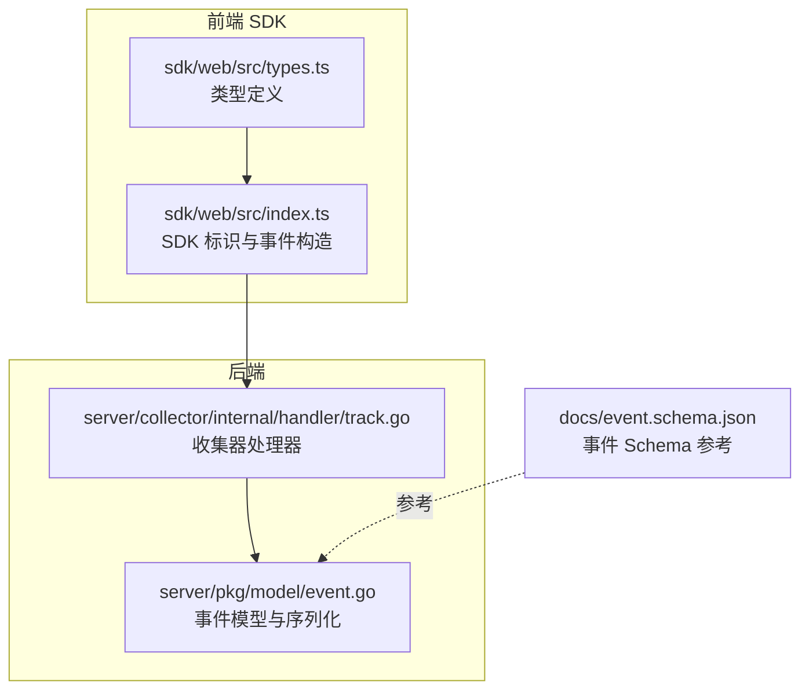
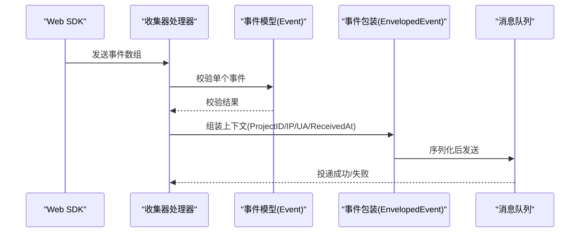
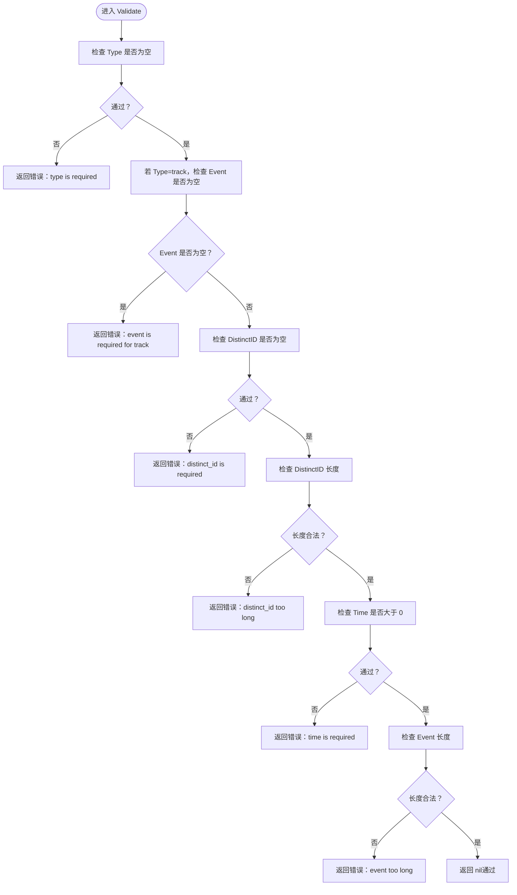
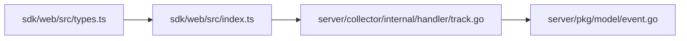

# 事件数据模型

<cite>
**本文引用的文件**
- [server/pkg/model/event.go](file://server/pkg/model/event.go)
- [server/collector/internal/handler/track.go](file://server/collector/internal/handler/track.go)
- [sdk/web/src/types.ts](file://sdk/web/src/types.ts)
- [sdk/web/src/index.ts](file://sdk/web/src/index.ts)
- [docs/event.schema.json](file://docs/event.schema.json)
</cite>

## 目录
1. [简介](#简介)
2. [项目结构](#项目结构)
3. [核心组件](#核心组件)
4. [架构总览](#架构总览)
5. [详细组件分析](#详细组件分析)
6. [依赖关系分析](#依赖关系分析)
7. [性能考量](#性能考量)
8. [故障排查指南](#故障排查指南)
9. [结论](#结论)
10. [附录](#附录)

## 简介
本文件系统性梳理 AeroLog 的事件数据模型，围绕以下目标展开：  
- 解释 Event 结构的字段定义与约束（Type、Event、DistinctID、AnonymousID、UserID、Time 等）。  
- 说明 EventType 枚举类型及其使用场景（track、profile_set、profile_set_once、profile_increment、profile_unset、profile_delete）。  
- 阐述 Lib 结构在 SDK 标识中的作用。  
- 解释 EnvelopedEvent 包装结构的设计目的（ProjectID、IP、UserAgent、ReceivedAt 等上下文信息）。  
- 提供 Validate 方法的校验规则与错误处理机制。  
- 说明 JSON 序列化与反序列化的实现细节。

## 项目结构
事件数据模型主要位于后端 Go 包中，前端 Web SDK 定义了事件类型与 SDK 标识信息，文档中提供了事件 Schema 的参考。

**图表来源**
- [server/pkg/model/event.go:1-120](file://server/pkg/model/event.go#L1-L120)
- [server/collector/internal/handler/track.go:90-148](file://server/collector/internal/handler/track.go#L90-L148)
- [sdk/web/src/types.ts:1-100](file://sdk/web/src/types.ts#L1-L100)
- [sdk/web/src/index.ts:1-160](file://sdk/web/src/index.ts#L1-L160)
- [docs/event.schema.json:1-50](file://docs/event.schema.json#L1-L50)

**章节来源**
- [server/pkg/model/event.go:1-120](file://server/pkg/model/event.go#L1-L120)
- [server/collector/internal/handler/track.go:90-148](file://server/collector/internal/handler/track.go#L90-L148)
- [sdk/web/src/types.ts:1-100](file://sdk/web/src/types.ts#L1-L100)
- [sdk/web/src/index.ts:1-160](file://sdk/web/src/index.ts#L1-L160)
- [docs/event.schema.json:1-50](file://docs/event.schema.json#L1-L50)

## 核心组件
- Event：事件主体结构，承载一次事件的元数据与内容。  
- EnvelopedEvent：事件包装结构，附加项目上下文与采集时的网络/时间信息。  
- Lib：SDK 标识信息，用于记录事件来源 SDK 的名称与版本。  
- EventType：事件类型枚举，区分不同语义的事件（如埋点、用户属性更新等）。

**章节来源**
- [server/pkg/model/event.go:1-120](file://server/pkg/model/event.go#L1-L120)
- [sdk/web/src/types.ts:1-100](file://sdk/web/src/types.ts#L1-L100)
- [sdk/web/src/index.ts:1-160](file://sdk/web/src/index.ts#L1-L160)

## 架构总览
事件从 SDK 侧生成，经由收集器进行基础校验与封装，再投递到消息队列，最终由消费者处理入库。

**图表来源**
- [server/collector/internal/handler/track.go:90-148](file://server/collector/internal/handler/track.go#L90-L148)
- [server/pkg/model/event.go:39-83](file://server/pkg/model/event.go#L39-L83)

## 详细组件分析

### Event 结构与字段定义
- Type：事件类型，必填。用于区分事件语义（如埋点、用户属性更新等）。  
- Event：事件名，仅当 Type=track 时必填。  
- DistinctID：用户唯一标识，必填且长度限制。  
- AnonymousID：匿名用户 ID，可选。  
- UserID：登录用户 ID，可选。  
- Time：事件时间戳（毫秒），必填且需大于 0。  

字段约束与校验规则详见下节“Validate 方法”。

**章节来源**
- [server/pkg/model/event.go:39-60](file://server/pkg/model/event.go#L39-L60)

### EventType 枚举与使用场景
- track：通用埋点事件，通常携带事件名与属性。  
- profile_set：设置用户属性（覆盖式）。  
- profile_set_once：设置用户属性（仅首次生效）。  
- profile_increment：对数值型属性进行增量更新。  
- profile_unset：取消某个用户属性。  
- profile_delete：删除用户档案。

这些类型在 SDK 中以类型定义形式出现，用于约束事件输入，确保语义清晰与一致性。

**章节来源**
- [sdk/web/src/types.ts:1-100](file://sdk/web/src/types.ts#L1-L100)

### Lib 结构与 SDK 标识
- Lib.name：SDK 名称（例如 web）。  
- Lib.version：SDK 版本号。  
SDK 在构造事件时会附带该标识，便于后端统计来源与版本分布。

**章节来源**
- [sdk/web/src/index.ts:1-160](file://sdk/web/src/index.ts#L1-L160)

### EnvelopedEvent 包装结构
设计目的：将项目上下文与采集时的网络/时间信息一并打包，避免消费者重复解析 HTTP 请求头或上下文，提升吞吐与一致性。  
- ProjectID：项目 ID，标识事件所属项目。  
- IP：客户端 IP，可选。  
- UserAgent：浏览器/设备标识，可选。  
- ReceivedAt：事件进入收集器的时间戳（毫秒），用于后续时序分析与去重。  
- Event：内嵌的 Event 对象。

序列化与反序列化：
- MarshalKafka：将 EnvelopedEvent 序列化为字节数组（JSON）。  
- UnmarshalKafka：从字节数组反序列化为 EnvelopedEvent。

**章节来源**
- [server/pkg/model/event.go:62-83](file://server/pkg/model/event.go#L62-L83)

### Validate 方法与错误处理
- 必填项校验：Type、DistinctID、Time 必须存在且有效。  
- 条件校验：Type=track 时 Event 必填。  
- 长度限制：DistinctID 最大长度、Event 最大长度。  
- 错误返回：任一规则不满足即返回错误，收集器据此统计 rejected 数量并继续处理其他事件。

**图表来源**
- [server/pkg/model/event.go:39-60](file://server/pkg/model/event.go#L39-L60)

**章节来源**
- [server/pkg/model/event.go:39-60](file://server/pkg/model/event.go#L39-L60)
- [server/collector/internal/handler/track.go:90-148](file://server/collector/internal/handler/track.go#L90-L148)

### JSON 序列化与反序列化
- EnvelopedEvent 的序列化：使用 JSON 编码，字段映射见结构体标签。  
- 反序列化：从字节数组解析为 EnvelopedEvent，用于消息队列消费端处理。  
- 收集器在发送前调用序列化，消费端在处理时调用反序列化。

**章节来源**
- [server/pkg/model/event.go:71-83](file://server/pkg/model/event.go#L71-L83)
- [server/collector/internal/handler/track.go:113-132](file://server/collector/internal/handler/track.go#L113-L132)

## 依赖关系分析
- SDK 侧定义事件类型与 SDK 标识，负责构造事件对象。  
- 收集器处理器接收事件，执行基础校验与上下文封装，随后序列化并投递到消息队列。  
- 事件模型定义了统一的数据结构与序列化接口，贯穿收集与消费两端。

**图表来源**
- [sdk/web/src/types.ts:1-100](file://sdk/web/src/types.ts#L1-L100)
- [sdk/web/src/index.ts:1-160](file://sdk/web/src/index.ts#L1-L160)
- [server/collector/internal/handler/track.go:90-148](file://server/collector/internal/handler/track.go#L90-L148)
- [server/pkg/model/event.go:1-120](file://server/pkg/model/event.go#L1-L120)

**章节来源**
- [sdk/web/src/types.ts:1-100](file://sdk/web/src/types.ts#L1-L100)
- [sdk/web/src/index.ts:1-160](file://sdk/web/src/index.ts#L1-L160)
- [server/collector/internal/handler/track.go:90-148](file://server/collector/internal/handler/track.go#L90-L148)
- [server/pkg/model/event.go:1-120](file://server/pkg/model/event.go#L1-L120)

## 性能考量
- 分区键选择：使用 DistinctID 作为消息队列分区键，确保同一用户的事件落在同一分区，有利于下游有序处理与去重。  
- 超时控制：发送消息时设置超时，避免阻塞请求线程。  
- 批量处理：收集器对多个事件循环处理，分别统计 accepted 与 rejected，便于观测吞吐与质量。  
- 序列化成本：JSON 序列化/反序列化开销较小，结合短字段设计与紧凑编码可进一步优化。

[本节为通用性能建议，无需特定文件引用]

## 故障排查指南
- 常见校验错误
  - type 为空：检查事件类型是否正确传入。  
  - event 为空（Type=track）：确认埋点事件名是否填写。  
  - distinct_id 为空：确认用户标识是否初始化。  
  - distinct_id 过长：检查标识长度是否超过限制。  
  - event 过长：检查事件名长度是否超过限制。  
  - time 无效：确认时间戳是否为正数且格式正确。  
- 排查步骤
  - 在收集器端查看 rejected 计数与日志。  
  - 使用 UnmarshalKafka 对消息体进行反序列化验证。  
  - 核对 SDK 侧构造的事件是否符合类型定义与长度限制。

**章节来源**
- [server/pkg/model/event.go:39-60](file://server/pkg/model/event.go#L39-L60)
- [server/collector/internal/handler/track.go:90-148](file://server/collector/internal/handler/track.go#L90-L148)

## 结论
AeroLog 的事件数据模型以简洁明确的结构与严格的校验规则为基础，配合 SDK 标识与上下文包装，实现了从采集到消费的高效闭环。通过合理使用 EventType 与字段约束，可确保事件数据的一致性与可分析性；通过序列化/反序列化与分区策略，保障了系统的吞吐与稳定性。

[本节为总结性内容，无需特定文件引用]

## 附录

### 事件 Schema 参考
- 文档提供了事件 Schema 的定义与字段说明，可用于前后端对齐与测试校验。  
- 建议在本地联调时以该 Schema 为准，核对字段命名、类型与约束。

**章节来源**
- [docs/event.schema.json:1-50](file://docs/event.schema.json#L1-L50)