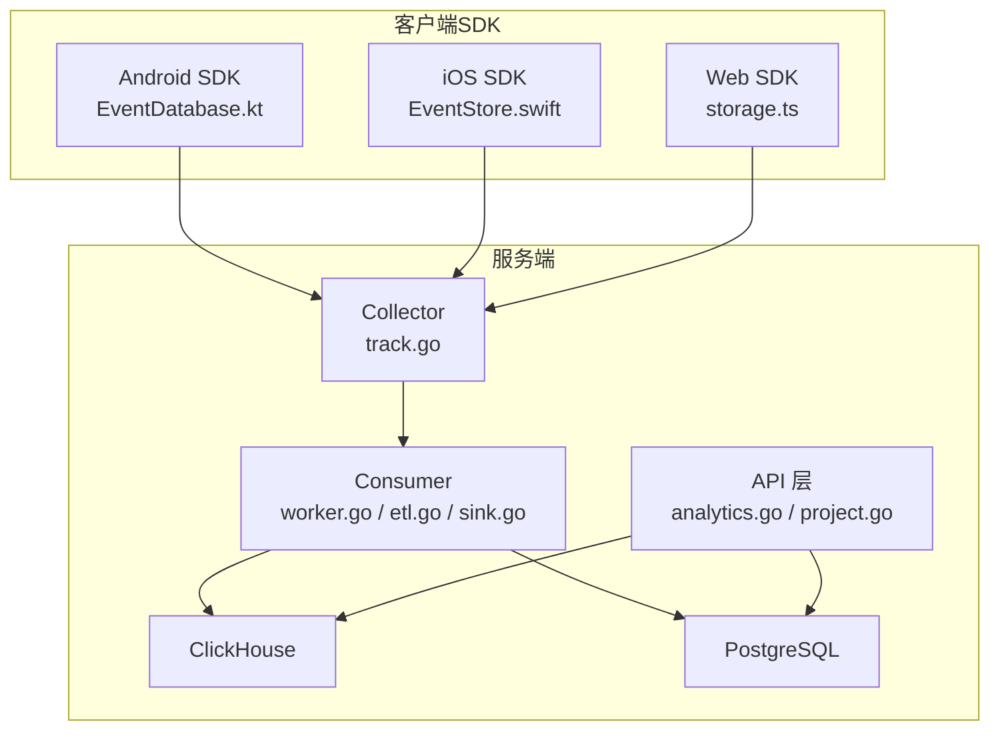
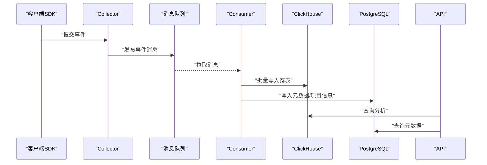
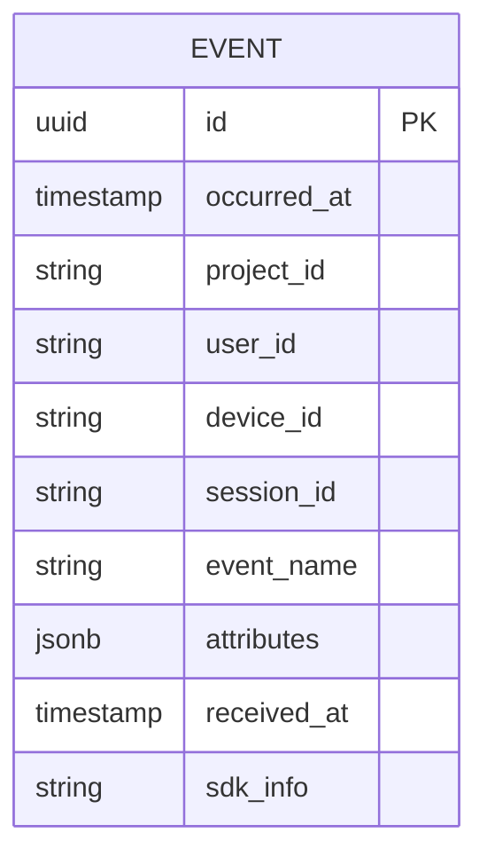
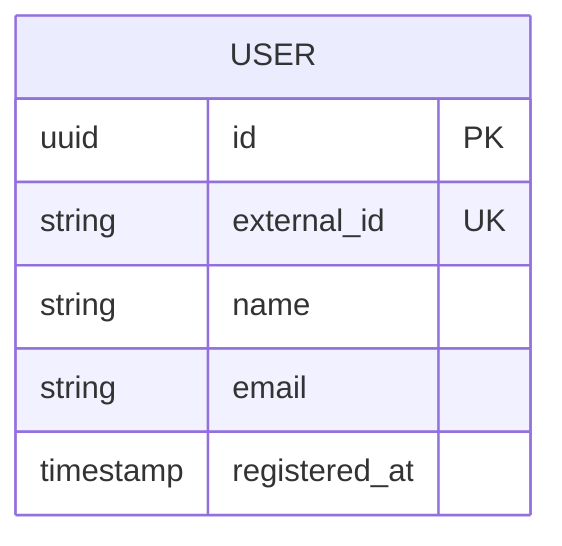
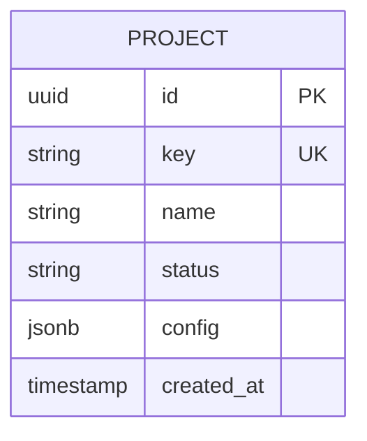
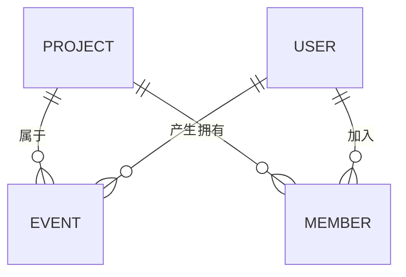
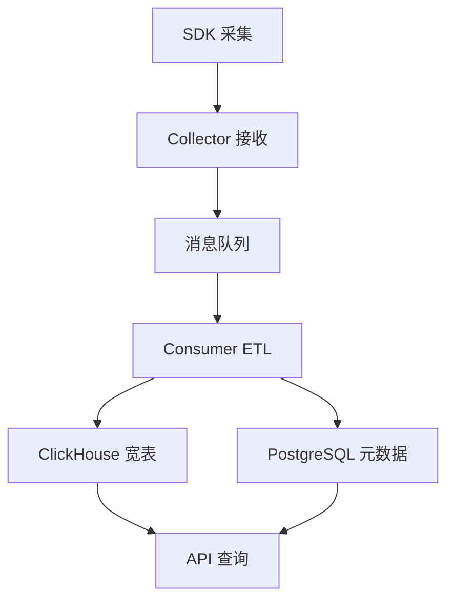
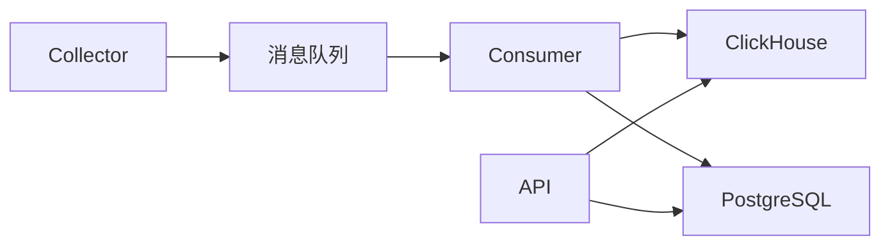

# 数据模型设计

<cite>
**本文引用的文件**
- [01_schema.sql（PostgreSQL）](file://deploy/init/postgres/01_schema.sql)
- [01_schema.sql（ClickHouse）](file://deploy/init/clickhouse/01_schema.sql)
- [event.go](file://server/pkg/model/event.go)
- [track.go](file://server/collector/internal/handler/track.go)
- [etl.go](file://server/consumer/internal/etl/etl.go)
- [sink.go](file://server/consumer/internal/chsink/sink.go)
- [worker.go](file://server/consumer/internal/worker/worker.go)
- [analytics.go](file://server/api/internal/handler/analytics.go)
- [project.go](file://server/api/internal/handler/project.go)
- [event.schema.json](file://docs/event.schema.json)
- [EventDatabase.kt](file://sdk/android/aerolog/src/main/java/dev/aerolog/sdk/storage/EventDatabase.kt)
- [EventStore.swift](file://sdk/ios/Sources/AeroLog/EventStore.swift)
- [storage.ts（Web SDK）](file://sdk/web/src/storage.ts)
- [docker-compose.yml](file://deploy/docker-compose.yml)
</cite>

## 目录
1. [简介](#简介)
2. [项目结构](#项目结构)
3. [核心组件](#核心组件)
4. [架构总览](#架构总览)
5. [详细组件分析](#详细组件分析)
6. [依赖分析](#依赖分析)
7. [性能考虑](#性能考虑)
8. [故障排查指南](#故障排查指南)
9. [结论](#结论)
10. [附录](#附录)

## 简介
本文件面向AeroLog平台，系统化梳理其数据模型设计，覆盖事件数据模型、用户与项目数据模型、PostgreSQL与ClickHouse双引擎差异、数据生命周期管理、ER图与数据流图、以及数据迁移与版本演进策略。目标是帮助开发者与运维人员快速理解并高效维护数据层。

## 项目结构
AeroLog采用“采集-消费-存储-查询”的分层架构：SDK负责事件采集与本地缓存；Collector负责接收与转发；Consumer负责ETL与写入ClickHouse；API层提供查询与分析接口；PostgreSQL用于持久化用户与项目元数据。

图表来源
- [track.go:1-200](file://server/collector/internal/handler/track.go#L1-L200)
- [worker.go:1-200](file://server/consumer/internal/worker/worker.go#L1-L200)
- [etl.go:1-200](file://server/consumer/internal/etl/etl.go#L1-L200)
- [sink.go:1-200](file://server/consumer/internal/chsink/sink.go#L1-L200)
- [analytics.go:1-200](file://server/api/internal/handler/analytics.go#L1-L200)
- [project.go:1-200](file://server/api/internal/handler/project.go#L1-L200)

章节来源
- [docker-compose.yml:1-200](file://deploy/docker-compose.yml#L1-L200)

## 核心组件
- 事件数据模型：统一的事件结构，包含时间戳、项目标识、用户标识、事件属性等，用于分析与留存计算。
- 用户数据模型：用户基本信息与认证上下文，支撑权限与归属关系。
- 项目数据模型：项目配置、密钥、状态与统计口径，支撑多租户与隔离。
- 存储引擎：PostgreSQL用于事务性元数据，ClickHouse用于高吞吐宽表分析。

章节来源
- [event.go:1-200](file://server/pkg/model/event.go#L1-L200)
- [event.schema.json:1-200](file://docs/event.schema.json#L1-L200)

## 架构总览
下图展示从SDK到存储再到查询的整体数据流。

图表来源
- [track.go:1-200](file://server/collector/internal/handler/track.go#L1-L200)
- [worker.go:1-200](file://server/consumer/internal/worker/worker.go#L1-L200)
- [etl.go:1-200](file://server/consumer/internal/etl/etl.go#L1-L200)
- [sink.go:1-200](file://server/consumer/internal/chsink/sink.go#L1-L200)
- [analytics.go:1-200](file://server/api/internal/handler/analytics.go#L1-L200)
- [project.go:1-200](file://server/api/internal/handler/project.go#L1-L200)

## 详细组件分析

### 事件数据模型
- 字段设计要点
  - 时间维度：事件发生时间戳，支持按天/小时粒度分区与物化视图。
  - 业务维度：项目ID、用户ID、设备ID、会话ID、事件名、属性键值对。
  - 技术维度：采集时间、序列号、版本号、SDK元信息。
- 数据类型与约束
  - 时间戳：高精度时间类型，确保排序与窗口函数正确性。
  - 主键/分区：建议以项目ID+日期进行分区，主键可选复合主键或UUID。
  - 约束：NOT NULL用于关键字段，唯一索引用于去重（如事件ID），索引用于常用过滤字段。
- 查询优化
  - 按项目ID与时间范围过滤优先，利用分区裁剪。
  - 对高频属性建立物化视图或预聚合表，降低在线查询成本。

图表来源
- [event.go:1-200](file://server/pkg/model/event.go#L1-L200)
- [event.schema.json:1-200](file://docs/event.schema.json#L1-L200)

章节来源
- [event.go:1-200](file://server/pkg/model/event.go#L1-L200)
- [event.schema.json:1-200](file://docs/event.schema.json#L1-L200)

### 用户数据模型
- 设计思路
  - 用户表保存基础身份信息与注册时间，便于跨项目关联。
  - 可扩展字段用于区分匿名/登录态用户，支持用户画像与归因分析。
- 索引策略
  - 唯一索引：用户ID/外部ID组合，避免重复。
  - 聚集索引：按注册时间或项目ID+注册时间，提升常见查询效率。
- 查询优化
  - 与事件表通过用户ID连接时，确保事件表已按用户ID建立二级索引。

图表来源
- [01_schema.sql（PostgreSQL）:1-200](file://deploy/init/postgres/01_schema.sql#L1-L200)

章节来源
- [01_schema.sql（PostgreSQL）:1-200](file://deploy/init/postgres/01_schema.sql#L1-L200)

### 项目数据模型
- 设计思路
  - 项目表包含密钥、状态、统计口径与创建时间，支撑多租户隔离与配额控制。
  - 与用户表通过“成员”关系表实现权限绑定。
- 索引策略
  - 项目ID为主键，密钥/状态建立二级索引，便于筛选与审计。
- 查询优化
  - 分页查询与条件过滤结合，必要时引入覆盖索引减少回表。

图表来源
- [01_schema.sql（PostgreSQL）:1-200](file://deploy/init/postgres/01_schema.sql#L1-L200)

章节来源
- [01_schema.sql（PostgreSQL）:1-200](file://deploy/init/postgres/01_schema.sql#L1-L200)

### PostgreSQL 与 ClickHouse 数据模型差异与选择依据
- 存储定位
  - PostgreSQL：强一致的事务型元数据存储，适合用户、项目、配置等结构化数据。
  - ClickHouse：列式宽表，面向高吞吐写入与向量化分析查询。
- 表结构差异
  - 字段数量与类型：ClickHouse更偏向轻量宽表，去除冗余字段；PostgreSQL保留更多规范化字段与外键。
  - 分区与物化：ClickHouse以分区键驱动，PostgreSQL以索引与分区表配合。
- 选择依据
  - 写入峰值与查询模式决定引擎选择；事件宽表走ClickHouse，元数据走PostgreSQL。

章节来源
- [01_schema.sql（PostgreSQL）:1-200](file://deploy/init/postgres/01_schema.sql#L1-L200)
- [01_schema.sql（ClickHouse）:1-200](file://deploy/init/clickhouse/01_schema.sql#L1-L200)

### 数据生命周期管理
- 数据保留策略
  - 事件宽表按月/季度分区，保留期默认12个月，可通过配置调整。
  - 元数据保留遵循合规要求，超过保留期的用户数据需匿名化或删除。
- 归档机制
  - 过期分区可导出至对象存储，保留历史快照与审计日志。
- 清理流程
  - 定时任务扫描过期分区与记录，执行软删除标记后异步物理清理。
  - 清理前生成清理清单，支持回滚与审计。

章节来源
- [01_schema.sql（ClickHouse）:1-200](file://deploy/init/clickhouse/01_schema.sql#L1-L200)
- [01_schema.sql（PostgreSQL）:1-200](file://deploy/init/postgres/01_schema.sql#L1-L200)

### ER 图与数据流图
- ER 关系图
  - 事件表与项目表、用户表存在多对一关系；项目表与成员表构成多对多。
  - 外键约束在PostgreSQL中保证参照完整性，ClickHouse中通过应用层校验与一致性检查保障。

图表来源
- [01_schema.sql（PostgreSQL）:1-200](file://deploy/init/postgres/01_schema.sql#L1-L200)
- [01_schema.sql（ClickHouse）:1-200](file://deploy/init/clickhouse/01_schema.sql#L1-L200)

- 数据流图
  - SDK采集→Collector接收→消息队列→Consumer ETL→ClickHouse宽表/PostgreSQL元数据→API查询

图表来源
- [track.go:1-200](file://server/collector/internal/handler/track.go#L1-L200)
- [worker.go:1-200](file://server/consumer/internal/worker/worker.go#L1-L200)
- [etl.go:1-200](file://server/consumer/internal/etl/etl.go#L1-L200)
- [sink.go:1-200](file://server/consumer/internal/chsink/sink.go#L1-L200)
- [analytics.go:1-200](file://server/api/internal/handler/analytics.go#L1-L200)
- [project.go:1-200](file://server/api/internal/handler/project.go#L1-L200)

### 数据迁移与版本演进策略
- 版本演进
  - 事件Schema版本号字段用于兼容新旧字段；消费者侧通过ETL映射新增字段，保持向后兼容。
  - PostgreSQL与ClickHouse分别维护迁移脚本，先改PostgreSQL再改ClickHouse，确保一致性。
- 迁移流程
  - 预热：在非高峰时段执行，先写只读副本或降级查询。
  - 切换：灰度发布，逐步扩大流量，监控延迟与错误率。
  - 回滚：保留旧版本Schema与数据快照，快速回退。
- 并发控制
  - 使用迁移锁与版本号，避免并发迁移导致的数据不一致。

章节来源
- [event.go:1-200](file://server/pkg/model/event.go#L1-L200)
- [etl.go:1-200](file://server/consumer/internal/etl/etl.go#L1-L200)
- [01_schema.sql（PostgreSQL）:1-200](file://deploy/init/postgres/01_schema.sql#L1-L200)
- [01_schema.sql（ClickHouse）:1-200](file://deploy/init/clickhouse/01_schema.sql#L1-L200)

## 依赖分析
- 组件耦合
  - Collector与Consumer通过消息队列解耦；Consumer与存储引擎通过Sink模块解耦。
  - API层依赖PostgreSQL与ClickHouse，分别处理元数据与分析查询。
- 外部依赖
  - ClickHouse与PostgreSQL版本需满足查询与写入性能要求；消息队列需具备高可用与限流能力。

图表来源
- [track.go:1-200](file://server/collector/internal/handler/track.go#L1-L200)
- [worker.go:1-200](file://server/consumer/internal/worker/worker.go#L1-L200)
- [sink.go:1-200](file://server/consumer/internal/chsink/sink.go#L1-L200)
- [analytics.go:1-200](file://server/api/internal/handler/analytics.go#L1-L200)
- [project.go:1-200](file://server/api/internal/handler/project.go#L1-L200)

章节来源
- [docker-compose.yml:1-200](file://deploy/docker-compose.yml#L1-L200)

## 性能考虑
- 写入性能
  - ClickHouse批量写入与分区裁剪；PostgreSQL使用批量插入与事务合并。
- 查询性能
  - 合理分区键与索引；避免SELECT *；使用覆盖索引与物化视图。
- 扩展性
  - 垂直扩展与水平分片结合；ClickHouse副本与只读副本提升可用性。

## 故障排查指南
- 常见问题
  - 写入延迟：检查消息队列积压与Consumer并发；确认ClickHouse写入速率限制。
  - 查询慢：核对索引与分区裁剪是否生效；检查热点分区与倾斜。
  - 数据不一致：核对ETL映射与版本号；检查迁移锁与回滚策略。
- 工具与指标
  - ClickHouse系统表与查询日志；PostgreSQL慢查询日志；API响应时间与错误率。

章节来源
- [sink.go:1-200](file://server/consumer/internal/chsink/sink.go#L1-L200)
- [etl.go:1-200](file://server/consumer/internal/etl/etl.go#L1-L200)
- [analytics.go:1-200](file://server/api/internal/handler/analytics.go#L1-L200)

## 结论
AeroLog的数据模型以“宽表分析+规范化元数据”为核心，结合PostgreSQL与ClickHouse的优势，实现高吞吐与强一致性的平衡。通过清晰的生命周期管理、严格的迁移策略与完善的查询优化，平台可在不同规模场景下稳定运行。

## 附录
- SDK本地存储参考
  - Android：本地Room数据库封装，支持事件落盘与重试。
  - iOS：本地持久化存储，支持离线事件缓存。
  - Web：浏览器存储封装，支持本地缓存与批量上传。

章节来源
- [EventDatabase.kt:1-200](file://sdk/android/aerolog/src/main/java/dev/aerolog/sdk/storage/EventDatabase.kt#L1-L200)
- [EventStore.swift:1-200](file://sdk/ios/Sources/AeroLog/EventStore.swift#L1-L200)
- [storage.ts（Web SDK）:1-200](file://sdk/web/src/storage.ts#L1-L200)