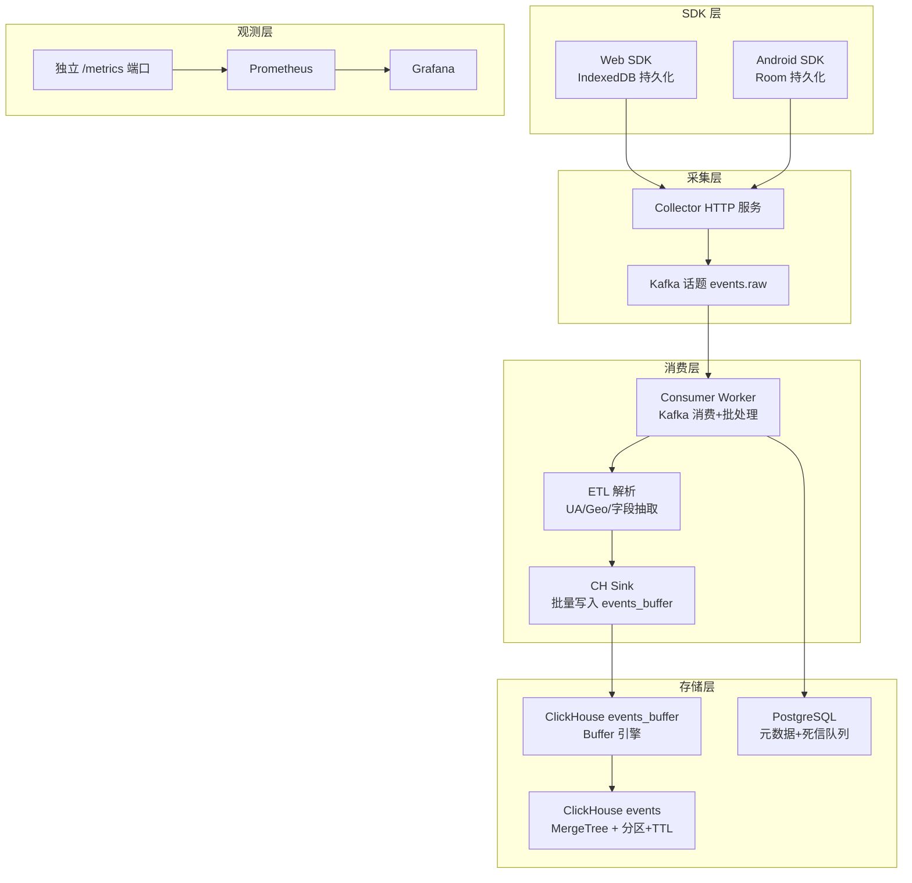
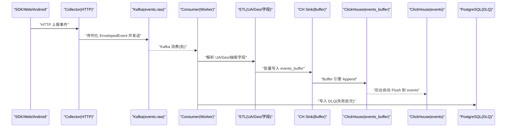
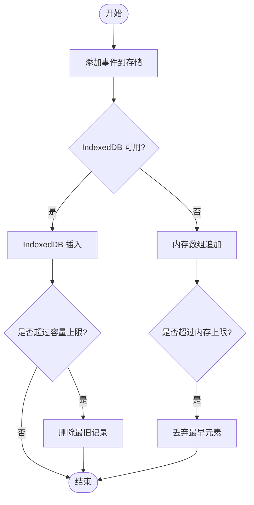
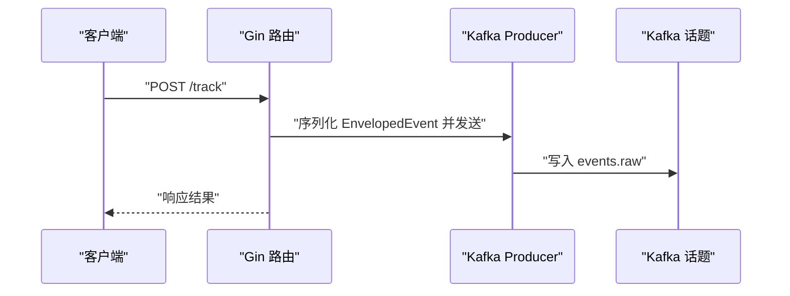
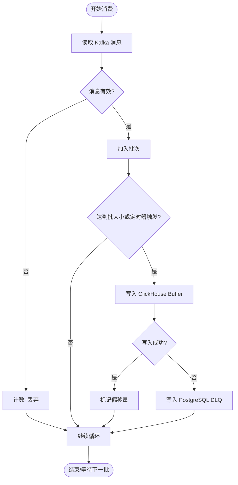
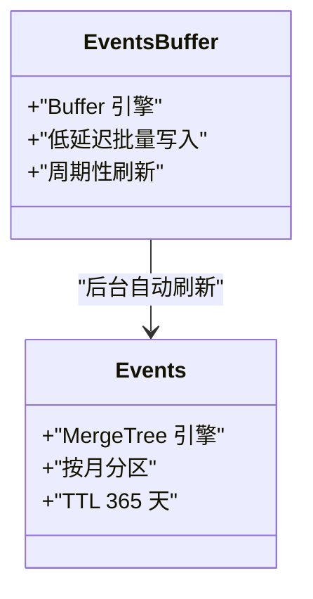
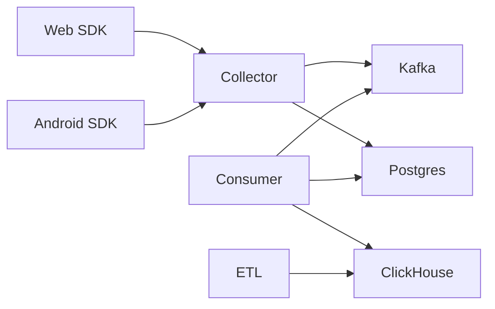

# 数据生命周期管理

<cite>
**本文引用的文件**
- [server/collector/cmd/main.go](file://server/collector/cmd/main.go)
- [server/consumer/cmd/main.go](file://server/consumer/cmd/main.go)
- [server/consumer/internal/worker/worker.go](file://server/consumer/internal/worker/worker.go)
- [server/consumer/internal/chsink/sink.go](file://server/consumer/internal/chsink/sink.go)
- [server/consumer/internal/etl/etl.go](file://server/consumer/internal/etl/etl.go)
- [server/consumer/internal/config/config.go](file://server/consumer/internal/config/config.go)
- [server/collector/internal/config/config.go](file://server/collector/internal/config/config.go)
- [server/pkg/model/event.go](file://server/pkg/model/event.go)
- [server/pkg/metrics/metrics.go](file://server/pkg/metrics/metrics.go)
- [deploy/init/clickhouse/01_schema.sql](file://deploy/init/clickhouse/01_schema.sql)
- [deploy/init/postgres/01_schema.sql](file://deploy/init/postgres/01_schema.sql)
- [sdk/web/src/storage.ts](file://sdk/web/src/storage.ts)
- [sdk/android/aerolog/src/main/java/dev/aerolog/sdk/storage/EventDatabase.kt](file://sdk/android/aerolog/src/main/java/dev/aerolog/sdk/storage/EventDatabase.kt)
- [deploy/docker-compose.yml](file://deploy/docker-compose.yml)
</cite>

## 目录
1. [引言](#引言)
2. [项目结构](#项目结构)
3. [核心组件](#核心组件)
4. [架构总览](#架构总览)
5. [详细组件分析](#详细组件分析)
6. [依赖分析](#依赖分析)
7. [性能考虑](#性能考虑)
8. [故障排查指南](#故障排查指南)
9. [结论](#结论)
10. [附录](#附录)

## 引言
本文件系统性梳理 AeroLog 的数据生命周期管理，覆盖从事件采集、SDK 缓存、消息队列传输、消费者 ETL、ClickHouse 写入与分区 TTL、PostgreSQL 元数据与死信队列、到可观测性与运维保障的全流程。文档重点解释：
- 数据在内存缓存、磁盘持久化与冷热分层中的流转路径
- 基于时间的保留策略与基于容量的回收机制
- ETL 转换规则与质量控制
- 归档与备份策略（含增量与全量思路）
- 数据迁移与版本升级指南
- 一致性与故障恢复机制

## 项目结构
AeroLog 采用“采集-传输-消费-存储”的分层设计：
- SDK 层：Web/Android 使用本地存储（IndexedDB/Room）进行离线缓存与容量回收
- 采集层：HTTP 接口接收事件，写入 Kafka
- 消费层：Kafka 消费者聚合批次，执行 ETL，批量写入 ClickHouse Buffer 表，再由 ClickHouse 引擎异步刷新至主表
- 存储层：ClickHouse 主表按月分区并设置 TTL；PostgreSQL 存放元数据与死信队列
- 观测层：Prometheus/Grafana + 独立 metrics 端口

图表来源
- [server/collector/cmd/main.go:22-74](file://server/collector/cmd/main.go#L22-L74)
- [server/consumer/cmd/main.go:18-55](file://server/consumer/cmd/main.go#L18-L55)
- [server/consumer/internal/worker/worker.go:60-154](file://server/consumer/internal/worker/worker.go#L60-L154)
- [server/consumer/internal/chsink/sink.go:45-103](file://server/consumer/internal/chsink/sink.go#L45-L103)
- [deploy/init/clickhouse/01_schema.sql:6-49](file://deploy/init/clickhouse/01_schema.sql#L6-L49)
- [deploy/init/postgres/01_schema.sql:67-73](file://deploy/init/postgres/01_schema.sql#L67-L73)
- [server/pkg/metrics/metrics.go:52-81](file://server/pkg/metrics/metrics.go#L52-L81)

章节来源
- [server/collector/cmd/main.go:22-74](file://server/collector/cmd/main.go#L22-L74)
- [server/consumer/cmd/main.go:18-55](file://server/consumer/cmd/main.go#L18-L55)
- [deploy/docker-compose.yml:1-147](file://deploy/docker-compose.yml#L1-L147)

## 核心组件
- 事件模型与序列化
  - 统一事件结构与校验，支持多类用户属性事件类型
  - EnvelopedEvent 将上下文（IP、UA、接收时间）封装，避免消费者重复解析
- Collector
  - Gin HTTP 服务，负责限流、反序列化、投递 Kafka
- Consumer
  - Kafka 消费组，批处理聚合，ETL 转换，写入 ClickHouse Buffer，异常写入 PostgreSQL 死信队列
- ClickHouse
  - events_buffer 使用 Buffer 引擎实现低延迟批量写入；events 主表按月分区并设置 TTL
- PostgreSQL
  - 元数据与死信队列；死信队列用于故障恢复与审计
- SDK 缓存
  - Web 使用 IndexedDB，Android 使用 Room；均具备容量上限与淘汰策略

章节来源
- [server/pkg/model/event.go:27-83](file://server/pkg/model/event.go#L27-L83)
- [server/collector/cmd/main.go:43-48](file://server/collector/cmd/main.go#L43-L48)
- [server/consumer/internal/worker/worker.go:92-154](file://server/consumer/internal/worker/worker.go#L92-L154)
- [server/consumer/internal/chsink/sink.go:45-103](file://server/consumer/internal/chsink/sink.go#L45-L103)
- [deploy/init/clickhouse/01_schema.sql:6-49](file://deploy/init/clickhouse/01_schema.sql#L6-L49)
- [deploy/init/postgres/01_schema.sql:67-73](file://deploy/init/postgres/01_schema.sql#L67-L73)
- [sdk/web/src/storage.ts:16-141](file://sdk/web/src/storage.ts#L16-L141)
- [sdk/android/aerolog/src/main/java/dev/aerolog/sdk/storage/EventDatabase.kt:12-40](file://sdk/android/aerolog/src/main/java/dev/aerolog/sdk/storage/EventDatabase.kt#L12-L40)

## 架构总览
下图展示从 SDK 到存储与观测的关键路径与数据流向。

图表来源
- [server/collector/cmd/main.go:43-48](file://server/collector/cmd/main.go#L43-L48)
- [server/consumer/internal/worker/worker.go:92-154](file://server/consumer/internal/worker/worker.go#L92-L154)
- [server/consumer/internal/chsink/sink.go:45-103](file://server/consumer/internal/chsink/sink.go#L45-L103)
- [deploy/init/clickhouse/01_schema.sql:44-49](file://deploy/init/clickhouse/01_schema.sql#L44-L49)
- [deploy/init/postgres/01_schema.sql:67-73](file://deploy/init/postgres/01_schema.sql#L67-L73)

## 详细组件分析

### 事件采集与 SDK 缓存
- Web SDK
  - 使用 IndexedDB 存储待上报事件，支持事务读写与游标遍历
  - 当 IndexedDB 不可用时回退到内存数组，并限制最大条数
  - 超限时按“最旧优先”删除，确保容量可控
- Android SDK
  - 使用 Room 存储事件，提供插入、顺序读取、删除与按 ID 删除接口
  - DAO 支持按数量上限裁剪最旧记录，防止无限增长

图表来源
- [sdk/web/src/storage.ts:46-125](file://sdk/web/src/storage.ts#L46-L125)
- [sdk/android/aerolog/src/main/java/dev/aerolog/sdk/storage/EventDatabase.kt:24-34](file://sdk/android/aerolog/src/main/java/dev/aerolog/sdk/storage/EventDatabase.kt#L24-L34)

章节来源
- [sdk/web/src/storage.ts:16-141](file://sdk/web/src/storage.ts#L16-L141)
- [sdk/android/aerolog/src/main/java/dev/aerolog/sdk/storage/EventDatabase.kt:12-40](file://sdk/android/aerolog/src/main/java/dev/aerolog/sdk/storage/EventDatabase.kt#L12-L40)

### Collector：HTTP 接收与投递
- 读取环境变量配置，初始化 Postgres 连接池与 Kafka 生产者
- 注册 Track 接口，限制请求体大小，将事件封装为 EnvelopedEvent 并投递到 Kafka
- 暴露独立 metrics 端口，便于 Prometheus 抓取

图表来源
- [server/collector/cmd/main.go:22-74](file://server/collector/cmd/main.go#L22-L74)
- [server/pkg/model/event.go:71-83](file://server/pkg/model/event.go#L71-L83)

章节来源
- [server/collector/cmd/main.go:22-74](file://server/collector/cmd/main.go#L22-L74)
- [server/collector/internal/config/config.go:19-38](file://server/collector/internal/config/config.go#L19-L38)

### Consumer：Kafka 消费、批处理与 ETL
- 使用 Kafka 消费组，按配置的批大小与超时触发 flush
- 对无效消息进行计数与丢弃；成功批次写入 ClickHouse Buffer
- ETL 包括：
  - UA 极简解析：提取浏览器与操作系统信息
  - 地理位置占位：预留 IP 解析接口（如需接入 ip2region/MaxMind）
  - 字段抽取：屏幕尺寸、应用版本、网络类型等
- 错误写入 PostgreSQL 死信队列，便于后续重放与审计

图表来源
- [server/consumer/internal/worker/worker.go:92-154](file://server/consumer/internal/worker/worker.go#L92-L154)
- [server/consumer/internal/chsink/sink.go:45-103](file://server/consumer/internal/chsink/sink.go#L45-L103)
- [server/consumer/internal/etl/etl.go:30-89](file://server/consumer/internal/etl/etl.go#L30-L89)
- [deploy/init/postgres/01_schema.sql:67-73](file://deploy/init/postgres/01_schema.sql#L67-L73)

章节来源
- [server/consumer/internal/worker/worker.go:60-173](file://server/consumer/internal/worker/worker.go#L60-L173)
- [server/consumer/internal/config/config.go:28-53](file://server/consumer/internal/config/config.go#L28-L53)
- [server/consumer/internal/etl/etl.go:1-90](file://server/consumer/internal/etl/etl.go#L1-L90)

### ClickHouse 写入与冷热分层
- events_buffer 使用 Buffer 引擎，允许低延迟批量写入，内部配置最小/最大刷新间隔与行数/字节阈值
- events 主表使用 MergeTree，按 project_id + 月分区，设置 TTL 365 天，实现基于时间的自动清理
- Buffer 引擎会周期性将缓冲数据刷新到主表，形成“热数据优先”的写入路径

图表来源
- [deploy/init/clickhouse/01_schema.sql:44-49](file://deploy/init/clickhouse/01_schema.sql#L44-L49)
- [deploy/init/clickhouse/01_schema.sql:6-42](file://deploy/init/clickhouse/01_schema.sql#L6-L42)

章节来源
- [deploy/init/clickhouse/01_schema.sql:1-61](file://deploy/init/clickhouse/01_schema.sql#L1-L61)

### PostgreSQL 元数据与死信队列
- 元数据表：用户、项目、成员、事件与属性定义、看板等
- 死信队列表：记录消费失败的事件与原因，支持后续重放与人工干预
- 作为冷数据与审计的落点，避免丢失关键业务信息

章节来源
- [deploy/init/postgres/01_schema.sql:1-92](file://deploy/init/postgres/01_schema.sql#L1-L92)

### 观测与指标
- 各服务独立暴露 /metrics 端口，注册 Go runtime 与进程指标
- Consumer 暴露消费总量、批大小、flush 耗时、DLQ 计数等关键指标
- Prometheus 抓取指标，Grafana 可视化

章节来源
- [server/pkg/metrics/metrics.go:18-81](file://server/pkg/metrics/metrics.go#L18-L81)
- [server/consumer/internal/worker/worker.go:19-38](file://server/consumer/internal/worker/worker.go#L19-L38)
- [deploy/docker-compose.yml:113-147](file://deploy/docker-compose.yml#L113-L147)

## 依赖分析
- 组件耦合
  - Collector 依赖 Kafka 生产者与 Postgres 连接池
  - Consumer 依赖 Kafka 消费组、ClickHouse 连接与 Postgres 连接池
  - ETL 与 Sink 与模型解耦，便于扩展
- 外部依赖
  - Kafka（Redpanda 实现）、ClickHouse、PostgreSQL、MinIO（S3 兼容对象存储，可用于备份归档）

图表来源
- [server/collector/cmd/main.go:31-35](file://server/collector/cmd/main.go#L31-L35)
- [server/consumer/cmd/main.go:21-29](file://server/consumer/cmd/main.go#L21-L29)
- [deploy/docker-compose.yml:37-97](file://deploy/docker-compose.yml#L37-L97)

章节来源
- [server/collector/cmd/main.go:22-74](file://server/collector/cmd/main.go#L22-L74)
- [server/consumer/cmd/main.go:18-55](file://server/consumer/cmd/main.go#L18-L55)
- [deploy/docker-compose.yml:1-147](file://deploy/docker-compose.yml#L1-L147)

## 性能考虑
- 批处理与异步写入
  - Consumer 通过批大小与毫秒级定时器聚合消息，降低 ClickHouse 写放大
  - Buffer 引擎允许异步刷新，提升写入吞吐
- 连接池与超时
  - Kafka 消费组配置合理重平衡策略；ClickHouse 连接设置超时与生命周期
- 指标监控
  - 通过 Histogram 统计 flush 耗时与批大小分布，辅助容量规划与调优

章节来源
- [server/consumer/internal/worker/worker.go:97-119](file://server/consumer/internal/worker/worker.go#L97-L119)
- [server/consumer/internal/chsink/sink.go:23-43](file://server/consumer/internal/chsink/sink.go#L23-L43)
- [server/pkg/metrics/metrics.go:33-42](file://server/pkg/metrics/metrics.go#L33-L42)

## 故障排查指南
- 消费失败与 DLQ
  - Consumer 写入 ClickHouse 失败时，将批次写入 PostgreSQL 的 event_dlq，记录失败原因
  - 建议定期巡检 DLQ 表，定位失败根因并重放
- 指标定位
  - 关注 aerolog_consumer_dlq_total、aerolog_consumer_flush_duration_seconds、aerolog_consumer_flush_batch_size 等指标
- 环境检查
  - 通过 metrics.healthz 接口确认服务健康；Prometheus 抓取 /metrics 确认指标可用

章节来源
- [server/consumer/internal/worker/worker.go:156-173](file://server/consumer/internal/worker/worker.go#L156-L173)
- [deploy/init/postgres/01_schema.sql:67-73](file://deploy/init/postgres/01_schema.sql#L67-L73)
- [server/pkg/metrics/metrics.go:59-61](file://server/pkg/metrics/metrics.go#L59-L61)

## 结论
AeroLog 的数据生命周期以“高吞吐采集 + 批处理 ETL + Buffer 引擎 + 分区 TTL”为核心，结合 SDK 端容量回收与 PostgreSQL DLQ，形成完整的冷热分层与可靠性保障。通过独立 metrics 端口与可视化面板，可实现对写入延迟、批大小与失败率的持续观测与优化。

## 附录

### 数据保留策略设计原理
- 基于时间的清理
  - ClickHouse events 表设置 TTL 365 天，过期自动删除，减少长期热数据压力
- 基于容量的自动回收
  - SDK 端通过容量上限与“最旧优先”淘汰策略，避免本地无限增长
  - PostgreSQL DLQ 用于兜底与重放，不计入容量回收逻辑

章节来源
- [deploy/init/clickhouse/01_schema.sql:41](file://deploy/init/clickhouse/01_schema.sql#L41)
- [sdk/web/src/storage.ts:96-125](file://sdk/web/src/storage.ts#L96-L125)
- [sdk/android/aerolog/src/main/java/dev/aerolog/sdk/storage/EventDatabase.kt:33](file://sdk/android/aerolog/src/main/java/dev/aerolog/sdk/storage/EventDatabase.kt#L33)

### ETL 处理规则与质量控制
- UA 极简解析：从 User-Agent 中提取浏览器与系统版本
- 地理位置占位：预留 IP 解析接口，建议接入 ip2region 或 MaxMind
- 字段抽取：优先使用事件属性中的显式字段，否则回退到解析结果
- 质量控制：无效消息直接丢弃并计数；写入失败进入 DLQ；严格字段校验在模型层完成

章节来源
- [server/consumer/internal/etl/etl.go:30-89](file://server/consumer/internal/etl/etl.go#L30-L89)
- [server/pkg/model/event.go:39-60](file://server/pkg/model/event.go#L39-L60)

### 归档与备份策略（增量与全量）
- 全量备份
  - ClickHouse：使用 clickhouse-backup 工具或官方备份方案导出表结构与数据
  - PostgreSQL：使用 pg_dump 进行结构与数据备份
  - 对象存储：MinIO 提供 S3 兼容接口，适合长期归档
- 增量备份
  - ClickHouse：基于分区的增量导出（如按月分区），仅导出新增或变更分区
  - PostgreSQL：基于时间窗口或 WAL 的增量备份方案
- 归档建议
  - 将历史冷数据导出到 MinIO，保留 TTL 外的历史快照
  - 定期验证备份完整性与恢复流程

章节来源
- [deploy/docker-compose.yml:99-112](file://deploy/docker-compose.yml#L99-L112)
- [deploy/init/clickhouse/01_schema.sql:6-42](file://deploy/init/clickhouse/01_schema.sql#L6-L42)
- [deploy/init/postgres/01_schema.sql:1-92](file://deploy/init/postgres/01_schema.sql#L1-L92)

### 数据迁移与版本升级指南
- 模式演进
  - ClickHouse：通过 ALTER TABLE 添加新列或调整分区键，注意后台合并开销
  - PostgreSQL：使用迁移脚本逐步更新表结构，保持唯一约束与索引
- 数据迁移
  - 使用导出/导入工具将历史数据迁移至新表结构
  - 迁移期间建议暂停写入或采用双写校验
- 版本升级
  - 先升级消费者与采集器，再升级存储层
  - 升级前做好全量备份与灰度验证

章节来源
- [deploy/init/clickhouse/01_schema.sql:6-42](file://deploy/init/clickhouse/01_schema.sql#L6-L42)
- [deploy/init/postgres/01_schema.sql:1-92](file://deploy/init/postgres/01_schema.sql#L1-L92)

### 一致性保证与故障恢复
- 一致性
  - Kafka 消费组确保分区有序消费；Consumer 在 flush 成功后标记偏移量
  - Buffer 引擎提供最终一致性，后台刷新到主表
- 故障恢复
  - DLQ 记录失败批次，支持重放与人工修复
  - 指标与日志结合定位异常，必要时回溯 Kafka 偏移

章节来源
- [server/consumer/internal/worker/worker.go:107-118](file://server/consumer/internal/worker/worker.go#L107-L118)
- [server/consumer/internal/worker/worker.go:156-173](file://server/consumer/internal/worker/worker.go#L156-L173)