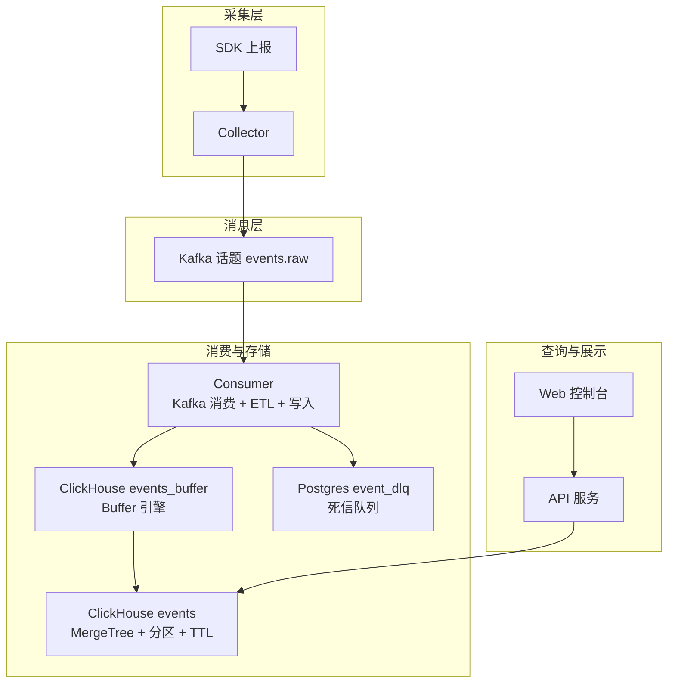
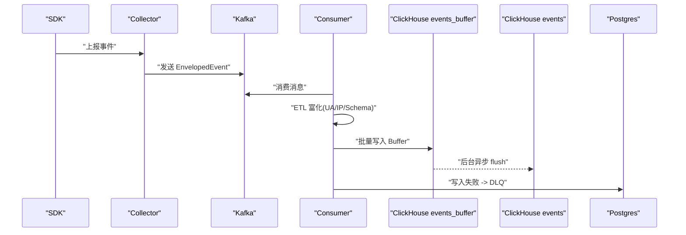
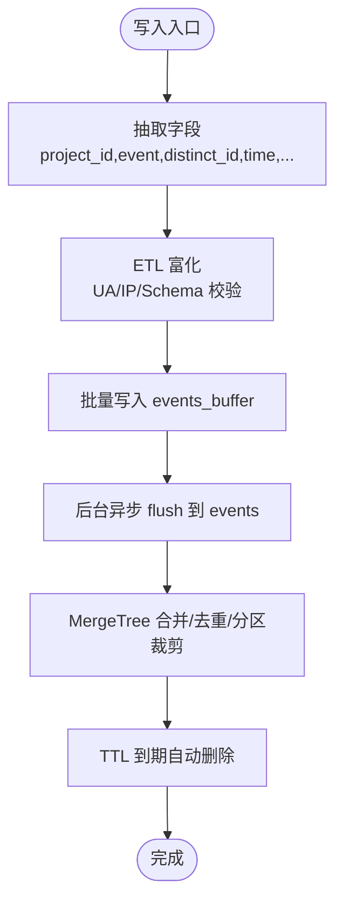
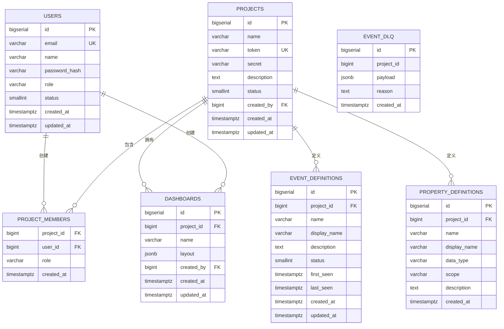
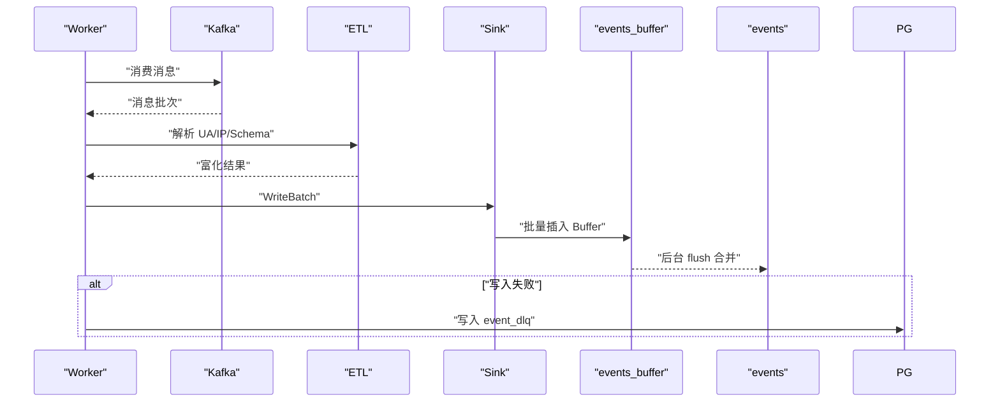
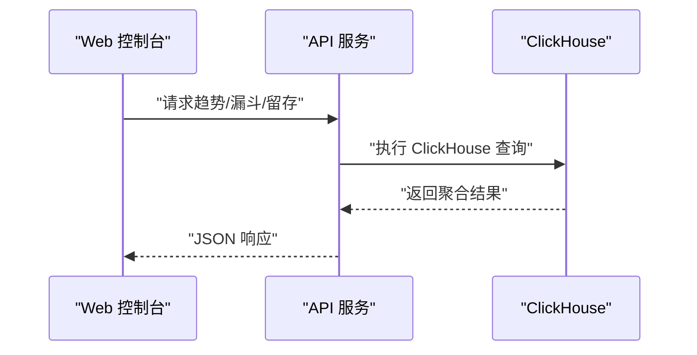
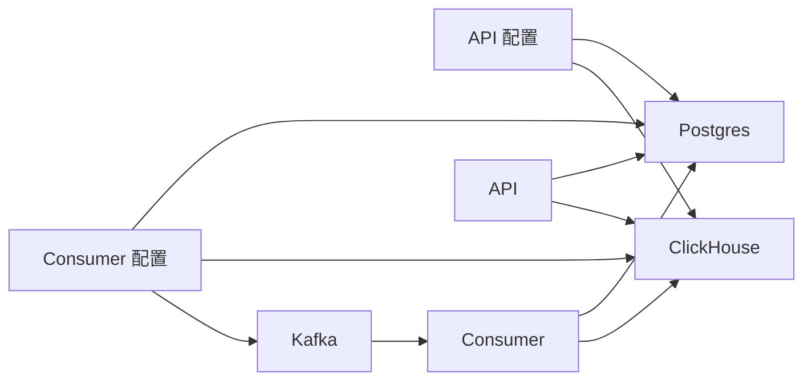

# 存储架构

<cite>
**本文引用的文件**
- [deploy/init/clickhouse/01_schema.sql](file://deploy/init/clickhouse/01_schema.sql)
- [deploy/init/postgres/01_schema.sql](file://deploy/init/postgres/01_schema.sql)
- [server/consumer/internal/chsink/sink.go](file://server/consumer/internal/chsink/sink.go)
- [server/consumer/internal/worker/worker.go](file://server/consumer/internal/worker/worker.go)
- [server/consumer/internal/etl/etl.go](file://server/consumer/internal/etl/etl.go)
- [server/consumer/internal/config/config.go](file://server/consumer/internal/config/config.go)
- [server/api/internal/config/config.go](file://server/api/internal/config/config.go)
- [server/pkg/model/event.go](file://server/pkg/model/event.go)
- [server/api/internal/handler/analytics.go](file://server/api/internal/handler/analytics.go)
- [deploy/docker-compose.yml](file://deploy/docker-compose.yml)
- [docs/architecture.md](file://docs/architecture.md)
</cite>

## 目录
1. [简介](#简介)
2. [项目结构](#项目结构)
3. [核心组件](#核心组件)
4. [架构总览](#架构总览)
5. [详细组件分析](#详细组件分析)
6. [依赖分析](#依赖分析)
7. [性能考虑](#性能考虑)
8. [故障排查指南](#故障排查指南)
9. [结论](#结论)
10. [附录](#附录)

## 简介
本文件系统化阐述 AeroLog 的混合存储架构：以 ClickHouse 承载海量事件明细与 OLAP 分析，以 PostgreSQL 承载业务元数据与死信队列。文档重点包括：
- ClickHouse 表结构设计、分区与 TTL 策略、Buffer 引擎与写入路径
- PostgreSQL 元数据表设计与角色边界
- 数据模型的规范化与反规范化权衡
- 数据生命周期管理（保留、归档、清理）
- 存储架构图与表关系图，帮助开发者快速理解设计思路

## 项目结构
围绕存储的关键目录与文件如下：
- ClickHouse 初始化脚本：定义 aerolog 数据库、事件明细表、用户属性表与 Buffer 表
- PostgreSQL 初始化脚本：定义用户、项目、成员、事件/属性元数据、看板与死信队列表
- Consumer 写入链路：Kafka 消费、ETL 富化、批量写入 ClickHouse Buffer、失败落 DLQ
- API 查询链路：通过 ClickHouse 执行趋势、漏斗、留存等分析查询
- 配置与部署：环境变量驱动的连接参数与 docker-compose 编排

图表来源
- [docs/architecture.md](file://docs/architecture.md)
- [deploy/docker-compose.yml](file://deploy/docker-compose.yml)
- [server/consumer/internal/chsink/sink.go](file://server/consumer/internal/chsink/sink.go)
- [server/consumer/internal/worker/worker.go](file://server/consumer/internal/worker/worker.go)
- [deploy/init/clickhouse/01_schema.sql](file://deploy/init/clickhouse/01_schema.sql)
- [deploy/init/postgres/01_schema.sql](file://deploy/init/postgres/01_schema.sql)

章节来源
- [docs/architecture.md](file://docs/architecture.md)
- [deploy/docker-compose.yml](file://deploy/docker-compose.yml)

## 核心组件
- ClickHouse 事件明细表 aerolog.events：列式存储、按项目+月份分区、TTL 365 天、主键排序支持高效聚合
- ClickHouse Buffer 表 aerolog.events_buffer：异步批量写入缓冲，降低写入延迟与放大
- PostgreSQL 元数据表：用户、项目、成员、事件/属性定义、看板、死信队列
- Consumer：Kafka 消费者、批处理、ETL（UA/IP 解析）、写入 ClickHouse、失败落 DLQ
- API：面向前端的分析接口，直接查询 ClickHouse

章节来源
- [deploy/init/clickhouse/01_schema.sql](file://deploy/init/clickhouse/01_schema.sql)
- [deploy/init/postgres/01_schema.sql](file://deploy/init/postgres/01_schema.sql)
- [server/consumer/internal/chsink/sink.go](file://server/consumer/internal/chsink/sink.go)
- [server/consumer/internal/worker/worker.go](file://server/consumer/internal/worker/worker.go)
- [server/api/internal/handler/analytics.go](file://server/api/internal/handler/analytics.go)

## 架构总览
混合存储策略的核心思想：
- OLTP/明细写入：Kafka → Consumer → ClickHouse Buffer → ClickHouse MergeTree（异步合并）
- OLAP 查询：API 直连 ClickHouse 执行趋势、漏斗、留存等分析
- 元数据与控制面：PostgreSQL 存储项目、用户、权限、事件/属性定义、看板与 DLQ

图表来源
- [server/consumer/internal/worker/worker.go](file://server/consumer/internal/worker/worker.go)
- [server/consumer/internal/chsink/sink.go](file://server/consumer/internal/chsink/sink.go)
- [server/consumer/internal/etl/etl.go](file://server/consumer/internal/etl/etl.go)
- [deploy/init/clickhouse/01_schema.sql](file://deploy/init/clickhouse/01_schema.sql)
- [deploy/init/postgres/01_schema.sql](file://deploy/init/postgres/01_schema.sql)

## 详细组件分析

### ClickHouse 表结构与分区策略
- aerolog.events（事件明细）
  - 存储字段：项目标识、事件名、匿名/登录用户标识、时间戳、设备/系统/浏览器等上下文、地理信息、原始属性 JSON、接收时间
  - 引擎：MergeTree
  - 分区：按 (project_id, toYYYYMM(date))，按月分区，利于按项目与时间裁剪扫描
  - 排序：ORDER BY (project_id, event, time, distinct_id)，有利于多维分组与窗口函数
  - TTL：date + INTERVAL 365 DAY，自动清理过期数据
  - 设置：index_granularity = 8192，折中压缩比与查询性能
- aerolog.events_buffer（Buffer 引擎）
  - 作用：作为异步入库缓冲，提升写入吞吐与延迟稳定性
  - 参数：最小/最大刷新间隔、行数阈值、字节数阈值，平衡延迟与吞吐
- aerolog.users（用户属性）
  - 引擎：ReplacingMergeTree(updated_at)，按最新更新覆盖旧值
  - 用途：profile_set 等用户属性的最新值管理

图表来源
- [deploy/init/clickhouse/01_schema.sql](file://deploy/init/clickhouse/01_schema.sql)
- [server/consumer/internal/chsink/sink.go](file://server/consumer/internal/chsink/sink.go)
- [server/consumer/internal/etl/etl.go](file://server/consumer/internal/etl/etl.go)

章节来源
- [deploy/init/clickhouse/01_schema.sql](file://deploy/init/clickhouse/01_schema.sql)
- [server/consumer/internal/chsink/sink.go](file://server/consumer/internal/chsink/sink.go)
- [server/consumer/internal/etl/etl.go](file://server/consumer/internal/etl/etl.go)

### PostgreSQL 元数据表与角色边界
- 用户表 users：邮箱唯一、角色与状态、密码哈希、时间戳
- 项目表 projects：名称、令牌与密钥（用于鉴权与签名）、状态、创建人
- 项目成员表 project_members：项目-用户多对多、角色（拥有者/编辑者/观察者）
- 事件元数据 event_definitions：事件名、显示名、状态、首次/最后出现时间
- 属性元数据 property_definitions：属性名、显示名、数据类型、作用域（事件/用户）
- 看板 dashboards：布局 JSON、创建人
- 死信队列表 event_dlq：消费失败的事件载荷与原因、时间戳
- 设计原则：仅存放“元数据”与“控制面”，事件明细全部由 ClickHouse 承担

图表来源
- [deploy/init/postgres/01_schema.sql](file://deploy/init/postgres/01_schema.sql)

章节来源
- [deploy/init/postgres/01_schema.sql](file://deploy/init/postgres/01_schema.sql)

### 数据模型：规范化与反规范化
- 规范化（PostgreSQL）：用户、项目、成员、事件/属性定义、看板等强约束、外键关系清晰，便于权限与治理
- 反规范化（ClickHouse）：事件明细表内嵌高频维度（如 lib/os/browser/screen 等）与原始属性 JSON，减少 JOIN 与跨表扫描，提升 OLAP 查询效率
- 权衡点：ClickHouse 以查询性能优先，PostgreSQL 以一致性与治理优先；二者职责清晰，避免互相干扰

章节来源
- [deploy/init/clickhouse/01_schema.sql](file://deploy/init/clickhouse/01_schema.sql)
- [deploy/init/postgres/01_schema.sql](file://deploy/init/postgres/01_schema.sql)

### 数据生命周期管理
- 保留策略：ClickHouse 事件表 TTL 365 天，到期自动删除
- 归档机制：当前未见显式归档流程；建议在更高规模时引入物化视图/分区归档或外部对象存储
- 清理流程：Consumer 写入失败自动落 Postgres DLQ，便于离线排查与重放
- 配置项：Consumer 批大小与批间隔、ClickHouse Buffer 参数、Kafka 组 ID 等均来自环境变量，便于运维调优

章节来源
- [deploy/init/clickhouse/01_schema.sql](file://deploy/init/clickhouse/01_schema.sql)
- [server/consumer/internal/worker/worker.go](file://server/consumer/internal/worker/worker.go)
- [server/consumer/internal/config/config.go](file://server/consumer/internal/config/config.go)

### 写入链路与 ETL
- SDK → Collector → Kafka → Consumer → ClickHouse Buffer → ClickHouse
- ETL：UA 解析（极简正则）、IP 地理解析（占位，建议接入 ip2region/MaxMind）
- 写入：批量 PrepareBatch，字段映射与默认值处理，异常写入 DLQ

图表来源
- [server/consumer/internal/worker/worker.go](file://server/consumer/internal/worker/worker.go)
- [server/consumer/internal/etl/etl.go](file://server/consumer/internal/etl/etl.go)
- [server/consumer/internal/chsink/sink.go](file://server/consumer/internal/chsink/sink.go)
- [deploy/init/postgres/01_schema.sql](file://deploy/init/postgres/01_schema.sql)

章节来源
- [server/consumer/internal/worker/worker.go](file://server/consumer/internal/worker/worker.go)
- [server/consumer/internal/etl/etl.go](file://server/consumer/internal/etl/etl.go)
- [server/consumer/internal/chsink/sink.go](file://server/consumer/internal/chsink/sink.go)

### 查询链路与分析接口
- API 直连 ClickHouse 执行趋势、Top 事件、漏斗、留存等分析
- 查询参数：项目 ID、事件名、起止时间、粒度（小时/天）、窗口秒数等
- 返回格式：聚合结果，前端渲染可视化

图表来源
- [server/api/internal/handler/analytics.go](file://server/api/internal/handler/analytics.go)
- [server/api/internal/config/config.go](file://server/api/internal/config/config.go)

章节来源
- [server/api/internal/handler/analytics.go](file://server/api/internal/handler/analytics.go)
- [server/api/internal/config/config.go](file://server/api/internal/config/config.go)

## 依赖分析
- Consumer 依赖 Kafka（消息源）、ClickHouse（写入目标）、Postgres（DLQ）
- API 依赖 ClickHouse（查询）、Postgres（元数据）
- 配置通过环境变量注入，便于容器化与多环境部署

图表来源
- [server/consumer/internal/config/config.go](file://server/consumer/internal/config/config.go)
- [server/api/internal/config/config.go](file://server/api/internal/config/config.go)
- [deploy/docker-compose.yml](file://deploy/docker-compose.yml)

章节来源
- [server/consumer/internal/config/config.go](file://server/consumer/internal/config/config.go)
- [server/api/internal/config/config.go](file://server/api/internal/config/config.go)
- [deploy/docker-compose.yml](file://deploy/docker-compose.yml)

## 性能考虑
- ClickHouse
  - MergeTree + 分区 + TTL：按项目+月份分区，减少扫描范围；TTL 自动清理，降低冷数据膨胀
  - Buffer 引擎：异步批量写入，显著降低写入延迟与放大
  - index_granularity：折中压缩比与查询性能
- ETL
  - UA/IP 解析为极简实现，生产建议接入专业解析库与 IP 库
- Consumer
  - 批大小与批间隔可调，结合 QPS 与资源进行压测调优
  - 写入超时与 DLQ 保障数据不丢
- API
  - 查询需合理利用分区裁剪与排序键，避免全表扫描

## 故障排查指南
- 写入失败
  - 现象：Consumer 报错并写入 DLQ
  - 处理：检查 Kafka 连通性、ClickHouse 写入权限、ETL 字段合法性
- 查询异常
  - 现象：API 返回错误或慢查询
  - 处理：确认时间范围、事件名、粒度参数是否合理；检查 ClickHouse 分区裁剪是否生效
- 元数据问题
  - 现象：项目/成员/事件定义异常
  - 处理：检查 PostgreSQL 对应表的数据与外键关系

章节来源
- [server/consumer/internal/worker/worker.go](file://server/consumer/internal/worker/worker.go)
- [server/api/internal/handler/analytics.go](file://server/api/internal/handler/analytics.go)
- [deploy/init/postgres/01_schema.sql](file://deploy/init/postgres/01_schema.sql)

## 结论
AeroLog 的存储架构以“明细写入 ClickHouse + 元数据存 Postgres”为核心，兼顾高吞吐写入与强治理能力。ClickHouse 的分区、TTL 与 Buffer 引擎有效支撑了海量事件的 OLAP 分析；PostgreSQL 的元数据模型保证了权限与定义的可控性。通过合理的批处理与 ETL 设计，系统在 MVP 阶段即可满足千万级事件/日的分析需求。

## 附录
- 环境变量与默认值
  - Consumer：Kafka 地址、主题、组 ID、ClickHouse 连接、Postgres DSN、批大小、批间隔
  - API：监听地址、Postgres DSN、ClickHouse 连接、JWT Secret、CORS 允许域名
- 部署编排：docker-compose 启动 PostgreSQL、Redpanda/Kafka、ClickHouse、MinIO、Prometheus、Grafana

章节来源
- [server/consumer/internal/config/config.go](file://server/consumer/internal/config/config.go)
- [server/api/internal/config/config.go](file://server/api/internal/config/config.go)
- [deploy/docker-compose.yml](file://deploy/docker-compose.yml)