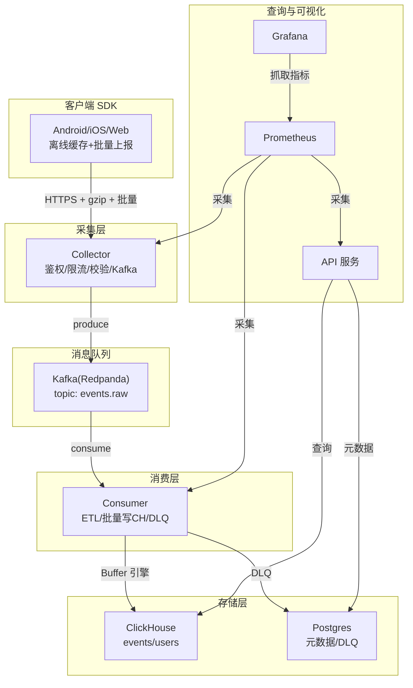
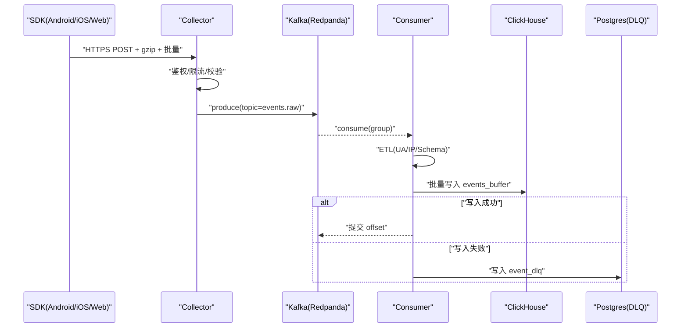
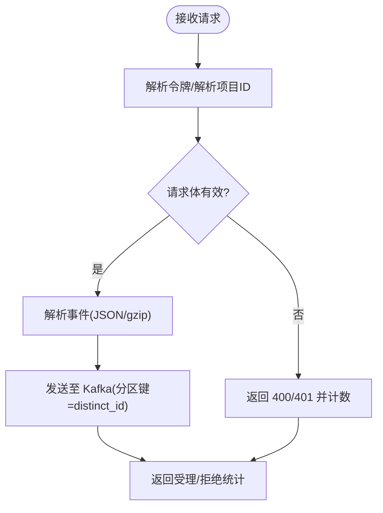
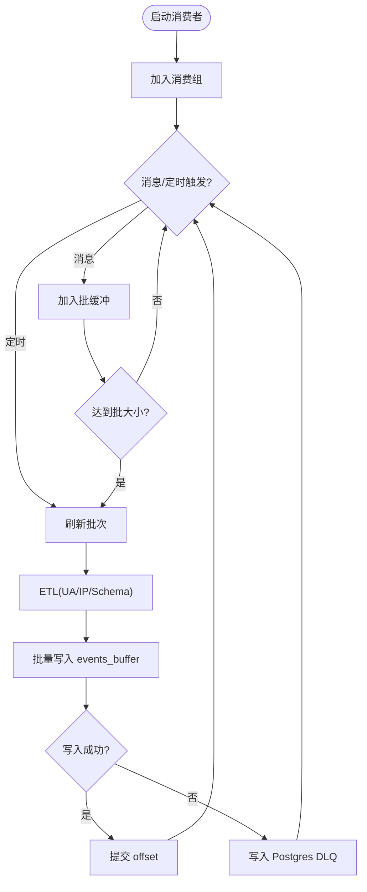
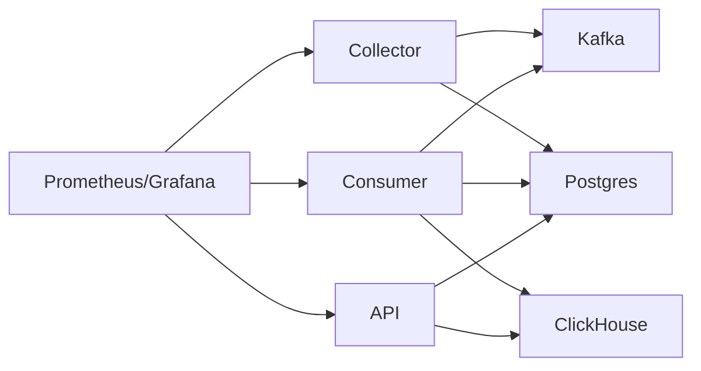

# 容量规划

<cite>
**本文引用的文件**
- [README.md](file://README.md)
- [架构文档](file://docs/architecture.md)
- [docker-compose.yml](file://deploy/docker-compose.yml)
- [Prometheus 配置](file://deploy/prometheus/prometheus.yml)
- [Grafana 面板](file://deploy/grafana/dashboards/aerolog-overview.json)
- [Postgres 初始化脚本](file://deploy/init/postgres/01_schema.sql)
- [ClickHouse 初始化脚本](file://deploy/init/clickhouse/01_schema.sql)
- [Collector 入口](file://server/collector/cmd/main.go)
- [Collector 配置](file://server/collector/internal/config/config.go)
- [Collector 处理器](file://server/collector/internal/handler/track.go)
- [Consumer 入口](file://server/consumer/cmd/main.go)
- [Consumer 配置](file://server/consumer/internal/config/config.go)
- [Consumer 工作器](file://server/consumer/internal/worker/worker.go)
- [Consumer Sink](file://server/consumer/internal/chsink/sink.go)
- [Consumer ETL](file://server/consumer/internal/etl/etl.go)
- [API 入口](file://server/api/cmd/main.go)
- [API 配置](file://server/api/internal/config/config.go)
- [指标工具](file://server/pkg/metrics/metrics.go)
</cite>

## 目录
1. [简介](#简介)
2. [项目结构](#项目结构)
3. [核心组件](#核心组件)
4. [架构总览](#架构总览)
5. [详细组件分析](#详细组件分析)
6. [依赖分析](#依赖分析)
7. [性能考量与容量评估](#性能考量与容量评估)
8. [故障排查指南](#故障排查指南)
9. [结论](#结论)
10. [附录](#附录)

## 简介
本文件面向运维与容量规划工程师，围绕 AeroLog 的三种典型部署规模（MVP 单机、中规模集群、大规模分布式）给出系统配置、扩展性设计、性能指标与监控阈值建议。重点覆盖以下方面：
- Collector 的水平扩展与 Kafka 分区策略
- Consumer 的并行处理与死信队列（DLQ）
- ClickHouse 的分布式部署与 Buffer 引擎
- 性能基准与容量评估方法
- 监控指标与告警阈值

## 项目结构
AeroLog 采用“采集-消息队列-消费-存储”的分层架构，核心组件如下：
- SDK：Android/iOS/Web 三端上报，支持离线缓存与批量压缩上报
- Collector：高并发接收层，负责鉴权、限流、Schema 校验与写入 Kafka
- Kafka（Redpanda）：事件主题 events.raw，支持分区与副本
- Consumer：Kafka 消费者，进行 ETL（UA/IP 解析）、批量写入 ClickHouse，并将失败事件写入 Postgres DLQ
- ClickHouse：事件明细与用户属性存储，使用 Buffer 引擎提升写入吞吐
- Postgres：元数据与 DLQ 存储
- API：查询与管理接口，基于 ClickHouse 与 Postgres
- Grafana/Prometheus：统一观测与可视化

图表来源
- [架构文档](file://docs/architecture.md)
- [docker-compose.yml](file://deploy/docker-compose.yml)
- [Collector 处理器](file://server/collector/internal/handler/track.go)
- [Consumer 工作器](file://server/consumer/internal/worker/worker.go)
- [Consumer Sink](file://server/consumer/internal/chsink/sink.go)
- [API 入口](file://server/api/cmd/main.go)
- [Prometheus 配置](file://deploy/prometheus/prometheus.yml)

章节来源
- [README.md:1-50](file://README.md#L1-L50)
- [架构文档:1-53](file://docs/architecture.md#L1-L53)
- [docker-compose.yml:1-147](file://deploy/docker-compose.yml#L1-L147)

## 核心组件
- Collector：HTTP 接口接收事件，鉴权与限流，校验后投递到 Kafka；暴露独立指标端口，支持 p99 延迟与拒绝率等关键指标
- Consumer：Kafka 消费组，按批次与超时触发刷新，批量写入 ClickHouse 的 Buffer 表，异常写入进入 DLQ；支持死信队列落盘
- ClickHouse：事件明细表按 project_id + 月分区，Buffer 引擎异步刷写，TTL 控制保留期；用户属性表 ReplacingMergeTree 支持最新值覆盖
- Postgres：存储项目、用户、事件/属性定义、看板与 DLQ；初始化脚本包含默认管理员账户
- API：提供项目/事件定义与分析查询接口，连接 ClickHouse 与 Postgres
- 观测：Prometheus 拉取各服务指标，Grafana 面板展示 QPS、延迟、Kafka lag、CH 写入耗时、DLQ 速率等

章节来源
- [Collector 入口:1-74](file://server/collector/cmd/main.go#L1-L74)
- [Collector 配置:1-38](file://server/collector/internal/config/config.go#L1-L38)
- [Collector 处理器:1-211](file://server/collector/internal/handler/track.go#L1-L211)
- [Consumer 入口:1-55](file://server/consumer/cmd/main.go#L1-L55)
- [Consumer 配置:1-53](file://server/consumer/internal/config/config.go#L1-L53)
- [Consumer 工作器:1-173](file://server/consumer/internal/worker/worker.go#L1-L173)
- [Consumer Sink:1-126](file://server/consumer/internal/chsink/sink.go#L1-L126)
- [ClickHouse 初始化脚本:1-61](file://deploy/init/clickhouse/01_schema.sql#L1-L61)
- [Postgres 初始化脚本:1-92](file://deploy/init/postgres/01_schema.sql#L1-L92)
- [API 入口:1-121](file://server/api/cmd/main.go#L1-L121)
- [API 配置:1-46](file://server/api/internal/config/config.go#L1-L46)
- [指标工具:1-81](file://server/pkg/metrics/metrics.go#L1-L81)

## 架构总览
AeroLog 的数据通路由 SDK 发起，经 Collector 写入 Kafka，再由 Consumer 消费并写入 ClickHouse，同时将失败事件写入 Postgres DLQ；API 服务用于查询与管理。

图表来源
- [架构文档](file://docs/architecture.md)
- [Collector 处理器:60-133](file://server/collector/internal/handler/track.go#L60-L133)
- [Consumer 工作器:92-154](file://server/consumer/internal/worker/worker.go#L92-L154)
- [Consumer Sink:46-103](file://server/consumer/internal/chsink/sink.go#L46-L103)

## 详细组件分析

### Collector 组件
- 功能要点
  - 鉴权：通过项目令牌解析项目 ID
  - 限流与校验：最大请求体限制、事件格式校验
  - 写入 Kafka：按 distinct_id 作为分区键，确保同一用户事件落在同一分区，利于后续去重与顺序处理
  - 指标：请求耗时、事件接收总数（含拒绝）、Kafka 写入错误计数
- 扩展性
  - 无状态设计，支持横向扩展
  - Kafka 分区数决定最大并发写入能力；建议按峰值 QPS 与分区副本数综合评估
- 关键配置
  - 监听地址、指标端口、Kafka 地址与 Topic、Postgres DSN、Redis 地址、最大请求体

图表来源
- [Collector 处理器:60-133](file://server/collector/internal/handler/track.go#L60-L133)
- [Collector 配置:19-30](file://server/collector/internal/config/config.go#L19-L30)

章节来源
- [Collector 入口:22-73](file://server/collector/cmd/main.go#L22-L73)
- [Collector 配置:1-38](file://server/collector/internal/config/config.go#L1-L38)
- [Collector 处理器:1-211](file://server/collector/internal/handler/track.go#L1-L211)

### Consumer 组件
- 功能要点
  - Kafka 消费组：按 Topic 订阅，使用范围分配策略
  - 批处理：按 batchSize 或 batchMs 触发刷新
  - ETL：解析 UA、地理信息（占位，建议接入 IP 库）
  - 写入 ClickHouse：通过 Buffer 引擎异步写入 events_buffer，后台自动刷写至 events
  - DLQ：写入失败的事件写入 Postgres event_dlq
- 并行处理
  - 消费组内分区数决定并发消费者数量上限
  - Sink 连接池：最大连接数、空闲连接、生命周期控制
- 关键配置
  - Kafka 地址/Topic/GroupID、ClickHouse 连接参数、Postgres DSN、批大小与批间隔、指标端口

图表来源
- [Consumer 工作器:92-154](file://server/consumer/internal/worker/worker.go#L92-L154)
- [Consumer Sink:46-103](file://server/consumer/internal/chsink/sink.go#L46-L103)
- [Consumer 配置:29-44](file://server/consumer/internal/config/config.go#L29-L44)

章节来源
- [Consumer 入口:18-54](file://server/consumer/cmd/main.go#L18-L54)
- [Consumer 配置:1-53](file://server/consumer/internal/config/config.go#L1-L53)
- [Consumer 工作器:1-173](file://server/consumer/internal/worker/worker.go#L1-L173)
- [Consumer Sink:1-126](file://server/consumer/internal/chsink/sink.go#L1-L126)
- [Consumer ETL:1-90](file://server/consumer/internal/etl/etl.go#L1-L90)

### ClickHouse 存储模型
- 事件明细表 events：MergeTree 引擎，按 (project_id, toYYYYMM(date)) 分区，TTL 365 天，index_granularity = 8192
- Buffer 表 events_buffer：Buffer 引擎，异步刷写策略（最小/最大刷新时间、行数、字节数）
- 用户属性表 users：ReplacingMergeTree，按 (project_id, distinct_id) 排序，支持最新值覆盖
- 建议
  - Buffer 参数需结合写入 QPS 与延迟目标调优
  - 分区键选择 project_id + 月，有利于按项目与时间裁剪查询

章节来源
- [ClickHouse 初始化脚本:1-61](file://deploy/init/clickhouse/01_schema.sql#L1-L61)

### Postgres 元数据与 DLQ
- 元数据：项目、用户、事件/属性定义、看板
- DLQ：event_dlq 表，记录消费失败的事件与原因
- 初始化脚本包含默认管理员账户，建议上线后立即修改

章节来源
- [Postgres 初始化脚本:1-92](file://deploy/init/postgres/01_schema.sql#L1-L92)

### API 服务
- 提供项目、事件定义与分析查询接口，连接 ClickHouse 与 Postgres
- 暴露独立指标端口，记录请求耗时与总量

章节来源
- [API 入口:35-78](file://server/api/cmd/main.go#L35-L78)
- [API 配置:1-46](file://server/api/internal/config/config.go#L1-L46)

## 依赖分析
- 组件耦合
  - Collector 依赖 Kafka Producer 与 Postgres 缓存（项目令牌解析）
  - Consumer 依赖 Kafka 消费组、ClickHouse Buffer 与 Postgres DLQ
  - API 依赖 ClickHouse 与 Postgres
- 外部依赖
  - Redpanda（Kafka 协议兼容）
  - ClickHouse、Postgres、MinIO（可选）
  - Prometheus/Grafana

图表来源
- [架构文档](file://docs/architecture.md)
- [Prometheus 配置:10-28](file://deploy/prometheus/prometheus.yml#L10-L28)

章节来源
- [Prometheus 配置:1-32](file://deploy/prometheus/prometheus.yml#L1-L32)
- [Grafana 面板:1-131](file://deploy/grafana/dashboards/aerolog-overview.json#L1-L131)

## 性能考量与容量评估

### 规模划分与部署策略
- MVP 单机（开发/演示）
  - 所有组件运行于单机 Docker Compose，承载约 1000 QPS 与千万级事件/日
  - 建议资源：CPU 2-4 核、内存 8-16 GB、磁盘 100GB+（含日志与 TSDB）
- 中规模集群
  - Collector 水平扩展；Kafka 3 节点；ClickHouse 单副本；Postgres 主从
  - 建议资源：CPU 8-16 核、内存 32-64 GB、SSD 存储、网络带宽满足峰值写入
- 大规模分布式
  - Consumer 按 project 分组消费；ClickHouse 分布式表 + ReplicatedMergeTree；引入 Flink 实时聚合
  - 建议资源：CPU 32+ 核、内存 128GB+、NVMe 存储、跨机房部署

章节来源
- [架构文档:37-47](file://docs/architecture.md#L37-L47)

### Collector 水平扩展与 Kafka 分区
- 扩展方式
  - Collector 无状态，可直接增加实例数
  - Kafka 分区数决定最大并发写入能力；建议分区数 ≥ Collector 实例数 × 期望并发因子
- 分区策略
  - 使用 distinct_id 作为分区键，保障同一用户事件顺序与去重基础
- 建议
  - 为每个项目预留足够分区；根据峰值 QPS 与单分区吞吐估算分区总数

章节来源
- [Collector 处理器:119-122](file://server/collector/internal/handler/track.go#L119-L122)
- [Collector 配置:24-25](file://server/collector/internal/config/config.go#L24-L25)

### Consumer 并行处理与 DLQ
- 并行度
  - 消费组内分区数决定并发消费者上限；建议消费者实例数与分区数匹配
  - 批处理参数（batchSize/batchMs）影响吞吐与延迟平衡
- 写入路径
  - 通过 Buffer 引擎降低写入延迟，后台自动刷写
- DLQ
  - 写入失败事件落盘至 Postgres event_dlq，需定期巡检与重放

章节来源
- [Consumer 工作器:60-83](file://server/consumer/internal/worker/worker.go#L60-L83)
- [Consumer 工作器:92-154](file://server/consumer/internal/worker/worker.go#L92-L154)
- [Consumer Sink:46-103](file://server/consumer/internal/chsink/sink.go#L46-L103)
- [Postgres 初始化脚本:66-73](file://deploy/init/postgres/01_schema.sql#L66-L73)

### ClickHouse 分布式部署
- 单机优化
  - Buffer 引擎参数：min/max flush 时间、行数、字节数，结合写入 QPS 与 p99 目标调优
  - 分区键：project_id + 月，TTL 365 天
- 分布式扩展
  - 引入分布式表与 ReplicatedMergeTree，实现副本与高可用
  - 建议按项目维度分片，避免热点倾斜

章节来源
- [ClickHouse 初始化脚本:44-49](file://deploy/init/clickhouse/01_schema.sql#L44-L49)
- [ClickHouse 初始化脚本:38-42](file://deploy/init/clickhouse/01_schema.sql#L38-L42)

### 性能基准与容量评估方法
- 基准指标
  - QPS：采集速率、消费速率、API p99 延迟
  - 写入耗时：Consumer flush p99
  - 错误与回压：Kafka 写失败、DLQ 速率、Collector 拒绝率
- 评估步骤
  - 以 SDK 批量上报 + gzip 压缩模拟真实负载
  - 逐步提升 QPS，观察 p99 延迟与 DLQ 速率
  - 调整 Kafka 分区数、Consumer 批参数、Buffer 刷新策略
  - 对比不同规模（MVP/中规模/大规模）下的资源占用与成本
- 示例参考
  - MVP：约 1000 QPS，单机 Compose
  - 中规模：按峰值 QPS 与分区副本数估算所需 Kafka/ClickHouse/Postgres 资源
  - 大规模：引入分布式与实时聚合，按项目分片与副本策略规划

章节来源
- [架构文档:37-47](file://docs/architecture.md#L37-L47)
- [Grafana 面板:1-131](file://deploy/grafana/dashboards/aerolog-overview.json#L1-L131)

### 监控指标与阈值建议
- Collector
  - QPS：按项目维度统计受理/拒绝
  - p99 延迟：请求耗时直方图
  - Kafka 写失败：累计计数
- Consumer
  - 消费速率：按 result（ok/invalid）统计
  - flush p99：批量写入耗时直方图
  - DLQ 速率：累计计数
- API
  - p99 延迟：按路径统计
- 阈值示例
  - Collector p99 延迟 > 1s 告警
  - Consumer flush p99 > 5s 告警
  - DLQ 速率持续 > 0 告警
  - Kafka 写失败累计增长告警

章节来源
- [指标工具:18-49](file://server/pkg/metrics/metrics.go#L18-L49)
- [Grafana 面板:1-131](file://deploy/grafana/dashboards/aerolog-overview.json#L1-L131)
- [Prometheus 配置:10-28](file://deploy/prometheus/prometheus.yml#L10-L28)

## 故障排查指南
- 常见问题
  - Kafka 不可用：Collector 返回服务不可用，检查 Broker 地址与网络连通
  - 写入 ClickHouse 失败：查看 Consumer flush 耗时与 DLQ 速率，确认 Buffer 参数与 CH 连接池
  - 查询延迟高：检查 ClickHouse 分区裁剪、索引粒度与 TTL 设置
  - DLQ 积压：检查 Consumer 运行状态与 ETL 失败原因，必要时人工重放
- 排查流程
  - 采集指标：Prometheus 抓取各服务 /metrics
  - 定位瓶颈：对比 Collector/Consumer/API 的 p99 指标
  - 调参验证：调整 Kafka 分区、Consumer 批参数、Buffer 刷新策略
  - 回归测试：在隔离环境中复现并验证修复

章节来源
- [Prometheus 配置:1-32](file://deploy/prometheus/prometheus.yml#L1-L32)
- [Grafana 面板:1-131](file://deploy/grafana/dashboards/aerolog-overview.json#L1-L131)
- [Consumer 工作器:156-172](file://server/consumer/internal/worker/worker.go#L156-L172)

## 结论
AeroLog 的容量规划应以“采集-消息队列-消费-存储”全链路为视角，结合业务峰值 QPS、分区策略、批处理参数与存储引擎特性进行系统性评估。通过 Prometheus/Grafana 的持续观测与阈值告警，可在 MVP、中规模与大规模场景下实现稳定、可扩展且成本可控的运营。

## 附录

### 环境与端口清单
- Collector
  - 监听端口：默认 :8081
  - 指标端口：默认 :9101
- Consumer
  - 监听端口：默认 :9102
- API
  - 监听端口：默认 :8082
  - 指标端口：默认 :9103
- Kafka（Redpanda）
  - 客户端 API：19092
  - Admin API：9644
- ClickHouse
  - HTTP：8123
  - Native：9000
- Postgres
  - 默认 5432
- Prometheus
  - 默认 9090
- Grafana
  - 默认 3000（映射 3001）

章节来源
- [docker-compose.yml:3-147](file://deploy/docker-compose.yml#L3-L147)
- [Collector 配置:22-28](file://server/collector/internal/config/config.go#L22-L28)
- [Consumer 配置:31-44](file://server/consumer/internal/config/config.go#L31-L44)
- [API 配置:26-37](file://server/api/internal/config/config.go#L26-L37)