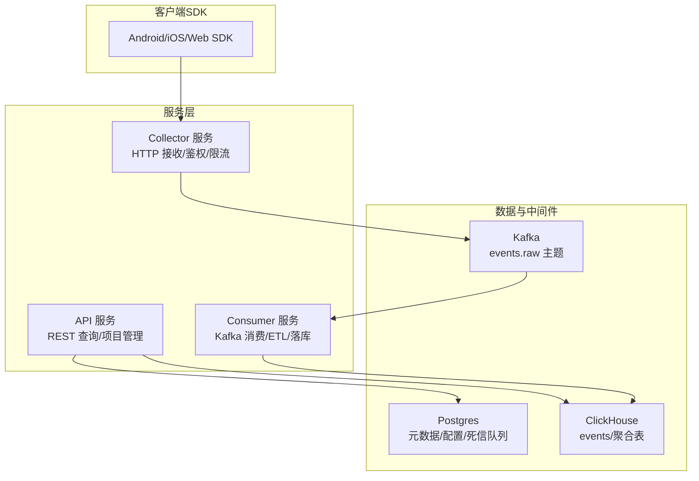
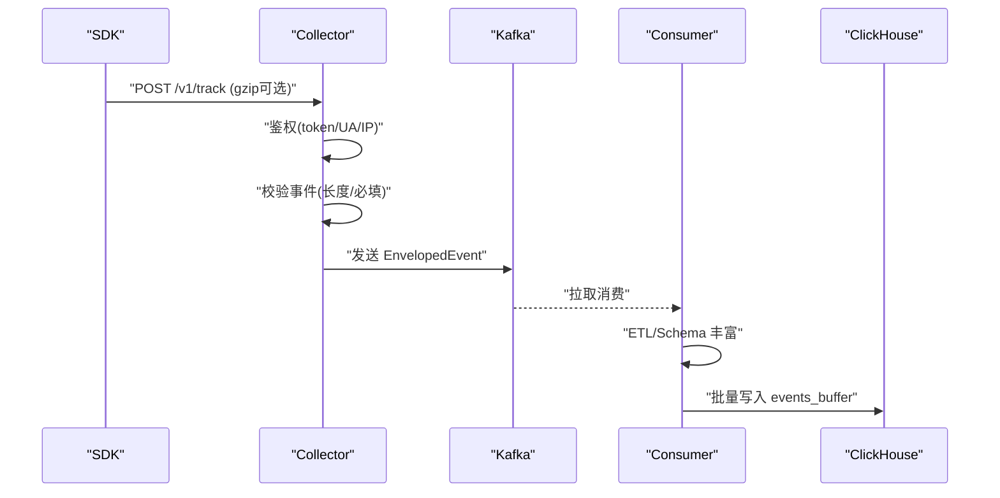
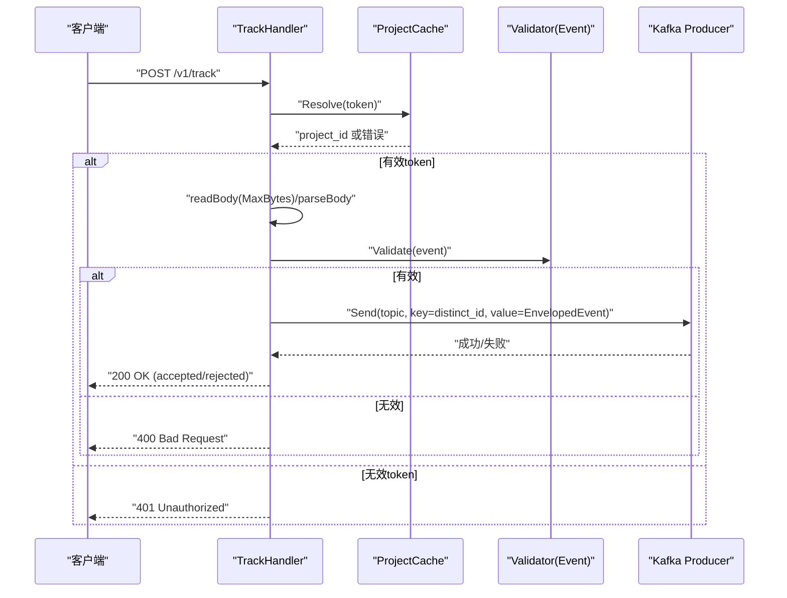
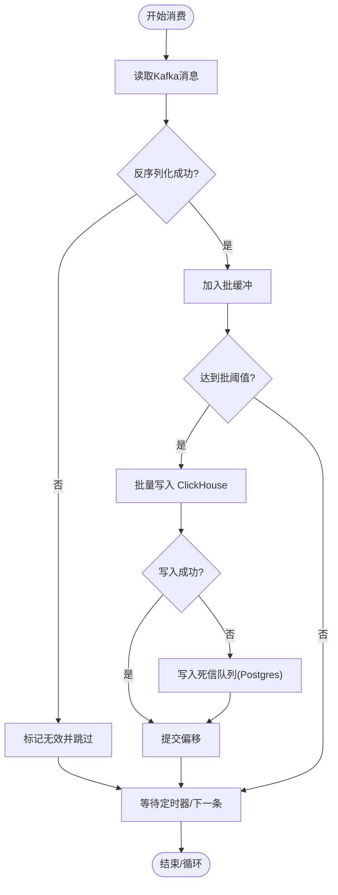
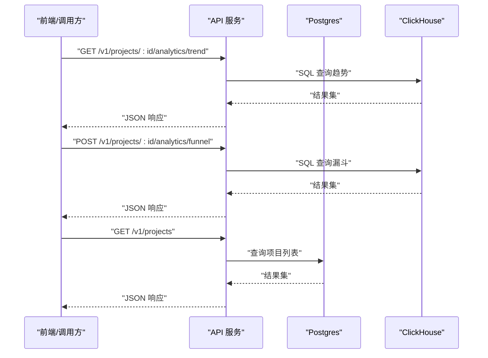
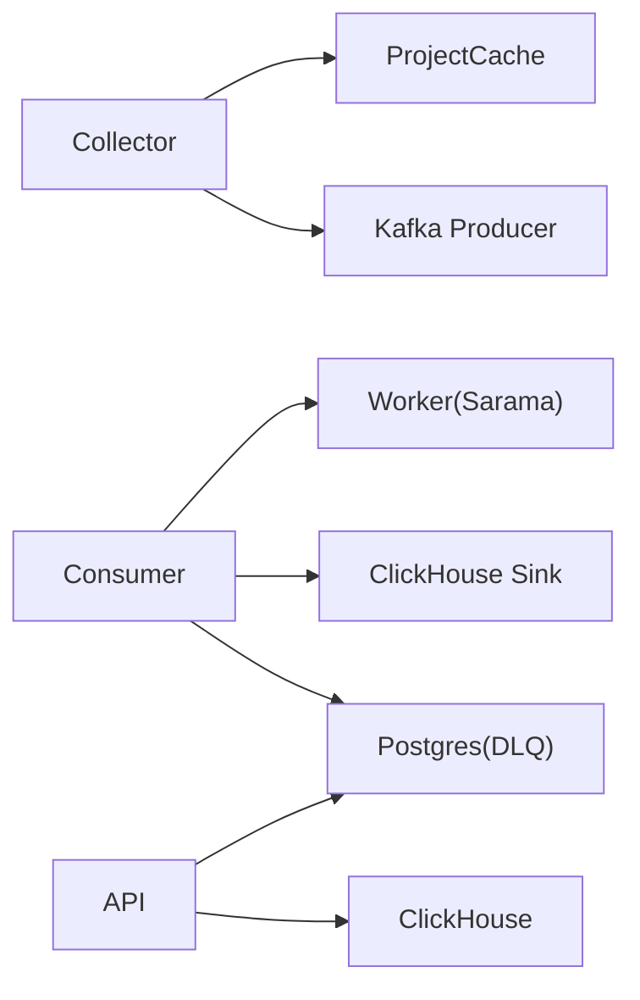

# 微服务架构

<cite>
**本文引用的文件**
- [server/collector/cmd/main.go](file://server/collector/cmd/main.go)
- [server/collector/internal/handler/track.go](file://server/collector/internal/handler/track.go)
- [server/collector/internal/config/config.go](file://server/collector/internal/config/config.go)
- [server/collector/internal/projectcache/cache.go](file://server/collector/internal/projectcache/cache.go)
- [server/consumer/cmd/main.go](file://server/consumer/cmd/main.go)
- [server/consumer/internal/config/config.go](file://server/consumer/internal/config/config.go)
- [server/consumer/internal/worker/worker.go](file://server/consumer/internal/worker/worker.go)
- [server/consumer/internal/chsink/sink.go](file://server/consumer/internal/chsink/sink.go)
- [server/consumer/internal/etl/etl.go](file://server/consumer/internal/etl/etl.go)
- [server/api/cmd/main.go](file://server/api/cmd/main.go)
- [server/api/internal/config/config.go](file://server/api/internal/config/config.go)
- [server/api/internal/handler/analytics.go](file://server/api/internal/handler/analytics.go)
- [server/api/internal/handler/project.go](file://server/api/internal/handler/project.go)
- [server/pkg/model/event.go](file://server/pkg/model/event.go)
- [server/pkg/mq/producer.go](file://server/pkg/mq/producer.go)
- [deploy/docker-compose.yml](file://deploy/docker-compose.yml)
- [deploy/init/postgres/01_schema.sql](file://deploy/init/postgres/01_schema.sql)
- [deploy/init/clickhouse/01_schema.sql](file://deploy/init/clickhouse/01_schema.sql)
- [docs/architecture.md](file://docs/architecture.md)
- [docs/protocol.md](file://docs/protocol.md)
- [docs/event.schema.json](file://docs/event.schema.json)
</cite>

## 更新摘要
**所做更改**
- 新增了完整的微服务架构设计文档，涵盖三个核心服务的详细实现
- 更新了服务间通信机制的说明，包括HTTP REST API和Kafka消息队列的使用
- 完善了无状态设计原则、水平扩展策略和故障隔离机制的描述
- 增加了详细的接口定义和服务启动流程说明
- 更新了架构图和组件交互流程图

## 目录
1. [简介](#简介)
2. [项目结构](#项目结构)
3. [核心组件](#核心组件)
4. [架构总览](#架构总览)
5. [详细组件分析](#详细组件分析)
6. [依赖分析](#依赖分析)
7. [性能考量](#性能考量)
8. [故障排查指南](#故障排查指南)
9. [结论](#结论)
10. [附录](#附录)

## 简介
本文件面向AeroLog微服务架构，系统性阐述三类核心服务的设计理念与实现细节：Collector服务负责HTTP接收、鉴权与限流；Consumer服务负责ETL处理与数据落库；API服务提供分析接口与项目管理功能。文档同时说明服务间通信方式（HTTP REST API与Kafka消息队列）、无状态设计原则、水平扩展策略与故障隔离机制，并给出架构图与接口定义，帮助开发者快速理解职责划分与协作模式。

## 项目结构
AeroLog采用多模块Go工程组织，包含三个独立的服务进程与共享包：
- Collector服务：HTTP入口，接收SDK上报事件，鉴权后投递至Kafka
- Consumer服务：Kafka消费者，批量拉取事件，执行ETL与Schema丰富，写入ClickHouse
- API服务：提供REST接口，查询分析结果与项目管理能力
- 共享包：事件模型、Kafka生产者封装、指标采集等

**图表来源**
- [server/collector/cmd/main.go:13-25](file://server/collector/cmd/main.go#L13-L25)
- [server/consumer/cmd/main.go:13-25](file://server/consumer/cmd/main.go#L13-L25)
- [server/api/cmd/main.go:13-25](file://server/api/cmd/main.go#L13-L25)

**章节来源**
- [server/collector/cmd/main.go:13-25](file://server/collector/cmd/main.go#L13-L25)
- [server/consumer/cmd/main.go:13-25](file://server/consumer/cmd/main.go#L13-L25)
- [server/api/cmd/main.go:13-25](file://server/api/cmd/main.go#L13-L25)

## 核心组件
- 事件模型与协议
  - 统一事件结构与Envelope包装，确保从Collector到Consumer的上下文完整传递
  - 支持单事件与数组两种上报格式，兼容SDK输出
- Kafka生产者封装
  - 异步批量发送、Snappy压缩、自动重试、错误异步消费，保障高吞吐与可靠性
- 项目令牌缓存
  - 基于内存LRU-like结构的token→project_id映射缓存，降低鉴权DB压力
- ETL处理
  - UA极简解析、地理信息占位解析，属性字段映射与类型转换
- ClickHouse Sink
  - 批量写入events_buffer，开启异步插入优化写入延迟

**章节来源**
- [server/pkg/model/event.go:27-83](file://server/pkg/model/event.go#L27-L83)
- [server/pkg/mq/producer.go:12-69](file://server/pkg/mq/producer.go#L12-L69)
- [server/collector/internal/projectcache/cache.go:18-57](file://server/collector/internal/projectcache/cache.go#L18-L57)
- [server/consumer/internal/etl/etl.go:9-90](file://server/consumer/internal/etl/etl.go#L9-L90)
- [server/consumer/internal/chsink/sink.go:17-126](file://server/consumer/internal/chsink/sink.go#L17-L126)

## 架构总览
AeroLog采用"HTTP入口 + 流式处理 + OLAP查询"的分层架构：
- 入口层：Collector通过HTTP接收SDK事件，完成鉴权与基本校验，投递到Kafka
- 流处理层：Consumer从Kafka消费事件，进行ETL与Schema丰富，批量写入ClickHouse
- 查询层：API服务提供REST接口，访问Postgres与ClickHouse，支撑分析报表与项目管理

**图表来源**
- [server/collector/internal/handler/track.go:60-133](file://server/collector/internal/handler/track.go#L60-L133)
- [server/pkg/mq/producer.go:42-60](file://server/pkg/mq/producer.go#L42-L60)
- [server/consumer/internal/worker/worker.go:124-153](file://server/consumer/internal/worker/worker.go#L124-L153)
- [server/consumer/internal/chsink/sink.go:46-103](file://server/consumer/internal/chsink/sink.go#L46-L103)

## 详细组件分析

### Collector服务：HTTP接收、鉴权与限流
- 设计理念
  - 无状态：仅在内存维护项目令牌缓存，不持久化会话
  - 快速失败：对非法请求立即返回错误，避免资源浪费
  - 可观测性：内置指标与健康检查端点
- 关键流程
  - 认证：优先从查询参数获取token，其次从自定义头获取；通过项目缓存解析project_id
  - 限流与安全：限制最大请求体大小，支持gzip解压
  - 数据校验：调用事件模型的Validate方法进行基础校验
  - 投递：将事件包装为EnvelopedEvent，按distinct_id作为key发送到Kafka，保证同一用户事件落在同一分区
- 错误处理
  - 鉴权失败：返回未授权响应
  - 请求体过大/格式错误：返回坏请求
  - Kafka不可用：返回服务不可用
- 指标
  - 接收事件总数（含拒绝）
  - 请求耗时直方图
  - Kafka发送失败计数

**图表来源**
- [server/collector/internal/handler/track.go:60-133](file://server/collector/internal/handler/track.go#L60-L133)
- [server/collector/internal/projectcache/cache.go:34-56](file://server/collector/internal/projectcache/cache.go#L34-L56)
- [server/pkg/model/event.go:40-60](file://server/pkg/model/event.go#L40-L60)
- [server/pkg/mq/producer.go:42-60](file://server/pkg/mq/producer.go#L42-L60)

**章节来源**
- [server/collector/internal/handler/track.go:39-133](file://server/collector/internal/handler/track.go#L39-L133)
- [server/collector/internal/config/config.go:8-30](file://server/collector/internal/config/config.go#L8-L30)
- [server/collector/internal/projectcache/cache.go:18-57](file://server/collector/internal/projectcache/cache.go#L18-L57)
- [server/pkg/model/event.go:27-83](file://server/pkg/model/event.go#L27-L83)
- [server/pkg/mq/producer.go:12-69](file://server/pkg/mq/producer.go#L12-L69)

### Consumer服务：ETL处理与数据转换
- 设计理念
  - 无状态：消费者组内水平扩展，状态由Kafka管理
  - 批处理：定时与容量双触发，提升写入效率
  - 故障隔离：写入失败进入死信队列（Postgres），不影响主流程
- 关键流程
  - 消费：基于Sarama消费者组，按分区有序消费
  - 批处理：累积到阈值或超时触发flush
  - ETL：解析UA、地理信息占位、属性字段映射与类型转换
  - 落库：批量写入ClickHouse events_buffer
  - 死信：异常批次写入event_dlq，保留payload与原因
- 指标
  - 消费消息总数（含无效）
  - 批量写入耗时直方图
  - 批大小分布
  - DLQ计数

**图表来源**
- [server/consumer/internal/worker/worker.go:92-153](file://server/consumer/internal/worker/worker.go#L92-L153)
- [server/consumer/internal/chsink/sink.go:46-103](file://server/consumer/internal/chsink/sink.go#L46-L103)
- [server/consumer/internal/etl/etl.go:29-89](file://server/consumer/internal/etl/etl.go#L29-L89)

**章节来源**
- [server/consumer/internal/config/config.go:8-44](file://server/consumer/internal/config/config.go#L8-L44)
- [server/consumer/internal/worker/worker.go:40-173](file://server/consumer/internal/worker/worker.go#L40-L173)
- [server/consumer/internal/chsink/sink.go:17-126](file://server/consumer/internal/chsink/sink.go#L17-L126)
- [server/consumer/internal/etl/etl.go:9-90](file://server/consumer/internal/etl/etl.go#L9-L90)

### API服务：分析接口与项目管理
- 设计理念
  - 无状态：路由层无会话状态，查询通过数据库连接池访问
  - 跨域：支持灵活的CORS配置
  - 指标：内置请求耗时与总量统计
- 接口定义
  - 项目管理
    - GET /v1/projects：列出项目（带分页/限制）
    - POST /v1/projects：创建项目，生成token与secret
    - GET /v1/projects/:id：获取项目详情
    - GET /v1/projects/:id/events：列出事件定义（基于元数据）
  - 分析接口
    - GET /v1/projects/:id/analytics/trend：事件趋势（支持小时/天粒度）
    - GET /v1/projects/:id/analytics/top_events：Top事件（支持时间范围与限制）
    - POST /v1/projects/:id/analytics/funnel：漏斗分析（支持窗口期）
    - GET /v1/projects/:id/analytics/retention：留存分析（按初始事件与返回事件）
- 数据源
  - 项目与事件定义：Postgres
  - 分析查询：ClickHouse

**图表来源**
- [server/api/internal/handler/analytics.go:27-304](file://server/api/internal/handler/analytics.go#L27-L304)
- [server/api/internal/handler/project.go:29-143](file://server/api/internal/handler/project.go#L29-L143)

**章节来源**
- [server/api/cmd/main.go:35-121](file://server/api/cmd/main.go#L35-L121)
- [server/api/internal/config/config.go:8-38](file://server/api/internal/config/config.go#L8-L38)
- [server/api/internal/handler/analytics.go:13-304](file://server/api/internal/handler/analytics.go#L13-L304)
- [server/api/internal/handler/project.go:24-143](file://server/api/internal/handler/project.go#L24-L143)

## 依赖分析
- 组件耦合
  - Collector依赖项目缓存与Kafka生产者，与Postgres交互仅用于鉴权
  - Consumer依赖Kafka消费者组、ClickHouse Sink与Postgres（死信队列）
  - API依赖Postgres与ClickHouse，提供只读查询
- 外部依赖
  - Kafka：事件传输通道
  - ClickHouse：OLAP存储与分析
  - Postgres：元数据与死信队列
- 配置管理
  - 通过环境变量集中配置各服务地址、主题、认证信息与指标端口

**图表来源**
- [server/collector/internal/projectcache/cache.go:18-57](file://server/collector/internal/projectcache/cache.go#L18-L57)
- [server/pkg/mq/producer.go:12-69](file://server/pkg/mq/producer.go#L12-L69)
- [server/consumer/internal/worker/worker.go:40-173](file://server/consumer/internal/worker/worker.go#L40-L173)
- [server/consumer/internal/chsink/sink.go:17-126](file://server/consumer/internal/chsink/sink.go#L17-L126)
- [server/api/cmd/main.go:35-78](file://server/api/cmd/main.go#L35-L78)

**章节来源**
- [server/collector/internal/config/config.go:8-30](file://server/collector/internal/config/config.go#L8-L30)
- [server/consumer/internal/config/config.go:8-44](file://server/consumer/internal/config/config.go#L8-L44)
- [server/api/internal/config/config.go:8-38](file://server/api/internal/config/config.go#L8-L38)

## 性能考量
- Collector
  - 使用gzip解压与最大请求体限制，防止资源滥用
  - 基于distinct_id作为Kafka key，确保同用户事件分区一致性
  - 异步Kafka生产者与批量发送，降低RT与提高吞吐
- Consumer
  - 批量写入与异步插入配置，显著降低写入延迟
  - 定时器与容量双触发，平衡延迟与吞吐
  - 死信队列保障异常隔离，避免阻塞主流程
- API
  - ClickHouse原生查询优化，结合时间过滤与聚合索引
  - CORS与指标中间件开销低，适合高并发查询

## 故障排查指南
- Collector常见问题
  - 鉴权失败：确认token是否正确且项目状态有效
  - 请求体过大：调整MaxBodyBytes或压缩上报
  - Kafka不可用：检查Broker连通性与主题权限
- Consumer常见问题
  - 写入ClickHouse失败：检查连接参数与表结构，查看DLQ内容
  - 消费停滞：确认消费者组再均衡策略与分区分配
- API常见问题
  - 查询超时：检查ClickHouse负载与索引，优化查询条件
  - CORS跨域：核对AllowOrigins配置

**章节来源**
- [server/collector/internal/handler/track.go:67-133](file://server/collector/internal/handler/track.go#L67-L133)
- [server/consumer/internal/worker/worker.go:108-112](file://server/consumer/internal/worker/worker.go#L108-L112)
- [server/api/cmd/main.go:95-121](file://server/api/cmd/main.go#L95-L121)

## 结论
AeroLog通过清晰的职责分离与可靠的数据通道，实现了从事件采集到分析查询的全链路闭环。Collector强调快速与安全，Consumer强调吞吐与稳健，API强调即席查询与可运维性。配合Kafka与OLAP数据库，整体架构具备良好的水平扩展能力与故障隔离特性。

## 附录

### 服务启动与部署要点
- Docker编排：通过Compose编排Kafka、ClickHouse、Postgres与各服务容器
- 初始化脚本：Postgres与ClickHouse初始化表结构
- 环境变量：各服务均通过环境变量注入配置

**章节来源**
- [deploy/docker-compose.yml](file://deploy/docker-compose.yml)
- [deploy/init/postgres/01_schema.sql](file://deploy/init/postgres/01_schema.sql)
- [deploy/init/clickhouse/01_schema.sql](file://deploy/init/clickhouse/01_schema.sql)

### 事件协议与数据模型
- 事件模型：统一事件结构与Envelope包装
- 协议规范：事件字段、上报格式与校验规则
- 示例：事件Schema定义

**章节来源**
- [server/pkg/model/event.go:27-83](file://server/pkg/model/event.go#L27-L83)
- [docs/protocol.md](file://docs/protocol.md)
- [docs/event.schema.json](file://docs/event.schema.json)