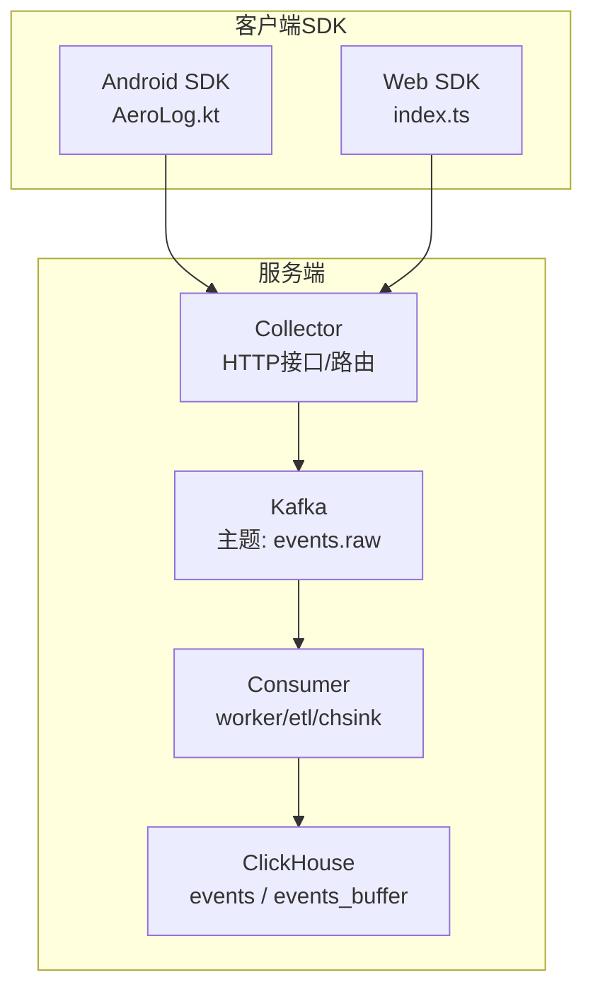
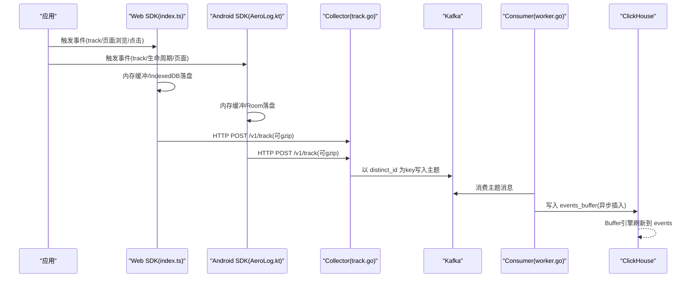
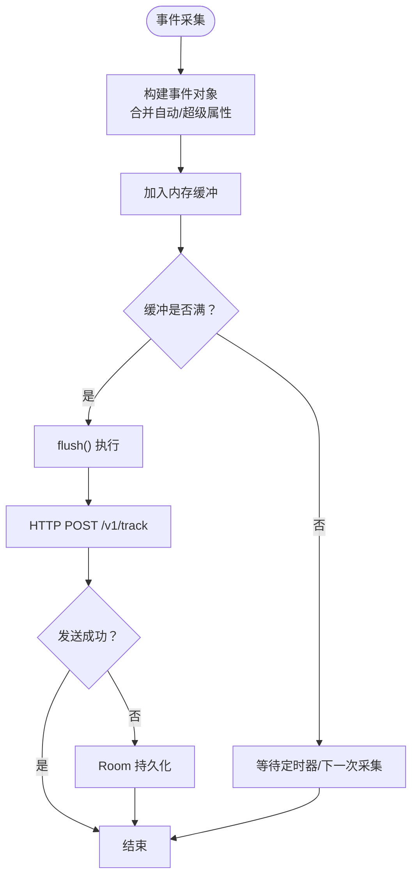
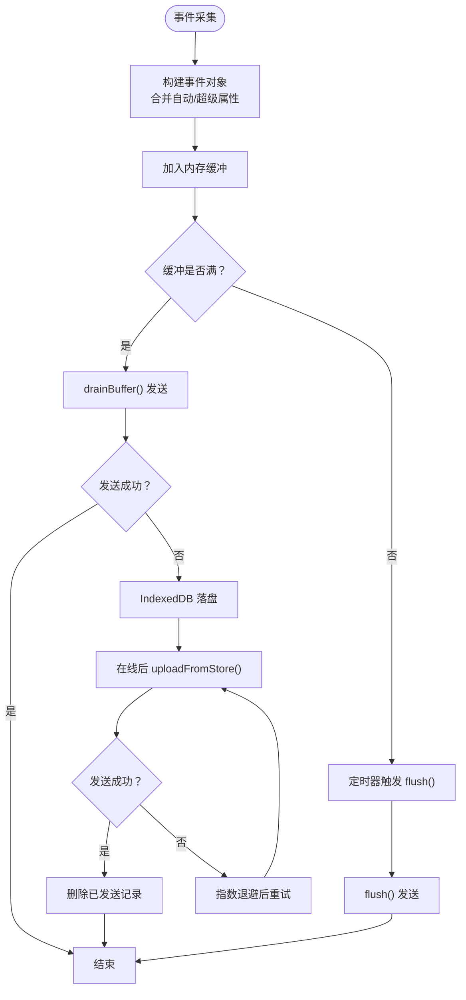
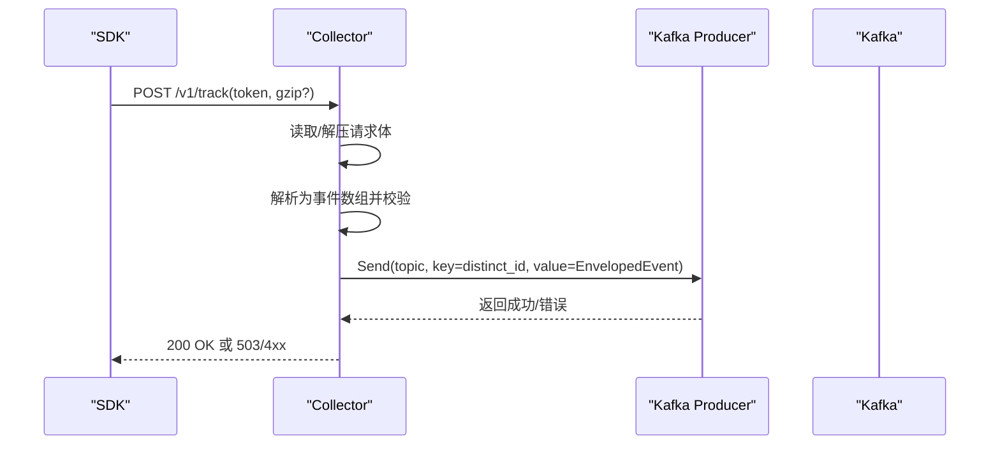
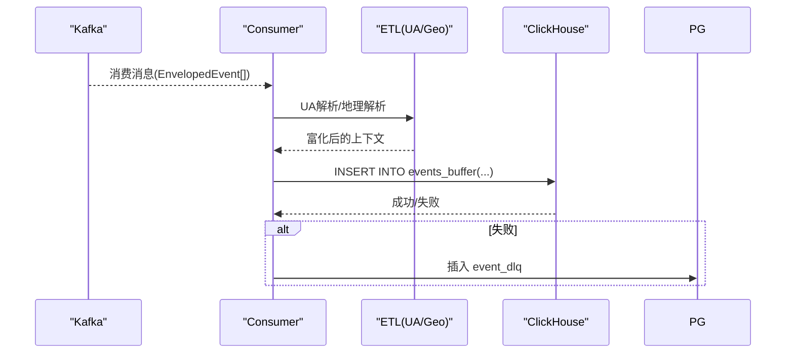
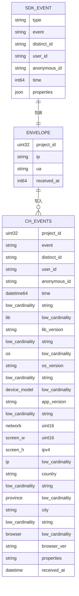
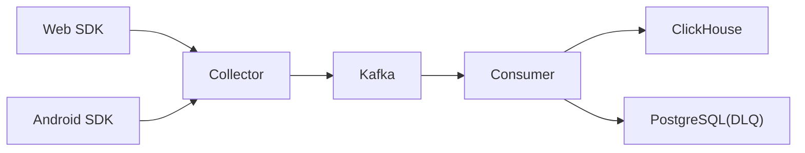

# 数据流设计

<cite>
**本文引用的文件**
- [AeroLog.kt](file://sdk/android/aerolog/src/main/java/dev/aerolog/sdk/AeroLog.kt)
- [EventDatabase.kt](file://sdk/android/aerolog/src/main/java/dev/aerolog/sdk/storage/EventDatabase.kt)
- [index.ts](file://sdk/web/src/index.ts)
- [storage.ts](file://sdk/web/src/storage.ts)
- [main.go（Collector入口）](file://server/collector/cmd/main.go)
- [track.go（Collector处理器）](file://server/collector/internal/handler/track.go)
- [config.go（Collector配置）](file://server/collector/internal/config/config.go)
- [producer.go（Kafka生产者）](file://server/pkg/mq/producer.go)
- [main.go（Consumer入口）](file://server/consumer/cmd/main.go)
- [worker.go（Consumer工作器）](file://server/consumer/internal/worker/worker.go)
- [etl.go（UA/地理解析）](file://server/consumer/internal/etl/etl.go)
- [sink.go（ClickHouse写入器）](file://server/consumer/internal/chsink/sink.go)
- [config.go（Consumer配置）](file://server/consumer/internal/config/config.go)
- [01_schema.sql（ClickHouse模式）](file://deploy/init/clickhouse/01_schema.sql)
</cite>

## 目录
1. [引言](#引言)
2. [项目结构](#项目结构)
3. [核心组件](#核心组件)
4. [架构总览](#架构总览)
5. [详细组件分析](#详细组件分析)
6. [依赖关系分析](#依赖关系分析)
7. [性能考量](#性能考量)
8. [故障排查指南](#故障排查指南)
9. [结论](#结论)
10. [附录](#附录)

## 引言
本文件系统性阐述 AeroLog 从 SDK 到最终存储的完整数据流设计，覆盖事件采集、批量压缩、网络传输、消息队列、ETL 处理与存储写入等环节。重点说明：
- 数据格式转换：从 SDK 原始事件到服务端模型，再到 ClickHouse 存储表的映射关系
- 数据去重与幂等：通过插入键与 Buffer 引擎策略保障
- 一致性与可靠性：基于 Kafka 分区键、消费者组、批量写入与 DLQ 的组合方案
- 流程可视化：提供数据流向图与时序图，帮助开发者快速理解复杂链路

## 项目结构
AeroLog 采用“多端 SDK + HTTP 收集器 + Kafka + 消费器 + ClickHouse”的分层架构。前端与移动端 SDK 负责事件采集与本地持久化，Collector 将事件入队至 Kafka，Consumer 从 Kafka 消费并进行 ETL 富化后批量写入 ClickHouse。

图表来源
- [AeroLog.kt:1-216](file://sdk/android/aerolog/src/main/java/dev/aerolog/sdk/AeroLog.kt#L1-L216)
- [index.ts:1-307](file://sdk/web/src/index.ts#L1-L307)
- [track.go:1-211](file://server/collector/internal/handler/track.go#L1-L211)
- [producer.go:1-69](file://server/pkg/mq/producer.go#L1-L69)
- [worker.go:1-173](file://server/consumer/internal/worker/worker.go#L1-L173)
- [sink.go:1-126](file://server/consumer/internal/chsink/sink.go#L1-L126)
- [01_schema.sql:1-61](file://deploy/init/clickhouse/01_schema.sql#L1-L61)

章节来源
- [main.go（Collector入口）:1-74](file://server/collector/cmd/main.go#L1-L74)
- [main.go（Consumer入口）:1-55](file://server/consumer/cmd/main.go#L1-L55)

## 核心组件
- Android SDK（AeroLog.kt）
  - 事件采集：收集用户行为、设备信息、会话标识，生成统一事件结构
  - 缓冲与落盘：内存缓冲达到阈值或定时触发，失败时写入 Room 数据库
  - 发送策略：批量 HTTP POST，支持 gzip 压缩，429 以外 4xx 视为服务端拒绝
- Web SDK（index.ts）
  - 事件采集：自动页面浏览、点击追踪，生成统一事件结构
  - 三阶段上报：内存批量 → IndexedDB 落盘 → 在线后退避重传
  - 发送策略：fetch + keepalive，429 以外 4xx 视为拒绝
- Collector（Go）
  - HTTP 接口：/v1/track 接收事件，解析 gzip，校验长度
  - Kafka 生产：以 distinct_id 作为分区键，确保同用户事件顺序一致
- Consumer（Go）
  - Kafka 消费：消费者组 + 批处理，超时/满批触发 flush
  - ETL 富化：UA 解析、地理信息占位解析
  - ClickHouse 写入：events_buffer 表，异步插入 + Buffer 引擎自动刷新
- ClickHouse 模式
  - events：主表，MergeTree 引擎，按项目+月分区，TTL 365 天
  - events_buffer：Buffer 引擎，低延迟批量写入，后台刷新到 events

章节来源
- [AeroLog.kt:1-216](file://sdk/android/aerolog/src/main/java/dev/aerolog/sdk/AeroLog.kt#L1-L216)
- [index.ts:1-307](file://sdk/web/src/index.ts#L1-L307)
- [track.go:1-211](file://server/collector/internal/handler/track.go#L1-L211)
- [producer.go:1-69](file://server/pkg/mq/producer.go#L1-L69)
- [worker.go:1-173](file://server/consumer/internal/worker/worker.go#L1-L173)
- [sink.go:1-126](file://server/consumer/internal/chsink/sink.go#L1-L126)
- [01_schema.sql:1-61](file://deploy/init/clickhouse/01_schema.sql#L1-L61)

## 架构总览
下图展示从 SDK 到 ClickHouse 的全链路数据流，包含本地持久化、网络传输、消息队列与存储写入的关键节点。

图表来源
- [index.ts:1-307](file://sdk/web/src/index.ts#L1-L307)
- [AeroLog.kt:1-216](file://sdk/android/aerolog/src/main/java/dev/aerolog/sdk/AeroLog.kt#L1-L216)
- [track.go:1-211](file://server/collector/internal/handler/track.go#L1-L211)
- [producer.go:1-69](file://server/pkg/mq/producer.go#L1-L69)
- [worker.go:1-173](file://server/consumer/internal/worker/worker.go#L1-L173)
- [sink.go:1-126](file://server/consumer/internal/chsink/sink.go#L1-L126)
- [01_schema.sql:1-61](file://deploy/init/clickhouse/01_schema.sql#L1-L61)

## 详细组件分析

### Android SDK（AeroLog.kt）
- 事件采集与属性
  - 自动属性：操作系统、版本、设备型号、应用版本、屏幕尺寸、网络类型等
  - 会话管理：UUID 会话标识，生命周期事件自动追踪
  - 超级属性：registerSuperProperties 合并到每条事件
- 缓冲与落盘
  - 内存缓冲：达到批次阈值或周期触发 flush
  - Room 落盘：超过存储上限按最早记录裁剪，保证容量可控
- 发送策略
  - 批量 POST：数组形式提交，支持 gzip
  - 错误处理：429 以外 4xx 视为拒绝，不重试；其他错误或异常则回退到持久化

图表来源
- [AeroLog.kt:82-152](file://sdk/android/aerolog/src/main/java/dev/aerolog/sdk/AeroLog.kt#L82-L152)
- [AeroLog.kt:108-124](file://sdk/android/aerolog/src/main/java/dev/aerolog/sdk/AeroLog.kt#L108-L124)
- [EventDatabase.kt:1-41](file://sdk/android/aerolog/src/main/java/dev/aerolog/sdk/storage/EventDatabase.kt#L1-L41)

章节来源
- [AeroLog.kt:1-216](file://sdk/android/aerolog/src/main/java/dev/aerolog/sdk/AeroLog.kt#L1-L216)
- [EventDatabase.kt:1-41](file://sdk/android/aerolog/src/main/java/dev/aerolog/sdk/storage/EventDatabase.kt#L1-L41)

### Web SDK（index.ts）
- 事件采集与属性
  - 自动属性：操作系统、浏览器、UA、屏幕宽高、网络类型
  - 会话管理：30 分钟超时，隐式刷新
  - 生命周期：页面可见性变化、卸载事件使用 sendBeacon 优先上报
- 三阶段上报
  - 内存批量：达到批次阈值立即发送
  - IndexedDB 落盘：发送失败时持久化
  - 在线后重传：指数退避，逐步恢复
- 发送策略
  - fetch + keepalive，429 以外 4xx 视为拒绝

图表来源
- [index.ts:92-145](file://sdk/web/src/index.ts#L92-L145)
- [index.ts:172-182](file://sdk/web/src/index.ts#L172-L182)
- [storage.ts:1-141](file://sdk/web/src/storage.ts#L1-L141)

章节来源
- [index.ts:1-307](file://sdk/web/src/index.ts#L1-L307)
- [storage.ts:1-141](file://sdk/web/src/storage.ts#L1-L141)

### Collector（HTTP 收集器）
- 路由与鉴权
  - /v1/track 接收 token（查询参数或头部），解析项目 ID
- 请求处理
  - 限制最大请求体大小，支持 gzip 解压
  - 兼容单对象与数组两种请求体
  - 对每条事件执行基础校验（类型、事件名、标识、时间等）
- Kafka 写入
  - 使用 distinct_id 作为消息 key，保证同一用户事件落在相同分区
  - 异步生产者启用 Snappy 压缩与重试，超时控制在 2 秒内

图表来源
- [track.go:60-133](file://server/collector/internal/handler/track.go#L60-L133)
- [producer.go:18-40](file://server/pkg/mq/producer.go#L18-L40)

章节来源
- [track.go:1-211](file://server/collector/internal/handler/track.go#L1-L211)
- [producer.go:1-69](file://server/pkg/mq/producer.go#L1-L69)
- [config.go（Collector配置）:1-38](file://server/collector/internal/config/config.go#L1-L38)

### Consumer（Kafka 消费与写入）
- 消费与批处理
  - 消费者组 + 分区均衡，按批次大小与时间间隔触发 flush
  - 超时控制 5 秒，避免阻塞
- ETL 富化
  - UA 极简解析：提取浏览器/版本、操作系统/版本
  - 地理信息占位：本地局域网或解析失败返回空
- 写入 ClickHouse
  - events_buffer：异步插入，Buffer 引擎自动刷新到 events
  - DLQ：写入失败时落库到 event_dlq，便于离线排查

图表来源
- [worker.go:92-154](file://server/consumer/internal/worker/worker.go#L92-L154)
- [etl.go:1-90](file://server/consumer/internal/etl/etl.go#L1-L90)
- [sink.go:46-103](file://server/consumer/internal/chsink/sink.go#L46-L103)

章节来源
- [worker.go:1-173](file://server/consumer/internal/worker/worker.go#L1-L173)
- [etl.go:1-90](file://server/consumer/internal/etl/etl.go#L1-L90)
- [sink.go:1-126](file://server/consumer/internal/chsink/sink.go#L1-L126)
- [config.go（Consumer配置）:1-53](file://server/consumer/internal/config/config.go#L1-L53)

### 数据格式与映射关系
- SDK 原始事件结构
  - 包含 type、event、distinct_id、user_id、anonymous_id、time、lib、properties 等字段
- 服务端模型
  - 统一 Event 结构，附加 EnvelopedEvent 包装（项目ID、IP、UA、接收时间）
- ClickHouse 存储表
  - events：明细表，包含项目ID、事件名、用户标识、上下文维度、地理维度、业务属性、接收时间等
  - events_buffer：Buffer 引擎表，用于低延迟批量写入

图表来源
- [event.go:27-69](file://server/pkg/model/event.go#L27-L69)
- [01_schema.sql:6-42](file://deploy/init/clickhouse/01_schema.sql#L6-L42)
- [sink.go:50-103](file://server/consumer/internal/chsink/sink.go#L50-L103)

章节来源
- [event.go:1-84](file://server/pkg/model/event.go#L1-L84)
- [01_schema.sql:1-61](file://deploy/init/clickhouse/01_schema.sql#L1-L61)
- [sink.go:1-126](file://server/consumer/internal/chsink/sink.go#L1-L126)

## 依赖关系分析
- 组件耦合
  - SDK 仅依赖网络与本地存储，与服务端无直接耦合
  - Collector 依赖 Kafka 生产者与项目缓存，负责鉴权与入队
  - Consumer 依赖 Kafka 消费者、ETL 与 ClickHouse 写入器
- 外部依赖
  - Kafka：消息队列，提供削峰填谷与顺序保证
  - ClickHouse：列式 OLAP 存储，Buffer 引擎提升写入吞吐
  - PostgreSQL：DLQ 存储，保障失败消息可追踪

图表来源
- [main.go（Collector入口）:22-56](file://server/collector/cmd/main.go#L22-L56)
- [main.go（Consumer入口）:18-37](file://server/consumer/cmd/main.go#L18-L37)
- [worker.go:156-172](file://server/consumer/internal/worker/worker.go#L156-L172)

章节来源
- [main.go（Collector入口）:1-74](file://server/collector/cmd/main.go#L1-L74)
- [main.go（Consumer入口）:1-55](file://server/consumer/cmd/main.go#L1-L55)
- [worker.go:1-173](file://server/consumer/internal/worker/worker.go#L1-L173)

## 性能考量
- 批量与压缩
  - SDK：Android 支持 gzip，Web 支持 gzip（客户端可选），减少带宽占用
  - Kafka：Snappy 压缩，提高吞吐
- 写入策略
  - ClickHouse：异步插入 + Buffer 引擎，降低写入延迟
  - 批次参数：Consumer 可配置批次大小与时间间隔，平衡延迟与吞吐
- 背压与限流
  - SDK：本地持久化与指数退避，避免网络抖动放大
  - Collector：请求体大小限制与超时控制，防止资源耗尽

## 故障排查指南
- SDK 层
  - Android：检查 Room 是否正常初始化、存储上限裁剪逻辑是否生效
  - Web：确认 IndexedDB 是否可用、退避重试是否按预期执行
- 服务端
  - Collector：查看 /healthz、鉴权失败日志、Kafka 写入错误计数
  - Consumer：关注 flush 耗时直方图、批次大小分布、DLQ 计数
- 存储
  - ClickHouse：确认 events_buffer 是否正常刷新到 events，Buffer 参数是否合理
  - DLQ：检查 PostgreSQL 中 event_dlq 表，定位失败原因

章节来源
- [AeroLog.kt:175-190](file://sdk/android/aerolog/src/main/java/dev/aerolog/sdk/AeroLog.kt#L175-L190)
- [index.ts:147-170](file://sdk/web/src/index.ts#L147-L170)
- [track.go:22-37](file://server/collector/internal/handler/track.go#L22-L37)
- [worker.go:19-38](file://server/consumer/internal/worker/worker.go#L19-L38)
- [sink.go:105-106](file://server/consumer/internal/chsink/sink.go#L105-L106)

## 结论
AeroLog 的数据流设计以“本地持久化 + 批量压缩 + 消息队列 + ETL 富化 + 列式存储”为核心路径，兼顾实时性与可靠性。通过 distinct_id 分区、Buffer 引擎与 DLQ 机制，系统在高并发场景下仍能保持稳定与可观测性。建议在生产中结合监控指标持续优化批次参数与 Buffer 设置，确保端到端延迟与吞吐的平衡。

## 附录
- 关键配置项
  - Collector：监听地址、指标地址、Kafka 地址/主题、Postgres DSN、最大请求体
  - Consumer：Kafka 地址/主题/组ID、ClickHouse 连接、Postgres DSN、批次大小/时间、指标地址
- 数据一致性与幂等
  - 分区键：以 distinct_id 为 key，保证同一用户事件顺序一致
  - Buffer 引擎：events_buffer 自动刷新，结合 events 的 TTL 与分区策略，降低重复写入风险
  - DLQ：失败消息落库，便于离线重放与审计

章节来源
- [config.go（Collector配置）:1-38](file://server/collector/internal/config/config.go#L1-L38)
- [config.go（Consumer配置）:1-53](file://server/consumer/internal/config/config.go#L1-L53)
- [01_schema.sql:44-49](file://deploy/init/clickhouse/01_schema.sql#L44-L49)